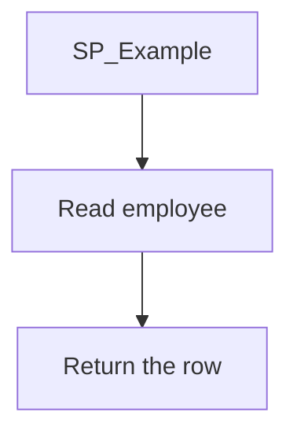
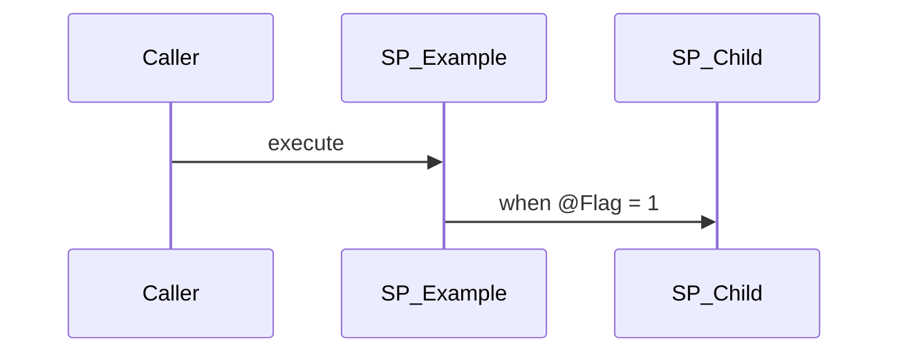

# Command: explain-stored-procedure

## Context

Business logic lives in SQL under `d:\TDG HRMS DB\HRMS-DATABASE\<Database>\`.
Read those scripts. Write the explanation in the Backstage app, not in the
database repository and not in `SourceCode/docs`.

Output home:

```
d:\hrms\apps\backstage\content\database\<database-slug>\<ObjectName>.md
```

Served at `/docs/database/<database-slug>/<ObjectName>`. Dropping the file is
enough — `lib/database-docs.ts` discovers it. Do not add a route or an index
file.

Each page is one procedure or one user-defined function. The run you start
with a procedure name also writes a page for every nested procedure and
function in its call tree.

## Task

Given a procedure name (`$ARGUMENTS`, or the text after
`/explain-stored-procedure`), read its script and write one Backstage page
for it and for every stored procedure and user-defined function it calls,
following that tree until it ends.

If the name is empty, stop and ask for one. Do not execute the procedure.
Do not modify SQL.

## Database slugs

Map the `HRMS-DATABASE` folder to the slug used by `content/wiki/baseline-*.md`:

| Folder | Slug |
|---|---|
| `HRMS` | `hrms` |
| `HRMS-TRAINING` | `hrms-training` |
| `HRMS-SURVEY` | `hrms-survey` |
| `HRMS_TRAVELNEXPENSE` | `hrms-travelnexpense` |
| `HRMS-RESOURCEALLOCATION` | `hrms-resourceallocation` |
| `HRM-TIMEPORT` | `hrm-timeport` |
| `HRMS-CRBBOOKING` | `hrms-crbbooking` |
| `HRMS-TranslationService` | `hrms-translationservice` |
| `HRMS-RewardNRecognition` | `hrms-rewardnrecognition` |
| `HRM-VMS` | `hrm-vms` |

If the same object name exists in more than one database, stop and ask which
one. Stay in that database for the rest of the tree unless a call is
qualified to another database — then use that database's slug and say so on
the page.

## Steps

1. **Resolve the script.** Search that database for the object name:
   - Procedures: `STOREPROCEDURE/` and `Stored Procedures/`
   - Functions: `FUNCTIONS/`
   Prefer the `sqlFile` path on the newest matching changeSet in
   `changelog/baseline-inventory-storeprocedure.xml`,
   `changelog/baseline-inventory-stored-procedures.xml`, or
   `changelog/baseline-inventory-functions.xml`.
   If it is not inventoried, use the copy whose parent folder is
   `STOREPROCEDURE`, `Stored Procedures`, or `FUNCTIONS`. Skip a numeric
   work-item folder such as `172636_173535`.

2. **Skip a page that is already current.** If
   `content/database/<slug>/<ObjectName>.md` exists, link it and leave the
   file. Rewrite it when the user asked to refresh, or when the SQL file is
   newer than the page. Still walk its callees.

   When you rewrite, keep the previous analysis the way product guides do:
   - Read `last-analyzed` on the current file. When that date is
     `YYYY-MM-DD` and is not today, copy the file to
     `content/database/<slug>/<ObjectName>/<last-analyzed>.md` unless that
     archive already exists. Leave existing archives unchanged.
   - A same-day rewrite overwrites the latest file only. Do not add a
     second archive.
   - Set `last-analyzed` on the new latest page to today's date
     (`YYYY-MM-DD`). The stable URL stays
     `/docs/database/<slug>/<ObjectName>`. The snapshot is served at
     `/docs/database/<slug>/<ObjectName>/<last-analyzed>`.

3. **Read the body.** Record only what the script shows:
   - purpose, from the header comment and the statements
   - parameters
   - ordered steps: branches, transactions, temp tables, result sets
   - tables read or written
   - direct calls

   A call is `EXEC` / `EXECUTE` of a named procedure, or a user-defined
   function invoked by name (`dbo.FN_…` and the same database's other
   functions in `FUNCTIONS/`). Skip SQL Server built-ins (`GETDATE`,
   `ISNULL`, `CAST`, `CONVERT`, `COALESCE`, `NULLIF`, `IIF`, `STRING_AGG`,
   `ROW_NUMBER`, `sys.sp_executesql`, and the rest of `sys.`).

   List `sp_executesql` and other dynamic SQL under **Unresolved calls**.
   Do not guess which object the string builds.

4. **Walk the call tree.** Write this object's page, then repeat these steps
   for every nested procedure and function. Keep a visited set. When an
   object calls one already in the set, link that page and do not write it
   again.

5. **Write the page** at
   `apps/backstage/content/database/<database-slug>/<ObjectName>.md`.
   The filename and the H1 are the object name. Link each callee to
   `/docs/database/<database-slug>/<ObjectName>`.

6. **Tell the user** the URL of the procedure they named, the count of
   pages written or left unchanged, and any archive path written.

## Page template

Frontmatter is a closed block. The loader strips it. `kind` is `procedure`
or `function`.

````markdown
---
object: SP_Example
kind: procedure
database: hrms
source: HRMS-DATABASE/HRMS/STOREPROCEDURE/SP_Example.sql
last-analyzed: <today's date, YYYY-MM-DD>
---

# SP_Example

## What it does

One short paragraph.

## Parameters

| Name | Direction | What it is for |
|---|---|---|
| `@EmployeeId` | in | Employee whose rows are read |

## Steps

1. First thing the script does, with the condition that guards it.

## Tables

| Table | Read or write |
|---|---|
| `dbo.TEmployee` | read |

## Procedures and functions it calls

| Object | Kind | When | Page |
|---|---|---|---|
| `SP_Child` | procedure | when `@Flag = 1` | [SP_Child](/docs/database/hrms/SP_Child) |

Write "Calls no other procedures or functions." when that is true.

## Unresolved calls

Dynamic SQL only. Omit this section when there is none.

## Flow



## Call sequence



When nothing is called, one line under this heading is enough: "Calls no
other procedures or functions."
````

Use standard mermaid fences. Cite the SQL path in **Steps**. Do not invent
parameters, branches, or callees that are not in the script.
