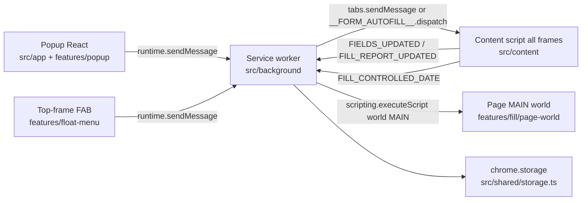

# Form Autofill

Chrome Manifest V3 extension in the HRMS Turborepo (`apps/autofill`). It scans form fields on allowed pages, fills random or scenario values, and keystroke-types so QA can exercise validation UI. It is **not** classic My Details or the Core API. UI is Ant Design only — do not import `@hrms/ui`. User-facing usage is in `README.md`; this file is the map for changing the code.

```bash
npm run dev --workspace=autofill      # Vite + CRX HMR on port 9100
npm run build --workspace=autofill    # tsc --noEmit && vite build → dist/
npm run test --workspace=autofill     # Vitest, once
npm run lint --workspace=autofill
```

From the repo root, `npm run autofill` is the production build. Load unpacked from `apps/autofill/dist` (`chrome://extensions` → Developer mode). After a manifest or content-script change, reload the extension **and** the target tab.

## Runtime

Three isolated contexts. They talk only through `src/shared/messaging.ts` (`MESSAGE.*`).



| Context | Entry | May do | Must not |
|---|---|---|---|
| Popup | `index.html` → `src/app/main.tsx` → `App.tsx` → `PopupPanel` | Render Ant Design UI; `chrome.runtime.sendMessage` | Touch the page DOM; call `chrome.storage` |
| Service worker | `src/background/service-worker.ts` | Route messages, host gate, context menus, storage, MAIN-world inject | Scan or fill the DOM itself |
| Content script | `src/content/content-script.ts` (`all_frames`, `document_idle`) | Scan, pick, fill, type, FAB (top frame only) | Call `chrome.storage` (throws outside the SW) |
| Page MAIN world | `fillControlledDateMainWorld` | React fiber / DatePicker commit | Import app modules or close over outer variables |

`globalThis.__FORM_AUTOFILL__` is the content-script API (`dispatch`, `toggleMenu`, `closeMenu`, `runAction`). `mountContentRuntime` installs it once. A later `executeScript` re-run **replaces `dispatch` only** — do not remount the FAB or stack listeners.

The SW fans a request out to every frame (or one `frameId` from a context menu) and `pickBestResponse` keeps the frame with the most fields or fills. Empty frames answer `{ ok: true, started: false }` for pick actions; do not treat that as overall success.

## Where code lives

```text
src/
  app/                  popup shell only (Ant Design ConfigProvider)
  background/           service worker + content-inject policy
  content/              message switch; no feature logic beyond routing
  features/<kebab>/     one feature per folder, barrel index.ts
  shared/               messaging contracts, storage, host gate, generators, toast
manifest.config.ts      MV3 manifest (hosts, commands, content_scripts)
vite.config.ts          CRX plugin, @ alias, port 9100, outDir dist
```

| Feature | Path | Role |
|---|---|---|
| `scan` | `src/features/scan` | Discover fields, kind heuristics, pick-root resolution |
| `pick-scan` | `src/features/pick-scan` | Inspector overlay; marks `data-form-autofill-root` |
| `fill` | `src/features/fill` | Instant fill, React setters, DatePicker, fill-session CSS |
| `auto-type` | `src/features/auto-type` | Per-character typing |
| `personas` | `src/features/personas` | Valid vs invalid email/phone profiles |
| `scenarios` | `src/features/scenarios` | My Details packs (IFSC, employment dates, contact) |
| `popup` | `src/features/popup` | Extension popup panels |
| `float-menu` | `src/features/float-menu` | Top-frame FAB + menu |
| `context-menu` | `src/features/context-menu` | Menu ids registered by the SW |
| `shortcuts` | `src/features/shortcuts` | Alt+Shift chords and Chrome `commands` |

New behavior goes in `src/features/<kebab-name>/` with a colocated `index.ts`. Cross-context types and `MESSAGE` constants go in `src/shared/messaging.ts` first — popup, SW, and content script must share that contract. Do not add a backend, SDK hook, or `fetch` client here.

Import with `@/` (`tsconfig.json` `paths`: `@/*` → `src/*`). Same-folder `./` is fine. Do not reach into another feature's private file when that feature already exports a barrel.

```ts
// ❌ BAD — parent-relative into another feature
import { fillFields } from "../../fill/fill-fields";

// ✅ GOOD
import { fillFields } from "@/features/fill";
import { MESSAGE } from "@/shared/messaging";
```

## Host allowlist

Built-in match patterns live in `ALLOWED_HOST_MATCH_PATTERNS` (`src/shared/allowed-hosts.ts`) and are copied into the manifest (`host_permissions` + `content_scripts.matches`) and context-menu `documentUrlPatterns`.

- Always allowed: `localhost` (including `*.localhost`), `127.0.0.1`, `[::1]`, `thedigitalgroup.com`, `*.thedigitalgroup.com`.
- Customer UAT hosts are **not** in the manifest. They are bare hostnames in `chrome.storage.local` (`autofill:customHosts`). Saving them calls `chrome.permissions.request` for `optional_host_permissions` (`http://*/*`, `https://*/*`).
- Runtime gate is `isAllowedPageUrl(url, extraHostnames)`. The SW disables `chrome.action` on other tabs (`DISALLOWED_PAGE_ERROR`). The content script refuses to mount until the URL passes, including after it loads extra hosts from the SW.
- Reject `<all_urls>`, `*`, and wildcard host patterns in `normalizeCustomHostInput`. Do not widen the built-in list to all HTTP origins.

Context menus stay on the built-in patterns only. Custom hosts get the action button and programmatic inject, not a new context-menu pattern, unless you change `getContextMenuCreateProperties` on purpose.

## Storage

`src/shared/storage.ts` is the only `chrome.storage` caller, and only the service worker may import it.

| Key | Area | Survives reload |
|---|---|---|
| `autofill:lastScan` | `session` (falls back to `local`) | No |
| `autofill:settings` | session | No |
| `autofill:lastFillReport` | session | No |
| `autofill:customHosts` | `local` | Yes |
| `autofill:fabPosition` | `local` | Yes |

Popup and content script read/write these through `GET_*` / `SET_*` / `FIELDS_UPDATED` / `FILL_REPORT_UPDATED`. `normalizeSettings` drops unknown persona and scenario ids back to defaults.

## Content-script injection

Re-injecting CRXJS content scripts (`chrome.scripting.executeScript({ files })`) flashes or reloads the tab. Policy is in `src/background/content-inject.ts`:

- `shouldPrepareContentScripts` is true only for `SCAN`, `START_PICK_SCAN`, `START_PICK_FILL`, `START_PICK_AUTO_TYPE`.
- Instant `FILL` and `AUTO_TYPE` must **not** probe or inject first. `sendToTab` tries `tabs.sendMessage` / `__FORM_AUTOFILL__.dispatch` and injects only when the content API is missing.
- Readiness is `globalThis.__FORM_AUTOFILL__.dispatch` in the isolated world, not "script tag exists".

Do not "fix" a fill race by calling `ensureContentScripts` before every message.

## Scan and pick

`scanFields` walks inputs, textareas, and selects (skips hidden, submit, button). Group hosts (`.MuiFormControl-root`, `.ant-form-item`, `.ant-select`, `.ant-picker`) collapse inner extras; native controls **outside** those hosts are still collected so mixed pages fill. `detectFieldKind` (`field-types.ts`) classifies `text | textarea | email | phone | number | date | select | radio`. Kind `"unknown"` is declared but unused — unrecognized labels are `text`.

**Do not detect the page UI library, and do not map field titles to kinds.** Classify each control from native `type` / `inputMode` / `autocomplete`, then ARIA, then a calendar affordance. Per-control class names (`.ant-picker`, MUI DatePicker hosts) are last-resort hints on that field only. Never `if (detectLibrary() === "antd")` and never `if (label === "Salary")`.

Date wins over Autocomplete: `type="date"` / `datetime-local`, or a calendar affordance (`hasCalendarSignal` — accessible name, `aria-haspopup=dialog`, picker host, or sectioned spinbuttons). DatePicker inputs that use `role="combobox"` must not be classified as `select` before the date check. Optional scenario packs may still match labels (IFSC, employment From/To).

Pick mode (`element-picker.ts` + `resolve-pick-root.ts`):

- Dialog / drawer / modal shells (`role="dialog"`, `.MuiDialog-paper`, `.MuiDrawer-paper`, `.MuiModal-root`) are a **ceiling**, not the picked section.
- A section is a `space-y*` node, `MuiPaper-root` / `MuiCard-root`, or a heading plus at least five controls.
- The chosen root is marked `data-form-autofill-root`. Later fill/type uses that mark (`getMarkedScanRoot`) unless the request passes another `rootSelector`.
- Frames with `countFillableControls === 0` return `started: false` so the picker is not drawn on empty chrome.

## Fill

Fill is **framework-agnostic**. `fillFields` (`features/fill/fill-fields.ts`) orchestrates; each control runs a tactic chain until a value commits. Unknown widgets get a new tactic in the chain — do not add page-specific `if (label === …)` in `fillFields`.

Value order is scenario override → persona → `generateValue` (`resolveScenarioValue`). HRMS packs (IFSC Validate, Monthly CTC skip) are optional overlays, not required for a random allowed-host form.

Skipped (report reason, not a failure):

- Disabled, read-only text (date / select / radio stay fillable — many pickers mark the input read-only), label matching `/monthly\s*ctc/i`.
- Already has a value, unless `overwriteExistingValues` (default **false**).
- Element not found.

Dates fill **first** so a later focus does not tear down an open calendar. Date tactics: native `type=date` → MAIN-world React fiber → type+blur (writable, non-combobox) → calendar (`[role=gridcell]` / day cells; MUI year/month/day classes last). Combobox / select tactics: native `<select>` → newly opened `[role=listbox]` / `aria-controls` → extra portal hosts (`.ant-select-dropdown`, `.MuiAutocomplete-popper`) → typed value only when `allowTypedValue`. Failures record the last tactic in the fill report.

IFSC labels that fill successfully click a nearby enabled **Validate** button. `startFillSession` hides listbox/calendar portals (ARIA plus MUI/Ant Design class hints) and `[data-testid="save-in-progress-overlay"]`; it must not hide Dialog, Drawer, or `.ant-modal` (that is the form). `endFillSession` always runs in `finally`.

React-controlled inputs go through `setNativeValue` (reset `_valueTracker`, native setter, `input` + `change`). Assigning `.value` alone does not update React state.

### MAIN-world dates

MUI DatePicker ignores a string `onChange` (`isFinishedPickerDate` rejects it). The content script marks the input `data-form-autofill-target` and sends `FILL_CONTROLLED_DATE`. The SW injects `fillControlledDateMainWorld` with `world: "MAIN"`.

Chrome serializes that function with `toString()`. It must stay **self-contained**: no imports, no closures over module scope, helpers declared inside the function. The isolated-world wrapper is `fillControlledDateInPageWorld` in the same file — do not merge the two.

## Auto-type

`typeKeystroke` focuses, clears, then types one character at a time (`keydown`, `setNativeValue`, `input`, `keyup`) so validators see real keystrokes. Default delay is `typingDelayMs` (60). `startWithInvalid` types an invalid value, blurs, then types a valid one.

`autoTypeFields` walks the same root as fill and skips non-empty fields unless overwrite is on. Selects are skipped (`Select (use Fill)`). Read-only fields are skipped except radios, so a read-only MUI date input is not typed. Context menu **Auto-type into this field** sets `useContextTarget` and uses the element captured on `contextmenu` in that frame.

## Personas and scenarios

Add a persona or scenario by extending the const arrays and the id unions — do not branch on magic strings in the fill loop.

| Module | Ids | Effect |
|---|---|---|
| `personas.ts` | `random-valid` (default), `invalid-contact` | Forces invalid email/phone (kind or label) |
| `scenarios.ts` | `none` (default), `bank-india`, `employment-dates`, `contact` | Label regex overrides: `fixed`, `valid`, or `invalid` |

`bank-india` uses `SCENARIO_IFSC_FIXTURE` (`HDFC0001234`). `employment-dates` shares one `generateDateRange()` for From and To. Scenario overrides win over the persona except where `resolveScenarioValue` special-cases date-like labels.

Settings the popup persists: `activePersonaId`, `activeScenarioId`, `overwriteExistingValues`, `typingDelayMs`, `startWithInvalid`. The SW copies persona / scenario / overwrite onto `FILL` and `START_PICK_FILL` when the sender omitted them (`enrichFillProfile`).

## Popup, FAB, context menu

- **Popup** (`features/popup/index.tsx`): Pick & scan, Scan page, Pick & fill, Pick & type. When field checkboxes are selected, Alt+Shift+F becomes Fill selected and Alt+Shift+T becomes Auto-type selected (`resolvePopupShortcutAction`). Checked ids are sent as `fieldIds` and do **not** start a new pick.
- **FAB** (`shouldMountFloatMenu`): top frame only (`window.top === window.self`). One button per tab. Position is dragged, clamped, and stored via `GET_FAB_POSITION` / `SET_FAB_POSITION`. Nested frames have no FAB; their Alt+Shift+M / Esc forward `TOGGLE_FLOAT_MENU` / `CLOSE_FLOAT_MENU` to the top frame. Menu actions are built by `buildRequestForAction` — keep `FLOAT_MENU_ITEMS` in the same order as the popup `ActionBar`.
- **Context menus** (`MENU_IDS`): "Fill form with random data" (editable, page, frame) and "Auto-type into this field" (editable). Fill uses the active persona/scenario. Auto-type uses `useContextTarget` plus typing settings. Register on install, startup, and SW eval (`createContextMenus` calls `removeAll` first).

## Shortcuts

Source of truth: `SHORTCUT_BINDINGS` in `features/shortcuts/shortcuts.ts`. In-page listeners are capture-phase Alt+Shift+letter with no Ctrl/Meta (`bindPageShortcuts`), so they work while an input or iframe is focused. Esc closes the FAB menu and cancels the picker.

Chrome allows **four** `suggested_key` entries. Those four are Pick & scan (`P`), Scan page (`S`), Pick & fill (`F`), Pick & type (`T`). Toggle menu (`M`) is in-page only (`suggestInChrome: false`). `manifest.config.ts` spreads `getChromeCommandsManifest()` — do not hand-edit `commands` in the manifest.

## UI

Do **not** use `@hrms/ui` (or `@tdg/component-library`) in this app. Components come from `antd`. Icons come from `@ant-design/icons`. Nothing else.

```tsx
// ❌ BAD
import { Button } from "@hrms/ui";

// ✅ GOOD
import { Button, Space, Tooltip } from "antd";
import { AimOutlined, FormOutlined } from "@ant-design/icons";
```

The popup shell is `ConfigProvider` + `App` in `src/app/App.tsx`. The FAB uses the same outlined icons as `ActionBar` (`AimOutlined`, `ReloadOutlined`, `FormOutlined`, `FontSizeOutlined`) but is not an Ant Design component tree. Tailwind v4 utilities must use the `autofill:` prefix (`autofill:flex`, `autofill:text-xs`). The popup is a fixed card (`autofill:w-[380px]`), not a routed app.

Show in-progress state on the control that started the work (`scanning`, `picking`, `filling`, `typing` in `PopupPanel`). Page outcomes use `showPageToast` / `toastFillResult` / `toastAutoTypeResult` (`src/shared/page-toast.ts`). The popup surfaces SW errors in an Ant Design `Alert`. Do not add another toast library.

## Tests

Colocate `*.test.ts` / `*.test.tsx` next to the module. Vitest + jsdom + globals (`vitest.config.ts`). Cover positive, negative, and edge cases for any behavior you change (empty input, unknown persona/scenario id, disallowed URL, disabled/read-only/already-filled, MAIN-world function staying serializable).

```bash
npx vitest run src/features/fill/fill-fields.test.ts
```

Run the targeted files before calling the change done. There is no Playwright suite in this app.

## Changing a flow

1. Add or extend the `MESSAGE` variant and its request/response types in `messaging.ts`.
2. Handle it in `dispatchAutofillMessage` (`content-script.ts`) if it touches the DOM.
3. Handle storage, host checks, and MAIN-world inject in the service worker. Return `true` from `onMessage` when you `sendResponse` asynchronously.
4. If the FAB or a Chrome command can trigger it, add the action in `float-menu-logic.ts` and `SHORTCUT_BINDINGS` together.
5. Update the popup only when the user must see or configure it.

```ts
// ❌ BAD — storage from the popup or content script
await chrome.storage.local.set({ "autofill:settings": next });

// ✅ GOOD — popup asks the service worker
await chrome.runtime.sendMessage({ type: MESSAGE.SET_SETTINGS, settings: next });

// ❌ BAD — MAIN-world helper closes over an import
export async function fillControlledDateMainWorld() {
  return formatFromGenerators();
}

// ✅ GOOD — everything the page needs is declared inside the function
export async function fillControlledDateMainWorld(marker: string, value: string) {
  const months = ["Jan", "Feb", "Mar", /* … */ "Dec"];
  const element = document.querySelector(`[data-form-autofill-target="${marker}"]`);
  // …
}
```
