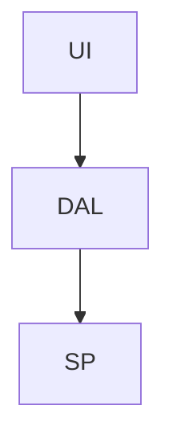
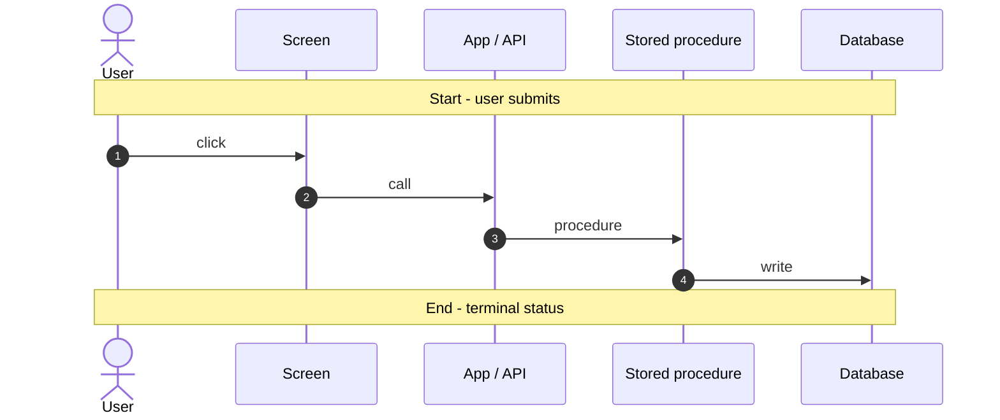

<!-- BEGIN:nextjs-agent-rules -->

# This is NOT the Next.js you know

This version has breaking changes — APIs, conventions, and file structure may all differ from your training data. Read the relevant guide in `node_modules/next/dist/docs/` (resolved from this file's directory; in monorepos the `next` package may not be visible from the repo root) before writing any code. Heed deprecation notices.

This block is written and re-added by `next dev` — verify at `node_modules/next/dist/server/lib/generate-agent-files.js`. Removing it from a diff only re-creates the uncommitted change; committing it with your work keeps the tree clean.

<!-- END:nextjs-agent-rules -->

# Backstage

Internal documentation site for HRMS. Next.js 16 App Router + React 19. Published feature guides are markdown on disk; Entra (or local-dev) auth and proposal APIs live as Next.js route handlers. Port **5001**. Must run as a Node server with a writable `content/` tree (`next start` / `next dev`) — not a static export.

```bash
npm run backstage                          # from repo root
npm run dev --workspace=apps/backstage     # same
```

`cwd` for `process.cwd()` in `lib/*` is `apps/backstage/` when the workspace script runs.

## Routes

| Path | Content | Loader |
|---|---|---|
| `/` | Landing | `app/page.tsx` |
| `/docs`, `/docs/[slug]` | Hand-authored guides + DB baseline dumps | `lib/docs.ts` ← `content/wiki/*.md` |
| `/wiki`, `/wiki/[[...slug]]` | Mirrored TDG HRMS DB wiki | `lib/llm-wiki.ts` ← `content/llm-wiki/**/*.md` |
| `/features`, `/features/[...slug]` | Published feature guides (latest + dated archives) | `lib/features.ts` ← `content/features/**/*.md` |
| `/features/edit/[...slug]` | In-app editor (signed-in) | writes a proposal, does not overwrite latest |
| `/features/proposals`, `/features/proposals/[id]` | Admin review queue | `content/features/_proposals/` |

Adding a markdown file under the matching `content/` folder is enough — slugs are discovered with `readdirSync`. Do not register routes by hand.

## Content trees — do not mix them

- **`content/features/<menu-folder>/<slug>.md`** — published latest, generated by `/document-feature` or Admin approve. Dated snapshots live at `content/features/<menu-folder>/<slug>/YYYY-MM-DD.md` and are served at `/features/<menu-folder>/<slug>/YYYY-MM-DD`. Nav, index, and search list latest only. Do not edit archive files.
- **`content/features/_proposals/`** — unpublished in-app proposals (gitignored). One pending proposal per slug.
- **`content/llm-wiki/`** — **byte-for-byte mirror** of `d:\TDG HRMS DB\llm-wiki\`. Never edit in place. Sync with `/sync-llm-wiki`. Cursor: `apps/backstage/.llm-wiki-sync-state.json`.
- **`content/wiki/`** — hand-authored Docs pages (baselines, liquibase notes). Never touch from the wiki-sync command.

## Feature versioning and contributions

Latest URL stays stable (`/features/lms/reports`). When published `last-analyzed` is a previous calendar day, the next publish copies that file to `<slug>/<last-analyzed>.md` first (immutable if it already exists), then overwrites latest with today's date.

In-app **Edit** (Entra sign-in) files a proposal. The live page does not change until an Admin (`Backstage.Admin` app role) approves. Reject requires a reason. `/document-feature` is a privileged regen: if `_proposals` has a pending row for that slug, **stop**. Otherwise freeze-then-overwrite as above. Same-day republish does not create a second archive.

Auth env lives in `apps/backstage/.env.example`. Redirect URI: `http://localhost:5001/api/auth/callback/microsoft-entra-id`. App role: `Backstage.Admin`. Local mock: `BACKSTAGE_DEV_AUTH=1` (optional `BACKSTAGE_DEV_ADMIN=1`) — never in production.

## Feature guides

YAML frontmatter is stripped before render (`lib/features.ts`, CRLF-safe). Allowed keys:

```yaml
---
confidence: high
last-analyzed: 2026-08-14
menu: Leave & Attendance
submenu: L&A Tasks
---
```

`menu` / `submenu` must match the HRMS left-nav (`TDynamicMenuHierarchy`). Features that are not in the sidebar (login, session) use `menu: Platform`. On disk the file lives at `content/features/<menu-folder>/<slug>.md` (`menuToFolderSlug` in `lib/feature-menu.ts`). The Features index and left nav group by these keys in sidebar order. `submenu` is optional.

`last-analyzed` is shown under the H1 as `Last analyzed: YYYY-MM-DD` (`feature-article.tsx`). Do **not** put `sources:` in YAML — an unstripped `---` fence renders as a horizontal rule above the title. Source inventory goes in a trailing `## Reference` section.

Required section order: Overview → Workflow (mermaid flowchart) → Request journey (mermaid sequenceDiagram) → Entry points → Code → database call chain → API endpoints → Stored procedures & tables → Table relationships (mermaid erDiagram) → Known gaps → Reference.

````markdown



````

`MermaidAwarePre` in `lib/markdown-components.tsx` intercepts `language-mermaid` fences. Write standard mermaid — nothing app-specific.

H2/H3 ids for the TOC are produced twice independently (`extractSections` and `createHeadingComponents`) via `createSlugger()` in `lib/slugify.ts`. Create a **fresh slugger per document**. Do not share one across pages.

## Markdown rendering

All three surfaces use `react-markdown` + `remark-gfm`. Shared pieces live in `lib/markdown-components.tsx` (`ScrollableTable`, `MermaidAwarePre`, heading id components). Wiki markdown links ending in `.md` are rewritten to in-app `/wiki/...` routes by `resolveWikiLink`. Docs files that do **not** start with `# ` render as a `<pre>` (`format: "text"`), not markdown.

## UI / code conventions

Backstage does **not** use `@hrms/ui`. Styling is Tailwind 4 + `@tailwindcss/typography` (`prose prose-slate dark:prose-invert`) and the `dark` class on `<html>`. Dark mode: `ThemeToggle` + inline boot script in `app/layout.tsx`.

- Server Components by default. `"use client"` only for interactivity (`theme-toggle`, `feature-nav`, `table-of-contents`, `mermaid-diagram`, editor/review, version select).
- Explicit return types: `): React.JSX.Element`.
- Dynamic route `params` is a `Promise` (Next 16) — `const { slug } = await params`.
- `generateStaticParams` on every dynamic page (`[slug]`, `[...slug]`).
- Keep mermaid zoom CSS in `app/globals.css` in sync with `lib/mermaid-diagram.tsx` (transform-origin `0 0`).
- Import app modules with the `@/` alias (`tsconfig.json` `paths`: `@/*` → `./*`). Parent-relative `../` is banned (`no-restricted-imports`). Same-directory `./` is allowed (colocated siblings and CSS).

```tsx
// ❌ BAD — parent-relative
import { getAllFeatureDocs } from "../../lib/features";

// ✅ GOOD
import { getCurrentFeatureDocs } from "@/lib/features";
import { FeatureIndex } from "@/components/features/feature-index";

// ✅ GOOD — same folder
import { ReadModeToggle } from "./read-mode";
import "./globals.css";
```

```tsx
// ❌ BAD — register a feature in a hardcoded list
const FEATURES = ["leave-management", "workflow"];

// ✅ GOOD — drop content/features/<menu-folder>/<slug>.md; getFeatureSlugs() picks it up
```

```yaml
# ❌ BAD — sources in frontmatter leak as an <hr> + metadata dump
sources:
  - some/file.ts

# ✅ GOOD
---
confidence: high
last-analyzed: 2026-08-14
menu: Leave & Attendance
submenu: L&A Tasks
---
```
