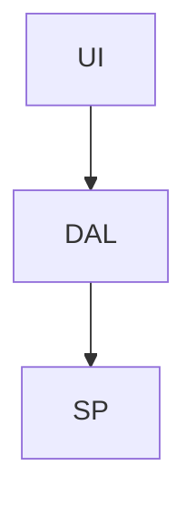
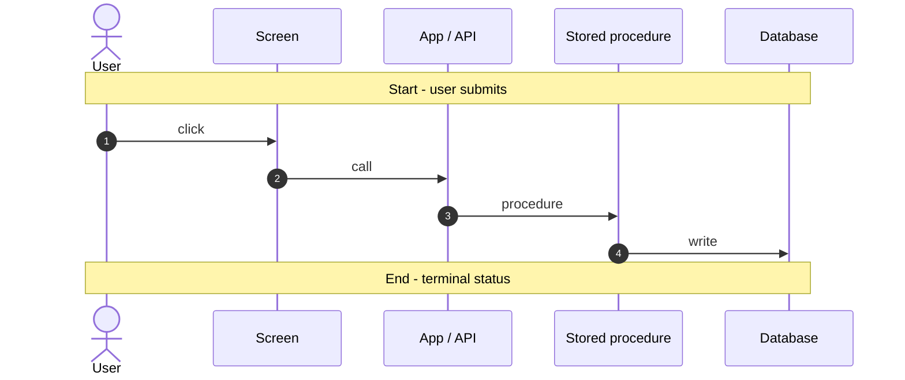

<!-- BEGIN:nextjs-agent-rules -->

# This is NOT the Next.js you know

This version has breaking changes — APIs, conventions, and file structure may all differ from your training data. Read the relevant guide in `node_modules/next/dist/docs/` (resolved from this file's directory; in monorepos the `next` package may not be visible from the repo root) before writing any code. Heed deprecation notices.

This block is written and re-added by `next dev` — verify at `node_modules/next/dist/server/lib/generate-agent-files.js`. Removing it from a diff only re-creates the uncommitted change; committing it with your work keeps the tree clean.

<!-- END:nextjs-agent-rules -->

# Backstage

Internal documentation site **and** operator console for HRMS. Next.js 16 App Router + React 19. Docs/wiki/guides are markdown on disk; Entra (or local-dev) auth and proposal APIs live as Next.js route handlers. Operator tools (former Troubleshooter) live under `/employers` with Ant Design + `@hrms/db`. Port **5001**. Must run as a Node server with a writable `content/` tree (`next start` / `next dev`) — not a static export.

```bash
npm run backstage                          # from repo root
npm run troubleshooter                     # alias → backstage
npm run dev --workspace=apps/backstage     # same
```

`cwd` for `process.cwd()` in `lib/*` is `apps/backstage/` when the workspace script runs.

## App architecture (feature-based)

Backstage is a **feature-based** Next.js app. Interactive product code is organized by domain and capability — not by technical layer dumps (`components/`, `hooks/`, `queries/` at the root). Follow this for every new operator or app capability.

```text
apps/backstage/
  app/                         thin route map only (URL shape ≠ folder shape)
    docs/                      docs + product guides (markdown surfaces)
    wiki/
    (ops)/                     shared antd layout (no URL segment)
      employers/               operator console routes (/employers/...)
      login/                   root-admin login (/login)
    api/
  features/                    interactive capabilities (domain / capability)
    auth/                      app-wide (ops login) — no domain
    employee/
      access|business-unit|history|leave|login|profile|search|sections
    employer/
      explore|fields|picker|roles|settings|uploads|workflows
  shared/                      cross-cutting only (auth helpers, db, ui, theme, resolve)
  components/                  docs-chrome UI (site header, guides article chrome, auth menu)
  lib/                         content loaders + markdown helpers (docs/wiki/guides)
  content/                     on-disk markdown trees (wiki, guides, llm-wiki)
```

### Feature modules (`features/`)

Nest by **domain**, then **capability**. Domain folders are singular. Leaf folders and files are the capability only — do not repeat `employee-` / `employer-` on the folder or file.

```text
# ❌ BAD — flat prefix folders / layer dumps
features/employee-access/employee-access-screen.tsx
features/employer-settings/
lib/queries/getEmployeeAccess.ts
features/roles/                       # tenant roles belong under employer

# ✅ GOOD
features/employee/access/access-screen.tsx
features/employer/settings/settings-screen.tsx
features/employer/roles/roles-screen.tsx
```

Rules:

- Each capability folder has a leaf barrel `index.ts`. No domain-level barrel (`features/employee/index.ts`). Import the leaf: `@/features/employee/access`.
- Same capability on two domains = two folders (`employer/roles` vs a future `employee/roles`). Do not share one `features/roles`.
- App-wide concerns stay top-level under `features/` (`auth`) or in `shared/` (`shared/employee` is resolve helpers, not a screen).
- `app/` stays thin: import a screen from `@/features/...` and render it. Do not put business logic in route files.
- Do not flatten feature folders to match URL segments. Do not grow a global `lib/queries` dump for ops data.
- **New interactive area:** add `features/<domain>/<capability>/` plus a thin `app/(ops)/...` route (under `/employers/...` for ops). Prefer extending this tree over placing new screens in `components/` or `lib/`.

Import with `@/` (`@/features/employer/picker`, `@/shared/db`, `@/lib/guides`). No parent-relative `../`. Same-directory `./` is allowed.

### Two UI stacks (do not mix casually)

| Surface | URL prefix | UI | Data |
|---|---|---|---|
| Docs / Wiki / Guides | `/docs`, `/wiki`, `/docs/guides` | Tailwind 4 + `prose` | Markdown on disk via `lib/*` |
| Operator console | `/employers`, `/login` | antd 6 + `@ant-design/icons` | `@hrms/db` only |

Ops screens: antd only (no `@hrms/ui`). Docs chrome stays Tailwind. Mount antd providers only under the `app/(ops)` route group.

### Docs content vs Features code

- **Product guides** (markdown about HRMS modules) live under `content/guides` and URLs `/docs/guides/...` — documentation, not the `features/` code tree.
- **Features** in the app sense means interactive operator capabilities under `features/` and routes `/employers/...`.

## Routes

| Path | Content | Loader |
|---|---|---|
| `/` | Landing | `app/page.tsx` |
| `/docs`, `/docs/[slug]` | Hand-authored guides, DB changelog, baseline dumps | `lib/docs.ts` ← `content/wiki/*.md` |
| `/wiki`, `/wiki/[[...slug]]` | Mirrored TDG HRMS DB wiki | `lib/llm-wiki.ts` ← `content/llm-wiki/**/*.md` |
| `/docs/guides`, `/docs/guides/[...slug]` | Published product guides (latest + dated archives) | `lib/guides.ts` ← `content/guides/**/*.md` |
| `/docs/guides/edit/[...slug]` | In-app editor (signed-in) | writes a proposal, does not overwrite latest |
| `/docs/guides/proposals`, `/docs/guides/proposals/[id]` | Admin review queue | `content/guides/_proposals/` |
| `/employers`, `/login` | Operator console home + root-admin login | `features/employer/picker`, `features/auth` |
| `/employers/[employerId]/...` | Employer/employee diagnostics and gated writes | `features/employee/*`, `features/employer/*` |

Adding a markdown file under the matching `content/` folder is enough — slugs are discovered with `readdirSync`. Do not register routes by hand.

## Content trees — do not mix them

- **`content/guides/<menu-folder>/<slug>.md`** — published latest, generated by `/document-feature` or Admin approve. Dated snapshots live at `content/guides/<menu-folder>/<slug>/YYYY-MM-DD.md` and are served at `/docs/guides/<menu-folder>/<slug>/YYYY-MM-DD`. Nav, index, and search list latest only. Do not edit archive files.
- **`content/guides/_proposals/`** — unpublished in-app proposals (gitignored). One pending proposal per slug.
- **`content/llm-wiki/`** — **byte-for-byte mirror** of `d:\TDG HRMS DB\llm-wiki\` when that folder exists. Sync with `/sync-llm-wiki`. Cursor: `apps/backstage/.llm-wiki-sync-state.json`. `/track-db-updates` may patch catalog/domain pages for objects in *this run's* SQL delta (edit the DB-repo wiki when it exists, otherwise this tree). Do not hand-edit otherwise.
- **`content/wiki/`** — hand-authored Docs pages (baselines, liquibase notes). `/track-db-updates` owns `database-changelog.md` only. Wiki-sync must not touch this folder. Cursor: `apps/backstage/.db-updates-state.json`.

## Operator console (`/employers`)

Uses the feature-based layout above. `app/(ops)/` is the thin route map (antd providers); domain code is `features/<domain>/<capability>/`.

- Components are `antd` only; icons are `@ant-design/icons` only.
- Data access goes through `@hrms/db`. Do not use raw `mssql` or HRMS stored procedures.
- Ops auth: `TROUBLESHOOTER_ADMIN_*` Credentials provider (session `isRootAdmin`). Docs edit/proposals use Entra / `Backstage.Admin` (`isAdmin`).
- Writes require `TROUBLESHOOTER_WRITES_ENABLED=1`, non-production `NODE_ENV`, and the cookie-selected env in `TROUBLESHOOTER_WRITES_ENVS`.
- Site chrome (Docs/Wiki/Console header) is hidden on `/employers/*` and `/login`; the antd `AppShell` provides ops navigation.
- Display dates through `@/shared/format-date` (`DD-MMM-YYYY`, plus `HH:mm:ss` when timed). Do not render raw ISO strings.
- Server Components: no dotted Ant Design subcomponents (`Typography.Title`) — import `Title` / `Text` / `Paragraph` from `@/shared/ui` or `antd/es/...`. Pass serializable `items` to `Descriptions`. Table `columns` with `render` belong in `"use client"` files. Use Alert `title`, not `message`. Helper copy goes in `PageHelp`, not full-width banners.

## Feature versioning and contributions

Latest URL stays stable (`/docs/guides/lms/reports`). When published `last-analyzed` is a previous calendar day, the next publish copies that file to `<slug>/<last-analyzed>.md` first (immutable if it already exists), then overwrites latest with today's date.

In-app **Edit** (Entra sign-in) files a proposal. The live page does not change until an Admin (`Backstage.Admin` app role) approves. Reject requires a reason. `/document-feature` is a privileged regen: if `_proposals` has a pending row for that slug, **stop**. Otherwise freeze-then-overwrite as above. Same-day republish does not create a second archive.

Auth env lives in `apps/backstage/.env.example`. Redirect URI: `http://localhost:5001/api/auth/callback/microsoft-entra-id`. App role: `Backstage.Admin`. Local mock: `BACKSTAGE_DEV_AUTH=1` (optional `BACKSTAGE_DEV_ADMIN=1`) — never in production.

## Feature guides

YAML frontmatter is stripped before render (`lib/guides.ts`, CRLF-safe). Allowed keys:

```yaml
---
confidence: high
last-analyzed: 2026-08-14
menu: Leave & Attendance
submenu: L&A Tasks
---
```

`menu` / `submenu` must match the HRMS left-nav (`TDynamicMenuHierarchy`). Features that are not in the sidebar (login, session) use `menu: Platform`. On disk the file lives at `content/guides/<menu-folder>/<slug>.md` (`menuToFolderSlug` in `lib/feature-menu.ts`). The Features index and left nav group by these keys in sidebar order. `submenu` is optional.

`last-analyzed` is shown under the H1 as `Last analyzed: YYYY-MM-DD` (`feature-article.tsx`). Do **not** put `sources:` in YAML — an unstripped `---` fence renders as a horizontal rule above the title. Source inventory goes in a trailing `## Reference` section.

Required section order: Overview → Workflow (mermaid flowchart) → Request journey (mermaid sequenceDiagram) → Entry points → Code → database call chain → API endpoints → Stored procedures & tables → Table relationships (mermaid erDiagram) → Known gaps → Reference.

````markdown

```mermaid
flowchart TD
  UI --> DAL --> SP
```


```mermaid
sequenceDiagram
  autonumber
  actor User
  participant UI as Screen
  participant App as App / API
  participant SP as Stored procedure
  participant DB as Database
  Note over User,DB: Start - user submits
  User->>UI: click
  UI->>App: call
  App->>SP: procedure
  SP->>DB: write
  Note over User,DB: End - terminal status
```
````

`MermaidAwarePre` in `lib/markdown-components.tsx` intercepts `language-mermaid` fences. Write standard mermaid — nothing app-specific.

H2/H3 ids for the TOC are produced twice independently (`extractSections` and `createHeadingComponents`) via `createSlugger()` in `lib/slugify.ts`. Create a **fresh slugger per document**. Do not share one across pages.

## Markdown rendering

All three surfaces use `react-markdown` + `remark-gfm`. Shared pieces live in `lib/markdown-components.tsx` (`ScrollableTable`, `MermaidAwarePre`, heading id components). Wiki markdown links ending in `.md` are rewritten to in-app `/wiki/...` routes by `resolveWikiLink`. Docs files that do **not** start with `# ` render as a `<pre>` (`format: "text"`), not markdown.

## UI / code conventions

Styling is Tailwind 4 + `@tailwindcss/typography` (`prose prose-slate dark:prose-invert`) and the `dark` class on `<html>`. Dark mode: `ThemeToggle` + inline boot script in `app/layout.tsx`.

- Server Components by default. `"use client"` only for interactivity (`theme-toggle`, `feature-nav`, `table-of-contents`, `mermaid-diagram`, editor/review, version select).
- Explicit return types: `): React.JSX.Element`.
- Dynamic route `params` is a `Promise` (Next 16) — `const { slug } = await params`.
- `generateStaticParams` on every dynamic page (`[slug]`, `[...slug]`).
- Keep mermaid zoom CSS in `app/globals.css` in sync with `lib/mermaid-diagram.tsx` (transform-origin `0 0`).
- Import app modules with the `@/` alias (`tsconfig.json` `paths`: `@/*` → `./*`). Parent-relative `../` is banned (`no-restricted-imports`). Same-directory `./` is allowed (colocated siblings and CSS).

```tsx
// ❌ BAD — parent-relative
import { getAllFeatureDocs } from "../../lib/guides";

// ✅ GOOD
import { getCurrentFeatureDocs } from "@/lib/guides";
import { FeatureIndex } from "@/components/guides/feature-index";

// ✅ GOOD — same folder
import { ReadModeToggle } from "./read-mode";
import "./globals.css";
```

```tsx
// ❌ BAD — register a feature in a hardcoded list
const FEATURES = ["leave-management", "workflow"];

// ✅ GOOD — drop content/guides/<menu-folder>/<slug>.md; getFeatureSlugs() picks it up
```

```yaml
# ❌ BAD — sources in frontmatter leak as an <hr> + metadata dump
sources:
  - some/file.ts

# ✅ GOOD
---
confidence: high
last-analyzed: 2026-08-14
menu: Leave & Attendance
submenu: L&A Tasks
---
```
