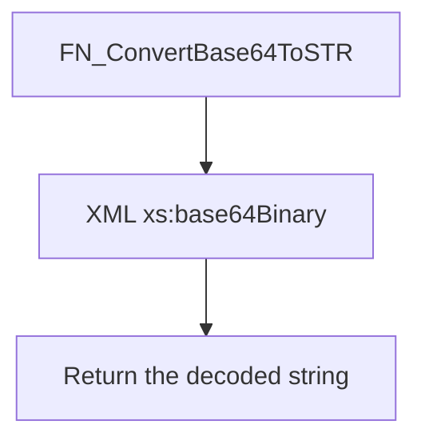

# FN_ConvertBase64ToSTR

## What it does

Decodes a Base64 string to text. It reads `xs:base64Binary` through an XML value and casts the bytes to `VARCHAR`.

## Parameters

| Name | Direction | What it is for |
|---|---|---|
| `@encodedString` | in | `VARCHAR(100)` Base64 text to decode |

## Steps

In `HRMS-DATABASE/HRMS/FUNCTIONS/FN_ConvertBase64ToSTR.sql`:

1. Select `xs:base64Binary(sql:variable("@encodedString"))` from `CAST(N'' AS XML).value`, cast the `VARBINARY(MAX)` result to `VARCHAR(MAX)`, and store it in `@decodedString`.
2. Return `@decodedString`. The declared return type is `VARCHAR(100)`.

## Tables

| Table | Read or write |
|---|---|
| — | The function does not read or write a table |

## Procedures and functions it calls

Calls no other procedures or functions.

## Flow

## Call sequence

Calls no other procedures or functions.
