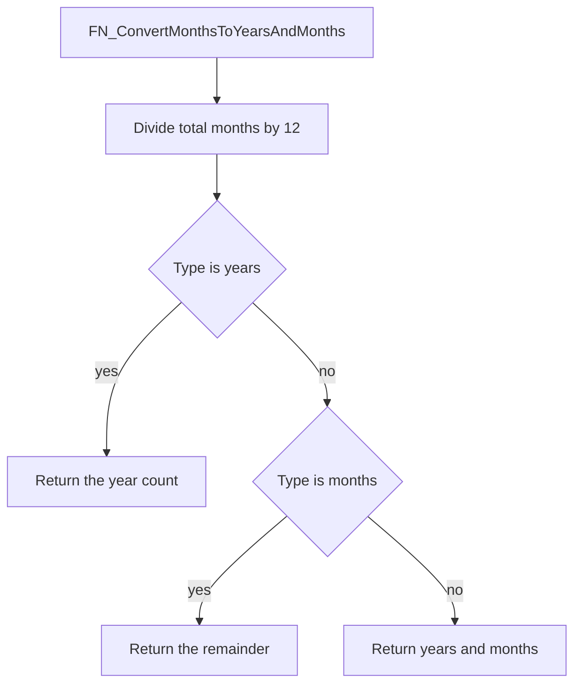

# FN_ConvertMonthsToYearsAndMonths

## What it does

Splits a total number of months into whole years and a remainder, then returns one of those parts as text. The header cites PBI 87825, with a later change for PBI 94553.

## Parameters

| Name | Direction | What it is for |
|---|---|---|
| `@TotalMonths` | in | Integer month count to divide by 12 |
| `@Type` | in | `NVARCHAR(10)` selector compared with the literals `years` and `months` |

## Steps

In `HRMS-DATABASE/HRMS/FUNCTIONS/FN_ConvertMonthsToYearsAndMonths.sql`:

1. Set `@Years` to `@TotalMonths / 12` and `@Months` to `@TotalMonths % 12`.
2. When `@Type = 'years'`, return `@Years` as `NVARCHAR(10)`.
3. When `@Type = 'months'`, return `@Months` as `NVARCHAR(10)`.
4. Otherwise return both numbers as text, separated by a comma and a space.

## Tables

| Table | Read or write |
|---|---|
| — | The function does not read or write a table |

## Procedures and functions it calls

Calls no other procedures or functions.

## Flow

## Call sequence

Calls no other procedures or functions.
