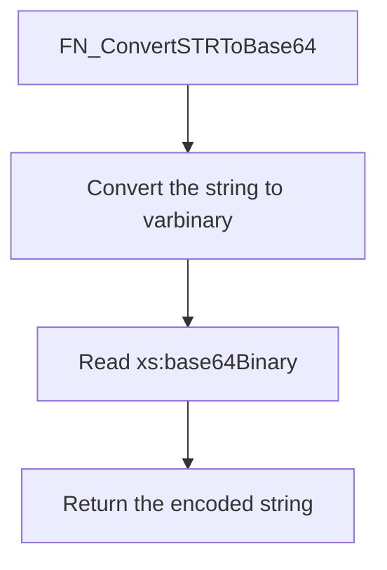

# FN_ConvertSTRToBase64

## What it does

Encodes a string as Base64. It converts the input to `VARBINARY`, then reads `xs:base64Binary` through an XML value. It returns that encoded string.

## Parameters

| Name | Direction | What it is for |
|---|---|---|
| `@decodedString` | in | `VARCHAR(MAX)` text to encode |

## Steps

In `HRMS-DATABASE/HRMS/FUNCTIONS/FN_ConvertSTRToBase64.sql`:

1. Convert `@decodedString` to `VARBINARY(MAX)`.
2. Select `xs:base64Binary(xs:hexBinary(...))` from `cast(N'' AS XML).value` into `@encodedString`.
3. Return `@encodedString`.

## Tables

| Table | Read or write |
|---|---|
| — | The function does not read or write a table |

## Procedures and functions it calls

Calls no other procedures or functions.

## Flow

## Call sequence

Calls no other procedures or functions.
