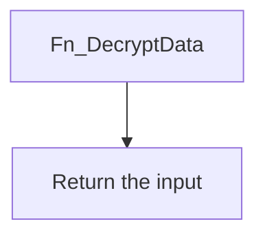

# Fn_DecryptData

## What it does

Returns the input string unchanged. A commented block below the live body would decrypt with `DecryptByKey` and `FN_ConvertBase64ToSTR`. That block is not part of the function.

## Parameters

| Name | Direction | What it is for |
|---|---|---|
| `@ValueToDecrypt` | in | `VARCHAR(MAX)` value the function returns as-is |

## Steps

In `HRMS-DATABASE/HRMS/FUNCTIONS/Fn_DecryptData.sql`:

1. Return `@ValueToDecrypt`.

## Tables

| Table | Read or write |
|---|---|
| — | The function does not read or write a table |

## Procedures and functions it calls

Calls no other procedures or functions.

## Flow

## Call sequence

Calls no other procedures or functions.
