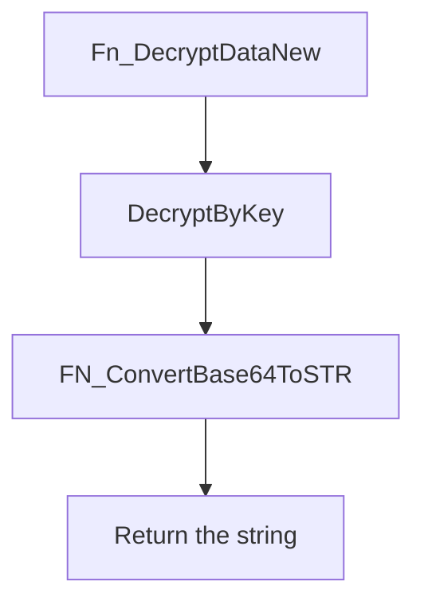
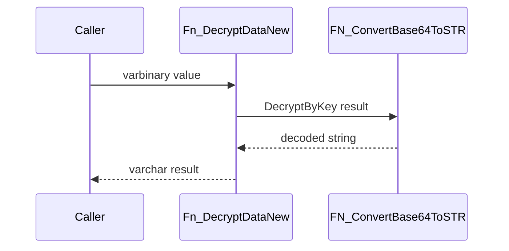

# Fn_DecryptDataNew

## What it does

Decrypts a `VARBINARY` value with the open symmetric key and turns the decrypted Base64 text back into a string. A comment above the body says `With Encryption`.

## Parameters

| Name | Direction | What it is for |
|---|---|---|
| `@ValueToDecrypt` | in | `VARBINARY(MAX)` ciphertext |

## Steps

In `HRMS-DATABASE/HRMS/FUNCTIONS/Fn_DecryptDataNew.sql`:

1. Set `@Lv_Result` to [FN_ConvertBase64ToSTR](/docs/database/hrms/FN_ConvertBase64ToSTR) of `DecryptByKey(@ValueToDecrypt)`.
2. Return `@Lv_Result` as `VARCHAR(MAX)`.

## Tables

| Table | Read or write |
|---|---|
| — | The function does not read or write a table |

## Procedures and functions it calls

| Object | Kind | When | Page |
|---|---|---|---|
| `FN_ConvertBase64ToSTR` | function | always, on the `DecryptByKey` result | [FN_ConvertBase64ToSTR](/docs/database/hrms/FN_ConvertBase64ToSTR) |

## Flow

## Call sequence

