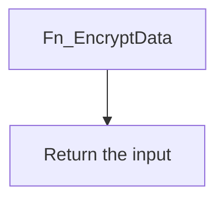

# Fn_EncryptData

## What it does

Returns the input string unchanged. Commented lines in the body would encrypt with `EncryptByKey` on `Encryption_Symmetric_Key` after `FN_ConvertSTRToBase64`. Those lines are not executed.

## Parameters

| Name | Direction | What it is for |
|---|---|---|
| `@ValueToEncrypt` | in | `VARCHAR(MAX)` value the function returns as-is |

## Steps

In `HRMS-DATABASE/HRMS/FUNCTIONS/Fn_EncryptData.sql`:

1. Return `@ValueToEncrypt`.

## Tables

| Table | Read or write |
|---|---|
| — | The function does not read or write a table |

## Procedures and functions it calls

Calls no other procedures or functions.

## Flow

## Call sequence

Calls no other procedures or functions.
