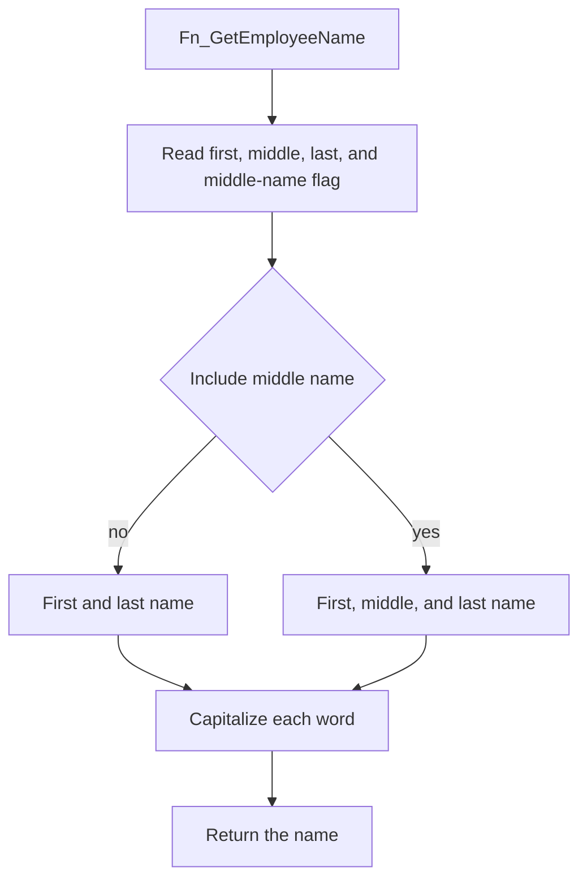

# Fn_GetEmployeeName

## What it does

Builds an employee's display name from first, optional middle, and last name, then capitalizes each word. The modification history says the decrypted-function call was removed on 19 June 2026. The script drops the function and creates it again.

## Parameters

| Name | Direction | What it is for |
|---|---|---|
| `@EmployeeID` | in | Employee whose name is read |

## Steps

In `HRMS-DATABASE/HRMS/FUNCTIONS/Fn_GetEmployeeName.sql`:

1. From `dbo.TEmployee` left-joined to `dbo.tCustomerSettings` on `EmployerId`, read trimmed `FName`, `LName`, and `MiddleName`, and `IsIncludeMiddleName`, for `@EmployeeID`. `FName` and `LName` are cast to `VARCHAR(50)` before the trim.
2. When `ISNULL(@IsIncludeMiddleName, 0) = 0`, concatenate first and last name, then split the lowercased string on spaces and uppercase the first character of each word.
3. When `@IsIncludeMiddleName = 1`, concatenate first, middle, and last name and apply the same word capitalization.
4. Return `@EmployeeName` as `VARCHAR(500)`.

## Tables

| Table | Read or write |
|---|---|
| `dbo.TEmployee` | read |
| `dbo.tCustomerSettings` | read |

## Procedures and functions it calls

Calls no other procedures or functions.

## Flow

## Call sequence

Calls no other procedures or functions.
