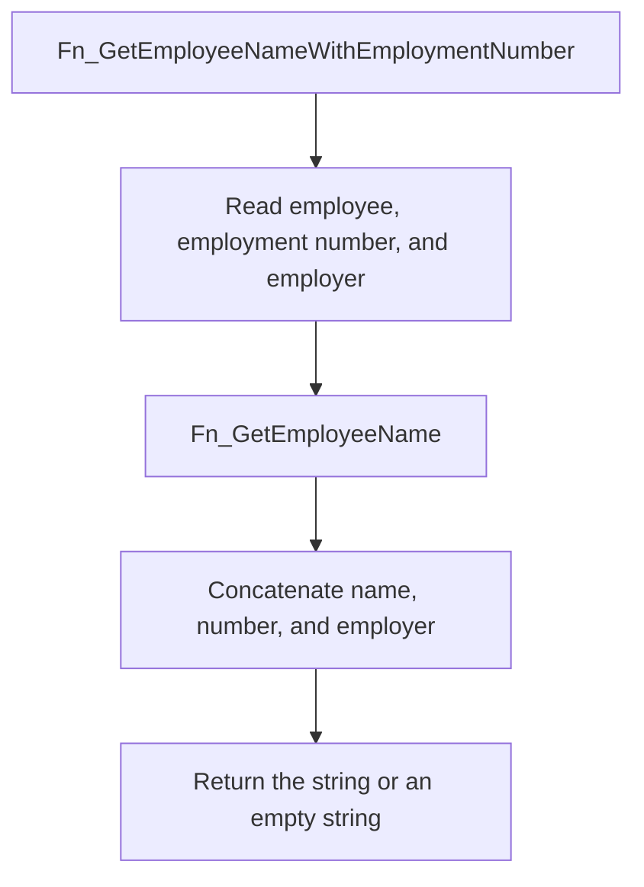
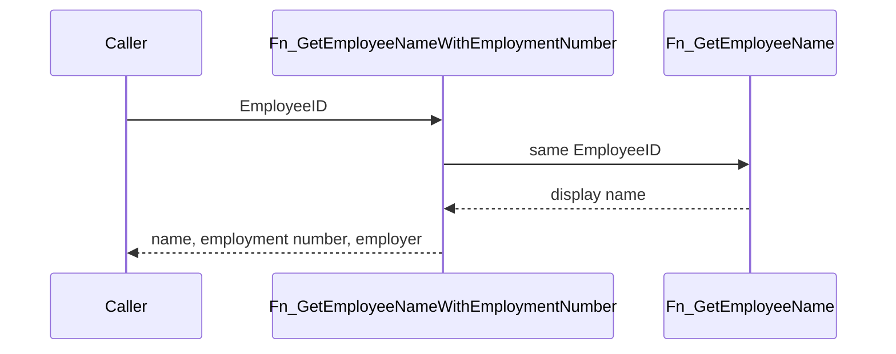

# Fn_GetEmployeeNameWithEmploymentNumber

## What it does

Returns one employee's display name, employment number, and employer name in a single string. The script drops the function when `SYS.OBJECTS` already has a scalar function of this name, then creates it. This copy is not listed in `changelog/baseline-inventory-functions.xml`.

## Parameters

| Name | Direction | What it is for |
|---|---|---|
| `@EmployeeID` | in | Employee to format |

## Steps

In `HRMS-DATABASE/HRMS/FUNCTIONS/Fn_GetEmployeeNameWithEmploymentNumber.sql`:

1. Join `TEmployee`, `TEmployeeInfo`, and `TEmployerDetails` on `@EmployeeID`.
2. Set the result to [Fn_GetEmployeeName](/docs/database/hrms/Fn_GetEmployeeName) of `te.EmployeeID`, plus ` (`, `ei.EmploymentNumber`, `) - `, and `ed.EmployerName`.
3. Return that `VARCHAR(500)` value, or `''` when the select finds no row. The function's declared return type is `VARCHAR(MAX)`.

## Tables

| Table | Read or write |
|---|---|
| `TEmployee` | read |
| `TEmployeeInfo` | read |
| `TEmployerDetails` | read |

## Procedures and functions it calls

| Object | Kind | When | Page |
|---|---|---|---|
| `Fn_GetEmployeeName` | function | always, for the joined employee | [Fn_GetEmployeeName](/docs/database/hrms/Fn_GetEmployeeName) |

## Flow

## Call sequence

