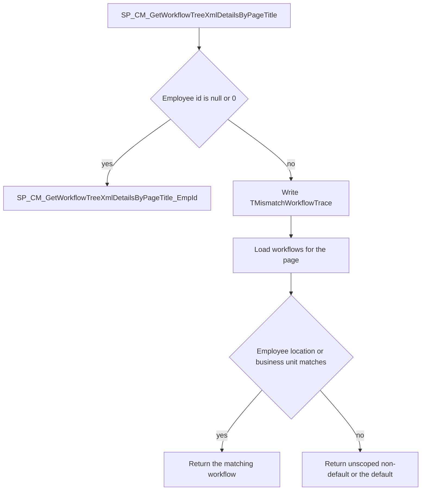
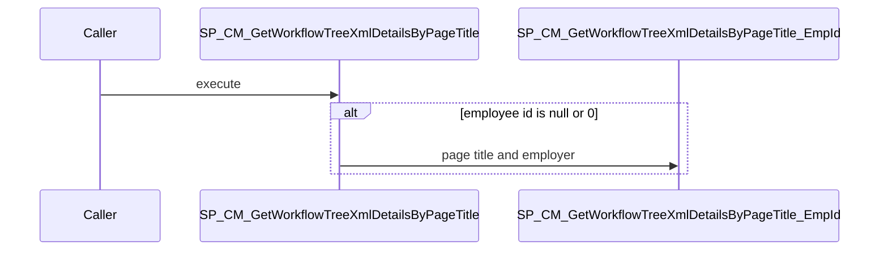

# SP_CM_GetWorkflowTreeXmlDetailsByPageTitle

## What it does

Returns one workflow definition for a module page. With no employee, it delegates to the employer-only lookup. With an employee, it records the employer on the employee, may replace the input employer when they differ, and then picks an enabled workflow mapped to the page that matches the employee's location and business unit.

## Parameters

| Name | Direction | What it is for |
|---|---|---|
| `@PageTitle` | in | Module page name. `WorkFromHome` is rewritten to `AttendanceRegularize-WFH` on the employee path |
| `@Employerid` | in | Employer used to find the workflow. Replaced by the employee's employer when they differ |
| `@Employeeid` | in | Employee whose location and business unit narrow the workflow. Null or 0 takes the employer-only path. Default is null |

## Steps

In `HRMS-DATABASE/HRMS/STOREPROCEDURE/SP_CM_GetWorkflowTreeXmlDetailsByPageTitle.sql`:

1. Set `NOCOUNT ON` and `READ UNCOMMITTED`.
2. When `@Employeeid` is null or 0, execute [SP_CM_GetWorkflowTreeXmlDetailsByPageTitle_EmpId](/docs/database/hrms/SP_CM_GetWorkflowTreeXmlDetailsByPageTitle_EmpId) with `@PageTitle` and `@Employerid`, and return that result.
3. Otherwise read `Employerid` from `TEmployee` for `@Employeeid`. The `LEAVEREQUEST` / `ATTENDANCEREGULARIZE` branch and the other branch run the same select.
4. Insert a row into `TMismatchWorkflowTrace` with the page title, employee, input employer, and the employer just read. Keep `SCOPE_IDENTITY()` as `@TraceId`.
5. When `@Employerid` differs from the employee's employer, set `@Employerid` to the employee's employer and set `IsWorkflowIncorrect = 1` on that trace row.
6. Read `AllowPartialWorkflow` from `TCustomerSettings` for the employer now in `@Employerid`.
7. Read `BusinessUnitId` and `LocationId` from `TEmployeeInfo` for the employee.
8. When `@PageTitle` is `WorkFromHome`, set it to `AttendanceRegularize-WFH`.
9. Read `ModulePageId` from `TModulePages` for that page name.
10. Load `#WorkFlow` from enabled, non-deleted `TWorkflowManagement` rows for the employer whose `MappedPages` contains that page id. A partial workflow is included only when `AllowPartialWorkflow` is 0. Flag whether the workflow has location rows, business-unit rows, and whether those rows match this employee.
11. When `#WorkFlow` has a non-default row, keep in `#CustomWorkFlows` the rows that match both location and business unit, or only business unit when the workflow has no locations, or only location when the workflow has no business units.
12. When `#CustomWorkFlows` has a row, return its `WorkflowId`, `WorkflowDefinitionTree`, and `SkipWorkFlow`.
13. When it does not, return the non-default workflow that has no location and no business-unit mapping.
14. When `#WorkFlow` has no non-default row, return the default workflow from `#WorkFlow`.

## Tables

| Table | Read or write |
|---|---|
| `dbo.TEmployee` | read |
| `dbo.TMismatchWorkflowTrace` | write |
| `dbo.TCustomerSettings` | read |
| `dbo.TEmployeeInfo` | read |
| `dbo.TModulePages` | read |
| `dbo.TWorkflowManagement` | read |
| `dbo.TWorkFlowLocations` | read |
| `dbo.TWorkFlowBusinessUnits` | read |
| `#WorkFlow` | write |
| `#CustomWorkFlows` | write |

## Procedures and functions it calls

| Object | Kind | When | Page |
|---|---|---|---|
| `SP_CM_GetWorkflowTreeXmlDetailsByPageTitle_EmpId` | procedure | `@Employeeid` is null or 0 | [SP_CM_GetWorkflowTreeXmlDetailsByPageTitle_EmpId](/docs/database/hrms/SP_CM_GetWorkflowTreeXmlDetailsByPageTitle_EmpId) |

## Flow

## Call sequence

