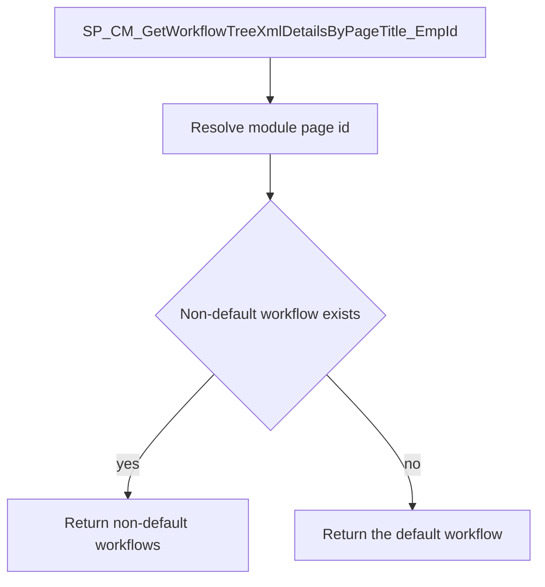

# SP_CM_GetWorkflowTreeXmlDetailsByPageTitle_EmpId

## What it does

Returns the enabled workflow for a page title and employer when the caller has no employee. It does not match business unit or location. It prefers a non-default workflow mapped to that page, and falls back to the default workflow for the same page.

## Parameters

| Name | Direction | What it is for |
|---|---|---|
| `@PageTitle` | in | Module page name. `WorkFromHome` is rewritten to `AttendanceRegularize-WFH` before the lookup |
| `@Employerid` | in | Employer whose workflow and partial-workflow setting are read |

## Steps

In `HRMS-DATABASE/HRMS/STOREPROCEDURE/SP_CM_GetWorkflowTreeXmlDetailsByPageTitle_EmpId.sql`:

1. Read `AllowPartialWorkflow` from `TCustomerSettings` for `@Employerid`.
2. When `@PageTitle` is `WorkFromHome`, set it to `AttendanceRegularize-WFH`.
3. Read `ModulePageId` from `TModulePages` where `ModulePageName` equals `@PageTitle`, and cast it to a string.
4. Count enabled, non-deleted, non-default rows in `TWorkflowManagement` for that employer whose `MappedPages` contains the page id. A partial workflow is included only when `AllowPartialWorkflow` is 0.
5. When that count is greater than 0, return `WorkflowId`, `WorkflowDefinitionTree`, and `SkipWorkFlow` for those non-default workflows.
6. Otherwise return the same three columns for the enabled, non-deleted default workflow mapped to the same page.

## Tables

| Table | Read or write |
|---|---|
| `dbo.TCustomerSettings` | read |
| `dbo.TModulePages` | read |
| `dbo.TWorkflowManagement` | read |

## Procedures and functions it calls

Calls no other procedures or functions.

## Flow

## Call sequence

Calls no other procedures or functions.
