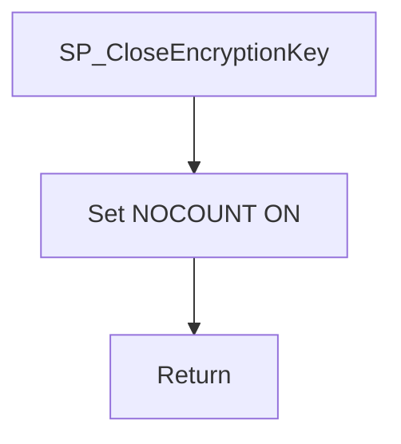

# SP_CloseEncryptionKey

## What it does

The procedure is the close-key step that callers run after work that used the encryption key. In `HRMS-DATABASE/HRMS/STOREPROCEDURE/SP_CloseEncryptionKey.sql` the symmetric-key close is commented out, so a call returns without closing a key and without a result set.

## Parameters

| Name | Direction | What it is for |
|---|---|---|
| — | — | The procedure takes no parameters |

## Steps

1. Set `NOCOUNT ON`.
2. Skip the commented `CLOSE SYMMETRIC KEY Encryption_Symmetric_Key` block. Nothing else runs.

## Tables

| Table | Read or write |
|---|---|
| — | The procedure does not read or write a table |

## Procedures and functions it calls

Calls no other procedures or functions.

## Flow

## Call sequence

Calls no other procedures or functions.
