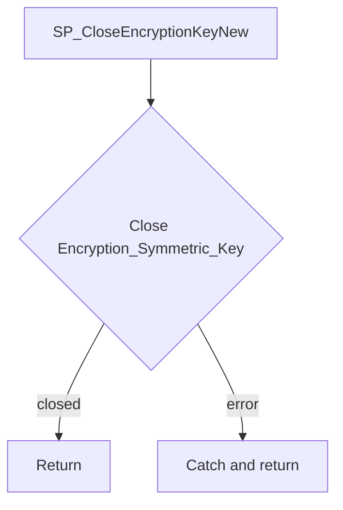

# SP_CloseEncryptionKeyNew

## What it does

Closes symmetric key `Encryption_Symmetric_Key` for the current session. A failure is caught and ignored. The procedure takes no parameters and returns no result set.

## Parameters

| Name | Direction | What it is for |
|---|---|---|
| — | — | The procedure takes no parameters |

## Steps

In `HRMS-DATABASE/HRMS/STOREPROCEDURE/SP_CloseEncryptionKeyNew.sql`:

1. Set `NOCOUNT ON`.
2. In a `TRY` block, run `CLOSE SYMMETRIC KEY Encryption_Symmetric_Key`.
3. In the `CATCH` block, do nothing.

## Tables

| Table | Read or write |
|---|---|
| — | The procedure does not read or write a table |

## Procedures and functions it calls

Calls no other procedures or functions.

## Flow

## Call sequence

Calls no other procedures or functions.
