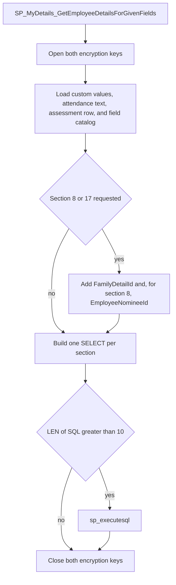
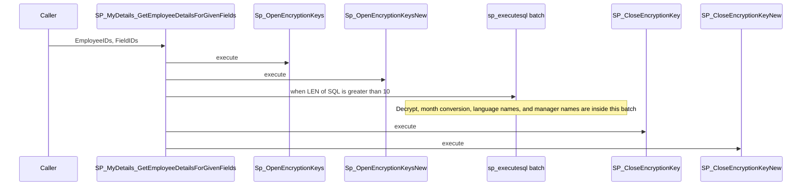

# SP_MyDetails_GetEmployeeDetailsForGivenFields

## What it does

Returns My Details field values for a comma-separated list of employees and a comma-separated list of field ids. It loads the field catalog for those ids, builds one `SELECT` per section, and runs that batch with `sp_executesql`. The header points at `SP_BulkUpdateProfile_GetEmployeeDetailsForGivenFields` as the reference procedure.

## Parameters

| Name | Direction | What it is for |
|---|---|---|
| `@EmployeeIDs` | in | Comma-separated employee ids to read |
| `@FieldIDs` | in | Comma-separated `TEmployeeDetail_Fields.FieldID` values to return |

## Steps

In `HRMS-DATABASE/HRMS/STOREPROCEDURE/SP_MyDetails_GetEmployeeDetailsForGivenFields.sql`:

1. Set `NOCOUNT ON`, `READ UNCOMMITTED`, and `DEADLOCK_PRIORITY LOW`.
2. Execute [Sp_OpenEncryptionKeys](/docs/database/hrms/Sp_OpenEncryptionKeys) and [Sp_OpenEncryptionKeysNew](/docs/database/hrms/Sp_OpenEncryptionKeysNew).
3. Set `@EmployerID` to `MAX(Employerid)` from `dbo.TEmployeeDetail_Fields` for the supplied field ids.
4. Look up section ids in `dbo.TemployeeDetail_Section` for `Skill Details`, `Domain Details`, `Current Employment Details`, and `Personal Details`.
5. Build `#ConvertCustFieldValuesID` for the supplied employees. `TEmployeedetailCustomFields` keeps history, so a `ROW_NUMBER` keeps only the latest row (`MAX` `CustomFieldId`) per `Employeeid`, `CustFieldID`, and `ISNULL(CustDetailId, -1)`. Each comma-separated token in `CustomValue` is replaced with `TEmployeedetailCustomFieldValues.CustomValue` when the token equals `CustomValueId` for the same `CustFieldID`; otherwise the stored token is kept.
6. Collapse those rows into `#CustomFieldValues` with `STUFF` / `FOR XML PATH`, grouped by employee, custom field, and detail id.
7. Split `TEmployeeInfo.AttendanceCaptureType` into `#AttMode` and map each token to `tAttendanceCaptureMode.TypeDescription` for that employer where `IsActive = 1`. Concatenate the descriptions into `#AttCaptureType`.
8. Into `#AttendanceCaptureType`, keep that text unless it is `''`, `N`, `E`, `NULL`, or SQL `NULL`. In those cases replace it with `STRING_AGG` of the employer's `TEmployerDetails.AttendanceCaptureType` descriptions.
9. Insert `#AssessmentDetails` from `TEmployeeInfo` joined to `TORGChart`, left joined to `#AttendanceCaptureType` and to month names from `master.dbo.spt_values` (`type = 'P'`, `number` 0 through 11). The insert fills assessment year, assessment month, month name, `ReportsTo`, and attendance capture text.
10. Select the requested fields into `#Data` where `EmployerID` equals `@EmployerID` and `FieldName` is not `profile picture`. For section 4, `Date of Birth`, `Country of Birth`, `State of Birth`, and `City Of Birth` are remapped to `Temployee` columns `DOB`, `BirthCountryName`, `StateOfBirth`, and `PlaceOfBirth`.
11. When any requested field has `Sectionid = 8`, insert a Nomination Details row that reads `TEmployeeNomination.EmployeeFamilyDetailID` from the section 10 catalog field named `EmployeeFamilyDetailID` (`DisplayText` `FamilyDetailId`), then insert synthetic `FieldID` `-8008` for `TEmployeeNomination.EmployeeNomineeId`. `IDENTITY_INSERT` is on for those inserts.
12. When any requested field has `Sectionid = 17`, insert the same section 10 family-detail catalog field onto `TEmployeeNominee_Details.EmployeeFamilyDetailID` with `DisplayText` `FamilyDetailId`.
13. Build `#Data_Fields`, one row per `SectionID`, with:
    - `Tbl`: for sections 2 and 3, and 5 and 12, a subquery that keeps rows whose `IsDeleted` is `N` or null; for 6, 8, 9, 10, 13, and 17, a subquery that keeps `isdelete = 0` or null; for 7, a subquery that keeps `ISNULL(Show, 1) = 1` and `Isdelete` null; for 4, `TEmployeePassportDetails` full-joined to `Temployee`; otherwise the catalog `DB_Schema.DB_Table`.
    - `Segment_Fields`: for `FieldEntity = 'Segment'`, a `CASE` that returns `B.VALUE` when the employee's column is null, otherwise the column, aliased to `DisplayText`.
    - `System_Country_Fields`: for `FieldEntity` `System` or `Country`, the column expression below, aliased to `DisplayText`. The personal-section column `CountryOfEmployment` is omitted here.
    - `Custom_Fields`: `REPLACE` of the matching `#CustomFieldValues.CustomValue`, turning `&amp;` into `&`, joined on the section's detail id when the section is skill, domain, visa (5), past employment (6), bank (7), nomination (8), education (9), family (10), emergency contact (12), certification (13), or nominee (17).
    - `CustDetailIdColumn`: the detail-id column name for those same sections.
14. System and country expressions:
    - `DB_Column_Encrypted = 1` uses [Fn_DecryptData](/docs/database/hrms/Fn_DecryptData); `= 2` uses [Fn_DecryptDataNew](/docs/database/hrms/Fn_DecryptDataNew).
    - Skill, domain, current employment, and personal fields `Years`, `PreviousExperienceYears`, and `PreviousExperienceInCurrentOrganizationYears` use [FN_ConvertMonthsToYearsAndMonths](/docs/database/hrms/FN_ConvertMonthsToYearsAndMonths) with `'Years'`. The matching month field names on skill, domain, and current employment use the same function with `'Months'`.
    - Skill `Last Used (YYYY)` is `YEAR` of the column, or `''`.
    - Current employment `UpcomingAssessment` formats `AD.assessmentyear` as `dd-MMM-yyyy` when `A.AssessmentTenure = 'Year Cycle'`, or `AD.Month_STRING` when it is `'12 month cycle'`.
    - Current employment `ReportsTo` is `AD.ReportsTo`, `AttendanceMode` is `AD.AttendanceCaptureType`, `EmploymentType` is `A.EmploymentTypeID`, `Effectivedate` is `A.Effectivedate`, and `EndOfContractDate` is `TEP.ContractEndDate`.
    - Sections 8 and 17 `Birth Date` return null when `DOB = '1900-01-01'`.
    - Personal `Language Read`, `Language Write`, and `Language Speak` use [Ufn_BulkProfile_languageIdstoNames](/docs/database/hrms/Ufn_BulkProfile_languageIdstoNames).
    - `EffectiveDate` is qualified as `A.` plus the catalog column. A column named `Value` is emitted as `a.Value`.
15. Load `#IDs` from `@EmployeeIDs`, dropping blank tokens.
16. Build `@SQL` as one `SELECT` per section, separated by `;`. Each statement reads `#IDs` as `B` and, when `Tbl` is present, left-joins that table as `A`, `#AssessmentDetails` as `AD`, and `TEmployeeEmploymentType` as `TEP`. An `OUTER APPLY` reads `TEmployeeInfo` and calls [Fn_GetEmployeeNameWithEmploymentNumber](/docs/database/hrms/Fn_GetEmployeeNameWithEmploymentNumber) for `ReviewManager`, `AD.ReportsTo`, and `FunctionalManager`, and reads `TCountry.NICENAME` for `TEmployee.CountryOfEmployment`. If any `#Data` row has `DB_Column` `ReviewManager`, `ReportsTo`, or `FunctionalManager`, every section `SELECT` adds `[Review Manager Name]`, `[Reporting Manager Name]`, or `[Functional Manager Name]`. The personal section always adds `[Country of Employment]`. Each statement ends with `ORDER BY B.value`.
17. `PRINT @SQL`. When `LEN(@SQL) > 10`, `EXECUTE SP_EXECUTESQL @SQL`. That batch is the only result set. Its tables and columns come from the catalog rows loaded above.
18. Execute [SP_CloseEncryptionKey](/docs/database/hrms/SP_CloseEncryptionKey) and [SP_CloseEncryptionKeyNew](/docs/database/hrms/SP_CloseEncryptionKeyNew).

## Tables

| Table | Read or write |
|---|---|
| `dbo.TEmployeeDetail_Fields` | read |
| `dbo.TemployeeDetail_Section` | read |
| `dbo.TEmployeedetailCustomFields` | read |
| `dbo.TEmployeedetailCustomFieldValues` | read |
| `dbo.TEmployeeInfo` | read |
| `dbo.tAttendanceCaptureMode` | read |
| `dbo.TEmployee` | read |
| `dbo.Temployee` | read, in the section 4 table expression |
| `dbo.TEmployerDetails` | read |
| `dbo.TORGChart` | read |
| `master.dbo.spt_values` | read |
| `dbo.TEmployeePassportDetails` | read, in the section 4 table expression |
| `dbo.TEmployeeNomination` | read, when a section 8 field is requested |
| `dbo.TEmployeeNominee_Details` | read, when a section 17 field is requested |
| `dbo.TEmployeeEmploymentType` | read, in each generated section `SELECT` that has a table expression |
| `dbo.TCountry` | read, in that same `OUTER APPLY` |
| `#ConvertCustFieldValuesID`, `#CustomFieldValues`, `#AttMode`, `#AttCaptureType`, `#AttendanceCaptureType`, `#AssessmentDetails`, `#Data`, `#Data_Fields`, `#IDs` | write |

Other section tables are whatever `DB_Schema` and `DB_Table` the catalog row stores. The procedure does not name them.

## Procedures and functions it calls

| Object | Kind | When | Page |
|---|---|---|---|
| `Sp_OpenEncryptionKeys` | procedure | always, before the reads | [Sp_OpenEncryptionKeys](/docs/database/hrms/Sp_OpenEncryptionKeys) |
| `Sp_OpenEncryptionKeysNew` | procedure | always, immediately after the previous open | [Sp_OpenEncryptionKeysNew](/docs/database/hrms/Sp_OpenEncryptionKeysNew) |
| `Fn_DecryptData` | function | a system or country field has `DB_Column_Encrypted = 1` | [Fn_DecryptData](/docs/database/hrms/Fn_DecryptData) |
| `Fn_DecryptDataNew` | function | a system or country field has `DB_Column_Encrypted = 2` | [Fn_DecryptDataNew](/docs/database/hrms/Fn_DecryptDataNew) |
| `FN_ConvertMonthsToYearsAndMonths` | function | a years or months experience field on skill, domain, current employment, or, for the years names, personal | [FN_ConvertMonthsToYearsAndMonths](/docs/database/hrms/FN_ConvertMonthsToYearsAndMonths) |
| `Ufn_BulkProfile_languageIdstoNames` | function | personal `Language Read`, `Language Write`, or `Language Speak` | [Ufn_BulkProfile_languageIdstoNames](/docs/database/hrms/Ufn_BulkProfile_languageIdstoNames) |
| `Fn_GetEmployeeNameWithEmploymentNumber` | function | a section table expression is present; the apply calls it for review manager, reporting manager, and functional manager | [Fn_GetEmployeeNameWithEmploymentNumber](/docs/database/hrms/Fn_GetEmployeeNameWithEmploymentNumber) |
| `SP_CloseEncryptionKey` | procedure | always, after the dynamic batch | [SP_CloseEncryptionKey](/docs/database/hrms/SP_CloseEncryptionKey) |
| `SP_CloseEncryptionKeyNew` | procedure | always, immediately after the previous close | [SP_CloseEncryptionKeyNew](/docs/database/hrms/SP_CloseEncryptionKeyNew) |

## Unresolved calls

`EXECUTE SP_EXECUTESQL @SQL` runs the batch built in step 16. The procedure prints that text. Which section tables and columns appear depends on `TEmployeeDetail_Fields` for `@FieldIDs`.

## Flow

## Call sequence

