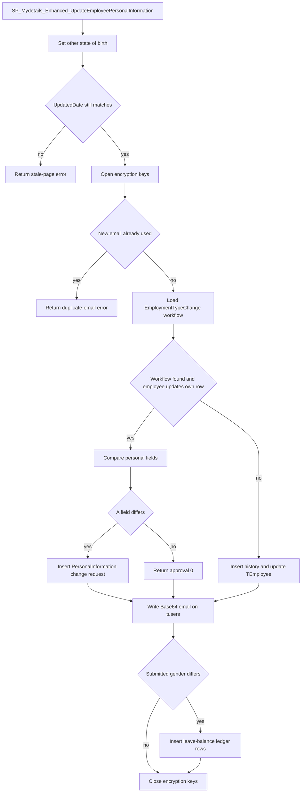
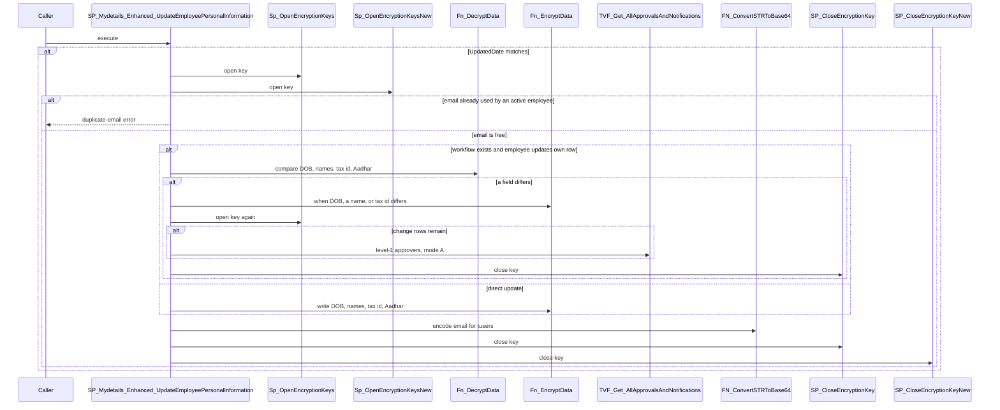

# SP_Mydetails_Enhanced_UpdateEmployeePersonalInformation

## What it does

Saves one employee's personal details. When `TEmployee.UpdatedDate` still matches the caller's copy, it opens the encryption keys. If an `EmploymentTypeChange` workflow exists and the employee is updating their own row, changed fields are filed as a `PersonalInformation` change request for level-1 approvers. Otherwise it copies the current row into `TEmployeeHistory` and updates `TEmployee`. Unless it returned on a stale row or a duplicate email, it then Base64-encodes the email onto the linked user and, when the submitted gender differs from the gender read at the start, inserts leave-balance ledger rows.

## Parameters

| Name | Direction | What it is for |
|---|---|---|
| `@empID` | in | Employee whose personal row is checked and updated. Default null |
| `@permanentaddress` | in | New permanent address. Default null |
| `@postaladdress` | in | New current address, stored as `PostalAddress`. Default null |
| `@email` | in | New email. Also written to the linked user. Default null |
| `@titleID` | in | `TPersonalTitle` id. Default null |
| `@maritalStatus` | in | `TMaritalStatus` id. Value `1` clears the wedding date. Default null |
| `@nationality` | in | Nationality text. Default null |
| `@dob` | in | Date of birth. Passed through `Fn_EncryptData` on write. Default null |
| `@fName` | in | First name. Passed through `Fn_EncryptData` on write. Default null |
| `@lName` | in | Last name. Passed through `Fn_EncryptData` on write. Default null |
| `@gender` | in | `TGender` id. A difference from the stored gender drives the leave-ledger block. Default null |
| `@mName` | in | Middle name. Passed through `Fn_EncryptData` on write. Default null |
| `@placeOfBirth` | in | Place of birth. Default null |
| `@weddingDate` | in | Wedding date. `1900-01-01` is treated as no date. Default null |
| `@ethnicGroup` | in | Replaced with `''` before any compare or update. Default null |
| `@bloodGroup` | in | Blood group. Default null |
| `@taxID` | in | Tax id. Passed through `Fn_EncryptData` on write. Default null |
| `@updatedBy` | in | Logged-in user, copied to `@LoggedInUser`. The change-request path runs only when this equals `@empID`. Default null |
| `@EffectiveDate` | in | Written to `TEmployee.EffectiveDate` on the direct-update path only. Default null |
| `@StateofBirth` | in | State code used for the state-name lookup, and stored as `StateofBirth`. Default null |
| `@PermanentZipCode` | in | Permanent zip code. Default null |
| `@PostalZipCode` | in | Postal zip code. Default null |
| `@OtherStateOfBirth` | in | Replaced by `tcountrystates.StateName` when that lookup returns a row. Default null |
| `@AadharNumber` | in | National id. A change-request row is queued only when this value is non-empty. Default null |
| `@updatedDate` | in | `UpdatedDate` the caller last saw. Used for the concurrency check. Default null |
| `@BirthCountryName` | in | Birth country name, and the country used for the state-name lookup. Default null |
| `@BirthZipCode` | in | Birth zip code. Default null |
| `@IsDataExistsForZipCode` | in | Declared and not referenced. Default null |
| `@BirthDayNotificationDisabled` | in | Compared with and stored in `ShowBirthday`. Default null |
| `@CurrState` | in | State id stored in `StateID`. Default null |
| `@EmpImage` | in | Image value. On the self-update path a non-null value is always queued. Default null |
| `@ReligionId` | in | Religion id. Default null |
| `@LangugageSpeakIds` | in | Spoken-language ids. The parameter name is spelled `Langugage`. Default null |
| `@LangugageWriteIds` | in | Written-language ids. Default null |
| `@LangugageReadIds` | in | Read-language ids. Default null |

## Steps

In `HRMS-DATABASE/HRMS/STOREPROCEDURE/SP_Mydetails_Enhanced_UpdateEmployeePersonalInformation.sql`:

1. Set `@LoggedInUser` from `@updatedBy`. Set `@OtherStateOfBirth` from `tcountrystates.StateName` where `statecode` equals `@StateofBirth` and `countrycode` is the first `tcountry.Countrycode` whose `NiceName` equals `@BirthCountryName`. Set `@Todate` to `GETDATE()` formatted as style `121`.
2. Run two dynamic `COUNT` statements against the names held in `@TABLE_NAME` (`TEmployee`), `@TABLE_COLUMN_NAME` (`UpdatedDate`), and `@Unique_COLUMN_NAME` (`EmployeeId`). See **Unresolved calls**. If `@updatedDate` is null or empty and the row's `UpdatedDate` is null, treat the check as current. Otherwise keep the count of rows whose `UpdatedDate` equals `@updatedDate`. When that count is `0`, return one row: empty `TransId`, empty `EmployeeId`, null `Approval`, and error `This page has been updated by another user since you opened it. Please refresh it to see the latest changes`, then return.
3. Set `@ethnicGroup` to `''`. Execute [Sp_OpenEncryptionKeys](/docs/database/hrms/Sp_OpenEncryptionKeys) and [Sp_OpenEncryptionKeysNew](/docs/database/hrms/Sp_OpenEncryptionKeysNew). Read `Gender`, `Employerid`, and `EmailID` from `TEmployee` into `@lv_Gender`, `@lv_Employerid`, and `@Lv_EmployeeMail`.
4. When `@Lv_EmployeeMail` differs from `@email`, count active `TEmployee` rows (`IsActive = 'Y'`) with that email. When the count is greater than `0`, return empty `TransId`, empty `EmployeeId`, null `Approval`, and error `Duplicate Email Id not allowed`, then return. This return does not close the encryption keys.
5. Create `#tmpFlowDetails` (`WorkflowId`, `Tree`, `SkipWorkFlow`). Set the workflow page title to `EmploymentTypeChange` and the employer and employee ids from the values already read.
6. When `@empID` is null or `0`, read `AllowPartialWorkflow` from `TCustomerSettings`. Resolve `ModulePageId` from `TModulePages` for `EmploymentTypeChange`. When a non-default enabled workflow is mapped to that page for the employer, select its `WorkflowId`, `WorkflowDefinitionTree`, and `SkipWorkFlow`. Otherwise select the same columns from the default enabled workflow. That select is a result set. It does not insert into `#tmpFlowDetails`. The `WorkFromHome` rename in this branch does not run, because the page title is `EmploymentTypeChange`.
7. When `@empID` is not null and not `0`, read the employee's `Employerid` from `TEmployee` and insert `TMismatchWorkflowTrace` (`PageTitle`, both employer ids, `@Todate`). When the trace's input employer differs from the employee's employer, set the working employer to the employee's employer and set `IsWorkflowIncorrect = 1` on that trace. Read `AllowPartialWorkflow`, and read `BusinessUnitId` and `LocationId` from `TEmployeeInfo`. Load enabled, non-deleted workflows mapped to the `EmploymentTypeChange` page into `#WorkFlow`. A partial workflow is included only when `IsWorkflowPartial = 0` or `AllowPartialWorkflow = 0`. Each row is flagged for a location mapping, a business-unit mapping, and whether that mapping matches this employee. When any non-default workflow is present, insert the ones that match into `#tmpFlowDetails`: both location and business unit when the workflow has both mappings, business unit only when it has no location mapping, or location only when it has no business-unit mapping. When none of those match, insert non-default workflows that have no location and no business-unit mapping. When every loaded workflow is a default, insert the default workflow.
8. When `#tmpFlowDetails` has at least one row and `@empID` equals `@updatedBy`, copy the current personal columns from `TEmployee` into `#TempEmp`. Compare each submitted value with that copy and insert a difference into `@ChangeRequests` (`UDT_TMyDetailsChangeRequestDetails`) under section `Personal Details`. Local `@countryOfBirth` stays null; the script never assigns it. Wedding date `1900-01-01` becomes null, and marital status `1` also forces it null. [Fn_DecryptData](/docs/database/hrms/Fn_DecryptData) is applied to `DOB`, `FName`, `LName`, `MiddleName`, `taxID`, and `AadharNumber` before those compares. Title, marital status, gender, and current state store the lookup text (`TPersonalTitle`, `TMaritalStatus`, `TGender`, `TCountryStates`) in the display values and the ids in the text values. Date of birth, first name, last name, middle name, and tax id store the plain display text and pass the text values through [Fn_EncryptData](/docs/database/hrms/Fn_EncryptData). Tax id and Aadhar labels become `TEmployeeDetail_Fields.DisplayText` for the employee's `CountryOfEmployment` when that country is set (`Tax Identification Number` and `National Identification Number`); otherwise the labels are `Tax ID` and `Aadhar Number`. The Aadhar text values are the literal strings `Dbo.Fn_EncryptData('...')`, not the function result, and the Aadhar row is skipped when `@AadharNumber` is empty. `ShowBirthday` is compared with `@BirthDayNotificationDisabled` and displayed as `No` when the value is `0`, otherwise `Yes`. A non-null `@EmpImage` is queued with `IsNew = 1`, `IsChildTableField = 1`, and a null child row id. Religion and the three language-id parameters are compared as stored ids.
9. Still on that self-update path, when at least one difference was queued, execute [Sp_OpenEncryptionKeys](/docs/database/hrms/Sp_OpenEncryptionKeys) again. Copy distinct change rows into `@tChangeRequests` and delete rows whose old and new values are equal. When any row remains, insert `TMyDetailsChangeRequests` for page `PersonalInformation` with `@Todate` and `GETUTCDATE()`. `@RequestID` is null, so the new-request branch always runs: the new identity becomes `@RequestID` and `@IsEMailNotification` is `1`. Insert the detail rows into `TMyDetailsChangeRequestDetails`. Call [TVF_Get_AllApprovalsAndNotifications](/docs/database/hrms/TVF_Get_AllApprovalsAndNotifications) with the employer, `@updatedBy`, the first `WorkflowId` from `#tmpFlowDetails`, and `'A'`, and store those employee ids in `#MyDetailsUpdate`. Insert `TRequestWorkflows` for request type `EmploymentTypeChange`, approval level `1`, `IsApprove = 0`, and status `P`. Insert `TEmailNotification` for template `EmploymentTypeChange`, action `Notification`, and status `Pending`. When `#MyDetailsUpdate` has rows, select `TransId`, `EmployeeId`, `Approval = 1`, and an empty error for each approver. When it has none, select one row with `Approval = 0` and an empty error. When every queued difference was removed, or when no field differed, select that same `Approval = 0` row. When a field differed, execute [SP_CloseEncryptionKey](/docs/database/hrms/SP_CloseEncryptionKey) before leaving this branch. These selects do not return from the procedure.
10. When no workflow row was loaded, or `@empID` is not `@updatedBy`, insert a `TEmployeeHistory` row from the current `TEmployee` values for the columns named in that `INSERT`. `UpdatedBy` and `UpdatedDate` on that history row fall back to `CreatedBy` and `CreatedDate`. `EmpImage` is not in the history insert. Then update `TEmployee` with the submitted personal values, `@LoggedInUser`, `@Todate`, `GETUTCDATE()`, and `@EffectiveDate`. `DOB`, `FName`, `LName`, `MiddleName`, `taxID`, and `AadharNumber` go through [Fn_EncryptData](/docs/database/hrms/Fn_EncryptData). `EthnicGroup` is the cleared `''`, and `CountryOfBirth` is the unset null. Select one row with `Approval = 0` and an empty error. This select does not return from the procedure.
11. Update `tusers.useremail` to [FN_ConvertSTRToBase64](/docs/database/hrms/FN_ConvertSTRToBase64) of `@email` for the user joined through `TUserEmployee` to this employee.
12. When `@lv_Gender` differs from `@gender`, insert `TLeaveBalanceLedger` debit rows (`TransactionType = 'D'`, source `LeaveDeleteDueToPersonalInfoUpdate`) for `tLeaveBalance` leave types that are not in the active leave types eligible for this employee and for gender `B` or the gender now on `TEmployee` (`1` maps to `M`, anything else to `F`). The days are the balance multiplied by `-1`, opening balance is the current balance, and closing balance is `0`. A second insert would add credit rows (`TransactionType = 'C'`, source `EmployeePersonalInfoUpdate`, zero days) for leave types in `@lv_NewlyAddedLeaves`. That table variable is never filled, so the second insert adds no rows. On the direct-update path, `TEmployee.Gender` is already the submitted value. On the change-request path, `TEmployee` was not updated, so the eligibility read still sees the previous gender.
13. Execute [SP_CloseEncryptionKey](/docs/database/hrms/SP_CloseEncryptionKey) and [SP_CloseEncryptionKeyNew](/docs/database/hrms/SP_CloseEncryptionKeyNew).

## Tables

| Table | Read or write |
|---|---|
| `dbo.tcountry` | read |
| `dbo.tcountrystates` | read |
| `dbo.TEmployee` | read and write |
| `dbo.TCustomerSettings` | read |
| `dbo.TModulePages` | read |
| `dbo.TWorkflowManagement` | read |
| `dbo.TMismatchWorkflowTrace` | write |
| `dbo.TEmployeeInfo` | read |
| `dbo.TWorkFlowLocations` | read |
| `dbo.TWorkFlowBusinessUnits` | read |
| `dbo.TPersonalTitle` | read |
| `dbo.TMaritalStatus` | read |
| `dbo.TGender` | read |
| `dbo.TEmployeeDetail_Fields` | read |
| `dbo.TMyDetailsChangeRequests` | write |
| `dbo.TMyDetailsChangeRequestDetails` | write |
| `dbo.TRequestWorkflows` | write |
| `dbo.TEmailNotification` | write |
| `dbo.TEmployeeHistory` | write |
| `dbo.TUsers` | read and write |
| `dbo.TUserEmployee` | read |
| `dbo.tLeaveBalance` | read |
| `dbo.TLeaveTypeMaster` | read |
| `dbo.TLeaveBusinessUnit` | read |
| `dbo.TLeaveGrade` | read |
| `dbo.TLeaveLocation` | read |
| `dbo.TLeaveEmployeeStatus` | read |
| `dbo.TLeaveBalanceLedger` | write |

## Procedures and functions it calls

| Object | Kind | When | Page |
|---|---|---|---|
| `Sp_OpenEncryptionKeys` | procedure | After the concurrency check passes, and again on the self-update path when a field differs | [Sp_OpenEncryptionKeys](/docs/database/hrms/Sp_OpenEncryptionKeys) |
| `Sp_OpenEncryptionKeysNew` | procedure | After the concurrency check passes | [Sp_OpenEncryptionKeysNew](/docs/database/hrms/Sp_OpenEncryptionKeysNew) |
| `Fn_DecryptData` | function | Self-update path, while comparing date of birth, names, tax id, and Aadhar | [Fn_DecryptData](/docs/database/hrms/Fn_DecryptData) |
| `Fn_EncryptData` | function | Self-update path for encrypted text values, and on the direct update of those columns | [Fn_EncryptData](/docs/database/hrms/Fn_EncryptData) |
| `TVF_Get_AllApprovalsAndNotifications` | function | A change request was inserted | [TVF_Get_AllApprovalsAndNotifications](/docs/database/hrms/TVF_Get_AllApprovalsAndNotifications) |
| `FN_ConvertSTRToBase64` | function | Updating `tusers.useremail` after the main branch | [FN_ConvertSTRToBase64](/docs/database/hrms/FN_ConvertSTRToBase64) |
| `SP_CloseEncryptionKey` | procedure | End of the self-update path when a field differed, and again before the procedure ends when it did not return early | [SP_CloseEncryptionKey](/docs/database/hrms/SP_CloseEncryptionKey) |
| `SP_CloseEncryptionKeyNew` | procedure | Before the procedure ends when it did not return early | [SP_CloseEncryptionKeyNew](/docs/database/hrms/SP_CloseEncryptionKeyNew) |

## Unresolved calls

`sp_executesql` runs twice. Each batch is concatenated from `@TABLE_NAME`, `@TABLE_COLUMN_NAME`, `@Unique_COLUMN_NAME`, and `@UniqueId`. Those variables are set to `TEmployee`, `UpdatedDate`, `EmployeeId`, and `@empID` before the calls. The first statement counts rows where `UpdatedDate` is not null. The second counts rows where `UpdatedDate` equals `@updatedDate`.

## Flow

## Call sequence

