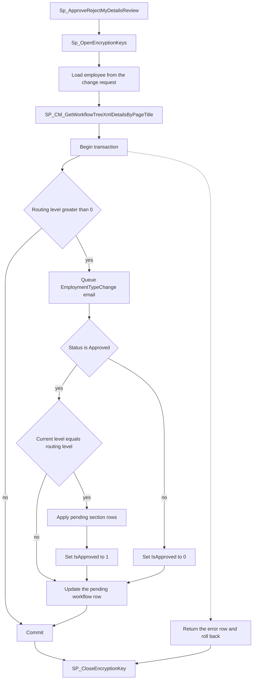
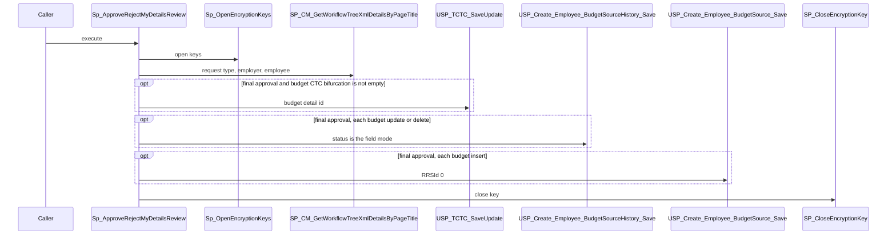

# Sp_ApproveRejectMyDetailsReview

## What it does

Approves or rejects one My Details change request. The value passed as `@EmployeeId` is the change-request id. Live section rows are written only when the status is `Approved` and the logged-in user is on the last routing level. A rejection marks the request not approved and does not copy the staged values onto the employee. On failure the procedure returns one error row and rolls the transaction back.

## Parameters

| Name | Direction | What it is for |
|---|---|---|
| `@EmployeeId` | in | Change-request id on entry. The procedure then replaces it with `EmployeeId` from `TMyDetailsChangeRequests` |
| `@LoggedInUser` | in | Approver. Used as the workflow manager and as `UpdatedBy` on the workflow row |
| `@EmployerId` | in | Employer on the email, the workflow lookup, and the final status update |
| `@RequestType` | in | Page title passed to the workflow lookup |
| `@Status` | in | `Approved` applies the last-level path. Any other value rejects the request |
| `@Comments` | in | Stored on the change request and on the workflow row |

## Steps

In `HRMS-DATABASE/HRMS/STOREPROCEDURE/Sp_ApproveRejectMyDetailsReview.sql`:

1. Set `NOCOUNT ON` and `READ UNCOMMITTED`.
2. Execute [Sp_OpenEncryptionKeys](/docs/database/hrms/Sp_OpenEncryptionKeys).
3. Keep the incoming `@EmployeeId` as `@LV_ChangeRequestId`. Replace `@EmployeeId` with the employee on `TMyDetailsChangeRequests` for that change-request id.
4. Create `#tmpFlowDetails` and fill it with [SP_CM_GetWorkflowTreeXmlDetailsByPageTitle](/docs/database/hrms/SP_CM_GetWorkflowTreeXmlDetailsByPageTitle) using `@RequestType`, `@EmployerId`, and the resolved employee.
5. Set `@RoutingLevel` to `MAX(RoutingLevels)` from `TWorkflowDetails` for that workflow. Set `@CurrentLevel` to `MAX(ApprovalLevel)` from `TRequestWorkflows` for that workflow and `ManagerId = @LoggedInUser`.
6. Begin a transaction.
7. When `@RoutingLevel` is greater than 0, open `email_cursor` on change requests for this employee, employer, and change-request id whose `Comments` are still null. Insert one `TEmailNotification` row per id with template `EmploymentTypeChange`, action `Approve` or `Reject`, and status `Pending`.
8. When `@Status` is `Approved` and `@RoutingLevel` equals `@CurrentLevel`, apply each section below that still has unapproved details for this change request. Column lists for the dynamic statements come from `sys.columns` in schema `dbo`. String, date, and `varbinary` values are quoted. A `TextValueNew` that contains `Fn_EncryptData` is spliced in without extra quotes.
9. Personal details (`TEmployee`, `IsNew = 0`): copy the current `TEmployee` row into `TEmployeeHistory`, then run a dynamic `UPDATE` keyed by `ChildRowId`.
10. Family, new (`TEmployeeFamilyDetails`, `IsNew = 1`): dynamic `INSERT`, then `TEmployeeFamilyDetails_history` for the new id. Point custom-field details whose `CustDetailId` is this change-request id at the new family id. Mark the request approved when no unapproved new `TEmployeeDetailCustomFields` details remain.
11. Family, edit (`IsNew = 0`): dynamic `UPDATE`, then history for every `TEmployeeFamilyDetails` `ChildRowId` on this change request.
12. Contact: when no `TEmployeeContactDetails` row exists, dynamic `INSERT` and the same custom-field approval check. When a row exists, copy it to `TEmployeeContactDetailsHistory` and then dynamic `UPDATE` the `IsNew = 0` fields. Contact history is taken before the update.
13. Emergency contact, new: dynamic `INSERT`, history with `UpdatedDateUtcTime` filled by `ISNULL(..., GETUTCDATE())`, then set `CustDetailId` from this change-request id to the new emergency id.
14. Emergency contact, edit: dynamic `UPDATE`, then history for `TOP 1 ChildRowId` on this change request with no table filter.
15. Passport (`IsNew` 0 or 1): copy current `TEmployeePassportDetails` into `#TEmployeePassportDetails`, delete the live rows for the employee, dynamic `INSERT`, fill nulls on the new row from the temp copy, then insert `TEmployeePassportDetailsHistory`.
16. Visa, new: dynamic `INSERT`, `TEmployeeVisaInfoHistory`, and set `CustDetailId` where it still equals `@LV_ChangeRequestId`. Visa, edit: dynamic `UPDATE`, then history for `TOP 1 ChildRowId` with no table filter.
17. Nomination, new: dynamic `INSERT`, `TEmployeeNominationHistory`, and set `CustDetailId` where it equals `@LV_ChangeRequestId`. Nomination, edit: dynamic `UPDATE`, then history for nomination `ChildRowId` values and for nominations whose `EmployeeFamilyDetailID` is a family `ChildRowId` on the same change request.
18. Nominee details, new (`TEmployeeNominee_Details`, `IsNew = 1`): dynamic `INSERT` and `TEmployeeNominee_Details_History`. Nominee details, edit: dynamic `UPDATE` only where `ChildRowId` is not null, then history for nominee `ChildRowId` values with `IsNew = 0`.
19. Bank, new: dynamic `INSERT` with quotes in `TextValueNew` doubled. Set `TEmployeeBankDetails.ID` from `TBankBranchDetails` by matching `BranchCode` to `BankIdentifier` and, when a bank name was submitted, `Tbank.BankName`. Insert `TEmployeeBankDetails_History` and retarget `CustDetailId`.
20. Bank, edit: dynamic `UPDATE` with quotes doubled. When a `BranchCode` detail exists, append an `UPDATE` of `ID` from the same branch lookup, restricted by the submitted `BankName` when that detail exists. After the dynamic batch, insert history for every `TEmployeeBankDetails` `ChildRowId` on this change request.
21. Certification, education, and past employment, new: dynamic `INSERT`, history for the new id, and a `CustDetailId` retarget. Education history fills null UTC timestamps with `GETUTCDATE()`.
22. Certification, education, and past employment, edit: dynamic `UPDATE`, then history for `TOP 1 ChildRowId` on this change request with no table filter. Education edit history also fills null UTC timestamps with `GETUTCDATE()`.
23. Custom fields (`TEmployeeDetailCustomFields`, `IsNew` 0 or 1): delete existing values for this employee where both `CustFieldID` and `CustDetailId` match the pending details. Build one dynamic batch that inserts each new value and a `TEmployeedetailCustomFieldshistory` row, then execute it.
24. Budget source (`TEmployeeBudgetSourceDetails`): split `DBFieldName` into a mode before the first `_` and an id after the last `_`. For each update or delete row, set `IsDeleted` or the submitted donor, project, budget nature, CTC bifurcation, and MOU duration. When CTC bifurcation is not empty, execute [USP_TCTC_SaveUpdate](/docs/database/hrms/USP_TCTC_SaveUpdate) with reference type `TEmployeeBudgetSourceDetails`. Then execute [USP_Create_Employee_BudgetSourceHistory_Save](/docs/database/hrms/USP_Create_Employee_BudgetSourceHistory_Save) with `@BudgetSourceStatus` equal to that mode. For each insert-mode row with `IsNew = 1`, execute [USP_Create_Employee_BudgetSource_Save](/docs/database/hrms/USP_Create_Employee_BudgetSource_Save) with `@RRSId = 0`. The `RRSId` read from `temployee` and `TRRSCandidate` is not passed.
25. Attachment, new: dynamic `INSERT` into `TEmployeeAttachment` and mark the request approved inside the cursor. Attachment, edit: dynamic `UPDATE` by `AttachmentId`, then mark the request approved.
26. After the sections, set `TRequestWorkflows.ApproveStatus` to `C` for this change request and `RequestType = 'EmploymentTypeChange'`. Set `TMyDetailsChangeRequests.IsApproved` to 1 and store `@Comments` where comments are still null.
27. When `@Status` is not `Approved`, set `IsApproved` to 0 and store `@Comments`. Section tables are left unchanged.
28. Still inside `@RoutingLevel > 0`, set the pending `TRequestWorkflows` row for this workflow and change request to `IsApprove = 1`, `ApproveStatus` `C` or `R`, and the logged-in user, date, and comments.
29. Commit. On error, return one row with `Error`, `Message`, `ErrorNumber`, `ErrorLine`, and `ErrorMessage`. Close and deallocate global cursors named `email_cursor`, `family_cursor`, `nomination_cursor`, `nominee_cursor`, `passport_cursor`, and `Bank_cursor` when they are still allocated. `family_cursor` is declared `LOCAL`; the catch looks for a global cursor of that name. Then roll back if a transaction is open.
30. Drop `#tmpFlowDetails` and execute [SP_CloseEncryptionKey](/docs/database/hrms/SP_CloseEncryptionKey). Both run after commit and after the catch.

## Tables

| Table | Read or write |
|---|---|
| `dbo.TMyDetailsChangeRequests` | read and write |
| `dbo.TMyDetailsChangeRequestDetails` | read and write |
| `dbo.TWorkflowDetails` | read |
| `dbo.TRequestWorkflows` | read and write |
| `dbo.TEmailNotification` | write |
| `#tmpFlowDetails` | write |
| `sys.columns`, `sys.tables`, `sys.types`, `sys.schemas` | read |
| `dbo.TEmployee` | read and write |
| `dbo.TEmployeeHistory` | write |
| `dbo.TEmployeeFamilyDetails` | read and write |
| `dbo.TEmployeeFamilyDetails_history` | write |
| `dbo.TEmployeeContactDetails` | read and write |
| `dbo.TEmployeeContactDetailsHistory` | write |
| `dbo.TEmployeeEmergencyContactDetails` | read and write |
| `dbo.TEmployeeEmergencyContactDetailsHistory` | write |
| `dbo.TEmployeePassportDetails` | read and write |
| `#TEmployeePassportDetails` | write |
| `dbo.TEmployeePassportDetailsHistory` | write |
| `dbo.TEmployeeVisaInfo` | read and write |
| `dbo.TEmployeeVisaInfoHistory` | write |
| `dbo.TEmployeeNomination` | read and write |
| `dbo.TEmployeeNominationHistory` | write |
| `dbo.TEmployeeNominee_Details` | read and write |
| `dbo.TEmployeeNominee_Details_History` | write |
| `dbo.TEmployeeBankDetails` | read and write |
| `dbo.TEmployeeBankDetails_History` | write |
| `dbo.TBankBranchDetails` | read |
| `dbo.Tbank` | read |
| `dbo.TCertificationDetails` | read and write |
| `dbo.TCertificationDetailsHistory` | write |
| `dbo.TEducationDetails` | read and write |
| `dbo.TEducationHistoryDetails` | write |
| `dbo.TPastEmploymentDetails` | read and write |
| `dbo.TPastEmploymentDetails_History` | write |
| `dbo.TEmployeeDetailCustomFields` | read and write |
| `dbo.TEmployeedetailCustomFieldshistory` | write |
| `dbo.TEmployeeBudgetSourceDetails` | read and write |
| `dbo.temployee` | read |
| `dbo.TRRSCandidate` | read |
| `#MyDetailsBudgetSourceData`, `#BudgetUpdateDeleteData`, `#BudgetUpdateInsertData` | write |
| `dbo.TEmployeeAttachment` | write |

## Procedures and functions it calls

| Object | Kind | When | Page |
|---|---|---|---|
| `Sp_OpenEncryptionKeys` | procedure | at the start | [Sp_OpenEncryptionKeys](/docs/database/hrms/Sp_OpenEncryptionKeys) |
| `SP_CM_GetWorkflowTreeXmlDetailsByPageTitle` | procedure | before the transaction, to load `#tmpFlowDetails` | [SP_CM_GetWorkflowTreeXmlDetailsByPageTitle](/docs/database/hrms/SP_CM_GetWorkflowTreeXmlDetailsByPageTitle) |
| `USP_TCTC_SaveUpdate` | procedure | final approval, when a budget update has a non-empty CTC bifurcation | [USP_TCTC_SaveUpdate](/docs/database/hrms/USP_TCTC_SaveUpdate) |
| `USP_Create_Employee_BudgetSourceHistory_Save` | procedure | final approval, after each budget update or delete | [USP_Create_Employee_BudgetSourceHistory_Save](/docs/database/hrms/USP_Create_Employee_BudgetSourceHistory_Save) |
| `USP_Create_Employee_BudgetSource_Save` | procedure | final approval, for each budget insert | [USP_Create_Employee_BudgetSource_Save](/docs/database/hrms/USP_Create_Employee_BudgetSource_Save) |
| `SP_CloseEncryptionKey` | procedure | after commit and after the catch | [SP_CloseEncryptionKey](/docs/database/hrms/SP_CloseEncryptionKey) |

## Unresolved calls

`sp_executesql` runs the insert and update text built for each section, and the custom-field insert batch. The procedure does not name a further object inside those strings. Some assignments copy `TextValueNew` through unchanged when that text contains `Fn_EncryptData`.

## Flow

## Call sequence

