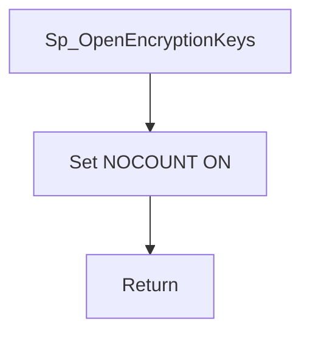

# Sp_OpenEncryptionKeys

## What it does

The procedure is the open-key step that callers run before reading or writing encrypted employee columns. In `HRMS-DATABASE/HRMS/STOREPROCEDURE/Sp_OpenEncryptionKeys.sql` the symmetric-key open is commented out, so a call returns without opening a key and without a result set.

## Parameters

| Name | Direction | What it is for |
|---|---|---|
| — | — | The procedure takes no parameters |

## Steps

1. Set `NOCOUNT ON`.
2. Skip the commented `OPEN SYMMETRIC KEY Encryption_Symmetric_Key` block. Nothing else runs.

## Tables

| Table | Read or write |
|---|---|
| — | The procedure does not read or write a table |

## Procedures and functions it calls

Calls no other procedures or functions.

## Flow

## Call sequence

Calls no other procedures or functions.
