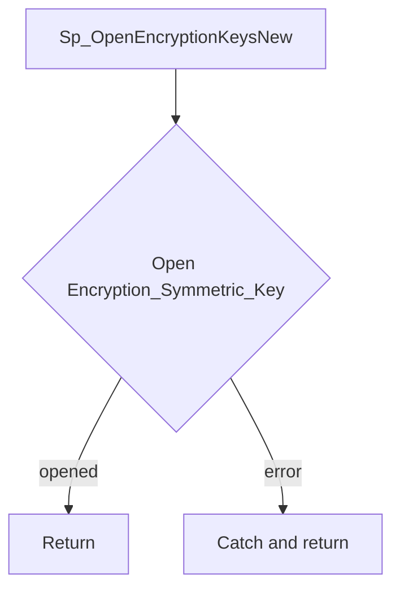

# Sp_OpenEncryptionKeysNew

## What it does

Opens symmetric key `Encryption_Symmetric_Key` with certificate `Encryption_Certificate` so later statements in the same session can use the key. A failure is caught and ignored. The procedure takes no parameters and returns no result set.

## Parameters

| Name | Direction | What it is for |
|---|---|---|
| — | — | The procedure takes no parameters |

## Steps

In `HRMS-DATABASE/HRMS/STOREPROCEDURE/Sp_OpenEncryptionKeysNew.sql`:

1. Set `NOCOUNT ON`.
2. In a `TRY` block, run `OPEN SYMMETRIC KEY Encryption_Symmetric_Key` decrypted by certificate `Encryption_Certificate`.
3. In the `CATCH` block, do nothing.

## Tables

| Table | Read or write |
|---|---|
| — | The procedure does not read or write a table |

## Procedures and functions it calls

Calls no other procedures or functions.

## Flow

## Call sequence

Calls no other procedures or functions.
