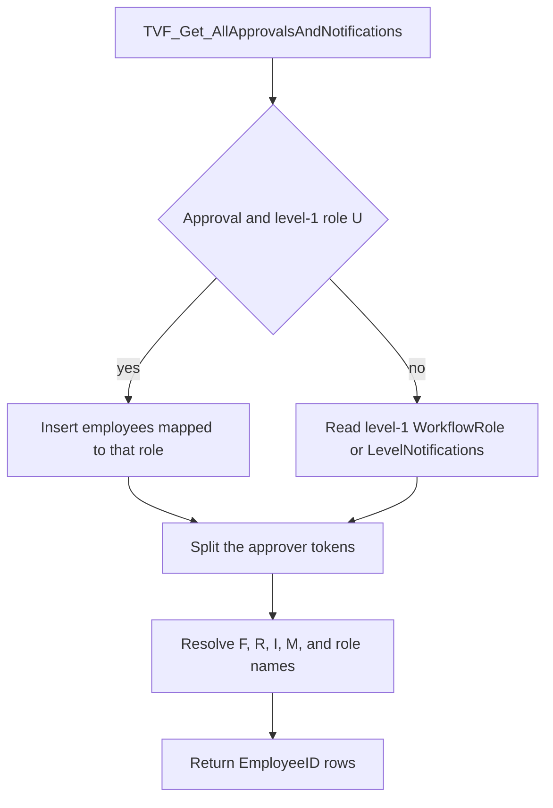

# TVF_Get_AllApprovalsAndNotifications

## What it does

Returns one `EmployeeID` column of people who approve or are notified at routing level 1 of a workflow. Mode `A` reads `TWorkflowDetails.WorkflowRole`. Mode `N` reads `LevelNotifications`. A level-1 role `U` on an approval short-circuits to the employees mapped to that role. Every other token is resolved to a manager, the employee, a business-unit head, or a role membership for the employee's business unit and location.

## Parameters

| Name | Direction | What it is for |
|---|---|---|
| `@Employerid` | in | Employer used when matching `TRoleManagement` |
| `@EmployeeId` | in | Employee whose manager, chart, business unit, and location are read. Token `I` returns this id |
| `@WorkflowId` | in | Workflow whose routing level 1 is read |
| `@NotificationOrApproval` | in | `A` uses `WorkflowRole`. `N` uses `LevelNotifications` |

## Steps

In `HRMS-DATABASE/HRMS/FUNCTIONS/TVF_Get_AllApprovalsAndNotifications.sql`:

1. When `@NotificationOrApproval` is `A` and `TWorkflowDetails` has a level-1 row for `@WorkflowId` with `WorkflowRole = 'U'` and `IsDelete` null or `0`, insert `tRoleEmployeeMapping.Employeeid` for every `Roleid` in that level's `ManagerId` values where `IsDelete = 0`. `@lv_Approvers` stays unset on this branch.
2. Otherwise set `@lv_Approvers` from the first level-1 `TWorkflowDetails` row for `@WorkflowId` that is not deleted. Mode `N` takes `LevelNotifications`. Mode `A` takes `WorkflowRole`. There is no `ORDER BY`.
3. Split `@lv_Approvers` on commas. This insert still runs after the role-`U` branch, where `@lv_Approvers` is unset, so that branch adds no further rows. For tokens `F`, `R`, `I`, `D`, `H`, `A`, and `M`, insert one employee id: `F` is `TEmployeeInfo.FunctionalManager`, `R` is `TORGChart.ReportsTo`, `I` is `@EmployeeId`, and `M` is `TEmployeeOrgBusinessHead.EmployeeId` for the employee's business unit where `IsActive` is null or `1`. Tokens `D`, `H`, and `A` take `tRoleEmployeeMapping` rows whose `TRoleManagement.RoleName` equals the token, `IsDelete = 0`, employer matches, and the role is mapped to the employee's business unit and location.
4. Union employees for every other token, using that same role-name, business-unit, and location match.
5. Return `@ApprovalsAndNotifications`.

## Tables

| Table | Read or write |
|---|---|
| `dbo.TWorkflowDetails` | read |
| `dbo.tRoleEmployeeMapping` | read |
| `dbo.TEmployeeInfo` | read |
| `dbo.TORGChart` | read |
| `dbo.TEmployeeOrgBusinessHead` | read |
| `dbo.tRoleBusinessUnitMapping` | read |
| `dbo.tRoleLocationMapping` | read |
| `dbo.TRoleManagement` | read |

## Procedures and functions it calls

Calls no other procedures or functions.

## Flow

## Call sequence

Calls no other procedures or functions.
