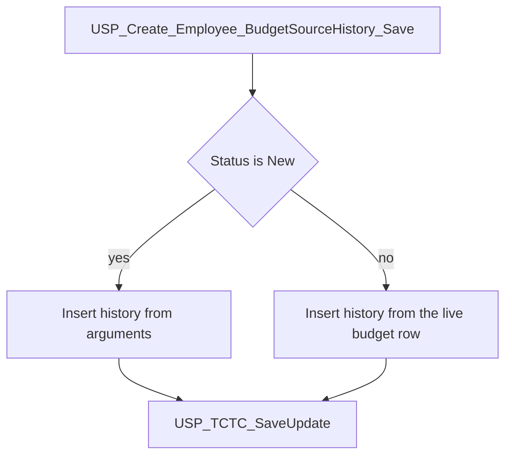
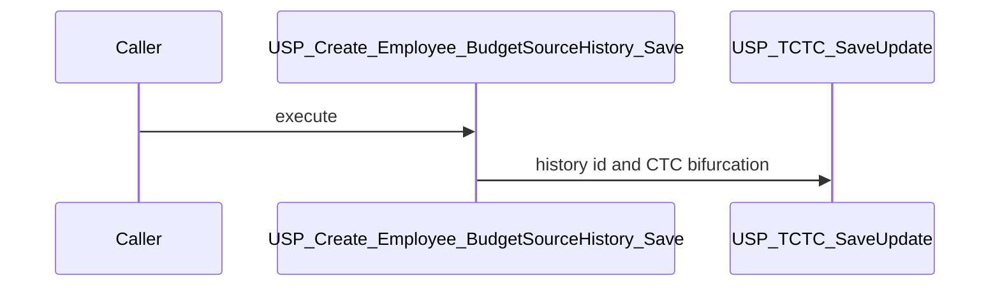

# USP_Create_Employee_BudgetSourceHistory_Save

## What it does

Appends one `TEmployeeBudgetSourceDetailsHistory` row and then stores its CTC bifurcation on `TCTC`. Status `New` copies the arguments. Any other status copies the current live budget row and labels the history with the supplied status.

## Parameters

| Name | Direction | What it is for |
|---|---|---|
| `@EmployeeBudgetSourceDetailID` | in | Live budget row this history belongs to |
| `@RrsId` | in | RRS id stored on a `New` history row. Default null |
| `@RRSBudgetSourceDetailID` | in | RRS budget-source id stored on a `New` history row. Default null |
| `@DonorID` | in | Donor stored on a `New` history row. Default null |
| `@ProjectID` | in | Project stored on a `New` history row. Default null |
| `@BudgetNatureID` | in | Budget nature stored on a `New` history row. Default null |
| `@CTCBifurcation` | in | Bifurcation stored on a `New` history row and passed to CTC save. On any other status it is replaced by the live row's bifurcation. Default null |
| `@MOUDuration` | in | MOU duration stored on a `New` history row. Default null |
| `@IsDeleted` | in | Deleted flag stored on a `New` history row. Default null |
| `@EmployeeId` | in | Employee stored on a `New` history row. Default null |
| `@EmployerId` | in | Employer stored on a `New` history row. Default null |
| `@BudgetSourceStatus` | in | `New` selects the argument insert. Any other value copies the live row and is stored as the history status |
| `@CreatedBy` | in | `CreatedBy` on the history row and on the CTC save. Default null |

## Steps

In `HRMS-DATABASE/HRMS/STOREPROCEDURE/USP_Create_Employee_BudgetSourceHistory_Save.sql`:

1. When `@BudgetSourceStatus` is `New`, insert `TEmployeeBudgetSourceDetailsHistory` from the arguments with `CreatedWhen = GETDATE()`.
2. Take `SCOPE_IDENTITY()` as the history id and execute [USP_TCTC_SaveUpdate](/docs/database/hrms/USP_TCTC_SaveUpdate) with that id, reference type `TEmployeeBudgetSourceDetailsHistory`, the argument `@CTCBifurcation`, and `@CreatedBy`.
3. Otherwise insert history by selecting the live `TEmployeeBudgetSourceDetails` row for `@EmployeeBudgetSourceDetailID`, with `BudgetSourceStatus` set to the argument and `CreatedBy` / `CreatedWhen` set to the argument and `GETDATE()`.
4. Read `CTCBifurcation` back from that live row, take `SCOPE_IDENTITY()` as the history id, and execute [USP_TCTC_SaveUpdate](/docs/database/hrms/USP_TCTC_SaveUpdate) the same way, using the live bifurcation.

## Tables

| Table | Read or write |
|---|---|
| `dbo.TEmployeeBudgetSourceDetailsHistory` | write |
| `dbo.TEmployeeBudgetSourceDetails` | read |

## Procedures and functions it calls

| Object | Kind | When | Page |
|---|---|---|---|
| `USP_TCTC_SaveUpdate` | procedure | after every history insert | [USP_TCTC_SaveUpdate](/docs/database/hrms/USP_TCTC_SaveUpdate) |

## Flow

## Call sequence

