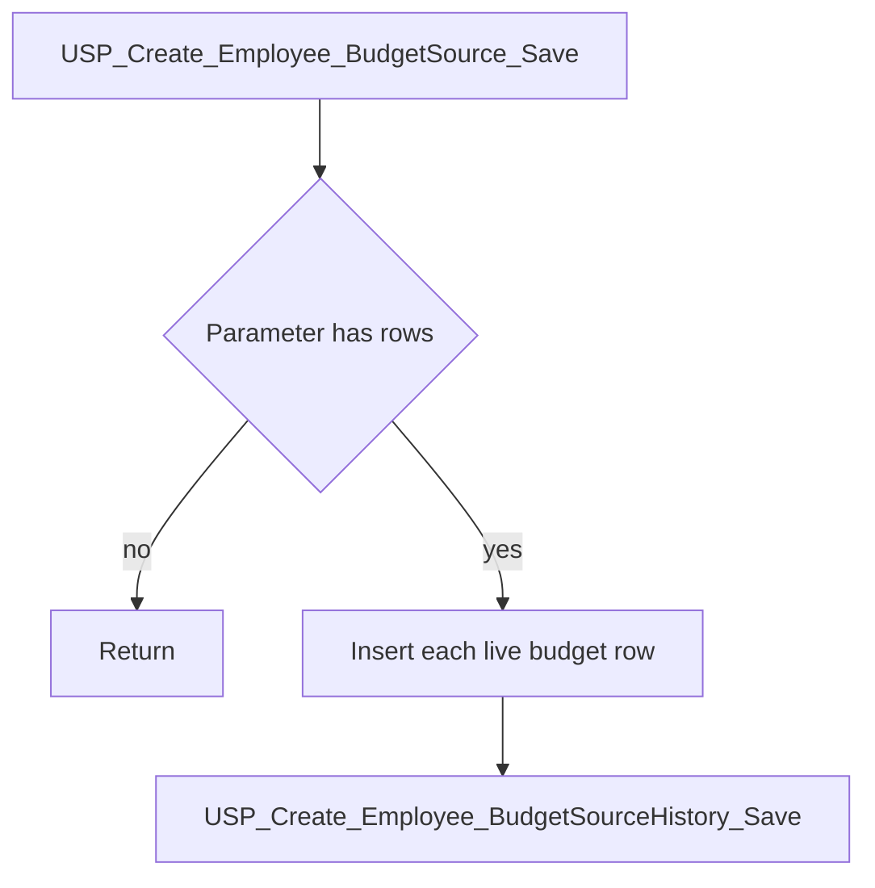
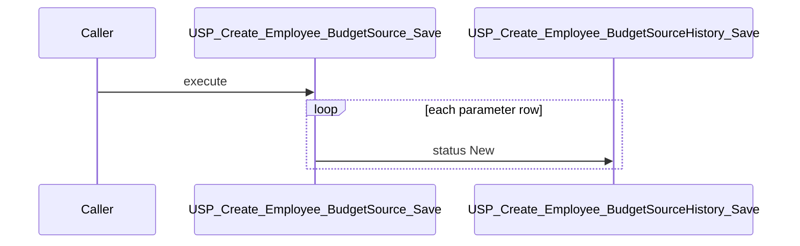

# USP_Create_Employee_BudgetSource_Save

## What it does

Inserts one live employee budget-source row for each row in the table-valued parameter, with status `New`, and writes a matching history row. An empty parameter list does nothing.

## Parameters

| Name | Direction | What it is for |
|---|---|---|
| `@EmployeeBudgetSourceDetails` | in | `UDT_TEmployee_BudgetSourceDetails` rows to insert. Read-only |
| `@RRSId` | in | `RrsId` stored on each new live row and passed to history |
| `@EmployeeID` | in | Employee stored on each new row |
| `@EmployerID` | in | Employer stored on each new row |
| `@CreatedBy` | in | `CreatedBy` on each new row and on history |

## Steps

In `HRMS-DATABASE/HRMS/STOREPROCEDURE/USP_Create_Employee_BudgetSource_Save.sql`:

1. Return immediately when `@EmployeeBudgetSourceDetails` has no rows.
2. Copy distinct donor, project, budget nature, CTC bifurcation, MOU duration, and RRS budget-source id values into `#EmployeeBudgetSourceDetails`, numbered by `ROW_NUMBER()`.
3. For each number, insert `TEmployeeBudgetSourceDetails` with `IsDeleted = 0`, `BudgetSourceStatus = 'New'`, `CreatedWhen = GETDATE()`, and the procedure's RRS, employee, employer, and created-by arguments.
4. Take `SCOPE_IDENTITY()` and execute [USP_Create_Employee_BudgetSourceHistory_Save](/docs/database/hrms/USP_Create_Employee_BudgetSourceHistory_Save) with that id, the same field values, `IsDeleted = 0`, and `@BudgetSourceStatus = 'New'`.

## Tables

| Table | Read or write |
|---|---|
| `@EmployeeBudgetSourceDetails` | read |
| `#EmployeeBudgetSourceDetails` | write |
| `dbo.TEmployeeBudgetSourceDetails` | write |

## Procedures and functions it calls

| Object | Kind | When | Page |
|---|---|---|---|
| `USP_Create_Employee_BudgetSourceHistory_Save` | procedure | after each inserted live row | [USP_Create_Employee_BudgetSourceHistory_Save](/docs/database/hrms/USP_Create_Employee_BudgetSourceHistory_Save) |

## Flow

## Call sequence

