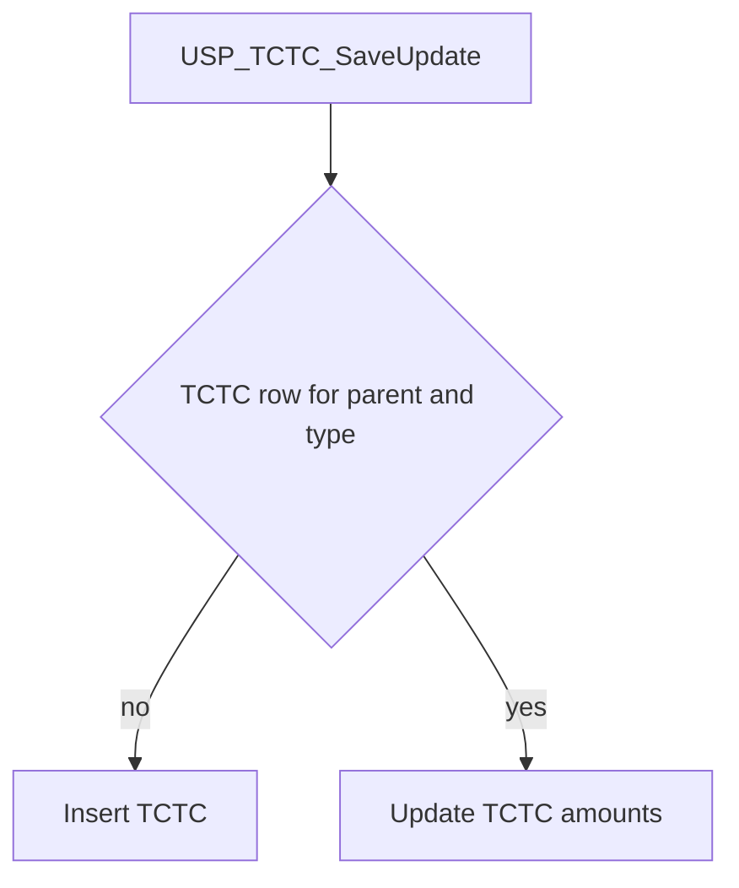

# USP_TCTC_SaveUpdate

## What it does

Inserts a `TCTC` row for a parent and reference type, or updates the existing row. Null arguments leave the stored CTC amounts unchanged on update. The procedure does not return a result set.

## Parameters

| Name | Direction | What it is for |
|---|---|---|
| `@CTCParentID` | in | Parent key stored on `TCTC.CTCParentID` |
| `@CTCRefrenceType` | in | Parent kind stored on `TCTC.CTCRefrenceType`. Together with `@CTCParentID` it decides insert versus update |
| `@CurrentCTC` | in | Optional CTC amount. Default null |
| `@ExpectedCTC` | in | Optional CTC amount. Default null |
| `@AlternateCTCoffer` | in | Optional CTC amount. Default null |
| `@recommendedFixCTC` | in | Optional CTC amount. Default null |
| `@CurrentFixCTC` | in | Optional CTC amount. Default null |
| `@CurrentVariableCTC` | in | Optional CTC amount. Default null |
| `@ExpectedFixctc` | in | Optional CTC amount. Default null |
| `@ExpectedVariablectc` | in | Optional CTC amount. Default null |
| `@AlternateOfferFixCTC` | in | Optional CTC amount. Default null |
| `@AlternateOffervariableCTC` | in | Optional CTC amount. Default null |
| `@recommendedVariableCTC` | in | Optional CTC amount. Default null |
| `@Ctcfixed` | in | Optional CTC amount. Default null |
| `@Ctcvariable` | in | Optional CTC amount. Default null |
| `@LastFixCTC` | in | Optional CTC amount. Default null |
| `@LastVariableCTC` | in | Optional CTC amount. Default null |
| `@NegotiatedCtc` | in | Optional CTC amount. Default null |
| `@FixedNegotiatedCTC` | in | Optional CTC amount. Default null |
| `@LastCTC` | in | Optional CTC amount. Default null |
| `@VariableCTC` | in | Optional CTC amount. Default null |
| `@OC_CurrentCtc` | in | Optional CTC amount. Default null |
| `@OC_ExceptedCtc` | in | Optional CTC amount. Default null |
| `@OC_LastCTC` | in | Optional CTC amount. Default null |
| `@OC_NegotiatedCtc` | in | Optional CTC amount. Default null |
| `@MinCTC` | in | Optional CTC amount. Default null |
| `@MaxCTC` | in | Optional CTC amount. Default null |
| `@CTCBifurcation` | in | Optional `DECIMAL(18,2)` bifurcation. Default null |
| `@CTC` | in | Optional CTC amount. Default null |
| `@CreatedBy` | in | Written to `CreatedBy` on insert. On update it is the value stored in `UpdatedBy`. Default null |
| `@UpdatedBy` | in | Declared and not used. Default null |

## Steps

In `HRMS-DATABASE/HRMS/STOREPROCEDURE/USP_TCTC_SaveUpdate.sql`:

1. Set `NOCOUNT ON` and `READ UNCOMMITTED`.
2. When no `TCTC` row exists for `@CTCParentID` and `@CTCRefrenceType`, insert one row with the supplied amounts, `CreatedBy`, and `CreatedWhen = GETDATE()`.
3. Otherwise update that row. Each amount column becomes `ISNULL` of the argument and the current value. `UpdatedBy` is set from `@CreatedBy`, and `UpdatedWhen` is `GETDATE()`.

## Tables

| Table | Read or write |
|---|---|
| `dbo.TCTC` | read and write |

## Procedures and functions it calls

Calls no other procedures or functions.

## Flow

## Call sequence

Calls no other procedures or functions.
