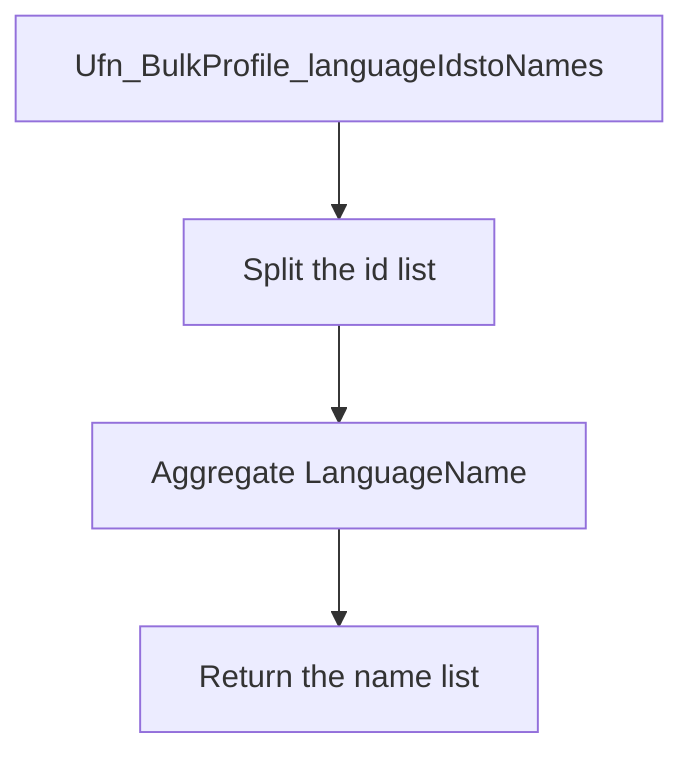

# Ufn_BulkProfile_languageIdstoNames

## What it does

Turns a comma-separated list of language ids into a comma-separated list of language names. The header cites PBI 109292. The script drops the function if it already exists, then creates it.

## Parameters

| Name | Direction | What it is for |
|---|---|---|
| `@lIds` | in | `VARCHAR(400)` comma-separated `tlanguage.Languageid` values |

## Steps

In `HRMS-DATABASE/HRMS/FUNCTIONS/Ufn_BulkProfile_languageIdstoNames.sql`:

1. Split `@lIds` on commas.
2. Return `STRING_AGG(LanguageName, ',')` from `tlanguage` for those ids. The return type is `VARCHAR(400)`.

## Tables

| Table | Read or write |
|---|---|
| `tlanguage` | read |

## Procedures and functions it calls

Calls no other procedures or functions.

## Flow

## Call sequence

Calls no other procedures or functions.
