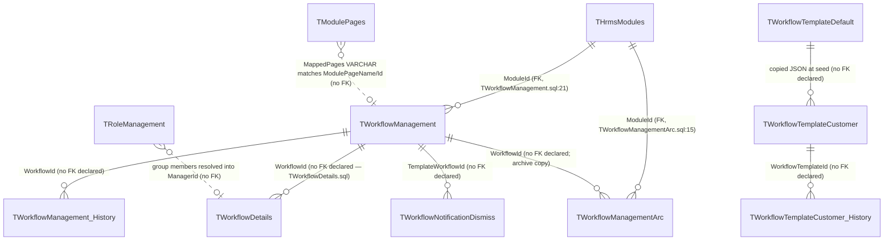

# Workflow

## Overview

An HR administrator needs every state-changing request in the company — leave, work-from-home, resignation, a new hire — to land with the right people, in the right order, with an email at each step. Rather than coding that per module, they design **one named workflow per page**: a tree of approval levels, each level holding approvers chosen by **role** (reporting manager, functional authority, a named workflow group, the initiator themselves…) and optional notify-on-approve / reject / pullback nodes. That tree is saved as XML (`WorkflowDefinitionTree`) against a module page. Later, when an employee submits a request on that page, the engine copies the tree into one pending routing row per level; each assigned manager then approves or rejects until the last level fires the module's own side effects (debit a leave balance, flip a resignation status, and so on).

If the administrator marks the workflow as **skip**, or no workflow is mapped to the page at all, the request never enters the queue — it is applied immediately. Approvers can also **reassign** a pending row to someone else without changing the definition.

**Who's involved:**

- **Workflow admin** — creates workflow groups (named sets of people), adds a workflow header (name, module, mapped page, skip/auto-approve flags), draws the tree, and can clone a finished configuration onto another organisation.
- **Initiator** — any employee (or recruiter, or candidate) raising a request on a mapped page. They do not see the designer; they just submit.
- **Level approver** — resolved at save-time from a role code into a concrete `ManagerId`. They act from a "For Me" queue or an email-launched approve/reject popup.
- **Client-onboarding (COB) admin** — a separate, adjacent path that publishes a JSON workflow *template* into live definitions for a new customer.

This page connects that story to the **application call chain**. For DB-only depth on how a routing row advances and which artifact table `RequestTransid` points at, see `llm-wiki/domain/approval-workflow.md` and the request-type list in `llm-wiki/reference/event-catalog.md`. The live code path is named in SourceCode's `docs/SystemModels/SystemModel-2/domain/contexts/workflow-platform.md` (ADR-004: one XML-tree engine, not per-module engines).

## Workflow

```mermaid
flowchart TD
  subgraph Admin["Admin: design"]
    Groups["CreateRole.aspx<br/>or Define Workflow popup"] --> AddRole["WorkflowManagementBLL.AddRoles<br/>CreateRole.aspx.cs:225"]
    AddRole --> RoleSP["SP_AdminWM_AddRoles"]
    RoleSP --> TRM[("TRoleManagement")]
    Header["CreateWorkFlow.aspx"] --> AddDef["WorkflowManagementBLL.AddWorkflowDefinition<br/>CreateWorkFlow.aspx.cs:747"]
    AddDef --> DefSP["SP_AdminWM_AddDefinition"]
    DefSP --> TWM[("TWorkflowManagement<br/>WorkflowDefinitionTree XML")]
    TreeUI["DefineWorkFlowReact.aspx<br/>DefineWorkflow React"] --> SaveTree["POST /api/workflow/UpdateWorkFlow<br/>WorkflowController.js:214"]
    SaveTree --> TreeSPs["SP_AdminWM_UpdDefinitionTreeDet<br/>+ Remove/Add DefinitionDet"]
    TreeSPs --> TWM
    TreeSPs --> TWD[("TWorkflowDetails<br/>one row per level")]
    Dash["WorkflowDashboard.aspx"] --> Clone["POST /api/workflow/cloneWorkflowDetails<br/>WorkflowController.js:143"]
    Clone --> CloneSP["SP_AdminWM_CloneWorkflowConfiguration"]
    CloneSP --> TWM
  end

  subgraph Runtime["Runtime: a request"]
    Submit["Any mapped page<br/>e.g. leave apply"] --> Check["GenericWorkFlowDal.CheckWorkFlowAvailable<br/>GenericWorkFlowDAL.cs:14"]
    Check --> TreeXml["SP_CM_GetWorkflowTreeXmlDetailsByPageTitle"]
    TreeXml --> Branch{"Workflow mapped<br/>and not SkipWorkFlow?"}
    Branch -->|"no"| Auto["Apply side effects inline<br/>never creates routing rows"]
    Branch -->|"yes"| Materialize["Module insert SP<br/>+ TRequestWorkflows rows"]
    Materialize --> TRW[("TRequestWorkflows<br/>ApproveStatus='P'")]
    TRW --> Queue["For Me queue / email popup"]
    Queue --> ApproveAPI["POST notification/ApproveWorkFlowRequest<br/>or attendance/ApproveRejectRequest<br/>or dashBoard/SubmitApproveReq"]
    ApproveAPI --> ApproveDAL["ApprovalRejectionDAL.ApproveSelectedRequest<br/>ApprovalRejectionDAL.cs:19<br/>or Node NotificationDAL.js:234"]
    ApproveDAL --> ApproveSP["SP_CM_ApproveWorkFlowRequest"]
    Queue --> RejectAPI["POST notification/RejectWorkFlowRequest"]
    RejectAPI --> RejectSP["SP_CM_RejectWorkFlowRequest"]
    Queue --> Reassign["POST notification/ReassignRequest"]
    Reassign --> RerouteSP["SP_CM_RequestReRoute"]
    ApproveSP --> Next{"Last level?"}
    Next -->|"no"| TRW
    Next -->|"yes"| SideEffects["Module side effects<br/>see consuming feature docs"]
  end
```

Role codes written into the tree (and later into `TWorkflowDetails.WorkflowRole`) are: `F` Functional Authority, `R` Reporting Authority, `I` Initiator, `A` Activity Owner, `H` Hiring Manager, `C` Candidate, `D` Recruiter, `B` RecruitmentAdmin, `M` Business Unit Head, `PF` / `PR` previous-level Functional / Reporting Authority. Anything else becomes `U`. Mapping lives in `GenericWorkFlowDal.CheckWorkflowRole` (`GenericWorkFlowDAL.cs:282-296`) and the Node twin `Utils/workflow.js:405-437`.

## Entry points

> ⚠️ **Live designer, corrected**: SourceCode `docs/SystemModels/SystemModel-2/domain/contexts/workflow-platform.md` documents the XML engine and the approve/reject popup, but does **not** name the admin pages. Menu item 27 ("Define Workflow") was redirected to the React host `DefineWorkFlowReact.aspx`. The sibling Telerik page `DefineWorkFlow.aspx` (and its `WorkflowOwnerDialog.aspx` picker) is still compiled, so a bookmark can still open it, but it is not the navigated path. The Customer Setting tab that also mounted `WorkflowManagement.js` is commented out; that component is live only via `WorkflowDashboard.aspx`.

| Entry point | Purpose | Live? |
|---|---|---|
| `HRM/Settings/CreateRole.aspx` | Workflow Group Setup — named groups of people used as tree nodes | Yes (WebForms) |
| `HRM/Settings/CreateWorkFlow.aspx` | Add Workflow — create/update the definition *header* (name, module, mapped page, skip flags) | Yes (WebForms) |
| `HRM/Settings/DefineWorkFlowReact.aspx` | Define Workflow — React tree editor | Yes |
| `HRM/Settings/WorkflowDashboard.aspx` | Catalog / clone / deep-link into Define | Yes |
| `HRM/ApproveReject/ApproveRejectPage.aspx` | Email- and notification-launched React approve/reject popup | Yes |
| `HRM/ApproveReject/ApproveReject.aspx` | Legacy WebForms approve/reject popup | Yes (secondary) |
| Node `POST /api/notification/ApproveWorkFlowRequest` (and Reject / Reassign) | Generic runtime engine used by several queues | Yes |
| Node `POST /api/attendance/ApproveRejectRequest` | Batch approve/reject from Leave/AR/OT dashboards | Yes |
| Node `GET /api/dashBoard/SubmitApproveReq` / `SubmitRejectReq` | Dashboard popup approve/reject | Yes |
| `HRM/Settings/DefineWorkFlow.aspx` + `WorkflowOwnerDialog.aspx` | Legacy Telerik tree editor | Compiled but superseded — menu 27 points at React |
| Customer Setting "WorkFlow Management" tab | Same `WorkflowManagement.js` as the dashboard | Dead tab (commented out) |
| `HRM/BulkUpload_React/WorkflowTemplate.aspx` | COB JSON template editor, not the XML designer | Yes (adjacent product) |

## Code → database call chain

| Step | Entry point | App code | Stored procedure |
|---|---|---|---|
| List / create workflow groups | `CreateRole.aspx.cs:225/233` | `WorkflowManagementBLL.AddRoles` / `UpdateRoles` → `WorkflowManagementDAL.cs:44/77` | `SP_AdminWM_AddRoles` / `SP_AdminWM_UpdateRoles` |
| Create group from React tree popup | Define Workflow `CreateWorkflowPopup.js` | `POST /api/workflow/AddRolesInWorkflow` → `WorkflowController.js:100` | `SP_AdminWM_GetAllRoleMgmtListDet` (dup check), then `SP_AdminWM_AddRoles` |
| Add workflow header | `CreateWorkFlow.aspx.cs:747` | `WorkflowManagementBLL.AddWorkflowDefinition` → `WorkflowManagementDAL.cs:210` | `SP_AdminWM_AddDefinition` |
| Update workflow header | `CreateWorkFlow.aspx.cs` (update path) | `WorkflowManagementBLL.UpdateWorkflowDefinition` → `WorkflowManagementDAL.cs:238` | `SP_AdminWM_UpdateDefinition` |
| Archive previous header | `CreateWorkFlow.aspx.cs:913` | `WorkflowManagementBLL.AddWorkflowDefinitionToArcTable` → `WorkflowManagementDAL.cs:325` | `SP_AdminWM_AddDefinitionToArc` |
| Load tree for editor | `DefineWorkFlowReact.aspx` | `GET /api/workflow/WorkflowList` → `WorkflowController.js:564` | `SP_AdminWM_GetSpecificWFListDetails` (enrich: `SP_CM_GetAllRoleManagementListDetails`, `SP_CM_GetRoleDetailsByRoleId`, `SP_Admin_GetAllEmployeeDetails`) |
| Save tree | `DefineWorkFlowReact.aspx` | `POST /api/workflow/UpdateWorkFlow` → `WorkflowController.js:214` → `Utils/workflow.js` `ProcessWorkFlowXml` | `SP_AdminWM_GetAllWMDetById` → `SP_AdminWM_AddDefinitionToArc` → `SP_AdminWM_UpdDefinitionTreeDet` → `SP_AdminWM_RemoveDefinitionDetById` → `SP_AdminWM_AddDefinitionDet` (email nodes: `SP_AdminETB_GetEmailTemplateWorkflowNode`, `SP_AdminETB_UpdateEmailTemplateWorkflowNodes`) |
| Clone across orgs | `WorkflowDashboard.aspx` | `POST /api/workflow/cloneWorkflowDetails` → `WorkflowController.js:143` → `WorkflowDAL.CloneWorkflowDetails` | `SP_AdminWM_CloneWorkflowConfiguration` |
| Dashboard catalog | `WorkflowDashboard.aspx` | `GET /api/dashBoard/WorkflowCategory` + `GET /api/dashBoard/WorkflowList` | `SP_AdminWM_GetHRMSModules`, `SP_AdminWM_GetSpecificWFListDetails` |
| Empty-group warning | `WorkflowDashboard.aspx` | `GET /api/workflow/GetEmptyWorkflowGroups` → `WorkflowController.js:1238` | `USP_AdminWM_GetEmptyWorkflowGroups` |
| Resolve which workflow applies at request time | any mapped page (e.g. leave apply) | `GenericWorkFlowBLL.CheckWorkFlowAvailable` → `GenericWorkFlowDal.CheckWorkFlowAvailable` (`GenericWorkFlowDAL.cs:14`) → `GetWorkFlowTreeXml` (`:30`) | `SP_CM_GetWorkflowTreeXmlDetailsByPageTitle` |
| Approve (WebForms / email popup) | `ApproveReject.aspx` / `Web.Common.cs:206` | `CommonBLL.ApproveSelectedRequest` → `ApprovalRejectionDAL.ApproveSelectedRequest` (`ApprovalRejectionDAL.cs:19`) | `SP_CM_ApproveWorkFlowRequest` (`DBConstant.cs:13`; the constant `SP_ApproveWorkFlowRequest` at `:1190` is an **alias** to this same string) |
| Reject (WebForms) | same | `ApprovalRejectionDAL.RejectSelectedRequest` (`ApprovalRejectionDAL.cs:62`) | `SP_CM_RejectWorkFlowRequest` |
| Reassign (WebForms) | same | `ApprovalRejectionDAL.ReRouteSelectedRequest` (`ApprovalRejectionDAL.cs:118`) | `SP_CM_RequestReRoute` |
| Approve / reject (Node, generic) | `POST /api/notification/ApproveWorkFlowRequest` | `NotificationController.js:157` → `NotificationDAL.js:234` | `SP_CM_ApproveWorkFlowRequest` |
| Approve / reject (Node, dashboard popup) | `GET /api/dashBoard/SubmitApproveReq` | `DashBoardRoutes.js:20` → `dashBoardDAL.js:151-167` | `SP_CM_ApproveWorkFlowRequest` |
| Approve / reject (Node, batch) | `POST /api/attendance/ApproveRejectRequest` | `AttendanceRoutes.js:32` → `attendanceDAL.js` | `SP_CM_ApproveWorkFlowRequest` / `SP_CM_RejectWorkFlowRequest` |
| Reassign (Node) | `POST /api/notification/ReassignRequest` | `NotificationRoutes.js:35` → `NotificationDAL.js:447` | `SP_CM_RequestReRoute` |
| Publish COB template → live definitions | `WorkflowTemplate.aspx` | `POST /api/workflowTemplates/publish` → `WorkflowTemplateBLL.js:407+` → `WorkflowDAL.addWorkflowDefinition` (`WorkflowDAL.js:132`) | `SP_GetCustomerWorkflowTemplate`, then **unprefixed** `SP_AddWorkflowDefinition_ReturnId` + `SP_AddWorkflowDefinitionDetails` (not the `SP_AdminWM_*` pair used by Add Workflow) |

## API endpoints

Live Workflow admin routes are the V1 handlers in `WorkflowRoutes.js`, mounted twice in `routeIndex.js:149` and `:199` as `/api/workflow` and `/api/V2/workflow`. `WorkflowRoutes_V2.js` / `_V3.js` exist on disk but are **not** `require`d; `/api/V3/workflow` is commented out (`routeIndex.js:207`). The same dual-mount pattern applies to `/api/workflowTemplates`.

| Verb | Route | Parameters | Purpose | Source |
|---|---|---|---|---|
| `GET` | `/api/workflow/GetOrganisationHierarchy` | query `Employerid` (int, required) | BU tree for scoping a workflow | `WorkflowRoutes.js:9`; `WorkflowController.js:25` |
| `GET` | `/api/workflow/GetAllEmployeeDetails` | query `EmployerId` (int, required); `EmployeeId` is overwritten from the token `req.EID` | People picker for tree nodes | `WorkflowRoutes.js:10`; `WorkflowController.js:58` |
| `POST` | `/api/workflow/SaveUpdateWorkflowGroup` | body `RoleId`, `RoleName`, `RoleDescription`, `EffectiveDate`, `LocationId`, `BusinessUnitId`, `EmployeeID`, `UpdatedBy`, `Employerid`, `IsAuthSign`, `IsActive` | Update an existing workflow group; cascades a rename into stored XML | `WorkflowRoutes.js:11`; `WorkflowController.js:78` |
| `POST` | `/api/workflow/AddRolesInWorkflow` | body `RoleName`, `RoleDescription`, `EffectiveDate`, `EmployeeID`, `LocationId`, `BusinessUnitId`, `Employerid`, `IsAuthSign`, `IsActive`; `CreatedBy` from `req.EID` | Create a workflow group (duplicate name rejected) | `WorkflowRoutes.js:12`; `WorkflowController.js:100` |
| `POST` | `/api/workflow/RemoveRoleByRoleId` | body `RoleId`, `UpdatedBy` | Soft-remove a group | `WorkflowRoutes.js:15`; `WorkflowController.js:88` |
| `POST` | `/api/workflow/cloneWorkflowDetails` | body `sourceEmployer`, `targetEmployers`, `workflowIds`, `IsEmployeesIncludedForWFGroup`, `IsEmailTemplatesClone`, `IsEmialTemplateOverride`, `IsWFGroupOverride`, `loggedEmployeeId`, `IsWorkflowSkip`, `sourceBU`, `sourceLocation`, optional `targetBUs` / `targetLocations`, `IsAllBUSelected`, `IsAllLocationSelected`, `PreviewOnly` | Clone definitions (and optionally groups/email templates) onto other employers | `WorkflowRoutes.js:13`; `WorkflowController.js:143` |
| `GET` | `/api/workflow/getActiveEmployerDetails` | query `employeeId` (int, required) | Orgs the admin can clone onto | `WorkflowRoutes.js:14`; `WorkflowController.js:166` |
| `POST` | `/api/workflow/UpdateWorkFlow` | body `combinedObject[]`, each `{ WorkflowId, id, EmployerId, addedNodes }` | Persist the XML tree and materialise `TWorkflowDetails` | `WorkflowRoutes.js:16`; `WorkflowController.js:214` |
| `GET` | `/api/workflow/WorkflowList` | query `employerid` (required), `userType`, `ModID`, optional `buId`, `locationId` | List definitions + parsed approval levels for the editor | `WorkflowRoutes.js:17`; `WorkflowController.js:564` |
| `GET` | `/api/workflow/GetEmptyWorkflowGroups` | query `employerId` (int, required) | Dashboard warning: groups with nobody in them | `WorkflowRoutes.js:19`; `WorkflowController.js:1238` |
| `GET` | `/api/workflow/getPendingWorkflowPanelCount` | query `employerId` (int, required); employee from token | Admin "pending workflows to define" badge | `WorkflowRoutes.js:20`; `WorkflowController.js:1260` |
| `GET` | `/api/workflow/getPendingWorkflowPanelDetails` | query `employerId`, `employeeId` (int, required) | Admin pending-to-define panel body | `WorkflowRoutes.js:21`; `WorkflowController.js:1282` |
| `POST` | `/api/workflow/dismissWorkflowNotification` | body `employerId`, `templateWorkflowId`, `employeeId` (int, required) | Hide a published-template notification for that org | `WorkflowRoutes.js:22`; `WorkflowController.js:1308` |
| `GET` | `/api/workflow/bulkUpdateXmlDoc` | query `EmployerID` | One-off bulk XML rewrite of stored trees | `WorkflowRoutes.js:18`; `WorkflowController.js:947` |
| `GET` | `/api/dashBoard/WorkflowCategory` | query `employerid` | Module list for the dashboard filter | `DashBoardRoutes.js:63` |
| `GET` | `/api/dashBoard/WorkflowList` | query `employerid`, `userType`, `ModID`, optional `buId`/`locationId` | Dashboard grid (same list SP as `/workflow/WorkflowList`) | `DashBoardRoutes.js:65` |
| `POST` | `/api/notification/ApproveWorkFlowRequest` | body `RequestType`, `RequestTransId`, `EmployeeId`, `comments`, `Employerid` (all required for the generic path) | Generic approve | `NotificationRoutes.js:22`; `NotificationController.js:157` |
| `POST` | `/api/notification/RejectWorkFlowRequest` | body `RequestType`, `RequestTransId`, `RejectionReason`, `EmployeeId`, `Employerid` | Generic reject | `NotificationRoutes.js:23`; `NotificationController.js:168` |
| `POST` | `/api/notification/ReassignRequest` | body `RequestTransId`, `ReRouteEmployeeid`, `RequestType`, `EmployerId`, `Reason`, `LoggedInEmployeeId` | Reassign the pending row's `ManagerId` | `NotificationRoutes.js:35`; `NotificationController.js:274` |
| `GET` | `/api/dashBoard/SubmitApproveReq` | query `transId`, `employeeId`, `comments`, `requestType`, `employerId` | Dashboard popup approve | `DashBoardRoutes.js:20` |
| `GET` | `/api/dashBoard/SubmitRejectReq` | query `transId`, `employeeId`, `comments`, `requestType`, `employerId` | Dashboard popup reject | `DashBoardRoutes.js:21` |
| `POST` | `/api/attendance/ApproveRejectRequest` | body `combinedARData[]`: `actionType` (`Approve`\|`Reject`), `RequestTransId`, `RequestType`, `Employerid`, `comments`/`RejectionReason`; `EmployeeId` overwritten from `req.EID` | Batch approve/reject from Leave/AR/OT queues | `AttendanceRoutes.js:32` |
| `POST` | `/api/workflowTemplates/` | body `jsonData` (string, required), `employerId`, `employeeId` (number, required); optional `objectName`, `objectDescription` | Create a customer COB template | `WorkflowTemplateRoutes.js:19` |
| `GET` | `/api/workflowTemplates/` | query `employerId`, `employeeId` (required) | Get or seed-from-default the customer template | `WorkflowTemplateRoutes.js:22` |
| `PUT` | `/api/workflowTemplates/` | body `customerVersion`, `templateData`, `employerId`, `employeeId` (required) | Update template JSON (blocked once published) | `WorkflowTemplateRoutes.js:25` |
| `DELETE` | `/api/workflowTemplates/:workflowTemplateId` | params `workflowTemplateId`; body `employerId`, `employeeId` | Intended soft-delete — controller calls a BLL method that **does not exist** | `WorkflowTemplateRoutes.js:28` |
| `POST` | `/api/workflowTemplates/publish` | body `customerVersion`, `employerId`, `employeeId` | Expand JSON into `TWorkflowManagement` / `TRoleManagement` / email links | `WorkflowTemplateRoutes.js:31` |
| `GET` | `/api/workflowTemplates/lookups` | query `category` (required), optional `lookupKey` | Lookup values for the template editor | `WorkflowTemplateRoutes.js:34` |
| `GET` | `/api/workflowTemplates/mappedPages` | none | Module pages available to map | `WorkflowTemplateRoutes.js:37` |

There is no dedicated Workflow controller in `HRMS.CoreAPI` .NET — the Node CoreAPI above is the API layer. Classic WebForms pages (`CreateRole`, `CreateWorkFlow`, legacy `DefineWorkFlow`) post back to `WorkflowManagementBLL` and never hit these routes.

## Stored procedures & tables involved

> ⚠️ **Live dispatcher, corrected**: `llm-wiki/domain/approval-workflow.md` and `llm-wiki/reference/event-catalog.md` narrate `SP_ApproveWorkFlowRequest` / `SP_RejectWorkFlowRequest`. Both of those objects still exist as files in `HRMS-DATABASE/HRMS/STOREPROCEDURE/`. Every **live** DAL/Node path found in this pass — `ApprovalRejectionDAL`, `LeaveManagementDAL` via the `DBConstant.SP_ApproveWorkFlowRequest` alias, `NotificationDAL.js`, `dashBoardDAL.js`, `attendanceDAL.js` — executes **`SP_CM_ApproveWorkFlowRequest` / `SP_CM_RejectWorkFlowRequest`**. That matches SourceCode `workflow-platform.md` (2026-07-24). The wiki's leave-lifecycle page still flags "which is live: unverified"; from the application side it is verified as the `CM_` pair. The bare `SP_ApproveWorkFlowRequest` string remains only in unused `DBHelper` helpers. Short-circuit flags (`SkipWorkFlow`, `IsWorkflowPartial`) are still decided at request-creation time by `SP_CM_GetWorkflowTreeXmlDetailsByPageTitle`, as the wiki says — they are not consulted inside the approve dispatcher.

Designer/admin objects are **not** covered by that wiki page; they live under the `SP_AdminWM_*` / `USP_AdminWM_*` prefix. `llm-wiki/reference/tables/hrms.md` catalogs the tables.

| Object | File path | Purpose | Wiki |
|---|---|---|---|
| `TWorkflowManagement` | `HRMS-DATABASE/HRMS/TABLES/TWorkflowManagement.sql` | Definition header + XML tree, mapped page, skip/auto-approve flags | `llm-wiki/domain/approval-workflow.md` |
| `TWorkflowDetails` | `HRMS-DATABASE/HRMS/TABLES/TWorkflowDetails.sql` | One materialised row per level (manager, role code, notification XML) | `llm-wiki/reference/tables/hrms.md` |
| `TWorkflowManagementArc` | `HRMS-DATABASE/HRMS/TABLES/TWorkflowManagementArc.sql` | Archive snapshot taken before a tree/header update | `llm-wiki/reference/tables/hrms.md` |
| `TWorkflowManagement_History` | `HRMS-DATABASE/HRMS/TABLES/TWorkflowManagement_History.sql` | Row-level history of definition changes | `llm-wiki/reference/tables/hrms.md` |
| `TRequestWorkflows` | `HRMS-DATABASE/HRMS/TABLES/TRequestWorkflows.sql` | Per-request routing instance (no PK, no FK) | `llm-wiki/domain/approval-workflow.md` |
| `TRoleManagement` | `HRMS-DATABASE/HRMS/TABLES/TRoleManagement.sql` | Workflow groups (named sets of people) | `llm-wiki/reference/tables/hrms.md` |
| `THrmsModules` | `HRMS-DATABASE/HRMS/TABLES/THrmsModules.sql` | Module catalog; the only declared FK from `TWorkflowManagement` | `llm-wiki/domain/approval-workflow.md` |
| `TModulePages` | `HRMS-DATABASE/HRMS/TABLES/TModulePages.sql` | Pages a workflow can be mapped to (`IsWorkflowAvailable`); `MappedPages` on the definition is a VARCHAR, not an FK | — |
| `TWorkflowNotificationDismiss` | `HRMS-DATABASE/HRMS/TABLES/TWorkflowNotificationDismiss.sql` | Per-org dismissal of "define this template workflow" notifications | — |
| `TWorkflowTemplateDefault` / `TWorkflowTemplateCustomer` | `HRMS-DATABASE/HRMS/DDL/111756/` | COB JSON templates (not in `TABLES/`) | — |
| `TAdminChangesApprovals` | (see wiki) | Config-change approvals that reuse `TRequestWorkflows` but a different approve SP | `llm-wiki/domain/approval-workflow.md` |
| `SP_AdminWM_AddRoles` / `UpdateRoles` / `RemoveRoleByRoleId` | `HRMS-DATABASE/HRMS/STOREPROCEDURE/` | Workflow group CRUD | — |
| `SP_AdminWM_AddDefinition` / `UpdateDefinition` | same | Definition header CRUD (Add Workflow page) | — |
| `SP_AdminWM_UpdDefinitionTreeDet` / `AddDefinitionDet` / `RemoveDefinitionDetById` / `AddDefinitionToArc` | same | Tree save chain (Define Workflow) | — |
| `SP_AdminWM_GetSpecificWFListDetails` / `GetHRMSModules` / `GetAllWMDetById` | same | List/load for dashboard and editor | — |
| `SP_AdminWM_CloneWorkflowConfiguration` | same | Cross-employer clone | — |
| `USP_AdminWM_GetEmptyWorkflowGroups` | same | Empty-group warning | — |
| `USP_GetPendingWorkflowPanel_Count` / `_Details` / `USP_DismissWorkflowNotification` | same | Admin "still to define" panel | — |
| `SP_CM_GetWorkflowTreeXmlDetailsByPageTitle` | same | Runtime: which definition applies to this page | `llm-wiki/domain/approval-workflow.md` |
| `SP_CM_ApproveWorkFlowRequest` | same | **Live** approve dispatcher | wiki narrates the non-`CM_` twin; see callout above |
| `SP_CM_RejectWorkFlowRequest` | same | **Live** reject dispatcher | same |
| `SP_CM_RequestReRoute` | same | Reassign pending `ManagerId` | `llm-wiki/domain/approval-workflow.md` |
| `SP_InsertRequestWorkflow` | same | Insert a routing row; wrapped by `WorkflowManagementDAL.cs:308`, not the generic approve DAL | — |
| `SP_AddWorkflowDefinition_ReturnId` / `SP_AddWorkflowDefinitionDetails` | same | COB publish path (unprefixed names, parallel to `SP_AdminWM_*`) | — |
| `SP_ApproveWorkFlowRequest` / `SP_RejectWorkFlowRequest` | same | Legacy dispatcher objects still in the DB repo; not passed by live DAL/Node | `llm-wiki/domain/approval-workflow.md` |

## Table relationships

Definition-side edges below are taken from each table's `CREATE TABLE` (most HRMS workflow tables declare no FK). Runtime / polymorphic edges are **reused** from `llm-wiki/domain/approval-workflow.md` — not re-derived.

Runtime hub, copied from `llm-wiki/domain/approval-workflow.md` (the wiki is canonical for these edges, including the "no FK" wording):

```mermaid
erDiagram
  THrmsModules ||--o{ TWorkflowManagement : "ModuleId (FK, TWorkflowManagement.sql:21)"
  TWorkflowManagement ||--o{ TRequestWorkflows : "WorkflowId (no FK — TRequestWorkflows has no FK/PK at all)"
  TRequestWorkflows }o--|| TLeaveRequest : "RequestTransid — LeaveRequest/LeaveCancellation/LeavePullback (polymorphic, no FK)"
  TRequestWorkflows }o--|| TOptionalHolidayRequest : "RequestTransid — OptionalHolidayRequest/-Cancellation (polymorphic, no FK)"
  TRequestWorkflows }o--|| TCompOffRequest : "RequestTransid — CompOffCreditRequest (polymorphic, no FK)"
  TRequestWorkflows }o--|| TAttendanceRegularization : "RequestTransid — AttendanceRegularize/ARCancellation (polymorphic, no FK)"
  TRequestWorkflows }o--|| TBusinessCards : "RequestTransid — BusinessCard (polymorphic, no FK)"
  TRequestWorkflows }o--|| TResignationDetails : "RequestTransid — ResignationDetails/ResignationPullback (polymorphic, no FK)"
  TRequestWorkflows }o--|| TActivityDetails : "RequestTransid — ResignationActivity (polymorphic, no FK)"
  TRequestWorkflows }o--|| TTerminationActivityDetails : "RequestTransid — TerminationActivity (polymorphic; target has no PK either)"
  TRequestWorkflows }o--|| TWorkFromHomeRequest : "RequestTransid — WorkFromHome/-Cancellation/-Pullback (polymorphic; target has no PK either)"
  TRequestWorkflows }o--|| TPMSEmployeeSelfAppraisal : "RequestTransid — SelfAssessment (polymorphic; target has no PK either)"
  TRequestWorkflows }o--|| TCMSEmployeeConfirmation : "RequestTransid — ConfirmationAssessment (polymorphic; target has no PK either)"
  TRequestWorkflows }o--|| TRRSDetails : "RequestTransid — RecruitmentManagement (polymorphic, no FK)"
  TRequestWorkflows }o--|| TRRSCandidateInterview : "RequestTransid — InterviewFeedback (polymorphic, no FK)"
  TRequestWorkflows }o--|| TRRSCandidate : "RequestTransid — InitiateHiring (polymorphic, no FK)"
  TRequestWorkflows }o--|| TAdminChangesApprovals : "RequestTransid — admin config-change types, approved by SP_ApproveAdminChangesRequest not this SP (polymorphic, no FK)"
  TAdminChangesApprovals ||--o{ TAdminChangesApprovalDetails : "ChangeRequestID (FK, TAdminChangesApprovalDetails.sql:11)"
```

## Known gaps

- **Two definition-write stacks.** The live Add Workflow / Define Workflow path uses `SP_AdminWM_AddDefinition` / `SP_AdminWM_AddDefinitionDet`. COB template publish uses the older unprefixed `SP_AddWorkflowDefinition_ReturnId` / `SP_AddWorkflowDefinitionDetails` (`WorkflowDAL.js:148/187`). `WorkflowDefinitionHelper.cs` still hardcodes the unprefixed names and is only reached from `GenericWorkflowHelper`, which itself is superseded by `GenericWorkFlowDal`.
- **Two role-list procedures.** React group pickers call `SP_CM_GetAllRoleManagementListDetails`; `WorkflowManagementDAL.GetRoleManagementList` calls `SP_AdminWM_GetAllRoleMgmtListDet`. Same feature family, different procs.
- **`SP_ApproveWorkFlowRequest` vs `SP_CM_ApproveWorkFlowRequest`.** Application code uses the `CM_` pair. The DB wiki still documents the non-`CM_` objects as the engine, and `llm-wiki/domain/leave-lifecycle.md` still marks which one is live as unverified. Both files remain in `HRMS-DATABASE`.
- **`TWorkflowDetails.WorkflowRole` is `CHAR(1)`** while the role map includes two-letter codes `PF` / `PR`. Node's COB insert binds `VarChar(2)`; the table script would truncate. Whether `SP_AdminWM_AddDefinitionDet` stores two-letter codes in practice was not re-read.
- **`IsEnableAutoApproved`** on `TWorkflowManagement` is still treated by the wiki as unconfirmed/possibly legacy (only seen in the clone procedure). This pass did not find a request-creation or approve path that reads it either.
- **V2/V3 Workflow route files** (`WorkflowRoutes_V2.js`, `WorkflowController_V2.js`, …) are unmounted. `/api/V2/workflow` serves the V1 router.
- **`DELETE /api/workflowTemplates/:id`** is routed, but `WorkflowTemplateBLL` has no `deleteWorkflowTemplate` method — calling it would throw at runtime.
- **`GenericWorkflowHelper.CheckWorkFlowAvailable`** is still *called* from `LeaveCancellation.aspx.cs` and `ResignationPullback.aspx.cs` but the method does not exist on that class (dead remnant / compile-break risk on those pages).
- **Standalone console projects** `HRMS.ValidateWorkflows` and `HRMS.AddWorkflowsNodes` sit at the SourceCode repo root and were not traced into the live web/API path.
- **`TRequestWorkflows_Flat` / `USP_Sync_TRequestWorkflows_Flat`** exist in the DB repo and were not referenced by the designer or generic approve DAL in this pass.
- Per-module side effects of approve/reject (leave debit, AR status flip, resignation close, …) are documented on those features' own pages (`leave-management.md`, `attendance.md`, `separation.md`) and in the corresponding `llm-wiki/domain/*-lifecycle.md` files — not repeated here.

## Reference

Last analyzed 2026-08-14. Confidence: **high** — app-side designer and approve/reject call chains verified end-to-end with file:line citations; DB-side engine behaviour is inherited from `llm-wiki/domain/approval-workflow.md` rather than re-derived; the live dispatcher name (`SP_CM_*`) is resolved from SourceCode, not from the wiki's `SP_ApproveWorkFlowRequest` narrative.

### SourceCode

- `HRMS.Web/HRMS.Web/HRM/Settings/DefineWorkFlowReact.aspx`
- `HRMS.Web/HRMS.Web/HRM/Settings/WorkflowDashboard.aspx`
- `HRMS.Web/HRMS.Web/HRM/Settings/CreateWorkFlow.aspx.cs`
- `HRMS.Web/HRMS.Web/HRM/Settings/CreateRole.aspx.cs`
- `HRMS.Web/HRMS.Web/HRM/Settings/DefineWorkFlow.aspx` (superseded)
- `HRMS.Web/HRMS.Web/HRM/DashBoard_React/Areas/DefineWorkflow/`
- `HRMS.Web/HRMS.Web/HRM/DashBoard_React/Areas/CustomerSetting/Components/WorkflowManagement.js`
- `HRMS.Web/HRMS.Web/HRM/ApproveReject/`
- `HRMS.Web/HRMS.Web/HRM/BulkUpload_React/WorkflowTemplate.aspx`
- `HRMS.Shared/HRMS.DataAccessLayer/GenericWorkFlowDAL/GenericWorkFlowDAL.cs`
- `HRMS.Shared/HRMS.DataAccessLayer/GenericWorkFlowDAL/WorkflowManagementDAL.cs`
- `HRMS.Shared/HRMS.BusinessLayer/GenericWorkFlow/GenericWorkFlowBLL.cs`
- `HRMS.Shared/HRMS.BusinessLayer/GenericWorkFlow/WorkflowManagementBLL.cs`
- `HRMS.Shared/HRMS.DataAccessLayer/ApprovalRejectionDAL.cs`
- `HRMS.Shared/HRMS.DataAccessLayer/DBConstant.cs`
- `HRMS.CoreAPI/HRMS.Core.WebAPI.Node/Routes/WorkflowRoutes.js`
- `HRMS.CoreAPI/HRMS.Core.WebAPI.Node/Routes/WorkflowTemplateRoutes.js`
- `HRMS.CoreAPI/HRMS.Core.WebAPI.Node/Routes/routeIndex.js`
- `HRMS.CoreAPI/HRMS.Core.WebAPI.Node/Controllers/WorkflowController.js`
- `HRMS.CoreAPI/HRMS.Core.WebAPI.Node/Core/DataAccessLayer/WorkflowDAL.js`
- `HRMS.CoreAPI/HRMS.Core.WebAPI.Node/Routes/NotificationRoutes.js`
- `HRMS.CoreAPI/HRMS.Core.WebAPI.Node/Routes/DashBoardRoutes.js`
- `HRMS.CoreAPI/HRMS.Core.WebAPI.Node/Routes/AttendanceRoutes.js`
- `docs/SystemModels/SystemModel-2/domain/contexts/workflow-platform.md`
- `docs/SystemModels/SystemModel-2/behavior/workflows/generic-approval.md`
- `docs/SystemModels/SystemModel-2/architecture/adr/004-generic-xml-workflow-engine.md`

### TDG HRMS DB

- `llm-wiki/domain/approval-workflow.md`
- `llm-wiki/reference/event-catalog.md`
- `llm-wiki/architecture/module-catalog.md`
- `HRMS-DATABASE/HRMS/TABLES/TWorkflowManagement.sql`
- `HRMS-DATABASE/HRMS/TABLES/TWorkflowDetails.sql`
- `HRMS-DATABASE/HRMS/TABLES/TRequestWorkflows.sql`
- `HRMS-DATABASE/HRMS/STOREPROCEDURE/SP_CM_ApproveWorkFlowRequest.sql`
- `HRMS-DATABASE/HRMS/STOREPROCEDURE/SP_CM_GetWorkflowTreeXmlDetailsByPageTitle.sql`
