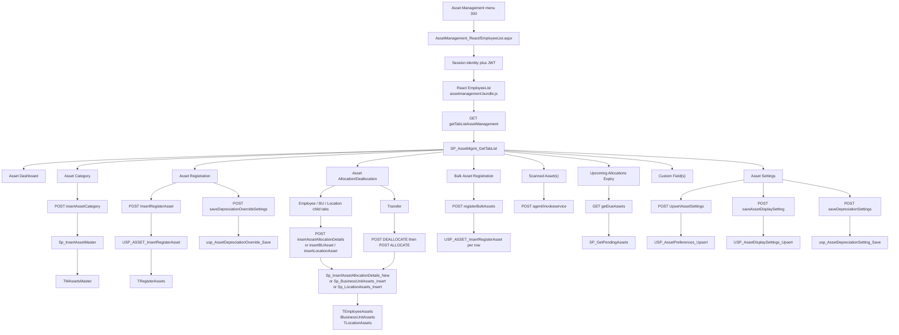
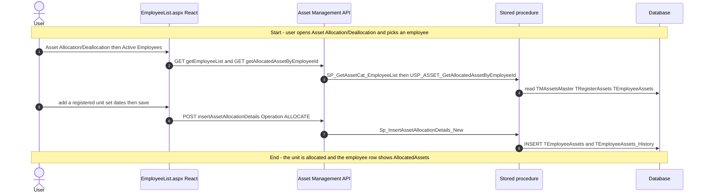
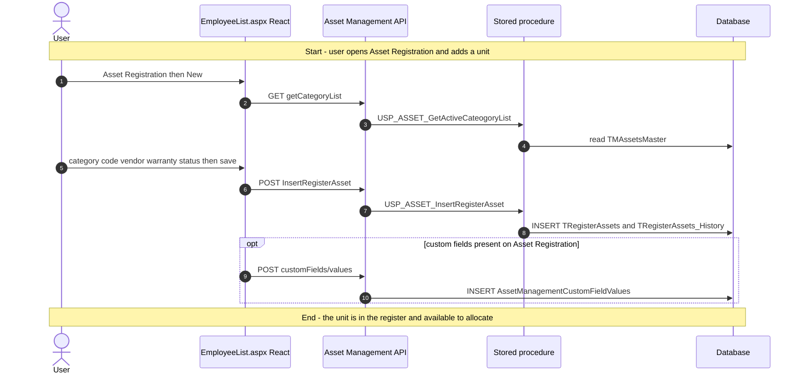
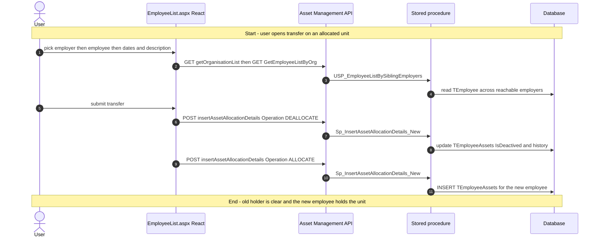
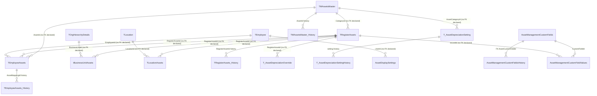

# Asset Management

## Overview

An organisation owns laptops, phones, furniture, and other tagged items. An HR or Admin user needs those items catalogued, numbered, and assigned to a person, a business unit, or a location — and later taken back, transferred, marked for repair, or retired. They open the left-nav item **Asset Management**. The WebForms host `EmployeeList.aspx` only stamps session identity into hidden fields; the live UI is the React SPA in the Asset Management repository, shipped as `BuildJS/assetmanagement.bundle.js`. Tabs come from `TTabDetails` for menu **300**, filtered by role/user tab rights unless the signed-in user has global access.

The usual story: an administrator defines an **Asset Category** (Laptop, with optional auto-number prefix and named Asset Managers). They **register** a physical unit under that category (asset code, vendor, warranty, status, location). Then they **allocate** it to an active employee, a business unit, or a location, with an allocation date and optional end date. They can **transfer** an allocated unit to another employee — including in another organisation the user can reach — which deallocates from the current holder then allocates to the new one in two posts. Deallocation writes a deallocation date and description and leaves the register row available again. Soft-delete of a category or a registered unit sets `IsDelete` and writes a history row; a mapped unit cannot be dropped until it is unmapped.

On **Asset Settings** the same administrator sets email windows, auto-registration from agent scans, **display mode** (how grids show asset identity), and **category-level depreciation** (straight-line or declining-balance). A registered unit can override that category rule and show a projection on its history modal. System-defined asset statuses are protected; extra status values are maintained through the setup-master modal.

**Who's involved:**

- **HR / Admin / Asset Manager** — owns categories, registration, allocation/deallocation/transfer, bulk Excel registration, custom fields, settings (email, auto-register, display, depreciation), and the dashboard. Asset Managers named on a category also receive the **Upcoming Allocations Expiry** list (end date within 30 days).
- **Employee** — does not run this menu. They see allocated items on **My Details** (the same SPA bundle is embedded there). A manager viewing a reportee also lands in that embed.
- **Cross-platform agent / IT** — a Windows agent posts scans without a user JWT on two anonymous routes; results land on **Scanned Asset(s)** and can auto-register when settings allow.
- **Scheduler / email** — module pages on `EmployeeList.aspx` fire allocation, deallocation, warranty, repair-status, and scanned-change notifications. Preference toggles (including scanned-change email) live on **Asset Settings**.
- **Global-access user** — can switch organisation in the page header; every tab re-queries for that employer. Global access also forces every tab `IsEditable = Y`. Transfer can pick employees from sibling organisations via `GetEmployeeListByOrg`.

There is **no** `llm-wiki/domain` lifecycle page for this module. Table catalog rows live in `llm-wiki/reference/tables/hrms.md` for the register/mapping masters. SourceCode `docs/SystemModels/SystemModel-2/` is empty in this checkout. The Node `/assets` routes inside `HRMS.CoreAPI` are commented out (`code moved to asset management repository`); the live API is the Asset Management service at `/assetmanagement/api`, **JWT-required** except the two agent anonymous paths. App source of truth on disk is `d:\AssetManagement` branch `dev` at `d0065d6` (19 Aug 2026).

## Workflow

The host page does not bind grids. List, save, delete, bulk Excel, agent scan, dashboard, depreciation, and display settings are Axios calls to `/assetmanagement/api/*` with JWT from the `Authorization` header or cookie. Grids use `AppPaginatedDataGrid`.

## Request journey

Allocation creates the mapping. Registration creates the inventory row. Transfer is a third request: deallocate then allocate, possibly onto another organisation's employee.

### HR / Admin — allocate a registered asset to an employee

Deallocation uses the same POST with `Operation` other than `ALLOCATE`. The procedure sets `IsDeactived`, writes deallocation date/description, and copies a history row. The register row stays active so it can be allocated again.

### HR / Admin — register a physical asset

### HR / Admin — transfer an allocated asset to another employee

If the second POST fails, the UI warns that the unit is currently unallocated. There is no compensating transaction around the two posts.

## Entry points

`docs/SystemModels/SystemModel-2/` is empty in this SourceCode checkout, so live vs dead is taken from the compiled host page and Asset Management `dev` at `d0065d6` (19 Aug 2026).

The left-nav item **Asset Management** (MenuId **300**) maps to `~/HRM/AssetManagement_React/EmployeeList.aspx`. The ASPX title is still **Employee List**. Tabs are not separate menu items. API routers are mounted under JWT `Authorize` (`routeIndex.js`); two agent paths stay anonymous for the Windows scheduler.

| UI page / API | Purpose |
|---|---|
| `HRM/AssetManagement_React/EmployeeList.aspx` | Live host. Seeds session identity; React owns every tab. |
| `d:\AssetManagement\frontend\Areas\Employee\Components\EmployeeList.js` | Live SPA source for those tabs. |
| `/assetmanagement/api/assets/*` | Category, register, allocate, transfer, bulk, custom fields, documents. |
| `/assetmanagement/api/assetManagementDashboard/*` | Dashboard charts. |
| `/assetmanagement/api/assetsettings/*` | Email and auto-registration preferences. |
| `/assetmanagement/api/assetDisplaySettings/*` | Per-user display mode. |
| `/assetmanagement/api/assetDepreciation/*` | Category depreciation and per-asset override/projection. |
| `/assetmanagement/api/agent/*` and `/assetmanagement/api/crossPlatformAgent/*` | Workstation agent scan and scanned-asset grids. |
| `HRM/MyDetails_React/.../AssetInfo.tsx` | Embeds the same `BuildJS` bundle into My Details. Not this menu item. |
| `HRM/Reports_React` Asset Management tab | Runs `SP_RPT_GetAssetMappingDetails`. Documented with Reports, not here. |
| `HRM/BulkUpload_React` Asset Category / Registration / Mapping templates | Client Onboarding SSIS path into the same tables. Not this menu item. |
| `HRM/MasterSetup/MasterSetup.aspx` RadPage **Asset Category** | Legacy WebForms master tab still in the page; Asset Management CSS/JS includes on that page are commented out. |

## Code → database call chain

| Entry point | DAL / BLL method | Stored procedure |
|---|---|---|
| `EmployeeList.aspx.cs` `Page_Load` | `CommonUtil.LogActivity(AssetManagement)` — no DB write for assets | — |
| GET `getTabListAssetManagement` | `assetManagementDAL` (`assetManagementDAL.js:1152`) | `SP_AssetMgmt_GetTabList` |
| GET `getEmployeeList` | (`assetManagementDAL.js:68`) | `SP_GetAssetCat_EmployeeList` |
| GET `GetEmployeeListByOrg` | (`assetManagementDAL.js:401`) | `USP_EmployeeListBySiblingEmployers` |
| GET `getEmployeeListBu` | (`assetManagementDAL.js:83`) | `USP_EmployeeListBySiblingEmployers` |
| GET `getAssetsList` | (`assetManagementDAL.js:196`) | `SP_GetAssetsList` |
| POST `insertAssetCategory` | `InsertAssetCategory` (`assetManagementDAL.js:233`) | `Sp_InsertAssetMaster` |
| POST `deleteAssetCategory` | (`assetManagementDAL.js:250`) | `Sp_DeleteAssetMaster` |
| POST `InsertRegisterAsset` | (`assetManagementDAL.js:354`) | `USP_ASSET_InsertRegisterAsset` |
| POST `deleteRegisteredAsset` | (`assetManagementDAL.js:636`) | `USP_ASSET_DeleteRegisteredAsset` |
| GET `getAllocatedAssetByEmployeeId` | (`assetManagementDAL.js:595`) | `USP_ASSET_GetAllocatedAssetByEmployeeId` |
| POST `insertAssetAllocationDetails` (allocate, deallocate, **and transfer**) | `InsertAssetAllocationDetails` (`assetManagementDAL.js:126`) | `Sp_InsertAssetAllocationDetails_New` |
| GET `getDueAssets` | `getDueAssets` via `GetDueAssetsParameters.js:11` | `SP_GetPendingAssets` |
| POST `insertBUAsset` | (`assetManagementDAL.js:991`) | `Sp_BusinessUnitAssets_Insert` |
| POST `insertLocationAsset` | (`assetManagementDAL.js:1016`) | `Sp_LocationAssets_Insert` |
| POST `bulkUpdateAssets` | (`assetManagementDAL.js:1231`) | `Sp_UpdateBulkAssetAllocationDetails` |
| POST `bulkAllocateAssets` | `AssetBulkAllocationDAL.js:108` | `BULKASSETALLOCATION_FROMREGISTRATIONGRID` |
| POST `registerBulkAssets` | (`assetManagementDAL.js:896`) | `USP_ASSET_InsertRegisterAsset` |
| POST `customFields/saveCustomFields` | (`assetManagementDAL.js:2018`) | `SaveCustomFieldValuesBulkRecords` |
| GET `GetAssetMgmtMenuId` | (`assetManagementDAL.js:767`) | `USP_GetAssetMgmtMenuId` |
| POST `assetsettings/UpsertAssetSettings` | `AssetSettingsDAL.js:36` | `USP_AssetPreferences_Upsert` |
| GET `assetDisplaySettings/getAssetDisplaySettings` | `assetDisplaySettingsDAL.js:20` | `USP_AssetDisplaySettings_Get` |
| POST `assetDisplaySettings/saveAssetDisplaySetting` | `assetDisplaySettingsDAL.js:49` | `USP_AssetDisplaySettings_Upsert` |
| GET `assetDepreciation/getDepreciationSettings` | `assetDepreciationDAL.js:22` | `usp_AssetDepreciationSetting_GetAll` |
| POST `assetDepreciation/saveDepreciationSettings` | `assetDepreciationDAL.js:76` | `usp_AssetDepreciationSetting_Save` |
| GET `assetDepreciation/getAssetDepreciationData` | `assetDepreciationDAL.js:147` | `usp_AssetDepreciation_GetProjection` |
| POST `assetDepreciation/saveDepreciationOverrideSettings` | `assetDepreciationDAL.js:329` | `usp_AssetDepreciationOverride_Save` |
| POST `assetDepreciation/deleteAssetCategoryDepreciationSetting` | `assetDepreciationDAL.js:97` | `usp_AssetCategoryDepreciationSetting_Delete` |
| POST `assetDepreciation/deleteAssetDepreciationSetting` | `assetDepreciationDAL.js:115` | `usp_AssetDepreciationSetting_Delete` |
| GET `assetManagementDashboard/getAssetDistribution` | `AssetManagementDashboardDAL.js:20` | `GetAssetDistribution` |
| POST `agent/invokeservice` | `agentDAL.js:60` | `USP_ASSET_SaveScanStatus` |
| POST `crossPlatformAgent/insertWorkStationDetails` | `assetManagementCrossPlatformDAL.js:60` | `USP_Insert_AgentWorkstationDetails` |
| POST `crossPlatformAgent/insertWorkStationDetails_withHistory` | (`assetManagementCrossPlatformDAL.js:512` / `:541` / `:568`) | `USP_Insert_AgentWorkstationDetails`, `USP_GetAssetPreferencesAndWorkstation`, `SP_UPSERT_AgentWorkstationSummary` |

Document upload/download uses `SP_DOCUMENT_INS` / `SP_GET_DOCUMENT_INFO` / `SP_DOCUMENT_DEL`. Grid column layout uses `SP_RRS_GetGridConfig` / `SP_RRS_InsertGridConfig`. Accessible employers for transfer use `SP_GetAccessibleEmployerIds` (`empolyerDetailsDAL.js:18`) behind organisation list.

## API endpoints

The live service is **not** the commented CoreAPI mount. `AssetManagement/backend/app.js` mounts `router.use('/assetmanagement/api', ...)`. `routeIndex.js` wraps each feature router in JWT `Authorize`. Token is `Authorization` header or cookie; claim `EID` is required. Two paths skip JWT for the Windows agent: `POST .../crossPlatformAgent/insertWorkStationDetails_withHistory` and `GET .../agent/getscheduling` (`authMiddleware.js`). Allocation employee pickers call **this** API `GetEmployeeListByOrg`, not CoreAPI `/api/dashBoard/GetEmployeeListByOrg`.

### Core writes (this screen)

| Verb | Route | Parameters | Purpose | Source |
|---|---|---|---|---|
| POST | `/assetmanagement/api/assets/insertAssetCategory` | body `{ value }` fields: `assetId`, `assetCategory`, `assetDescription`, `isChecked`, `assetCategoryPerfix`, `sequeIndexStartFrom`, `preView`, `effectiveDate`, `modifiedBy`, `employerId`, `isActive`, `comment`, `employeeId` (Asset Manager ids), `createdBy` | Insert or update a category | `assetManagementController.js` `InsertAssetCategory` |
| POST | `/assetmanagement/api/assets/deleteAssetCategory` | body: `assetId.value`, `createdBy.value`, `employerId.value` (required) | Soft-delete category | `DeleteAssetCategory` |
| POST | `/assetmanagement/api/assets/InsertRegisterAsset` | body `{ value }` fields: `registerAssetId`, `categoryId`, `assetCode`, `dateofPurchase`, `vendorName`, `vendorDetails`, `assetCost`, `warrantyEndDate`, `brand`, `modelSeries`, `serialNumber`, `deviceConfiguration`, `hostName`, `assetStatus`, `assetDescription`, `filePath`, `comments`, `effectiveDate`, `effectiveBy`, `isActive`, `isDelete`, `createdBy`, `employerId`, `currencyCodeId`, `assetLocationId`, `assetStatusId`, `UpdatedBy`, `modifiedBy` | Insert or update a registered unit | `InsertRegisterAsset` |
| POST | `/assetmanagement/api/assets/deleteRegisteredAsset` | same register body (required `registerAssetId`) | Soft-delete register row | `DeleteRegisteredAsset` |
| POST | `/assetmanagement/api/assets/insertAssetAllocationDetails` | body: `employeeId`, `loggedInUserId`, `employerid`, `operation` (`ALLOCATE` / `DEALLOCATE`), `allocationDetails[]` TVP (`assetMappingId`, `assetId`, `allocationDate`, `deAllocationDate`, `assetDescription`, `isDeactived`, `deallocationDescription`, `registerAssetId`, `allocationEndDate`) | Allocate, deallocate, or one hop of transfer | `InsertAssetAllocationDetails` |
| GET | `/assetmanagement/api/assets/GetEmployeeListByOrg` | query `employerId`, `employeeId` (required) | Employees in reachable orgs for allocate/transfer | `GetEmployeeListByOrg` / `assetManagementDAL.js:401` |
| POST | `/assetmanagement/api/assets/insertBUAsset` | body mapped to `Sp_BusinessUnitAssets_Insert` | Allocate/deallocate for a business unit | `AssetManagementRoutes.js:62` |
| POST | `/assetmanagement/api/assets/insertLocationAsset` | body mapped to `Sp_LocationAssets_Insert` | Allocate/deallocate for a location | `AssetManagementRoutes.js:63` |
| POST | `/assetmanagement/api/assets/bulkAllocateAssets` | body: registration-grid selection + targets | Bulk allocate from the registration grid | `AssetManagementRoutes.js:108` |
| POST | `/assetmanagement/api/assets/registerBulkAssets` | body: validated Excel rows | Bulk insert into the register | `RegisterBulkAssets` |
| POST | `/assetmanagement/api/assets/validateTemplate` | multipart `file` (required) | Validate bulk-registration Excel | `AssetManagementRoutes.js:44` |
| GET | `/assetmanagement/api/assets/DownloadTemplate` | (none beyond JWT) | Download bulk-registration Excel template | `AssetManagementRoutes.js:46` |
| GET | `/assetmanagement/api/assets/getDueAssets` | query `employeeId`, `employerId` (required) | Upcoming allocation end dates for Asset Managers | `GetDueAssets` |
| POST | `/assetmanagement/api/assetsettings/UpsertAssetSettings` | body `EmployerID`, `AssetKey`, `AssetValue`, `EmployeeID`, `IsEmailRequired` | Email / scan preferences | `AssetSettingRoutes.js:6` |
| GET | `/assetmanagement/api/assetDisplaySettings/getAssetDisplaySettings` | query `employerId`, `userId` (required) | Current display mode | `AssetDisplaySettingsRoutes.js:7` |
| POST | `/assetmanagement/api/assetDisplaySettings/saveAssetDisplaySetting` | body employer, user, `DisplayMode` | Save display mode | `AssetDisplaySettingsRoutes.js:9` |
| GET | `/assetmanagement/api/assetDepreciation/getDepreciationSettings` | query `employerId` (required) | Category depreciation rules | `AssetDepreciationRoutes.js:8` |
| POST | `/assetmanagement/api/assetDepreciation/saveDepreciationSettings` | body category, method, useful life, cost, residual, optional DB rate | Save category depreciation | `AssetDepreciationRoutes.js:9` |
| GET | `/assetmanagement/api/assetDepreciation/getAssetDepreciationData` | query `employerId`, `categoryId`, `registerAssetId` (required) | Projection chart for one unit | `AssetDepreciationRoutes.js:7` |
| POST | `/assetmanagement/api/assetDepreciation/saveDepreciationOverrideSettings` | body per-asset override | Override category rule on one unit | `AssetDepreciationRoutes.js:11` |

### Other routes this SPA calls

| Verb | Route | Parameters | Purpose | Source |
|---|---|---|---|---|
| GET | `/assetmanagement/api/assets/getTabListAssetManagement` | query `employerId`, `employeeId` (required) | Tabs for menu 300 | `AssetManagementRoutes.js:74` |
| GET | `/assetmanagement/api/assets/getEmployeeList` | query `employerId` (required) | Employee list with allocation counts | `AssetManagementRoutes.js:12` |
| GET | `/assetmanagement/api/assets/getAllocatedAssetByEmployeeId` | query `employeeId`, `employerId` (required); `categoryId` optional | Units already on that employee | `AssetManagementRoutes.js:38` |
| GET | `/assetmanagement/api/assets/getCategoryList` | query `EmployerID` (required) | Active categories | `AssetManagementRoutes.js:27` |
| GET | `/assetmanagement/api/assets/getRegisteredAssetListById` | query `EmployerId` (required) | Register grid | `AssetManagementRoutes.js:31` |
| GET | `/assetmanagement/api/assets/FetchAssetCode` | query `AssetID` (required) | Next auto-number for a category | `AssetManagementRoutes.js:25` |
| GET | `/assetmanagement/api/assets/isExistAssetCode` | query `AssetCode`, `EmployerId` (required) | Duplicate asset-code check | `AssetManagementRoutes.js:35` |
| POST | `/assetmanagement/api/assets/IsAssetMapped` | body register id | Block delete while mapped | `AssetManagementRoutes.js:36` |
| GET/POST/PUT/DELETE | `/assetmanagement/api/assets/customFields` and nested paths | `employerId` and field payload | Custom field definitions and values | `AssetManagementRoutes.js:78-102` |
| GET | `/assetmanagement/api/assetManagementDashboard/getAssetDistribution` | query `employerId`, `categoryId`, `isGlobalAccess` | Dashboard status mix | `assetManagementDashboardRouter.js` |
| POST | `/assetmanagement/api/agent/invokeservice` | body scan request | Trigger workstation scan | `AgentRoutes.js` |
| GET | `/assetmanagement/api/assetDepreciation/getAssetDepreciationHistory` | query `employerId` | Category depreciation history | `AssetDepreciationRoutes.js:12` |
| GET | `/assetmanagement/api/assetDepreciation/getAssetDepreciationOverrideHistory` | query `employerId`, `registerAssetId` | Per-asset override history | `AssetDepreciationRoutes.js:13` |
| GET | `/assetmanagement/api/assetDisplaySettings/getAssetDisplayHistory` | query `employerId`, `userId` | Display-mode history | `AssetDisplaySettingsRoutes.js:8` |

CoreAPI still exposes report endpoints for the Reports & Analytics tab. Separation uses `SP_SEP_DeActivateEmployeeWithAssets` when HR deactivates someone who still holds assets — that is Separation, not this menu.

## Stored procedures & tables involved

There is no `llm-wiki/domain` page for this module. Catalog one-liners below are from `llm-wiki/reference/tables/hrms.md` where a row exists.

| Object | File path | Purpose | llm-wiki |
|---|---|---|---|
| `SP_AssetMgmt_GetTabList` | `HRMS-DATABASE/HRMS/STOREPROCEDURE/SP_AssetMgmt_GetTabList.sql` | Tabs for menu 300 | — |
| `Sp_InsertAssetMaster` | `.../Sp_InsertAssetMaster.sql` | Insert/update `TMAssetsMaster` | `TMAssetsMaster` |
| `Sp_DeleteAssetMaster` | `.../Sp_DeleteAssetMaster.sql` | Soft-delete category + history | same |
| `USP_ASSET_InsertRegisterAsset` | `.../USP_ASSET_InsertRegisterAsset.sql` | Insert/update `TRegisterAssets` | `TRegisterAssets` |
| `USP_ASSET_DeleteRegisteredAsset` | `.../USP_ASSET_DeleteRegisteredAsset.sql` | Soft-delete register row | same |
| `Sp_InsertAssetAllocationDetails_New` | `.../Sp_InsertAssetAllocationDetails_New.sql` | Employee allocate / deallocate / transfer hops | `TEmployeeAssets` |
| `USP_EmployeeListBySiblingEmployers` | (HRMS STOREPROCEDURE) | Employees for allocate/transfer across reachable orgs | — |
| `Sp_BusinessUnitAssets_Insert` | `.../Sp_BusinessUnitAssets_Insert.sql` | BU allocate/deallocate | `tBusinessUnitAssets` |
| `Sp_LocationAssets_Insert` | `.../Sp_LocationAssets_Insert.sql` | Location allocate/deallocate | `TLocationAssets` |
| `SP_GetPendingAssets` | `.../SP_GetPendingAssets.sql` | Allocations ending within 30 days for named Asset Managers | — |
| `USP_AssetPreferences_Upsert` | `.../USP_AssetPreferences_Upsert.sql` | Upsert `T_ASSETPREFERENCES` | — |
| `USP_AssetDisplaySettings_Upsert` | `.../USP_AssetDisplaySettings_Upsert.sql` | Per-user display mode | — |
| `usp_AssetDepreciationSetting_Save` | `.../usp_AssetDepreciationSetting_Save.sql` | Category depreciation rule | — |
| `usp_AssetDepreciationOverride_Save` | (HRMS STOREPROCEDURE) | Per-asset override | — |
| `usp_AssetDepreciation_GetProjection` | (HRMS STOREPROCEDURE) | Straight-line / declining-balance schedule | — |
| `USP_Insert_AgentWorkstationDetails` | (HRMS STOREPROCEDURE) | Persist agent workstation scan | `T_AgentWorkStationInformation` |
| `USP_GetAssetPreferencesAndWorkstation` | `.../USP_GetAssetPreferencesAndWorkstation.sql` | Auto-register decision on scan | — |
| `SP_UPSERT_AgentWorkstationSummary` | (HRMS STOREPROCEDURE) | Scan summary row | — |
| `SP_RPT_GetAssetMappingDetails` | `.../SP_RPT_GetAssetMappingDetails.sql` | Reports tab only | — |
| `BULKASSETALLOCATION_FROMREGISTRATIONGRID` | `.../BulkAssetAllocation_FromRegistrationGrid.sql` | Bulk allocate from registration grid | — |

Core tables: `TMAssetsMaster`, `TRegisterAssets`, `TEmployeeAssets`, `tBusinessUnitAssets`, `TLocationAssets`, plus `*_History` mirrors. Settings: `T_ASSETPREFERENCES`, `AssetDisplaySettings`. Depreciation: `T_AssetDepreciationSetting`, `T_AssetDepreciationOverride`, history tables. Custom fields: `AssetManagementCustomFields`, `AssetManagementCustomFieldValues`, `AssetMappingCustomFieldValues`. Agent: `T_AgentWorkstationDetails` / `T_AgentWorkStationInformation`, `Asset_Info_SetUpMaster`. SSIS staging `SSIS_Temp_Asset*` is the Client Onboarding bulk path, not this SPA.

## Table relationships

No foreign keys are declared on the category, register, or mapping tables. Relationships below are the columns the procedures actually join. Custom-field history **does** declare FKs (`HRMS-DATABASE/HRMS/DDL/112173/custom-fields.sql`).

`TMAssetsMaster.AssetManager` is a comma-separated list of employee ids, not a child table. `TRegisterAssets` has a unique constraint on `(AssetCode, EmployerId)`. `AssetDisplaySettings` is unique on `(EmployerId, UserId)`. Baseline `TEmployeeAssets.sql` omits `RegisterAssetId` / `AllocationEndDate`; later ALTERs and `Sp_InsertAssetAllocationDetails_New` write those columns.

## Known gaps

- **Live UI/API live outside SourceCode.** `HRMS.CoreAPI/.../Routes/routeIndex.js` comments `router.use('/assets', ...)` with "code moved to asset management repository". The compiled host under `HRMS.Web/.../AssetManagement_React/` is bundles plus `EmployeeList.aspx` (last SourceCode git touch of that folder is 13 Mar 2026). Source for screens and DAL is `d:\AssetManagement` `dev` `d0065d6` (19 Aug 2026). `origin/qa` can sit a merge ahead of `dev` (dashboard/autoregistration PRs on 19 Aug).
- **`docs/SystemModels/SystemModel-2/` is empty** in this SourceCode checkout.
- **No `llm-wiki/domain` lifecycle page.** `AssetManagementCustomFields*`, `T_ASSETPREFERENCES`, `AssetDisplaySettings`, and `T_AssetDepreciation*` are absent from `llm-wiki/reference/tables/hrms.md`.
- **Asset Settings tab injection is still commented out** in `EmployeeList.js` `getTabList`. The tab still renders if `TTabDetails` already has `Asset Settings`.
- **`SP_GetPendingAssets` header comment** still says "Unallocated Assets for Mapping"; the body selects **allocated** rows whose `AllocationEndDate` is within 30 days for employees listed in `TMAssetsMaster.AssetManager`.
- **Transfer is two sequential POSTs** with no DB transaction across them. If allocate fails after deallocate, the unit is left unallocated.
- **Legacy siblings** still compile: MasterSetup Asset Category RadPage; Bulk Upload SSIS templates; Reports `SP_RPT_GetAssetMappingDetails`; Separation `SP_SEP_DeActivateEmployeeWithAssets`.
- **My Details `AssetInfo.tsx`** injects the same `BuildJS` bundle. Impersonation overwrites host hidden fields with the viewed employee; that is a My Details concern.

## Reference

Confidence is **high** for the category → register → allocate/transfer chain and for depreciation/display settings on Asset Management `dev` `d0065d6` (19 Aug 2026): routes, DAL `.execute` names, and procedure bodies were re-read after that tree was updated. Same-day rewrite of this page; no dated archive.

### SourceCode

- `HRMS.Web/HRMS.Web/HRM/AssetManagement_React/EmployeeList.aspx` and `EmployeeList.aspx.cs`
- `HRMS.Web/HRMS.Web/HRM/MyDetails_React/src/components/AssetInfo.tsx` (embed, adjacent)
- `HRMS.Web/HRMS.Web/HRM/Reports_React/src/apis/asset-report.ts` (Reports tab, adjacent)
- `HRMS.CoreAPI/HRMS.Core.WebAPI.Node/Routes/routeIndex.js` (commented `/assets` mount)
- `HRMS.CoreAPI/HRMS.Core.WebAPI.Node/ORM/Data/deactivateEmployeeWithAssets.js` (Separation, adjacent)

### Asset Management repository (`d:\AssetManagement`, `dev` @ `d0065d6`)

- `frontend/Areas/Employee/Components/EmployeeList.js`
- `frontend/Areas/Asset/Components/hooks/useAssetTransfer.js`
- `frontend/Areas/Asset/Components/hooks/useAssetDepreciation.js`
- `frontend/Areas/Asset/Components/AssetSettings/AssetSettingsForm.js`
- `frontend/Common/apiURLConstants.js`
- `backend/Routes/routeIndex.js`
- `backend/Routes/AssetManagementRoutes.js`
- `backend/Routes/AssetDepreciationRoutes.js`
- `backend/Routes/AssetDisplaySettingsRoutes.js`
- `backend/Middlewares/authMiddleware.js`
- `backend/Core/DataAccessLayer/assetManagementDAL.js`
- `backend/Core/DataAccessLayer/assetDepreciationDAL.js`
- `backend/Core/DataAccessLayer/assetDisplaySettingsDAL.js`
- `backend/Core/Parameters/GetDueAssetsParameters.js`

### TDG HRMS DB

- `llm-wiki/reference/tables/hrms.md` (`TMAssetsMaster`, `TRegisterAssets`, `TEmployeeAssets`, `tBusinessUnitAssets`, `TLocationAssets`, `T_AgentWorkStationInformation`)
- `HRMS-DATABASE/HRMS/STOREPROCEDURE/Sp_InsertAssetMaster.sql`
- `HRMS-DATABASE/HRMS/STOREPROCEDURE/USP_ASSET_InsertRegisterAsset.sql`
- `HRMS-DATABASE/HRMS/STOREPROCEDURE/Sp_InsertAssetAllocationDetails_New.sql`
- `HRMS-DATABASE/HRMS/STOREPROCEDURE/SP_AssetMgmt_GetTabList.sql`
- `HRMS-DATABASE/HRMS/STOREPROCEDURE/SP_GetPendingAssets.sql`
- `HRMS-DATABASE/HRMS/STOREPROCEDURE/usp_AssetDepreciationSetting_Save.sql`
- `HRMS-DATABASE/HRMS/STOREPROCEDURE/USP_AssetDisplaySettings_Upsert.sql`
- `HRMS-DATABASE/HRMS/STOREPROCEDURE/USP_GetAssetPreferencesAndWorkstation.sql`
- `HRMS-DATABASE/HRMS/TABLES/TMAssetsMaster.sql`
- `HRMS-DATABASE/HRMS/TABLES/TRegisterAssets.sql`
- `HRMS-DATABASE/HRMS/TABLES/TEmployeeAssets.sql`
- `HRMS-DATABASE/HRMS/DDL/T_AssetDisplaySettings.sql`
- `HRMS-DATABASE/HRMS/DDL/Create_AssetDepreciationSetting.sql`
- `HRMS-DATABASE/HRMS/DDL/112173/custom-fields.sql`
