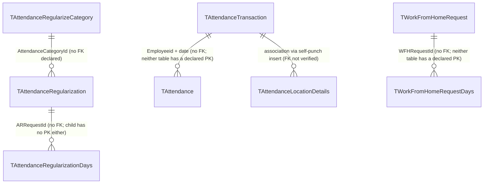

---
sources:
  - HRMS.Web/HRMS.Web/HRM/Leaves/AttendanceLeave.aspx.cs (SourceCode)
  - HRMS.Web/HRMS.Web/HRM/LeaveManagement/AttendanceManagement.aspx.cs (SourceCode)
  - HRMS.Web/HRMS.Web/HRM/Leaves/FreezeAttendance.aspx.cs (SourceCode, dead)
  - HRMS.Web/HRMS.Web/HRM/LeaveManagement/ShiftMaster.aspx.cs (SourceCode, dead)
  - HRMS.Web/HRMS.Web/HRM/Reports/AttendanceReports.aspx.cs (SourceCode, dead)
  - HRMS.Web/HRMS.Web/HRM/PayCalculation/Attendance.aspx.cs (SourceCode, dead)
  - HRMS.Web/HRMS.Web/Site.Master.cs, SiteMain.Master.cs, HRM/LogOut.aspx.cs (SourceCode)
  - HRMS.Shared/HRMS.DataAccessLayer/LeaveAttendanceARWFH/AttendanceRegularizationDAL.cs (SourceCode)
  - HRMS.Shared/HRMS.BusinessLayer/LeaveAttendanceARWFH/AttendanceRegularizationBLL.cs (SourceCode)
  - HRMS.Shared/HRMS.DataAccessLayer/LeaveAttendanceARWFH/WorkFromHomeDAL.cs (SourceCode)
  - HRMS.Shared/HRMS.BusinessLayer/LeaveAttendanceARWFH/WorkFromHomeBLL.cs (SourceCode)
  - HRMS.Shared/HRMS.DataAccessLayer/LeaveAttendanceARWFH/AttendanceManagementDAL.cs (SourceCode)
  - HRMS.Shared/HRMS.DataAccessLayer/DashboardDAL.cs (SourceCode)
  - HRMS.Shared/HRMS.BusinessLayer/DashboardBLL.cs (SourceCode)
  - HRMS.Shared/HRMS.DataAccessLayer/DBHelper.cs (SourceCode)
  - HRMS.Shared/HRMS.DataAccessLayer/DBConstant.cs (SourceCode)
  - HRMS.Shared/HRMS.DataAccessLayer/PustAttendanceDataAPIDAL.cs (SourceCode)
  - HRMS.Shared/HRMS.WebAPI/Controllers/PushAttendanceController.cs (SourceCode)
  - HRMS.Shared/HRMS.WebAPI/Controllers/AttendanceController.cs (SourceCode)
  - HRMS.Shared/HRMS.WebAPI/Controllers/ARRequestController.cs (SourceCode)
  - HRMS.Shared/HRMS.WebAPI/Controllers/WFHRequestController.cs (SourceCode)
  - HRMS.Attendance.Collector/Core/CollectionOrchestrator.cs, HrmsPushClient.cs, HrmsApiClient.cs (SourceCode)
  - HRMS.CoreAPI/HRMS.Core.WebAPI.Node/Routes/AttendanceRoutes.js (SourceCode)
  - HRMS.CoreAPI/HRMS.Core.WebAPI.Node/Controllers/AttendanceController.js (SourceCode)
  - HRMS.CoreAPI/HRMS.Core.WebAPI.Node/Core/BusinessLogicLayer/attendanceBLL.js (SourceCode)
  - HRMS.CoreAPI/HRMS.Core.WebAPI.Node/Core/DataAccessLayer/AttendanceDAL.js (SourceCode)
  - HRMS.CoreAPI/HRMS.Core.WebAPI.Node/Routes/WFHRoutes.js, Controllers/WFHController.js, Core/BusinessLogicLayer/WFHBLL.js, Core/DataAccessLayer/WFHDAL.js (SourceCode)
  - HRMS.CoreAPI/HRMS.Core.WebAPI.Node/Features/AttendanceSync/AttendanceSyncDAL.js (SourceCode)
  - HRM/DashBoard_React/Areas/LeaveAttendance/AttendanceRegularization/AttendanceRegularization.js (SourceCode)
  - HRM/DashBoard_React/Areas/WorkFromHomeRequest/Components/WFHRequestForm.js (SourceCode)
  - HRM/DashBoard_React/Areas/LeaveAttendance/AttendanceReCalculation/AttendanceReCalculation.js (SourceCode)
  - HRM/DashBoard_React/Areas/LeaveAttendance/CustomAttendanceSummary/CustomAttendanceSummaryContext.js (SourceCode)
  - HRM/DashBoard_React/Areas/Dashboard/Components/AttendanceSummary.js (SourceCode)
  - docs/SystemModels/SystemModel-2/domain/contexts/attendance-leave.md (SourceCode)
  - llm-wiki/domain/attendance-lifecycle.md (TDG HRMS DB)
  - llm-wiki/domain/approval-workflow.md (TDG HRMS DB)
  - HRMS-DATABASE/HRMS/STOREPROCEDURE/SP_InsertAttendanceData.sql (TDG HRMS DB)
  - HRMS-DATABASE/HRMS/STOREPROCEDURE/SP_InsertAttendanceDetails.sql (TDG HRMS DB)
  - HRMS-DATABASE/HRMS/STOREPROCEDURE/USP_Get_AttendanceDataFromMSTeams.sql (TDG HRMS DB)
  - HRMS-DATABASE/HRMS/STOREPROCEDURE/SP_LA_AddAttendanceRegularisationDetails.sql (TDG HRMS DB)
  - HRMS-DATABASE/HRMS/STOREPROCEDURE/SP_LA_AddWorkFromHomeRequestDetails.sql (TDG HRMS DB)
  - HRMS-DATABASE/HRMS/STOREPROCEDURE/USP_WFH_SaveRequest.sql (TDG HRMS DB)
  - HRMS-DATABASE/HRMS/STOREPROCEDURE/SP_CM_ApproveWorkFlowRequest.sql, SP_CM_RejectWorkFlowRequest.sql (TDG HRMS DB)
  - HRMS-DATABASE/HRMS/STOREPROCEDURE/SP_AdminAM_InsFreezeAttendanceDet.sql (TDG HRMS DB)
  - HRMS-DATABASE/HRMS/STOREPROCEDURE/SP_IsAttendanceDateFreezed.sql (TDG HRMS DB)
  - HRMS-DATABASE/HRMS/STOREPROCEDURE/sp_AddAttendanceRecalculation.sql, sp_CancelAttendanceRecalculation.sql, USP_Process_AttendanceRecalculationBatch.sql (TDG HRMS DB)
  - HRMS-DATABASE/HRMS/STOREPROCEDURE/SP_BiometricSyncLog_Insert.sql, SP_BiometricSyncLog_Complete.sql (TDG HRMS DB)
  - HRMS-DATABASE/HRMS/DDL/127765/tAttendanceRecalculation.sql, tAttendanceRecalculationDetails.sql (TDG HRMS DB)
confidence: medium — the AR/WFH/approve/freeze call chains are verified end-to-end with file:line
  citations; two real drift findings surfaced (a second, divergent WFH implementation, and a
  DAL-referenced procedure with no matching file in this DB repo) that need a product-side
  decision rather than a doc fix
last-analyzed: 2026-08-13
menu: Leave & Attendance
submenu: L&A Dashboard
---

# Attendance

## Overview

Every employee's presence is captured automatically, several ways at once: a badge swipe at
a biometric device, an access-card feed, a Microsoft Teams status ping, or — for staff without
a fixed device — a self-punch from the mobile app or web portal that also records their
location. Logging into or out of the HRMS portal itself silently records a punch too. All of
this lands in one raw punch table, gets cleaned up, and is aggregated into one attendance
record per employee per day.

Punches aren't always right — a device misses a swipe, someone forgets to punch out, or
someone worked from home instead of coming in. When that happens, the employee submits an
**Attendance Regularization (AR)** request to correct a day, or a **Work From Home (WFH)**
request to have a home day counted as present. Both go to the employee's manager, who
approves or rejects from a "For Me" queue — approval feeds the correction back into that
day's attendance; rejection just notifies the employee. HR configures month-end **freeze**
dates (once frozen, that period's attendance can no longer be corrected) and can trigger a
bulk **recalculation** when attendance rules change retroactively and existing days need to
be re-derived.

**Who's involved:**

- **Employee** — is punched automatically, or self-punches via mobile/web; applies for AR or
  WFH when a day needs correcting.
- **Reporting manager / approver** — approves or rejects AR/WFH requests from the "For Me"
  queue; role resolution is shared with Leave, see `llm-wiki/domain/approval-workflow.md`.
- **HR / admin** — sets freeze dates, configures shifts, and triggers recalculation batches.

This page connects that business flow to its **application call chain** (SourceCode) and
**database lifecycle** (TDG HRMS DB). For the DB-only pipeline detail — the exact 4-stage
punch→aggregation pipeline, the AR/WFH submit-time-vs-approval-time recalc asymmetry, and why
`TAttendanceForPayroll` has no confirmed writer — see `llm-wiki/domain/attendance-lifecycle.md`,
which this page treats as canonical and does not repeat.

## Workflow

```mermaid
flowchart TD
  Bio["Biometric/vendor device<br/>HRMS.Attendance.Collector service"] --> PushAPI["POST api/Attendance/PushAttendanceData(/{machineId})<br/>PushAttendanceController.cs"]
  Vendor["3rd-party bridge apps<br/>(Acixme/InfoTrack/Akwel/Reliance)"] --> PushAPI2["POST api/Attendance/PushAttendanceDataFromWEBAPI"]
  Teams["MS Teams status feed"] --> PushAPI3["PushAttendanceDataFromMSTeams<br/>.NET + Node /attendance/PushAttendanceDataFromMSTeams"]
  Mobile["Mobile/web self-punch (lat/long)"] --> WebAPI["POST api/Attendance/SaveAttendanceTransaction<br/>AttendanceController.cs:38"]
  Mobile --> NodeInsert["Node POST /attendance/InsertManualAttendance"]
  LoginAuto["Portal login/logout<br/>Site.Master.cs / LogOut.aspx.cs"] --> DashboardBLL["DashboardBLL.AddUserManualAttendance"]

  PushAPI --> SPIns1[("SP_InsertAttendanceDataWithMachineID<br/>⚠ no matching .sql found, see Known gaps")]
  PushAPI2 --> SPIns1
  PushAPI3 --> SPTeams[("USP_Get_AttendanceDataFromMSTeams[_Bulk]")]
  WebAPI --> DashDAL["DashboardDAL.AddUserManualAttendance<br/>DashboardDAL.cs:295-329"]
  NodeInsert --> SPIns2[("SP_InsertAttendanceDetails")]
  DashboardBLL --> DashDAL2["DashboardDAL.AddUserManualAttendance<br/>DashboardDAL.cs:88"]
  DashDAL --> SPIns2
  DashDAL2 --> SPIns2

  SPIns1 --> TT[("TAttendanceTransaction<br/>IsSync=0")]
  SPIns2 --> TT
  SPTeams --> TT

  TT --> Clean["USP_RearrangeAttTranData<br/>(DB-internal — no app caller found)"]
  Clean --> Agg["USP_UpdateAttendance<br/>(DB-internal)"]
  Agg --> Attendance[("TAttendance")]

  AR["AttendanceLeave.aspx.cs:7237<br/>btnSubmit_Click (AR tab)"] --> ARBLL["AttendanceRegularizationBLL:56"] --> ARDAL["AttendanceRegularizationDAL.AddAttendanceRegularisationDetails<br/>:58-88"] --> ARSP[("SP_LA_AddAttendanceRegularisationDetails")]
  ARLegacy["Legacy REST: api/ARRequest/AR, /SubmitAR"] --> ARDAL
  ARReact["React AttendanceRegularization.js:1657<br/>POST /attendance/saveAttendanceRegularization"] --> ARSP

  WFH["AttendanceLeave.aspx.cs:8506<br/>btnWorkFromHomeSubmit_Click"] --> WFHBLL["WorkFromHomeBLL:62"] --> WFHDAL["WorkFromHomeDAL.AddWFHDetails<br/>:72-98"] --> WFHSP[("SP_LA_AddWorkFromHomeRequestDetails")]
  WFHLegacy["Legacy REST: api/WFHRequest/WFH"] --> WFHDAL
  WFHReact["⚠ React WFHRequestForm.js:230<br/>POST /workFromHome/ApplyWFHRequest"] --> WFHSP2[("USP_WFH_SaveRequest<br/>— a different proc, see Known gaps")]

  ARSP --> TAR[("TAttendanceRegularization /<br/>TAttendanceRegularizationDays")]
  WFHSP --> TWFH[("TWorkFromHomeRequest /<br/>TWorkFromHomeRequestDays")]
  WFHSP2 --> TWFH

  TAR -->|"submit-time recalc"| Register
  TWFH -->|"submit-time recalc"| Register

  Dashboard["React Leave_Dashboard SPA<br/>'For Me' queue"] --> NodeApprove["Node POST /attendance/ApproveRejectRequest<br/>AttendanceController.js:907"]
  NodeApprove --> ApproveSP[("SP_CM_ApproveWorkFlowRequest /<br/>SP_CM_RejectWorkFlowRequest")]
  ApproveSP --> TAR
  ApproveSP --> TWFH
  ApproveSP -->|"AR: status flip only, no re-recalc"| TAR
  ApproveSP -->|"WFH cancel/pullback: recalc"| Register

  Freeze["AttendanceManagement.aspx.cs:5228<br/>btnSubmitFreezeAttendance_Click"] --> FreezeDAL["AttendanceManagementDAL.SaveFreezeAttendanceDetails<br/>:405-421"] --> FreezeSP[("SP_AdminAM_InsFreezeAttendanceDet")]

  Recalc["React AttendanceReCalculation.js:408<br/>'Recalculate' action"] --> RecalcAPI["Node POST /attendance/AttendanceReCalculationRequest<br/>AttendanceController.js:2741"] --> RecalcDAL["AttendanceDAL.js:3306"] --> RecalcSP[("sp_AddAttendanceRecalculation<br/>enqueues a batch row")]
  RecalcSP --> TRecalc[("TAttendanceRecalculation /<br/>TAttendanceRecalculationDetails")]
  TRecalc --> Batch["USP_Process_AttendanceRecalculationBatch<br/>(drains the queue)"]
  Batch --> Engine["USP_CalculateDailyAttendance<br/>:137 (same wrapper as SP_UpdateDailyRegisterNew)"]
  Engine --> Attendance
  Engine --> DRN[("TDailyRegisterNew")]

  Register["SP_UpdateDailyRegisterNew → USP_CalculateDailyAttendance"] --> Attendance
  Register --> DRN
```

> The ingestion, sanitize, aggregate, and daily-register stages above are the same pipeline
> documented in full in `llm-wiki/domain/attendance-lifecycle.md` — this diagram adds the
> app/API entry points feeding into it, which that page (being DB-only) doesn't show.

## Entry points

> ⚠️ **Dead pages, confirmed against `HRMS.Web.csproj`**: `HRM/Leaves/FreezeAttendance.aspx`,
> `HRM/LeaveManagement/ShiftMaster.aspx`, `HRM/Reports/AttendanceReports.aspx`, and
> `HRM/PayCalculation/Attendance.aspx` all exist on disk but have zero references in the
> project file — none of them are part of the compiled build. Their live replacements are
> listed below. This matches the drift already flagged by SourceCode's own
> `docs/SystemModels/SystemModel-2/domain/contexts/attendance-leave.md`.

| Entry point | Purpose | Live? |
|---|---|---|
| Biometric/vendor device import (`PushAttendanceController.cs`, .NET WebAPI) | Ingest device punches | Yes |
| Vendor bridge apps → `POST api/Attendance/PushAttendanceDataFromWEBAPI` | Access-card/vendor punch feed | Yes |
| MS Teams feed → `.NET` + Node `/attendance/PushAttendanceDataFromMSTeams` | Teams-status-based punch ingestion | Yes |
| Mobile/web self-punch (`AttendanceController.cs:38`, Node `/attendance/InsertManualAttendance`) | Employee self-punch with geo-coordinates | Yes |
| Portal login/logout auto-punch (`Site.Master.cs`, `SiteMain.Master.cs`, `LogOut.aspx.cs`) | Implicit punch on session start/end | Yes |
| `HRM/Leaves/AttendanceLeave.aspx` (AR + WFH tabs) | Apply for Attendance Regularization / Work From Home | Yes |
| React `AttendanceRegularization.js` (`HRM/DashBoard_React/Areas/LeaveAttendance`) | Apply for AR (newer UI, same procedure) | Yes |
| React `WFHRequestForm.js` (`HRM/DashBoard_React/Areas/WorkFromHomeRequest`) | Apply for WFH via a separate, newer Node module | Yes — see Known gaps for the procedure drift |
| Legacy REST `api/ARRequest/*`, `api/WFHRequest/*` | Integration-style AR/WFH create | Yes (secondary) |
| React `Leave_Dashboard` SPA "For Me" queue | Manager approves/rejects AR and WFH requests | Yes |
| `HRM/LeaveManagement/AttendanceManagement.aspx` | HR sets the freeze date (now also hosts Shift Master) | Yes |
| React `AttendanceReCalculation.js` (`HRM/DashBoard_React/Areas/LeaveAttendance`) | HR/admin triggers or cancels a recalculation batch | Yes |
| React `CustomAttendanceSummaryContext.js` (`HRM/DashBoard_React/Areas/LeaveAttendance/CustomAttendanceSummary`) | Attendance report/export | Yes — replaces dead `AttendanceReports.aspx` |
| `HRM/Leaves/FreezeAttendance.aspx`, `HRM/LeaveManagement/ShiftMaster.aspx`, `HRM/Reports/AttendanceReports.aspx`, `HRM/PayCalculation/Attendance.aspx` | (legacy) | No — absent from `HRMS.Web.csproj` |

## Code → database call chain

| Step | Entry point | App code | Stored procedure |
|---|---|---|---|
| Ingest — biometric/vendor | `PushAttendanceController.cs:75-84` (`POST api/Attendance/PushAttendanceData/{machineId}`) | `PustAttendanceDataAPIDAL.PushAttendanceData` (`PustAttendanceDataAPIDAL.cs:66-88`) | `SP_InsertAttendanceDataWithMachineID` (no matching file in TDG HRMS DB — see Known gaps) |
| Ingest — vendor bridge / access-card | `PushAttendanceController.cs:55-65` (`POST api/Attendance/PushAttendanceDataFromWEBAPI`) | `PustAttendanceDataAPIDAL.PushAttendanceDataFromWEBAPI` (`:42-64`) | `SP_InsertAttendanceDataWithMachineID` |
| Ingest — MS Teams | `PushAttendanceController.cs:93-161` + Node `AttendanceController.js:2495-2510` (`POST /attendance/PushAttendanceDataFromMSTeams`) | `PustAttendanceDataAPIDAL.PushAttendanceDataFromMSTeams*` (`:90-155`) / Node `AttendanceDAL.js:3005-3055` | `USP_Get_AttendanceDataFromMSTeams` / `_Bulk` |
| Ingest — mobile/web self-punch | `AttendanceController.cs:38-67` (`POST api/Attendance/SaveAttendanceTransaction`) | `DashboardDAL.AddUserManualAttendance` (`DashboardDAL.cs:295-329`) | `SP_InsertAttendanceDetails` |
| Ingest — self-punch, Node path | Node `POST /attendance/InsertManualAttendance` (`AttendanceRoutes_V2.js:25`) | `AttendanceDAL_V2.js:462 InsertManualAttendance` | `SP_InsertAttendanceDetails` |
| Ingest — login/logout auto-punch | `Site.Master.cs:372,633`, `SiteMain.Master.cs:505,784`, `LogOut.aspx.cs:65` | `DashboardBLL.AddUserManualAttendance` (`DashboardBLL.cs:18-21`) → `DashboardDAL.AddUserManualAttendance` (`DashboardDAL.cs:88`) | `SP_InsertAttendanceDetails` |
| Apply — AR | `AttendanceLeave.aspx.cs:7237 btnSubmit_Click` → `:7248` | `AttendanceRegularizationBLL.AddAttendanceRegularisationDetails` (`AttendanceRegularizationBLL.cs:56-59`) → `AttendanceRegularizationDAL` (`AttendanceRegularizationDAL.cs:58-88`) | `SP_LA_AddAttendanceRegularisationDetails` |
| Apply — AR, React | `AttendanceRegularization.js:1657` → `POST /attendance/saveAttendanceRegularization` | `AttendanceController.js:299` → `AttendanceDAL.js:867-905` | `SP_LA_AddAttendanceRegularisationDetails` (no drift — same proc as WebForms path) |
| Apply — WFH | `AttendanceLeave.aspx.cs:8506 btnWorkFromHomeSubmit_Click` → `:8517` | `WorkFromHomeBLL.AddWFHDetails` (`WorkFromHomeBLL.cs:62-65`) → `WorkFromHomeDAL` (`WorkFromHomeDAL.cs:72-98`) | `SP_LA_AddWorkFromHomeRequestDetails` |
| Apply — WFH, React (⚠ diverges) | `WFHRequestForm.js:230` → `POST /workFromHome/ApplyWFHRequest` | `WFHController.js:9-13` → `WFHBLL.js:18-23` → `WFHDAL.js:15-35` | `USP_WFH_SaveRequest` — **different procedure**, see Known gaps |
| Approve / Reject (live, bulk) | Node `POST /attendance/ApproveRejectRequest` | `AttendanceController.js:907` → `attendanceBLL.ApproveRejectRequest` (`attendanceBLL.js:131-154`) → `AttendanceDAL.js:1143-1165` / `:1167-1182` | `SP_CM_ApproveWorkFlowRequest` / `SP_CM_RejectWorkFlowRequest` |
| Set freeze date | `AttendanceManagement.aspx.cs:5228 btnSubmitFreezeAttendance_Click` → `:5247` | `AttendanceManagementDAL.SaveFreezeAttendanceDetails` (`AttendanceManagementDAL.cs:405-421`) | `SP_AdminAM_InsFreezeAttendanceDet` |
| Read freeze date (gate) | `LeaveRequestDetails.aspx.cs:47` | `DBHelper.GetFreezeDate` (`DBHelper.cs:3910-3921`) | `SP_IsAttendanceDateFreezed` |
| Trigger recalculation | `AttendanceReCalculation.js:408` → `POST /attendance/AttendanceReCalculationRequest` | `AttendanceController.js:2741-2748` → `AttendanceDAL.js:3306-3331` | `sp_AddAttendanceRecalculation` (enqueues; batch job later runs `USP_Process_AttendanceRecalculationBatch` → `USP_CalculateDailyAttendance`) |
| Cancel recalculation | `AttendanceReCalculation.js:455` → `POST /attendance/RevokeReCalculationRequest` | `AttendanceController.js:2749-2756` → `AttendanceDAL.js:3332-3347` | `sp_CancelAttendanceRecalculation` |

## API endpoints

| Verb | Route | Parameters | Purpose | Source |
|---|---|---|---|---|
| `POST` | `api/Attendance/PushAttendanceData/{machineId}` | `attendanceData` (body, array), `machineId` (route, string) — `[BiometricPushApiKeyAuthorization]` | Biometric device punch push, keyed by device | `PushAttendanceController.cs:75-84` |
| `POST` | `api/Attendance/PushAttendanceData` | `attendanceData` (body, array) — `[AllowAnonymous]` | Vendor/device punch push, no machine id | `PushAttendanceController.cs:37-46` |
| `POST` | `api/Attendance/PushAttendanceDataFromWEBAPI` | `attendanceData` (body, array) | Access-card / external vendor bridge feed (Acixme, InfoTrack, Akwel, Reliance) | `PushAttendanceController.cs:55-65` |
| `POST` | `api/Attendance/SaveAttendanceTransaction` | `attendanceTransaction` (body, object incl. `Latitude`/`Longitude`/`GeocodeAPILocation`) — `[Authorize]` | Mobile/web self-punch, single | `AttendanceController.cs:38-67` |
| `POST` | `api/Attendance/SaveAttendanceTransactionMultiple` | array of the above | Mobile/web self-punch, bulk | `AttendanceController.cs:433-464` |
| `POST` | `/attendance/InsertManualAttendance` (Node) | employee id (from JWT), punch datetime, lat/long | Mobile self-punch (React/mobile client) | `AttendanceRoutes_V2.js:25` / `_V3.js:25`; called via `INSERT_MISSING_ATTENDANCE` in `apiURLConstants.js:358` |
| `POST` | `/attendance/saveAttendanceRegularization` (Node) | AR request payload (date range or specific day, reason, category) | Submit AR from the React UI | `AttendanceRoutes.js:27` |
| `POST` | `/workFromHome/ApplyWFHRequest` (Node) | WFH request payload | Submit WFH from the newer React module — **not the same backing procedure as the WebForms path**, see Known gaps | `WFHRoutes.js:8` |
| `POST` | `/attendance/ApproveRejectRequest` (Node) | `combinedARData` (body, array); each item: `actionType` (`'Approve'`\|`'Reject'`, required), `RequestTransId` (int, required), `RequestType` (string, required), `Employerid` (int, required), `comments`/`RejectionReason` (string); `EmployeeId` is overridden server-side from the JWT | Bulk approve/reject AR/WFH/Leave/Overtime requests in one call | `AttendanceController.js:907-1125` |
| `POST` | `/attendance/AttendanceReCalculationRequest` (Node) | employer/date-range/employee filter payload | Enqueue a daily-register recalculation batch | `AttendanceRoutes.js:103` → `AttendanceController.js:2741-2748` |
| `POST` | `/attendance/RevokeReCalculationRequest` (Node) | recalculation request id | Cancel a queued recalculation | `AttendanceController.js:2749-2756` |
| `POST` | `/attendance/GetEmployeeAttendanceReportData` (Node) | report filter payload | Custom attendance report/export | `AttendanceRoutes.js:60` |
| `POST` | `/attendance-sync/start`, `/attendance-sync/:id/complete` (Node, JWT `Authorize`) | sync-run metadata | Tracks a biometric sync run — a separate mechanism from the .NET Collector's own `/Collector/Sync/Start`; not confirmed which is wired to live devices | `Features/AttendanceSync/AttendanceSyncDAL.js:23,43` |

`AttendanceLeave.aspx.cs`'s AR/WFH apply tabs and `AttendanceManagement.aspx.cs`'s freeze-date
submit are classic WebForms postbacks calling BLL/DAL server-side, not AJAX/API calls.

## Stored procedures & tables involved

> ⚠️ **A DAL-referenced procedure has no matching file in this DB repo.** Both
> `PustAttendanceDataAPIDAL.cs:45` and `:69` call `"SP_InsertAttendanceDataWithMachineID"` as a
> hardcoded string, but no file of that name (case-insensitive, exact or partial match) exists
> anywhere under `HRMS-DATABASE/`. Either the procedure was applied directly to the database
> without a checked-in script, or the name has drifted — this is a real gap, not re-derived
> from a guess, and needs DB-side confirmation before relying on it.

> ⚠️ **WFH has two live, divergent implementations** — see Known gaps below before treating
> either as "the" WFH procedure.

| Object | Path | Role |
|---|---|---|
| `SP_InsertAttendanceData` | `HRMS-DATABASE/HRMS/STOREPROCEDURE/SP_InsertAttendanceData.sql` | Vendor/device punch insert (no-machine-id overload) |
| `SP_InsertAttendanceDataWithMachineID` | *(no file found — see callout above)* | Device/vendor punch insert keyed by machine id |
| `SP_InsertAttendanceDetails` / `_Bulk` | `HRMS-DATABASE/HRMS/STOREPROCEDURE/SP_InsertAttendanceDetails.sql` | Mobile/web self-punch insert, carries lat/long — canonical pipeline stage A, see `llm-wiki/domain/attendance-lifecycle.md` |
| `USP_Get_AttendanceDataFromMSTeams` / `_Bulk` | `HRMS-DATABASE/HRMS/STOREPROCEDURE/USP_Get_AttendanceDataFromMSTeams[_Bulk].sql` | Teams-status-based punch ingestion |
| `USP_RearrangeAttTranData`, `USP_UpdateAttendance`, `SP_UpdateDailyRegisterNew`, `USP_CalculateDailyAttendance` | `HRMS-DATABASE/HRMS/STOREPROCEDURE/` | Sanitize/aggregate/daily-register pipeline stages B–D — fully documented in `llm-wiki/domain/attendance-lifecycle.md`; no app-source caller found for any of them (DB-internal / SQL-Agent-only), except `USP_CalculateDailyAttendance`, which is also called from `USP_Process_AttendanceRecalculationBatch.sql:137` |
| `SP_LA_AddAttendanceRegularisationDetails` | `HRMS-DATABASE/HRMS/STOREPROCEDURE/SP_LA_AddAttendanceRegularisationDetails.sql` | Creates an AR request; recalculates the day at submission time |
| `SP_LA_AddWorkFromHomeRequestDetails` | `HRMS-DATABASE/HRMS/STOREPROCEDURE/SP_LA_AddWorkFromHomeRequestDetails.sql` | Creates a WFH request (WebForms + legacy REST + `AttendanceRegularization.js`'s sibling React module) |
| `USP_WFH_SaveRequest` (+ `USP_WFH_ValidateRequest`, `USP_WFH_PullbackRequest`, `USP_WFH_RequestList`, `USP_WFH_Status_History`, `USP_WFH_GetEmployeeWFHCount`) | `HRMS-DATABASE/HRMS/STOREPROCEDURE/USP_WFH_SaveRequest.sql` (+ siblings) | A second, independent WFH create/manage family used only by `WFHRequestForm.js` — see Known gaps |
| `SP_CM_ApproveWorkFlowRequest` / `SP_CM_RejectWorkFlowRequest` | `HRMS-DATABASE/HRMS/STOREPROCEDURE/` | Generic cross-module approve/reject engine, shared with Leave — see `llm-wiki/domain/approval-workflow.md` |
| `SP_AdminAM_InsFreezeAttendanceDet` | `HRMS-DATABASE/HRMS/STOREPROCEDURE/SP_AdminAM_InsFreezeAttendanceDet.sql` | Sets the month-end freeze date |
| `SP_IsAttendanceDateFreezed` | `HRMS-DATABASE/HRMS/STOREPROCEDURE/SP_IsAttendanceDateFreezed.sql` | Reads whether a date is frozen (gates AR/WFH/leave correction actions) |
| `sp_AddAttendanceRecalculation` / `sp_CancelAttendanceRecalculation` / `USP_Process_AttendanceRecalculationBatch` | `HRMS-DATABASE/HRMS/STOREPROCEDURE/` | Recalculation queue: enqueue, cancel, and the batch job that drains the queue into `USP_CalculateDailyAttendance` |
| `SP_BiometricSyncLog_Insert` / `_Complete` / `_GetList` / `_GetSummary` | `HRMS-DATABASE/HRMS/STOREPROCEDURE/` | Sync-run tracking for the Node `attendance-sync` feature |
| `TAttendanceTransaction`, `TAttendance`, `TAttendanceForPayroll`, `TAttendanceRegularization`, `TAttendanceRegularizationDays`, `TAttendanceRegularizeCategory`, `TWorkFromHomeRequest`, `TGeoTaggingDetails`, `TGeoTrackingConfig` | `HRMS-DATABASE/HRMS/TABLES/` | Core pipeline tables — see `llm-wiki/domain/attendance-lifecycle.md` for the full lifecycle, including why `TAttendanceForPayroll` has no confirmed writer and why geo-tagging is a separate subsystem |
| `TDailyRegisterNew` | `HRMS-DATABASE/HRMS/TABLES/` | Payroll-facing daily summary, written by the daily-register engine |
| `TAttendanceRecalculation`, `TAttendanceRecalculationDetails` | `HRMS-DATABASE/HRMS/DDL/127765/` | Recalculation queue tables — not part of `llm-wiki/domain/attendance-lifecycle.md`'s existing ER diagram, see Known gaps |

## Table relationships

Reused verbatim from `llm-wiki/domain/attendance-lifecycle.md` §"Table relationships" — see
that page for the "zero foreign keys declared across all 9 core attendance tables" caveat
behind every edge below.

## Known gaps

- **WFH has two live, divergent implementations.** `AttendanceLeave.aspx.cs` (WebForms) and the
  legacy `api/WFHRequest/WFH` REST endpoint both call `SP_LA_AddWorkFromHomeRequestDetails`,
  matching `llm-wiki/domain/attendance-lifecycle.md`. But a separate, newer React component
  (`WFHRequestForm.js`) and its own Node module (`WFHController.js`/`WFHBLL.js`/`WFHDAL.js`)
  call `USP_WFH_SaveRequest` instead — a different procedure with its own validate/pullback/
  list/status-history siblings. I could not determine from source alone whether this component
  is reachable from live navigation alongside the WebForms WFH tab, or is meant to replace it.
  This needs a product-side decision; until resolved, treat both as live.
- **`SP_InsertAttendanceDataWithMachineID` has no matching file in `HRMS-DATABASE/`.** It's
  referenced as a hardcoded string at two call sites in `PustAttendanceDataAPIDAL.cs` (lines 45
  and 69) and is the destination for both the biometric-device and vendor-bridge ingestion
  paths — i.e. it's load-bearing, not dead code, and the missing script is worth chasing down
  DB-side (applied directly without a checked-in script? renamed?) rather than assumed unused.
- **`USP_Process_ClientAttendanceData_New`** (named in the DB doc's pipeline stage A) was not
  found referenced anywhere in `.NET` or Node source, same as stages B–D. The ingestion paths
  actually reachable from application code (device push, vendor bridge, self-punch, MS Teams)
  all land on `SP_InsertAttendanceData*`/`SP_InsertAttendanceDetails*` instead — whether
  `USP_Process_ClientAttendanceData_New` is invoked by a still-active external job/vendor
  integration not visible from either repo, or is legacy, is unconfirmed.
- **The freeze-date check is commented out on the AR/WFH apply page.** `AttendanceLeave.aspx.cs:195`
  has `DBHelper.GetFreezeDate` calls out. The freeze check is only actually exercised from
  `LeaveRequestDetails.aspx.cs:47` — meaning AR/WFH submission today may not be blocked by a
  frozen period, even though leave submission is. Not verified against a running system; a
  code-level observation only.
- **`TAttendanceRecalculation`/`TAttendanceRecalculationDetails`** (the recalculation queue
  tables backing `sp_AddAttendanceRecalculation`) are new ground not covered by
  `llm-wiki/domain/attendance-lifecycle.md`'s existing ER diagram — reused here as-is per this
  command's rule against re-deriving a page that already has a diagram; these two tables and
  their relationship to `TAttendance`/`TDailyRegisterNew` are a candidate addition to that page.
- **Two parallel biometric sync-tracking mechanisms exist**: the Node `Features/AttendanceSync`
  module (`/attendance-sync/start`, `/:id/complete`, `SP_BiometricSyncLog_*`) and the .NET
  `HRMS.Attendance.Collector` service's own `HrmsApiClient.StartSync`/`CompleteSync` calls to
  `/Collector/Sync/Start` etc. Which one is actually wired to live devices was not confirmed.
- **Three of four attendance dashboard widgets weren't fully traced**: `AttendanceRate.js`,
  `OverallAttendance.js`, and `ManagementAttendanceDashboard.js` (`HRM/DashBoard_React/Areas/
  Dashboard/Components/`) have no direct `APIHelper`/`fetch`/`axios` calls in-file — they
  appear to receive data via props from a parent container that wasn't investigated (lower
  priority per this doc's request). Only `AttendanceSummary.js` was confirmed to call an API
  directly (`GET_ISAPPROVER_STATUS_FORCHARTS`).
- Geo-tagging (`TGeoTaggingDetails`/`TGeoTrackingConfig`) is confirmed by the DB doc to be an
  unrelated subsystem from the punch pipeline despite the naming — not re-investigated here,
  see `llm-wiki/domain/attendance-lifecycle.md`.
