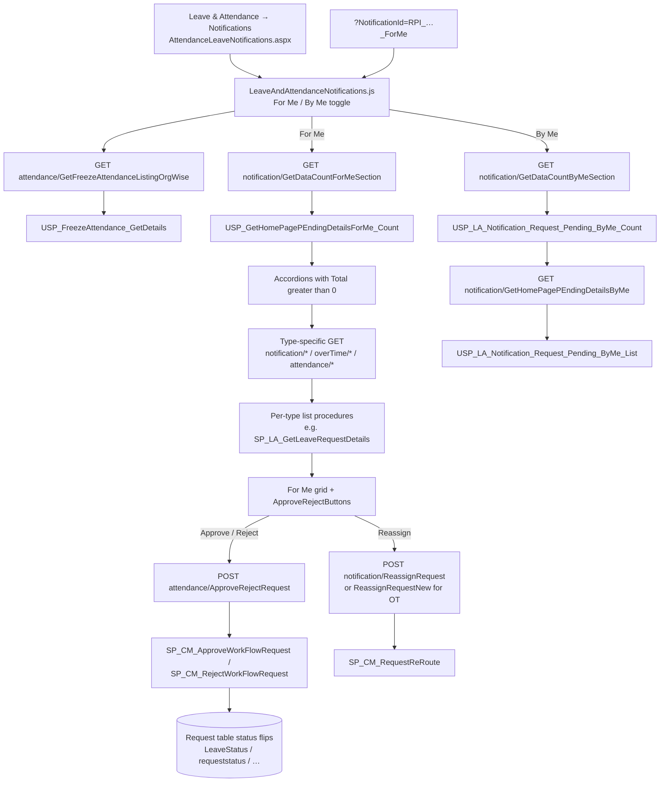
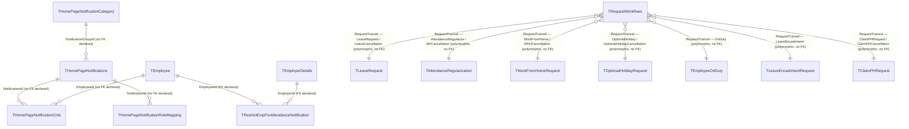

# Notifications

## Overview

A manager opens **Leave & Attendance → Notifications** to work a queue of other people's requests. The page is split **For Me** (items waiting on this person to approve, reject, or reassign) and **By Me** (items this person submitted that are still sitting with someone else). Each accordion is a request type — leave, attendance regularization, work-from-home, optional holiday, comp-off, overtime, locum, public-holiday duration, on-duty, leave encashment — and only sections with a non-zero count are shown. The manager ticks rows, types a comment, and approves or rejects in bulk; they can also reassign a pending row to a different employee. Frozen attendance periods disable the decision buttons, with a link to the freeze dates.

An employee uses the same page from the other side: **By Me** is how they see what they already applied for that has not yet been decided. Home-page and chatbot deep links land here with `?NotificationId=RPI_…_ForMe` (or `_ByMe`) and expand the matching accordion.

**Who's involved:**

- **Approver (For Me)** — usually the reporting manager at the current workflow level; they approve, reject, or reassign.
- **Initiator (By Me)** — the employee who submitted the request; they watch status, they do not decide here.
- **HR** — configures freeze dates that block decisions, and the comment/reason rules per module.

This page is the **inbox**, not the apply form. Apply/cancel/pullback live on Leave Management and Attendance. The queue itself is pending `TRequestWorkflows` rows; approve/reject is the shared engine in `llm-wiki/domain/approval-workflow.md`. Per-type request tables are in `llm-wiki/domain/leave-lifecycle.md` and `llm-wiki/domain/attendance-lifecycle.md`. SourceCode's `docs/SystemModels/SystemModel-2/domain/contexts/attendance-leave.md` already names the live manager queue as the React `Leave_Dashboard` SPA calling Node CoreAPI.

## Workflow

## Entry points

> Live entry point, per `docs/SystemModels/SystemModel-2/domain/contexts/attendance-leave.md`: the manager queue is the React `Leave_Dashboard` SPA hosted by `AttendanceLeaveNotifications.aspx`, not the classic Telerik user controls under `HRM/Leaves/`. `AttendanceLeaveNotifications.aspx.cs` only stamps session identity into hidden fields and loads `leave_attendance_module*.js` from `HRM/Leave_Dashboard/BuildJS/`.

| Entry point | Purpose | Live? |
|---|---|---|
| `HRM/Leaves/AttendanceLeaveNotifications.aspx` | WebForms shell; page title "L & A Notifications" | Yes |
| React `LeaveAndAttendanceNotifications` (`Leave_Dashboard/Areas/LeaveNotification/container/LeaveAndAttendanceNotifications.js`) | For Me / By Me inbox UI | Yes |
| `?NotificationId=RPI_…_ForMe` / `_ByMe` | Deep link from home-page / chatbot bell; expands the matching accordion | Yes — `ChatBot/…/NotificationList.js` and `Login.aspx.cs:1019` |
| Node CoreAPI `/notification/*`, `/attendance/*`, `/overTime/*` | Queue reads, counts, approve/reject, reassign | Yes |
| `HRM/Leaves/LeaveRequestDetails.aspx?IsPopup=1` and `ApproveRejectPage.aspx?IsPopup=1` | Single-record detail / history popups opened from a grid row | Yes (secondary) |
| `HRM/Leaves/ucAttendenceNotificationForMe.ascx` | Legacy Telerik "pending attendance" grid | No for this submenu — still registered on `AttendanceLeave.aspx`; its code-behind callers there are commented out |

## Code → database call chain

Most For Me `employeeId` / `EmployeeId` query values are overwritten server-side from the JWT (`req.EID`). The client still sends them.

| Step | Entry point | App code | Stored procedure |
|---|---|---|---|
| Page load | `AttendanceLeaveNotifications.aspx` | `Page_Load` (`AttendanceLeaveNotifications.aspx.cs:27-68`) — session → hidden fields, pick React bundle | none |
| Freeze banner | `LeaveAndAttendanceNotifications.js:39` | `AttendanceController.GetFreezeAttendanceListingOrgWise` (`AttendanceController.js:3396`) → `AttendanceDAL.GetFreezeAttendanceListingOrgWise` (`AttendanceDAL.js:4097`) | `USP_FreezeAttendance_GetDetails` |
| For Me counts | `ForMe.js:400` | `NotificationController.GetDataCountForMeSection` (`NotificationController.js:341`) → `NotificationDAL.GetDataCountForMeSection` (`NotificationDAL.js:516`) | `USP_GetHomePagePEndingDetailsForMe_Count` (itself calls `USP_LeaveNotifications_Count` for the attendance-alert tile) |
| Pending attendance alerts | `AttendanceNotificationGrid.js:87` | `NotificationController.GetAllLeaveNotifications` (`NotificationController.js:250`) → `NotificationDAL.GetAllLeaveNotifications` (`NotificationDAL.js:377`) | `SP_LA_GetAllLeaveNotifications` → `Sp_GetEmpAttendanceDetails_DashBoard` |
| Pending leave | `PendingLeaveRequestGrid.js:168` (`DisplayRequest=MANAGER`) | `NotificationController.GetPendingLeaveRequest` (`NotificationController.js:21`) → `NotificationDAL.GetPendingLeaveRequest` (`NotificationDAL.js:36`) | `SP_LA_GetLeaveRequestDetails` |
| Leave pullback | `PendingLeaveRequestPullbackGrid.js:161` | `NotificationController.GetLeaveCancellationForApproval` (`NotificationController.js:81`) → `NotificationDAL.GetLeaveCancellationForApproval` (`NotificationDAL.js:51`) | `SP_LA_GetLeaveCancellationForApproval` |
| AR | `PendingARRequestGrid.js:151` | `NotificationController.GetAttendanceRegularisationForApproval` (`NotificationController.js:57`) → `NotificationDAL.GetAttendanceRegularisationForApproval` (`NotificationDAL.js:135`) | `SP_LA_GetAttendanceForApproval` |
| AR pullback | `PendingARPullbackGrid.js:142` | `NotificationController.GetARCancellationForApproval` (`NotificationController.js:93`) → `NotificationDAL.GetARCancellationForApproval` (`NotificationDAL.js:65`) | `SP_LA_GetARCancellationForApproval` |
| WFH | `PendingWorkFromHomeGrid.js:179` | `NotificationController.GetWFHRequestForApproval` (`NotificationController.js:69`) → `NotificationDAL.GetWFHRequestForApproval` (`NotificationDAL.js:150`) | `SP_LA_GetWorkFromHomeRequestListForApproval` |
| WFH pullback | `WorkFromHomePullbackGrid.js:168` | `NotificationController.GetWFHPullbackListForApproval` (`NotificationController.js:236`) → `NotificationDAL.GetWFHPullbackListForApproval` (`NotificationDAL.js:406`) | `SP_LA_GetWFHCancellationForApproval` |
| L1 leave / WFH / AR | `PendingL1ApprovalsLWFHAR.js:90` | `NotificationController.GetLeaveWFHARLevel1RequestList` (`NotificationController.js:534`) → `NotificationDAL.GetLeaveWFHARLevel1RequestList` (`NotificationDAL.js:721`) | `Sp_LA_GetPendingApprovalsNotification` |
| Optional holiday | `OptionalHolidayGrid.js:174` (`DisplayRequest=MANAGER`) | `NotificationController.GetOptionalHolidayRequestDetails` (`NotificationController.js:262`) → `NotificationDAL.GetOptionalHolidayRequestDetails` (`NotificationDAL.js:421`) | `SP_LA_GetOptionalHolidayRequestDetails` |
| Optional-holiday pullback | `OptionalHolidayPullbackGrid.js:152` | `NotificationController.GetOptionalHolidayPullbackRequestDetails` (`NotificationController.js:294`) → `NotificationDAL.GetOptionalHolidayPullbackRequestDetails` (`NotificationDAL.js:467`) | `SP_LA_GetOptionalHolidayCancellationForApproval` |
| Comp-off (employee) | `PendingCompOffGrid.js:173` | `NotificationController.GetPendingCompOffRequests` (`NotificationController.js:318`) → `NotificationDAL.GetPendingCompOffRequests` (`NotificationDAL.js:491`) | `SP_PendingCompOffRequestByEmployee` |
| Credit comp-off | `CreditCompOffGrid.js:146` | `NotificationController.GetPendingCreditCompOffRequests` (`NotificationController.js:306`) → `NotificationDAL.GetPendingCreditCompOffRequests` (`NotificationDAL.js:479`) | `SP_LA_GetCompOffRequestDetails` |
| Claim OT | `PendingOTGrid.js:213` (`DisplayRequest=MANAGER`) | `OverTimeController.GetOvertimePendingNotificationList` (`overTimeController.js:336`) → `OverTimeDAL.GetOvertimePendingNotificationList` (`OverTimeDAL.js:190`) | `USP_OT_Notification_List` |
| Pre-approval OT | `PendingPreApprovalOTGrid.js:163` | `OverTimeController.GetPreApprovalOTApprovalList` (`overTimeController.js:663`) → `OverTimeDAL.GetPreApprovalOTApprovalList` (`OverTimeDAL.js:448`) | `USP_OT_OTRequest_Notification_List` |
| Claim locum | `PendingClaimLocumGrid.js:165` (`displayRequest=MANAGER`) | `OverTimeController.FetchLocumListForApproval` (`overTimeController.js:1171`) → `OverTimeDAL.FetchLocumListForApproval` (`OverTimeDAL.js:823`) | `USP_ClaimLocum_Notification_Request_Details` |
| Locum pullback | `PendingPullbackLocumReqGrid.js:164` | `OverTimeController.FetchLocumCancellationListForApproval` (`overTimeController.js:1189`) → `OverTimeDAL.FetchLocumCancellationListForApproval` (`OverTimeDAL.js:839`) | `USP_ClaimLocum_Notification_Cancellation_Details` |
| Claim PH | `PendingPHRequestGrid.js:164` | `OverTimeController.FetchPHListForApproval` (`overTimeController.js:1287`) → `OverTimeDAL.FetchPHListForApproval` (`OverTimeDAL.js:921`) | `USP_ClaimPH_Notification_RequestDetails` |
| PH pullback | `PendingPullbackPublicHolidayGrid.js:168` | `OverTimeController.FetchPHCancellationListForApproval` (`overTimeController.js:1305`) → `OverTimeDAL.FetchPHCancellationListForApproval` (`OverTimeDAL.js:937`) | `USP_ClaimPH_Notification_Cancellation_Details` |
| Leave encashment | `LeaveEncashmentRequest.js:170` | `NotificationController.GetPendingLeaveEncashmentApprovalList` (`NotificationController.js:585`) → `NotificationDAL.GetPendingLeaveEncashmentApprovalList` (`NotificationDAL.js:815`) | `USP_LE_Encashment_Notification_List` |
| On duty | `PendingODRequestGrid.js:109` | `AttendanceController.GetOnDutyForApproval` (`AttendanceController.js:3256`) → `AttendanceDAL.GetOnDutyForApproval` (`AttendanceDAL.js:3948`) | `SP_OD_GetOnDutyForApproval` |
| On-duty pullback | `PendingODPullRequestGrid.js:126` | `AttendanceController.GetODCancellationForApproval` (`AttendanceController.js:3307`) → `AttendanceDAL.GetODCancellationForApproval` (`AttendanceDAL.js:3997`) | `SP_LA_GetODCancellationForApproval` |
| Approve / Reject (all types on this page) | `ApproveRejectButtons.js:99-106` | `AttendanceController.ApproveRejectRequest` (`AttendanceController.js:907`) → `attendanceBLL.ApproveRejectRequest` → `attendanceDAL.ApproveRequest` / `RejectRequest` | `SP_CM_ApproveWorkFlowRequest` / `SP_CM_RejectWorkFlowRequest` |
| Reassign (non-OT) | `ApproveRejectButtons.js:438` | `NotificationController.ReassignRequest` (`NotificationController.js:274`) → `notificationBLL.ReassignRequest` (`notificationBLL.js:15`) → `NotificationDAL.ReassignRequest` (`NotificationDAL.js:436`) | `SP_CM_RequestReRoute` |
| Reassign (OT) | `ApproveRejectButtons.js:424` | `NotificationController.ReassignRequestNew` (`NotificationController.js:574`) → `notificationBLL.ReassignRequestNew` (`notificationBLL.js:86`) | same `SP_CM_RequestReRoute`, one call per selected row |
| By Me counts | `ByMe.js:177` | `NotificationController.GetDataCountByMeSection` (`NotificationController.js:353`) → `NotificationDAL.GetDataCountByMeSection` (`NotificationDAL.js:528`) | `USP_LA_Notification_Request_Pending_ByMe_Count` |
| By Me list | `ByMe.js:220` | `NotificationController.GetHomePagePendingDetailsByMe` (`NotificationController.js:224`) → `NotificationDAL.GetHomePagePendingDetailsByMe` (`NotificationDAL.js:391`) | `USP_LA_Notification_Request_Pending_ByMe_List` |
| Action history (leave / OH / WFH / OT / comp-off / locum / PH / encashment) | `ForMe.js:112` | `NotificationController.GetLeaveNAttendanceRequestActionHistory` (`NotificationController.js:365`) → type-specific `NotificationDAL.Get*ActionHistory` | `USP_LA_Status_History_Leave` (and siblings listed below) |
| Action history (AR) | `ForMe.js:125` | `attendance/GetARRequestActionHistory` → `AttendanceDAL.GetARRequestActionHistory` (`AttendanceDAL.js:1184`) | `USP_LA_Status_History_AttendanceRegularize` |
| Action history (OD) | `ForMe.js:120` | `attendance/GetStatusOnDutyHistory` → `AttendanceDAL.GetStatusOnDutyHistory` (`AttendanceDAL.js:4020`) | `USP_LA_Status_History_OnDuty` |
| Comment rules | grids `GET_REASON_COMMENT_SETTINGS` | `LeaveController.GetReasonCommentConfigByModuleID` (`leaveController.js:1101`) → `leaveDAL.GetReasonCommentConfigByModuleID` (`leaveDAL.js:1751`) | `USP_ReasonCommentsConfig_GetByModule` |
| Saved grid columns | `GET_GRID_CONFIG` / `SET_GRID_CONFIG` | `NotificationController.GetGridConfig` / `SetGridConfig` (`NotificationController.js:546-560`) | `Sp_TS_GetGridConfig` / `Sp_TS_SetGridConfig` |

## API endpoints

This submenu is a React SPA over Node CoreAPI. There are no `[WebMethod]` / PageMethods on `AttendanceLeaveNotifications.aspx`. Routes are mounted from `Routes/routeIndex.js:65` (`/notification`), plus `/attendance` and `/overTime`. `NotificationRoutes_V2.js` / `NotificationRoutes_V3.js` exist as files but are **not mounted**.

Unless noted, `employeeId` / `EmployeeId` / `managerId` / `level1ManagerId` query values are overwritten from the JWT (`req.EID`) and any client-supplied value is ignored.

### Queue reads (For Me)

| Verb | Route | Parameters | Purpose | Source |
|---|---|---|---|---|
| `GET` | `notification/GetDataCountForMeSection` | `EmployeeId` (query, int, overwritten from JWT) | Accordion counts keyed by `RPI_*_ForMe` | `NotificationController.js:341` |
| `GET` | `notification/GetAllLeaveNotifications` | `EmployeeId` (JWT); `ConsiderFreezeDate` (query, char, UI sends `Y`); `IsHomePage` (query, optional) | Pending attendance-alert rows (missed / unregularized days), not leave applications | `NotificationController.js:250` |
| `GET` | `notification/getPendingLeaveRequest` | `employeeId` (JWT); `DisplayRequest` (query, string, required by UI — `MANAGER`) | Pending leave applications for the current approver | `NotificationController.js:21` |
| `GET` | `notification/getLeaveCancellationForApproval` | `employeeId` (JWT) | Pending leave pullbacks | `NotificationController.js:81` |
| `GET` | `notification/getAttendanceRegularisationForApproval` | `employeeId` (JWT) | Pending AR | `NotificationController.js:57` |
| `GET` | `notification/getARCancellationForApproval` | `employeeId` (JWT) | Pending AR pullbacks | `NotificationController.js:93` |
| `GET` | `notification/getWFHRequestForApproval` | `employeeId` (JWT) | Pending WFH | `NotificationController.js:69` |
| `GET` | `notification/GetWFHPullbackListForApproval` | `EmployeeId` (JWT) | Pending WFH pullbacks | `NotificationController.js:236` |
| `GET` | `notification/GetLeaveWFHARLevel1RequestList` | `level1ManagerId` (JWT) | Pending L1 leave / WFH / AR for an L2 viewer | `NotificationController.js:534` |
| `GET` | `notification/GetOptionalHolidayRequestDetails` | `EmployeeId` (JWT); `DisplayRequest` (query, string, UI sends `MANAGER`) | Pending optional-holiday requests | `NotificationController.js:262` |
| `GET` | `notification/GetOptionalHolidayPullbackRequestDetails` | `ManagerId` (JWT) | Pending optional-holiday pullbacks | `NotificationController.js:294` |
| `GET` | `notification/GetPendingCompOffRequests` | `managerId` (JWT) | Pending employee-raised comp-off | `NotificationController.js:318` |
| `GET` | `notification/GetPendingCreditCompOffRequests` | `EmployeeId` (JWT) | Pending credit-comp-off | `NotificationController.js:306` |
| `GET` | `notification/GetPendingLeaveEncashmentApprovalList` | `employeeId` (JWT) | Pending leave encashment | `NotificationController.js:585` |
| `GET` | `overTime/GetOvertimePendingNotificationList` | `EmployeeId` (JWT); `DisplayRequest` (query, string, UI sends `MANAGER`) | Pending claim-OT | `overTimeController.js:336` |
| `GET` | `overTime/GetPreApprovalOTApprovalList` | `employeeId` (JWT) | Pending pre-approval OT | `overTimeController.js:663` |
| `GET` | `overTime/FetchLocumListForApproval` | `employeeId` (JWT); `displayRequest` (query, string, UI sends `MANAGER`) | Pending claim locum | `overTimeController.js:1171` |
| `GET` | `overTime/FetchLocumCancellationListForApproval` | `employeeId` (JWT); `displayRequest` (query, `MANAGER`) | Pending locum pullbacks | `overTimeController.js:1189` |
| `GET` | `overTime/FetchPHListForApproval` | `employeeId` (JWT); `displayRequest` (query, `MANAGER`) | Pending claim-PH | `overTimeController.js:1287` |
| `GET` | `overTime/FetchPHCancellationListForApproval` | `employeeId` (JWT); `displayRequest` (query, `MANAGER`) | Pending PH pullbacks | `overTimeController.js:1305` |
| `GET` | `attendance/GetOnDutyForApproval` | `EmployeeId` (JWT; UI also appends `?EmployeeId=`) | Pending on-duty | `AttendanceController.js:3256` |
| `GET` | `attendance/GetODCancellationForApproval` | `EmployeeId` (JWT) | Pending on-duty pullbacks | `AttendanceController.js:3307` |

### Queue reads (By Me)

| Verb | Route | Parameters | Purpose | Source |
|---|---|---|---|---|
| `GET` | `notification/GetDataCountByMeSection` | `EmployeeId` (JWT) | Accordion counts keyed by `RPI_*_ByMe` | `NotificationController.js:353` |
| `GET` | `notification/GetHomePagePEndingDetailsByMe` | `NotificationType` (query, string, required — the `RPI_*` code); `EmployeeId` (JWT) | Rows for one By Me accordion | `NotificationController.js:224` |

### Mutations

| Verb | Route | Parameters | Purpose | Source |
|---|---|---|---|---|
| `POST` | `attendance/ApproveRejectRequest` | `combinedARData` (body, array, required). Each item: `actionType` (`Approve`\|`Reject`, required), `RequestTransId` (int, required), `RequestType` (string, required — e.g. `Leave`, `AttendanceOverTime`), `RequestWorkflowTransId` (int, optional), `EmployeeId` (overwritten from JWT), `Employerid` (int, required), `comments` / `RejectionReason` (string). OT approve also sends duration/shift fields used for a UDT validation pass. | Bulk approve/reject for every For Me grid on this page | `AttendanceController.js:907` |
| `POST` | `notification/ReassignRequest` | `RequestTransId` (string, pipe-joined ids), `ReRouteEmployeeid` (int), `RequestType` (string), `EmployerId` (int), `Reason` (string), `LoggedInEmployeeId` (int, optional) | Reassign non-OT pending rows | `NotificationController.js:274` |
| `POST` | `notification/ReassignRequestNew` | `requestTransId` (int array), `requestType` (string array, same length), `reRouteEmployeeid` (int), `employerId` (int), `reason` (string) | Reassign OT rows (one SP call per selected id) | `NotificationController.js:574` |

`POST notification/approvePendingLeaveRequest` and `POST notification/rejectPendingLeaveRequest` exist on `NotificationRoutes.js:11-12` and call the same `SP_CM_*` procedures, but **this React inbox does not call them** — every For Me grid goes through `attendance/ApproveRejectRequest`.

### History, freeze, comments, grid layout

| Verb | Route | Parameters | Purpose | Source |
|---|---|---|---|---|
| `GET` | `attendance/GetFreezeAttendanceListingOrgWise` | `employeeId`, `employerId` (query; employer asserted) | Freeze-date banner / popup | `AttendanceController.js:3396` |
| `GET` | `notification/GetLeaveNAttendanceRequestActionHistory` | `RequestType` (query, required: `Leave`\|`OptionalHoliday`\|`WorkFromHome`\|`Overtime`\|`CompOff`\|`CompOffCredit`\|`LocumRequest`\|`PHRequest`\|`LeaveEncashment`); `TransId` (query, numeric, required) | "See all updates" drawer | `NotificationController.js:365`; validated by `ValidateNotificationData.js:6` |
| `GET` | `attendance/GetARRequestActionHistory` | `TransId`, `EmployerId` (query) | AR history | `AttendanceDAL.js:1184` |
| `GET` | `attendance/GetStatusOnDutyHistory` | `OnDutyID` (query) | On-duty history | `AttendanceDAL.js:4020` |
| `GET` | `overTime/GetOvertimeDetails` | `OverTimeRequestID`, `requestType` (query) | OT detail popup | `OverTimeDAL.js:174` → `USP_AttendanceOverTime_Details` |
| `GET` | `leave/GetReasonCommentConfigByModuleID` | `employerId` (query, asserted); `moduleCode` (query, e.g. `LEAVE`, `AR`, `WFH`, `CLAIM_OT`) | Min/max comment length, mandatory flags | `leaveController.js:1101` |
| `GET` | `notification/getGridConfig` | `employeeId` (JWT); `gridId` (query, string) | Saved column order | `NotificationController.js:560` |
| `POST` | `notification/setGridConfig` | `EmployeeId` (JWT); `GridId`; `GridConfig` (array of `{ConfigType, Config}`) | Persist column order | `NotificationController.js:546` |
| `GET` | `notification/GetCompensatoryOffLeaveCode` | `employerId` (query, asserted) | Leave code used when crediting comp-off | `NotificationController.js:525` |
| `GET` | `overTime/GetOverTimeShiftList` | `ShiftIds` (query) | OT shift lookup | `OverTimeDAL.js:16` → `USP_AttendanceOverTimeRule_Shift_List` |
| `GET` | `overTime/GetClaimOTRulelist` | `employerId`, `ruleId` (query) | OT rule lookup | `OverTimeDAL.js:1105` → `USP_ClaimOT_Rule_List` |
| `GET` | `recruitment/GetInterviewPanels` | `employeeId`, `employerId` (query) | Employee picker for reassign (shared recruitment search, not L&A-specific) | `ForMe.js:85`, `ApproveRejectButtons.js:90` |

WebForms popups (not Node): `LeaveRequestDetails.aspx?IsPopup=1&leavetransid=…` and `ApproveRejectPage.aspx?IsPopup=1&tansid=…&reqtype=…`.

The same For Me grid components accept `isFromApproved=true` and then call `GET notification/GetApprovedNotificationData` / `POST notification/GetAllApprovedNotificationData`. **This Notifications page never passes that flag** — that path is the Approval History submenu reusing the grids.

## Stored procedures & tables involved

> There is no dedicated `llm-wiki/domain` page for this inbox. Count/list procedures below were taken from the live Node DAL. Request-table lifecycle and the approve/reject engine are already documented in `llm-wiki/domain/leave-lifecycle.md`, `llm-wiki/domain/attendance-lifecycle.md`, and `llm-wiki/domain/approval-workflow.md` — those pages are cited, not re-derived.

| Object | Path | Role | llm-wiki |
|---|---|---|---|
| `USP_GetHomePagePEndingDetailsForMe_Count` | `HRMS-DATABASE/HRMS/STOREPROCEDURE/USP_GetHomePagePEndingDetailsForMe_Count.sql` | Live For Me accordion counts; unions request types into `RPI_*_ForMe` totals; attendance-alert tile via `USP_LeaveNotifications_Count` | — |
| `USP_LA_Notification_Request_Pending_ByMe_Count` | `…/USP_LA_Notification_Request_Pending_ByMe_Count.sql` | Live By Me accordion counts (`RPI_*_ByMe`) | — |
| `USP_LA_Notification_Request_Pending_ByMe_List` | `…/USP_LA_Notification_Request_Pending_ByMe_List.sql` | By Me row list for one `NotificationType` | — |
| `SP_LA_GetAllLeaveNotifications` | `…/SP_LA_GetAllLeaveNotifications.sql` | Wrapper: dashboard vs homepage attendance-alert list | — |
| `Sp_GetEmpAttendanceDetails_DashBoard` | `HRMS-DATABASE/HRMS/STOREPROCEDURE/` | Actual pending-attendance rows when `IsHomePage` is not `Y` | — |
| `SP_LA_GetLeaveRequestDetails` | `…/SP_LA_GetLeaveRequestDetails.sql` | For Me leave queue (`@DisplayRequest`) | `domain/leave-lifecycle.md` |
| `SP_LA_GetLeaveCancellationForApproval` | `…/STOREPROCEDURE/` | Leave pullbacks awaiting the manager | `domain/leave-lifecycle.md` |
| `SP_LA_GetAttendanceForApproval` | `…/SP_LA_GetAttendanceForApproval.sql` | AR queue | `domain/attendance-lifecycle.md` |
| `SP_LA_GetARCancellationForApproval` | `…/STOREPROCEDURE/` | AR pullbacks | `domain/attendance-lifecycle.md` |
| `SP_LA_GetWorkFromHomeRequestListForApproval` | `…/SP_LA_GetWorkFromHomeRequestListForApproval.sql` | WFH queue | `domain/attendance-lifecycle.md` |
| `SP_LA_GetWFHCancellationForApproval` | `…/STOREPROCEDURE/` | WFH pullbacks | `domain/attendance-lifecycle.md` |
| `Sp_LA_GetPendingApprovalsNotification` | `…/STOREPROCEDURE/` | L1 leave / WFH / AR still pending, shown to L2 | — |
| `SP_LA_GetOptionalHolidayRequestDetails` | `…/STOREPROCEDURE/` | Optional-holiday queue | — |
| `SP_LA_GetOptionalHolidayCancellationForApproval` | `…/STOREPROCEDURE/` | Optional-holiday pullbacks | — |
| `SP_PendingCompOffRequestByEmployee` | `…/STOREPROCEDURE/` | Employee-raised comp-off queue | — |
| `SP_LA_GetCompOffRequestDetails` | `…/STOREPROCEDURE/` | Credit-comp-off queue | — |
| `USP_OT_Notification_List` | `…/STOREPROCEDURE/` | Claim-OT queue | — |
| `USP_OT_OTRequest_Notification_List` | `…/STOREPROCEDURE/` | Pre-approval OT queue | — |
| `USP_ClaimLocum_Notification_Request_Details` / `USP_ClaimLocum_Notification_Cancellation_Details` | `…/STOREPROCEDURE/` | Locum queue / pullbacks | — |
| `USP_ClaimPH_Notification_RequestDetails` / `USP_ClaimPH_Notification_Cancellation_Details` | `…/STOREPROCEDURE/` | Claim-PH queue / pullbacks | — |
| `USP_LE_Encashment_Notification_List` | `…/STOREPROCEDURE/` | Leave-encashment queue | — |
| `SP_OD_GetOnDutyForApproval` / `SP_LA_GetODCancellationForApproval` | `…/STOREPROCEDURE/` | On-duty queue / pullbacks | — |
| `SP_CM_ApproveWorkFlowRequest` / `SP_CM_RejectWorkFlowRequest` | `…/STOREPROCEDURE/` | Shared approve/reject engine | `domain/approval-workflow.md` |
| `SP_CM_RequestReRoute` | `…/STOREPROCEDURE/` | Reassign pending routing row | `domain/approval-workflow.md` |
| `USP_FreezeAttendance_GetDetails` | `…/STOREPROCEDURE/` | Org-wise freeze dates for the banner | `domain/attendance-lifecycle.md` |
| `USP_LA_Status_History_*` / `USP_LE_Status_History` / `USP_LA_Status_History_OnDuty` | `…/STOREPROCEDURE/` | Per-type action history | — |
| `USP_ReasonCommentsConfig_GetByModule` | `…/STOREPROCEDURE/` | Comment mandatory / length rules | — |
| `Sp_TS_GetGridConfig` / `Sp_TS_SetGridConfig` | `…/STOREPROCEDURE/` | Per-employee column layout (TimePort-named, reused here) | — |
| `TRequestWorkflows` | `HRMS-DATABASE/HRMS/TABLES/` | Pending routing rows the inbox is built from (`ApproveStatus='P'`) | `domain/approval-workflow.md` |
| `TLeaveRequest`, `TAttendanceRegularization`, `TWorkFromHomeRequest`, `TOptionalHolidayRequest`, `TEmployeeOnDuty`, `TClaimPHRequest`, `TLeaveEncashmentRequest`, OT / locum / comp-off request tables | `HRMS-DATABASE/HRMS/TABLES/` | Artifacts `RequestTransid` points at | `domain/leave-lifecycle.md`, `domain/attendance-lifecycle.md` |
| `THomePageNotifications` | `HRMS-DATABASE/HRMS/TABLES/THomePageNotifications.sql` | Catalog of `RequestType` / `RPI_*` codes, For Me / By Me flags, icons | `reference/tables/hrms.md` |
| `THomePageNotificationCnts` | `…/THomePageNotificationCnts.sql` | Cached home-page badge counts — **not** what this React page reads (it recomputes via the Count SPs) | `reference/tables/hrms.md` |
| `THomePageNotificationCategory`, `THomePageNotificationRoleMapping` | `…/TABLES/` | Home-page grouping and role mapping | `reference/tables/hrms.md` |
| `TRestrictEmpForAttendanceNotification` | `…/TRestrictEmpForAttendanceNotification.sql` | Employees excluded from attendance-alert notifications | `reference/tables/hrms.md` |
| `TAttendance` | `…/TABLES/` | Source of pending-attendance alert rows | `domain/attendance-lifecycle.md` |
| `TEmailNotification` | `…/TABLES/` | Email queue filled as a side effect of approve/reject — not read by this page | `architecture/event-pipeline.md` |

## Table relationships

Inbox-specific tables have **no declared FKs** except `TRestrictEmpForAttendanceNotification`. The pending queue is `TRequestWorkflows.RequestTransid` pointing at a request table chosen by `RequestType` — that polymorphic map is documented once in `llm-wiki/domain/approval-workflow.md` and only the L&A edges used here are repeated.

`USP_GetHomePagePEndingDetailsForMe_Count` and the By Me count/list procedures join those same request tables to `TRequestWorkflows` where `ApproveStatus = 'P'`. They do not read `THomePageNotificationCnts`. `THomePageNotifications.RequestType` is the string the React accordions match (`RPI_PendingLeaveApp_ForMe`, …).

## Known gaps

- **By Me UI is a subset of the By Me count SP.** `USP_LA_Notification_Request_Pending_ByMe_Count` returns locum, PH, and leave-encashment totals (`RPI_PendingClaimLocumRequest_ByMe`, `RPI_PendingClaimPHRequest_ByMe`, `RPI_PendingLeaveEncashment_ByMe`, plus their cancellations). `ByMe.js` has no matching grids, so those counts are computed and discarded. Conversely, By Me shows **Credit Comp Off** (`RPI_CompOffCreditRequest_ByMe`) which that count SP's header does not list.
- **By Me `RequestType` remaps.** `ByMe.js:182-188` rewrites `RPI_AttendanceOverTimeRequest_ByMe` → `RPI_PendingAttendanceOverTimeRequest` and `RPI_PendingOptionalHoliday_ByMe` → `RPI_PendingOptionalHoliday` so they match `forMeGridData[].reqData`. A count-SP rename that forgets the remap hides the accordion.
- **`GET_L1_PENDING_LEAVE_DATA` / `LeaveRequestUnderManager` is commented out** inside `PendingLeaveRequestGrid.js` (`getL1PendingData()` at `:187`, the nested accordion around `:590`). The live L1 tile is the separate `Pending L1 Approval Leaves, WFH, AR` accordion (`Sp_LA_GetPendingApprovalsNotification`).
- **`POST notification/AddCompOffIntoLeave`** (`NotificationDAL.AddCompOffIntoLeave` → `SP_CompOff_LeaveAdjustment`) is wired in `apiURLConstants.js` but has **no caller** under `Leave_Dashboard`. Credit-comp-off approve on this page goes through `attendance/ApproveRejectRequest`.
- **`GET notification/GetAttendanceFreezeDetails`** (`USP_LA_FreezeDetails`) is unused here; the banner uses `attendance/GetFreezeAttendanceListingOrgWise`.
- **`notification/approvePendingLeaveRequest` and `rejectPendingLeaveRequest`** are live routes that this UI does not call.
- **`NotificationRoutes_V2.js` / `NotificationRoutes_V3.js`** (and matching DAL/controller files) are not mounted from `routeIndex.js`.
- **Shared grids with Approval History.** For Me grid files take `isFromApproved` / `isFromAllRequest` and then hit `GetApprovedNotificationData`. That is a different submenu; do not treat those endpoints as part of Notifications.
- **`NotificationController` also serves helpdesk, recruitment hiring, welcome-email, and home-page category endpoints** that this L&A submenu never calls.
- **SystemModel-2 drift.** `docs/SystemModels/SystemModel-2/behavior/workflows/leave-approval.md` still names `SP_ApproveWorkFlowRequest` / `FetchPendingLeaveApplications` for the manager queue. The live Node path (and the Leave Management feature guide) uses `SP_CM_ApproveWorkFlowRequest` and `SP_LA_GetLeaveRequestDetails`. `experience/notifications/notifications.md` is the email/scheduler channel, not this inbox.
- **`ucAttendenceNotificationForMe.ascx`** remains on `AttendanceLeave.aspx` (the apply page) with its `GetPendingNotification` callers commented out. It is not the Notifications submenu.
- Dated siblings (`SP_LA_GetLeaveRequestDetails_DP.sql`, `SP_CM_GetNotificationCnt_*` backups) sit next to the live files; the Node DAL names above are the ones actually executed.

## Reference

Confidence is **high** for the live React shell → Node DAL → stored-procedure chain (file:line citations on every For Me/By Me read and on approve/reassign). DB-side request lifecycle and the polymorphic `TRequestWorkflows` map are inherited from llm-wiki, not re-traced procedure-by-procedure here.

### SourceCode

- `HRMS.Web/HRMS.Web/HRM/Leaves/AttendanceLeaveNotifications.aspx` (+ `.cs`)
- `HRMS.Web/HRMS.Web/HRM/Leave_Dashboard/Areas/LeaveNotification/` (`container/LeaveAndAttendanceNotifications.js`, `components/ForMe/ForMe.js`, `components/ByMe/ByMe.js`, `util/ApproveRejectButtons.js`, per-type `*Grid.js`)
- `HRMS.Web/HRMS.Web/HRM/Leave_Dashboard/Common/apiURLConstants.js`
- `HRMS.CoreAPI/HRMS.Core.WebAPI.Node/Routes/NotificationRoutes.js`, `AttendanceRoutes.js`, `OverTimeRoutes.js`, `routeIndex.js`
- `HRMS.CoreAPI/HRMS.Core.WebAPI.Node/Controllers/NotificationController.js`, `AttendanceController.js`, `overTimeController.js`, `leaveController.js`
- `HRMS.CoreAPI/HRMS.Core.WebAPI.Node/Core/DataAccessLayer/NotificationDAL.js`, `AttendanceDAL.js`, `OverTimeDAL.js`, `leaveDAL.js`
- `HRMS.CoreAPI/HRMS.Core.WebAPI.Node/Core/BusinessLogicLayer/notificationBLL.js`
- `docs/SystemModels/SystemModel-2/domain/contexts/attendance-leave.md`
- `docs/SystemModels/SystemModel-2/experience/notifications/notifications.md` (email/scheduler channel, adjacent)
- `docs/SystemModels/SystemModel-2/behavior/workflows/leave-approval.md` (For Me narrative; SP names drifted)

### TDG HRMS DB

- `llm-wiki/domain/approval-workflow.md`
- `llm-wiki/domain/leave-lifecycle.md`
- `llm-wiki/domain/attendance-lifecycle.md`
- `llm-wiki/reference/tables/hrms.md` (`THomePageNotifications*`, `TRestrictEmpForAttendanceNotification`, `TEmailNotification`)
- `llm-wiki/architecture/event-pipeline.md`, `llm-wiki/reference/event-catalog.md`
- `HRMS-DATABASE/HRMS/STOREPROCEDURE/` — procedures listed in **Stored procedures & tables involved**
- `HRMS-DATABASE/HRMS/TABLES/THomePageNotifications.sql`, `THomePageNotificationCnts.sql`, `TRestrictEmpForAttendanceNotification.sql`
