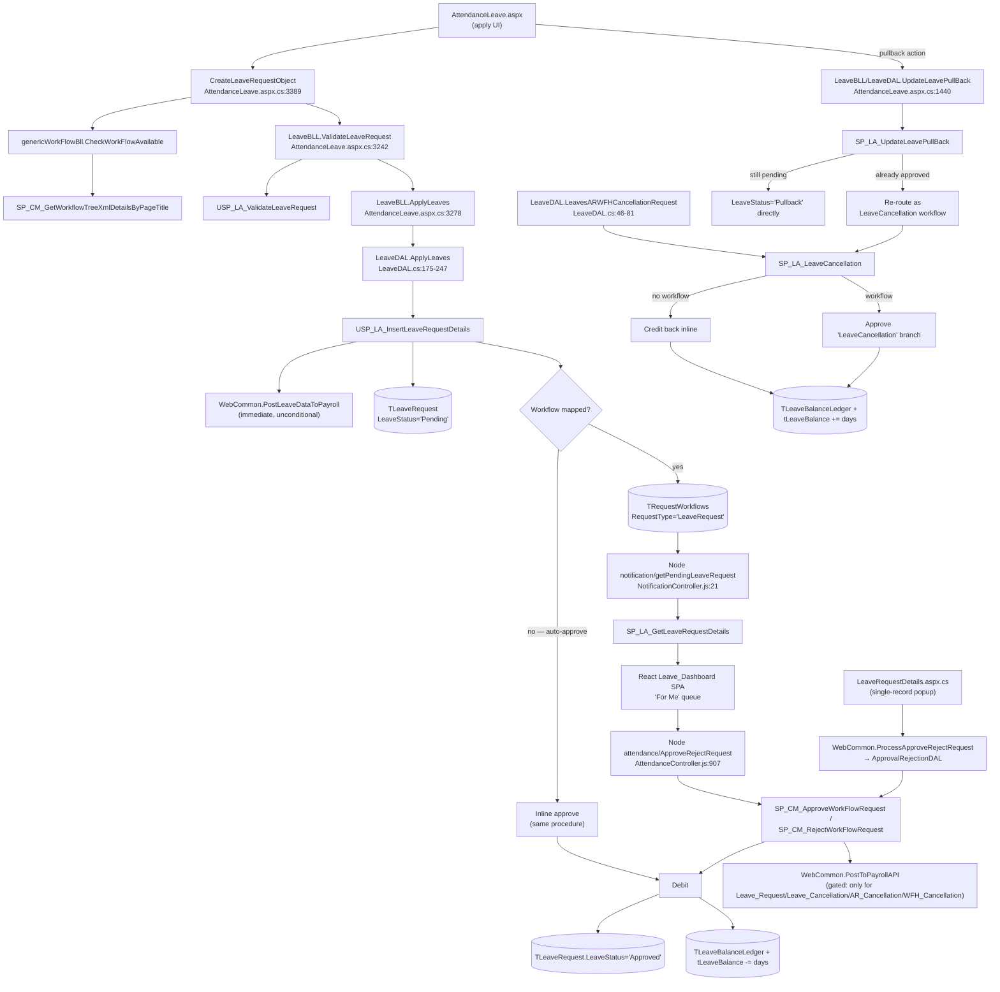
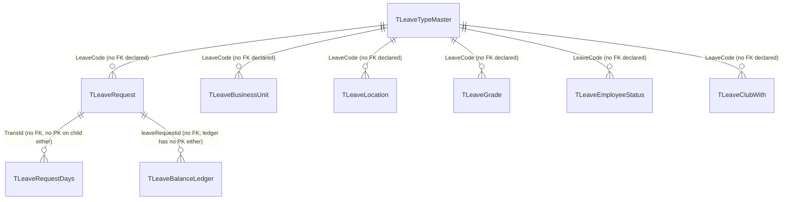

---
sources:
  - HRMS.Web/HRMS.Web/HRM/Leaves/AttendanceLeave.aspx.cs (SourceCode)
  - HRMS.Web/HRMS.Web/HRM/Leaves/LeaveRequestDetails.aspx.cs (SourceCode)
  - HRMS.Shared/HRMS.DataAccessLayer/LeaveAttendanceARWFH/LeaveDAL.cs (SourceCode)
  - HRMS.Shared/HRMS.DataAccessLayer/DBConstant.cs (SourceCode)
  - HRMS.Shared/HRMS.DataAccessLayer/ApprovalRejectionDAL.cs (SourceCode)
  - HRMS.Shared/HRMS.DataAccessLayer/GenericWorkFlowDAL/GenericWorkFlowDAL.cs (SourceCode)
  - HRMS.Shared/HRMS.BusinessLayer/GenericWorkFlow/GenericWorkFlowBLL.cs (SourceCode)
  - HRMS.Shared/HRMS.BusinessLayer/CommonBLL.cs (SourceCode)
  - HRMS.Web/HRMS.Web/Common/Web.Common.cs (SourceCode)
  - HRMS.CoreAPI/HRMS.Core.WebAPI.Node/Routes/AttendanceRoutes.js (SourceCode)
  - HRMS.CoreAPI/HRMS.Core.WebAPI.Node/Controllers/AttendanceController.js (SourceCode)
  - HRMS.CoreAPI/HRMS.Core.WebAPI.Node/Core/BusinessLogicLayer/attendanceBLL.js (SourceCode)
  - HRMS.CoreAPI/HRMS.Core.WebAPI.Node/Core/DataAccessLayer/attendanceDAL.js (SourceCode)
  - HRMS.CoreAPI/HRMS.Core.WebAPI.Node/Routes/NotificationRoutes.js (SourceCode)
  - HRMS.CoreAPI/HRMS.Core.WebAPI.Node/Controllers/NotificationController.js (SourceCode)
  - HRMS.CoreAPI/HRMS.Core.WebAPI.Node/Core/DataAccessLayer/NotificationDAL.js (SourceCode)
  - docs/SystemModels/SystemModel-2/behavior/workflows/leave-approval.md (SourceCode)
  - docs/SystemModels/SystemModel-2/domain/contexts/attendance-leave.md (SourceCode)
  - llm-wiki/domain/leave-lifecycle.md (TDG HRMS DB)
  - llm-wiki/domain/approval-workflow.md (TDG HRMS DB)
  - HRMS-DATABASE/HRMS/STOREPROCEDURE/USP_LA_InsertLeaveRequestDetails.sql (TDG HRMS DB)
  - HRMS-DATABASE/HRMS/STOREPROCEDURE/USP_LA_ValidateLeaveRequest.sql (TDG HRMS DB)
  - HRMS-DATABASE/HRMS/STOREPROCEDURE/SP_CM_ApproveWorkFlowRequest.sql (TDG HRMS DB)
  - HRMS-DATABASE/HRMS/STOREPROCEDURE/SP_CM_RejectWorkFlowRequest.sql (TDG HRMS DB)
  - HRMS-DATABASE/HRMS/STOREPROCEDURE/SP_CM_GetWorkflowTreeXmlDetailsByPageTitle.sql (TDG HRMS DB)
  - HRMS-DATABASE/HRMS/STOREPROCEDURE/SP_LA_GetLeaveRequestDetails.sql (TDG HRMS DB)
  - HRMS-DATABASE/HRMS/STOREPROCEDURE/SP_LA_UpdateLeavePullBack.sql (TDG HRMS DB)
  - HRMS-DATABASE/HRMS/STOREPROCEDURE/SP_LA_LeaveCancellation.sql (TDG HRMS DB)
confidence: high — app-side call chain verified end-to-end with file:line citations across both the legacy WebForms path and the live React/Node path; DB-side per-procedure lifecycle detail is inherited from llm-wiki, not re-verified line-by-line here
last-analyzed: 2026-08-13
---

# Leave Management

## Overview

An employee wants time off. They open the leave application screen, pick a leave type
and dates (full day, half day, or hourly), optionally attach a supporting document, and
give a reason. The system checks the request against the employer's leave rules —
balance, freeze dates, minimum/maximum days, advance notice, overlapping requests — before
letting it through.

If a manager-approval workflow is configured for the request, it goes to a **Pending**
state and lands in the employee's reporting manager's "For Me" approval queue (approval
can span more than one level); if no workflow is mapped, the request is **auto-approved on
the spot**. The manager reviews and either approves or rejects with a comment: approval
debits the employee's leave balance and notifies them, rejection just notifies them with
the reason. Before a manager acts, the employee can pull the request back; an
already-approved leave can still be cancelled, which credits the balance back (directly,
or through its own follow-up approval if cancellation itself needs sign-off).

**Who's involved:**

- **Employee** — applies, pulls back a pending request, cancels an approved one.
- **Reporting manager / approver** — approves or rejects; who counts as "the approver" at
  each level is resolved by workflow role codes, see `llm-wiki/domain/approval-workflow.md`.
- **HR** — configures leave types and rules, and freezes attendance at month-end (frozen
  periods block new approve/reject actions).

This page connects that business flow to its **application call chain** (SourceCode) and
**database lifecycle** (TDG HRMS DB) — for DB-only detail (balance accounting quirks, dead
legacy procedures, open questions) see `llm-wiki/domain/leave-lifecycle.md`, which this
page treats as canonical and does not repeat.

## Workflow

## Entry points

> ⚠️ **Live entry point, corrected**: per SourceCode's own
> `docs/SystemModels/SystemModel-2/domain/contexts/attendance-leave.md` audit (2026-07-24),
> the classic WebForms apply/approve pages under `HRM/Leaves/` are largely **not part of the
> compiled build**. The live apply UI is `AttendanceLeave.aspx` (a single ~10,500-line page
> also handling AR/WFH/comp-off/optional-holiday), and the live manager queue is the React
> `Leave_Dashboard` SPA calling Node CoreAPI — not the `LeaveApproval.aspx` WebForms grid in
> the same folder, whose code-behind (`LeaveApproval.aspx.cs`) is a stub (`test()` binds a
> hardcoded employee id `9`).

| Entry point | Purpose | Live? |
|---|---|---|
| `HRM/Leaves/AttendanceLeave.aspx` | Apply for leave (also AR/WFH/comp-off/optional-holiday) | Yes |
| React `Leave_Dashboard` SPA (`HRM/Leave_Dashboard`) | Manager "For Me" approval queue | Yes |
| Node CoreAPI `GET notification/getPendingLeaveRequest` (`NotificationRoutes.js:10`) | Reads the pending-approval queue for the SPA | Yes |
| Node CoreAPI `POST attendance/ApproveRejectRequest` (`AttendanceRoutes.js:32`) | Bulk approve/reject from the queue | Yes |
| `HRM/Leaves/LeaveRequestDetails.aspx` | Single-record approve/reject popup | Yes (secondary path) |
| `HRM/Leaves/LeavePullback` action inside `AttendanceLeave.aspx` | Pull back a request | Yes |
| `HRM/Leaves/LeaveApproval.aspx` | Legacy grid queue | No — stub code, not the live path |

## Code → database call chain

| Step | Entry point | App code | Stored procedure |
|---|---|---|---|
| Resolve workflow/manager | `AttendanceLeave.aspx.cs:3389` (inside `CreateLeaveRequestObject`, called from `ApplyLeaveRequest` at `:3240`) | `genericWorkFlowBll.CheckWorkFlowAvailable(Constants.Leave_Request,...)` → `GenericWorkFlowDal.CheckWorkFlowAvailable` (`GenericWorkFlowDAL.cs:14`) → `GetWorkFlowTreeXml` (`GenericWorkFlowDAL.cs:30`) | `SP_CM_GetWorkflowTreeXmlDetailsByPageTitle` |
| Validate | `AttendanceLeave.aspx.cs:3242` | `leaveBLL.ValidateLeaveRequest(leaveRequest, true)` → `LeaveDAL.ValidateLeaveRequest` (`LeaveDAL.cs:341-...`) | `USP_LA_ValidateLeaveRequest` (which itself calls `SP_CM_GetWorkflowTreeXmlDetailsByPageTitle` again, `:186`, to confirm a workflow exists before allowing submission) |
| Apply | `AttendanceLeave.aspx.cs:3278` | `LeaveBLL.ApplyLeaves(leaveRequest, true)` → `LeaveDAL.ApplyLeaves` (`LeaveDAL.cs:175-247`) | `USP_LA_InsertLeaveRequestDetails` |
| Payroll sync (immediate, unconditional) | `AttendanceLeave.aspx.cs:3305` | `WebCommon.PostLeaveDataToPayroll` (`Web.Common.cs:499`) — fires at apply time regardless of approval state, wrapped in a log-only try/catch | external payroll API, not a local SP |
| Read "For Me" queue (live) | Node `GET notification/getPendingLeaveRequest` | `NotificationController.GetPendingLeaveRequest` (`NotificationController.js:21`) → `NotificationDAL.GetPendingLeaveRequest` (`NotificationDAL.js:36`) | `SP_LA_GetLeaveRequestDetails` |
| Approve / Reject (live, bulk) | Node `POST attendance/ApproveRejectRequest` | `AttendanceController.ApproveRejectRequest` (`AttendanceController.js:907`) → `attendanceBLL.ApproveRejectRequest` (`attendanceBLL.js:131`) → `attendanceDAL.ApproveRequest` / `RejectRequest` (`attendanceDAL.js:1143`/`1167`) | `SP_CM_ApproveWorkFlowRequest` / `SP_CM_RejectWorkFlowRequest` |
| Approve / Reject (secondary, single-record popup) | `LeaveRequestDetails.aspx.cs:195/197` | `WebCommon.ProcessApproveRejectRequest` (`Web.Common.cs:215`) → `ActionApproveOrReject` (`Web.Common.cs:206`) → `CommonBLL.ApproveSelectedRequest`/`RejectSelectedRequest` (`CommonBLL.cs:87,97`) → `ApprovalRejectionDAL.ApproveSelectedRequest`/`RejectSelectedRequest` (`ApprovalRejectionDAL.cs:19,62`) | same `SP_CM_ApproveWorkFlowRequest` / `SP_CM_RejectWorkFlowRequest` — one shared generic engine, not leave-specific |
| Payroll sync (gated, post-decision) | `Web.Common.cs:531` (`PostToPayrollAPI`, called from the approve/reject flow) | Fires only when `RequestType` is in a hardcoded array (`Leave_Request`, `Leave_Cancellation`, `AR_Cancellation`, `WFH_Cancellation`) — AR/WFH *approvals* are **not** in that array | external payroll API |
| Pullback | `AttendanceLeave.aspx.cs:1440` | `LeaveBLL.UpdateLeavePullBack(EmpLeavePullback)` → `LeaveDAL.UpdateLeavePullBack` (`LeaveDAL.cs:83-97`) | `SP_LA_UpdateLeavePullBack` (`ConstantStoredProcedure.SP_LA_UPDATELEAVEPULLBACK`) |
| Cancel | (leave cancellation action) | `LeaveDAL.LeavesARWFHCancellationRequest` (`LeaveDAL.cs:46-81`) | `SP_LA_LeaveCancellation` (`ConstantStoredProcedure.SP_LA_LEAVECANCELLATION`) |

## API endpoints

| Verb | Route | Parameters | Purpose | Source |
|---|---|---|---|---|
| `GET` | `notification/getPendingLeaveRequest` | `employeeId` — overridden server-side from the JWT (`req.EID`); any client-supplied value is ignored. `DisplayRequest` (query, string, optional) | Reads the pending "For Me" leave-approval queue backing the live React dashboard | `NotificationController.js:21-31` |
| `POST` | `attendance/ApproveRejectRequest` | `combinedARData` (body, array, required); each item: `actionType` (`'Approve'`\|`'Reject'`, required), `RequestTransId` (int, required), `RequestType` (string, required — e.g. `'Leave'`), `RequestWorkflowTransId` (int, optional), `EmployeeId` (overridden server-side, not client-supplied), `Employerid` (int, required), `comments`/`RejectionReason` (string) | Bulk approve/reject one or more pending requests in a single call; Leave rows are disambiguated from AR/Overtime rows via `RequestType` | `AttendanceController.js:907-1125` |

Apply (`CreateLeaveRequestObject`/`ApplyLeaveRequest`), pullback (`UpdateLeavePullBack`), plain
cancellation (`LeavesARWFHCancellationRequest`), and the secondary single-record approve/reject
popup (`LeaveRequestDetails.aspx.cs` → `WebCommon.ProcessApproveRejectRequest`) are all classic
WebForms postbacks calling BLL/DAL server-side, not AJAX/API calls. Confirmed by grepping
`AttendanceLeave.aspx.cs` and `LeaveRequestDetails.aspx.cs` for `[WebMethod]`/`PageMethods`: the
only two `[WebMethod]`s in either file are an unrelated search-box typeahead helper and a
read-only action-history fetch (`AttendanceLeave.aspx.cs:467`, `:476`) — neither is an
apply/approve/reject/pullback action.

## Stored procedures & tables involved

> ✅ **Resolves an open question in `llm-wiki/domain/leave-lifecycle.md` §3**: that page could
> not confirm from DB source alone whether `SP_ApproveWorkFlowRequest` or
> `SP_CM_ApproveWorkFlowRequest` is the live approve procedure for `LeaveRequest`. From the
> application side this is unambiguous — **every current caller, on both the legacy WebForms
> path and the live Node path, calls the `CM`-prefixed procedures**:
> `ApprovalRejectionDAL.cs` uses `DBConstant.COMMON_APPROVE_WORKFLOW_REQUEST` /
> `COMMON_REJECT_WORKFLOW_REQUEST` (`DBConstant.cs:13,15`, values
> `"SP_CM_ApproveWorkFlowRequest"` / `"SP_CM_RejectWorkFlowRequest"`), and the Node
> `attendanceDAL.js` calls the same two names literally (`attendanceDAL.js:1158,1176`). The
> older-looking constant name `SP_ApproveWorkFlowRequest` at `DBConstant.cs:1190` is a
> misleading *identifier* whose string *value* is already `"SP_CM_ApproveWorkFlowRequest"` —
> there is no separate live call path to the plain-named procedure.

| Object | Path | Role |
|---|---|---|
| `SP_CM_GetWorkflowTreeXmlDetailsByPageTitle` | `HRMS-DATABASE/HRMS/STOREPROCEDURE/SP_CM_GetWorkflowTreeXmlDetailsByPageTitle.sql` | Resolves the mapped workflow tree/`SkipWorkFlow` flag for a page — shared across leave, AR, WFH, recruitment; see `llm-wiki/domain/approval-workflow.md` |
| `USP_LA_ValidateLeaveRequest` | `HRMS-DATABASE/HRMS/STOREPROCEDURE/USP_LA_ValidateLeaveRequest.sql` | Pre-submit validation: balance, min/max days, freeze date, intervening/sandwich days, cross-cycle and carry-forward rules, comp-off token checks, minimum advance notice |
| `USP_LA_InsertLeaveRequestDetails` | `HRMS-DATABASE/HRMS/STOREPROCEDURE/USP_LA_InsertLeaveRequestDetails.sql` | Creates the request; auto-approves inline if no workflow is mapped |
| `SP_LA_GetLeaveRequestDetails` | `HRMS-DATABASE/HRMS/STOREPROCEDURE/SP_LA_GetLeaveRequestDetails.sql` | Reads the pending "For Me"/"My" leave queue (self or manager mode via `@DisplayRequest`) — backs the live React dashboard |
| `SP_CM_ApproveWorkFlowRequest` / `SP_CM_RejectWorkFlowRequest` | `HRMS-DATABASE/HRMS/STOREPROCEDURE/` | Generic cross-module approve/reject engine — see `llm-wiki/domain/approval-workflow.md`. Confirmed live for `LeaveRequest` by every current app-side caller (see callout above) |
| `SP_LA_LeaveCancellation` | `HRMS-DATABASE/HRMS/STOREPROCEDURE/SP_LA_LeaveCancellation.sql` | Cancels a request; credits balance directly or via a `LeaveCancellation` workflow |
| `SP_LA_UpdateLeavePullBack` | `HRMS-DATABASE/HRMS/STOREPROCEDURE/SP_LA_UpdateLeavePullBack.sql` | Pulls back a pending or already-approved request |
| `SP_AdminLM_TruncateLeave` | `HRMS-DATABASE/HRMS/STOREPROCEDURE/SP_AdminLM_TruncateLeave.sql` | Year-end lapse/encash/carry-forward |
| `TLeaveRequest`, `TLeaveRequestDays` | `HRMS-DATABASE/HRMS/TABLES/` | The request header and its per-day rows |
| `TLeaveBalanceLedger`, `tLeaveBalance` | `HRMS-DATABASE/HRMS/TABLES/` | Append-only audit trail and the live mutable balance |
| `TRequestWorkflows` | `HRMS-DATABASE/HRMS/TABLES/` | Per-approval-level routing row created by `USP_LA_InsertLeaveRequestDetails` and advanced/closed by the approve/reject engine — see `llm-wiki/domain/approval-workflow.md` |
| `TLeaveTypeMaster` + `TLeaveBusinessUnit`/`TLeaveLocation`/`TLeaveGrade`/`TLeaveEmployeeStatus`/`TLeaveClubWith` | `HRMS-DATABASE/HRMS/TABLES/` | Leave-type policy and its targeting rules |

Full per-procedure line-level detail (balance accounting quirks, dead legacy procedures,
year-end job internals) is documented once in `llm-wiki/domain/leave-lifecycle.md` — not
duplicated here.

## Table relationships

Reused verbatim from `llm-wiki/domain/leave-lifecycle.md` §8b — see that page for the
"zero foreign keys declared" caveat behind every edge below. `TRequestWorkflows`'s own
edges (to `TWorkflowManagement` and to `TLeaveRequest` as one of its 14 polymorphic
targets) are documented once in `llm-wiki/domain/approval-workflow.md` and not repeated here.

## Known gaps

- `LeaveApplication.aspx`/`LeaveApproval.aspx`/`LeaveCancellation.aspx`/`LeavePullback.aspx`
  exist as separate files in `HRM/Leaves/` alongside `AttendanceLeave.aspx`. SystemModel-2
  confirms the *grid-based approve/reject handlers* in this folder are dead; it does not
  individually confirm each of these four files file-by-file. Treated here as legacy/inactive
  based on that finding plus `LeaveApproval.aspx.cs`'s stub body — not exhaustively verified
  per file.
- The exact line(s) in `AttendanceLeave.aspx.cs` that call `LeaveDAL.LeavesARWFHCancellationRequest`
  for a plain (non-AR/WFH) leave cancellation were not pinned down to a line number in this
  pass — the method itself is confirmed live via `LeaveDAL.cs:46-81`.
- `SP_CM_ApproveWorkFlowRequest`/`SP_CM_RejectWorkFlowRequest` are each thousands of lines
  handling ~15+ unrelated request types (recruitment, reallocation, resignation, AR, WFH,
  optional holiday, overtime, etc.) in one shared procedure — only the `LeaveRequest`
  branch (`SP_CM_ApproveWorkFlowRequest.sql:4172-...`, `SP_CM_RejectWorkFlowRequest.sql:290-...`)
  was traced in depth for this page. The other branches are out of scope for a Leave
  Management doc but worth knowing about if a change to this SP is ever proposed — the
  blast radius extends well beyond leave.
- Cross-tenant/employer scoping of these procedures was not re-checked here — see
  `llm-wiki/assumptions/open-questions.md` for existing tenancy caveats on this domain.
