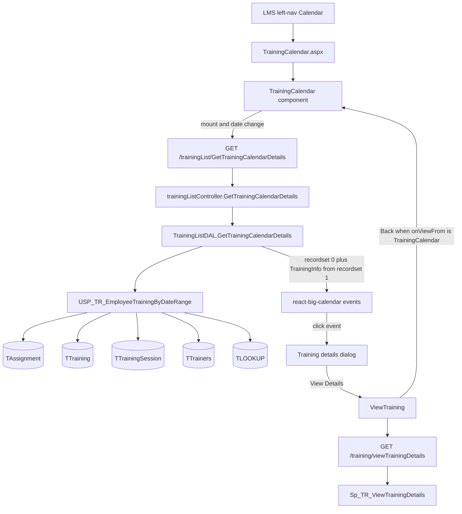
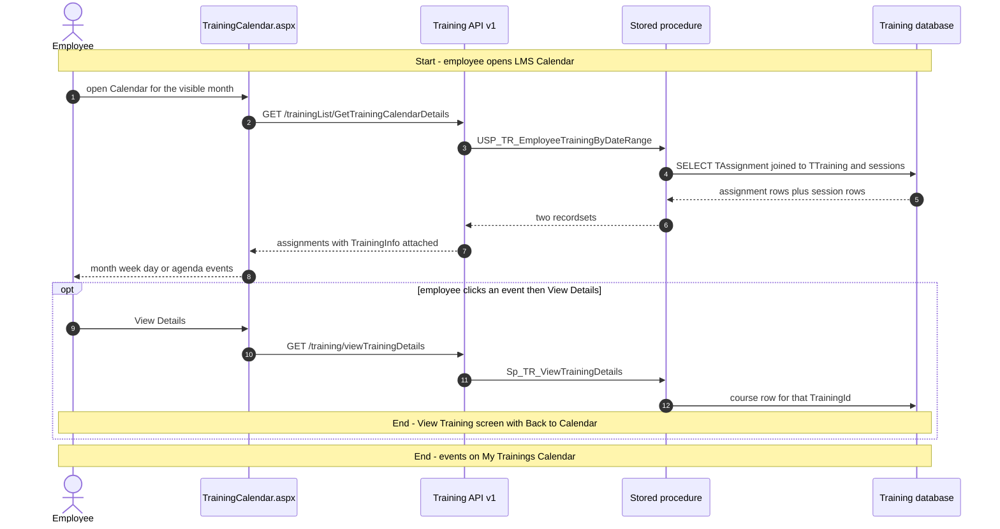
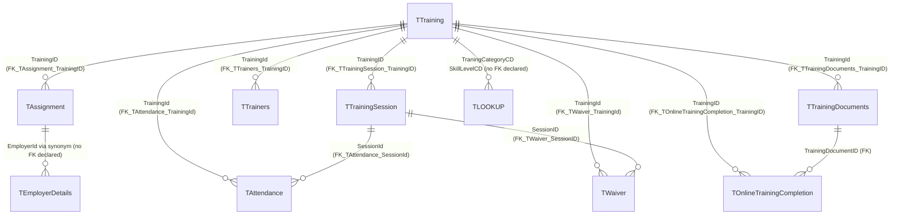

# Calendar

## Overview

An employee wants to know which of their courses fall this month — classroom sessions with a start and end time, or online and quiz enrolments that only have an assigned date. They open **LMS → Calendar** and land on a full-screen month grid titled **My Trainings Calendar**. Classroom courses appear on each session date in range; online and quiz courses appear as all-day events on the day they were assigned. Clicking an event opens a small dialog (type, scheduled or enrolled date, duration). **View Details** jumps to the same course page used from Trainings, and Back from that page returns here.

Nothing on this page creates a course, enrols anyone, or changes an assignment. The only database work is a date-range SELECT of **that employee's** rows in `TAssignment`. Month / week / day / agenda are display modes of the same list. There is no team calendar and no admin “all org” calendar on this menu item — the toolbar label is hardcoded to My Trainings.

**Who's involved:**

- **Employee** — the assignee. The grid is their own enrolments for the visible date range.
- **LMS coordinator / trainer / manager** — not a separate calendar role. A coordinator who is also assigned a course sees it the same way. Trainer names come back on the payload for the popup but there is no trainer-only view.

This is **not** the **Training Calendar** tab under **LMS → Reports** (`TR032` / `USP_Training_Calender_Report`). That is an exportable grid; this page is the interactive calendar.

There is **no** `llm-wiki/domain` lifecycle page for LMS. Table names and declared FKs come from `llm-wiki/reference/tables/training.md` and `llm-wiki/architecture/module-catalog.md` (the `Training` satellite database). This page is the application call chain those catalogs do not cover.

Sibling left-nav items **Trainings**, **TNI Setup**, and **Reports** share the same React bundle but are separate menu pages.

## Workflow

Training type codes on `TTraining.TrainingTypeCD` (and in `AppConstants.js`): **4001** Online, **4002** Classroom, **4003** Quiz. The procedure places online/quiz on `TAssignment.CreatedOn` and classroom on `TTrainingSession.SessionDate` inside `@StartDate`–`@EndDate`. It does not filter `IsApproved` or `IsCancelled`.

## Request journey

The everyday request is **loading the calendar** (it ends as SELECT rows painted on the grid). **View Details** is the same employee opening the course page already documented under Trainings.

There is no approve/reject or write path on this menu item.

## Entry points

> `TrainingCalendar.aspx` is the live LMS → Calendar shell. It loads the same Training React bundle as Trainings / Reports / TNI Setup (`TrainingBuildAssets`). `RouteConstants.TRAINING_CALENDAR` is `/HRM/Training/TrainingCalendar.aspx`. The Calendar route is **not** wrapped in `Authorization([...])` (unlike Reports, which requires `TR021`). Page reachability is the HRMS left-nav mapping, not an LMS `TRxxx` claim in `claimConstants.js`. `TR032` is the Reports tab named Training Calendar, not this page.

| UI page / route | Purpose |
|---|---|
| `/HRM/Training/TrainingCalendar.aspx` | LMS → Calendar. Hidden fields stamp employee/employer/role for the SPA. Hosts `react-big-calendar` (month / week / day / custom agenda). |
| `/HRM/Training/ViewTraining` | Course detail opened from the event dialog (`state.onViewFrom = 'TrainingCalendar'`). Back navigates to the calendar route. |

`CustomToolbar` always renders the title **My Trainings Calendar**. Redux `TrainingCalendarFilterCriteria` exists on `authReducer` but no calendar component reads or writes it.

## Code → database call chain

Live SPA constants are **v1** (`/trainingList/…`, `/training/…`). The v3 twins in `apiURLConstants.js` sit inside a block comment (`/*` at line 504 through `*/` at line 750), the same fence already noted on the Reports guide.

| Entry point | DAL / BLL method (`file:line`) | Stored procedure |
|---|---|---|
| Calendar load / date change | `GetTrainingCalendarDetails` (`trainingListDAL.js:299`) via `trainingListController.js:123` | `USP_TR_EmployeeTrainingByDateRange` |
| View Details on the event dialog | `ViewTrainingDetails` (`trainingDAL.js:841`) via `trainingBLL.js:177` and `trainingController.js:325` | `Sp_TR_ViewTrainingDetails` |

The calendar GET has **no BLL**. The controller calls the DAL, which binds `EmployeeId`, `EmployerId`, `StartDate`, `EndDate` by name and merges the second recordset onto each assignment as `TrainingInfo`.

v3 `trainingListController_v3.js:149` still exists (`req.EID` from JWT, gated by `SP_Employer_CustNo_isValid`). The Calendar page does not call it while the v3 constants remain commented.

## API endpoints

The Training Node app mounts three generations (`/api/trainingList`, `/api/v2/trainingList`, `/api/v3/trainingList`). This feature's live constants are **v1**. There is no WebForms postback DAL — `TrainingCalendar.aspx.cs` only stamps session. Base path is `/api` (`app.js` → `routeIndex.js`). v1 `authMiddleware.js` does **not** currently verify JWT (the `jwt.verify` block is commented; it always `next()`). Employee id is taken from the **query string** (`EmpId`), which the SPA fills from the hidden `hdnEmpId` / Redux user.

| Verb | Route | Parameters | Purpose | Source |
|---|---|---|---|---|
| `GET` | `/trainingList/GetTrainingCalendarDetails` | query `EmpId` (int, required), `EId` (int, required — employer), `StartDate` (date, required), `EndDate` (date, required) | Assignments and sessions in range for that employee | `trainingListController.js:123` |
| `GET` | `/training/viewTrainingDetails` | query `TRId` (int, required), `EmpId` (int, required), `EmployerId` (int, required) | Course page after View Details | `trainingController.js:325` |

`GET_TEAM_TRAINING_CALENDAR_LIST` (`/trainingList/getTeamTrainingCalendarDetails`) is declared in `apiURLConstants.js` on v1 and v3. **No route, controller, or DAL method** exists under `HRMS.Training.WebAPI.Node`, and `trainingCalendar.js` never calls it.

Master Question Bank's copy of `apiURLConstants.js` also declares `GET_ALL_TRAINING_CALENDAR_LIST` and `GET_Tablist_Training_CALENDAR`. Those URLs are not used by this Calendar page.

## Stored procedures & tables involved

> Live calendar data comes from **`USP_TR_EmployeeTrainingByDateRange`** in the Training database. `USP_TR_GetTabListTrainingCalendar` lives in **core HRMS** (`MenuId = 1304` in the script comments) and is built for role/user tab rows (`TRoleTabDetails` / `TUserTabDetails`). No Training Calendar UI caller was found. Table `Training Calendar 2019` is a 2019 import leftover and is not read by the live procedure.

| Object | File path | Purpose | llm-wiki |
|---|---|---|---|
| `TAssignment` | `HRMS-DATABASE/HRMS-TRAINING/TABLES/TAssignment.sql` | Employee enrolment; date filter for online/quiz uses `CreatedOn`; `IsMandatory` drives the legend. | `llm-wiki/reference/tables/training.md` |
| `TTraining` | `…/TTraining.sql` | Course name, type (`4001`/`4002`/`4003`), duration, cancel flag, assessment windows. | same |
| `TTrainingSession` | `…/TTrainingSession.sql` | Classroom session date/time; second result set (`TrainingInfo`). | same |
| `TTrainers` | `…/TTrainers.sql` | Concatenated trainer names on the first result set. | same |
| `TLOOKUP` | `…/TLOOKUP.sql` | Category and skill labels (`TraningCategoryCD`, `SkillLevelCD`). No FK declared. | same |
| `TTrainingDocuments` | `…/TTrainingDocuments.sql` | Thumbnail fields and post-assessment enablement count. | same |
| `TOnlineTrainingCompletion` | `…/TOnlineTrainingCompletion.sql` | Compared to document count for `EnablePostAssessment`. | same |
| `TAttendance` | `…/TAttendance.sql` | `ShowWaiver` / `IsAttendanceMarkedForAll` flags. | same |
| `TWaiver` | `…/TWaiver.sql` | `isWaiverSubmitted`. | same |
| `TEmployerDetails` | `HRMS-DATABASE/HRMS-TRAINING/SYNONYMS/TEmployerDetails.sql` | Synonym to core `HRM-CL-Prod` for `RootEmployerID` (lookup scope). | core employer in `llm-wiki/reference/tables/hrms.md` |
| `USP_TR_EmployeeTrainingByDateRange` | `HRMS-DATABASE/HRMS-TRAINING/STOREPROCEDURE/USP_TR_EmployeeTrainingByDateRange.sql` | Two result sets: assignment cards, then sessions. | — |
| `Sp_TR_ViewTrainingDetails` | `HRMS-DATABASE/HRMS-TRAINING/STOREPROCEDURE/` | View Details hop (full course payload). | — |
| `USP_TR_GetTabListTrainingCalendar` | `HRMS-DATABASE/HRMS/STOREPROCEDURE/USP_TR_GetTabListTrainingCalendar.sql` | Core-HRMS tab list for Calendar `MenuId` 1304. Not called from this SPA. | — |
| `Training Calendar 2019` | `HRMS-DATABASE/HRMS-TRAINING/TABLES/Training Calendar 2019.sql` | Unused year-2019 import table. | `llm-wiki/reference/tables/training.md` |
| `TCLAIM` / `TCLAIM_ASSIGNMENT` | Training DB | LMS claims `TR001`–`TR036`. None of them gate this Calendar route; `TR032` is the Reports tab. | same |

## Table relationships

Declared FKs are taken from each table's `CREATE TABLE` (same edges as `llm-wiki/reference/tables/training.md` "Depends on"). Tables with no `FOREIGN KEY` are labelled as such rather than invented. Only objects the calendar procedure (or the View Details hop) actually reads are shown.

## Known gaps

- **No SystemModel-2 page** for LMS Calendar, and **no** `llm-wiki/domain` lifecycle page — behaviour above is from SourceCode + procedure scripts.
- **SPA talks v1, not v3.** Calendar URLs in the v3 block of `apiURLConstants.js` are commented out. v1 `authMiddleware.js` has JWT verification commented out; `EmpId` is a query parameter.
- **`TrainingInfo` shape vs UI.** The live DAL stores one session object per `TrainingId` in a `Map` (`trainingListDAL.js:316–327`). The older filter-to-array code is commented. `trainingCalendar.js` treats `TrainingInfo` as an array (`trainingData.length` / `.map`) before plotting timed classroom events. A single object has no `.length`, so classroom courses can fall through to the all-day `AssignedOn` branch.
- **Date-range on navigate.** `onNavigate` calls `onCalDateChange(date)` without `view`. When `view` is unset, start and end stay the navigated day rather than `startOf`/`endOf` month or week. Initial mount still uses `moment().startOf/endOf('month')`.
- **No `IsApproved` / `IsCancelled` filter** in `USP_TR_EmployeeTrainingByDateRange`. Pending, rejected, waitlisted, and cancelled assignments in range still return.
- **`GET_TEAM_TRAINING_CALENDAR_LIST`** has no server route. **`USP_TR_GetTabListTrainingCalendar`** and MQB constants `GetAllTrainingCalendarDetails` / `GetTabListTrainingCalendar` are unused by this page.
- **CSS class names** `mandatory` / `nonMandatory` are swapped relative to `IsMandatory`, but legend colours still match because `.nonMandatory:after` is the red swatch used for Mandatory Training.
- **`Training Calendar 2019`** is catalogued in the Training table wiki and is not on the live call chain.
- Core HRMS `TCalendarMaster` / `THolidayMaster` are **leave/holiday calendars**, not this LMS menu item.

## Reference

Confidence is **medium**: the Calendar page was traced to a v1 DAL `file:line` and `USP_TR_EmployeeTrainingByDateRange`, whose two result sets and table list come from the procedure script. There is no domain `erDiagram` to reuse; relationships are the declared FKs from DDL / `llm-wiki/reference/tables/training.md`. The v1-vs-v3 live-path finding is from the current `apiURLConstants.js` comment fences.

### SourceCode

- `HRMS.Web/HRMS.Web/HRM/Training/TrainingCalendar.aspx` (+ `.cs`)
- `HRMS.Web/HRMS.Web/HRM/Training/Areas/routes.js`
- `HRMS.Web/HRMS.Web/HRM/Training/Areas/TrainingCalendar/trainingCalendar.js`
- `HRMS.Web/HRMS.Web/HRM/Training/Areas/TrainingCalendar/CustomToolbar.js`
- `HRMS.Web/HRMS.Web/HRM/Training/Areas/TrainingCalendar/CustomAgenda.js`
- `HRMS.Web/HRMS.Web/HRM/Training/Areas/ManageTraining/Containers/viewTrainingDetails.js` (Back when `onViewFrom == 'TrainingCalendar'`)
- `HRMS.Web/HRMS.Web/HRM/Training/Common/apiURLConstants.js`, `routeConstants.js`, `claimConstants.js`, `AppConstants.js`
- `HRMS.Web/HRMS.Web/HRM/Training/Store/Reducers/authReducer.js` (`TrainingCalendarFilterCriteria`, unused by this page)
- `HRMS.Training/HRMS.Training.WebAPI.Node/app.js`, `Routes/routeIndex.js`
- `HRMS.Training/HRMS.Training.WebAPI.Node/Routes/trainingListRoutes.js`, `trainingRoutes.js`
- `HRMS.Training/HRMS.Training.WebAPI.Node/Controllers/trainingListController.js`, `trainingController.js`
- `HRMS.Training/HRMS.Training.WebAPI.Node/Core/DataAccessLayer/trainingListDAL.js`, `trainingDAL.js`
- `HRMS.Training/HRMS.Training.WebAPI.Node/Core/BusinessLogicLayer/trainingBLL.js`
- `HRMS.Training/HRMS.Training.WebAPI.Node/Middlewares/authMiddleware.js`
- v3 twins (not the live SPA path): `trainingListRoutes_v3.js`, `trainingListController_v3.js`, `trainingListDAL_v3.js`

### TDG HRMS DB

- `llm-wiki/architecture/module-catalog.md` — `HRMS-TRAINING` / database `Training`
- `llm-wiki/reference/tables/training.md` — table catalog and declared-FK "Depends on" list (no domain lifecycle page to reuse)
- `HRMS-DATABASE/HRMS-TRAINING/TABLES/TAssignment.sql`, `TTraining.sql`, `TTrainingSession.sql`, `TTrainers.sql`, `TTrainingDocuments.sql`, `TAttendance.sql`, `TWaiver.sql`, `TOnlineTrainingCompletion.sql`
- `HRMS-DATABASE/HRMS-TRAINING/SYNONYMS/TEmployerDetails.sql`
- `HRMS-DATABASE/HRMS-TRAINING/STOREPROCEDURE/USP_TR_EmployeeTrainingByDateRange.sql`
- `HRMS-DATABASE/HRMS/STOREPROCEDURE/USP_TR_GetTabListTrainingCalendar.sql` (unused by this SPA)
