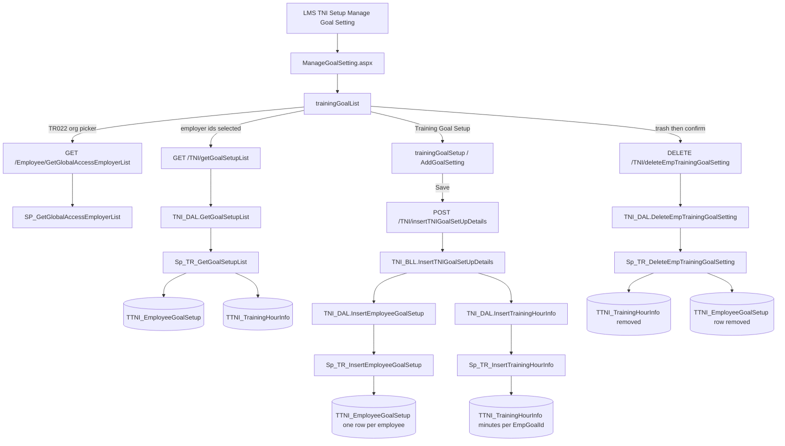
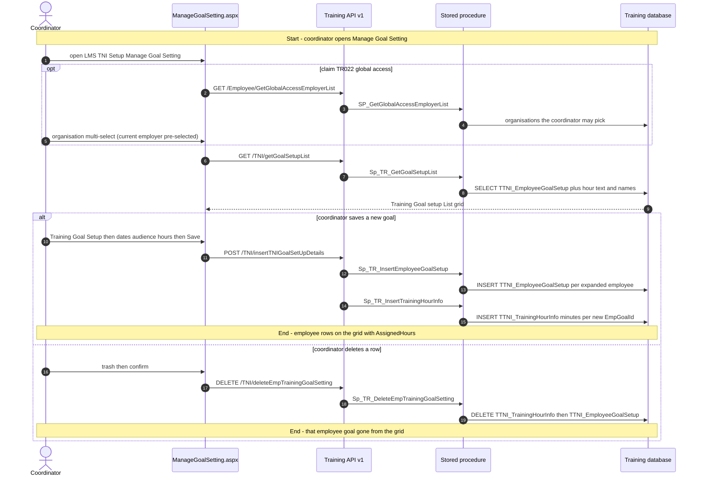
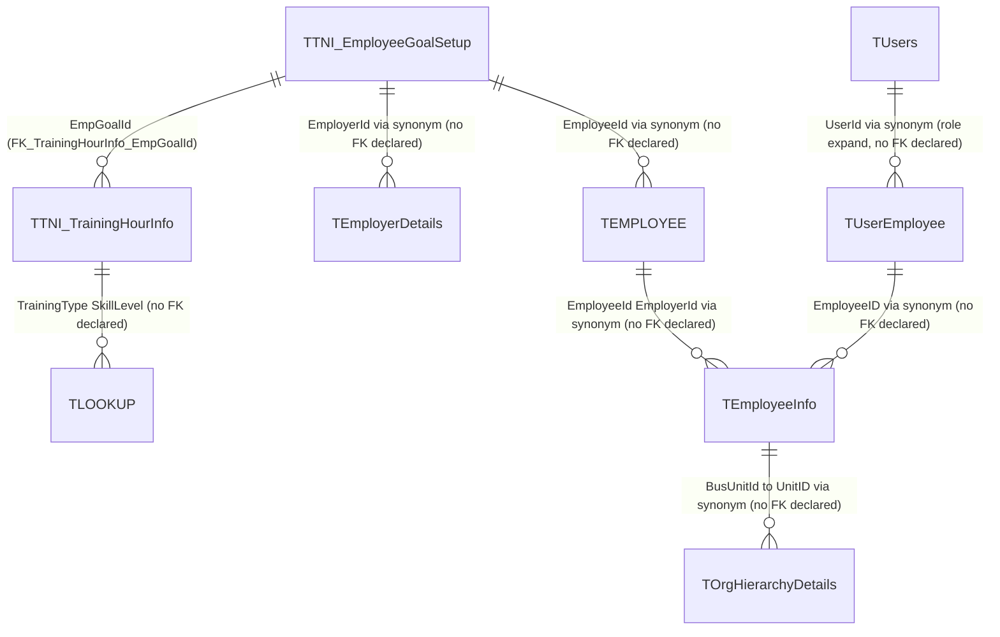

# Manage Goal Setting

## Overview

An LMS coordinator needs every in-scope employee to complete a set number of training hours in a window — technical, non-technical, or a combined “Both / All” bucket they can fill with either. They open **LMS → TNI Setup → Manage Goal Setting** (left-nav `TMenuDetails` value 118; the label is **Goal**, not Global). The grid is one row per employee already given a goal. **Training Goal Setup** opens a form: start and end dates (at most 365 days), an audience of business units and/or roles and/or named employees, and one or more hour lines (category, optional sub-category, skill level, `HH:MM`). Save expands that audience to active employees and writes a goal row plus hour rows for each of them. There is no edit and no publish step. Trash removes that employee’s goal and its hour lines. The Excel icon exports the current grid.

**Who's involved:**

- **LMS coordinator / training admin** — creates and deletes hour targets. Claim `TR017` is the Manage Goal Setting claim; the React route is **not** wrapped in `Authorization([TR017])` (page reachability is the HRMS left-nav). Organisation pickers on the list appear when claim `TR022` (global access) is present. The setup form always shows an organisation dropdown (see Known gaps).
- **Employee** — not a user of this screen. The hours later feed My Trainings’ goal chart and Assign Training. They do not submit or acknowledge anything here.
- **Manager** — not a user of this screen.

This is **not** PMS **Goal Setting** (`TPMSEmployeeGoalSetting` / Self-Goal Setting). It is **not** employer-wide defaults on `TConfiguration` / `TTrainingConfiguration`. Sibling **Manage TNI** is the TNI *cycle* (who may propose topics and until when), not hour targets.

There is **no** `llm-wiki/domain` lifecycle page for LMS. Table names come from `llm-wiki/reference/tables/training.md` and `llm-wiki/architecture/module-catalog.md` (the `Training` satellite database). `TTNI_TrainingHourInfo` declares an FK to `TTNI_EmployeeGoalSetup`; the setup table itself declares **no** FKs. This page is the application call chain those catalogs do not cover.

Sibling left-nav items **Trainings**, **Reports**, and **Calendar** share the same React bundle but are separate menu pages. **Manage TNI** is the other child under **TNI Setup**.

## Workflow

Save expands the audience inside `Sp_TR_InsertEmployeeGoalSetup`: named employees as given; business units to active employees in those units for `SelectedEmployers`; roles to active `TUsers` / `TUserEmployee` in those organisations. A whole-organisation expansion (`@pEmployerId`) exists in the procedure but this form never sends organisation ids that way — validation requires at least one BU, role, or employee. Hours are posted as `HH:MM` and stored as total minutes. The list concatenates those rows as `AssignedHours`. Overlapping date ranges for the same employee fail check `CK_EmployeeGoal_ValidateDates` (`ValidateEmpGoalBetweenDates`); the BLL then returns `false` and the SPA shows “Goal already exists for selected date range.”

## Request journey

The coordinator request that creates the targets is **Save** on Training Goal Setup. **Delete** is a second request on the list: same actor, different terminal state (row gone).

Employees seeing remaining hours on My Trainings (`trainingGoal.js`) is a dashboard chart, not this menu item. Assign Training also calls `getGoalSetupList`; that page is not documented here.

## Entry points

> `ManageGoalSetting.aspx` is the live **LMS → TNI Setup → Manage Goal Setting** shell. It loads the same Training React bundle as Trainings / Reports / Calendar / Manage TNI (`TrainingBuildAssets`). `RouteConstants.MANAGE_GOAL_SETTING` is `/HRM/Training/ManageGoalSetting.aspx` and maps to `trainingGoalList`. `RouteConstants.ADD_GOAL_SETTING` is `/HRM/Training/AddGoalSetting` and maps to `trainingGoalSetup`. There is **no** `AddGoalSetting.aspx`; that URL is a client-side React route after the list SPA is loaded. Neither route is wrapped in `Authorization([...])`. `TR017` is the claim constant for this feature; `TR022` gates the list’s organisation multi-select. Lookups for category (parent `3500`) and skill level (parent `4500`) come from Redux `lstLookup` filled at SPA boot (`setupUser.js` / `GetUserSetupDetails`), not from a page-specific GET. PMS Goal Setting pages are a different module.

| UI page / route | Purpose |
|---|---|
| `/HRM/Training/ManageGoalSetting.aspx` | LMS → TNI Setup → Manage Goal Setting. Hidden fields stamp employee/employer/role for the SPA. Hosts the grid and (via client navigation) Training Goal Setup. Logs activity `ManageGoalSetting`. |
| `/HRM/Training/AddGoalSetting` | Training Goal Setup form. No aspx; `navigate` from the list’s **Training Goal Setup** button. Refresh/bookmark has no WebForms host. |

## Code → database call chain

Live SPA constants are **v1** (`/TNI/…`, `/Employee/…`, `/employee/…`). The v3 twins in `apiURLConstants.js` sit inside a block comment (`/*` at line 504 through `*/` at line 750), the same fence already noted on the Calendar, Reports, and Manage TNI guides.

Save is the only write that goes through **BLL** (`InsertTNIGoalSetUpDetails` starts a transaction, inserts goal rows, then hour rows). List and delete call `TNI_DAL` from the controller.

| Entry point | DAL / BLL method (`file:line`) | Stored procedure |
|---|---|---|
| Page load (grid, after org ids) | `GetGoalSetupList` (`TNI_DAL.js:280`) via `TNIController.js:149` | `Sp_TR_GetGoalSetupList` |
| Save on Training Goal Setup | `InsertTNIGoalSetUpDetails` (`TNI_BLL.js:69`) → `InsertEmployeeGoalSetup` (`TNI_DAL.js:241`) then `InsertTrainingHourInfo` (`TNI_DAL.js:262`) via `TNIController.js:137` | `Sp_TR_InsertEmployeeGoalSetup` then `Sp_TR_InsertTrainingHourInfo` |
| Delete confirm | `DeleteEmpTrainingGoalSetting` (`TNI_DAL.js:294`) via `TNIController.js:160` | `Sp_TR_DeleteEmpTrainingGoalSetting` |
| Org picker (list when `TR022`; setup form always) | `GetGlobalAccessEmployerList` (`employeeDAL.js:194`) via `employeeController.js:105` | `SP_GetGlobalAccessEmployerList` (Training synonym → core HRMS) |
| Employee search on the form (`MyRoleId` hardcoded `'1'` → search type `A`) | `GetEmployeeDetails` (`employeeDAL.js:49`) via `employeeController.js:19` | `Sp_TR_AllSearchEmployee` |
| Business-unit search on the form | `ViewCostCenterDetails` (`employeeDAL.js:33`) via `employeeController.js:29` | `Sp_TR_GetUnitNames` |
| Role search on the form | `GetAllRoles` (`employeeDAL.js:87`) via `employeeController.js:52` | `Sp_TR_GetAllRoles` |

v3 `TNIController_v3.js` still exposes the same three goal endpoints. List/insert/delete are **not** gated by `SP_Employer_CustNo_isValid` (unlike some other v3 TNI reads). This page does not call v3 while the v3 constants remain commented.

## API endpoints

The Training Node app mounts three generations (`/api/TNI`, `/api/v2/TNI`, `/api/v3/TNI`). This feature's live constants are **v1**. There is no WebForms postback DAL — `ManageGoalSetting.aspx.cs` only stamps session and logs activity. Base path is `/api` (`app.js` → `routeIndex.js`). v1 `authMiddleware.js` does **not** currently verify JWT (the `jwt.verify` block is commented; it always `next()`).

| Verb | Route | Parameters | Purpose | Source |
|---|---|---|---|---|
| `GET` | `/TNI/getGoalSetupList` | query `EmployerIds` (comma list, required for a non-empty grid). The SPA also passes a second `employeeId` argument into the URL helper; that helper ignores it. | Grid rows | `TNIController.js:149` |
| `POST` | `/TNI/insertTNIGoalSetUpDetails` | body `DurationStartDate` (datetime, required), `DurationEndDate` (datetime, required), `SelectedOrganizationIds` (empty array when BU/role/employee is set; the whole-org string branch is not used by current validation), `SelectedEmployers` (single employer id string), `SelectedBUIds` (comma list or empty), `SelectedEmployeeIds` (comma list or empty), `SelectedRoleIds` (comma list or empty), `trainingHourInfo` (array of `{ TrainingType, TrainingSubCategory, SkillLevel, Hours }` with `Hours` as `HH:MM`), `SubmittedBy` (int, logged-in employee) | Expand audience; insert goals and hour lines in one transaction | `TNIController.js:137` |
| `DELETE` | `/TNI/deleteEmpTrainingGoalSetting` | query `EmpGoalId` (int, required). SPA path is this lowercase `delete…` URL; the Express route is registered as `/DeleteEmpTrainingGoalSetting` (see Known gaps). | Hard-delete hour lines then the goal row | `TNIController.js:160` |
| `GET` | `/Employee/GetGlobalAccessEmployerList` | query `employeeId` (int, required) | Organisations for the list multi-select and the setup dropdown | `employeeController.js:105` |
| `GET` | `/Employee/GetEmployeeDetails` | query `EmployeeId`, `EmployerId`, `SearchKey`, `SearchType` (`A` here), `CountryId` (`-1` here) | Named-employee audience | `employeeController.js:19` |
| `GET` | `/Employee/ViewCostCenterDetails` | query `employerId`, `employeeId`, `viewType` (empty string here) | Business-unit audience | `employeeController.js:29` |
| `GET` | `/employee/GetAllRoles` | query `employerId` (int) | Role audience | `employeeController.js:52` |

Required on Save in the SPA: start date, end date after start and not more than 365 days later, at least one of BU / role / employee, and each hour line with category, skill level, and `HH:MM` not longer than the date window (computed as days × 24 hours). Sub-category is optional. The hour-line validator can reset `isFormValid` to true when the time pattern matches (see Known gaps).

## Stored procedures & tables involved

> Live goal data is **`TTNI_EmployeeGoalSetup`** plus **`TTNI_TrainingHourInfo`** in the Training database. List/insert also read core-HRMS employee, org, and user synonyms. **`EmpGoal`** and **`TTNI_EmployeeGoalSetup_DP`** are catalogued leftovers and are not on this call chain. **`TConfiguration` / `TTrainingConfiguration`** are employer defaults, not this page.

| Object | File path | Purpose | llm-wiki |
|---|---|---|---|
| `TTNI_EmployeeGoalSetup` | `HRMS-DATABASE/HRMS-TRAINING/TABLES/TTNI_EmployeeGoalSetup.sql` | One hour-target period per employee. `EmpGoalId` IDENTITY PK. Check `CK_EmployeeGoal_ValidateDates` calls `ValidateEmpGoalBetweenDates`. No FK to employee/org. | `llm-wiki/reference/tables/training.md` |
| `TTNI_TrainingHourInfo` | `…/TTNI_TrainingHourInfo.sql` | Hour lines per goal. `TrainingHours` is `varchar` storing **minutes**. `FK_TrainingHourInfo_EmpGoalId` → `TTNI_EmployeeGoalSetup`. `TrainingType` / `SkillLevel` / `TrainingSubCategory` have no FK (lookups). | same |
| `TLOOKUP` | `…/TLOOKUP.sql` | Category parent `3500`, skill parent `4500` (and `All` when type is `0`). No FK declared. | same |
| `TEmployerDetails` | `HRMS-DATABASE/HRMS-TRAINING/SYNONYMS/TEmployerDetails.sql` | Organisation name on the grid; root employer for lookup scope. Synonym to core `HRM-CL-Prod`. | core employer in `llm-wiki/reference/tables/hrms.md` |
| `TEMPLOYEE` | `…/SYNONYMS/TEMPLOYEE.sql` | Active flag on expand; email (decrypted) on the list payload. | same |
| `TEmployeeInfo` | `…/SYNONYMS/TEmployeeInfo.sql` | Names, employment number, business-unit id. | same |
| `TOrgHierarchyDetails` | `…/SYNONYMS/TOrgHierarchyDetails.sql` | `BUName` on the grid. | same |
| `TUsers` / `TUserEmployee` | `…/SYNONYMS/TUsers.sql`, `TUserEmployee.sql` | Role expansion in insert. | core user tables in `llm-wiki/reference/tables/hrms.md` |
| `EmpGoal` | `…/TABLES/EmpGoal.sql` | Import-style leftover (planned/trained hours). Not read or written here. | `llm-wiki/reference/tables/training.md` |
| `TTNI_EmployeeGoalSetup_DP` | `…/TTNI_EmployeeGoalSetup_DP.sql` | `_DP` staging copy. Not on this path. | same |
| `Sp_TR_GetGoalSetupList` | `HRMS-DATABASE/HRMS-TRAINING/STOREPROCEDURE/Sp_TR_GetGoalSetupList.sql` | Admin grid, including concatenated `AssignedHours` as `H:MM`. Opens encryption keys for `TEMPLOYEE.EmailID`. | — |
| `Sp_TR_InsertEmployeeGoalSetup` | `…/Sp_TR_InsertEmployeeGoalSetup.sql` | Expand audience; attempt delete of same-employee same-dates rows; insert; return new `EmpGoalId`s. | — |
| `Sp_TR_InsertTrainingHourInfo` | `…/Sp_TR_InsertTrainingHourInfo.sql` | Parse `HH:MM` to minutes; insert one hour row per new `EmpGoalId`. | — |
| `Sp_TR_DeleteEmpTrainingGoalSetting` | `…/Sp_TR_DeleteEmpTrainingGoalSetting.sql` | Delete hour rows then the goal row. | — |
| `ValidateEmpGoalBetweenDates` | `HRMS-DATABASE/HRMS-TRAINING/FUNCTIONS/ValidateEmpGoalBetweenDates.sql` | Overlap check used by the table CHECK (count of overlapping rows for that employee must not exceed 1 after insert). | — |
| `SP_GetGlobalAccessEmployerList` | Training synonym → `HRMS-DATABASE/HRMS/STOREPROCEDURE/` | Org dropdown. | — |
| `Sp_TR_GetAllRoles` | `HRMS-DATABASE/HRMS-TRAINING/STOREPROCEDURE/Sp_TR_GetAllRoles.sql` | Role search. | — |
| `Sp_TR_GetUnitNames` | `…/Sp_TR_GetUnitNames.sql` | BU search. | — |
| `Sp_TR_AllSearchEmployee` | Training DB | Employee search. | — |
| `TCLAIM` / `TCLAIM_ASSIGNMENT` | Training DB | LMS claims. `TR017` is this page; `TR022` is global org access; `TR016` is Manage TNI publish. | same |

## Table relationships

Declared FKs are taken from each table's `CREATE TABLE`. `TTNI_EmployeeGoalSetup` has none to employee/org — those edges below are the joins the live procedures actually use, labelled as such rather than invented. `TTNI_TrainingHourInfo.EmpGoalId` is the one declared FK on this feature.

## Known gaps

- **No SystemModel-2 page** for Manage Goal Setting, and **no** `llm-wiki/domain` lifecycle page — behaviour above is from SourceCode + procedure scripts.
- **Left-nav name is Manage Goal Setting**, not “Manage Global Setting”. `TR022` is the separate **global access** claim for the organisation picker. PMS Goal Setting is a different product area.
- **SPA talks v1, not v3.** Goal URLs in the v3 block of `apiURLConstants.js` are commented out. v1 `authMiddleware.js` has JWT verification commented out. v3 goal insert/list/delete still skip the `SP_Employer_CustNo_isValid` gate that some other v3 TNI reads use.
- **Grid does not load without `TR022`.** `loadGoalSetupList` runs only when `selectedEmployerIds` is non-empty, and that state is set only by `OrganizationMultiSelectDropDown`, which mounts only when `hasGlobalAccess`. Without `TR022` the grid stays on its initial `showLoading: true`. With `TR022`, the dropdown pre-selects the current employer and then loads.
- **`canIManageGoalSetting` is never called.** `trainingGoalSetup.js` tests `if (canIManageGoalSetting)` (the function object, always truthy), so `showOrganization` is always true and the org dropdown always appears. `TR017` does not gate the form.
- **No whole-organisation assign from this form.** Validation requires BU, role, or employee. `SelectedOrganizationIds` is sent as `[]` in that case, so `Sp_TR_InsertEmployeeGoalSetup`’s `@pEmployerId` branch (every active employee in those orgs) is unused here.
- **Insert “replace same dates” can fail the hour FK.** The insert procedure deletes `TTNI_EmployeeGoalSetup` rows for the same employee and dates **without** deleting `TTNI_TrainingHourInfo` first. `FK_TrainingHourInfo_EmpGoalId` has no `ON DELETE CASCADE`. Coordinators who need to change hours delete from the grid (which does remove hour rows) and save again. Overlapping *different* dates fail `CK_EmployeeGoal_ValidateDates`; BLL catch returns `false` and the SPA always shows “Goal already exists for selected date range.”
- **Empty audience still looks like success.** If expand matches nobody, insert returns no `EmpGoalId`s, BLL skips hours, commits, and returns `true` → “Employee goal settings are added successfully.”
- **Hour-line `validateForm` can clear earlier failures.** When `HH:MM` matches, it sets `isFormValid = true`, which can undo a missing category/skill on the same or earlier row. Sub-category is not required.
- **Delete URL case.** SPA calls `/TNI/deleteEmpTrainingGoalSetting`; Express registers `/DeleteEmpTrainingGoalSetting`. Same class of path-case mismatch as other Training v1 routes; Windows IIS often still matches.
- **`AddGoalSetting` has no aspx.** Client-side `navigate` from the list works; a full refresh of `/HRM/Training/AddGoalSetting` has no WebForms host (`web.config` rewrite is commented out).
- **No edit.** The grid has delete and export only. `clearSelectedEmployeeDetails` is passed into `EmployeeSearch` but is not defined on the setup page.
- **`EmpGoal`**, **`TTNI_EmployeeGoalSetup_DP`**, and **`TConfiguration` / `TTrainingConfiguration`** are unused by this menu item. **Assign Training** and the My Trainings **trainingGoal** chart consume goal hours elsewhere.

## Reference

Confidence is **medium**: Manage Goal Setting was traced to v1 `TNI_DAL` / `TNI_BLL` `file:line` and the three `Sp_TR_*` goal procedures, whose table lists come from the procedure scripts. There is no domain `erDiagram` to reuse; the hour-info FK is from DDL / `llm-wiki/reference/tables/training.md`, and the other edges are the joins those scripts use. The v1-vs-v3 live-path finding is from the current `apiURLConstants.js` comment fences.

### SourceCode

- `HRMS.Web/HRMS.Web/HRM/Training/ManageGoalSetting.aspx` (+ `.cs`)
- `HRMS.Web/HRMS.Web/HRM/Training/Areas/routes.js`
- `HRMS.Web/HRMS.Web/HRM/Training/Areas/TNI/Containers/trainingGoalList.js`
- `HRMS.Web/HRMS.Web/HRM/Training/Areas/TNI/Containers/trainingGoalSetup.js`
- `HRMS.Web/HRMS.Web/HRM/Training/Areas/TNI/Components/TrainingGoalSetup/HoursSelector/trainingHoursSelector.js`
- `HRMS.Web/HRMS.Web/HRM/Training/Areas/TNI/Components/TrainingGoalSetup/HoursSelector/trainingHoursSelectorItem.js`
- `HRMS.Web/HRMS.Web/HRM/Training/Common/apiURLConstants.js`, `routeConstants.js`, `claimConstants.js`, `AppConstants.js`
- `HRMS.Web/HRMS.Web/HRM/Training/SharedComponent/UI/OrganizationMultiSelectDropDown/organizationMultiSelectDropDown.js`
- `HRMS.Web/HRMS.Web/HRM/UserManual/Areas/HTMLPages/manage-goal-setting.html`
- `HRMS.Training/HRMS.Training.WebAPI.Node/app.js`, `Routes/routeIndex.js`
- `HRMS.Training/HRMS.Training.WebAPI.Node/Routes/TNIRoutes.js`, `employeeRoutes.js`
- `HRMS.Training/HRMS.Training.WebAPI.Node/Controllers/TNIController.js`, `employeeController.js`
- `HRMS.Training/HRMS.Training.WebAPI.Node/Core/BusinessLogicLayer/TNI_BLL.js`
- `HRMS.Training/HRMS.Training.WebAPI.Node/Core/DataAccessLayer/TNI_DAL.js`, `employeeDAL.js`
- `HRMS.Training/HRMS.Training.WebAPI.Node/Middlewares/authMiddleware.js`
- v3 twins (not the live SPA path): `TNIRoutes_v3.js`, `TNIController_v3.js`, `TNI_DAL_v3.js`, `TNI_BLL_v3.js`

### TDG HRMS DB

- `llm-wiki/architecture/module-catalog.md` — `HRMS-TRAINING` / database `Training`
- `llm-wiki/reference/tables/training.md` — `TTNI_EmployeeGoalSetup`, `TTNI_TrainingHourInfo`, `TLOOKUP`, `EmpGoal` (no domain lifecycle page to reuse; hour-info Depends on `TTNI_EmployeeGoalSetup`)
- `llm-wiki/glossary/acronyms.md` — TNI = Training Needs Identification
- `HRMS-DATABASE/HRMS/DML/Tmenudetails DML.sql` — left-nav **Manage Goal Setting** value 118 under TNI Setup
- `HRMS-DATABASE/HRMS-TRAINING/TABLES/TTNI_EmployeeGoalSetup.sql`, `TTNI_TrainingHourInfo.sql`, `TLOOKUP.sql`, `EmpGoal.sql`
- `HRMS-DATABASE/HRMS-TRAINING/SYNONYMS/TEmployerDetails.sql`, `TEMPLOYEE.sql`, `TEmployeeInfo.sql`, `TOrgHierarchyDetails.sql`, `TUsers.sql`, `TUserEmployee.sql`
- `HRMS-DATABASE/HRMS-TRAINING/STOREPROCEDURE/Sp_TR_GetGoalSetupList.sql`, `Sp_TR_InsertEmployeeGoalSetup.sql`, `Sp_TR_InsertTrainingHourInfo.sql`, `Sp_TR_DeleteEmpTrainingGoalSetting.sql`, `Sp_TR_GetAllRoles.sql`
- `HRMS-DATABASE/HRMS-TRAINING/FUNCTIONS/ValidateEmpGoalBetweenDates.sql`
- `HRMS-DATABASE/HRMS/STOREPROCEDURE/SP_GetGlobalAccessEmployerList.sql`
