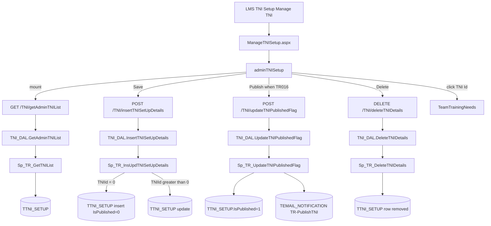
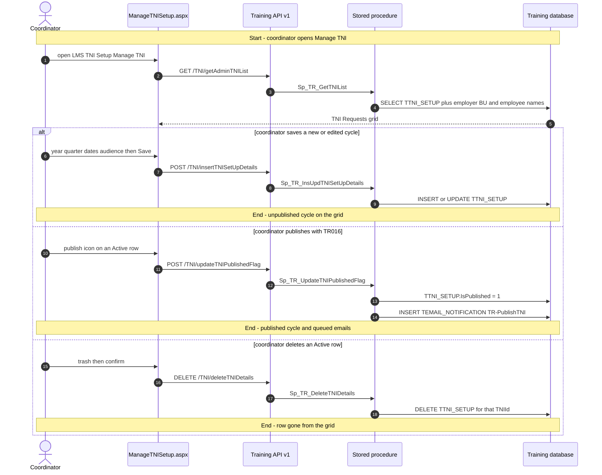
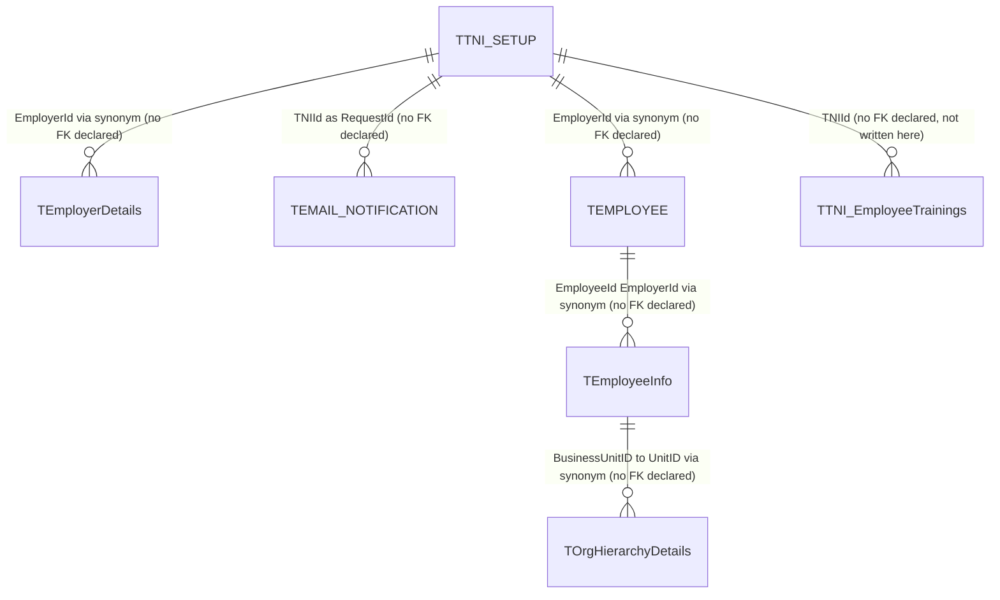

# Manage TNI

## Overview

An LMS coordinator needs a window in which employees (and then their managers) can say what training they need this year. They open **LMS → TNI Setup → Manage TNI** and create a **TNI cycle**: pick the organisation (and optionally business units or named employees), the year, one or more quarters, a date the cycle stays **Active for Employees**, and a later date it stays **Active for Managers**. Save writes an unpublished row. Until someone with claim `TR016` clicks the publish icon, nobody is invited.

Publish flips the cycle to published and queues a `TR-PublishTNI` email to every in-scope active employee. After that, employees submit topics against this cycle (Employee TNI / Team Training Needs — not this page). The grid labelled **TNI Requests** is every cycle for the organisations the coordinator can see. Clicking a TNI Id opens Team Training Needs for that cycle. Edit and delete are offered only while the cycle is still **Active** (manager date has not passed). Sibling left-nav item **Manage Goal Setting** is a different page (hour targets), not this one.

**Who's involved:**

- **LMS coordinator / admin** — creates, edits, deletes, and (with `TR016`) publishes cycles. Organisation pickers appear when `roleId === 1` or claim `TR022` (global access).
- **Employee** — not a user of this screen. They receive the publish email and later submit needs against the cycle.
- **Manager** — also not a user of this screen. Their later-closing date is the `ManagerSubmitTill` column set here.

There is **no** `llm-wiki/domain` lifecycle page for LMS. Table names come from `llm-wiki/reference/tables/training.md` and `llm-wiki/architecture/module-catalog.md` (the `Training` satellite database). `TTNI_SETUP` declares **no foreign keys**. This page is the application call chain those catalogs do not cover.

Sibling left-nav items **Trainings**, **Reports**, and **Calendar** share the same React bundle but are separate menu pages. **Manage Goal Setting** is the other child under **TNI Setup**.

## Workflow

`IsActive` on the grid is **not** a column: `Sp_TR_GetTNIList` sets it to Active when `ManagerSubmitTill` is still on or after UTC today, otherwise InActive. `IsPublished` is Yes/No from `TTNI_SETUP.IsPublished`. New rows start unpublished (`0`). The SPA blocks publish when another **published and still Active** cycle for the same employer already covers the same employees or business units.

## Request journey

The coordinator request that creates the cycle is **Save**. **Publish** is a second request on the same screen: same actor, different terminal state (emails queued). Delete is the third write.

Employees submitting topics against the published cycle is a different screen (`TeamTrainingNeeds` / Employee TNI), not this menu item.

## Entry points

> `ManageTNISetup.aspx` is the live **LMS → TNI Setup → Manage TNI** shell. It loads the same Training React bundle as Trainings / Reports / Calendar (`TrainingBuildAssets`). `RouteConstants.MANAGE_TNI_SETUP` is `/HRM/Training/ManageTNISetup.aspx` and maps to `adminTNISetup`. The route is **not** wrapped in `Authorization([...])`; publish is gated in the SPA by `TR016`, and the organisation pickers by `roleId === 1` or `TR022`. `managerTNI.js` (`TNI_MANAGE_TEAM_NEEDS` / TeamTNIDetails) is the manager team-needs page, not this menu item. `trainingGoalList.js` is **Manage Goal Setting**.

| UI page / route | Purpose |
|---|---|
| `/HRM/Training/ManageTNISetup.aspx` | LMS → TNI Setup → Manage TNI. Hidden fields stamp employee/employer/role for the SPA. Hosts the cycle form and TNI Requests grid. |
| `/HRM/Training/TeamTrainingNeeds` | Opened when the coordinator clicks a TNI Id (`state.TNIId`, `CanIEdit: false`). Employee/manager submissions for that cycle. |

`RouteConstants.ADMIN_TNI_LIST` (`/HRM/Training/TNIList`) has no `<Route>` in `routes.js`.

## Code → database call chain

Live SPA constants are **v1** (`/TNI/…`, `/Employee/…`, `/common/…`, `/training/…`). The v3 twins in `apiURLConstants.js` sit inside a block comment (`/*` at line 504 through `*/` at line 750), the same fence already noted on the Calendar and Reports guides.

There is **no BLL** on the Manage TNI writes. `TNIController` calls `TNI_DAL` directly for list, insert/update, publish, and delete.

| Entry point | DAL / BLL method (`file:line`) | Stored procedure |
|---|---|---|
| Page load (TNI Requests grid) | `GetAdminTNIList` (`TNI_DAL.js:165`) via `TNIController.js:82` | `Sp_TR_GetTNIList` |
| Save (create or edit cycle) | `InsertTNISetUpDetails` (`TNI_DAL.js:86`) via `TNIController.js:40` | `Sp_TR_InsUpdTNISetUpDetails` |
| Publish icon | `UpdateTNIPublishedFlag` (`TNI_DAL.js:112`) via `TNIController.js:51` | `Sp_TR_UpdateTNIPublishedFlag` |
| Delete confirm | `DeleteTNIDetails` (`TNI_DAL.js:210`) via `TNIController.js:115` | `Sp_TR_DeleteTNIDetails` |
| Org picker (role 1 / `TR022`) | `GetGlobalAccessEmployerList` (`employeeDAL.js:194`) via `employeeController.js:105` | `SP_GetGlobalAccessEmployerList` (Training synonym → core HRMS) |
| Employee chips / edit hydrate | `GetEmployeeDetails` (`employeeDAL.js:49`) via `employeeController.js:19` | `Sp_TR_AllSearchEmployee` |
| Business-unit tree (edit hydrate) | `ViewCostCenterDetails` (`employeeDAL.js:33`) via `employeeController.js:29` | `Sp_TR_GetUnitNames` |
| Business-unit tree (create) | `GetOrganisationHierarchy` (`commonDAL.js:87`) via `commonController.js:45` | `sp_GetOrganisationHierarchy` (core HRMS; DAL uses the `"core"` connection) |
| Overlap check vs already-notified employees | `getEmailNotificationList` (`trainingDAL.js:2004`) via `trainingController.js:936` | `USP_Email_Notification_List` (`ModulePageName = TR-PublishTNI`) |

v3 `TNIController_v3.js` still exists (`GetAdminTNIList` gated by `SP_Employer_CustNo_isValid`; insert/publish/delete are **not**). This page does not call v3 while the v3 constants remain commented.

## API endpoints

The Training Node app mounts three generations (`/api/TNI`, `/api/v2/TNI`, `/api/v3/TNI`). This feature's live constants are **v1**. There is no WebForms postback DAL — `ManageTNISetup.aspx.cs` only stamps session and logs activity `ManageTNISetup` (412). Base path is `/api` (`app.js` → `routeIndex.js`). v1 `authMiddleware.js` does **not** currently verify JWT (the `jwt.verify` block is commented; it always `next()`).

| Verb | Route | Parameters | Purpose | Source |
|---|---|---|---|---|
| `GET` | `/TNI/getAdminTNIList` | query `EmployerId` (int, required), `EmployerIds` (comma list, optional — DAL treats falsy as null and the proc then uses `EmployerId`) | TNI Requests grid | `TNIController.js:82` |
| `POST` | `/TNI/insertTNISetUpDetails` | body `TNIId` (int, `0` insert / else update), `Year` (int, required), `Quarter` (array posted from the SPA, bound as `varchar(50)`), `openTill` (datetime, employee window), `ManagerSubmitTill` (datetime, manager window), `CreatedBy` (int), `EmployerId` (int, logged-in employer), `EmployerIds` (comma list of selected orgs), `BusinessUnitIds` (comma list or null), `EmployeeIDs` (comma list or null) | Create or edit a cycle | `TNIController.js:40` |
| `POST` | `/TNI/updateTNIPublishedFlag` | body `TNIId` (int, required), `UpdatedBy` (int, required), `BusinessUnitIds` (comma list or null), `EmployeeIds` (comma list or null) | Publish; queue `TR-PublishTNI` emails to in-scope active employees | `TNIController.js:51` |
| `DELETE` | `/TNI/deleteTNIDetails` | query `TNIId` (int, required) | Hard-delete the `TTNI_SETUP` row | `TNIController.js:115` |
| `GET` | `/Employee/GetGlobalAccessEmployerList` | query `employeeId` (int, required) | Organisations for the form and grid filter | `employeeController.js:105` |
| `GET` | `/Employee/GetEmployeeDetails` | query `EmployeeId`, `EmployerId`, `SearchKey`, `SearchType` (`A` here), `CountryId` | Employee list used to hydrate chips on edit | `employeeController.js:19` |
| `GET` | `/Employee/ViewCostCenterDetails` | query `employerId`, `employeeId`, `viewType` (empty string here) | Cost-center rows used to hydrate BU badges on edit | `employeeController.js:29` |
| `GET` | `/common/getOrganisationHierarchy` | query `EmployerId` (int, required) | BU tree for create | `commonController.js:45` |
| `GET` | `/training/getEmailNotificationList` | query `EmployerId` (int, required), `ModuleName` (`TR-PublishTNI`) | Overlap check against employees already queued a publish email | `trainingController.js:936` |

Required form fields in the SPA before Save: organisation, year, at least one quarter, employee date, manager date. The SPA also rejects Save when the employee date is not earlier than the manager date, or when year/quarter plus audience overlaps another cycle on the current grid.

## Stored procedures & tables involved

> Live cycle data is **`TTNI_SETUP`** in the Training database. List/publish also read core-HRMS employee and org synonyms. **`Sp_TR_InsertTNISubmitReminder`** is a reminder job against published cycles; this SPA never calls it. **`TTNI_EmployeeTrainings`** holds employee/manager topic rows for a cycle and is not read or written by Manage TNI (the Team Training Needs hop is).

| Object | File path | Purpose | llm-wiki |
|---|---|---|---|
| `TTNI_SETUP` | `HRMS-DATABASE/HRMS-TRAINING/TABLES/TTNI_SETUP.sql` | One cycle per insert (per selected employer). `TNIId` IDENTITY, no PRIMARY KEY and no FK in the script. `Quarter` is `varchar(50)`. `BusinessUnitIds` / `EmployeeIDs` are comma lists or null (null = whole employer). | `llm-wiki/reference/tables/training.md` |
| `TEMAIL_NOTIFICATION` | `…/TEMAIL_NOTIFICATION.sql` | Publish inserts `ModulePageName = TR-PublishTNI`, `NotificationType = NOTIFICATIONONLY`, `RequestId = TNIId`, `Status = N`. | same |
| `TEmployerDetails` | `HRMS-DATABASE/HRMS-TRAINING/SYNONYMS/TEmployerDetails.sql` | Organisation name on the grid. Synonym to core `HRM-CL-Prod`. | core employer in `llm-wiki/reference/tables/hrms.md` |
| `TEMPLOYEE` | `…/SYNONYMS/TEMPLOYEE.sql` | Active employees for CustomEmployees and publish audience. | same |
| `TEmployeeInfo` | `…/SYNONYMS/TEmployeeInfo.sql` | Names / business-unit id for those employees. | same |
| `TOrgHierarchyDetails` | `…/SYNONYMS/TOrgHierarchyDetails.sql` | Unit names for CustomBUs. | same |
| `TTNI_EmployeeTrainings` | `…/TABLES/TTNI_EmployeeTrainings.sql` | Employee-proposed topics for a cycle. `TNIId` has no FK. Not on this page's write path. | `llm-wiki/reference/tables/training.md` |
| `Sp_TR_GetTNIList` | `HRMS-DATABASE/HRMS-TRAINING/STOREPROCEDURE/Sp_TR_GetTNIList.sql` | Admin grid, including derived `IsActive` / `IsPublished` and concatenated CustomBUs / CustomEmployees. | — |
| `Sp_TR_InsUpdTNISetUpDetails` | `…/Sp_TR_InsUpdTNISetUpDetails.sql` | Insert one row per id in `EmployerIds` when `TNIId = 0`; else update by `TNIId` + `EmployerId`. | — |
| `Sp_TR_UpdateTNIPublishedFlag` | `…/Sp_TR_UpdateTNIPublishedFlag.sql` | Set `IsPublished = 1`; queue emails to active employees in the BU and/or named-employee audience (whole employer when both are null). | — |
| `Sp_TR_DeleteTNIDetails` | `…/Sp_TR_DeleteTNIDetails.sql` | `DELETE TTNI_SETUP WHERE TNIId = @pTNIId`. Does not touch employee trainings or emails. | — |
| `USP_Email_Notification_List` | `…/USP_Email_Notification_List.sql` | Overlap helper: `TEMAIL_NOTIFICATION` for `TR-PublishTNI`. | — |
| `SP_GetGlobalAccessEmployerList` | Training synonym → `HRMS-DATABASE/HRMS/STOREPROCEDURE/` | Org dropdown. | — |
| `sp_GetOrganisationHierarchy` | `HRMS-DATABASE/HRMS/STOREPROCEDURE/sp_GetOrganisationHierarchy.sql` | BU tree XML (core connection). | — |
| `Sp_TR_GetUnitNames` | `HRMS-DATABASE/HRMS-TRAINING/STOREPROCEDURE/Sp_TR_GetUnitNames.sql` | Cost centers for edit hydrate. | — |
| `Sp_TR_InsertTNISubmitReminder` | `…/Sp_TR_InsertTNISubmitReminder.sql` | Scheduler reminder for published cycles still inside `OpenTill`. Not called from this SPA. | — |
| `TCLAIM` / `TCLAIM_ASSIGNMENT` | Training DB | LMS claims. `TR016` is publish on this page; `TR017` is Manage Goal Setting; `TR022` is global org access. | same |

## Table relationships

Declared FKs are taken from each table's `CREATE TABLE`. `TTNI_SETUP` has none — edges below are the joins the live procedures actually use, labelled as such rather than invented.

## Known gaps

- **No SystemModel-2 page** for Manage TNI, and **no** `llm-wiki/domain` lifecycle page — behaviour above is from SourceCode + procedure scripts. `TTNI_SETUP` has IDENTITY `TNIId` but no PRIMARY KEY and no FK in the table script.
- **SPA talks v1, not v3.** TNI URLs in the v3 block of `apiURLConstants.js` are commented out. v1 `authMiddleware.js` has JWT verification commented out. v3 insert/publish/delete still skip the `SP_Employer_CustNo_isValid` gate that v3 list uses.
- **First grid load is current employer only.** `loadAllAdminTrainingList` runs on mount before `getOrgList` fills `allEmployerIds`. The DAL then passes null `EmployerIds` and `Sp_TR_GetTNIList` scopes to `EmployerId`. Changing `allEmployerIds` does not reload the grid; the organisation multi-select only filters `originalGridData` client-side.
- **Delete is a hard delete of `TTNI_SETUP` only.** It does not remove `TTNI_EmployeeTrainings` or `TEMAIL_NOTIFICATION` rows for that `TNIId`. Published Active cycles can still be deleted from the grid.
- **`IsActive` follows the manager date**, not the employee date. A cycle can be past `OpenTill` (employees closed) and still show Active with edit/publish/delete while `ManagerSubmitTill` is in the future.
- **`Sp_TR_GetTNIList` CustomBUs** when `EmployeeIDs` is set and `BusinessUnitIds` is null still `STRING_SPLIT`s `BusinessUnitIds` (null), so the BU column can be empty for employee-only cycles.
- **Publish overlap dead branch** in `adminTNISetup.js`: the `BusinessUnitIds == null && EmployeeIDs == null` arm then tests `EmployeeIDs !== null`.
- **`Sp_TR_InsertTNISubmitReminder`** and notification-count procs read `TTNI_SETUP` but are not on this page's call chain. **`ADMIN_TNI_LIST`** (`/HRM/Training/TNIList`) has no route.
- **`managerTNI.js` / TeamTNIDetails** and **Manage Goal Setting** (`trainingGoalList.js`) are sibling TNI surfaces, not this menu item. Clicking TNI Id goes to **TeamTrainingNeeds**, which is also not a left-nav child of TNI Setup.
- `ManageTNISetup.aspx` `CodeBehind` attribute still says `ManagePermissions.aspx.cs`; `Inherits` and the `.cs` file are `ManageTNISetup`.

## Reference

Confidence is **medium**: Manage TNI was traced to v1 `TNI_DAL` `file:line` and the four `Sp_TR_*` TNI setup procedures, whose table lists come from the procedure scripts. There is no domain `erDiagram` to reuse; relationships are the joins those scripts use (no declared FKs on `TTNI_SETUP`). The v1-vs-v3 live-path finding is from the current `apiURLConstants.js` comment fences.

### SourceCode

- `HRMS.Web/HRMS.Web/HRM/Training/ManageTNISetup.aspx` (+ `.cs`)
- `HRMS.Web/HRMS.Web/HRM/Training/Areas/routes.js`
- `HRMS.Web/HRMS.Web/HRM/Training/Areas/TNI/Containers/adminTNISetup.js`
- `HRMS.Web/HRMS.Web/HRM/Training/Areas/TNI/Containers/employeeTrainingNeeds.js` (TNI Id hop)
- `HRMS.Web/HRMS.Web/HRM/Training/Common/apiURLConstants.js`, `routeConstants.js`, `claimConstants.js`
- `HRMS.Web/HRMS.Web/HRM/UserManual/Areas/HTMLPages/manage-tni.html`
- `HRMS.Training/HRMS.Training.WebAPI.Node/app.js`, `Routes/routeIndex.js`
- `HRMS.Training/HRMS.Training.WebAPI.Node/Routes/TNIRoutes.js`, `employeeRoutes.js`, `commonRoutes.js`, `trainingRoutes.js`
- `HRMS.Training/HRMS.Training.WebAPI.Node/Controllers/TNIController.js`, `employeeController.js`, `commonController.js`, `trainingController.js`
- `HRMS.Training/HRMS.Training.WebAPI.Node/Core/DataAccessLayer/TNI_DAL.js`, `employeeDAL.js`, `commonDAL.js`, `trainingDAL.js`
- `HRMS.Training/HRMS.Training.WebAPI.Node/Middlewares/authMiddleware.js`
- v3 twins (not the live SPA path): `TNIRoutes_v3.js`, `TNIController_v3.js`, `TNI_DAL_v3.js`

### TDG HRMS DB

- `llm-wiki/architecture/module-catalog.md` — `HRMS-TRAINING` / database `Training`
- `llm-wiki/reference/tables/training.md` — `TTNI_SETUP`, `TTNI_EmployeeTrainings`, `TEMAIL_NOTIFICATION` (no domain lifecycle page to reuse; `TTNI_SETUP` Depends on is empty)
- `llm-wiki/glossary/acronyms.md` — TNI = Training Needs Identification
- `HRMS-DATABASE/HRMS-TRAINING/TABLES/TTNI_SETUP.sql`, `TEMAIL_NOTIFICATION.sql`, `TTNI_EmployeeTrainings.sql`
- `HRMS-DATABASE/HRMS-TRAINING/SYNONYMS/TEmployerDetails.sql`, `TEMPLOYEE.sql`, `TEmployeeInfo.sql`, `TOrgHierarchyDetails.sql`
- `HRMS-DATABASE/HRMS-TRAINING/STOREPROCEDURE/Sp_TR_GetTNIList.sql`, `Sp_TR_InsUpdTNISetUpDetails.sql`, `Sp_TR_UpdateTNIPublishedFlag.sql`, `Sp_TR_DeleteTNIDetails.sql`, `USP_Email_Notification_List.sql`, `Sp_TR_InsertTNISubmitReminder.sql` (unused by this SPA)
- `HRMS-DATABASE/HRMS/STOREPROCEDURE/sp_GetOrganisationHierarchy.sql`, `SP_GetGlobalAccessEmployerList.sql`
