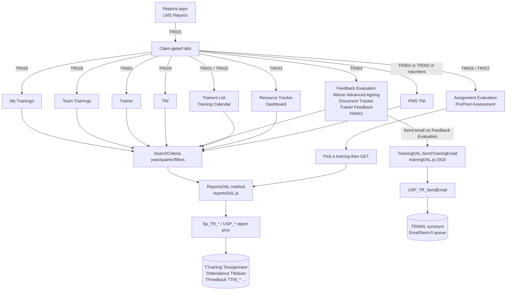
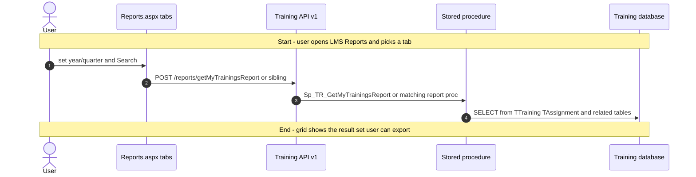
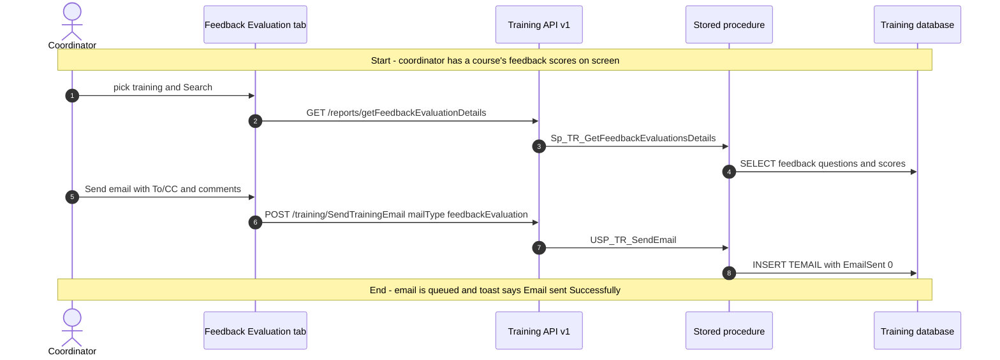

# Reports

## Overview

An LMS coordinator needs evidence that this quarter's courses actually ran — who attended, who waived, who finished the quiz, how trainers were rated, whether TNI needs were met. They open **LMS → Reports**, land on a tabbed page, set year/quarter (and usually a course, organisation, or business unit), and click Search. The grid that comes back is the report: rows they can sort, export to Excel, or (on Feedback Evaluation) turn into a PDF and email to the trainers.

An employee with only the My Trainings report claim sees a much smaller page: their own enrolment history, scores, and attendance. A manager with the Team Trainings claim sees the same shape of grid for reportees. A trainer using the Trainer tab sees the courses they delivered. Most of the remaining tabs — Advanced Report, Ageing, Document Tracker, Waiver, Trainers List, Training Calendar, Trainer Feedback, Resource Tracker, Dashboard, History/Audit Log — are coordinator/admin work (`TR003` or a dedicated report claim).

Nothing on this page creates a course or changes an assignment. The one write is **Feedback Evaluation → Send email**, which queues a row in `TEMAIL` so trainers get the scores. Grid column layouts can be saved per user via the shared grid-config API; that is layout, not LMS data.

**Who's involved:**

- **Employee** — My Trainings tab (`TR030`); Trainer tab is also shown when they have My Trainings (`TR001`).
- **Manager** — Team Trainings (`TR028`); PMS TNI tab if they have reportees or `TR002`.
- **LMS coordinator / admin** — page itself (`TR021`); most remaining tabs via Manage Trainings (`TR003`) or dedicated claims (`TR026`–`TR033`).
- **Trainer** — recipient of the Feedback Evaluation email; data comes from `TTrainers` / `TFeedback`.

There is **no** `llm-wiki/domain` lifecycle page for LMS. Table names and declared FKs come from `llm-wiki/reference/tables/training.md` and `llm-wiki/architecture/module-catalog.md` (the `Training` satellite database). This page is the application call chain those catalogs do not cover.

Sibling left-nav items **Trainings**, **TNI Setup**, and **Calendar** share the same React bundle but are separate menu pages.

## Workflow

`viewType` on TNI / Trainer / PMS TNI is **A** (admin, claim `TR008`), **M** (manager, `TR002`), or **E** (employee). Resource Tracker and Dashboard share one endpoint; the body field `ReportType` is `Detail` vs `Summary` and picks `USP_Resource_Tracker_Report` or `USP_Dashboard_Report`.

## Request journey

Two different requests live on this screen. The everyday request is **running a report** (it ends as a SELECT result in the grid). The **coordinator** request that actually writes a row is emailing Feedback Evaluation scores (it ends on `TEMAIL`).

### Employee or coordinator — run a report

Other tabs follow the same start and end; only the route and procedure change (see the call-chain table). Assignment Evaluation and Pre/Post Assessment are GETs that take a `trainingId` instead of a SearchCriteria POST.

### Coordinator — email Feedback Evaluation scores

## Entry points

> `Reports.aspx` is the live **LMS → Reports** shell. The SPA route is `RouteConstants.MANAGE_REPORTS` (`/HRM/Training/Reports.aspx`), wrapped in `Authorization([TR021])`. Five older React Router paths (`ResourceTrackerReport`, `TrainingEvaluationReport`, `FeedbackAnalysisTrackerReport`, `FeedbackEvaluationReport`, `TrainingWaiverTrackerReport`) are still registered on the same bundle; they are **not** left-nav items. Feedback Evaluation and Training Waiver also exist as tabs on this page. `Reports.aspx.cs` only copies session into hidden fields and logs `ActivityDescription.LMSReports`.

| UI page / route | Purpose |
|---|---|
| `/HRM/Training/Reports.aspx` | LMS → Reports. Tabs listed below. Hidden fields stamp employee/employer/role for the SPA. |
| Tab **My Trainings** | Employee's own enrolments, scores, attendance (`TR030`). |
| Tab **Team Trainings** | Reportees' training status (`TR028`). |
| Tab **Feedback Evaluation** | Per-course feedback scores; PDF/export; send email (`TR003`). |
| Tab **Training Waiver** | Who waived which session (`TR003`). |
| Tab **Advanced Report** | Wide operational grid plus post-training evaluation modal (`TR003`). |
| Tab **TNI** | Training-needs identification vs delivered courses (`TR029`). |
| Tab **Trainer** | Courses the logged-in person delivered (`TR001`). |
| Tab **Ageing** | How long assignments have been open (`TR003`). |
| Tab **Document Tracker** | Who previewed which content (`TR003`). |
| Tab **PMS TNI** | Appraisal-cycle TNI vs LMS delivery (`TR003` or `TR002` or `user.hasReportees`). |
| Tab **Assignment Evaluation** | Homework-style assignment scores (`TR026`). |
| Tab **Pre/Post Assessment** | Pre/post assessment answers (`TR027`). |
| Tab **Trainers List** | Trainers on selected courses (`TR031`). |
| Tab **Training Calendar** | Session calendar extract (`TR032`). |
| Tab **Trainer Feedback** | Feedback questions aimed at trainers (`TR003`). |
| Tab **Resource Tracker** | Per-employee hour/attendance detail (`TR033`, `ReportType=Detail`). |
| Tab **Dashboard** | Summary charts/grid (`TR033`, `ReportType=Summary`). |
| Tab **History/Audit Log Report** | Changes to trainers, sessions, documents (`TR003`). |
| `/HRM/Training/TrainingEvaluationReport` | Standalone Training Evaluation grid (not a tab). |
| `/HRM/Training/FeedbackAnalysisTrackerReport` | Standalone Feedback Analysis Tracker (not a tab). |
| `/HRM/Training/ResourceTrackerReport` | Older resource-tracker page calling `Sp_TR_GetResourceTrackerList` (not the TR033 tab). |

## Code → database call chain

Live Training API calls for this page go through **v1** (`apiURLConstants.js` un-commented `/reports/…` keys). The v3 `/v3/reports/…` block in the same file is wrapped in `/* … */` (lines 504–750) and is not what the SPA calls. JWT on the v1 `authMiddleware` is also commented out — the handler just calls `next()`. Call mechanism is **mssql** `request().execute(procName)` against the Training connection pool.

| Entry point | DAL / BLL method (`file:line`) | Stored procedure |
|---|---|---|
| My Trainings tab Search | `ReportsDAL.GetMyTrainingsReport` (`reportsDAL.js:172`) | `Sp_TR_GetMyTrainingsReport` |
| Team Trainings tab Search | `GetTeamTrainingsReport` (`reportsDAL.js:194`) | `Sp_TR_GetTeamTrainingsReport` |
| Feedback Evaluation Search | `GetFeedbackEvaluationDetails` (`reportsDAL.js:98`) | `Sp_TR_GetFeedbackEvaluationsDetails` |
| Feedback Evaluation Send email | `TrainingDAL.SendTrainingEmail` (`trainingDAL.js:1916`) | `USP_TR_SendEmail` |
| Training Waiver Search | `GetTrainingWaiverTrackerDetails` (`reportsDAL.js:122`) | `Sp_TR_GetTRWaiverTrackerDetails` |
| Advanced Report Search | `GetAdvanceReportDetails` (`reportsDAL.js:144`) | `Sp_TR_GetAdvanceReportDetails` |
| TNI Search | `GetTNIReport` (`reportsDAL.js:217`) | `Sp_TR_GetTNIReports` |
| Trainer Search | `GetTrainerReport` (`reportsDAL.js:285`) | `Sp_TR_GetTrainerReport` |
| Ageing Search | `getAegingReport` (`reportsDAL.js:306`) | `sp_TrainingAgingReports` |
| Document Tracker Search | `GetDocumentPreviewReport` (`reportsDAL.js:330`) | `Sp_TR_GetDocumentPreviewReport` |
| PMS TNI Search (live tab) | `GetPMSTNIReportNew` (`reportsDAL.js:257`) | `sp_tr_getPmsTniReport` |
| Assignment Evaluation Search | `GetAssignmentEvaluationReport` (`reportsDAL.js:353`) | `Sp_TR_GetAssignmentEvaluationsDetails` |
| Pre/Post Assessment Search | `GetPreAndPostAssesmentReport` (`reportsDAL.js:369`) | `Sp_TR_GetPrePostEvaluationsDetails` |
| Trainers List Search | `GetTrainersListReport` (`reportsDAL.js:405`) | `USP_TR_Trainers_List_Report` |
| Training Calendar Search | `GetTrainingCalendarReport` (`reportsDAL.js:427`) | `USP_Training_Calender_Report` |
| Trainer Feedback Search | `GetTrainerFeedbackReport` (`reportsDAL.js:467`) | `USP_Trainer_Feedback_Report` |
| Resource Tracker tab (`ReportType=Detail`) | `getResourceTrackerAndDashboardReport` (`reportsDAL.js:446`) | `USP_Resource_Tracker_Report` |
| Dashboard tab (`ReportType=Summary`) | same method | `USP_Dashboard_Report` |
| History/Audit Log Search | `GetHistoryAuditReport` (`reportsDAL.js:487`) | `Sp_TR_HistoryLogReport` |
| Feedback Evaluation / Calendar / Trainers List training dropdown | `GetAllClassRoomTrainings` (`reportsDAL.js:15`) | `Sp_TR_GetAllTrainingsList` |
| Pre/Post, Assignment, Resource Tracker, Dashboard training dropdown | `GetAllTrainingsDetails` (`reportsDAL.js:388`) | `Sp_TR_GetAllTrainingsDetails` |
| Standalone Training Evaluation | `GetTrainingEvaluationReport` (`reportsDAL.js:48`) | `Sp_TR_GetTrainingEvaluationsDetails` |
| Standalone Feedback Analysis Tracker | `GetFeedbackAnalysisTrackerReport` (`reportsDAL.js:73`) | `Sp_TR_GetFeedbackAnalysisDetails` |
| Standalone old Resource Tracker | `GetResourceTrackerReport` (`reportsDAL.js:33`) | `Sp_TR_GetResourceTrackerList` |
| Grid column layout (most tabs) | common `getGridConfig` / `setGridConfig` | not a Training report proc |

`PMSTNIReports.js` still calls `GetPMSTNIReport` → `USP_RPT_GetPMSTNIReportDetails_New`, but that component is commented out of `reports.js`; the live tab is `PMSTNIReportsNew`.

## API endpoints

The Training Node app mounts three generations (`/api/reports`, `/api/v2/reports`, `/api/v3/reports`). The SPA's live constants for this feature are **v1** (`/reports/…`). There is no WebForms postback DAL — `Reports.aspx.cs` only stamps session. Base path is `/api` (`app.js` → `routeIndex.js`). Paths below are as the SPA calls them.

v1 `authMiddleware` does **not** currently verify JWT (the `jwt.verify` block is commented; it always `next()`). Employee id for My/Team/TNI/Trainer/Document reports is taken from the **request body** (`criteria.employeeId`), not from a token.

| Verb | Route | Parameters | Purpose | Source |
|---|---|---|---|---|
| `POST` | `/reports/getMyTrainingsReport` | body `employeeId`, `employerId`, `quarter`, `year`, `trainingName`, `category`, `trainingType`, `subCategory` (empty → null) | My Trainings grid | `reportsController.js:91` |
| `POST` | `/reports/getTeamTrainingsReport` | same plus `organization` | Team Trainings grid | `reportsController.js:103` |
| `GET` | `/reports/getFeedbackEvaluationDetails` | query `trainingId`, `employerIds` (DAL currently binds only `trainingId`) | Feedback Evaluation scores | `reportsController.js:55` |
| `POST` | `/training/SendTrainingEmail` | body `toEmployee`, `ccEmployee`, `mailDraft`, `mailType` (`feedbackEvaluation`), `employerId`, `employeeId`, `trainingName` | Queue feedback email | `trainingController.js:892` |
| `POST` | `/reports/getTrainingWaiverTrackerDetails` | body `employerId`, `quarter`, `year`, `trainingName`, `category`, `trainingType`, `subCategory`, `organization` | Waiver tracker | `reportsController.js:67` |
| `POST` | `/reports/getAdvanceReportDetails` | same plus `employeeId`, `designation`, `BUId`, `IsPostTrainingEval` | Advanced Report (returns full `recordsets`) | `reportsController.js:79` |
| `POST` | `/reports/getTNIReport` | body `quarter`, `year`, `employeeId`, `viewType` (`A`/`M`/`E`), `organization` | TNI report | `reportsController.js:115` |
| `POST` | `/reports/getTrainerReport` | body `quarter`, `year`, `employeeId`, `viewType`, `trainingType`, `organization` | Trainer report | `reportsController.js:151` |
| `POST` | `/reports/getAegingReport` | body `employerId`, `quarter`, `year`, `trainingName`, `category`, `trainingType`, `subCategory`, `designation`, `productType`, `organization` | Ageing | `reportsController.js:163` |
| `POST` | `/reports/getDocumentPreviewReport` | body `employeeId`, `employerId`, `quarter`, `year`, `trainingName`, `category`, `trainingType`, `subCategory`, `organization` | Document Tracker | `reportsController.js:175` |
| `POST` | `/reports/getPMSTNIReportNew` | body `quarter`, `year`, `category`, `subCategory`, `trainingTopic`, `BUId`, `appraisalCycle`, `employeeId`, `viewType`, `organization`, `IsPostTrainingEval` | Live PMS TNI tab | `reportsController.js:139` |
| `GET` | `/reports/getAssignmentEvaluationReport` | query `trainingId`, `EmployerIds` | Assignment Evaluation | `reportsController.js:187` |
| `GET` | `/reports/getPreAndPostAssesmentReport` | query `trainingId`, `AssessmentType`, `EmployerIds` | Pre/Post Assessment | `reportsController.js:199` |
| `POST` | `/reports/getTrainersListReport` | body `Organization`, `Year`, `Quarter`, `TrainingId`, `trainerEmpId`, `IsActive` | Trainers List | `reportsController.js:223` |
| `POST` | `/reports/getTrainingCalendarReport` | body `Organization`, `Year`, `Quarter`, `TrainingId` | Training Calendar | `reportsController.js:235` |
| `POST` | `/reports/getTrainerFeedbackReport` | body `Organization`, `Year`, `Quarter`, `TrainingId`, `TrainingType` | Trainer Feedback | `reportsController.js:259` |
| `POST` | `/reports/getResourceTrackerAndDashboardReport` | body `Organization`, `Year`, `BUIds`, `EmployeeIds`, `TrainingId`, `ReportType` (`Detail` or `Summary`) | Resource Tracker and Dashboard | `reportsController.js:247` |
| `POST` | `/reports/getHistoryAuditReport` | body `employerId`, `quarter`, `year`, `trainingNameM` (bound as `pTrainingId`), `category`, `trainingType`, `organization` | History/Audit Log | `reportsController.js:271` |
| `GET` | `/reports/getAllClassRoomTrainings` | query `employerId`, `employerIds` | Training dropdown (classroom-oriented list) | `reportsController.js:6` |
| `GET` | `/reports/getAllTrainingsDetails` | query `employerId`, `employerIds` | Training dropdown (all types) | `reportsController.js:211` |
| `POST` | `/reports/getTrainingEvaluationDetails` | SearchCriteria body | Standalone Training Evaluation | `reportsController.js:31` |
| `POST` | `/reports/getFeedbackAnalysisTracker` | SearchCriteria body plus `feedbackStartDate`, `feedbackEndDate` | Standalone Feedback Analysis | `reportsController.js:43` |
| `POST` | `/reports/getResourceTrackerList` | none | Standalone old Resource Tracker | `reportsController.js:19` |
| `POST` | `/reports/getPMSTNIReport` | body `quarter`, `year`, `employeeId`, `viewType`, `organization` | Dead tab (`PMSTNIReports.js`); proc file missing from DB repo | `reportsController.js:127` |

Lookup helpers used by `searchCriteria.js` (not report procs): `GET /Employee/GetGlobalAccessEmployerList`, `GET /common/GetTitle`, `GET /training/getAppraisalCycle`. Grid layout: `GET /common/getGridConfig`, `POST /common/setGridConfig`.

Constant `GET_TR_REPORT` (`/reports/GetReportResults`) has **no** matching route on `reportsRoutes.js` and no component caller.

v2/v3 twins of the table still exist on the server (`reportsRoutes_v2.js` / `reportsRoutes_v3.js`). v3 DAL uses `req.EID` for several reports and gates the two training-dropdown GETs with `SP_Employer_CustNo_isValid`; that is not the live SPA path.

## Stored procedures & tables involved

No domain lifecycle wiki exists for Training. Object purposes below are taken from the procedure/table scripts and from `llm-wiki/reference/tables/training.md` (mechanical catalog — descriptions there are inferred). `_DP`, `_History` siblings used only as report *sources* are in scope for History/Audit Log; dated snapshot objects are out of scope.

| Object | File path | Purpose | Wiki |
|---|---|---|---|
| `TTraining` | `HRMS-DATABASE/HRMS-TRAINING/TABLES/TTraining.sql` | Course header every report joins. No declared FKs. | `llm-wiki/reference/tables/training.md` |
| `TAssignment` | `…/TAssignment.sql` | Enrolment/completion row for My/Team/Ageing/Advanced. | same |
| `TTrainers` | `…/TTrainers.sql` | Trainer identity for Trainer / Trainers List / Calendar. | same |
| `TTrainingSession` | `…/TTrainingSession.sql` | Session dates for calendar, waiver, attendance. | same |
| `TAttendance` | `…/TAttendance.sql` | Session attendance. | same |
| `TWaiver` | `…/TWaiver.sql` | Waiver tracker. | same |
| `TFeedback` / `TFeedback_Emp` | `…/TFeedback.sql`, `TFeedback_Emp.sql` | Feedback Evaluation and Trainer Feedback. | same |
| `TTrainingDocumentPreview` | `…/TTrainingDocumentPreview.sql` | Document Tracker access counts. | same |
| `TTrainingDocuments` | `…/TTrainingDocuments.sql` | Content metadata joined from several reports. | same |
| `TAssessment` / `TQuestion` / `TQuestionOption` | `…/TAssessment.sql` (and siblings) | Pre/Post Assessment answers. | same |
| `TTrainingAssignment` / `TTrainingAssignmentEmp` / `TTrainingAssignmentEmpRatings` | `…/TTrainingAssignment.sql` (and siblings) | Assignment Evaluation. | same |
| `TOnlineTrainingCompletion` | `…/TOnlineTrainingCompletion.sql` | Online progress on Advanced / PMS TNI. | same |
| `TTrainingEvaluation` / `TEmployeeTrainingEvaluation` / `TEmployeeTrainingEvaluationQuestion` | `…/TTrainingEvaluation.sql` (and siblings) | Post-training evaluation on Advanced / PMS TNI. | same |
| `TRatingScaleTypes` / `TRatingScales` / `TEvaluator` / `TEvaluation` | `…/TRatingScaleTypes.sql` (and siblings) | Evaluation rating labels. | same |
| `TTNI_SETUP` / `TTNI_EmployeeTrainings` / `TTNI_EmployeeGoalSetup` / `TTNI_TrainingHourInfo` | `…/TTNI_SETUP.sql` (and siblings) | TNI report and Dashboard hour targets. | same |
| `TPMSTniRatings` | `…/TPMSTniRatings.sql` | PMS TNI ratings. | same |
| `TExternalTrainings` / `TMiscellaneousTrainings` | `…/TExternalTrainings.sql`, `TMiscellaneousTrainings.sql` | Hours rolled into Dashboard / Resource Tracker. No FK declared. | same |
| `TTrainingProductMapping` | `…/TTrainingProductMapping.sql` | Product filter on Ageing / Advanced. No FK declared. | same |
| `TLOOKUP` | `…/TLOOKUP.sql` | Category / type / topic labels. | same |
| `TTrainers_History` / `TTrainingSession_History` | `…/TTrainers_History.sql`, `TTrainingSession_History.sql` | History/Audit Log sources. | same |
| `TDOCUMENTS_HISTORY_Syn` | Training synonym | Document-change rows on History/Audit Log. | — |
| `TEMAIL` | `HRMS-DATABASE/HRMS-TRAINING/SYNONYMS/TEMAIL.sql` | Feedback Evaluation email queue (`EmailSent=0`). | core `TEMAIL` in `llm-wiki/reference/tables/hrms.md` |
| `TCLAIM` / `TCLAIM_ASSIGNMENT` | Training DB | LMS claims `TR001`–`TR036` (`TR021` is the Reports page). | `llm-wiki/reference/tables/training.md` |
| `Sp_TR_GetMyTrainingsReport` | `HRMS-DATABASE/HRMS-TRAINING/STOREPROCEDURE/` | My Trainings SELECT | — |
| `Sp_TR_GetTeamTrainingsReport` | same | Team Trainings SELECT | — |
| `Sp_TR_GetFeedbackEvaluationsDetails` | same | Feedback Evaluation SELECT (multiple recordsets) | — |
| `USP_TR_SendEmail` | same | INSERT `TEMAIL`; hard-CC talent-development mailbox when `EmailType=feedbackEvaluation` | — |
| `Sp_TR_GetTRWaiverTrackerDetails` | same | Waiver SELECT | — |
| `Sp_TR_GetAdvanceReportDetails` | same | Advanced Report (multiple recordsets including evaluators) | — |
| `Sp_TR_GetTNIReports` | same | TNI SELECT from `TTNI_SETUP` / `TTNI_EmployeeTrainings` | — |
| `Sp_TR_GetTrainerReport` | same | Trainer SELECT | — |
| `sp_TrainingAgingReports` | `SP_TrainingAgingReports.sql` | Ageing SELECT | — |
| `Sp_TR_GetDocumentPreviewReport` | same | Aggregates `TTrainingDocumentPreview` | — |
| `sp_tr_getPmsTniReport` | same | Live PMS TNI; also reads PMS synonyms `TPMS_EmployeeTrainingDetails`, `TPMSAppraisalCycles` | — |
| `Sp_TR_GetAssignmentEvaluationsDetails` | same | Assignment Evaluation | — |
| `Sp_TR_GetPrePostEvaluationsDetails` | same | Pre/Post Assessment | — |
| `USP_TR_Trainers_List_Report` | same | Trainers List | — |
| `USP_Training_Calender_Report` | same | Training Calendar (filename spelling) | — |
| `USP_Trainer_Feedback_Report` | same | Trainer Feedback | — |
| `USP_Resource_Tracker_Report` / `USP_Dashboard_Report` | same | Detail vs Summary | — |
| `Sp_TR_HistoryLogReport` | same | History/Audit Log | — |
| `Sp_TR_GetAllTrainingsList` / `Sp_TR_GetAllTrainingsDetails` | same | Training dropdowns | — |
| `Sp_TR_GetTrainingEvaluationsDetails` / `Sp_TR_GetFeedbackAnalysisDetails` / `Sp_TR_GetResourceTrackerList` | same | Standalone (non-tab) reports | — |

Core HRMS `TMTrainings` / `TEmployeeTrainingInfo` are **employee-master training history**, not this LMS Reports page. PMS tables `TPMS_EmployeeTrainingDetails` / `TPMSAppraisalCycles` are read through Training-DB synonyms on the PMS TNI tab.

## Table relationships

Declared FKs are taken from each table's `CREATE TABLE` (same edges as `llm-wiki/reference/tables/training.md` "Depends on"). Tables with no `FOREIGN KEY` are labelled as such rather than invented. History tables and PMS/TNI objects that reports only read are included when the live procs join them.

```mermaid
erDiagram
  TTraining ||--o{ TAssignment : "TrainingID (FK_TAssignment_TrainingID)"
  TTraining ||--o{ TTrainers : "TrainingId (FK_TTrainers_TrainingID)"
  TTraining ||--o{ TTrainingSession : "TrainingID (FK_TTrainingSession_TrainingID)"
  TTraining ||--o{ TAttendance : "TrainingId (FK_TAttendance_TrainingId)"
  TTraining ||--o{ TWaiver : "TrainingId (FK_TWaiver_TrainingId)"
  TTraining ||--o{ TFeedback : "TrainingId (FK_TFeedback_TrainingId)"
  TTraining ||--o{ TTrainingDocuments : "TrainingId (FK_TTrainingDocuments_TrainingID)"
  TTraining ||--o{ TAssessment : "TrainingId (FK_TAssessment_TrainingId)"
  TTraining ||--o{ TOnlineTrainingCompletion : "TrainingID (FK_TOnlineTrainingCompletion_TrainingID)"
  TTrainingSession ||--o{ TAttendance : "SessionId (FK_TAttendance_SessionId)"
  TTrainingSession ||--o{ TWaiver : "SessionID (FK_TWaiver_SessionID)"
  TFeedback ||--o{ TFeedback_Emp : "FeedbackID (FK_TFeedback_Emp_FeedbackID)"
  TAssessment ||--o{ TAssessmentEmp : "AssessmentID (FK_TAssessmentEmp_AssessmentID)"
  TTNI_EmployeeGoalSetup ||--o{ TTNI_TrainingHourInfo : "declared FK"
  TTraining ||--o{ TTrainingProductMapping : "TrainingId (no FK declared)"
  TTraining ||--o{ TTrainingEvaluation : "TrainingId (no FK declared)"
  TTraining ||--o{ TTrainingAssignment : "TrainingId (no FK declared)"
  TTraining ||--o{ TTrainingDocumentPreview : "TrainingId (no FK declared)"
  TTraining ||--o{ TQuiz : "TrainingId (no FK declared)"
  TTNI_SETUP ||--o{ TTNI_EmployeeTrainings : "TNI setup (no FK declared)"
  TTraining ||--o{ TTrainers_History : "TrainingId (no FK declared)"
  TTraining ||--o{ TTrainingSession_History : "TrainingId (no FK declared)"
```

## Known gaps

- **No SystemModel-2 page** for LMS Reports, and **no** `llm-wiki/domain` lifecycle page — behaviour above is from SourceCode + procedure scripts.
- **SPA talks v1, not v3.** `apiURLConstants.js` v3 report URLs are inside a block comment (`/*` at line 504 through `*/` at line 750). The sibling Trainings guide currently says the SPA is v3-only; that does not match this file as it sits today. v1 `authMiddleware.js` has JWT verification commented out.
- **`GetFeedbackEvaluationDetails`** takes `employerIds` on the query string but the v1 DAL method only passes `pTrainingId` into `Sp_TR_GetFeedbackEvaluationsDetails`.
- **`USP_RPT_GetPMSTNIReportDetails_New`** is still called from `GetPMSTNIReport` / `PMSTNIReports.js`, but that tab is commented out in `reports.js` and **no matching `.sql` file** exists under `HRMS-DATABASE/HRMS-TRAINING`.
- **`*New.js` report components** (`myTrainingReportsNew.js`, `AdvanceReportNew.js`, …) are not imported by `reports.js`. Several of them call `GET_*_REPORT_NEW` constants that do not exist on the live v1 object.
- **Standalone React routes** for Training Evaluation, Feedback Analysis Tracker, and the old Resource Tracker have no matching `.aspx` shell and are not LMS left-nav items. Whether anyone still deep-links them was not traced.
- **`GET_TR_REPORT` / `GetReportResults`** is a dead constant: no route, no caller.
- **`USP_Upcoming_Trainings_Report.sql`** exists in the DB repo and is not called from `reportsDAL.js`.
- **`Sp_TR_GetSurveyReportData`** is a Manage Survey report, not this page.
- **`TTrainingDocumentPreview`, `TTrainingEvaluation`, `TTrainingAssignment*`, TNI, and history tables** have no declared FKs to `TTraining` (same pattern as the Trainings guide).
- Core HRMS `TMTrainings` / `TEmployeeTrainingInfo` are a different "training" concept.

## Reference

Confidence is **medium**: every live tab was traced to a v1 DAL `file:line` and a named Training-DB procedure. Procedure bodies are large SELECTs (especially Advanced Report and PMS TNI); table lists come from those JOIN/FROM clauses rather than a domain `erDiagram` (none exists). The v1-vs-v3 live-path finding is from the current `apiURLConstants.js` comment fences.

### SourceCode

- `HRMS.Web/HRMS.Web/HRM/Training/Reports.aspx` (+ `.cs`)
- `HRMS.Web/HRMS.Web/HRM/Training/Areas/Reports/Container/reports.js`
- `HRMS.Web/HRMS.Web/HRM/Training/Areas/Reports/Components/*.js` (live tabs listed under Entry points)
- `HRMS.Web/HRMS.Web/HRM/Training/Areas/Reports/Components/searchCriteria.js`
- `HRMS.Web/HRMS.Web/HRM/Training/Areas/routes.js`, `Common/routeConstants.js`, `Common/apiURLConstants.js`, `Common/claimConstants.js`
- `HRMS.Training/HRMS.Training.WebAPI.Node/Routes/routeIndex.js`, `reportsRoutes.js`, `trainingRoutes.js`
- `HRMS.Training/HRMS.Training.WebAPI.Node/Controllers/reportsController.js`, `trainingController.js`
- `HRMS.Training/HRMS.Training.WebAPI.Node/Core/DataAccessLayer/reportsDAL.js`, `trainingDAL.js`
- `HRMS.Training/HRMS.Training.WebAPI.Node/Middlewares/authMiddleware.js`

### TDG HRMS DB

- `llm-wiki/architecture/module-catalog.md` — `HRMS-TRAINING` / database `Training`
- `llm-wiki/reference/tables/training.md` — table catalog and declared-FK "Depends on" list (no domain lifecycle page to reuse)
- `llm-wiki/glossary/acronyms.md` — TNI
- `HRMS-DATABASE/HRMS-TRAINING/STOREPROCEDURE/Sp_TR_GetMyTrainingsReport.sql`, `Sp_TR_GetTeamTrainingsReport.sql`, `Sp_TR_GetAdvanceReportDetails.sql`, `Sp_TR_GetTNIReports.sql`, `sp_tr_getPmsTniReport.sql`, `Sp_TR_HistoryLogReport.sql`, `USP_TR_SendEmail.sql`, and the other report procs named in the tables above
- `HRMS-DATABASE/HRMS-TRAINING/SYNONYMS/TEMAIL.sql`
