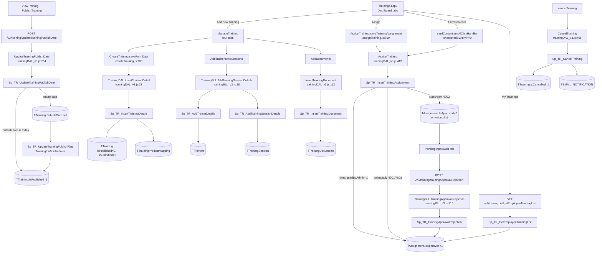
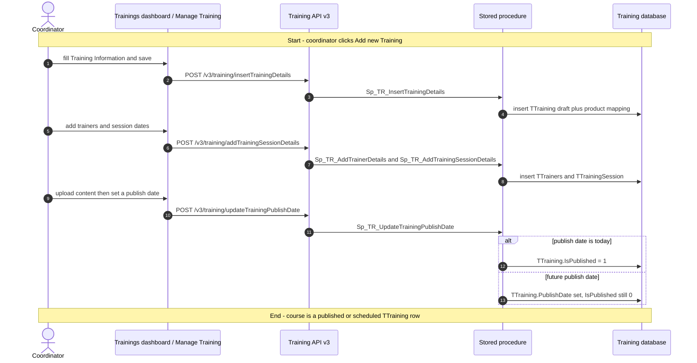
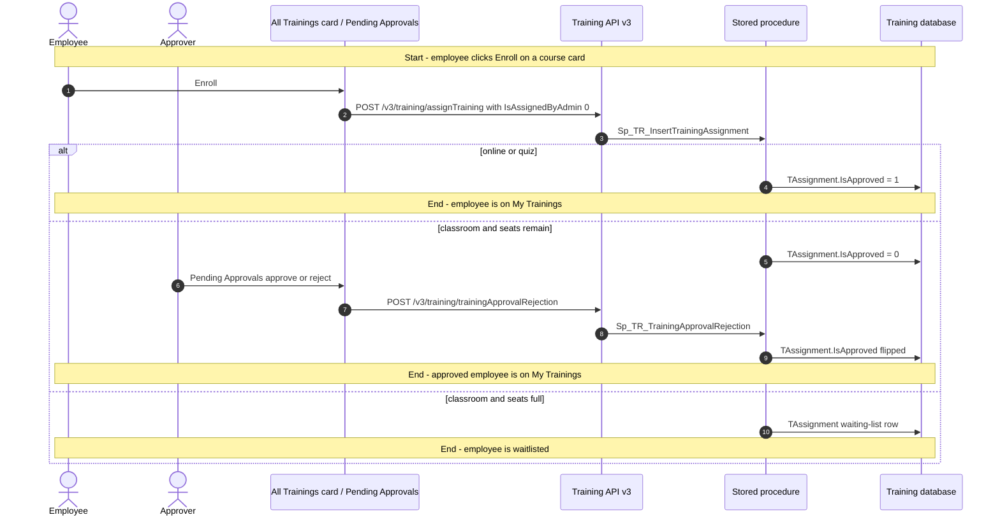

# Trainings

## Overview

An LMS coordinator needs a catalog of courses that employees can take this quarter — classroom sessions with a trainer in the room, self-paced online content, or a quiz-only check. They open **LMS → Trainings**, click **Add new Training**, and walk a four-tab wizard: title, type, skill, category, year/quarter, then trainers and session dates, then documents, then (optionally) an evaluation setup. Until they pick a **publish date**, the course is a draft that only the Manage Trainings tab can see.

On publish day the course becomes visible on **All Trainings** and **Suggested Trainings**. The coordinator can then **assign** named employees, roles, or a whole organisation; those people land on **My Trainings** already approved. Employees can also **enroll themselves** from a course card when enrollment is allowed: online and quiz courses auto-approve; classroom enrollments sit in **Pending Approvals** until a coordinator or manager signs off (or the seat limit is hit and the employee goes on a waiting list). After that the employee watches the content or attends the session, a trainer marks attendance, quizzes and pre/post assessments are scored, and optional feedback or a later evaluation closes the loop. A published course can still be **cancelled**, which emails everyone who was assigned.

**Who's involved:**

- **Employee** — sees My / All / Suggested Trainings, enrolls or unenrolls, takes online content, quizzes, assessments, assignments, and feedback.
- **Manager** — Team Trainings tab (claim `TR002`) and Pending Approvals for reportees' classroom nominations.
- **LMS coordinator / admin** — creates, publishes, assigns, cancels (claims `TR008` / `TR011` / `TR012`); Manage Trainings tab (`TR003`).
- **Trainer** — marked on the course; marks session attendance (`TR014`).

There is **no** `llm-wiki/domain` lifecycle page for LMS. Table names and declared FKs come from `llm-wiki/reference/tables/training.md` and `llm-wiki/architecture/module-catalog.md` (the `Training` satellite database). This page is the application call chain that those catalogs do not cover.

Sibling left-nav items **TNI Setup**, **Reports**, and **Calendar** share the same React bundle but are separate menu pages — they are not documented here.

## Workflow

Training type codes used on `TTraining.TrainingTypeCD` (and in `AppConstants.js`): **4001** Online, **4002** Classroom, **4003** Quiz. Insert stamps `CustomTrainingId` with prefix `O` (online/quiz) or `C` (classroom). `TAssignment.IsApproved` is **0** pending, **1** approved, **2** rejected.

## Request journey

Two different requests live on this screen. The **coordinator** request is creating and publishing a course (it ends on `TTraining`). The **employee** request is enrolling, which may need a classroom approval (it ends on `TAssignment`).

### Coordinator — create and publish a training

### Employee — enroll in a published training

Admin **Assign Training** is the same `assignTraining` POST with `IsAssignedByAdmin=1`; the procedure writes `TAssignment.IsApproved=1` immediately (no Pending Approvals hop).

## Entry points

> `Trainings.aspx` is the live LMS → Trainings shell. `Dashboard.aspx` in the same folder hosts the same React bundle but is **not** the route the SPA uses (`RouteConstants.TRAINING_DASHBOARD` is `/HRM/Training/Trainings.aspx`). Child screens (`/HRM/Training/ManageTraining`, `AssignTraining`, `ViewTraining`, …) are React Router paths on that same bundle, not separate WebForms pages. Sibling aspx files (`ManageTNISetup.aspx`, `Reports.aspx`, `TrainingCalendar.aspx`, `MasterQuestionBank.aspx`) load the identical bundle for other left-nav items.

| UI page / route | Purpose |
|---|---|
| `/HRM/Training/Trainings.aspx` | LMS → Trainings dashboard (Notifications, My / Suggested / Team / All / Manage Trainings, Pending Approvals, Training Requests, External, PMS TNI, Miscellaneous). Hidden fields stamp employee/employer/role for the SPA. |
| `/HRM/Training/ManageTraining` | Four-tab create/edit wizard (Information, Trainers & Sessions, Content, Evaluation). |
| `/HRM/Training/ViewTraining` | Read-only course view; publish/unpublish dialog (`TR012`). |
| `/HRM/Training/AssignTraining` | Assign employees / roles / BUs / all-org. |
| `/HRM/Training/FeedbackForm`, `/HRM/Training/ViewFeedbackDetails`, `/HRM/Training/ParticipantFeedback` | Employee and admin feedback. |
| `/HRM/Training/TrainingAttendance`, `/HRM/Training/ViewAttendance`, `/HRM/Training/ViewAttendanceOnlineAndQuiz` | Trainer mark-attendance and view. |
| `/HRM/Training/SessionWaiver` | Session waiver. |
| `/HRM/Training/AdHocTrainingPrograms`, `/HRM/Training/ViewAdHocTraining` | Ad-hoc training request (Training Requests tab). |
| `/HRM/Training/AddExternalTraining`, `/HRM/Training/EditExternalTraining` | External trainings tab. |
| `/HRM/Training/TakeAssignment`, `/HRM/Training/AssignmentUserListing` | Homework-style training assignments. |
| `/HRM/Training/DiscussionForum` | Discussion forum (button on the dashboard header). |
| `/HRM/Training/ParticipantTrainingEvaluation` | Participant evaluation form. |
| `/HRM/Training/Dashboard.aspx` | Same SPA host; unused by the React router. |

Tab visibility is claim-gated in `dashboard.js` (`TR001` My Trainings, `TR002` Team, `TR003`/`TR008` Manage + Add, `TR022` global access, `TR024` external, `TR025` PMS TNI, `TR035` organize/external add, `TR036` miscellaneous).

## Code → database call chain

All live Training API calls go through **v3** (`apiURLConstants.js` v3 block). JWT middleware sets `req.EID` from the token; several list GETs also send `EmployerId` and check `SP_Employer_CustNo_isValid` before running.

| Entry point | DAL / BLL method (`file:line`) | Stored procedure |
|---|---|---|
| SPA boot / `SetupUser` | `EmployeeDAL.GetUserSetupDetails` (`employeeDAL_v3.js:24`) | `Sp_TR_GetUserSetupDetails` |
| My Trainings tab | `TrainingListDAL.GetEmployeeTrainingList` (`trainingListDAL_v3.js:111`) | `Sp_TR_GetEmployeeTrainingList` |
| Team Trainings tab | `GetManagerTrainingList` (`trainingListDAL_v3.js:285`) | `Sp_TR_GetManagerTrainingList` |
| All Trainings tab | `GetAllTrainingList` (`trainingListDAL_v3.js:200`) | `Sp_TR_GetAllTrainingList` |
| Suggested Trainings tab | `GetSuggestedTrainingList` (`trainingListDAL_v3.js:241`) | `Sp_TR_GetSuggestedTrainingList` |
| Manage Trainings tab | `GetAllAdminTrainingList` (`trainingListDAL_v3.js:171`) | `Sp_TR_GetAllAdminTrainingList` |
| Pending Approvals tab | `GetPendingApprovalList` (`trainingListDAL_v3.js:307`) | `Sp_TR_GetPendingApprovalRequestList` |
| Training Requests tab | `GetAdhocTrainingList` (`trainingDAL_v3.js:1139`) | `Sp_TR_GetAdhocTrainingsList` |
| Create training save | `TrainingDAL.InsertTrainingDetail` (`trainingDAL_v3.js:33`) | `Sp_TR_InsertTrainingDetails` |
| Edit training save | `UpdateTrainingDetail` (`trainingDAL_v3.js:74`) | `Sp_TR_UpdateTrainingDetails` |
| Trainers & Sessions save | `TrainingBLL.AddTrainingSessionDetails` (`trainingBLL_v3.js:18`) → `AddTrainerDetails` / `AddTrainingSessionDetails` / `AddNominationAndFeedbackDetails` | `Sp_TR_AddTrainerDetails`, `Sp_TR_AddTrainingSessionDetails`, `Sp_TR_UPD_NOMINATION_FEEDBACK_DETAILS`, `Sp_TR_DeleteTrainingSessionDetails` |
| Upload content | `InsertTrainingDocument` (`trainingDAL_v3.js:112`) | `Sp_TR_InsertTrainingDocument` |
| Finish content tab | `UpdateTrainingSubmittedFlag` (`trainingDAL_v3.js:163`) | `Sp_TR_UpdateTrainingSubmittedFlag` |
| Publish dialog | `UpdateTrainingPublishDate` (`trainingDAL_v3.js:754`) | `Sp_TR_UpdateTrainingPublishDate` |
| Immediate publish / scheduler | `PublishTraining` (`trainingDAL_v3.js:736`) | `Sp_TR_UpdateTrainingPublishFlag` |
| Assign (admin) or Enroll (employee) | `AssignTraining` (`trainingDAL_v3.js:413`) | `Sp_TR_InsertTrainingAssignment` |
| Unenroll | `UnAssignTraining` (`trainingDAL_v3.js:448`) | `Sp_TR_UnenrollTraining` |
| Pending Approvals approve/reject | `TrainingBLL.TrainingApprovalRejection` (`trainingBLL_v3.js:316`) | `Sp_TR_TrainingApprovalRejection` |
| Cancel training | `CancelTraining` (`trainingDAL_v3.js:466`) | `Sp_TR_CancelTraining` |
| View course | `TrainingBLL.ViewTrainingDetails` (`trainingController_v3.js:340`) | `Sp_TR_ViewTrainingDetails` (+ `USP_TrainingAssignments`) |
| Mark attendance | `SubmitSessionAttendance` → `InsertAttendanceDetails` (`trainingDAL_v3.js:927`) | `Sp_TR_InsertAttendanceDetails` |
| Online progress | `InsertOnlineTrainingCompletion` (`trainingDAL_v3.js:609`) | `Sp_TR_InsertOnlineTrainingCompletion` |
| Quiz / assessment | `SubmitQuizDetails` / `SubmitEmployeeAssessment` | `Sp_TR_InsertEmployeeQuiz`, `Sp_TR_InsertEmployeeAssessment` |
| Feedback | `SubmitFeedbackDetails` | `Sp_TR_InsertFeedbackDetails` |
| Assignment email after assign | `POST /v3/notification/…` | `Sp_InsertNotificationDetails` (via `notificationDAL_v3.js`) |

Call mechanism is **mssql** `request().execute(procName)` against the Training connection pool (`connectionFactory.js` default database `"training"`). Core HRMS is a second pool used only when a procedure needs it.

## API endpoints

The Training Node app mounts three generations of the same routers (`/api/…`, `/api/v2/…`, `/api/v3/…`). The SPA's live constants are **v3 only** (v1 is leftover, v2 is commented out). Every v3 route below uses `authMiddleware_v3` (JWT in `Authorization` header or cookie; `req.EID` = employee id). There is no WebForms postback DAL for this feature — `Trainings.aspx.cs` only copies session into hidden fields.

Base path is `/api` (see `app.js` → `routeIndex.js`). Paths in the table are as the SPA calls them.

| Verb | Route | Parameters | Purpose | Source |
|---|---|---|---|---|
| `GET` | `/v3/employee/getUserSetupDetails` | query `roleId`, `EId` (employer); `EmpId` intended | Claims, lookups, survey button, certificate doc | `employeeRoutes_v3.js:8`. SPA v3 URL is missing `&` before `EmpId` — see Known gaps. |
| `GET` | `/v3/trainingList/getEmployeeTrainingList` | query `EId`, `Quarter`, `Year`, `TRType`, `Month`, `FromDate`, `ToDate`, `SortingType`, `SortingOrder`; employee from `req.EID` | My Trainings list | `trainingListController_v3.js:8` |
| `GET` | `/v3/trainingList/GetMgrTrainingList` | query `EId`, `Quarter`, `Year`, `ClrTR`, `IsOlTR`, `IsUpcomingTR`, `BusinessUnit`, `EmployerIds` | Team Trainings | `trainingListRoutes_v3.js:13` |
| `GET` | `/v3/trainingList/getAllTrainingList` | query `EID`, `Quarter`, `Year`, `ClrTR`, `IsOlTR`, `IsUpcomingTR`, `BusinessUnit`, `ProductIds`, `TrainingCategory`, `TrainingSubCategory`, `Month`, `FromDate`, `ToDate`, `SortingType`, `SortingOrder` | All Trainings | `trainingListController_v3.js:51` |
| `GET` | `/v3/trainingList/getSuggestedTrainingList` | query `EID`, `Quarter`, `Year`, `ClrTR`, `IsOlTR`, `IsUpcomingTR`, `SortingType`, `SortingOrder` | Suggested Trainings | `trainingListController_v3.js:69` |
| `GET` | `/v3/trainingList/getAllAdminTrainingList` | query `EID`, `Quarter`, `Year`, `ClrTR`, `IsOlTR`, `IsUpcomingTR`, `BusinessUnit`, `EmployerIds` | Manage Trainings | `trainingListController_v3.js:23` |
| `GET` | `/v3/trainingList/GetPendingApprovalList` | query `EID`, `Quarter`, `Year`, `ClrTR`, `IsOlTR`, `BusinessUnit`, `EmployerIds` | Pending Approvals | `trainingListRoutes_v3.js:14` |
| `GET` | `/v3/training/getTrainingDetails` | query `TRId`; employee from `req.EID` | Load wizard / card details | `trainingController_v3.js:8` |
| `GET` | `/v3/training/viewTrainingDetails` | query `TRId`, `EmployerId`; gated by `SP_Employer_CustNo_isValid` | View Training screen | `trainingController_v3.js:340` |
| `POST` | `/v3/training/insertTrainingDetails` | body `Title`, `TrainingTypeCD`, `SkillLevelCD`, `CategoryCD`, `Year`, `Quarter`, `TNITopicId`, `PreAssesmentRequired`, `PostAssesmentRequired`, `PreAssessCompleteBefore`, `PostAssessCompleteBefore`, `Description`, `CreatedBy`, `EmployerId`, `Duration`, `NoOfQuiz`, `Experience`, `BusinessUnit`, `TrainingSubCategory`, `ProductIds`, `IsRepetitive`, `TopicId`, `IsBackDatedTraining`, `EmployerIds`, `ReattemptAllowed`, `NumberOfReattempts` | Create course; returns new `TrainingId` | `trainingController_v3.js:20` |
| `POST` | `/v3/training/updateTrainingDetails` | same body plus `TrainingId` | Update draft/published header | `trainingController_v3.js:30` |
| `POST` | `/v3/training/addTrainingSessionDetails` | body `TrainingId`, `CreatedBy`, `TrainerDetails[]`, `SessionDetails[]`, nomination/feedback dates, `IsEnrollmentRequired` | Replace trainers + sessions in one transaction | `trainingController_v3.js:89` |
| `POST` | `/v3/training/insertTrainingDocument` | body `TrainingId`, `DocumentId`, `IsThumbnail`, `CreatedBy` | Attach content | `trainingController_v3.js:41` |
| `DELETE` | `/v3/training/deleteTrainingDocument` | query `DocId` | Remove content | `trainingController_v3.js:53` |
| `POST` | `/v3/training/updateTrainingSubmittedFlag` | body `TrainingId`, `downloadTrainingContent` | Mark content tab complete | `trainingController_v3.js` (`UpdateTrainingSubmittedFlag`) |
| `POST` | `/v3/training/updateTrainingPublishDate` | body `TrainingId`, `PublishDate`, `IsPublished` | Publish, schedule, or unpublish | `trainingController_v3.js:356` |
| `POST` | `/v3/training/publishTraining` | query `TRId` | Set `IsPublished=1` now (also scheduler with `0`) | `trainingController_v3.js:329` |
| `POST` | `/v3/training/assignTraining` | body `EmployerId`, `TrainingID`, `SelectedBUIds`, `SelectedEmployeeIds`, `SelectedRoleIds`, `IsTrainingManadatory`, `IsAssignedByAdmin`, `IsAssignToAllEmployees`, `SubmittedBy`, reminder fields, `IsPmsTniTraining`, `CoolingPeriodDays`, `RatingTypeId`, `TrainerIds`, `PMSEmployeeIds`, `ReTrainingEmployeeIds` | Admin assign **or** employee enroll | `trainingController_v3.js:157` |
| `POST` | `/v3/training/unAssignTraining` | body `TrainingID`, `EmployerId`; employee from `req.EID` | Unenroll | `trainingController_v3.js:169` |
| `POST` | `/v3/training/trainingApprovalRejection` | body `resourceDetails[]` (`TrainingId`, `EmployeeId`, `EmployerId`), `isApproval`, optional `Comments` | Approve/reject classroom nominations | `trainingController_v3.js:503` |
| `POST` | `/v3/training/cancelTraining` | body `TrainingId`, `Comments`, `UpdatedBy`, `EmployerId` | Cancel published course | `trainingController_v3.js:181` |
| `POST` | `/v3/training/submitSessionAttendance` | body session attendance rows | Trainer marks attendance | `trainingRoutes_v3.js:42` |
| `POST` | `/v3/training/insertOnlineTrainingCompletion` | body progress row | Online document progress | `trainingRoutes_v3.js:32` |
| `POST` | `/v3/training/submitQuizDetails` / `submitEmployeeAssessment` | body answers | Quiz / pre-post assessment | `trainingRoutes_v3.js:27-28` |
| `POST` | `/v3/training/submitFeedbackDetails` | body answers | Employee feedback | `trainingRoutes_v3.js:38` |

`trainingRoutes_v3.js` registers many more endpoints (adhoc, external, miscellaneous, discussion forum, rating scales, evaluation config, PMS-TNI helpers). They belong to dashboard **tabs** on this page or to sibling LMS menus; they are omitted here rather than duplicated. v1/v2 twins of the table above still exist on the server and are not what the SPA calls.

## Stored procedures & tables involved

No domain lifecycle wiki exists for Training. Object purposes below are taken from the procedure/table scripts and from `llm-wiki/reference/tables/training.md` (mechanical catalog — descriptions there are inferred). `_DP`, `_History`, `_bkp*`, and dated snapshot objects are out of scope.

| Object | File path | Purpose | Wiki |
|---|---|---|---|
| `TTraining` | `HRMS-DATABASE/HRMS-TRAINING/TABLES/TTraining.sql` | Course header: type/category/skill, publish/cancel flags, nomination limits, assessment/quiz settings. No declared FKs. | `llm-wiki/reference/tables/training.md` |
| `TTrainingProductMapping` | `…/TTrainingProductMapping.sql` | Products linked at insert (`string_split` of `ProductIds`). No FK declared. | same |
| `TTraining_Mapping` | `…/TTraining_Mapping.sql` | Training ↔ business unit. No FK declared. | same |
| `TTrainers` | `…/TTrainers.sql` | Internal/external trainers per course | same (`Depends on TTraining`) |
| `TTrainingSession` | `…/TTrainingSession.sql` | Session date/time | same |
| `TTrainingDocuments` | `…/TTrainingDocuments.sql` | Content + thumbnail | same |
| `TAssignment` | `…/TAssignment.sql` | One row per employee on a course; unique `(TrainingID, EmployeeId)` | same |
| `TAssessment` / `TAssessmentEmp` | `…/TAssessment.sql`, `TAssessmentEmp.sql` | Pre/post assessment definition and attempts | same |
| `TQuiz` / `TQuizEmp` / `TQuizResult` | `…/TQuiz.sql` (and siblings) | Quiz definition, answers, scores. **No FK** from `TQuiz.TrainingId`. | same |
| `TOnlineTrainingCompletion` | `…/TOnlineTrainingCompletion.sql` | Online document progress | same |
| `TAttendance` | `…/TAttendance.sql` | Session attendance | same |
| `TWaiver` | `…/TWaiver.sql` | Session waiver | same |
| `TFeedback` / `TFeedback_Emp` / `TFeedback_Emp_Action` | `…/TFeedback.sql` (and siblings) | Feedback questions and answers | same |
| `TTraining_Ratings` | `…/TTraining_Ratings.sql` | Course ratings | same |
| `TEMAIL_NOTIFICATION` | Training DB table (synonym from core as well) | Assignment, cancel, pre-assessment, meeting invites | `llm-wiki/reference/tables/training.md` |
| `TAdhoc_Training_Request` | `…/TAdhoc_Training_Request.sql` | Ad-hoc / Training Requests tab. No FK declared. | same |
| `TExternalTrainings` | `…/TExternalTrainings.sql` | Manage External Trainings tab. No FK declared. | same |
| `TMiscellaneousTrainings` | `…/TMiscellaneousTrainings.sql` | Miscellaneous tab. No FK declared. | same |
| `TLOOKUP` | `…/TLOOKUP.sql` | Categories, types, skill levels (type codes 4001–4003 live here) | same |
| `TCLAIM` / `TCLAIM_ASSIGNMENT` | Training DB | LMS claims `TR001`–`TR036` | same |
| `Sp_TR_InsertTrainingDetails` | `HRMS-DATABASE/HRMS-TRAINING/STOREPROCEDURE/` | Insert draft `TTraining` + `CustomTrainingId` + product map | — |
| `Sp_TR_UpdateTrainingDetails` | same | Update header | — |
| `Sp_TR_AddTrainerDetails` / `Sp_TR_AddTrainingSessionDetails` | same | Trainers & sessions | — |
| `Sp_TR_InsertTrainingDocument` / `Sp_TR_DeleteTrainingDocument` | same | Content | — |
| `Sp_TR_UpdateTrainingSubmittedFlag` | same | `IsSubmitted` / download-content flag | — |
| `Sp_TR_UpdateTrainingPublishDate` | same | Schedule or unpublish; publishes immediately when date is today | — |
| `Sp_TR_UpdateTrainingPublishFlag` | same | `IsPublished=1`; `TrainingId=0` publishes all due today | — |
| `Sp_TR_InsertTrainingAssignment` | same | Admin assign / employee enroll / waiting list | — |
| `Sp_TR_UnenrollTraining` | same | Unenroll | — |
| `Sp_TR_TrainingApprovalRejection` | same | Flip `TAssignment.IsApproved`; may queue pre-assessment email | — |
| `Sp_TR_CancelTraining` | same | `IsCancelled=1` + cancel emails (+ meeting cancel for type 4002) | — |
| `Sp_TR_GetEmployeeTrainingList` (and GetAll / Admin / Suggested / Manager / Pending) | same | Dashboard lists | — |
| `Sp_TR_ViewTrainingDetails` | same | View Training | — |
| `Sp_TR_InsertAttendanceDetails` | same | Attendance | — |
| `Sp_TR_InsertOnlineTrainingCompletion` | same | Online progress | — |
| `Sp_TR_GetUserSetupDetails` | same | SPA bootstrap | — |
| `SP_Employer_CustNo_isValid` | same | Tenant check before several GETs | — |

Core HRMS tables `TMTrainings` / `TEmployeeTrainingInfo` (`llm-wiki/reference/tables/hrms.md`) are **employee-master training history**, not this LMS feature.

## Table relationships

Declared FKs are taken from each table's `CREATE TABLE` (same edges as `llm-wiki/reference/tables/training.md` "Depends on"). Tables with no `FOREIGN KEY` are labelled as such rather than invented.

```mermaid
erDiagram
  TTraining ||--o{ TAssignment : "TrainingID (FK_TAssignment_TrainingID)"
  TTraining ||--o{ TTrainers : "TrainingId (FK_TTrainers_TrainingID)"
  TTraining ||--o{ TTrainingSession : "TrainingID (FK_TTrainingSession_TrainingID)"
  TTraining ||--o{ TTrainingDocuments : "TrainingId (FK_TTrainingDocuments_TrainingID)"
  TTraining ||--o{ TAssessment : "TrainingId (FK_TAssessment_TrainingId)"
  TTraining ||--o{ TOnlineTrainingCompletion : "TrainingID (FK_TOnlineTrainingCompletion_TrainingID)"
  TTraining ||--o{ TAttendance : "TrainingId (FK_TAttendance_TrainingId)"
  TTraining ||--o{ TWaiver : "TrainingId (FK_TWaiver_TrainingId)"
  TTraining ||--o{ TFeedback : "TrainingId (FK_TFeedback_TrainingId)"
  TTraining ||--o{ TFeedback_Emp_Action : "TrainingId (FK_TFeedback_Emp_Action_TrainingId)"
  TTraining ||--o{ TTraining_Ratings : "TrainingId (FK_TTraining_Ratings_TrainingId)"
  TTrainingSession ||--o{ TAttendance : "SessionId (FK_TAttendance_SessionId)"
  TTrainingSession ||--o{ TWaiver : "SessionID (FK_TWaiver_SessionID)"
  TTrainingDocuments ||--o{ TOnlineTrainingCompletion : "TrainingDocumentID (FK)"
  TAssessment ||--o{ TAssessmentEmp : "AssessmentID (FK_TAssessmentEmp_AssessmentID)"
  TAssessment ||--o{ TAssignment_Status : "AssessmentID (FK)"
  TFeedback ||--o{ TFeedback_Emp : "FeedbackID (FK_TFeedback_Emp_FeedbackID)"
  TTraining ||--o{ TTrainingProductMapping : "TrainingId (no FK declared)"
  TTraining ||--o{ TTraining_Mapping : "TrainingId (no FK declared)"
  TTraining ||--o{ TQuiz : "TrainingId (no FK declared)"
  TTraining ||--o{ TQuizResult : "TrainingId (no FK declared)"
  TQuiz ||--o{ TQuizEmp : "QuizId (no FK declared)"
  TTraining ||--o{ TEMAIL_NOTIFICATION : "RequestId (no FK declared)"
```

## Known gaps

- **No SystemModel-2 page** for LMS/Trainings, and **no** `llm-wiki/domain` lifecycle page — behaviour above is from SourceCode + procedure scripts, not a prior canonical narrative.
- **Sibling LMS menus** (TNI Setup, Reports, Calendar, Master Question Bank, Manage Permissions, Manage Reference Data, Manage Survey) share `HRMS.Web/HRM/Training` and `HRMS.Training.WebAPI.Node` but are out of this guide. Dashboard tabs **PMS TNI**, **External**, **Miscellaneous**, **Training Requests**, and **Discussion Forum** are reachable from Trainings; only their list/insert procs are named, not a full second call chain.
- **`Dashboard.aspx`** is a second SPA host next to the live `Trainings.aspx` route.
- **v1 and v2 routers** remain mounted (`routeIndex.js`) while the SPA talks v3. Do not assume a v1/v2 DAL file is live.
- **`GET_USER_SETUP_DETAILS` v3** concatenates `EId` and `EmpId` without `&` (`apiURLConstants.js:514`). v1 has the ampersand. Whether bootstrap still works depends on how the employee controller reads query string.
- **`GET_NOMINATED_RESOURCE_LIST`** is in the SPA v3 constants, and `trainingListBLL_v3.js` still has `GetNominatedResourceList`, but **no v3 route and no v3 DAL method** were found. Nomination *writing* still works via `assignTraining`; the nominated-resource *list* screen may be broken on v3.
- **`Sp_TR_UpdateTrainingPublishFlag` with `TrainingId = 0`** is documented in the procedure as a scheduler call. `HRMS.Training.Scheduler` exists; this pass did not trace which job invokes it.
- **`TQuiz` / `TQuizResult` / `TTrainingProductMapping` / `TTraining_Mapping` / `TAdhoc_Training_Request` / `TExternalTrainings` / `TMiscellaneousTrainings`** have no declared FKs to `TTraining`.
- Core HRMS `TMTrainings` / `TEmployeeTrainingInfo` / PMS `TPMS_EmployeeTrainingDetails` are a different "training" concept (employee profile / appraisal), not LMS Trainings.

## Reference

Confidence is **medium**: the create → session → publish → assign/enroll → approve → cancel chain is verified with `file:line` on the v3 Node DAL and the matching Training-DB procedures. Satellite tabs and the 80+ remaining v3 routes were inventoried from routers, not every procedure body. Table relationships reuse declared FKs from DDL / `llm-wiki/reference/tables/training.md` rather than a domain `erDiagram` (none exists).

### SourceCode

- `HRMS.Web/HRMS.Web/HRM/Training/Trainings.aspx` (+ `.cs`)
- `HRMS.Web/HRMS.Web/HRM/Training/Dashboard.aspx` (unused React route)
- `HRMS.Web/HRMS.Web/HRM/Training/index.js`, `App.js`, `setupUser.js`, `Areas/routes.js`
- `HRMS.Web/HRMS.Web/HRM/Training/Areas/Dashboard/Containers/dashboard.js`
- `HRMS.Web/HRMS.Web/HRM/Training/Areas/ManageTraining/Containers/manageTraining.js`
- `HRMS.Web/HRMS.Web/HRM/Training/Areas/ManageTraining/Components/ManageTraining/createTraining.js`
- `HRMS.Web/HRMS.Web/HRM/Training/Areas/ManageTraining/Components/PublishTraining/publishTraining.js`
- `HRMS.Web/HRMS.Web/HRM/Training/Areas/TrainingAssignment/assignTraining.js`
- `HRMS.Web/HRMS.Web/HRM/Training/SharedComponent/UI/Card/cardContent.js`
- `HRMS.Web/HRMS.Web/HRM/Training/Areas/Dashboard/Components/pendingApprovalRequests.js`
- `HRMS.Web/HRMS.Web/HRM/Training/Common/apiURLConstants.js`, `routeConstants.js`, `claimConstants.js`, `apiHelper.js`
- `HRMS.Training/HRMS.Training.WebAPI.Node/app.js`, `Routes/routeIndex.js`
- `HRMS.Training/HRMS.Training.WebAPI.Node/Routes/trainingRoutes_v3.js`, `trainingListRoutes_v3.js`, `employeeRoutes_v3.js`
- `HRMS.Training/HRMS.Training.WebAPI.Node/Controllers/trainingController_v3.js`, `trainingListController_v3.js`
- `HRMS.Training/HRMS.Training.WebAPI.Node/Core/BusinessLogicLayer/trainingBLL_v3.js`
- `HRMS.Training/HRMS.Training.WebAPI.Node/Core/DataAccessLayer/trainingDAL_v3.js`, `trainingListDAL_v3.js`, `employeeDAL_v3.js`, `notificationDAL_v3.js`
- `HRMS.Training/HRMS.Training.WebAPI.Node/Middlewares/authMiddleware_v3.js`
- `HRMS.Training/HRMS.Training.WebAPI.Node/Core/connectionFactory.js`

### TDG HRMS DB

- `llm-wiki/architecture/module-catalog.md` — `HRMS-TRAINING` / database `Training`
- `llm-wiki/reference/tables/training.md` — table catalog and declared-FK "Depends on" list (no domain lifecycle page to reuse)
- `llm-wiki/glossary/acronyms.md` — TNI
- `HRMS-DATABASE/HRMS-TRAINING/TABLES/TTraining.sql`, `TAssignment.sql`, `TTrainingSession.sql`, `TTrainers.sql`, `TTrainingDocuments.sql`, and related FK scripts
- `HRMS-DATABASE/HRMS-TRAINING/STOREPROCEDURE/Sp_TR_InsertTrainingDetails.sql`, `Sp_TR_UpdateTrainingPublishDate.sql`, `Sp_TR_UpdateTrainingPublishFlag.sql`, `Sp_TR_InsertTrainingAssignment.sql`, `Sp_TR_TrainingApprovalRejection.sql`, `Sp_TR_CancelTraining.sql`
