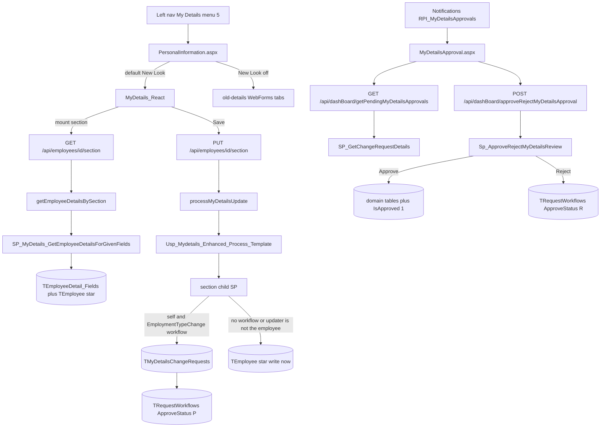
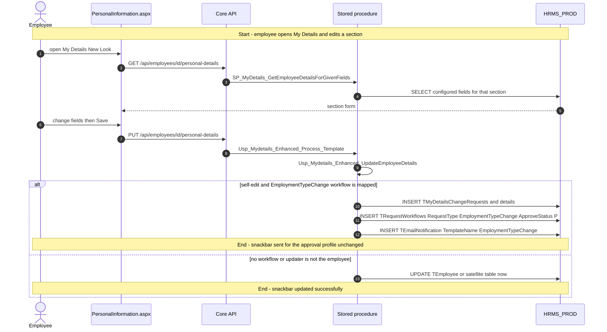
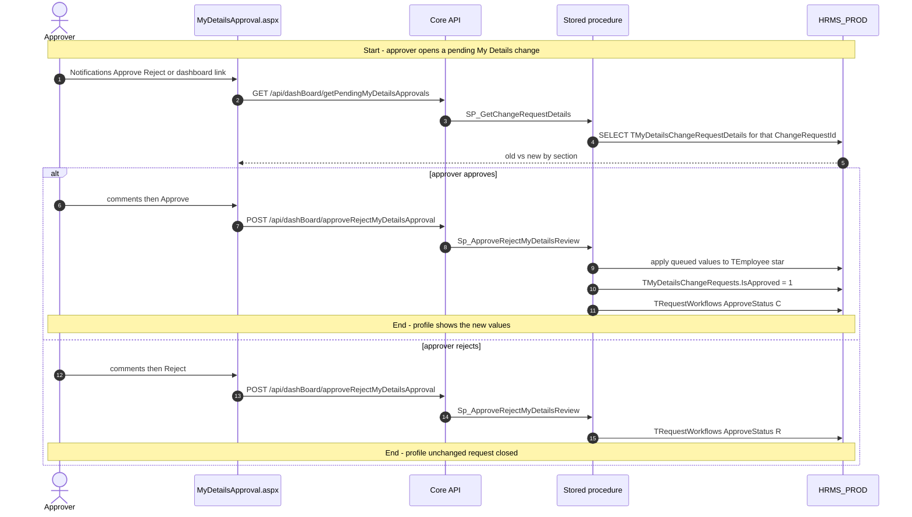
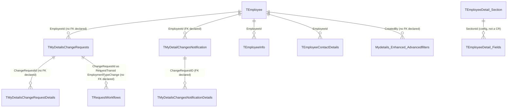

# My Details

## Overview

An employee wants to keep their HR profile current. They open **My Details** (left-nav menu id 5) and land on `PersonalInformation.aspx`, which by default hosts the **New Look** React SPA (`MyDetails_React`). They see their own summary, then section cards for personal, contact, family, bank, passport, employment, and the rest. A pencil appears only on sections their role (or a per-employee override) marks editable. They change a field and save.

If the employer has mapped a workflow to page title `EmploymentTypeChange` **and** the person saving is the employee themselves, the change does **not** hit `TEmployee` yet. It becomes a pending change request. The manager sees **My Details Update Approval** on Notifications (`RPI_MyDetailsApprovals`) and opens `MyDetailsApproval.aspx` to approve or reject. Approve writes the queued old/new values into the real employee tables; reject closes the request. If no such workflow is mapped, or someone else (HR viewing a reportee) is the updater, the same save writes the satellite `TEmployee*` row immediately and the snackbar says updated, not sent for approval.

Managers and HR also use this page to **impersonate** a reportee (`?Id=` encrypted, or from Direct/Indirect Reportees / All Employees). Background verification is shown for other people, not for self. History lists past and future-dated official changes. Documents upload to disk plus `SP_EMPMD_AddEmpAttachment`, not through the section template.

**Who's involved:**

- **Employee** — views and (where `IsEditable = Y`) edits their own profile; may wait for approval.
- **Reporting manager / approver** — acts on `EmploymentTypeChange` rows in `TRequestWorkflows`.
- **HR / admin** — impersonates, edits others (typically immediate apply), configures fields (**Admin Configuration → My Details Field Config**, menu 1154) and tab permissions (`/api/employees/access-control/*`). Those admin screens are not this menu item.

There is **no** `llm-wiki/domain` lifecycle page for My Details. `llm-wiki/domain/employee-lifecycle.md` covers active employment and satellite `TEmployee*` tables; `llm-wiki/domain/approval-workflow.md` covers the generic engine. My Details **queues** on `TRequestWorkflows` with `RequestType = EmploymentTypeChange` but **approves** via `Sp_ApproveRejectMyDetailsReview`, not `SP_ApproveWorkFlowRequest`. Table one-liners live in `llm-wiki/reference/tables/hrms.md`.

## Workflow

`EmploymentTypeChange` is the historical workflow page title for **any** queued My Details field change, not only employment-type. Current Employment and Skills/Domain apply immediately (no `TMyDetailsChangeRequests` on that path). Documents, profile picture, access-control, and saved filters skip the template SP.

## Request journey

The employee request that creates work for someone else is **Save on their own profile** when an `EmploymentTypeChange` workflow is mapped. HR saving someone else's profile is the same screen but a different terminal state (immediate write). Approve/reject is a second request started by the manager.

The Notifications grid (`SP_GetPendingmyDetailsReview`) aliases `ChangeRequestId AS EmployeeId`. The redirect query string `employeeID` is therefore the **change-request id**, which is what `SP_GetChangeRequestDetails` expects.

## Entry points

> SystemModel-2 lists `MyDetails_React` **in scope** (`identity/scope.md`) and as a reference Vite MFE (`architecture/decomposition/react-microfrontends.md`). It has **no** `behavior/workflows` page for this feature. Default layout is New Look (`getDefaultLayout` returns `"new"` when `localStorage.my-details-layout` is unset). The same aspx still contains the classic RadTabStrip under `#old-details`; that path calls `MyDetailsBLL` / `MyDetailsDAL` and the `SP_EMPMD_*` family. Search Employee and Employee Management can open the same page with `?action=Update&Id=` (encrypted).

| UI page / route | Purpose |
|---|---|
| `/HRM/EmployeeInformation/PersonalInformation.aspx` | Left-nav **My Details** (menu 5). Hosts `#my-details-root` (React) and `#old-details` (classic). Constant `URL_PERSONAL_INFO`. |
| `/HRM/DashBoard_React/MyDetailsApproval.aspx` | Approver review. Query `employeeID` is encrypted **ChangeRequestId**. `RouteConstants.MY_DETAILS_APPROVAL`. |
| `/Notifications.aspx` panel `RPI_MyDetailsApprovals` | Badge and grid of pending requests; **Approve / Reject** redirects to `MyDetailsApproval.aspx`. |

Adjacent, not this menu item: **Admin Configuration → My Details Field Config** (1154), Employee Information Configuration, and the access-control APIs that drive which tabs are visible/editable.

SPA top tabs (`MyDetails.tsx`): Profile Information, Direct Reportees, Indirect Reportees, All Employees, History, Asset Info. Profile sections include Personal, Skill, Domain, Passport & Visa, Past Employment, Bank, Nomination, Education, Family, Contact, Emergency Contact, Certification, Employment, Additional Info, Documents, Background Verification (others only).

## Code → database call chain

Live New Look saves go Node → `processMyDetailsUpdate` → `Usp_Mydetails_Enhanced_Process_Template`. There is no C# BLL on that path. Classic `#old-details` still uses `MyDetailsBLL` / `MyDetailsDAL` (Enterprise Library `GetStoredProcCommand`) and is omitted from the rows below except as a gap.

Section ids (`ORM/Constants.js`): Personal 1, Skill 2, Domain 3, Passport 4, Visa 5, Past Employment 6, Bank 7, Nomination 8, Education 9, Family 10, Contact 11, Emergency Contact 12, Certification 13, Current Employment 14, Additional Info 15, Documents 16.

| Entry point | DAL / BLL / service (`file:line`) | Stored procedure |
|---|---|---|
| Section GET (personal, skill, domain, passport, visa, past employment, bank, nomination, education, family, contact, emergency, certification, employment, additional-Info) | `getEmployeeDetailsBySection` (`ORM/Data/getEmployeeDetailsBySection.js:50`) via each `*/Service.js` | `SP_MyDetails_GetEmployeeDetailsForGivenFields` (field list from `FieldRepository.getMyDetailsFields` / `TEmployeeDetail_Fields`) |
| Section PUT (same set except documents) | `processMyDetailsUpdate` (`Utils/ProcessMyDetailsUpdate.js:46`) via each `*/Controller.js` `Put` | `Usp_Mydetails_Enhanced_Process_Template` → child SP by `TEmployeeDetail_Section.SECTION` |
| Personal details PUT with image | `uploadPersonalDetailsImage` (`PersonalDetails/UploadPersonalDetailsImage.js`) after a successful template PUT | `Usp_Mydetails_Enhanced_UpdateProfilePicture` |
| Inline field validation POST | `validateField` (`Validation/Service.js:80`) | none (FieldRepository + FieldValidator) |
| GET `/api/lookup/my-details-fields` | `MyDetailsFieldsQueryHandler.js:27` | none (Sequelize on `TEmployeeDetail_Fields`) |
| GET nomination-family | `NominationFamily/Service.js` | `SP_Mydetails_Enhanced_Getfamilyfornomination` |
| GET family-members-for-nomination | `FamilyDetails/Service.js` `getFamilyMembersForNomination` | `SP_MyDetails_GetEmployeeDetailsForGivenFields` then in-memory filter |
| GET/POST documents | `documents/Service.js` | `SP_EMPMD_GetEmpAttachment` / `SP_EMPMD_AddEmpAttachment` (plus bulk-upload file SPs) |
| GET background-verification | `BackgroundVerification/Service.js` | `SP_BGV_GetEmployeeBGVDetails` |
| GET employee-summary | `EmployeeSummary/Controller.js` | `Usp_Mydetails_Enhanced_EmployeeSummary` |
| GET history-changes | `HistoryChanges/Service.js` | `SP_Mydetails_Enhanced_GetEmpHistoryDetails` |
| DELETE history-changes/:futureTransID | ORM `deleteFutureChange` | `Sp_EMPMD_DelEmpfutureinfo` |
| GET reportees / count | `Reportees/Service.js` | `Sp_CM_Mydetails_DirectIndirectReports` / `_Count` |
| GET team-members | `TeamMembers/Service.js` `getMergedTeamMembers` | raw SQL `getReporteesRaw.sql` (not a live SP call) |
| GET/POST/PUT/DELETE team-members saved-filters | `TeamMembers/Service.js` | `Sp_Mydetails_Enhanced_Getfilters`, `Sp_Mydetails_Enhanced_Advancedfilters_Upsert`, `Sp_Mydetails_Enhanced_Advancedfilters_Delete` |
| GET/POST access-control | `AccessControl/Service.js` | `Sp_Mydetails_Tabs_Modules`, `SP_GetRoleOrEmployeePermissions`, `Sp_MydetailsRolebasedPermission` |
| Approver load | `dashBoardDAL.GetPendingMyDetailsApprovals` (`dashBoardDAL.js:1375`) via `dashboardController.js:1134` | `SP_GetChangeRequestDetails` |
| Approver decide | `dashBoardDAL.ApproveRejectMyDetailsApproval` (`dashBoardDAL.js:1747`) via `dashboardController.js:1145` | `Sp_ApproveRejectMyDetailsReview` |
| Notifications grid (WebForms) | `AddCandidateDAL.GetPendingMyDetailsReview` (`AddCandidateDAL.cs:378`) | `SP_GetPendingmyDetailsReview` |

Template dispatch (`Usp_Mydetails_Enhanced_Process_Template.sql`):

| `TEmployeeDetail_Section.SECTION` | Child procedure |
|---|---|
| Personal Details | `Usp_Mydetails_Enhanced_UpdateEmployeeDetails` |
| Skill Details | `Usp_Mydetails_Enhanced_ProcessEmployeesSkillsInformation` |
| Domain Details | `Usp_Mydetails_Enhanced_ProcessEmployeesDomainInformation` |
| Passport Details | `Usp_Mydetails_Enhanced_UpdateEmployeePassportInformation` |
| Visa Details | `Usp_Mydetails_Enhanced_UpdateEmployeeVisaInformation` |
| Past Employment Details | `Usp_Mydetails_Enhanced_ProcessEmployeesPastEmploymentInformation` |
| Bank Details | `Usp_Mydetails_Enhanced_ProcessEmployeesBankDetailInformation` |
| Education Details | `Usp_Mydetails_Enhanced_ProcessEmployeesEducationInformation` |
| Nomination Details | `Usp_Mydetails_Enhanced_ProcessEmployeesNominationInformation` |
| Family Details | `Usp_Mydetails_Enhanced_ProcessEmployeesFamilyInformation` |
| Contact Details | `Usp_Mydetails_Enhanced_ProcessEmployeesContactInformation` |
| Emergency Contact Details | `Usp_Mydetails_Enhanced_ProcessEmployeesEmergencyContactInformation` |
| Certification Details | `Usp_Mydetails_Enhanced_ProcessEmployeesCertificationInformation` |
| Current Employment Details | `Usp_Mydetails_Enhanced_UpdateCurrentEmploymentDetails` |
| Additional Info | `Usp_Mydetails_Enhanced_UpdateAdditionalInfo` |

Leaf updates that own the queue-vs-immediate gate use `Count(WorkflowId) > 0 AND @empID = @updatedBy` (example: `SP_Mydetails_Enhanced_UpdateEmployeePersonalInformation.sql:417`). `@UpdatedBy` is Process_Template `@LoginId`, which Node sets from the route `:employeeId`.

## API endpoints

Feature routers mount at app root (`FeatureRegister.register`): My Details under `/api/employees` (JWT `guards`), lookup under `/api/lookup`. Approval sits on the legacy `/api` router (`routeIndex.js` → `/dashBoard`). Shared section PUT body (middleware `validateRequest`): `employerId` (int, required), `countryId` (int, required), `data` (object or array, required), `ignoreValidation` (bool, optional). Path `employeeId` is required on every `/:employeeId/…` route.

| Verb | Route | Parameters | Purpose | Source |
|---|---|---|---|---|
| `GET` | `/api/employees/:employeeId/personal-details` (and skill-details, domain-details, passport-details, visa-details, past-employment-details, bank-details, nomination-details, education-details, family-details, contact-details, emergency-contact-details, certification-details, employment-details, additional-Info) | path `employeeId` (int, required) | Load one section | each `*/Controller.js` `Get` |
| `PUT` | same paths as GET | path `employeeId`; body shared PUT; personal-details also multipart `profileImage` / `image` (optional) | Validate and save one section | each `*/Controller.js` `Put` |
| `POST` | `/api/employees/:employeeId/validation` | path `employeeId`; body `employerId`, `countryId`, `sectionId`, `fieldName`, `data` (all required) | Validate one field without persisting | `Validation/Controller.js:3` |
| `GET` | `/api/lookup/my-details-fields` | query `employerId`, `countryId` (required), `sectionId` (optional) | Field metadata for the form | `MyDetailsFieldsQueryHandler.js:27` |
| `GET` | `/api/employees/:employeeId/nomination-family` | path `employeeId` | Family rows for nomination | `NominationFamily/Controller.js` |
| `GET` | `/api/employees/:employeeId/family-members-for-nomination` | path `employeeId` | Active family members for nomination picker | `FamilyDetails/Controller.js:76` |
| `GET` | `/api/employees/:employeeId/document-categories` | path `employeeId`; query `employerId` (required in service) | Attachment categories | `document-categories/Controller.js` |
| `GET` | `/api/employees/:employeeId/documents` | path `employeeId`; query `categoryId`, `employerId` (optional) | Document list | `documents/Controller.js:209` |
| `POST` | `/api/employees/:employeeId/documents` | path `employeeId`; multipart `payload` JSON (required: `employerId`, `categories`/`documents`, file fields) | Upload documents | `documents/Controller.js:300` |
| `GET`/`HEAD` | `/api/employees/:employeeId/documents/file` | path `employeeId`; query `employerId`, `categoryId`, `fileName` (typical); `download` optional. **Public** (no JWT guard) | Preview or download a file | `Employee/router.js` + `documents/Controller.js:240` |
| `GET` | `/api/employees/:employeeId/background-verification` | path `employeeId` | BGV rows (read-only) | `BackgroundVerification/Controller.js` |
| `GET` | `/api/employees/:employeeId/employee-summary` | path `employeeId` | Header summary | `EmployeeSummary/Controller.js` |
| `GET` | `/api/employees/:employeeId/history-changes` | path `employeeId`; query `sections`, `pageNumber`, `pageSize`, `from`, `to`, `type`, `fields` (all optional) | History / future changes | `HistoryChanges/Controller.js:12` |
| `DELETE` | `/api/employees/:employeeId/history-changes/:futureTransID` | path `employeeId`, `futureTransID` (required) | Delete a future-dated official change | `HistoryChanges/Controller.js:40` |
| `GET` | `/api/employees/:employeeId/reportees` | path `employeeId`; query `type` (`all`/`direct`/`indirect`, default `all`), `isActive` (`Y`/`N`, optional), `employerId` (optional) | Reportee grids | `Reportees/Controller.js:41` |
| `GET` | `/api/employees/:employeeId/reportees/count` | same as reportees | Tab counts | `Reportees/Controller.js:67` |
| `GET` | `/api/employees/:employeeId/team-members` | path `employeeId`; query `type` (`all`/`active`/`inactive`, required), `employerId` (required), `filterJson`, `searchTerm`, `page`, `pageSize`, `sortColumn`, `sortDirection` (optional) | All Employees grid | `TeamMembers/Controller.js:162` |
| `GET` | `/api/employees/:employeeId/team-members/ids` | path + `type`, `employerId` required; `filterJson`, `searchTerm` optional | Select-all ids | `TeamMembers/Controller.js:205` |
| `GET` | `/api/employees/:employeeId/team-members/count` | path + `type`, `employerId` required | Tab count | `TeamMembers/Controller.js:184` |
| `GET`/`POST` | `/api/employees/:employeeId/team-members/saved-filters` | GET query `employerId` required; POST body `employerId`, `name`, `scope` (`private`/`public`), `conditions` required | Saved advanced filters | `TeamMembers/Controller.js:234` |
| `PUT`/`DELETE` | `/api/employees/:employeeId/team-members/saved-filters/:filterId` | path `filterId`; PUT body as POST; DELETE query `employerId` required | Update or delete a saved filter | `TeamMembers/Controller.js:282` |
| `GET` | `/api/employees/access-control/modules` | none | Tab/module tree | `AccessControl/Controller.js:61` |
| `GET`/`POST` | `/api/employees/access-control/permissions` | GET query `employerId` required, `roleId` XOR `employeeId`; POST body `employerId`, `modulePermissions` required, `roleId` XOR `employeeId` | Role/employee tab edit rights | `AccessControl/Controller.js:77` |
| `GET` | `/api/dashBoard/getPendingMyDetailsApprovals` | query `employeeId` (int, required — actually **ChangeRequestId**) | Approver old/new grid | `dashboardController.js:1134` |
| `POST` | `/api/dashBoard/approveRejectMyDetailsApproval` | body `employeeId`, `loggedInUser`, `employerId`, `requestType` (`EmploymentTypeChange`), `status`, `comments` | Approve or reject | `dashboardController.js:1145` |

`NominationFamily/Controller.js` defines `Put` but `routes.js` only wires GET for `/nomination-family`.

## Stored procedures & tables involved

> Live New Look reads go through **`SP_MyDetails_GetEmployeeDetailsForGivenFields`**, not `Usp_Mydetails_EnhancedcentralizedInformation` (that aggregator exists in the DB tree and is unused by this Node feature). Writes go through **`Usp_Mydetails_Enhanced_Process_Template`**. Approval is **`Sp_ApproveRejectMyDetailsReview`**, not `SP_ApproveWorkFlowRequest`. `TMyDetailChangesNotification` is a separate post-apply notify path (`SP_AddMyDetailsChanges`), not the pending-approval queue.

| Object | File path | Purpose | llm-wiki |
|---|---|---|---|
| `TEmployee` / satellite `TEmployee*` | `HRMS-DATABASE/HRMS/TABLES/` | Profile of record. Immediate writes and approved CR apply land here. | `llm-wiki/domain/employee-lifecycle.md`, `llm-wiki/reference/tables/hrms.md` |
| `TEmployeeDetail_Section` / `TEmployeeDetail_Fields` | `HRMS-DATABASE/HRMS/TABLES/` | Section catalog and per-employer/country field config. Template field-count gate. | — |
| `TMyDetailsChangeRequests` | `HRMS-DATABASE/HRMS/TABLES/TMyDetailsChangeRequests.sql` | Pending self-edit header. No PK, no FK in the script. SPs also write `RequestedDateUtc` (not in this CREATE). | `llm-wiki/reference/tables/hrms.md` |
| `TMyDetailsChangeRequestDetails` | `…/TMyDetailsChangeRequestDetails.sql` | Field-level old/new. Index on `ChangeRequestId`. No FK to header. | same |
| `TRequestWorkflows` | `HRMS-DATABASE/HRMS/TABLES/` | `RequestType = EmploymentTypeChange`, `RequestTransid = ChangeRequestId`, `ApproveStatus` P/C/R. | `llm-wiki/domain/approval-workflow.md` |
| `TMyDetailChangesNotification` | `…/TMyDetailChangesNotification.sql` | Post-change notify header. PK + FK `EmployeeId → TEmployee`. | `llm-wiki/reference/tables/hrms.md` |
| `TMyDetailsChangesNotificationDetails` | `…/TMyDetailsChangesNotificationDetails.sql` | Notify field deltas. FK to notification header. | same |
| `Mydetails_Enhanced_Advancedfilters` | `…/Mydetails_Enhanced_Advancedfilters.sql` | Saved All Employees filters. No PK, no FK. | — |
| `TEmailNotification` | `HRMS-DATABASE/HRMS/TABLES/` | Queued `EmploymentTypeChange` mail when a CR is inserted. | — |
| `Usp_Mydetails_Enhanced_Process_Template` | `HRMS-DATABASE/HRMS/STOREPROCEDURE/` | Write dispatcher. Returns `IsSuccessful`, `IsWaitingForApproval`. | — |
| `SP_MyDetails_GetEmployeeDetailsForGivenFields` | same | Section GET. | — |
| `Sp_InsertMyDetailsUpdateRequests` | same | Shared CR + workflow + email insert helper (also used by some legacy EMPMD / photo paths). | — |
| `Sp_ApproveRejectMyDetailsReview` | same | Apply or close a CR. | — |
| `SP_GetChangeRequestDetails` | same | Approver UI payload. Parameter named `EmployeeId` is ChangeRequestId. | — |
| `SP_GetPendingmyDetailsReview` | same | Notifications grid for the manager. | — |
| `SP_AddMyDetailsChanges` | same | Immediate-change notify rows (not the approval queue). | — |

## Table relationships

Declared FKs are taken from each table's `CREATE TABLE`. `TMyDetailsChangeRequests` / `TMyDetailsChangeRequestDetails` / `Mydetails_Enhanced_Advancedfilters` have none — edges below are the joins the live procedures actually use.

## Known gaps

- **No SystemModel-2 workflow page** and **no** `llm-wiki/domain` My Details lifecycle. `approval-workflow.md` names `SP_ApproveWorkFlowRequest` as the central dispatcher; this feature does not call it.
- **Classic layout is still compiled and switchable** on the same aspx (`#old-details`, `MyDetailsBLL` / `MyDetailsDAL`, `SP_EMPMD_*`). Default is New Look. That EMPMD call chain is not expanded here.
- **`Usp_Mydetails_EnhancedcentralizedInformation`** exists in the DB folder and is not on the live Node GET path.
- **`EmploymentTypeChange`** is the RequestType / workflow page title for all queued My Details field edits. Current Employment (`Usp_Mydetails_Enhanced_UpdateCurrentEmploymentDetails`) and Skills/Domain process SPs apply immediately.
- **Notifications `employeeID` is ChangeRequestId.** `SP_GetPendingmyDetailsReview` selects `ChangeRequestId AS EmployeeId`; `SP_GetChangeRequestDetails` filters details by that id.
- **`TMyDetailsChangeRequests` DDL drift:** no PRIMARY KEY; procedures insert `RequestedDateUtc`, which is absent from the TABLE script.
- **Team members list** uses raw SQL (`getReporteesRaw.sql`), not `Sp_CM_Mydetails_DirectIndirectReports`. Count may still hit the `_Count` SP when there is a single employer and no filter.
- **`NominationFamily` PUT** is implemented in the controller but not mounted in `routes.js`.
- **Documents file GET** is on `publicEmployees` (no JWT guard).
- **`@UpdatedBy` is the route `:employeeId`**, not `req.EID`. Impersonated HR saves that PUT to the viewed employee's id look like self-edits to the leaf ` @empID = @updatedBy` gate.
- **Access-control and Field Config** configure this page; they are Admin Configuration / Employee Management surfaces, not left-nav My Details children.
- **BGV** on this page is read-only (`SP_BGV_GetEmployeeBGVDetails`). Create/edit lives under Employee Management → Background Verification.
- React SPA has **no persistent pending-approval banner**; only a save snackbar when `IsWaitingForApproval` is true.

## Reference

Confidence is **medium**: the New Look host page, Node `/api/employees` routers, `processMyDetailsUpdate`, template dispatch, CR-vs-immediate gate (sampled on personal/contact/family/nomination/emergency), and approver dashBoard SPs were traced to `file:line`. Not every child `Usp_Mydetails_Enhanced_ProcessEmployees*` body was read line-by-line; table lists for those follow the same CR-or-`TEmployee*` pattern. There is no domain `erDiagram` to reuse. Relationships are declared FKs plus the joins those procedures use.

### SourceCode

- `docs/SystemModels/SystemModel-2/identity/scope.md` — `MyDetails_React` in scope
- `docs/SystemModels/SystemModel-2/architecture/decomposition/react-microfrontends.md`
- `HRMS.Web/HRMS.Web/HRM/EmployeeInformation/PersonalInformation.aspx` (+ `.cs`)
- `HRMS.Web/HRMS.Web/HRM/MyDetails_React/src/main.tsx`, `App.tsx`, `components/MyDetails.tsx`, `SwitchLayoutButton.tsx`, `utils/modes.ts`
- `HRMS.Web/HRMS.Web/HRM/DashBoard_React/MyDetailsApproval.aspx`
- `HRMS.Web/HRMS.Web/HRM/DashBoard_React/Areas/Approval/Components/MyDetailsApprovalComponent.js`
- `HRMS.Web/HRMS.Web/HRM/DashBoard_React/Common/apiURLConstants.js`
- `HRMS.Web/HRMS.Web/Notifications.aspx.cs`
- `HRMS.CoreAPI/HRMS.Core.WebAPI.Node/Utils/FeatureRegister.js`
- `HRMS.CoreAPI/HRMS.Core.WebAPI.Node/Features/Employee/router.js`
- `HRMS.CoreAPI/HRMS.Core.WebAPI.Node/Features/Employee/MyDetails/routes.js`
- `HRMS.CoreAPI/HRMS.Core.WebAPI.Node/Features/Employee/MyDetails/Utils/ProcessMyDetailsUpdate.js`
- `HRMS.CoreAPI/HRMS.Core.WebAPI.Node/Features/Employee/MyDetails/PersonalDetails/Controller.js`, `Service.js`
- `HRMS.CoreAPI/HRMS.Core.WebAPI.Node/ORM/Data/getEmployeeDetailsBySection.js`, `ORM/Constants.js`
- `HRMS.CoreAPI/HRMS.Core.WebAPI.Node/Features/Lookup/Handlers/MyDetailsFieldsQueryHandler.js`
- `HRMS.CoreAPI/HRMS.Core.WebAPI.Node/Routes/routeIndex.js`, `Routes/DashBoardRoutes.js`
- `HRMS.CoreAPI/HRMS.Core.WebAPI.Node/Controllers/dashboardController.js`
- `HRMS.CoreAPI/HRMS.Core.WebAPI.Node/Core/DataAccessLayer/dashBoardDAL.js`
- `HRMS.Shared/HRMS.DataAccessLayer/MyDetailsDAL/MyDetailsDAL.cs` (classic layout only)
- `HRMS.Shared/HRMS.BusinessLayer/MyDetails/MyDetailsBLL.cs` (classic layout only)
- `HRMS.Shared/HRMS.DataAccessLayer/Recruitment/AddCandidateDAL.cs` (`GetPendingMyDetailsReview`)

### TDG HRMS DB

- `llm-wiki/architecture/module-catalog.md` — core `HRMS` / `HRMS_PROD`
- `llm-wiki/domain/employee-lifecycle.md` — active employment + satellite `TEmployee*` (does not document CRs)
- `llm-wiki/domain/approval-workflow.md` — generic `TRequestWorkflows` / `TWorkflowManagement` (does not name `Sp_ApproveRejectMyDetailsReview`)
- `llm-wiki/reference/tables/hrms.md` — `TMyDetailsChangeRequests`, `TMyDetailsChangeRequestDetails`, `TMyDetailChangesNotification`, `TMyDetailsChangesNotificationDetails`
- `HRMS-DATABASE/HRMS/DML/Tmenudetails DML.sql` — menu Value 5 My Details; 1154 Field Config
- `HRMS-DATABASE/HRMS/TABLES/TMyDetailsChangeRequests.sql`, `TMyDetailsChangeRequestDetails.sql`, `TMyDetailChangesNotification.sql`, `TMyDetailsChangesNotificationDetails.sql`, `Mydetails_Enhanced_Advancedfilters.sql`
- `HRMS-DATABASE/HRMS/STOREPROCEDURE/Usp_Mydetails_Enhanced_Process_Template.sql`
- `HRMS-DATABASE/HRMS/STOREPROCEDURE/SP_MyDetails_GetEmployeeDetailsForGivenFields.sql`
- `HRMS-DATABASE/HRMS/STOREPROCEDURE/SP_Mydetails_Enhanced_UpdateEmployeePersonalInformation.sql`
- `HRMS-DATABASE/HRMS/STOREPROCEDURE/Sp_InsertMyDetailsUpdateRequests.sql`
- `HRMS-DATABASE/HRMS/STOREPROCEDURE/Sp_ApproveRejectMyDetailsReview.sql`
- `HRMS-DATABASE/HRMS/STOREPROCEDURE/SP_GetChangeRequestDetails.sql`
- `HRMS-DATABASE/HRMS/STOREPROCEDURE/SP_GetPendingmyDetailsReview.sql`
