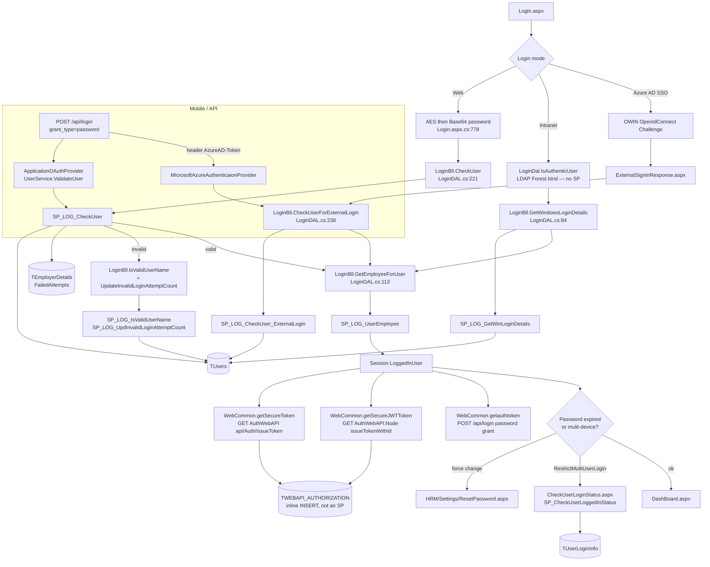
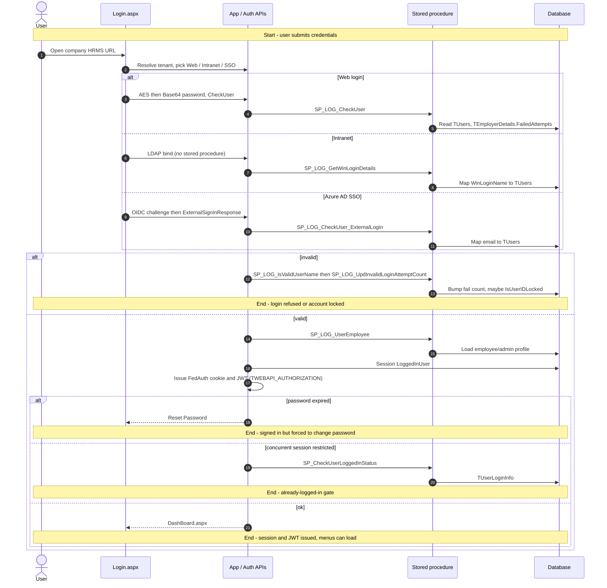
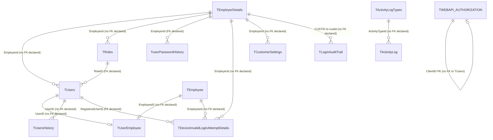

# Authentication

## Overview

An employee (or an HR admin, or a super-user) opens the company HRMS URL and needs to prove who they are before any page, menu, or API will load. The tenant is resolved from the subdomain (or a customer-number field on the form). What they type — employment number or email — is a customer setting. They then pick one of three ways in:

- **Web login** — username and password. The password is AES-encrypted then Base64'd in the app, and the stored `TUsers.PasswordStr` is compared in SQL. Too many failures lock the account against the tenant's `FailedAttempts` policy; the employee gets an unlock email and has to wait for HR.
- **Intranet / Windows** — `DOMAIN\user` plus AD password. LDAP proves the Windows identity; HRMS then looks up the mapped `WinLoginName` on `TUsers`.
- **External SSO** — Azure AD OpenID Connect, when the tenant has `IsExternalLogin` on. The browser is challenged to Microsoft, comes back with an email, and HRMS maps that email onto a user row. Mobile can send the same Azure AD JWT in an `AzureAD-Token` header instead of a password.

On success the app builds a `LoggedInEmployee` into `Session["LoggedInUser"]`, sets a Forms Authentication cookie (web password path), and immediately mints two extra credentials for React SPAs and APIs: a WIF **FedAuth** cookie from `HRMS.AuthWebAPI`, and a **JWT** from `HRMS.AuthWebAPI.Node`. If the password is expired or flagged force-change, they never reach the dashboard — they land on Reset Password. If the site restricts concurrent sessions, they hit a "already logged in elsewhere" gate first.

**Who's involved:**

- **Employee / admin / super-user** — the person signing in (`TUsers.UserType`, default `'E'`).
- **HR / User Management admin** — maps Windows logins, unlocks accounts, configures tenant login flags (SSO, email-vs-empno, forgot-password).
- **Customer-onboarding / settings admin** — turns Azure AD SSO on per tenant (`TCustomerSettings`).

This page connects that story to the **application call chain**. For DB-only identity, lockout columns, and role/page mapping, see `llm-wiki/architecture/auth-flow.md`. The live code path (three login modes, AES+Base64, JWT federation) is named in SourceCode's `docs/SystemModels/SystemModel-2/architecture/auth-flow.md` and ADR-007.

## Workflow

Passwords are **reversibly encrypted** (AES/Rijndael then Base64), not hashed — `SP_LOG_CheckUser` compares `PasswordStr = @Password`. Tenant is resolved from subdomain appSetting or `SP_LOG_GetCustomerNoViaEmail`. After a successful web login the activity logger writes `Sp_InsertActivityLog` (`ActivityDescription.WebLogin`); optional step-by-step rows go to `TLoginAuditTrail` when `EnableInsertLoginAuditTrail` is on.

## Request journey

The request that starts here is **signing in**. It ends either as a session plus JWT (dashboard), a forced password change, a concurrent-session gate, or a lockout. The wiki page `llm-wiki/architecture/auth-flow.md` has a reconstructed DB-only sequence; this one is the live app path.

Mobile/API uses the same credential check via `POST /api/login` (`SP_LOG_CheckUser` or `SP_LOG_CheckUser_ExternalLogin`) and ends with an OAuth access token plus JWT, not `Login.aspx`.

## Entry points

> SourceCode `docs/SystemModels/SystemModel-2/architecture/auth-flow.md` names `Login.aspx.cs` as the live shell for all three modes, then `HRMS.AuthWebAPI.Node` as the JWT mint. The physical page lives at site-root `Login.aspx`; under IIS the public URL is `/HRM/Login.aspx` (the path `llm-wiki` quotes from ELMAH). `LoginRoutes_V2.js` / `LoginRoutes_V3.js` exist on disk but are **not** mounted in CoreAPI `routeIndex.js`.

| Entry point | Purpose | Live? |
|---|---|---|
| `Login.aspx` | Primary employee/admin login UI (Web / Intranet / SSO challenge) | Yes |
| `ExternalSignInResponse.aspx` | Azure AD OIDC callback → session + JWT | Yes, when tenant `IsExternalLogin` |
| `CheckUserLoginStatus.aspx` | Concurrent-session gate after web login | Yes, only if `RestrictMultiUserLogin=TRUE` |
| `HRM/Settings/ResetPassword.aspx` | Forced / forgot-password reset (email link target) | Yes |
| `HRM/UserManagement/WinLoginSetup.aspx` | Admin maps `WinLoginName` onto users | Yes (setup, not a login page) |
| `POST /api/login` (OWIN token endpoint on HRMS.WebAPI) | Mobile/API password grant (and Azure AD token grant) | Yes |
| Node `POST /api/login` | Proxy onto the OWIN grant (`loginMethod=api`) or scrape WebForms (`loginMethod=form`) | Yes (proxy) |
| `GET` AuthWebAPI `api/Auth/IssueToken` | Mint FedAuth cookie after login | Yes |
| `GET` AuthWebAPI.Node `api/auth/issueTokenWithId` | Mint JWT with `EID` after login | Yes |
| Node `LoginRoutes_V2` / `_V3` | Same login handlers behind v2/v3 Authorize middleware | Dead (unmounted) |
| `LoginController.generateToken` in CoreAPI | Local JWT sign | Dead (not routed) |

## Code → database call chain

Login DAL/BLL is Enterprise Library `Database.GetStoredProcCommand` throughout (`LoginDAL.cs`). Federation key rows are **inline SQL**, not stored procedures.

| Step | Entry point | App code | Stored procedure / SQL |
|---|---|---|---|
| Web credential check | `Login.aspx.cs:776` `DoWebLogin` | `LoginBll.CheckUser` → `LoginDal.CheckUser` (`LoginDAL.cs:221`) | `SP_LOG_CheckUser` |
| Load profile into session | same, `:849` | `LoginBll.GetEmployeeForUser` → `LoginDal.GetEmployeeForUser` (`LoginDAL.cs:113`) | `SP_LOG_UserEmployee` |
| Username exists? (fail path) | `Login.aspx.cs` `checkUsersLockStatus` | `LoginBll.IsValidUserName` → `LoginDal.IsValidUserName` (`LoginDAL.cs:135`) | `SP_LOG_IsValidUserName` |
| Bump fail count / lock | same | `LoginBll.UpdateInvalidLoginAttemptCount` → `LoginDal.UpdateInvalidLoginAttemptCount` (`LoginDAL.cs:157`) | `SP_LOG_UpdInvalidLoginAttemptCount` |
| Resolve tenant from email | email-login / SSO / OAuth without `customerNumber` | `LoginBll.GetCustomerNumberByEmail` (`LoginDAL.cs:175`) | `SP_LOG_GetCustomerNoViaEmail` |
| LDAP bind | `Login.aspx.cs:412` `DoIntranetLogin` | `LoginDal.IsAuthenticUser` (`LoginDAL.cs:39`) | *(none — AD Forest/GC)* |
| Map Windows id → HRMS user | `Login.aspx.cs:456` `PerformIntranetLogin` | `LoginBll.GetWindowsLoginDetails` (`LoginDAL.cs:84`) | `SP_LOG_GetWinLoginDetails` |
| Employer → custid | intranet success | `LoginBll.GetCustomerNumberByEmployerId` (`LoginDAL.cs:196`) | `SP_LOG_GetCustomerNumberViaEmployerId` |
| Azure AD email → HRMS user | `ExternalSignInResponse.aspx.cs:238` | `LoginBll.CheckUserForExternalLogin` (`LoginDAL.cs:238`) | `SP_LOG_CheckUser_ExternalLogin` |
| Concurrent-session read | `CheckUserLoginStatus.aspx.cs:27` | `LoginBll.CheckUserLoginStatus` (`LoginDAL.cs:252`) | `SP_CheckUserLoggedInStatus` |
| Concurrent-session upsert | `CheckUserLoginStatus.aspx.cs:39/56` | `LoginBll.InsertUserLoginStatus` (`LoginDAL.cs:266`) | `SP_InsertUserLoginStatus` |
| Optional login-step audit | `Login.aspx.cs:319` `_parkTroubleShootingData` | `LoginBll.InsertLoginAuditTrail` (`LoginDAL.cs:282`) | `SP_INS_LoginAuditTrail` |
| Audit flag | `Login.aspx.cs:219` | `LoginBll.FetchEnableInsertLoginAuditTrail` (`LoginDAL.cs:297`) | `SP_GET_EnableInsertLoginAuditTrail` |
| Web login activity row | `Login.aspx.cs:860` | `CommonUtil.LogActivity` → `ActivityHelper` | `Sp_InsertActivityLog` |
| Tenant SSO / consent flags | post-success | `DBHelper.GetCustomerSettings` (`DBHelper.cs:3414`) | `SP_GetCustomerSettings` |
| Mint federation secret | `Web.Common.cs:1124` / `UserService.cs:156` | `APIAuthorizationStore.RegisterRelyingParty` | **inline** `INSERT TWEBAPI_AUTHORIZATION` |
| Verify federation secret | AuthWebAPI.Node Basic auth | `authDAL.VerifySecretKey` | **inline** `SELECT` on `TWebAPI_Authorization` |
| OAuth password grant | `POST /api/login` | `ApplicationOAuthProvider.cs:38` → `UserService.ValidateUser` (`UserService.cs:55`) | `SP_LOG_CheckUser` then `SP_LOG_UserEmployee` |
| OAuth Azure AD grant | same, header `AzureAD-Token` | `UserService.ValidateUserForExternalLogin` (`UserService.cs:108`) | `SP_LOG_CheckUser_ExternalLogin` then `SP_LOG_UserEmployee` |
| Forgot password | `POST api/login/forgotpassword` | `DBHelper.ValidateUserEmailId` + `GetUserPassword` | `Sp_ValidateUserEmailId`, `SP_GetUserPassword` |
| Change password | `POST api/login/changepassword` | `DBHelper.ChangePassword` (`DBHelper.cs:186`) | `SP_ChangePassword` (history via `SP_GetUserPasswordHistory`) |
| Map Windows login (admin) | `WinLoginSetup.aspx.cs` | `UserManagementDAL.UpdateUserWinLogin` | `Sp_AdminUM_UpdUserWindowsLogin` |
| Device failed-login audit | Node device registration (mobile) | `DeviceRegistrationsDAL.insertDeviceLoginAttempt` | `SP_DeviceLoginAttempt_Insert` |

## API endpoints

> **Wiki-drift, CoreAPI middleware:** SystemModel-2 `security/overview.md` (analysed 2026-07-24) says v1 `authMiddleware.js` has JWT verification commented out. Current `Middlewares/authMiddleware.js` **does** call `jwt.verify` (skips verification only when `NODE_ENV === 'development'`, hardcoding `EID = 1431`). Treat the wiki "auth is off" claim as stale versus today's code. Login itself is anonymous; this middleware guards other CoreAPI families after the JWT exists.

Credential login for API clients is **`POST /api/login`** on HRMS.WebAPI (OWIN token endpoint in `Startup.Auth.cs:32`), not a `LoginController` action. Node CoreAPI `POST /api/login` proxies that grant.

| Verb | Route | Parameters | Purpose | Source |
|---|---|---|---|---|
| `POST` | `/api/login` | form: `grant_type` (required, `password`), `username` (required unless Azure header), `password` (required unless Azure header), `customerNumber` (optional), `deviceType` (optional), `deviceId` (optional); header `AzureAD-Token` (optional) | OAuth password / Azure AD token grant; returns access_token + JWT/SecureToken properties. Expires in **365 days**. | `Startup.Auth.cs:32`; `ApplicationOAuthProvider.cs:38` |
| `POST` | `/api/login` (CoreAPI) | body: `username` (required), `password` (required), `customerNumber` (optional), `deviceId` (optional), `deviceType` (optional), `loginMethod` (`api`\|`form`, default `api`) | Proxy to the OWIN grant, or scrape `Login.aspx` | `LoginRoutes.js:12`; `LoginController.js:62` |
| `POST` | `/api/login/forgotpassword` | body `User`: `email` (required), `customerNumber` (optional) | Email a Reset Password link | `LoginController.cs:63` `[AllowAnonymous]` |
| `POST` | `/api/login/changepassword` | body `User`: `userName`, `oldPassword`, `newPassword`, `confirmNewPassword` (required pair), `employerId`, `employeeId` | Change password (AES+Base64, history check) | `LoginController.cs:138` `[Authorize]` |
| `POST` | `/api/login/GetJWTToken/{employeeId}` | route `employeeId` (int, required) | Mint JWT via AuthWebAPI.Node (re-register secret first) | `LoginController.cs:306` |
| `POST` | `/api/login/GetSecureToken/{employeeId}` | route `employeeId` (int, required) | Mint FedAuth via AuthWebAPI | `LoginController.cs:367` |
| `GET` | `/api/login/GetLoginWithParameter` | none | Pre-login tenant `LoginWith` bootstrap | `LoginController.cs:443` `[AllowAnonymous]` → `SP_GetCustomerNo` |
| `GET` | `/api/login/GetCustomerSettings/{customerNumber}` | route `customerNumber` (string, required) | Pre-login SSO / policy flags | `LoginController.cs:522` `[AllowAnonymous]` → `SP_GetCustomerSettings` |
| `GET` | `/api/login/GetDynamicMenu/{userId}/{employeerId}` | route `userId`, `employeerId` (int, required) | Post-login menu | `LoginController.cs:428` |
| `POST` | `/api/login/AddDeviceTokenForMobile` | body `MobileNotification`: `EmployerId`, `EmployeeId`, `deviceToken`, `Platform` | Push device token | `LoginController.cs:457` |
| `POST` | `/api/login/AddBatchForMobile` | body `MobileNotification` | Badge count | `LoginController.cs:489` |
| `GET` | `api/Auth/IssueToken` (AuthWebAPI) | header `expirationTime` (required); Basic `secretKey` | Issue FedAuth session cookie | `AuthController.cs:33` |
| `GET` | `/api/auth/issueToken` (AuthWebAPI.Node) | Basic `secretKey` | JWT with Claims only | `authRoutes.js:8`; `authController.js:4` |
| `GET` | `/api/auth/issueTokenWithId` (AuthWebAPI.Node) | Basic `secretKey`; query `EID` (required for a useful token) | JWT with Claims + `EID` — the path `getSecureJWTToken` calls | `authRoutes.js:9`; `authController.js:27` |

`LoginController` also hosts `GET api/login/Location/{id}`, `POST api/login/PunchIn`, `POST api/login/PunchOut`, and `POST api/login/DayHistory/{employeeId}` — those are **attendance punch** APIs sitting on the login controller, not authentication. See the Attendance feature guide.

WebForms login is postback (`btnLogin_Click`); the only WebMethod on the login-adjacent pages is `CheckUserLoginStatus.CheckUserStatus` (`CheckUserLoginStatus.aspx.cs:65`).

## Stored procedures & tables involved

> Live login uses the `SP_LOG_*` names from `DBConstant.cs:1098-1114`. Older twins (`SP_CheckUser`, `SP_GetWinLoginDetails`, `SP_UpdateInvalidLoginAttemptCount`, `SP_IsValidUserName`) still exist under `HRMS-DATABASE/HRMS/STOREPROCEDURE/` but **LoginDAL does not call them**. There is no dedicated `HRMS-DATABASE/Auth` folder — objects sit in `HRMS/`.

| Object | File path | Purpose | Wiki |
|---|---|---|---|
| `SP_LOG_CheckUser` | `HRMS-DATABASE/HRMS/STOREPROCEDURE/SP_LOG_CheckUser.sql` | Primary credential check; lockout vs `FailedAttempts`; licence/soft-delete message | `llm-wiki/architecture/auth-flow.md` |
| `SP_LOG_UserEmployee` | `HRMS-DATABASE/HRMS/STOREPROCEDURE/` | Post-auth employee/admin profile payload | same |
| `SP_LOG_IsValidUserName` | same | Username/email existence on fail path | same |
| `SP_LOG_UpdInvalidLoginAttemptCount` | same | Increment fail count; set `IsUserIDLocked` | same |
| `SP_LOG_GetWinLoginDetails` | same | Windows/AD login lookup by `WinLoginName` | same |
| `SP_LOG_CheckUser_ExternalLogin` | same | SSO: active user by email | same |
| `SP_LOG_GetCustomerNoViaEmail` | same | Resolve `custid` from employee email | — |
| `SP_LOG_GetCustomerNumberViaEmployerId` | same | Resolve `custid` from employer | — |
| `SP_CheckUserLoggedInStatus` | same | Read concurrent-login row | — |
| `SP_InsertUserLoginStatus` | same | Upsert concurrent-login presence | — |
| `SP_INS_LoginAuditTrail` | same | Optional per-step login audit | — |
| `SP_GET_EnableInsertLoginAuditTrail` | same | Tenant flag on `TEmployerDetails` | — |
| `SP_GetCustomerSettings` | same | SSO / consent / login-method flags | `llm-wiki/reference/tables/hrms.md` (`TCustomerSettings`) |
| `Sp_InsertActivityLog` | same | User-activity/login event (IP, browser) | `llm-wiki/architecture/auth-flow.md` (activity vs audit) |
| `SP_ChangePassword` | same | Password change + history snapshot | auth-flow (`TuserPasswordHistory`) |
| `SP_GetUserPassword` / `Sp_ValidateUserEmailId` | same | Forgot-password lookup / email gate | — |
| `SP_GetUserPasswordHistory` | same | Reuse-policy check | auth-flow |
| `Sp_AdminUM_UpdUserWindowsLogin` | same | Admin WinLogin mapping | — |
| `SP_DeviceLoginAttempt_Insert` | same | Mobile device failed-login audit | auth-flow (`TDeviceInvalidLoginAttemptDetails`) |
| `TUsers` | `HRMS-DATABASE/HRMS/TABLES/TUsers.sql` | Login principal (`PasswordStr`, lock flags, `WinLoginName`) | `llm-wiki/architecture/auth-flow.md` |
| `TRoles` | `HRMS-DATABASE/HRMS/TABLES/TRoles.sql` | Role assigned at login (`RoleID` FK) | same |
| `TUserEmployee` | `HRMS-DATABASE/HRMS/TABLES/` | User ↔ employee link | same |
| `TEmployerDetails` | `HRMS-DATABASE/HRMS/TABLES/TEmployerDetails.sql` | Tenant password policy | same |
| `TCustomerSettings` | `HRMS-DATABASE/HRMS/TABLES/` | `IsExternalLogin`, Office365, forgot-password flags | `llm-wiki/reference/tables/hrms.md` |
| `TuserPasswordHistory` | `HRMS-DATABASE/HRMS/TABLES/TuserPasswordHistory.sql` | Prior passwords (`PreventPasswords`) | auth-flow |
| `TUsersHistory` | `HRMS-DATABASE/HRMS/TABLES/` | User-row snapshots | auth-flow |
| `TDeviceInvalidLoginAttemptDetails` | `HRMS-DATABASE/HRMS/TABLES/TDeviceInvalidLoginAttemptDetails.sql` | Device fail audit (mobile registration path) | auth-flow |
| `TActivityLog` | `HRMS-DATABASE/HRMS/TABLES/` | Login/page activity | `llm-wiki/reference/tables/hrms.md` |
| `TLoginAuditTrail` | `HRMS-DATABASE/HRMS/DDL/PMSRelease-P22/TLoginAuditTrail.sql` (not under `TABLES/`) | Optional login-step audit | — |
| `TUserLoginInfo` | **no CREATE TABLE in repo** | Concurrent-session flag (`LoggedIn`, `PCName`) | — |
| `TWEBAPI_AUTHORIZATION` | `HRMS-DATABASE/HRMS/TABLES/TWEBAPI_AUTHORIZATION.sql` | Federation `secretKey` rows | auth-flow; ADR-007 |

## Table relationships

`llm-wiki/architecture/auth-flow.md` has a **sequenceDiagram only**, not an `erDiagram`. The identity core (`TEmployerDetails` / `TRoles` / `TUsers` / `TEmployee` via `TUserEmployee`) already appears in `llm-wiki/domain/concept-map.md`. The diagram below **reuses those declared-vs-undeclared edges** and adds the login-audit / federation tables, derived from table DDL FKs (sparse — most links are by convention).

`TUserLoginInfo` is omitted from the diagram — it is referenced by `SP_CheckUserLoggedInStatus` / `SP_InsertUserLoginStatus` but has no table script in this repo.

## Known gaps

- **Authorization is a sibling, not this feature.** Page/tab access (`HRMSPermissionsModule`, `SP_GetRolesForControllerAction`, `TRolePagesMapping`) is documented in SystemModel-2 `security/authorization/role-permission-matrix.md` and sketched in `llm-wiki/architecture/auth-flow.md`. This guide stops at identity + session/JWT issuance.
- **Legacy SP twins** (`SP_CheckUser`, `SP_GetWinLoginDetails`, `SP_UpdateInvalidLoginAttemptCount`, `SP_IsValidUserName`) are in the DB repo but unused by `LoginDAL`.
- **`TUserLoginInfo`** has no `TABLES/` (or other) CREATE script; concurrent-login columns are inferred from the procs.
- **`TLoginAuditTrail`** lives only under `DDL/PMSRelease-P22/`, not `TABLES/`.
- **`LoginController.generateToken`** and **`LoginRoutes_V2` / `_V3`** are dead (unwired / unmounted).
- **Licence gate** `CheckIfLicenseExpired` in `Login.aspx.cs` is fully commented out; `SP_LOG_CheckUser` still returns a licence-inactive message for soft-deleted orgs.
- **SSO callback vs Forms Auth:** `ExternalSignInResponse.aspx.cs` mints FedAuth/JWT and session but has no `FormsAuthentication.SetAuthCookie` (only a `SignOut` in a commented licence block). Password login does set the cookie in `RedirectAfterWebLogin` (`Login.aspx.cs:1056-1066`).
- **Device invalid-login table** is written from the **mobile device-registration** path (`SP_DeviceLoginAttempt_Insert`), not from web `SP_LOG_UpdInvalidLoginAttemptCount`. The DB wiki sequence that INSERTs it on every invalid web password is reconstructed, not what `Login.aspx` does.
- **No Google employee login.** `TCustomerSettings` has Office365 / Azure AD flags; Google appears only as Maps/API keys elsewhere.
- **Out of scope here:** POB/candidate portal login (`POBCandidateLogin`), virtual-room credentials, `sql-enterprise-monitor` auth, and punch-in APIs hosted on `LoginController`.
- **Federation identity-binding:** ADR-007 — `VerifySecretKey` checks that a `secretKey` exists and has not expired, not which employee minted it. Documented as an accepted architecture consequence, not re-audited here.
- **Wiki-drift:** `llm-wiki/architecture/auth-flow.md` still lists password algorithm as an open question (DB cannot see it). App-side it is AES+Base64 (`Login.aspx.cs:778`, SystemModel-2 auth-flow). CoreAPI middleware claim in SystemModel-2 security overview is stale (see API section).

## Reference

Confidence is **high** for the live WebForms + OAuth + AuthWebAPI call chain (file:line verified in `LoginDAL`, `Login.aspx.cs`, `ApplicationOAuthProvider`, AuthWebAPI controllers). Medium on objects with no table script (`TUserLoginInfo`) and on whether every tenant actually enables Intranet or SSO.

### SourceCode

- `docs/SystemModels/SystemModel-2/architecture/auth-flow.md`
- `docs/SystemModels/SystemModel-2/architecture/adr/007-internal-token-federation-service.md`
- `docs/SystemModels/SystemModel-2/security/overview.md`
- `docs/SystemModels/SystemModel-2/operations/integrations/azure-ad.md`
- `HRMS.Web/HRMS.Web/Login.aspx.cs`
- `HRMS.Web/HRMS.Web/ExternalSignInResponse.aspx.cs`
- `HRMS.Web/HRMS.Web/CheckUserLoginStatus.aspx.cs`
- `HRMS.Web/HRMS.Web/Common/Web.Common.cs`
- `HRMS.Web/HRMS.Web/HRM/UserManagement/WinLoginSetup.aspx.cs`
- `HRMS.Shared/HRMS.BusinessLayer/Login/LoginBLL.cs`
- `HRMS.Shared/HRMS.DataAccessLayer/Login/LoginDAL.cs`
- `HRMS.Shared/HRMS.DataAccessLayer/DBConstant.cs`
- `HRMS.Shared/HRMS.WebAPI/Controllers/LoginController.cs`
- `HRMS.Shared/HRMS.WebAPI/Providers/ApplicationOAuthProvider.cs`
- `HRMS.Shared/HRMS.WebAPI/Services/UserService.cs`
- `HRMS.Shared/HRMS.WebAPI/App_Start/Startup.Auth.cs`
- `HRMS.Shared/HRMS.Security/API-Security/APIAuthorizationStore.cs`
- `InfrastructureComponents/HRMS.AuthWebAPI/Controllers/AuthController.cs`
- `InfrastructureComponents/HRMS.AuthWebAPI.Node/Routes/authRoutes.js`
- `InfrastructureComponents/HRMS.AuthWebAPI.Node/Controllers/authController.js`
- `HRMS.CoreAPI/HRMS.Core.WebAPI.Node/Routes/LoginRoutes.js`
- `HRMS.CoreAPI/HRMS.Core.WebAPI.Node/Controllers/LoginController.js`
- `HRMS.CoreAPI/HRMS.Core.WebAPI.Node/Middlewares/authMiddleware.js`

### TDG HRMS DB

- `llm-wiki/architecture/auth-flow.md` — canonical DB identity / lockout / RBAC sketch (sequenceDiagram; no erDiagram)
- `llm-wiki/domain/concept-map.md` — identity `erDiagram` edges reused above
- `llm-wiki/domain/external-logic.md` — password verify / session issuance are app-tier
- `llm-wiki/architecture/module-catalog.md` — security slice pointer
- `llm-wiki/reference/tables/hrms.md` — `TUsers`, `TCustomerSettings`, `TDeviceInvalidLoginAttemptDetails`, `TWEBAPI_AUTHORIZATION`
- `llm-wiki/assumptions/open-questions.md` — hashing listed as unknown from DB alone
- `HRMS-DATABASE/HRMS/STOREPROCEDURE/SP_LOG_CheckUser.sql` (and sibling `SP_LOG_*`)
- `HRMS-DATABASE/HRMS/TABLES/TUsers.sql`, `TRoles.sql`, `TEmployerDetails.sql`, `TDeviceInvalidLoginAttemptDetails.sql`, `TuserPasswordHistory.sql`, `TWEBAPI_AUTHORIZATION.sql`
