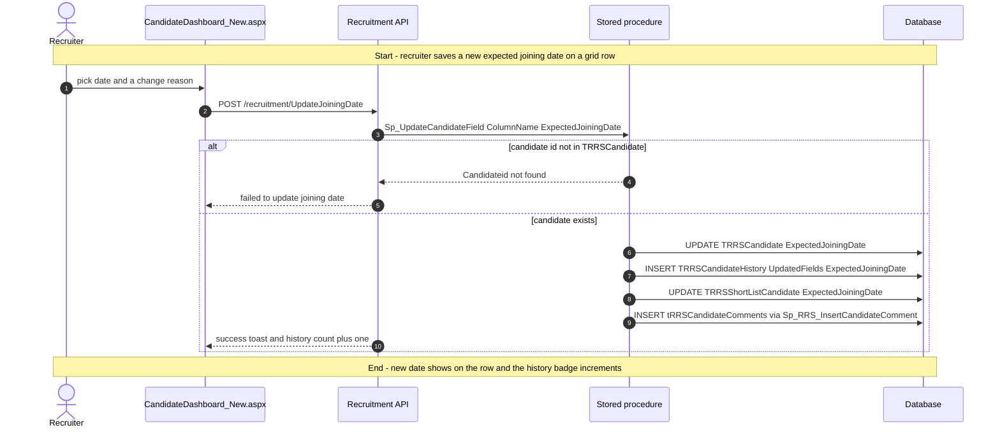
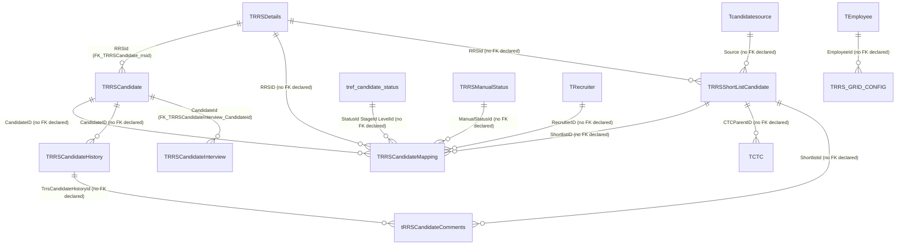

# Candidate Dashboard

## Overview

A recruiter (or recruitment admin) opens **Recruitment → Candidate Dashboard** when they need one working list of people already in the hiring pipeline — not sourced leads, not interview slots, but shortlisted candidates mapped to a requisition. The page is a filterable grid, not a count card: they narrow by recruiter, candidate status, in-process RRS, and a date window (default last 30 days), then work the row. Clicking a name encrypts the shortlist id and opens the Add / View Candidate overlay on the same shell. Clicking an RRS number opens the requisition form in view mode. TAT, attachment, and conversation icons open the shared right-side drawer for that shortlist.

Two inline edits stay on the grid. **Candidate Pipeline Status** is a per-employer manual status (not the workflow stage/status/level). Only a recruitment admin, or the recruiter assigned on that mapping, can change it. **Expected Joining Date** always asks for a reason from `TRRSChangeDateReason` and writes a history row plus a comment. **Actual Joining Date** can be changed only when the candidate's stored status is `NotifiedForJoining` or `RevisedNotifiedForJoining` / `RevisedNotifiedforJoining`. CTC columns (CCTC / ECTC / Negotiated CTC) are blanked when the row's business unit is not in the viewer's CTC-access list.

**Who's involved:**

- **Recruiter** — default audience. When `roleName` is `recruiter` and the page was not opened from an RRS redirect, the recruiter dropdown starts on that person's `RecruiterId`. They can edit pipeline status and joining dates only for mappings where they are the assigned recruiter.
- **Recruitment admin** — same grid, plus edit rights on every row. Detected by `getEmployeeListAsRoleType` with `roleType` `recruitmentadmin`, not by the session role name alone.
- **Hiring manager / other roles** — if they can open the menu they can view the grid. The grid procedure treats RecruitmentAdmin, Administrator, and anyone in `TRecruiter` as full-access; everyone else only sees requisitions whose hiring manager is in their direct/indirect reportee tree, further limited by `Sp_RRS_GetRecruitmentPermissions`.
- **Global-access user** (`IsGlobalAccess = Y`) — organisation multi-select. The picker remaps `candidateDashboard_Grid` to `recruitmentDashboard_Grid` (shared with the other recruitment dashboards). The grid query then passes those employer ids in.

There is **no** `llm-wiki/domain` lifecycle page for this dashboard. Table one-liners live in `llm-wiki/reference/tables/hrms.md`. The wiki still describes `TRRSCandidate` as the candidate master (with declared FK `FK_TRRSCandidate_rrsid`); live grid rows are `TRRSCandidateMapping` joined to `TRRSShortListCandidate` and optionally `TRRSCandidate`. Expected-joining history lives in `TRRSCandidateHistory`, which is not catalogued in that wiki page. This guide is the application call chain those catalogs do not cover.

Sibling left-nav items **Recruitment Dashboard**, **RRS Dashboard**, **Sourcing Dashboard**, **Shortlisting Dashboard**, **Interview Dashboard**, **Candidate Referral**, **Resume Bank**, **Notifications**, and **Candidate Login Link** are separate menu pages. Add / View Candidate and the RRS form are overlays this screen opens; they are not this menu item. `SSPCandidateDashboard.aspx` is a separate self-service shell (`Sp_RRS_GetCandidateDashboardSSP`) and is not this menu item.

## Workflow

```mermaid
flowchart TD
  Nav["Recruitment left-nav Candidate Dashboard"] --> ASPX["CandidateDashboard_New.aspx"]
  ASPX --> SPA["CandidateDashboard React component"]

  SPA --> Reason["GET /recruitment/GetChangeDateReason"]
  Reason --> ReasonSP["GetTRRSChangeDateReason"]
  ReasonSP --> ReasonT[("TRRSChangeDateReason")]

  SPA --> Ctc["GET /dashBoard/GetCTCAccessEmployeeData"]
  Ctc --> CtcSP["USP_EmployeeAccessPermission_List"]

  SPA --> GridFmt["GET /recruitment/getGridConfig"]
  GridFmt --> GridFmtSP["SP_RRS_GetGridConfig"]
  GridFmtSP --> GridCfg[("TRRS_GRID_CONFIG")]

  SPA --> RrsList["GET /recruitment/getRRSIdsInProcess"]
  RrsList --> RrsSP["SP_RRS_GetInprocessRRS"]
  RrsSP --> RRS[("TRRSDetails")]

  SPA --> Manual["GET /recruitment/GetCustomerManualApprovalSettings"]
  Manual --> ManualSP["USP_GetCustomerManualApprovalSettings"]

  SPA --> Rec["GET /recruitment/getRecruitersList"]
  Rec --> RecSP["Sp_GetRecruiterMstr"]
  RecSP --> RecT[("TRecruiter")]

  SPA --> Admin["GET /recruitment/getEmployeeListAsRoleType"]
  Admin --> AdminSP["SP_GetEmployeeListAsRoleType"]

  SPA --> Status["GET /recruitment/getCandidateStatusFromMaster"]
  Status --> StatusSP["SP_RRS_GetCandidateStatusFromMaster"]
  StatusSP --> StatusT[("tref_candidate_status / tref_candidate_status_custom")]

  SPA --> Org["GET /recruitment/getOrganizationList"]
  Org --> OrgSP["SP_AdminRM_GetGlobalAccessEmployerList"]
  OrgSP --> GridCfg
  Org -->|"save selection"| SaveOrg["POST recruitment/insertMultiOrg"]
  SaveOrg --> SaveOrgSP["Sp_RRS_InsertMultiOrg"]
  SaveOrgSP --> GridCfg

  Org --> Pipe["GET /recruitment/GetPipeplineStatus"]
  Pipe --> PipeSP["Sp_GetActiveTRRSManualStatus"]
  PipeSP --> PipeT[("TRRSManualStatus")]

  SPA --> Grid["GET /recruitment/getCandidateDetails"]
  Grid --> GridSP["SP_RRS_GetCandidateDashboardNEW"]
  GridSP --> Map[("TRRSCandidateMapping")]
  GridSP --> Short[("TRRSShortListCandidate")]
  GridSP --> Cand[("TRRSCandidate")]
  GridSP --> RRS
  GridSP --> CtcT[("TCTC")]
  GridSP --> Hist[("TRRSCandidateHistory")]
  GridSP --> Perm["Sp_RRS_GetRecruitmentPermissions"]

  Grid -->|"click candidate name"| Enc["GET api/recruitment/encryptvalue"]
  Enc --> ViewCand["CandidateDetails overlay"]

  Grid -->|"click RRS number"| ViewRrs["RRSform overlay"]

  Grid -->|"pipeline dropdown"| UpdPipe["POST /recruitment/UpdatePipelineStatus"]
  UpdPipe --> UpdPipeSP["Sp_Update_ManualStatus"]
  UpdPipeSP --> Map

  Grid -->|"save expected joining date"| UpdEdj["POST /recruitment/UpdateJoiningDate"]
  UpdEdj --> UpdEdjSP["Sp_UpdateCandidateField"]
  UpdEdjSP --> Cand
  UpdEdjSP --> Short
  UpdEdjSP --> Hist
  UpdEdjSP --> CmtT[("tRRSCandidateComments")]

  Grid -->|"change actual joining date"| UpdAdj["POST /recruitment/UpdateJoiningDate"]
  UpdAdj --> UpdEdjSP

  Grid -->|"open conversation drawer"| Cmt["GET /recruitment/getCandidateComments"]
  Cmt --> CmtSP["Sp_RRS_GetCandidateComment"]
  CmtSP --> CmtT
  Cmt -->|"post comment"| AddCmt["POST /recruitment/insertCandidateComments"]
  AddCmt --> AddCmtSP["Sp_RRS_InsertCandidateComment"]
  AddCmtSP --> CmtT

  Grid -->|"save column order"| SaveGrid["POST /recruitment/setGridConfig"]
  SaveGrid --> SaveGridSP["SP_RRS_InsertGridConfig"]
  SaveGridSP --> GridCfg
```

The grid procedure also returns a second result set of expected-joining history counts (`TRRSCandidateHistory` grouped by candidate). Recruiter / Administrator / `TRecruiter` users skip the hiring-manager reportee filter. Source channel comes from `Tcandidatesource` on the shortlist row. Pipeline options fall back to `TRRSManualStatus` rows with `EmployerId = 0` when the session employer has none.

## Request journey

The page loads lookups first, but the characteristic write is **saving an expected joining date**. That request starts with a recruiter or recruitment admin picking a new date and a reason, and ends with `TRRSCandidate.ExpectedJoiningDate` (and the matching shortlist column) plus a `TRRSCandidateHistory` row.

Pipeline-status changes are a smaller write on the same grid (`Sp_Update_ManualStatus` sets `TRRSCandidateMapping.ManualStatusId`) and do not toast. Actual joining date uses the same `UpdateJoiningDate` route with `type` `ActualDoj`, which the DAL maps to column `Doj`; that path does not write history or a comment.

## Entry points

> `CandidateDashboard_New.aspx` is the live Recruitment → Candidate Dashboard shell (`TMenuHierarchy` menu id `74` under parent `69`, `AppConstants.CNST_CANDIDATE_DASHBOARD`). Shared constant `URL_RECRUITMENT_CANDIDATE_DASHBOARD` / `URL_RRS_CANDIDATEDASHBOARD` points at this page. The React router in `routes.js` mounts `CandidateDashboardContainer` at `RouteConstants.CANDIDATE_DASHBOARD`. The older WebForms `HRM/Recruitment/CandidateDashboard.aspx` is still compiled (`RouteConstants.CANDIDATE_DASHBOARD_OLD`) and still calls `Sp_RRS_GetCandidateDashboard` through `CandidateDAL`. `SSPCandidateDashboard.aspx` is a separate route.

| UI page / route | Purpose |
|---|---|
| `/HRM/Recruitment_React/CandidateDashboard_New.aspx` | Main Candidate Dashboard. Stamps employee, employer, role, global-access, optional decrypted `candId`, email, and BU label into hidden fields, then loads `BuildJS/recruitment.min.js`. Logs activity `CandidateDashboard` (enum `394`). |
| Query `Filter`, `RRSId`, `countFlag`, `RRSIdRedirected`, `viewRRSStatus`, `JobLocation` | Opened from View RRS / Recruitment Dashboard with a status or RRS pre-filter. `countFlag` clears the date window and keeps rows whose `StatusName` matches `viewRRSStatus`. |
| `/HRM/Recruitment_React/CandidateDashboard_New.aspx` CandidateDetails overlay | Opened from a grid name click (`ShortlistID` encrypted). Not a separate menu item. |
| `/HRM/Recruitment_React/CandidateDashboard_New.aspx` RRSform overlay | Opened from an RRS number click (`mode=vw`). Hidden when manual-approval is on and the row has no job location. |
| `/HRM/Recruitment/CandidateDashboard.aspx` | Legacy WebForms charts + grid. Uses `CandidateDAL` / `Sp_RRS_GetCandidateDashboard`. Not wired in the React router. |
| `/HRM/Recruitment_React/SSPCandidateDashboard.aspx` | SSP / hiring-manager shell (`Sp_RRS_GetCandidateDashboardSSP`). Separate route `SSP_CANDIDATE_DASHBOARD`. |
| Right-side `RightPanel` modal | Conversation / attachment / TAT drawer for one `ShortListId` and `CandidateId`. Shared recruitment drawer, not a separate route. |

`CandidateDashboard_New.aspx.cs` only reads session values and decrypts optional query `candId`; feature logic lives in `candidate-dashboard.js` and the Node / .NET APIs. Encrypt for navigation uses the .NET Web API, not the Node app. View RRS can call `getHasAccessToCandidateDashboard` before linking here; this page itself does not.

## Code → database call chain

The live SPA constants for this page resolve to `/recruitment/...` routes (and `/dashBoard/...` for CTC access). The older `/v2/recruitment/...` and `/v3/recruitment/...` variants remain in `apiURLConstants.js`, but the duplicate keys later in the file make the plain `/recruitment/...` versions the ones this bundle uses. `routeIndex.js` mounts only `RecruitmentRoutes.js` at `/recruitment`.

| Entry point | DAL / BLL method (`file:line`) | Stored procedure |
|---|---|---|
| Page load — EDOJ reason list | `GetChangeDateReason` (`recruitmentController.js:5048`, `recruitmentDAL.js:9824`) | `GetTRRSChangeDateReason` |
| Page load — CTC-visible business units | `GetCTCAccessEmployeeData` (`dashboardController.js:2883`, `dashBoardDAL.js:4300`) | `USP_EmployeeAccessPermission_List` |
| Page load — saved column order | `GetGridConfig` (`recruitmentController.js:2523`, `recruitmentDAL.js:6642`) | `SP_RRS_GetGridConfig` |
| Page load — in-process RRS dropdown | `GetRRSIdsInProcess` (`recruitmentController.js:3567`, `recruitmentDAL.js:9271`) | `SP_RRS_GetInprocessRRS` |
| Page load — whether RRS overlay needs job location | `GetCustomerManualApprovalSettings` (`recruitmentController.js:3184`, `recruitmentDAL.js:8376`) | `USP_GetCustomerManualApprovalSettings` |
| After dates — recruiter dropdown and `isRecruiter` | `GetRecruitersList` (`recruitmentController.js:803`, `recruitmentDAL.js:2396`) | `Sp_GetRecruiterMstr` |
| After dates — `isRecruitmentAdmin` | `GetEmployeeListAsRoleType` (`recruitmentController.js:3882`, `recruitmentDAL.js:9728`) | `SP_GetEmployeeListAsRoleType` |
| After recruiters — status dropdown | `GetCandidateStatusFromMaster` (`recruitmentController.js:2667`, `recruitmentDAL.js:6958`) | `SP_RRS_GetCandidateStatusFromMaster` |
| Before grid — organisation ids (and pipeline list) | `GetOrganizationList` (`recruitmentController.js:233`, `recruitmentDAL.js:943`) | `SP_AdminRM_GetGlobalAccessEmployerList` |
| After parent org — pipeline dropdown | `GetCandidatePipelineStatus` (`recruitmentController.js:5017`, `recruitmentDAL.js:9754`) | `Sp_GetActiveTRRSManualStatus` |
| Search / first load — main grid | `GetCandidateDetails` (`recruitmentController.js:875`, `recruitmentDAL.js:2585`) | `SP_RRS_GetCandidateDashboardNEW` (internally also `Sp_RRS_GetRecruitmentPermissions`) |
| Save organisation selection | `InsertMultiOrg` (`recruitmentController.js:2459`, `recruitmentDAL.js:6488`) | `Sp_RRS_InsertMultiOrg` |
| Click candidate name — encrypt shortlist id | `EncryptValue` (`HRMS.Shared/HRMS.WebAPI/Controllers/RecruitmentController.cs:550`) | none (in-process encryption) |
| Pipeline dropdown | `UpdatePipelineStatus` (`recruitmentController.js:5027`, `recruitmentDAL.js:9777`) | `Sp_Update_ManualStatus` |
| Expected or actual joining date | `UpdateJoiningDate` (`recruitmentController.js:5038`, `recruitmentDAL.js:9795`) | `Sp_UpdateCandidateField` (EDOJ also `Sp_RRS_InsertCandidateComment`) |
| History badge on expected joining date | `GetCandidateHistory` (`recruitmentController.js:5058`, `recruitmentDAL.js:9848`) | `SP_CandidateJoiningDateHistory` |
| Save column order | `SetGridConfig` (`recruitmentController.js:2532`, `recruitmentDAL.js:6657`) | `SP_RRS_InsertGridConfig` |
| Drawer — comment list | `GetCandidateComments` (`recruitmentController.js:979`, `recruitmentDAL.js:2996`) | `Sp_RRS_GetCandidateComment` |
| Drawer — add comment | `InsertCandidateComments` (`recruitmentController.js:988`, `recruitmentDAL.js:3021`) | `Sp_RRS_InsertCandidateComment` |

There is **no BLL layer** on the Node path. The WebForms code-behind does not make data-access calls. `GET_CANDIDATE_DASHBOARD_LIST` / `GetCandidateDashboard` / `Sp_RRS_GetCandidateDashboard` remains on the Node and .NET DALs and is not called from `candidate-dashboard.js`. `GetCandidateDetailsNew` (`/recruitment/GetCandidateDetailsNew`) runs the same procedure but is unused by this page.

## API endpoints

| Verb | Route | Parameters | Purpose | Source |
|---|---|---|---|---|
| `GET` | `/recruitment/GetChangeDateReason` | query `employerId` (int, required) | EDOJ reason dropdown (`label` / `isShowComment`) | `RecruitmentRoutes.js:357`, `recruitmentController.js:5048` |
| `GET` | `/dashBoard/GetCTCAccessEmployeeData` | query `employerId` (int, required), `EmployeeAccessPermissionID` (this page `null`), `employeeId` | Business-unit ids whose CTC this user may see | `DashBoardRoutes.js:260`, `dashboardController.js:2883` |
| `GET` | `/recruitment/getGridConfig` | query `employerId`, `employeeId` (sent; live controller uses `req.EID`), `gridId` (this page `CandidateDashboard_Grid`) | Saved `GridFormat` column order | `RecruitmentRoutes.js:214`, `recruitmentController.js:2523` |
| `GET` | `/recruitment/getRRSIdsInProcess` | query `employerId` (int, required) | In-process RRS dropdown | `RecruitmentRoutes.js:312`, `recruitmentController.js:3567` |
| `GET` | `/recruitment/GetCustomerManualApprovalSettings` | query `employerId` (int, required) | `IsManualApproval` for the RRS overlay | `RecruitmentRoutes.js:278`, `recruitmentController.js:3184` |
| `GET` | `/recruitment/getRecruitersList` | query `employerid` (int, required), `isactive` (this page `true`), `employeeId` (optional in signature; this page omits it) | Recruiter multi-select and `isRecruiter` | `RecruitmentRoutes.js:72`, `recruitmentController.js:803` |
| `GET` | `/recruitment/getEmployeeListAsRoleType` | query `employerId` (int, required), `roleType` (this page `recruitmentadmin`) | Detect recruitment-admin edit rights | `RecruitmentRoutes.js:352`, `recruitmentController.js:3882` |
| `GET` | `/recruitment/getCandidateStatusFromMaster` | query `employerId` (int, required), `dashboard` (this page `Candidate`) | Status multi-select (`Type = 'Status'`) | `RecruitmentRoutes.js:230`, `recruitmentController.js:2667` |
| `GET` | `/recruitment/getOrganizationList` | query `employeeId` (sent by caller; live controller uses `req.EID`), `gridId` (`getEmployerIds` uses `recruitmentDashboard_Grid`; picker remaps `candidateDashboard_Grid` to the same) | Organisations and saved selection for global-access users | `RecruitmentRoutes.js:22`, `recruitmentController.js:233` |
| `GET` | `/recruitment/GetPipeplineStatus` | query `employerId` (int, required; parent org id when global access) | Manual pipeline-status options | `RecruitmentRoutes.js:354`, `recruitmentController.js:5017` |
| `GET` | `/recruitment/getCandidateDetails` | query `employeeid`, `employerid`, `candidateStatus`, `multiOrg`, `recruiterIds`, `fromDate`, `toDate`, `EmployerIds`, `RRSId`, `JobLocationId` | Main grid. Procedure also returns EDOJ history counts as a second result set | `RecruitmentRoutes.js:80`, `recruitmentController.js:875` |
| `POST` | `recruitment/insertMultiOrg` | body `employeeId`, `gridId`, `configType` (`employerDropdown`), `config` (comma-separated employer ids) | Persist the organisation picker. Live constant has no leading `/` | `RecruitmentRoutes.js:207`, `recruitmentController.js:2459` |
| `GET` | `api/recruitment/encryptvalue` | query `value` (string, required; shortlist id) | Encrypt id for the CandidateDetails overlay. .NET Web API via `APIHelper.getNetApi`, not Node | `HRMS.WebAPI/Controllers/RecruitmentController.cs:550` |
| `POST` | `/recruitment/UpdatePipelineStatus` | body `employerId`, `statusId`, `candidateMappingId` | Set `ManualStatusId` on the mapping | `RecruitmentRoutes.js:355`, `recruitmentController.js:5027` |
| `POST` | `/recruitment/UpdateJoiningDate` | body `date`, `type` (`ExpectedJoiningDate` or `ActualDoj`), `candidateId`, `employeeId`, optional `comment`, optional `createdForPage` (EDOJ sends `Candidate Dashboard`) | Update expected or actual joining date | `RecruitmentRoutes.js:356`, `recruitmentController.js:5038` |
| `GET` | `/recruitment/GetCandidateHistory` | query `candidateId` (int, required) | EDOJ history popup | `RecruitmentRoutes.js:358`, `recruitmentController.js:5058` |
| `POST` | `/recruitment/setGridConfig` | body `EmployerId`, `EmployeeId`, `PageName` (`CandidateDashboard_Grid`), `ConfigType` (`GridFormat`), `Config` (column id array) | Persist column order | `RecruitmentRoutes.js:215`, `recruitmentController.js:2532` |
| `GET` | `/recruitment/getCandidateComments` | query `shortlistid`, `employerid`, `candidateId`, `SourceId` (this page null) | Drawer comment list | `RecruitmentRoutes.js:89`, `recruitmentController.js:979` |
| `POST` | `/recruitment/insertCandidateComments` | body `candidateid`, `shortlistid`, `SourceId`, `comment`, `createdBy`, `createdForPage` (this page `Candidate Dashboard`), `employerId` | Insert a drawer comment | `RecruitmentRoutes.js:90`, `recruitmentController.js:988` |

This feature has Node recruitment routes, one dashboard CTC GET, and one .NET encrypt GET. There are no PageMethods on the React shell.

## Stored procedures & tables involved

> Live dashboard rows are in core **`HRMS`**. `SP_RRS_GetCandidateDashboardNEW` reads `TRRSCandidateMapping` / `TRRSShortListCandidate` / `TRRSCandidate`. The older `Sp_RRS_GetCandidateDashboard` is the WebForms / unused Node `getCandidateDashboard` path. `Sp_RRS_GetCandidateDashboardSSP` is the SSP sibling. Table meanings reuse `llm-wiki/reference/tables/hrms.md` where a row exists.

| Object | File path | Purpose | llm-wiki |
|---|---|---|---|
| `TRRSCandidateMapping` | `HRMS-DATABASE/HRMS/TABLES/TRRSCandidateMapping.sql` | Live grid grain (`CandidateMappingID`). Recruiter, stage/status/level, `ManualStatusId`. No FK declared | `llm-wiki/reference/tables/hrms.md` |
| `TRRSShortListCandidate` | `HRMS-DATABASE/HRMS/TABLES/TRRSShortListCandidate.sql` | Name, source date, experience, CTC currencies, EDOJ mirror. PK only; no FK declared | `llm-wiki/reference/tables/hrms.md` |
| `TRRSCandidate` | `HRMS-DATABASE/HRMS/TABLES/TRRSCandidate.sql` | Candidate master. EDOJ / `Doj` write target. Declared FK `FK_TRRSCandidate_rrsid` | `llm-wiki/reference/tables/hrms.md` |
| `TRRSCandidateHistory` | `HRMS-DATABASE/HRMS/DDL/100339/1-CreateTable.sql` | EDOJ audit (`UpdatedFields = ExpectedJoiningDate`). PK `HistoryId` only; no FK declared | — |
| `TRRSChangeDateReason` | `HRMS-DATABASE/HRMS/DDL/100339/TRRSChangeDateReason.sql` | EDOJ reason master per employer, with `EmployerId = 0` fallback. PK `ReasonId` only | — |
| `TRRSManualStatus` | `HRMS-DATABASE/HRMS/TABLES/TRRSManualStatus.sql` | Pipeline-status master. PK `StatusID`; `StatusName` unique. No FK declared | `llm-wiki/reference/tables/hrms.md` |
| `TRRSDetails` | `HRMS-DATABASE/HRMS/TABLES/TRRSDetails.sql` | Requisition joined for title, number, BU, hiring manager, in-process dropdown | `llm-wiki/reference/tables/hrms.md` |
| `tref_candidate_status` / `tref_candidate_status_custom` | catalogued in wiki | Stage / status / level labels. Status filter uses `Type = 'Status'` | `llm-wiki/reference/tables/hrms.md` |
| `Tcandidatesource` | `HRMS-DATABASE/HRMS/TABLES/Tcandidatesource.sql` | Source-channel label on the grid | `llm-wiki/reference/tables/hrms.md` |
| `TRecruiter` | catalogued in wiki | Recruiter master; also flips the procedure's full-access flag | `llm-wiki/reference/tables/hrms.md` |
| `TRRS_GRID_CONFIG` | catalogued in wiki | Saved organisation picker (`employerDropdown`) and column order (`GridFormat`) | `llm-wiki/reference/tables/hrms.md` |
| `tRRSCandidateComments` | catalogued in wiki | Drawer comments and EDOJ reason text (`TrrsCandidateHistoryId`) | `llm-wiki/reference/tables/hrms.md` |
| `TCTC` | used by `SP_RRS_GetCandidateDashboardNEW` | Encrypted current / expected / negotiated CTC (`CTCParentID` = shortlist id) | — |
| `TRRSCandidateInterview` / `TInterviewLevel` | catalogued in wiki | Interview-level column on the grid | `llm-wiki/reference/tables/hrms.md` |
| `TRRSShortlistCandidateSkillDet` / `TRRSSkillDetails` / `TMSkills` | catalogued in wiki | Skills and mandatory-skill columns | `llm-wiki/reference/tables/hrms.md` |
| `TLocation` / `TOrgHierarchyDetails` / `TTitle` / `TEmployerDetails` | catalogued in wiki | Job location, BU name, position title, organisation name | `llm-wiki/reference/tables/hrms.md` |
| `SP_RRS_GetCandidateDashboardNEW` | `HRMS-DATABASE/HRMS/STOREPROCEDURE/SP_RRS_GetCandidateDashboardNEW.sql` | Grid query plus EDOJ history-count result set | — |
| `Sp_UpdateCandidateField` | `HRMS-DATABASE/HRMS/STOREPROCEDURE/Sp_UpdateCandidateField.sql` | EDOJ / `Doj` update; EDOJ writes history and a comment | — |
| `Sp_Update_ManualStatus` | `HRMS-DATABASE/HRMS/STOREPROCEDURE/Sp_Update_ManualStatus.sql` | Sets `TRRSCandidateMapping.ManualStatusId` | — |
| `GetTRRSChangeDateReason` | `HRMS-DATABASE/HRMS/STOREPROCEDURE/GetTRRSChangeDateReason.sql` | EDOJ reasons | — |
| `SP_CandidateJoiningDateHistory` | `HRMS-DATABASE/HRMS/STOREPROCEDURE/SP_CandidateJoiningDateHistory.sql` | EDOJ history rows joined to comments | — |
| `Sp_GetActiveTRRSManualStatus` | `HRMS-DATABASE/HRMS/STOREPROCEDURE/Sp_GetActiveTRRSManualStatus.sql` | Active pipeline statuses | — |
| `SP_RRS_GetCandidateStatusFromMaster` | `HRMS-DATABASE/HRMS/STOREPROCEDURE/SP_RRS_GetCandidateStatusFromMaster.sql` | Status dropdown for `dashboard = Candidate` | — |
| `SP_RRS_GetInprocessRRS` | `HRMS-DATABASE/HRMS/STOREPROCEDURE/SP_RRS_GetInprocessRRS.sql` | In-process RRS list for the session employer | — |
| `Sp_GetRecruiterMstr` | `HRMS-DATABASE/HRMS/STOREPROCEDURE/Sp_GetRecruiterMstr.sql` | Recruiter list | — |
| `SP_GetEmployeeListAsRoleType` | `HRMS-DATABASE/HRMS/STOREPROCEDURE/` | Employees in role `recruitmentadmin` | — |
| `SP_AdminRM_GetGlobalAccessEmployerList` | `HRMS-DATABASE/HRMS/STOREPROCEDURE/SP_AdminRM_GetGlobalAccessEmployerList.sql` | Org list and saved selection | — |
| `Sp_RRS_InsertMultiOrg` | `HRMS-DATABASE/HRMS/STOREPROCEDURE/Sp_RRS_InsertMultiOrg.sql` | Upsert `TRRS_GRID_CONFIG` | — |
| `SP_RRS_GetGridConfig` / `SP_RRS_InsertGridConfig` | `HRMS-DATABASE/HRMS/STOREPROCEDURE/` | Column-order read / write | — |
| `USP_GetCustomerManualApprovalSettings` | `HRMS-DATABASE/HRMS/STOREPROCEDURE/` | Manual-approval flag | — |
| `USP_EmployeeAccessPermission_List` | `HRMS-DATABASE/HRMS/STOREPROCEDURE/` | CTC-access unit ids | — |
| `Sp_RRS_GetRecruitmentPermissions` | called from the grid procedure | BU-scoped claim filter | — |
| `Sp_RRS_GetCandidateComment` / `Sp_RRS_InsertCandidateComment` | `HRMS-DATABASE/HRMS/STOREPROCEDURE/` | Drawer comments | — |
| `Sp_RRS_GetCandidateDashboard` | `HRMS-DATABASE/HRMS/STOREPROCEDURE/Sp_RRS_GetCandidateDashboard.sql` | WebForms / unused Node `getCandidateDashboard` | — |
| `Sp_RRS_GetCandidateDashboardSSP` | called from `GetCandidateDetailsSSP` | SSP sibling only | — |
| `Sp_GetRrsCandidateDashboard` / `Sp_RRS_GetMgrCandidateDashboard` / `Sp_GetRrsMgrCandidateDashboard` | `HRMS-DATABASE/HRMS/STOREPROCEDURE/` | On disk; no SourceCode caller found from this page | — |

## Table relationships

The project does not have a candidate-dashboard ER diagram to reuse, so this diagram is derived from `llm-wiki/reference/tables/hrms.md` plus the procedure-level table usage above. Where the catalog or DDL does not declare a foreign key, the relationship is labelled as such instead of being invented.

## Known gaps

- There is **no** recruitment-specific canonical domain page in `llm-wiki/domain/`, and SourceCode `docs/SystemModels/SystemModel-2` has no Candidate Dashboard workflow page in this checkout. Behaviour above is from SourceCode + procedure scripts. `llm-wiki/domain/employee-lifecycle.md` only names recruitment as the candidate stage before employment.
- Live `TMenuDetails.NavigateURL` for menu `74` was not read from DEV. Shared constants already point at `CandidateDashboard_New.aspx`. The WebForms `CandidateDashboard.aspx` is still compiled.
- `GetCandidateDetails` (`recruitmentDAL.js`) returns only `data.recordset` (first result set as an array). The SPA reads `result.recordsets[0]` (grid) and `result.recordsets[1]` (EDOJ history counts). Sibling `GetCandidateDetailsNew` returns the full mssql result and is not the URL this page calls. The controller CTC-formatting loop also walks `data` as an array of rows, so it does not see a `recordsets` payload.
- `routeIndex.js` mounts only `RecruitmentRoutes.js` at `/recruitment`. `RecruitmentRoutes_V2.js` / `RecruitmentRoutes_V3.js` exist on disk and are not mounted. Duplicate keys in `apiURLConstants.js` leave the trailing `/recruitment/...` constants as the live SPA values.
- Organisation picker for this page **saves and reads** `TRRS_GRID_CONFIG` under grid id `recruitmentDashboard_Grid` (the dropdown remaps `candidateDashboard_Grid`). `SP_RRS_GetCandidateDashboardNEW` would fall back to `candidateDashboard_Grid` only when `EmployerIds` is null; the live page always passes `EmployerIds`. Column-order config uses a different id, `CandidateDashboard_Grid`.
- `INSERT_MULTIORG` in the live constants block is `recruitment/insertMultiOrg` (no leading `/`). Other live keys keep the leading slash.
- `GetGridConfig` ignores the SPA's `employeeId` query and uses `req.EID`. `GetOrganizationList` does the same.
- `GetRecruitersList` accepts `isactive` and `employeeId` in the controller signature, but the DAL only binds `@employerid` before executing `Sp_GetRecruiterMstr`.
- `SP_RRS_GetInprocessRRS` filters `EmployerId = @EmployerId` only, so the RRS dropdown is not multi-org.
- `onChangeActualJoiningDate` posts `UpdateJoiningDate` without `comment` or `createdForPage`. `Sp_UpdateCandidateField` for `Doj` does not write `TRRSCandidateHistory`.
- `UpdatePipelineStatus` has no success or failure toast; the dropdown updates local state immediately.
- `GetHasAccessToCandidateDashboard` / `SP_RRS_GetHasMenuAccessByUser` is called from View RRS, not from this page.
- `GET_CANDIDATE_DASHBOARD_LIST` (`/recruitment/getCandidateDashboard` → `Sp_RRS_GetCandidateDashboard`) is unused by this React page. `Sp_GetRrsCandidateDashboard`, `Sp_RRS_GetMgrCandidateDashboard`, and `Sp_GetRrsMgrCandidateDashboard` are on disk with no caller from this page.
- Shared `RightPanel` can call further recruitment endpoints (attachments, images, milestones, offer letters). This page mounts it with both `ShortListId` and `CandidateId` set.
- `TRRSCandidateHistory`, `TRRSChangeDateReason`, and `TCTC` are used by the live procedures and are not catalogued in `llm-wiki/reference/tables/hrms.md`.
- The ASPX `Inherits` attribute says `CandidateForShortlisting_New` while the code-behind class is `CandidateDashboard_New`.

## Reference

Confidence is **medium**: the live React page was traced to v1 DAL `file:line` and named procedures, plus the .NET encrypt call. Declared FKs come from table DDL (`FK_TRRSCandidate_rrsid`, `FK_TRRSCandidateInterview_Candidateid`). There is no domain `erDiagram` to reuse. Confidence is not high because live menu NavigateURL was not queried, the WebForms and SSP siblings are still present, and the grid API's `recordset` vs `recordsets` shape does not match the SPA.

### SourceCode

- `HRMS.Web/HRMS.Web/HRM/Recruitment_React/CandidateDashboard_New.aspx`
- `HRMS.Web/HRMS.Web/HRM/Recruitment_React/CandidateDashboard_New.aspx.cs`
- `HRMS.Web/HRMS.Web/HRM/Recruitment_React/Areas/routes.js`
- `HRMS.Web/HRMS.Web/HRM/Recruitment_React/Common/routeConstants.js`
- `HRMS.Web/HRMS.Web/HRM/Recruitment_React/Common/apiURLConstants.js`
- `HRMS.Web/HRMS.Web/HRM/Recruitment_React/Common/AppConstants.js`
- `HRMS.Web/HRMS.Web/HRM/Recruitment_React/Areas/Candidate/Containers/candidateDashboardContainer.js`
- `HRMS.Web/HRMS.Web/HRM/Recruitment_React/Areas/Candidate/Components/candidate-dashboard.js`
- `HRMS.Web/HRMS.Web/HRM/Recruitment_React/Areas/Candidate/Components/candidate-custom-component.js`
- `HRMS.Web/HRMS.Web/HRM/Recruitment_React/SharedComponent/UI/OrganizationMultiSelectDropDown/organizationMultiSelectDropDown.js`
- `HRMS.Web/HRMS.Web/HRM/Recruitment_React/SharedComponent/UI/Grid/grid.js`
- `HRMS.Web/HRMS.Web/HRM/Recruitment_React/Areas/RightPanel.js`
- `HRMS.Web/HRMS.Web/HRM/Recruitment/CandidateDashboard.aspx`
- `HRMS.Web/HRMS.Web/HRM/Recruitment_React/SSPCandidateDashboard.aspx`
- `HRMS.CoreAPI/HRMS.Core.WebAPI.Node/Routes/routeIndex.js`
- `HRMS.CoreAPI/HRMS.Core.WebAPI.Node/Routes/RecruitmentRoutes.js`
- `HRMS.CoreAPI/HRMS.Core.WebAPI.Node/Routes/DashBoardRoutes.js`
- `HRMS.CoreAPI/HRMS.Core.WebAPI.Node/Controllers/recruitmentController.js`
- `HRMS.CoreAPI/HRMS.Core.WebAPI.Node/Controllers/dashboardController.js`
- `HRMS.CoreAPI/HRMS.Core.WebAPI.Node/Core/DataAccessLayer/recruitmentDAL.js`
- `HRMS.CoreAPI/HRMS.Core.WebAPI.Node/Core/DataAccessLayer/dashBoardDAL.js`
- `HRMS.Shared/HRMS.WebAPI/Controllers/RecruitmentController.cs`
- `HRMS.Shared/HRMS.DataAccessLayer/Recruitment/CandidateDAL.cs`

### TDG HRMS DB

- `llm-wiki/reference/tables/hrms.md`
- `llm-wiki/domain/employee-lifecycle.md`
- `HRMS-DATABASE/HRMS/TABLES/TRRSCandidate.sql`
- `HRMS-DATABASE/HRMS/TABLES/TRRSCandidateMapping.sql`
- `HRMS-DATABASE/HRMS/TABLES/TRRSShortListCandidate.sql`
- `HRMS-DATABASE/HRMS/TABLES/TRRSManualStatus.sql`
- `HRMS-DATABASE/HRMS/DDL/100339/1-CreateTable.sql`
- `HRMS-DATABASE/HRMS/DDL/100339/TRRSChangeDateReason.sql`
- `HRMS-DATABASE/HRMS/STOREPROCEDURE/SP_RRS_GetCandidateDashboardNEW.sql`
- `HRMS-DATABASE/HRMS/STOREPROCEDURE/Sp_RRS_GetCandidateDashboard.sql`
- `HRMS-DATABASE/HRMS/STOREPROCEDURE/Sp_UpdateCandidateField.sql`
- `HRMS-DATABASE/HRMS/STOREPROCEDURE/Sp_Update_ManualStatus.sql`
- `HRMS-DATABASE/HRMS/STOREPROCEDURE/GetTRRSChangeDateReason.sql`
- `HRMS-DATABASE/HRMS/STOREPROCEDURE/SP_CandidateJoiningDateHistory.sql`
- `HRMS-DATABASE/HRMS/STOREPROCEDURE/Sp_GetActiveTRRSManualStatus.sql`
- `HRMS-DATABASE/HRMS/STOREPROCEDURE/SP_RRS_GetCandidateStatusFromMaster.sql`
- `HRMS-DATABASE/HRMS/STOREPROCEDURE/SP_RRS_GetInprocessRRS.sql`
- `HRMS-DATABASE/HRMS/DML/DML TMenuDetails Notifications under Recruitment.sql`
