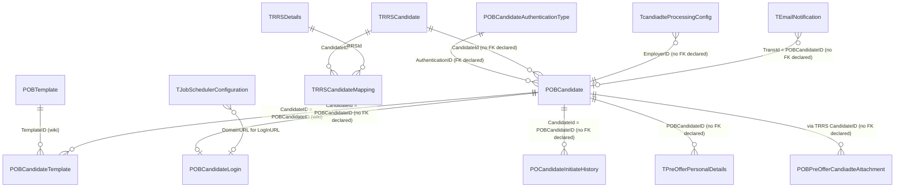

# Candidate Login Link

## Overview

A recruiter opens **Recruitment → Candidate Login Link** when a shortlisted person needs a portal URL so they can fill pre-offer information (and, when configured, accept an offer) without an HRMS employee account. The page is a two-tab work surface. **Initiation** is a form plus a grid of drafts, live links, and closed rows. The recruiter picks an RRS candidate who does not yet have a generated link, chooses a Recruitment Information Collection template (category 3) and/or an Offer Acceptance template (category 4), an authentication type (PAN, Aadhaar, passport, DL, mobile, SSN, and so on), a login value, an email, and a **Link Valid Till** date, then **Save** (status `Save`, shown as Draft) or **Initiate**. Initiate writes credentials, builds `HRM/PreOnBoarding/CandidateDashBoard.aspx` with AES-encrypted employer and auth-type query keys, stamps `TRRSCandidate.IsLoginLinkGenerated`, and queues `CandidateLinkInitiation` / `CandidateLinkInitiateToRecruiter` emails. From the grid they can initiate a draft, resend an initiated row, force-close (status `Force Closed`, link expiry set to yesterday), or open history.

**Review** is the inbound queue for links that have already been initiated. Filter checkboxes slice the same list into Initiated, Pending For Review (`Submitted`), Refill, Approved, and Closed / Force Closed. On a submitted row the recruiter can view the candidate-info template, approve, ask for a refill (blocked when the link has expired), force-close, or extend validity. They can also fill personal and document sections on the candidate’s behalf and submit as the recruiter (`Submitted by recruiter`).

The page does not open at all until `TcandiadteProcessingConfig` is loaded. If both `IsCandidateInfoTemplate` and `IsOfferAcceptanceTemplate` are false, the shell shows **Access Denied** and asks the user to set up Template Master. The Review tab is rendered only when the candidate-info flag is true.

**Who's involved:**

- **Recruiter** — default audience. They create the link, resend it, review submitted details, approve or refill, and close expired or abandoned rows.
- **Candidate** — not a user of this menu. They receive the queued email and sign in on `CandidateDashBoard.aspx` with the authentication value as username and a generated password.
- **Administrator** — configures `TcandiadteProcessingConfig` and the POB templates / authentication types this page reads. There is no extra recruiter-only gate in the SPA beyond the menu and that config.
- **Hiring manager / workflow recipients** — named on workflows `CandidateLinkInitiateToRecruiter`, `CandidateSubmitToRecruiter`, `CandidateRefillToRecruiter`, and `CandidateFilledByRecruiterToRecruiter`. They are not a screen here; they get `TEmailNotification` rows.

There is **no** `llm-wiki/domain` lifecycle page for this menu. Table one-liners live in `llm-wiki/reference/tables/hrms.md` (`POBCandidate`, `POBCandidateLogin`, `POBCandidateTemplate`, `POBTemplate`, `POBCandidateAuthenticationType`, `TcandiadteProcessingConfig`). Email queue and workflow lookup reuse `llm-wiki/domain/approval-workflow.md`. SourceCode `docs/SystemModels/SystemModel-2` has no workflow for this item; the recruitment context page covers WebForms `HRM/Recruitment/` and excludes the React recruitment apps. This guide is the application call chain those catalogs do not cover.

Sibling left-nav items **Recruitment Dashboard**, **RRS Dashboard**, **Sourcing Dashboard**, **Shortlisting Dashboard**, **Interview Dashboard**, **Candidate Referral**, **Candidate Dashboard**, **Resume Bank**, and **Notifications** are separate menu pages. The candidate portal `HRM/PreOnBoarding/CandidateDashBoard.aspx` is the login URL this page generates; it is not this menu item. `PreOfferPersonalInfo` and `PreOfferDocument` on the Review tab are the same field-level overlays the portal uses; their section CRUD is not expanded in the tables below.

## Workflow

```mermaid
flowchart TD
  Nav["Recruitment left-nav Candidate Login Link"] --> ASPX["CandidateLoginLink.aspx"]
  ASPX --> SPA["candidateLoginLinkContainer"]

  SPA --> Cfg["GET /preonboarding/GetCandiadteProcessingConfig"]
  Cfg --> CfgSP["USP_GetCandiadteProcessingConfig"]
  CfgSP --> CfgT[("TcandiadteProcessingConfig")]

  Cfg -->|"both template flags false"| Denied["Access Denied"]
  Cfg -->|"else"| Tabs["Initiation and optional Review tabs"]

  Tabs --> Init["InitiateLoginLinkFromRecruitment"]
  Tabs -->|"IsCandidateInfoTemplate"| Rev["ReviewLinkFromRecruitment"]

  Init --> GridFmt["GET /recruitment/getGridConfig"]
  GridFmt --> GridFmtSP["SP_RRS_GetGridConfig"]
  GridFmtSP --> GridCfg[("TRRS_GRID_CONFIG")]

  Init --> Pick["GET /preonboarding/preOfferCandidateList"]
  Pick --> PickSP["USP_PreOffer_Candidate_List"]
  PickSP --> RrsCand[("TRRSCandidate")]

  Init --> Tpl["GET /preonboarding/GetPOBAllTemplate"]
  Tpl --> TplSP["SP_GetAllTemplates"]
  TplSP --> TplT[("POBTemplate")]

  Init --> Auth["GET /preonboarding/GetAuthenticationOptionList"]
  Auth --> AuthSP["Sp_GetAuthenticationOptionList"]
  AuthSP --> AuthT[("POBCandidateAuthenticationType")]

  Init --> List["GET /preonboarding/GetPOCandidateInfoNew"]
  List --> ListSP["USP_GetPOCandidateInitiateInfo"]
  ListSP --> POB[("POBCandidate")]
  ListSP --> Login[("POBCandidateLogin")]
  ListSP --> MapT[("POBCandidateTemplate")]
  ListSP --> TplT
  ListSP --> Map[("TRRSCandidateMapping")]
  ListSP --> RRS[("TRRSDetails")]

  Init -->|"select RRS candidate"| Det["GET /preonboarding/GetselectCandidateDetails"]
  Det --> DetSP["Sp_RRS_GetselectCandidateDetails"]
  DetSP --> RrsCand
  DetSP --> POB

  Init -->|"Save or delete"| Save["POST /preonboarding/InsertUpdatePOCandidateInitiateInfo"]
  Save --> SaveSP["USP_InsertUpdatePOCandidateInitiateInfo"]
  SaveSP --> POB
  SaveSP --> MapT
  SaveSP --> Login
  SaveSP --> HistSP["USP_UpdatePOCandidateInitiatetatus"]
  HistSP --> Hist[("POCandidateInitiateHistory")]

  Init -->|"Initiate or resend"| LoginApi["POST /preonboarding/InsUpdatePOBCandidateLoginNew"]
  LoginApi --> LoginSP["USP_InsUpdatePOCandidateInitiateLogin"]
  LoginSP --> Login
  LoginSP --> POB
  LoginSP --> RrsCand
  LoginSP --> Mail[("TEmailNotification")]
  LoginSP --> HistSP

  Init -->|"Force Close"| CloseI["POST /preonboarding/updateCandidateByStatus"]
  CloseI --> RecSP["USP_UpdatePOBPreOfferRecruierStatus"]
  RecSP --> POB
  RecSP --> Login
  RecSP --> Hist

  Init --> HistGet["GET /preonboarding/getPOBCandidateReviewHistory"]
  HistGet --> HistListSP["USP_POCandidateInitiateHistory_List"]
  HistListSP --> Hist

  Rev --> RevList["GET /preonboarding/getPOCandidateInitiateReviewList"]
  RevList --> RevSP["USP_GetPOCandidateInitiateReviewList"]
  RevSP --> POB
  RevSP --> Login
  RevSP --> MapT
  RevSP --> TplT
  RevSP --> RrsCand
  RevSP --> RRS

  Rev -->|"View"| ViewTpl["GET /preonboarding/GetViewTemplateDetails"]
  ViewTpl --> ViewSP["SP_GetTemplateDetailsByID"]
  ViewTpl --> FormsSP["SP_GetAllPOBTemplateForms"]

  Rev --> StatusGet["GET /preonboarding/GetPreOfferCandidateDeatilsStatus"]
  StatusGet --> StatusSP["SP_GetPOICCandidateDetailsStatus"]
  StatusSP --> Pers[("TPreOfferPersonalDetails")]
  StatusSP --> Att[("POBPreOfferCandiadteAttachment")]

  Rev -->|"submit as recruiter"| AttList["GET /preonboarding/GetPOBPreOfferCandidateAttachment"]
  AttList --> AttSP["SP_GetPOBPreOfferCandidateAttachment"]
  AttList --> Sub["POST /preonboarding/UpdatePreOfferCandidateStatus"]
  Sub --> SubSP["SP_UpdatePreOfferCandidateStatus"]
  SubSP --> POB
  SubSP --> Hist
  SubSP --> Mail

  Rev -->|"Approve, Refill, Force Close"| CloseI
  Rev -->|"extend validity"| Ext["POST /preonboarding/UpdateLinkValidity"]
  Ext --> ExtSP["USP_UpdatePOCandidateLinkExpand"]
  ExtSP --> Login
  ExtSP --> Hist
  Rev --> HistGet
```



## Request journey

```mermaid
sequenceDiagram
  autonumber
  actor Recruiter
  participant UI as Screen / SPA
  participant App as App / API
  participant SP as Stored procedure
  participant DB as Database

  Note over Recruiter,DB: Start - recruiter opens Candidate Login Link and initiates a portal URL
  Recruiter->>UI: open Recruitment Candidate Login Link
  UI->>App: GET GetCandiadteProcessingConfig
  App->>SP: USP_GetCandiadteProcessingConfig
  SP->>DB: read TcandiadteProcessingConfig
  alt both template flags false
    UI-->>Recruiter: Access Denied
  else templates configured
    Recruiter->>UI: pick RRS candidate, templates, auth, valid-till, then Initiate
    UI->>App: GET preOfferCandidateList
    App->>SP: USP_PreOffer_Candidate_List
    SP->>DB: TRRSCandidate rows with IsLoginLinkGenerated not 1
    UI->>App: POST InsertUpdatePOCandidateInitiateInfo
    App->>SP: USP_InsertUpdatePOCandidateInitiateInfo
    SP->>DB: insert or update POBCandidate, POBCandidateTemplate, POBCandidateLogin
    UI->>App: POST InsUpdatePOBCandidateLoginNew
    App->>SP: USP_InsUpdatePOCandidateInitiateLogin
    SP->>DB: write POBCandidateLogin URL and password
    SP->>DB: set TRRSCandidate.IsLoginLinkGenerated
    SP->>DB: queue CandidateLinkInitiation emails
    SP->>DB: set PreOfferStatus Initiated
    Note over Recruiter,DB: End - candidate can sign in until TillValidDate; recruiter sees Initiated
  end
```

A second journey on the same page is the recruiter acting on a submitted packet (approve, refill, or force-close). That path posts `updateCandidateByStatus` → `USP_UpdatePOBPreOfferRecruierStatus` and ends on `POBCandidate.PreOfferStatus` plus a `POCandidateInitiateHistory` row (and, for refill/submit, more `TEmailNotification` rows).

## Entry points

`docs/SystemModels/SystemModel-2` does not name a live entry point for this menu. The compiled React recruitment app mounts `CandidateLoginLink.aspx` from `routeConstants.CANDIADTE_LOGIN_LINK` (spelling as in source). No sibling WebForms page for this left-nav item was found.

| UI page / API endpoint | Purpose |
|---|---|
| `HRM/Recruitment_React/CandidateLoginLink.aspx` | WebForms shell. Logs `ActivityDescription.CandidateLoginLink` (397), stamps session hidden fields, optionally decrypts query `candId`, loads `BuildJS/recruitment.min.js`. |
| React route `CANDIADTE_LOGIN_LINK` → `candidateLoginLinkContainer` | Tabs. Loads processing config; **Initiation** always; **Review** when `IsCandidateInfoTemplate` is true. |
| `InitiateLoginLinkFromRecruitment` | Save / initiate / resend / force-close / history on drafts and live links. |
| `ReviewLinkFromRecruitment` | Review queue, view template, approve / refill / force-close, extend validity, submit-as-recruiter. |
| `HRM/PreOnBoarding/CandidateDashBoard.aspx` | Candidate portal URL written into `POBCandidateLogin.LogInURL` (not this menu). |

## Code → database call chain

| Entry point | DAL / BLL method (file:line) | Stored procedure |
|---|---|---|
| Container load | `preOnBoardingDAL.GetCandiadteProcessingConfig` (`preOnBoardingDAL.js:2658`) | `USP_GetCandiadteProcessingConfig` |
| Initiation grid column order | `recruitmentDAL.GetGridConfig` (`recruitmentDAL.js:6642`) | `SP_RRS_GetGridConfig` |
| Candidate picker | `preOnBoardingDAL.PreOfferCandidateList` (`preOnBoardingDAL.js:2490`) | `USP_PreOffer_Candidate_List` |
| Template dropdowns | `preOnBoardingDAL.GetPOBAllTemplate` (`preOnBoardingDAL.js:1117`) | `SP_GetAllTemplates` |
| Authentication type | `preOnBoardingDAL.GetAuthenticationOptionList` (`preOnBoardingDAL.js:1246`) | `Sp_GetAuthenticationOptionList` |
| Initiation grid | `preOnBoardingDAL.GetPOCandidateInfoNew` (`preOnBoardingDAL.js:2577`) | `USP_GetPOCandidateInitiateInfo` |
| Select RRS candidate | `preOnBoardingDAL.GetselectCandidateDetails` (`preOnBoardingDAL.js:1229`) | `Sp_RRS_GetselectCandidateDetails` |
| Save / soft-delete (`IsActive = 0`) | `preOnBoardingDAL.InsertUpdatePOCandidateInitiateInfo` (`preOnBoardingDAL.js:2540`) | `USP_InsertUpdatePOCandidateInitiateInfo` (calls `USP_UpdatePOCandidateInitiatetatus` with status `Save`) |
| Initiate / resend | `preOnBoardingDAL.InsUpdatePOBCandidateLoginNew` (`preOnBoardingDAL.js:2503`) | `USP_InsUpdatePOCandidateInitiateLogin` (calls `USP_UpdatePOCandidateInitiatetatus` with status `Initiated`) |
| Review grid | `preOnBoardingDAL.GetPOCandidateInitiateReviewList` (`preOnBoardingDAL.js:2591`) | `USP_GetPOCandidateInitiateReviewList` |
| View template | `preOnBoardingDAL.GetViewTemplateDetails` (`preOnBoardingDAL.js:1198`) then `GetAllPOBTemplateForms` (`preOnBoardingDAL.js:1769`) | `SP_GetTemplateDetailsByID`, `SP_GetAllPOBTemplateForms` |
| History popup | `preOnBoardingDAL.GetPOBCandidateReviewHistory` (`preOnBoardingDAL.js:2628`) | `USP_POCandidateInitiateHistory_List` |
| Completeness flags | `preOnBoardingDAL.GetPreOfferCandidateDeatilsStatus` (`preOnBoardingDAL.js:2325`) | `SP_GetPOICCandidateDetailsStatus` |
| Mandatory-document check before recruiter submit | `preOnBoardingDAL.GetPOBPreOfferCandidateAttachment` (`preOnBoardingDAL.js:2152`) | `SP_GetPOBPreOfferCandidateAttachment` |
| Recruiter approve / refill / force-close (both tabs) | `preOnBoardingDAL.UpdatePOBPreOfferRecruiterStatus` (`preOnBoardingDAL.js:2604`) | `USP_UpdatePOBPreOfferRecruierStatus` |
| Recruiter submits candidate packet | `preOnBoardingDAL.UpdatePreOfferCandidateStatus` (`preOnBoardingDAL.js:2410`) | `SP_UpdatePreOfferCandidateStatus` |
| Extend link validity | `preOnBoardingDAL.UpdateLinkValidity` (`preOnBoardingDAL.js:2889`) | `USP_UpdatePOCandidateLinkExpand` |

## API endpoints

Live React constants resolve to unversioned `/preonboarding/...` and `/recruitment/...` (duplicate keys later in `apiURLConstants.js` overwrite the `/v2` and `/v3` comments). Node mounts `PreOnBoardingRoutes` at `/preonboarding` (`routeIndex.js:50`); `/V2/preonboarding` is not mounted. `APIHelper.get` / `post` use `process.env.API_URL` as the axios base (typically already including `/api`).

| Verb | Route | Parameters | Purpose | Source |
|---|---|---|---|---|
| GET | `/preonboarding/GetCandiadteProcessingConfig` | `Employerid` (query, required) | Template-master flags that gate the page | `preOnBoardingController.js:1550` |
| GET | `/recruitment/getGridConfig` | `employerId`, `employeeId`, `gridId` (query; UI sends `InitiateLinkFromRecruitment_Grid`). Handler uses `req.EID` for the employee. | Column sequence for the Initiation grid | `recruitmentController.js:2523` |
| GET | `/preonboarding/preOfferCandidateList` | `employerid` (query, required), `SearchText` (query, optional) | RRS candidates with `IsLoginLinkGenerated <> 1` | `preOnBoardingController.js:1439` |
| GET | `/preonboarding/GetPOBAllTemplate` | `Employerid` (query, required) | Active templates; UI keeps `TCategoryID` 3 and 4 | `preOnBoardingController.js:527` |
| GET | `/preonboarding/GetAuthenticationOptionList` | `employerid` (query, required) | Auth types; UI keeps `IsActive == true` | `preOnBoardingController.js:594` |
| GET | `/preonboarding/GetPOCandidateInfoNew` | `Employerid` (query, required), `CandidateId` (query, optional; UI sends `null`) | Initiation grid (`Save` / `Initiated` / closed) | `preOnBoardingController.js:1470` |
| GET | `/preonboarding/GetselectCandidateDetails` | `candidateid`, `employerid` (query, required) | Prefill name, email, expected DOJ, existing login | `preOnBoardingController.js:582` |
| POST | `/preonboarding/InsertUpdatePOCandidateInitiateInfo` | Body: `POBCandidateID`, `Employerid`, `CandidateId`, `SourceOfCandidate`, `CandidateName`, `EmailID`, `TillValidDate`, `AuthenticationID`, `AuthenticationValue`, `PreOfferTemplateID`, `OfferAcceptanceTemplateID`, `LoginUserID`, `IsActive` | Draft insert/update or soft-delete | `preOnBoardingController.js:1459` |
| POST | `/preonboarding/InsUpdatePOBCandidateLoginNew` | Body: `EmployerId`, `CandidateId` (POB id), `UserName`, `Password`, `SourceOfCandidate`, `LoginTypeID`, `LogInURL`, `TillValidDate`, `LastLoginDate`, `IsActive`, `LoginUserID`, `IsInititaled`, `Comment` | Create/update login and mark initiated | `preOnBoardingController.js:1448` |
| GET | `/preonboarding/getPOCandidateInitiateReviewList` | `employerId` (query, required) | Review grid (initiated login + candidate-info template) | `preOnBoardingController.js:1482` |
| GET | `/preonboarding/GetViewTemplateDetails` | `employerid`, `Templateid` (query, required) | Template fields and forms for View | `preOnBoardingController.js:549` |
| GET | `/preonboarding/getPOBCandidateReviewHistory` | `EmployerId`, `CandidateId` (query, required; POB id) | History modal | `preOnBoardingController.js:1502` |
| GET | `/preonboarding/GetPreOfferCandidateDeatilsStatus` | `employerId`, `candidateId` (query, required; POB id) | Personal and document completeness | `preOnBoardingController.js:1402` |
| GET | `/preonboarding/GetPOBPreOfferCandidateAttachment` | `employerId`, `candidateId` (query, required; RRS candidate id) | Mandatory document check before recruiter submit | `preOnBoardingController.js:1314` |
| POST | `/preonboarding/updateCandidateByStatus` | Body: `EmployerId`, `EmployeeId`, `CandidateId` (POB id), `Comment`, `Status` | Approve, Refill, Force Closed | `preOnBoardingController.js:1493` |
| POST | `/preonboarding/UpdatePreOfferCandidateStatus` | Body: `EmployerId`, `EmployeeId`, `CandidateId` (POB id), `Comment`, `Status` (`Submitted`) | Recruiter submits packet | `preOnBoardingController.js:1411` |
| POST | `/preonboarding/UpdateLinkValidity` | Body: `EmployerId`, `POBCandidateId`, `TillValidDate`, `Comment`, `LoginUserID` | Extend expired link | `preOnBoardingController.js:1623` |

There is no CoreAPI C# controller for this menu. Several Review GETs/POSTs in `PreOnBoardingRoutes.js` are registered without the `Authorize` middleware (the matching Initiation writes are authorized).

## Stored procedures & tables involved

No `llm-wiki/domain` page owns this chain. One-liners below point at `llm-wiki/reference/tables/hrms.md` where a row exists. `POCandidateInitiateHistory`, `POBCandidateLoginHistory`, and `TPreOfferPersonalDetails` are not catalogued there.

| Object | File path | Purpose | Wiki |
|---|---|---|---|
| `USP_GetCandiadteProcessingConfig` | `HRMS-DATABASE/HRMS/STOREPROCEDURE/USP_GetCandiadteProcessingConfig.sql` | Read employer template flags | `TcandiadteProcessingConfig` in `llm-wiki/reference/tables/hrms.md` |
| `SP_RRS_GetGridConfig` | `HRMS-DATABASE/HRMS/STOREPROCEDURE/SP_RRS_GetGridConfig.sql` | Grid column JSON | `TRRS_GRID_CONFIG` |
| `USP_PreOffer_Candidate_List` | `HRMS-DATABASE/HRMS/STOREPROCEDURE/USP_PreOffer_Candidate_List.sql` | Candidates still eligible for a link | `TRRSCandidate` |
| `SP_GetAllTemplates` | `HRMS-DATABASE/HRMS/STOREPROCEDURE/SP_GetAllTemplates.sql` | Active POB templates | `POBTemplate` |
| `Sp_GetAuthenticationOptionList` | `HRMS-DATABASE/HRMS/STOREPROCEDURE/Sp_GetAuthenticationOptionList.sql` | Auth types | `POBCandidateAuthenticationType` |
| `USP_GetPOCandidateInitiateInfo` | `HRMS-DATABASE/HRMS/STOREPROCEDURE/USP_GetPOCandidateInitiateInfo.sql` | Initiation grid | `POBCandidate`, `POBCandidateLogin`, `POBCandidateTemplate` |
| `Sp_RRS_GetselectCandidateDetails` | `HRMS-DATABASE/HRMS/STOREPROCEDURE/Sp_RRS_GetselectCandidateDetails.sql` | Prefill from RRS, or existing POB row | `TRRSCandidate`, `POBCandidate` |
| `USP_InsertUpdatePOCandidateInitiateInfo` | `HRMS-DATABASE/HRMS/STOREPROCEDURE/USP_InsertUpdatePOCandidateInitiateInfo.sql` | Draft POB candidate, templates, stub login | `POBCandidate`, `POBCandidateTemplate`, `POBCandidateLogin` |
| `USP_InsUpdatePOCandidateInitiateLogin` | `HRMS-DATABASE/HRMS/STOREPROCEDURE/USP_InsUpdatePOCandidateInitiateLogin.sql` | Password, DomainURL login link, emails, `IsLoginLinkGenerated` | `POBCandidateLogin`, `TJobSchedulerConfiguration`, `TEmailNotification` |
| `USP_UpdatePOCandidateInitiatetatus` | `HRMS-DATABASE/HRMS/STOREPROCEDURE/USP_UpdatePOCandidateInitiatetatus.sql` | Status + history from save/initiate | `POBCandidate`, `POCandidateInitiateHistory` |
| `USP_GetPOCandidateInitiateReviewList` | `HRMS-DATABASE/HRMS/STOREPROCEDURE/USP_GetPOCandidateInitiateReviewList.sql` | Review grid | same POB set + `TRRSCandidate` / `TRRSDetails` |
| `SP_GetTemplateDetailsByID` | `HRMS-DATABASE/HRMS/STOREPROCEDURE/SP_GetTemplateDetailsByID.sql` | Template field list | `POBTemplate` / `POBTemplateFields` |
| `SP_GetAllPOBTemplateForms` | (DAL `preOnBoardingDAL.js:1769`) | Template form files | `POBTemplateForms` |
| `USP_POCandidateInitiateHistory_List` | `HRMS-DATABASE/HRMS/STOREPROCEDURE/USP_POCandidateInitiateHistory_List.sql` | History rows | `POCandidateInitiateHistory` (not in wiki) |
| `SP_GetPOICCandidateDetailsStatus` | `HRMS-DATABASE/HRMS/STOREPROCEDURE/SP_GetPOICCandidateDetailsStatus.sql` | Personal/document submitted flags | `TPreOfferPersonalDetails` (not in wiki), `POBPreOfferCandiadteAttachment` |
| `SP_GetPOBPreOfferCandidateAttachment` | `HRMS-DATABASE/HRMS/STOREPROCEDURE/SP_GetPOBPreOfferCandidateAttachment.sql` | Uploaded pre-offer files | `POBPreOfferCandiadteAttachment` |
| `USP_UpdatePOBPreOfferRecruierStatus` | `HRMS-DATABASE/HRMS/STOREPROCEDURE/USP_UpdatePOBPreOfferRecruierStatus.sql` | Approve / refill / force-close | `POBCandidate`, `POCandidateInitiateHistory`, `TEmailNotification` |
| `SP_UpdatePreOfferCandidateStatus` | `HRMS-DATABASE/HRMS/STOREPROCEDURE/SP_UpdatePreOfferCandidateStatus.sql` | Recruiter or candidate submit | same |
| `USP_UpdatePOCandidateLinkExpand` | `HRMS-DATABASE/HRMS/STOREPROCEDURE/USP_UpdatePOCandidateLinkExpand.sql` | New `TillValidDate` + history | `POBCandidateLogin`, `POCandidateInitiateHistory` |

## Table relationships

Declared FKs come from the table scripts and from `llm-wiki/reference/tables/hrms.md`. Most POB joins this feature uses have **no declared FK**. `POBCandidateLogin.CandidateId` stores `POBCandidate.POBCandidateID`, not `TRRSCandidate.Candidateid`. `POBCandidate.CandidateId` is the RRS candidate id when `IsFromRRS = 1`.



`POBCandidate`’s checked-in `TABLES/POBCandidate.sql` still lists the `AuthenticationID` FK and does not list `PreOfferStatus` / `OfferLatterStatus` / `POCreatedBy`. Those columns are added in later DML (`HRMS-DATABASE/HRMS/DML/65034/DML.sql` for `PreOfferStatus`) and are what the live procedures read and write. That is wiki/DDL drift, not a second table.

## Known gaps

- **Initiation grid INNER JOIN.** `USP_GetPOCandidateInitiateInfo` inner-joins `TRRSCandidateMapping` and `TRRSDetails`. A draft that is not mapped to an RRS may not appear on the Initiation grid even though the form still allows a non-RRS name path (`sourceOfCandidate` empty).
- **Review grid requires a category-3 template.** `USP_GetPOCandidateInitiateReviewList` keeps rows only when `PreOfferTemplate.TemplateID IS NOT NULL`. The Review tab is also hidden unless `IsCandidateInfoTemplate` is true, so an offer-acceptance-only employer never sees Review.
- **Save-path history id.** `USP_InsertUpdatePOCandidateInitiateInfo` calls `USP_UpdatePOCandidateInitiatetatus` with `@CandidateId` (RRS id) while that helper updates `WHERE POBCandidateID = @CandidateId`. Initiate from the SPA passes the POB id, so the Initiated flip matches. The Save history row may key off the RRS id instead.
- **Typo table in `USP_UpdatePOCandidateInitiatetatus`.** For `Submitted` / `Approved` it updates `POCandidate` (`POReceivedOn` / `POReviewedOn`), not `POBCandidate.ReceivedOn` / `ReviewedOn`. Recruiter approve/submit on this page go through the other two status procedures, which write `POBCandidate` correctly.
- **Soft-delete UI is commented out.** `deletePOBCandidate` still posts `IsActive = 0`, but the trash icon on the Initiation grid is commented. Force-close is the live close action.
- **`initiateOnboardingHandler`** in `reviewLinkFromRecruitment.js` navigates to `Employee.aspx?CandidateType=Preonboarding` and has no caller on this page.
- **Duplicate `AppConstants` keys.** Later `PRE_ONBOARD_STATUS_*` entries overwrite earlier ones (`PENDING` becomes `"Pending"`). `Force Closed` and `Refill` survive from the first block. The Initiation grid remaps DB `Save` to display `Draft` before comparing to `PRE_ONBOARD_STATUS_DRAFT`.
- **Nested Review overlays.** `PreOfferPersonalInfo` and `PreOfferDocument` issue further `/preonboarding` calls (personal details, multi-document upload) that are shared with the candidate portal and are not listed in the tables above.
- **Unused `candId` query.** The ASPX decrypts `candId` into `hdnCandidateID`; the container does not read it. Deep-link behaviour from other screens was not proven.
- **V2 controller/DAL copies** (`preOnBoardingController_V2.js`, `PreOnBoardingRoutes_V2.js`) exist on disk but are not mounted in `routeIndex.js`.
- **`POCandidateInitiateHistory` and `TPreOfferPersonalDetails`** are used by live procedures and are absent from `llm-wiki/reference/tables/hrms.md`. Wiki `POBCandidateHistory` is a different table.

## Reference

Confidence is **medium**: the recruiter-shell call chain is traced from the ASPX/React entry points through Node DAL to named procedures, but Review nested CRUD, the save-path history id, and the initiation-grid inner join were not proven with a live request.

### SourceCode

- `HRMS.Web/HRMS.Web/HRM/Recruitment_React/CandidateLoginLink.aspx` (+ `.cs`)
- `HRMS.Web/HRMS.Web/HRM/Recruitment_React/Areas/Candidate/Containers/candidateLoginLinkContainer.js`
- `HRMS.Web/HRMS.Web/HRM/Recruitment_React/Areas/Candidate/Components/initiateLoginLinkFromRecruitment.js`
- `HRMS.Web/HRMS.Web/HRM/Recruitment_React/Areas/Candidate/Components/reviewLinkFromRecruitment.js`
- `HRMS.Web/HRMS.Web/HRM/Recruitment_React/Areas/routes.js`, `Common/routeConstants.js`, `Common/apiURLConstants.js`, `Common/AppConstants.js`
- `HRMS.CoreAPI/HRMS.Core.WebAPI.Node/Routes/routeIndex.js`, `Routes/PreOnBoardingRoutes.js`, `Routes/RecruitmentRoutes.js`
- `HRMS.CoreAPI/HRMS.Core.WebAPI.Node/Controllers/preOnBoardingController.js`, `Controllers/recruitmentController.js`
- `HRMS.CoreAPI/HRMS.Core.WebAPI.Node/Core/DataAccessLayer/preOnBoardingDAL.js`, `recruitmentDAL.js`
- `HRMS.Shared/HRMS.DataContract/Common/Enums.cs` (`ActivityDescription.CandidateLoginLink = 397`)
- `docs/SystemModels/SystemModel-2` — no page for this menu (recruitment context excludes React apps)

### TDG HRMS DB

- `HRMS-DATABASE/HRMS/STOREPROCEDURE/` — procedures in the table above
- `HRMS-DATABASE/HRMS/TABLES/POBCandidate.sql`, `POBCandidateLogin.sql`
- `HRMS-DATABASE/HRMS/DML/65034/TMenu.sql` — menu row `CandidateLoginLink.aspx`
- `llm-wiki/reference/tables/hrms.md` — POB / `TcandiadteProcessingConfig` / `TEmailNotification` one-liners
- `llm-wiki/domain/approval-workflow.md` — `TEmailNotification` / workflow lookup (`SP_CM_GetWorkflowTreeXmlDetailsByPageTitle`)
