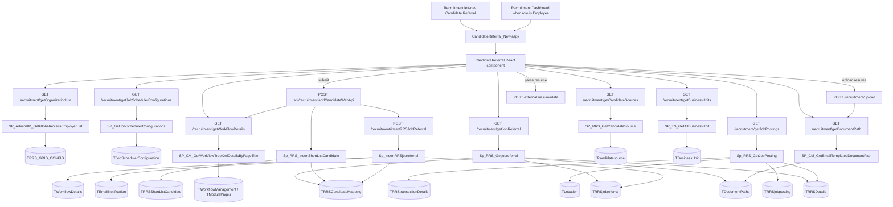
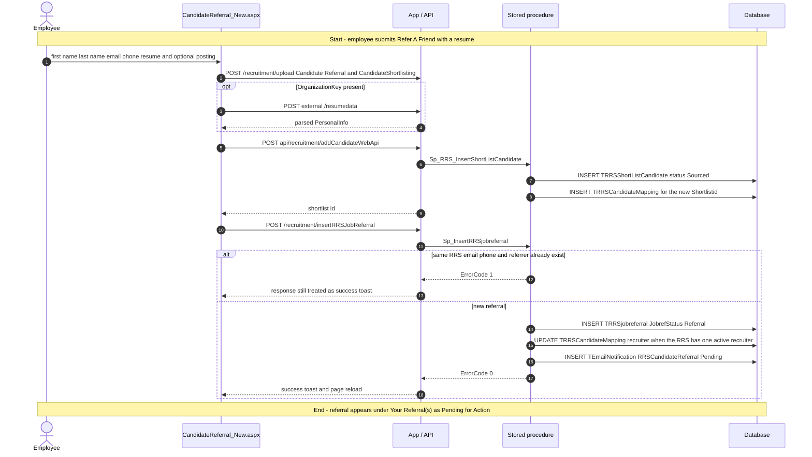
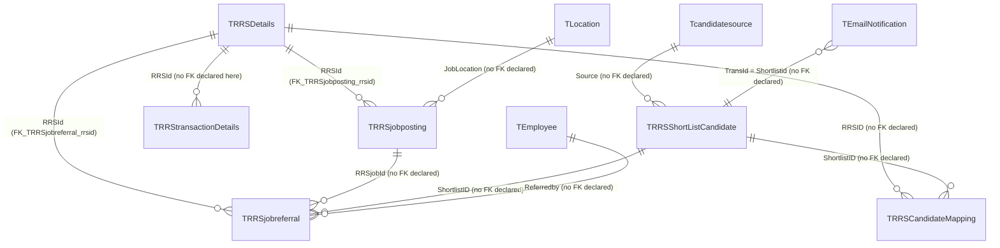

# Candidate Referral

## Overview

An employee opens **Recruitment → Candidate Referral** when they know someone who might fit an open role and want that person in the hiring pipeline without going through a recruiter first. The page is a two-column work surface: a searchable list of live internal / both job postings on the left, and a **Refer A Friend** form on the right. They can pick a posting (title, experience, skills, location, recruiter) or skip the posting and send a general referral with a preferred business unit and job title. Required fields are first name, last name, email, mobile, and a resume (`.doc` / `.docx` / `.pdf`). Uploading the resume copies it to the Candidate Referral and Candidate Shortlisting document folders and, when an organisation resume-parser key exists, fills the name / email / phone from the parsed file.

Submit does two writes in order. First the parsed resume is saved as a shortlist candidate in `Sourced` status (source channel **Employee Referral**). Then a job-referral row is inserted with `JobrefStatus = Referral`, linked to that shortlist id, and a `RRSCandidateReferral` email notification is queued. The right-hand **Your Referral(s)** list shows everyone this employee has already referred, with a computed status: `Pending for Action`, `In process`, `Hired`, or `Rejected`.

**Who's involved:**

- **Employee** — default audience. Anyone with the menu can refer. A user whose role name is `Employee` is sent here automatically when they open Recruitment Dashboard; they never see the recruiter dashboards.
- **Recruiter / recruitment team** — receive the queued notification (workflow `RRS Candidate Referral` is notification-only). The posting card can also show a team mailbox from scheduler config `CandidateReferralPageEmail` / `TeamEmailID`.
- **Hiring manager / HR / initiator** — named in `TWorkflowDetails.LevelNotifications` for that workflow (`H`, `I`, role names). They are not a screen on this page; they get email.
- There is **no** recruiter-only gate on the form. Global-access organisation list is fetched on load and then unused; the referral list is always the logged-in employee's own rows for their session employer.

There is **no** `llm-wiki/domain` lifecycle page for referrals. Table one-liners live in `llm-wiki/reference/tables/hrms.md`. Email queue and workflow lookup reuse `llm-wiki/domain/approval-workflow.md` (`RequestType` / template `RRSCandidateReferral`). This guide is the application call chain those catalogs do not cover.

Sibling left-nav items **Sourcing Dashboard**, **Shortlisting Dashboard**, **RRS Dashboard**, and **Recruitment Dashboard** are separate menu pages. The WebForms `CandidateReferral.aspx` (edit / delete / export grid) is still on disk and is not this React menu shell.

## Workflow

Open postings are always `PostingType` `Both` or `Internal` on a non-closed / non-cancelled RRS in the employee's root-employer group. The source id used on the shortlist row is `Tcandidatesource.SourceName = 'Employee Referral'`. Referral status on the list is not `JobrefStatus`; it is derived from `TRRSCandidateMapping.Statusid` (or `Pending for Action` when there is no shortlist / RRS).

## Request journey

The page loads lookups and the employee's existing referrals first, but the characteristic write is **submitting a referral**. That request starts with an employee filling the Refer A Friend form and ends with a `TRRSjobreferral` row plus a `Sourced` shortlist candidate and a pending email queue row.

A general referral (no posting chosen) sends `rRSId` / `rRSJobId` as null. Preferred BU and job title are only collected when no posting is selected. Resume parse is skipped when `ResumeParsingBulkUpload` / `OrganizationKey` is missing; submit still requires `resumeData.PersonalInfo` and will fail in that case.

## Entry points

> `CandidateReferral_New.aspx` is the React shell this menu is built around (`TMenuHierarchy` menu id `71` under parent `69`). `RouteConstants.CANDIDATE_REFERRAL` points at that page. The older WebForms `HRM/Recruitment/CandidateReferral.aspx` is still compiled and still referenced by `Constants.URLs.URL_REFER_CANDIDATE`. No DML in this checkout updates `TMenuDetails.NavigateURL` for menu `71` to the `_New` page; treat the WebForms page as a sibling, not as the React call chain below.

| UI page / route | Purpose |
|---|---|
| `/HRM/Recruitment_React/CandidateReferral_New.aspx` | Live Candidate Referral SPA. Stamps employee, employer, role, global-access, optional decrypted `candId`, email, and BU label into hidden fields, then loads `BuildJS/recruitment.min.js`. Logs activity `CandidateReferral` (enum `395`). |
| `/HRM/Recruitment_React/RecruitmentDashboard_New.aspx` | When `roleName` is `Employee`, `DashboardContainer.redirectToreferral` replaces the dashboard iframe with Candidate Referral. Not this menu item. |
| `/HRM/Recruitment/CandidateReferral.aspx` | Legacy WebForms grid: insert / update / delete / export. Uses `CandidateReferralDBHelper` (Enterprise Library). Not wired in the React router. |

`CandidateReferral_New.aspx.cs` only reads session values and decrypts optional query `candId`; feature logic lives in `candidate-referral.js` and the Node / .NET APIs.

## Code → database call chain

The live SPA constants for this page resolve to `/recruitment/...` routes. The older `/v2/recruitment/...` and `/v3/recruitment/...` variants remain in `apiURLConstants.js`, but the duplicate keys later in the file make the plain `/recruitment/...` versions the ones this bundle uses. `routeIndex.js` mounts only `RecruitmentRoutes.js` at `/recruitment`. Resume-parse insert uses the .NET Web API, not Node.

| Entry point | DAL / BLL method (`file:line`) | Stored procedure |
|---|---|---|
| Page load — organisation list (result unused for queries) | `GetOrganizationList` (`recruitmentController.js:233`, `recruitmentDAL.js:943`) | `SP_AdminRM_GetGlobalAccessEmployerList` |
| Page load — resume-parser organisation key | `GetJobSchedulerConfigurations` (`recruitmentController.js:1522`, `recruitmentDAL.js:4542`) | `SP_GetJobSchedulerConfigurations` |
| Page load — existing referrals | `GetJobReferral` (`recruitmentController.js:730`, `recruitmentDAL.js:2179`) | `Sp_RRS_Getjobreferral` |
| Page load — open postings | `GetJobPostings` (`recruitmentController.js:748`, `recruitmentDAL.js:2210`) | `Sp_RRS_GetJobPosting` |
| After postings — workflow id | `GetWorkFlowDetails` (`recruitmentController.js:224`, `recruitmentDAL.js:155`) | `SP_CM_GetWorkflowTreeXmlDetailsByPageTitle` |
| After workflow — document folders | `GetDocumentPath` (`recruitmentController.js:297`, `recruitmentDAL.js:1013`) | `SP_CM_GetEmailTemplatesDocumentPath` |
| After workflow — Employee Referral source id | `GetCandidateSources` (`recruitmentController.js:830`, `recruitmentDAL.js:2476`) | `SP_RRS_GetCandidateSource` |
| After orgs — preferred-BU dropdown | `GetBusinessUnits` (`recruitmentController.js:108`, `recruitmentDAL.js:126`) | `SP_TS_GetAllBusinessUnit` |
| Resume file copy | `UploadFile` (`recruitmentController.js:306`) | `SP_CM_GetEmailTemplatesDocumentPath` then filesystem write |
| Submit — create Sourced shortlist | `GenerateCompleteResumeDataAPI` → `insertCandidateDetailsBAL` → `insertCandidateDetails` (`RecruitmentController.cs:2659`, `AddCandidateParsing.cs:135`, `RecruitmentHelper.cs:645`, `AddCandidateParsingDAL.cs:19`) | `Sp_RRS_InsertShortListCandidate` (also `SP_CM_GetWorkflowTreeXmlDetailsByPageTitle` with page `ShortlistedCandidate`) |
| Submit — insert referral | `InsertRRSJobReferral` (`recruitmentController.js:757`, `recruitmentDAL.js:2230`) | `Sp_InsertRRSjobreferral` |

There is **no BLL layer** on the Node path. The WebForms code-behind does not make data-access calls. `Sp_AddResumeParsingInformation` is only called when `ResumeSource == "BULKUPLOAD"` and is not on this page's submit path.

## API endpoints

| Verb | Route | Parameters | Purpose | Source |
|---|---|---|---|---|
| `GET` | `/recruitment/getOrganizationList` | query `employeeId` (sent by caller; live controller uses `req.EID`), `gridId` (this page omits it) | Organisations for global access. This page stores `allEmployersList` and does not pass it into later queries | `RecruitmentRoutes.js:22`, `recruitmentController.js:233` |
| `GET` | `/recruitment/getJobSchedulerConfigurations` | query `SchedulerName` (this page `ResumeParsingBulkUpload` then `CandidateReferralPageEmail`), `ConfigKey` (this page `null`), `Employerid`. Guarded by `assertEmployerAccess('Employerid')` | `OrganizationKey` for the external parser; `TeamEmailID` for the posting mailto | `RecruitmentRoutes.js:136`, `recruitmentController.js:1522` |
| `GET` | `/recruitment/getJobReferral` | query `employeeId` (int, required on this page), `employerId` (int, required) | **Your Referral(s)** list for the logged-in referrer | `RecruitmentRoutes.js:64`, `recruitmentController.js:730` |
| `GET` | `/recruitment/getJobPostings` | query `employerId` (this page sends **employee id** in that name), `postingType` (this page `'Both,Internal'`) | Open internal / both postings. DAL binds the first value as SP `@EmployeeId` | `RecruitmentRoutes.js:66`, `recruitmentController.js:748` |
| `GET` | `/recruitment/getWorkFlowDetails` | query `employerId`, `pageTitle` (this page `RRSCANDIDATEREFERRAL`), `employeeId` (sent; live controller uses `req.EID`). Guarded by `assertEmployerAccess('employerId')` | Workflow id stored on the referral payload | `RecruitmentRoutes.js:21`, `recruitmentController.js:224` |
| `GET` | `/recruitment/getDocumentPath` | query `documentType` (`Candidate Referral` then `CandidateShortlisting`) | Root folders for upload and stored resume path | `RecruitmentRoutes.js:29`, `recruitmentController.js:297` |
| `GET` | `/recruitment/getCandidateSources` | query `employerId` (this page only). Signature also has `multiOrg`, `employeeid`, `gridId` | Resolve `sourceid` where `sourcename` is `Employee Referral` | `RecruitmentRoutes.js:75`, `recruitmentController.js:830` |
| `GET` | `/recruitment/getBusinessUnits` | query `employerid` (int, required). Uses `guards` not `Authorize` | Preferred BU options when no posting is selected | `RecruitmentRoutes.js:17`, `recruitmentController.js:108` |
| `POST` | `/recruitment/upload` | query `documentType`, `rrsid`, `employer`; multipart field `filetoupload` | Copy resume onto disk under the document-type folder | `RecruitmentRoutes.js:30`, `recruitmentController.js:306` |
| `POST` | `{RP_API_URL}/resumedata` | multipart `resumeName`, `overwriteResume`; header `skey` = `OrganizationKey` | External resume parse. Not an HRMS stored procedure | `apiHelper.js:203`, `candidate-referral.js:504` |
| `POST` | `api/recruitment/addCandidateWebApi` | body `record` (parsed resume JSON), `createdBy`, `employerId`, `shortlistID` (`0`), `resumePath`, `recruiterID` (`0`), `sourceId`, `rrsId`, `candidateDataSource` (`CandidateReferralParsing`). .NET Web API via `APIHelper.postNetApi` | Insert Sourced shortlist + mapping; returns shortlist id string | `HRMS.WebAPI/Controllers/RecruitmentController.cs:2658` |
| `POST` | `/recruitment/insertRRSJobReferral` | body `getJobPostingsObj` fields (`rRSId`, `rRSJobId`, names, email, phone, `uploadResume`, `referredby`, `createdBy`, `empId`, `workflowId`, `employerId`, `preferredBU`, `preferredDesignation`, `shortlistID`, `requestType` `RRSCANDIDATEREFERRAL`) | Insert `TRRSjobreferral` and queue email | `RecruitmentRoutes.js:67`, `recruitmentController.js:757` |

This feature has both Node recruitment routes and one .NET Web API POST. There are no PageMethods on the React shell.

## Stored procedures & tables involved

> Live referral rows are in core **`HRMS`**. `Sp_RRS_Getjobreferral` / `Sp_InsertRRSjobreferral` read and write `TRRSjobreferral`. The React submit path also creates the shortlist via `Sp_RRS_InsertShortListCandidate` before the referral insert. Update / delete procedures exist for the WebForms sibling only. Table meanings reuse `llm-wiki/reference/tables/hrms.md`. Email / workflow tables reuse `llm-wiki/domain/approval-workflow.md`.

| Object | File path | Purpose | llm-wiki |
|---|---|---|---|
| `TRRSjobreferral` | `HRMS-DATABASE/HRMS/TABLES/TRRSjobreferral.sql` | Employee referral row. PK `RRSreferralid`. Declared FK `FK_TRRSjobreferral_rrsid` | `llm-wiki/reference/tables/hrms.md` |
| `TRRSShortListCandidate` | `HRMS-DATABASE/HRMS/TABLES/TRRSShortListCandidate.sql` | Sourced candidate created on submit. PK only; no FK declared | `llm-wiki/reference/tables/hrms.md` |
| `TRRSCandidateMapping` | `HRMS-DATABASE/HRMS/TABLES/TRRSCandidateMapping.sql` | Mapping inserted with the shortlist; recruiter id may be updated when the RRS has one active recruiter. Statusid drives the list's CandidateStatus. No FK declared | `llm-wiki/reference/tables/hrms.md` |
| `TRRSDetails` | `HRMS-DATABASE/HRMS/TABLES/TRRSDetails.sql` | Requisition joined for title / number / hiring manager | `llm-wiki/reference/tables/hrms.md` |
| `TRRSjobposting` | `HRMS-DATABASE/HRMS/TABLES/TRRSjobposting.sql` | Open posting cards. Declared FK `FK_TRRSjobposting_rrsid` | `llm-wiki/reference/tables/hrms.md` |
| `TRRStransactionDetails` | catalogued in wiki | Active recruiter on a posting / RRS | `llm-wiki/reference/tables/hrms.md` |
| `Tcandidatesource` | `HRMS-DATABASE/HRMS/TABLES/Tcandidatesource.sql` | Source master; this page looks up `Employee Referral` | `llm-wiki/reference/tables/hrms.md` |
| `TDocumentPaths` | catalogued in wiki | Folders for `Candidate Referral` and `CandidateShortlisting` | `llm-wiki/reference/tables/hrms.md` |
| `TEmailNotification` | catalogued in wiki | Queued row `TemplateName` `RRSCandidateReferral`, `TransId` = shortlist id, `STATUS` `Pending` | `llm-wiki/reference/tables/hrms.md` |
| `TWorkflowManagement` / `TWorkflowDetails` / `TModulePages` | catalogued in wiki | Page title `RRSCANDIDATEREFERRAL` / module page `RRSCandidateReferral` (notification-only) | `llm-wiki/domain/approval-workflow.md` |
| `TJobSchedulerConfiguration` | catalogued in wiki | `ResumeParsingBulkUpload` / `OrganizationKey`; `CandidateReferralPageEmail` / `TeamEmailID` | `llm-wiki/reference/tables/hrms.md` |
| `TEmployee` / `TEmployerDetails` / `TLocation` | catalogued in wiki | Referrer name, root-employer posting scope, job location label | `llm-wiki/reference/tables/hrms.md` |
| `Sp_RRS_Getjobreferral` | `HRMS-DATABASE/HRMS/STOREPROCEDURE/Sp_RRS_Getjobreferral.sql` | Referrer's non-deleted rows plus computed CandidateStatus | — |
| `Sp_InsertRRSjobreferral` | `HRMS-DATABASE/HRMS/STOREPROCEDURE/Sp_InsertRRSjobreferral.sql` | Duplicate check, insert, optional mapping recruiter update, email queue | — |
| `Sp_RRS_GetJobPosting` | `HRMS-DATABASE/HRMS/STOREPROCEDURE/Sp_RRS_GetJobPosting.sql` | Internal / both postings for the employee's root employer | — |
| `Sp_RRS_InsertShortListCandidate` | `HRMS-DATABASE/HRMS/STOREPROCEDURE/Sp_RRS_InsertShortListCandidate.sql` | Insert Sourced shortlist and mapping (`IsParsingEntry = 1`) | — |
| `SP_RRS_GetCandidateSource` | `HRMS-DATABASE/HRMS/STOREPROCEDURE/SP_RRS_GetCandidateSource.sql` | Source dropdown | — |
| `SP_CM_GetWorkflowTreeXmlDetailsByPageTitle` | `HRMS-DATABASE/HRMS/STOREPROCEDURE/SP_CM_GetWorkflowTreeXmlDetailsByPageTitle.sql` | Workflow id by page title | `llm-wiki/domain/approval-workflow.md` |
| `SP_CM_GetEmailTemplatesDocumentPath` | `HRMS-DATABASE/HRMS/STOREPROCEDURE/` | Document folder by type | — |
| `SP_GetJobSchedulerConfigurations` | `HRMS-DATABASE/HRMS/STOREPROCEDURE/` | Parser key and team email | — |
| `SP_AdminRM_GetGlobalAccessEmployerList` | `HRMS-DATABASE/HRMS/STOREPROCEDURE/SP_AdminRM_GetGlobalAccessEmployerList.sql` | Org list | — |
| `SP_TS_GetAllBusinessUnit` | `HRMS-DATABASE/HRMS/STOREPROCEDURE/` | Preferred BU list | — |
| `Vw_RRSCandidateReferral` / `usp_Vw_RRSCandidateReferral` | `HRMS-DATABASE/HRMS/VIEWS/` / `STOREPROCEDURE/` | Email merge view keyed by shortlist `Transid`. Used by the mail engine, not by this SPA | — |
| `Sp_UpdateRRSjobreferral` | `HRMS-DATABASE/HRMS/STOREPROCEDURE/Sp_UpdateRRSjobreferral.sql` | WebForms update only | — |
| `Sp_DeleteRRSjobreferral` | `HRMS-DATABASE/HRMS/STOREPROCEDURE/Sp_DeleteRRSjobreferral.sql` | WebForms soft-delete (`IsDeleted = 'Y'`) only | — |
| `Sp_UpdateRRSjobreferralStatus` | `HRMS-DATABASE/HRMS/STOREPROCEDURE/Sp_UpdateRRSjobreferralStatus.sql` | WebForms assign-to-candidate path (`JobrefStatus = Assigned`) | — |

## Table relationships

The project does not have a referral-feature ER diagram to reuse, so this diagram is derived from `llm-wiki/reference/tables/hrms.md` plus the procedure-level table usage above. Where the catalog or DDL does not declare a foreign key, the relationship is labelled as such instead of being invented.

## Known gaps

- There is **no** recruitment-specific canonical domain page in `llm-wiki/domain/`, and SourceCode `docs/SystemModels/SystemModel-2` has no Candidate Referral workflow page in this checkout. Behaviour above is from SourceCode + procedure scripts. `llm-wiki/domain/employee-lifecycle.md` only names recruitment as the candidate stage before employment.
- Live `TMenuDetails.NavigateURL` for menu `71` was not read (DEV query could not load Sequelize). Shared constant `URL_REFER_CANDIDATE` still points at `~/HRM/Recruitment/CandidateReferral.aspx`. The React router and `RouteConstants.CANDIDATE_REFERRAL` point at `CandidateReferral_New.aspx`.
- WebForms `CandidateReferral.aspx` still supports edit, multi-select delete, and grid export through `Sp_UpdateRRSjobreferral` / `Sp_DeleteRRSjobreferral`. The React page has no update or delete.
- `Sp_UpdateRRSjobreferralStatus`, `Sp_RRS_GetJobRefDashboard`, and `Sp_GetRrsJobRefDashboard` are on disk / in the .NET DAL. The React Candidate Referral page does not call them.
- `submitReferralApi` sets `shortlistID` on state and immediately posts `this.state.referralObject`, so the insert can run with `shortlistID` still `0` (React setState is asynchronous).
- Submit always reads `this.state.resumeData.PersonalInfo`. If `OrganizationKey` is missing, parse is skipped and submit throws before the referral insert.
- `Sp_InsertRRSjobreferral` returns `ErrorCode` `1` on duplicate (same RRS + email + phone + referrer, `IsDeleted = 'N'`). The SPA toasts success whenever the HTTP call returns a body and does not read `ErrorCode`.
- `Sp_InsertRRSjobreferral` writes `Referredby` from `@Empid`, not from `@Referredby`. The React payload sets both to the same employee id. `SourceId` on `TRRSjobreferral` is never set by this insert.
- Sourcing Dashboard labels a row **Candidate Referral** when a `TRRSjobreferral` exists. This page's shortlist source lookup is `Employee Referral`, not `Candidate Referral`.
- `GET_JOB_POSTINGS` query parameter is named `employerId` but this page passes **employee id**, and the DAL binds it to `Sp_RRS_GetJobPosting.@EmployeeId`. That matches the procedure. `@PostingType` is `VARCHAR(10)` while the page sends `Both,Internal`; the procedure ignores `@PostingType` and hard-filters `Both` / `Internal` anyway.
- `organizations()` loads `allEmployersList` and never uses it. `getJobReferral` always passes session `employerId`.
- `GetWorkFlowDetails` and `GetOrganizationList` ignore the SPA's `employeeId` query and use `req.EID`.
- `saveDetailsToShortlisting` builds `ISCandidateReferral` / `JSMResumeParser` for a Node save-candidate body that this page never posts. Live submit is `addCandidateWebApi` only.
- `Vw_RRSCandidateReferral` is keyed by shortlist id (`Transid`). The insert queues `TEmailNotification.TransId` as `@ShortlistID`, which matches the view, not `RRSreferralid`.
- `routeIndex.js` mounts only `RecruitmentRoutes.js` at `/recruitment`. `RecruitmentRoutes_V2.js` / `RecruitmentRoutes_V3.js` exist on disk and are not mounted.
- `GetCandidateReferralInfo` in `CandidateReferralDBHelper.cs` calls `Sp_RRS_Getjobreferral` with `@RRSreferralid`. The live procedure signature is `@employerId`, `@employeeId` only.

## Reference

Confidence is **medium**: the live React page was traced to v1 DAL `file:line` and named procedures, plus the .NET resume-parse insert. Declared FKs come from table DDL (`FK_TRRSjobreferral_rrsid`, `FK_TRRSjobposting_rrsid`). There is no domain `erDiagram` to reuse. Confidence is not high because live menu NavigateURL was not queried, the WebForms sibling is still present, and submit has a shortlist-id state race.

### SourceCode

- `HRMS.Web/HRMS.Web/HRM/Recruitment_React/CandidateReferral_New.aspx`
- `HRMS.Web/HRMS.Web/HRM/Recruitment_React/CandidateReferral_New.aspx.cs`
- `HRMS.Web/HRMS.Web/HRM/Recruitment_React/Areas/routes.js`
- `HRMS.Web/HRMS.Web/HRM/Recruitment_React/Common/routeConstants.js`
- `HRMS.Web/HRMS.Web/HRM/Recruitment_React/Common/apiURLConstants.js`
- `HRMS.Web/HRMS.Web/HRM/Recruitment_React/Common/VaribaleConstants.js`
- `HRMS.Web/HRMS.Web/HRM/Recruitment_React/Areas/Candidate/Containers/candidateReferralContainer.js`
- `HRMS.Web/HRMS.Web/HRM/Recruitment_React/Areas/Candidate/Components/candidate-referral.js`
- `HRMS.Web/HRMS.Web/HRM/Recruitment_React/Areas/Dashboard/Containers/dashboardContainer.js`
- `HRMS.Web/HRMS.Web/HRM/Recruitment/CandidateReferral.aspx`
- `HRMS.Web/HRMS.Web/HRM/Recruitment/CandidateReferral.aspx.cs`
- `HRMS.CoreAPI/HRMS.Core.WebAPI.Node/Routes/routeIndex.js`
- `HRMS.CoreAPI/HRMS.Core.WebAPI.Node/Routes/RecruitmentRoutes.js`
- `HRMS.CoreAPI/HRMS.Core.WebAPI.Node/Controllers/recruitmentController.js`
- `HRMS.CoreAPI/HRMS.Core.WebAPI.Node/Core/DataAccessLayer/recruitmentDAL.js`
- `HRMS.Shared/HRMS.WebAPI/Controllers/RecruitmentController.cs`
- `HRMS.Shared/HRMS.Common/AddCandidateParsing.cs`
- `HRMS.Shared/HRMS.BusinessLayer/RecruitmentHelper.cs`
- `HRMS.Shared/HRMS.DataAccessLayer/AddCandidateParsingDAL.cs`
- `HRMS.Shared/HRMS.DataAccessLayer/CandidateReferralDBHelper.cs`

### TDG HRMS DB

- `llm-wiki/reference/tables/hrms.md`
- `llm-wiki/domain/employee-lifecycle.md`
- `llm-wiki/domain/approval-workflow.md`
- `HRMS-DATABASE/HRMS/TABLES/TRRSjobreferral.sql`
- `HRMS-DATABASE/HRMS/TABLES/TRRSjobposting.sql`
- `HRMS-DATABASE/HRMS/TABLES/TRRSShortListCandidate.sql`
- `HRMS-DATABASE/HRMS/TABLES/TRRSCandidateMapping.sql`
- `HRMS-DATABASE/HRMS/STOREPROCEDURE/Sp_RRS_Getjobreferral.sql`
- `HRMS-DATABASE/HRMS/STOREPROCEDURE/Sp_InsertRRSjobreferral.sql`
- `HRMS-DATABASE/HRMS/STOREPROCEDURE/Sp_RRS_GetJobPosting.sql`
- `HRMS-DATABASE/HRMS/STOREPROCEDURE/Sp_RRS_InsertShortListCandidate.sql`
- `HRMS-DATABASE/HRMS/STOREPROCEDURE/Sp_UpdateRRSjobreferral.sql`
- `HRMS-DATABASE/HRMS/STOREPROCEDURE/Sp_DeleteRRSjobreferral.sql`
- `HRMS-DATABASE/HRMS/VIEWS/Vw_RRSCandidateReferral.sql`
- `HRMS-DATABASE/HRMS/DML/DML TMenuDetails Notifications under Recruitment.sql`
