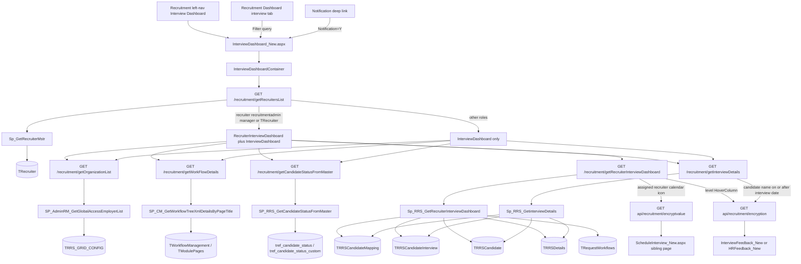
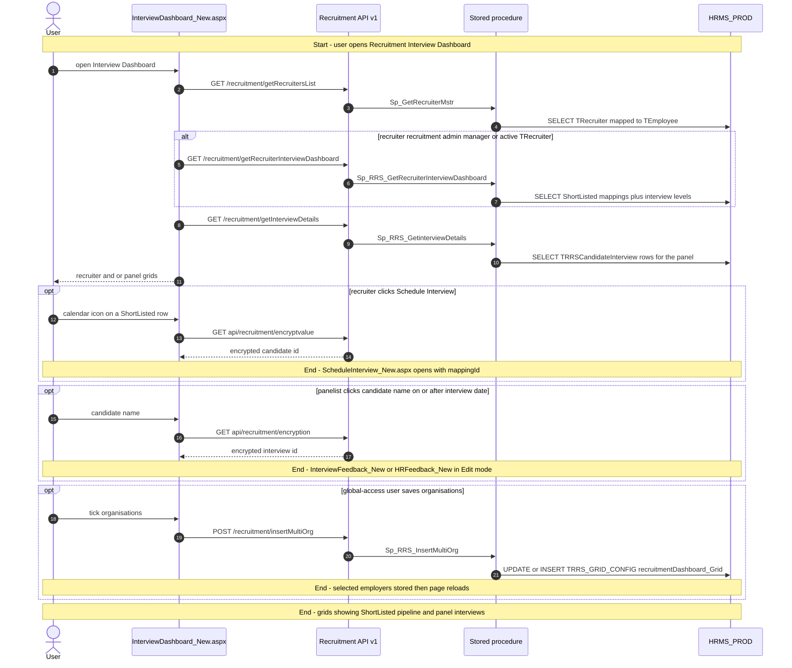
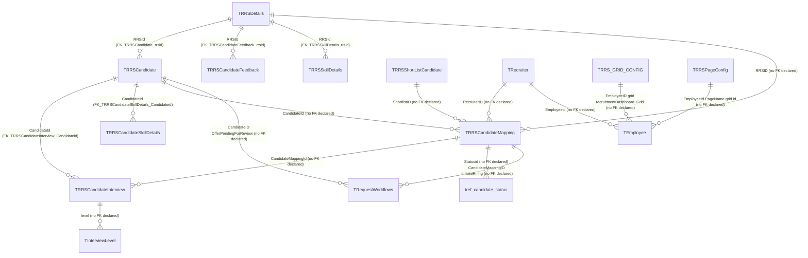

# Interview Dashboard

## Overview

A recruiter opens **Recruitment → Interview Dashboard** when shortlisted people need a next round, and an interviewer lands here when they have a panel slot to run. One URL hosts two work surfaces. Recruiters, recruitment admins, managers, and anyone who is an active row in the recruiter master see both: a recruiter pipeline grid titled **Interview Dashboard**, then a second accordion titled **Interview Panel Dashboard**. Everyone else sees only the panel grid (their interviews). Query `fromInterviewPanelDashboard` plus `InterviewDashboard` after feedback forces the panel-only layout.

The recruiter grid is a working list of mappings still in `ShortListed` status. Filters are recruiter, candidate status, and a date window (default last 30 days). Each row is an RRS, candidate, recruiter, hiring / offer / joining dates, and one hover column per interview level. Clicking a level encrypts the interview id and opens Interview Feedback (or HR Feedback when the level type is `HR`). The calendar icon leaves this page for Schedule Interview, but only for the assigned recruiter, and only when the RRS is not `OnHold` and the candidate status is not `Available` (the toast then says the candidate is already rejected). Clicking the candidate name opens an in-page profile. TAT, attachment, and conversation icons open the shared right-hand drawer.

The panel grid is the interviewer’s own schedule: RRS, skills, interview date, level, status, recruiter. Clicking a name opens feedback in edit mode, but only on or after the interview date (toast **Feedback Window Will Open On Interview Date**). A `Filter` query from Recruitment Dashboard’s interview count card, or `Notification=Y`, drops the date window and expands the panel. Count cards themselves are not on this page; they live on Recruitment Dashboard.

**Who's involved:**

- **Recruiter** — default audience for the first accordion. Filters their pipeline, schedules the next round, opens feedback from a level cell, uses the drawer.
- **Interview panel member** — default audience for the second accordion (and the only surface for roles that are not recruiter / recruitment admin / manager and are not in `TRecruiter`). Gives feedback from the name click.
- **Recruitment admin / manager** — same dual UI. Schedule is still blocked unless they are the assigned recruiter on that row (`Re.Employeeid` compared to the session employee id).
- **Global-access user** (`IsGlobalAccess = Y`) — organisation multi-select. The picker remaps `recruiterInterviewDashboard_Grid` to `recruitmentDashboard_Grid` (shared with the other recruitment dashboards). Grid queries then pass those employer ids.

There is **no** `llm-wiki/domain` lifecycle page for interviews. Table one-liners live in `llm-wiki/reference/tables/hrms.md`. Hiring / offer dates on the recruiter grid are read from `TRequestWorkflows` (`RequestType` `InitiateHiring` and `OfferPendingForReview`); that engine is documented in `llm-wiki/domain/approval-workflow.md`. SourceCode `docs/SystemModels/SystemModel-2/domain/contexts/recruitment.md` covers the WebForms Recruitment module and **explicitly excludes** the React recruitment apps, so it does not name this live page. This guide is the application call chain those catalogs do not cover.

Sibling left-nav items **Recruitment Dashboard**, **RRS Dashboard**, **Sourcing Dashboard**, **Shortlisting Dashboard**, and **Candidate Dashboard** are separate menu pages. Schedule Interview, Interview Feedback, and HR Feedback are pages this screen opens; they are not this menu item. **Interview Dashboard SSP** (`SSPInterviewDashboard.aspx`, page title **Dashboard Test Page**) is a parallel server-side pagination host, not the left-nav item in the screenshot.

## Workflow

The recruiter procedure keeps mapping `Status = 'ShortListed'` and `IsActive = 1`. Interview-level hover columns are built in the Node controller from the procedure’s second and third result sets. The panel procedure scopes rows to interviews the logged-in employee can see (role from `TUsers` / `TRoles`, plus recruiter / hiring-manager branches). Dates default to the last 30 days unless `Filter` or `Notification=Y` is on the query string.

## Request journey

The everyday request is **opening the dashboard** (it ends as SELECT rows painted on the grids). Scheduling and feedback are navigations off this menu item. Saving a multi-org list is the write that stays here.

## Entry points

> `InterviewDashboard_New.aspx` is the live Recruitment → Interview Dashboard shell. The React route `RouteConstants.INTERVIEW_DASHBOARD` is `/HRM/Recruitment_React/InterviewDashboard_New.aspx` (`routes.js`). SystemModel-2 `domain/contexts/recruitment.md` documents WebForms `HRM/Recruitment/` and excludes React recruitment apps, so it does not name this page. A compiled WebForms sibling `HRM/Recruitment/InterviewDashboard.aspx` still exists; it is not the React menu path.

| UI page / route | Purpose |
|---|---|
| `/HRM/Recruitment_React/InterviewDashboard_New.aspx` | Recruitment → Interview Dashboard. Hidden fields stamp employee, employer, role, global-access, email, BU label, and optional decrypted `candId`. Hosts `BuildJS/recruitment.min.js`. Logs `ActivityDescription.InterviewDashboard`. Query `Filter`, `Notification`, `ToggleView`, `fromHRfeedback`, `fromInterviewPanelDashboard`, `InterviewDashboard` change filters and which accordion is expanded. |
| In-page `CandidateDetails` | Opened from a recruiter-grid name click (encrypted shortlist id + mapping id). Not a separate menu item. |
| Right-side `RightPanel` modal | TAT / conversation / attachment drawer for one candidate (`CreatedForPage` **Interview Dashboard**). Shared recruitment drawer, not a separate route. |
| `/HRM/Recruitment_React/ScheduleInterview_New.aspx` | Calendar icon on the recruiter grid (`id` encrypted candidate id, `employerid`, `mappingId`). Not this menu item. |
| `/HRM/Recruitment_React/InterviewFeedback_New.aspx` | Panel name click (`Mode=Edit`) or recruiter level cell (`Mode=Edit` when level type is not `HR`). Query `InterviewID` (encrypted), `RRSId`, `mappingId`, `return=InterviewDashboard`. |
| `/HRM/Recruitment_React/HRFeedback_New.aspx` | Same hops when `LevelType` is `HR`. Recruiter hover uses `Mode=View`; panel name click uses `Mode=Edit`. |
| `/HRM/Recruitment_react/RRSCreation_new.aspx` | RRS ID click (`mode=vw`, `return=MainInterviewDashboard`). |
| `/HRM/Recruitment_React/SSPInterviewDashboard.aspx` | Alternate SSP host (`RouteConstants.SSP_DASHBOARD`). Page title **Dashboard Test Page**. Not the left-nav item in the screenshot. |
| `/HRM/Recruitment/InterviewDashboard.aspx` | Legacy WebForms Telerik grid. Uses `InterviewDashboardBLL` / `InterviewDashboardDAL`. Still compiled; not this React path. |

`InterviewDashboard_New.aspx.cs` only stamps session into hidden fields and decrypts optional query `candId`. There is no WebForms postback DAL on the live page. Encrypt for navigation uses the .NET Web API, not the Node app.

## Code → database call chain

Live SPA constants are **v1** (`/recruitment/…`). The v2/v3 twins in `apiURLConstants.js` sit inside a block comment (`/*V2 routes` at line 4 through `*/` at line 568). `RecruitmentRoutes_V2.js` and `RecruitmentRoutes_V3.js` exist on disk but are **not** mounted from `routeIndex.js` (`router.use('/recruitment', RecruitmentRoutes)`).

There is **no BLL** on the Node path. Controllers call `recruitmentDAL.js` and bind parameters by name.

| Entry point | DAL / BLL method (`file:line`) | Stored procedure |
|---|---|---|
| Page load — role split (`isRecruiter` / `isHiringMGR`) | `GetRecruitersList` (`recruitmentDAL.js:2396`) via `recruitmentController.js:803` | `Sp_GetRecruiterMstr` |
| Page load — org list / saved selection | `GetOrganizationList` (`recruitmentDAL.js:943`) via `recruitmentController.js:233` | `SP_AdminRM_GetGlobalAccessEmployerList` |
| Page load — skip-workflow (hides Shortlisting Date on recruiter grid) | `GetWorkFlowDetails` (`recruitmentDAL.js:155`) via `recruitmentController.js:224` | `SP_CM_GetWorkflowTreeXmlDetailsByPageTitle` (`pageTitle` `ShortlistedCandidate`) |
| Page load — status filter options (`dashboard=Interview`) | `GetCandidateStatusFromMaster` (`recruitmentDAL.js:6958`) via `recruitmentController.js:2667` | `SP_RRS_GetCandidateStatusFromMaster` |
| Recruiter accordion — main grid | `getRecruiterInterviewDashboard` (`recruitmentDAL.js:4814`) via `recruitmentController.js:1654` | `Sp_RRS_GetRecruiterInterviewDashboard` |
| Panel accordion — main grid | `GetInterviewDetails` (`recruitmentDAL.js:3159`) via `recruitmentController.js:1116` | `SP_RRS_GetInterviewDetails` (script file `Sp_RRS_GetinterviewDetails.sql`) |
| Recruiter grid — saved column order (`recruiterInterviewDashboard_Grid`) | `GetGridConfig` (`recruitmentDAL.js:6642`) via `recruitmentController.js:2523` | `SP_RRS_GetGridConfig` |
| Panel grid — saved column order (`InterviewPanel_Grid`) | same | `SP_RRS_GetGridConfig` |
| Save column layout | `SetGridConfig` (`recruitmentDAL.js:6657`) via `recruitmentController.js:2532` | `SP_RRS_InsertGridConfig` |
| Global-access org save | `InsertMultiOrg` (`recruitmentDAL.js:6488`) via `recruitmentController.js:2459` | `Sp_RRS_InsertMultiOrg` |
| Recruiter name click — shortlist id for in-page profile | `GetShortlistID` (`recruitmentDAL.js:5129`) via `recruitmentController.js:1795` | `Sp_RRS_GetShortlistid` |
| Encrypt candidate id / shortlist id (`encryptvalue`) | `EncryptValue` (`HRMS.WebAPI/Controllers/RecruitmentController.cs:551`) | none (in-process encrypt) |
| Encrypt interview id (`encryption`) | `EncryptionValue` (`HRMS.WebAPI/Controllers/RecruitmentController.cs:535`) | none (in-process encrypt; different helper than `encryptvalue`) |
| SSP panel grid | `getInterviewDetailsSSP` (`recruitmentDAL.js:6095`) via `recruitmentController.js:2251` | `Sp_RRS_GetInterviewDetailsSSP` |
| SSP recruiter grid | `getRecruiterInterviewDashboardPagination` (`recruitmentDAL.js:6063`) via `recruitmentController.js:2199` | `Sp_RRS_GetRecruiterInterviewDashboardPagination` |

`GetRecruitersList` binds only `@employerid`. Query `isactive` and `employeeId` are ignored. A previous `Sp_AdminRM_GetRecruiter` call is commented in the DAL.

Legacy WebForms `InterviewDashboardDAL` uses `Sp_RRS_GetInterviewCounts`, `Sp_RRS_GetInterviewDetails`, `SP_RRS_GetStatus`, and `SP_RRS_UpdReadOnlyFlag`. Node interview counts on **Recruitment Dashboard** use `USP_RRS_GetRecruiterInterviewDashboard_InterviewCount`, not the legacy counts procedure. `SP_RRS_UpdReadOnlyFlag` has no React/Node caller on this screen.

## API endpoints

The Core Node app mounts recruitment at `/api/recruitment` (`routeIndex.js`). Live SPA constants are **v1**. `Authorize` verifies JWT except in `NODE_ENV === 'development'`, where it hard-codes `req.EID`. These dashboard GETs still take **employee id from the query string** (filled from hidden `hdnEmpId` / Redux). `GetOrganizationList`, `GetWorkFlowDetails`, and `GetGridConfig` use `req.EID` instead of the query employee id.

This page has **no** schedule / cancel / feedback-submit APIs. Those belong to Schedule Interview and Interview Feedback.

| Verb | Route | Parameters | Purpose | Source |
|---|---|---|---|---|
| `GET` | `/recruitment/getRecruitersList` | query `employerid` (int, required), `isactive` (this page `true`, unused), `employeeId` (unused) | Recruiter multi-select and `isRecruiter` flag | `RecruitmentRoutes.js:72`, `recruitmentController.js:803` |
| `GET` | `/recruitment/getOrganizationList` | query `employeeId` (sent by caller; live controller uses `req.EID`), `gridId` (picker remaps `recruiterInterviewDashboard_Grid` to `recruitmentDashboard_Grid`; `getEmployerIds` also uses `recruitmentDashboard_Grid`) | Organisations and saved selection | `RecruitmentRoutes.js:22`, `recruitmentController.js:233` |
| `POST` | `/recruitment/insertMultiOrg` | body `employeeId`, `gridId` (persisted as `recruitmentDashboard_Grid`), `configType` (`employerDropdown`), `config` (comma-separated employer ids) | Persist the organisation picker | `RecruitmentRoutes.js:207`, `recruitmentController.js:2459` |
| `GET` | `/recruitment/getWorkFlowDetails` | query `employerId` (int, required; `assertEmployerAccess`), `pageTitle` (this page `ShortlistedCandidate`), `employeeId` (sent by caller; live controller uses `req.EID`) | `SkipWorkFlow` hides Shortlisting Date on the recruiter grid | `RecruitmentRoutes.js:21`, `recruitmentController.js:224` |
| `GET` | `/recruitment/getCandidateStatusFromMaster` | query `employerId` (int, required), `dashboard` (string, required; this page `Interview`) | Status filter options (Interview branch: not parent_id 1 unless `ShortListed`, excludes `Un-Tagged`) | `RecruitmentRoutes.js:230`, `recruitmentController.js:2667` |
| `GET` | `/recruitment/getRecruiterInterviewDashboard` | query `employeeid` (int, required), `employerid` (int, required), `selectedStatusIds` (string, optional), `selectedRecruiterIds` (string, optional), `multiOrg` (bit), `fromDate` / `toDate` (datetime, optional), `EmployerIds` (string, optional) | Recruiter pipeline grid. Controller merges interview-level columns from extra recordsets | `RecruitmentRoutes.js:145`, `recruitmentController.js:1654` |
| `GET` | `/recruitment/getInterviewDetails` | query `employeeid` (int, required), `employerid` (int, required), `interviewStatus` (string, optional), `candidateName` (string, optional), `isNotification` (string, optional), `multiOrg` (bit), `selectedRecruiterIds` (string, optional), `fromDate` / `toDate` (datetime, optional), `EmployerIds` (string, optional) | Interview Panel grid | `RecruitmentRoutes.js:100`, `recruitmentController.js:1116` |
| `GET` | `/recruitment/getGridConfig` | query `employerId` (int, required), `employeeId` (sent by caller; live controller uses `req.EID`), `gridId` (`recruiterInterviewDashboard_Grid` or `InterviewPanel_Grid`) | Saved column sequence (`ConfigType` `GridFormat`) | `RecruitmentRoutes.js:214`, `recruitmentController.js:2523` |
| `POST` | `/recruitment/setGridConfig` | body `EmployerId`, `EmployeeId`, `PageName`, `ConfigType`, `Config` | Persist column layout | `RecruitmentRoutes.js:215`, `recruitmentController.js:2532` |
| `GET` | `/recruitment/getShortlistid` | query `employerid` (int, required), `candidateid` (int, required) | Shortlist id for the in-page profile | `RecruitmentRoutes.js:155`, `recruitmentController.js:1795` |
| `GET` | `api/recruitment/encryptvalue` | query `value` (string, required; candidate id or shortlist id) | Encrypt id for Schedule Interview / in-page profile. .NET Web API via `APIHelper.getNetApi` | `HRMS.WebAPI/Controllers/RecruitmentController.cs:551` |
| `GET` | `api/recruitment/encryption` | query `value` (string, required; interview id) | Encrypt interview id for feedback pages. Different .NET helper than `encryptvalue` | `HRMS.WebAPI/Controllers/RecruitmentController.cs:535` |
| `POST` | `/recruitment/getInterviewDetailsSSP` | body `employeeid`, `employerid`, `interviewStatus`, `candidateName`, `isNotification`, `pageNumber`, `pageSize`, `filterJson` | SSP panel grid. Not called from `InterviewDashboard_New.aspx` | `RecruitmentRoutes.js:191`, `recruitmentController.js:2251` |
| `POST` | `/recruitment/getRecruiterInterviewDashboardPagination` | body `employeeid`, `employerid`, `interviewStatus`, `pageNumber`, `pageSize`, `filterJson` | SSP recruiter grid. `@Status` is unused in the procedure | `RecruitmentRoutes.js:190`, `recruitmentController.js:2199` |

`GET /recruitment/getInterviewCounts` is used by **Recruitment Dashboard** (`dashboard.js`) when switching to the interview tab; it is not called from `interview-dashboard.js` or `recruiters-interview-dashboard.js`.

## Stored procedures & tables involved

> Live dashboard data is in core **`HRMS`**. `Sp_RRS_GetRecruiterInterviewDashboard` and `Sp_RRS_GetinterviewDetails` are the React grids. Node DAL executes the panel procedure as `SP_RRS_GetInterviewDetails`; the script object is `[dbo].[Sp_RRS_GetinterviewDetails]` (SQL Server identifier collation treats them as the same object). Table meanings reuse `llm-wiki/reference/tables/hrms.md`. Hiring / offer workflow rows reuse `llm-wiki/domain/approval-workflow.md`.

| Object | File path | Purpose | llm-wiki |
|---|---|---|---|
| `TRRSCandidateInterview` | `HRMS-DATABASE/HRMS/TABLES/TRRSCandidateInterview.sql` | Scheduled interview row (mode, times, level, panel, status, recommendation, `CandidateMappingId`). Declared FK `FK_TRRSCandidateInterview_Candidateid` | `llm-wiki/reference/tables/hrms.md` |
| `TRRSCandidateMapping` | `HRMS-DATABASE/HRMS/TABLES/TRRSCandidateMapping.sql` | Recruiter-grid hub. Procedure keeps `Status = 'ShortListed'` and `IsActive = 1`. No FK in the TABLE script; OnHold columns used by the recruiter SP | `llm-wiki/reference/tables/hrms.md` |
| `TRRSCandidate` | `HRMS-DATABASE/HRMS/TABLES/TRRSCandidate.sql` | Candidate name, skills join, resume path for attachment icon. Declared FK `FK_TRRSCandidate_rrsid` | `llm-wiki/reference/tables/hrms.md` |
| `TRRSDetails` | `HRMS-DATABASE/HRMS/TABLES/TRRSDetails.sql` | Requisition (number, title, BU, RRS status, client, project) | `llm-wiki/reference/tables/hrms.md` |
| `TRRSShortListCandidate` | `HRMS-DATABASE/HRMS/TABLES/TRRSShortListCandidate.sql` | Sourced date on the recruiter grid. PK only; no FK declared | `llm-wiki/reference/tables/hrms.md` |
| `TRRSCandidateSkillDetails` | `HRMS-DATABASE/HRMS/TABLES/TRRSCandidateSkillDetails.sql` | Candidate skills on the panel grid. Declared FK `FK_TRRSCandidateSkillDetails_Candidateid` | `llm-wiki/reference/tables/hrms.md` |
| `TRRSSkillDetails` | `HRMS-DATABASE/HRMS/TABLES/TRRSSkillDetails.sql` | Mandatory RRS skills on the panel grid. Declared FK `FK_TRRSSkillDetails_rrsid` | `llm-wiki/reference/tables/hrms.md` |
| `TInterviewLevel` | `HRMS-DATABASE/HRMS/TABLES/TInterviewLevel.sql` | Level name / type / sequence for hover columns. PK only; no FK declared | `llm-wiki/reference/tables/hrms.md` |
| `TRecruiter` | `HRMS-DATABASE/HRMS/TABLES/TRecruiter.sql` | Recruiter filter and assigned-recruiter check (`Employeeid` aliased as `RecruiterId` in the recruiter SP). PK only | `llm-wiki/reference/tables/hrms.md` |
| `tref_candidate_status` / `tref_candidate_status_custom` | catalogued in wiki | Status labels. Recruiter SP joins `TM.StatusId`; master list for `dashboard=Interview` | `llm-wiki/reference/tables/hrms.md` |
| `TRRSStatus` | catalogued in wiki | Panel SP left-joins interview `Status` to RRS status master | `llm-wiki/reference/tables/hrms.md` |
| `TRequestWorkflows` | `HRMS-DATABASE/HRMS/TABLES/TRequestWorkflows.sql` | Recruiter grid hiring / offer dates (`InitiateHiring` by `CandidateMappingID`, `OfferPendingForReview` by candidate id). No FK declared | `llm-wiki/reference/tables/hrms.md`, `llm-wiki/domain/approval-workflow.md` |
| `tRRSCandidateComments` | catalogued in wiki | Recruiter grid `IsComment` flag (`Candidateid` match). No FK declared | `llm-wiki/reference/tables/hrms.md` |
| `TRRS_GRID_CONFIG` | `HRMS-DATABASE/HRMS/TABLES/TRRS_GRID_CONFIG.sql` | Multi-org selection (`ConfigType` `employerDropdown`, `GridId` `recruitmentDashboard_Grid`). PK only | `llm-wiki/reference/tables/hrms.md` |
| `TRRSPageConfig` | `HRMS-DATABASE/HRMS/TABLES/TRRSPageConfig.sql` | Saved column layout (`PageName` = grid id). PK only | `llm-wiki/reference/tables/hrms.md` |
| `TEmployerDetails` / `TOrgHierarchyDetails` / `TTitle` / `TMSkills` | catalogued in wiki | Organisation name, BU, job title, skill names | `llm-wiki/reference/tables/hrms.md` |
| `TUsers` / `TUserEmployee` / `TRoles` | catalogued in wiki | Panel / recruiter procedure role scoping | `llm-wiki/reference/tables/hrms.md` |
| `Sp_RRS_GetRecruiterInterviewDashboard` | `HRMS-DATABASE/HRMS/STOREPROCEDURE/Sp_RRS_GetRecruiterInterviewDashboard.sql` | Recruiter grid. Three recordsets: candidates, per-level interview details, level keys | — |
| `Sp_RRS_GetinterviewDetails` | `HRMS-DATABASE/HRMS/STOREPROCEDURE/Sp_RRS_GetinterviewDetails.sql` | Panel grid. DAL execute name `SP_RRS_GetInterviewDetails` | — |
| `SP_RRS_GetCandidateStatusFromMaster` | `HRMS-DATABASE/HRMS/STOREPROCEDURE/SP_RRS_GetCandidateStatusFromMaster.sql` | Status dropdown (`@Dashboard = 'Interview'` falls through to the else branch) | — |
| `Sp_GetRecruiterMstr` | `HRMS-DATABASE/HRMS/STOREPROCEDURE/Sp_GetRecruiterMstr.sql` | Recruiter list. Procedure accepts `@Isactive` / `@employeeid`; v1 DAL does not bind them | — |
| `SP_AdminRM_GetGlobalAccessEmployerList` | under `HRMS-DATABASE/HRMS/STOREPROCEDURE/` | Org picker plus `SelectedOrgs` | — |
| `SP_CM_GetWorkflowTreeXmlDetailsByPageTitle` | under `HRMS-DATABASE/HRMS/STOREPROCEDURE/` | Skip-workflow for Shortlisting Date column | `llm-wiki/domain/approval-workflow.md` |
| `SP_RRS_GetGridConfig` | `HRMS-DATABASE/HRMS/STOREPROCEDURE/SP_RRS_GetGridConfig.sql` | Reads `trrspageconfig` by employer, employee, page name | — |
| `SP_RRS_InsertGridConfig` | under `HRMS-DATABASE/HRMS/STOREPROCEDURE/` | Persist column layout | — |
| `Sp_RRS_InsertMultiOrg` | `HRMS-DATABASE/HRMS/STOREPROCEDURE/Sp_RRS_InsertMultiOrg.sql` | UPDATE/INSERT `TRRS_GRID_CONFIG` | — |
| `Sp_RRS_GetShortlistid` | under `HRMS-DATABASE/HRMS/STOREPROCEDURE/` | Shortlist id for name click | — |
| `Sp_RRS_GetInterviewDetailsSSP` | `HRMS-DATABASE/HRMS/STOREPROCEDURE/Sp_RRS_GetInterviewDetailsSSP.sql` | SSP panel | — |
| `Sp_RRS_GetRecruiterInterviewDashboardPagination` | `HRMS-DATABASE/HRMS/STOREPROCEDURE/Sp_RRS_GetRecruiterInterviewDashboardPagination.sql` | SSP recruiter. `@Status` unused | — |
| `Sp_RRS_GetInterviewCounts` | `HRMS-DATABASE/HRMS/STOREPROCEDURE/Sp_RRS_GetInterviewCounts.sql` | Legacy WebForms counts only | — |
| `SP_RRS_GetStatus` | under `HRMS-DATABASE/HRMS/STOREPROCEDURE/` | Legacy WebForms status dropdown | — |
| `SP_RRS_UpdReadOnlyFlag` | under `HRMS-DATABASE/HRMS/STOREPROCEDURE/` | Legacy WebForms read flag | — |

## Table relationships

The project does not have a recruitment-interview `erDiagram` to reuse, so this diagram is derived from each table’s `CREATE TABLE` plus the procedure-level usage above. Where the catalog or DDL does not declare a foreign key, the relationship is labelled as such instead of being invented. Only objects the dashboard procedures actually read or write are shown.

## Known gaps

- **No SystemModel-2 page** for React Interview Dashboard, and **no** `llm-wiki/domain` interview lifecycle page — behaviour above is from SourceCode + procedure scripts. SystemModel-2 `recruitment.md` is WebForms-only by design.
- **SPA talks v1, not v2/v3.** Recruitment URLs in the commented block of `apiURLConstants.js` are unused. `RecruitmentRoutes_V2.js` / `RecruitmentRoutes_V3.js` are not mounted in `routeIndex.js`.
- **Two UIs on one URL.** Recruiter pipeline vs Interview Panel share `InterviewDashboard_New.aspx`. Query `fromInterviewPanelDashboard` hides the recruiter accordion.
- **SSP is a parallel host.** `SSPInterviewDashboard.aspx` (title **Dashboard Test Page**) posts to `getInterviewDetailsSSP` / `getRecruiterInterviewDashboardPagination`. It is not the screenshot left-nav item.
- **Legacy WebForms still on disk.** `HRM/Recruitment/InterviewDashboard.aspx` plus `InterviewDashboardDAL` (`Sp_RRS_GetInterviewCounts`, `SP_RRS_GetStatus`, `SP_RRS_UpdReadOnlyFlag`). Some old redirects still point at that path.
- **Employee id is a query parameter** on the two grid GETs. JWT `req.EID` is set by `Authorize` but those DAL methods do not use it.
- **`GetRecruitersList` ignores `isactive` and `employeeId`.** Only `@employerid` is bound to `Sp_GetRecruiterMstr`.
- **`INSERT_MULTIORG` v1 constant has no leading slash** (`recruitment/insertMultiOrg`). Other live constants use `/recruitment/…`.
- **Panel status dropdown is commented out.** `getCandidateStatusFromMaster` still runs; the panel grid filters `interviewStatus` from the `Filter` query string, not from `selectedStatusIds`.
- **Panel `skipWorkFlow` is unused in render.** `interview-dashboard.js` fetches `ShortlistedCandidate` workflow only to chain `resetSearch`. The recruiter grid uses the flag to hide Shortlisting Date.
- **Schedule toast vs status name.** `CandidateStatus == 'Available'` blocks the calendar icon with “Candidate is already rejected”.
- **`GetInterviewDetails` DAL execute name** is `SP_RRS_GetInterviewDetails`; the script file / `CREATE PROCEDURE` is `Sp_RRS_GetinterviewDetails`. Relies on case-insensitive identifiers.
- **RightPanel TAT / attachment endpoints** are the shared recruitment drawer. They were not re-traced as unique to this menu item.
- **`TRRSCandidateMapping` has no declared FKs** despite being the join hub. `CandidateMappingId` on `TRRSCandidateInterview` has no FK either.
- **Suffixed copies** `Sp_RRS_GetinterviewDetails_HT.sql`, `Sp_RRS_GetRecruiterInterviewDashboard_test.sql`, `_10312023.sql` are not the live Node execute names.

## Reference

Confidence is **medium**: the live React page was traced to v1 DAL `file:line` and named procedures whose table lists come from the SQL scripts. Declared FKs come from table DDL (`FK_TRRSCandidateInterview_Candidateid`, `FK_TRRSCandidate_rrsid`, `FK_TRRSCandidateFeedback_rrsid`, `FK_TRRSCandidateSkillDetails_Candidateid`, `FK_TRRSSkillDetails_rrsid`). There is no domain `erDiagram` to reuse. Confidence is not high because there is no canonical recruitment feature doc, the WebForms sibling is still present, and live menu NavigateURL was not queried.

### SourceCode

- `HRMS.Web/HRMS.Web/HRM/Recruitment_React/InterviewDashboard_New.aspx` (+ `.cs`)
- `HRMS.Web/HRMS.Web/HRM/Recruitment_React/SSPInterviewDashboard.aspx`
- `HRMS.Web/HRMS.Web/HRM/Recruitment/InterviewDashboard.aspx` (legacy)
- `HRMS.Web/HRMS.Web/HRM/Recruitment_React/Areas/routes.js`
- `HRMS.Web/HRMS.Web/HRM/Recruitment_React/Common/routeConstants.js`
- `HRMS.Web/HRMS.Web/HRM/Recruitment_React/Common/apiURLConstants.js`
- `HRMS.Web/HRMS.Web/HRM/Recruitment_React/Areas/Candidate/Containers/interviewDashboardContainer.js`
- `HRMS.Web/HRMS.Web/HRM/Recruitment_React/Areas/Candidate/Components/interview-dashboard.js`
- `HRMS.Web/HRMS.Web/HRM/Recruitment_React/Areas/Candidate/Components/recruiters-interview-dashboard.js`
- `HRMS.Web/HRMS.Web/HRM/Recruitment_React/SharedComponent/UI/OrganizationMultiSelectDropDown/organizationMultiSelectDropDown.js`
- `HRMS.CoreAPI/HRMS.Core.WebAPI.Node/Routes/routeIndex.js`
- `HRMS.CoreAPI/HRMS.Core.WebAPI.Node/Routes/RecruitmentRoutes.js`
- `HRMS.CoreAPI/HRMS.Core.WebAPI.Node/Controllers/recruitmentController.js`
- `HRMS.CoreAPI/HRMS.Core.WebAPI.Node/Core/DataAccessLayer/recruitmentDAL.js`
- `HRMS.Shared/HRMS.WebAPI/Controllers/RecruitmentController.cs` (`encryption` / `encryptvalue`)
- `HRMS.Shared/HRMS.DataAccessLayer/Recruitment/InterviewDashboardDAL.cs` (legacy)
- `docs/SystemModels/SystemModel-2/domain/contexts/recruitment.md` (WebForms context; React apps excluded)

### TDG HRMS DB

- `HRMS-DATABASE/HRMS/STOREPROCEDURE/Sp_RRS_GetRecruiterInterviewDashboard.sql`
- `HRMS-DATABASE/HRMS/STOREPROCEDURE/Sp_RRS_GetinterviewDetails.sql`
- `HRMS-DATABASE/HRMS/STOREPROCEDURE/SP_RRS_GetCandidateStatusFromMaster.sql`
- `HRMS-DATABASE/HRMS/STOREPROCEDURE/Sp_GetRecruiterMstr.sql`
- `HRMS-DATABASE/HRMS/STOREPROCEDURE/Sp_RRS_InsertMultiOrg.sql`
- `HRMS-DATABASE/HRMS/STOREPROCEDURE/SP_RRS_GetGridConfig.sql`
- `HRMS-DATABASE/HRMS/STOREPROCEDURE/Sp_RRS_GetInterviewDetailsSSP.sql`
- `HRMS-DATABASE/HRMS/STOREPROCEDURE/Sp_RRS_GetRecruiterInterviewDashboardPagination.sql`
- `HRMS-DATABASE/HRMS/TABLES/TRRSCandidateInterview.sql`
- `HRMS-DATABASE/HRMS/TABLES/TRRSCandidateMapping.sql`
- `HRMS-DATABASE/HRMS/TABLES/TRRSCandidate.sql`
- `HRMS-DATABASE/HRMS/TABLES/TRRSDetails.sql`
- `HRMS-DATABASE/HRMS/TABLES/TInterviewLevel.sql`
- `HRMS-DATABASE/HRMS/TABLES/TRecruiter.sql`
- `HRMS-DATABASE/HRMS/TABLES/TRRS_GRID_CONFIG.sql`
- `HRMS-DATABASE/HRMS/TABLES/TRRSPageConfig.sql`
- `llm-wiki/reference/tables/hrms.md`
- `llm-wiki/domain/approval-workflow.md`
- `llm-wiki/domain/employee-lifecycle.md`
- `llm-wiki/architecture/module-catalog.md`
