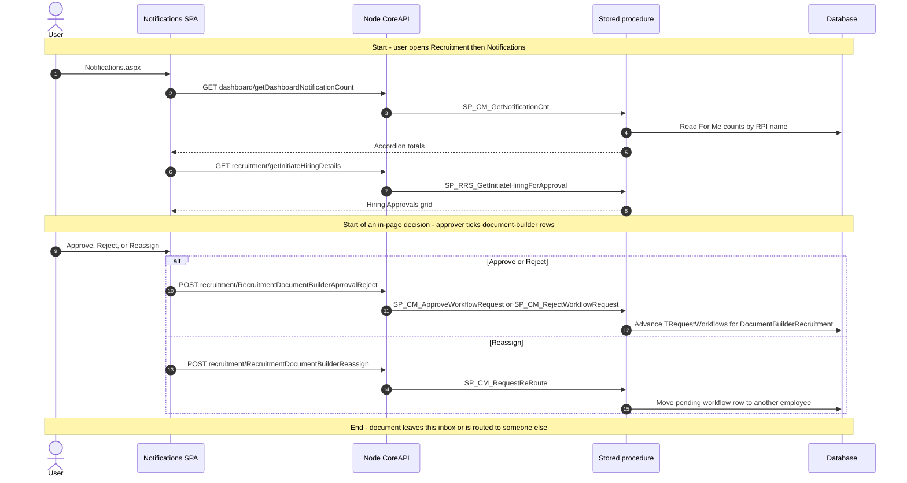
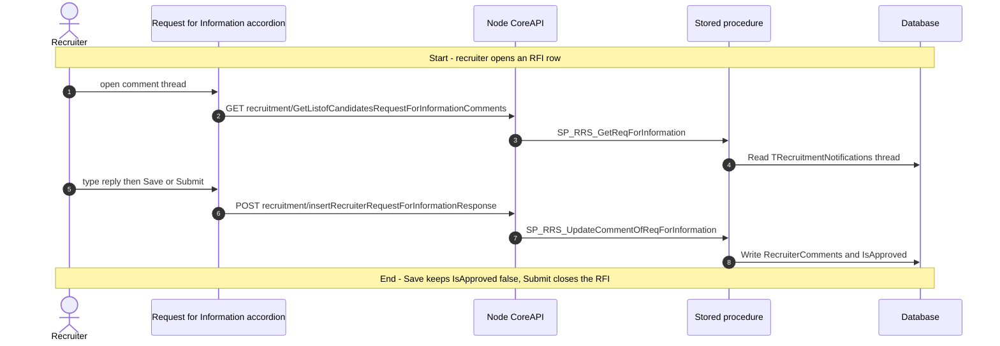
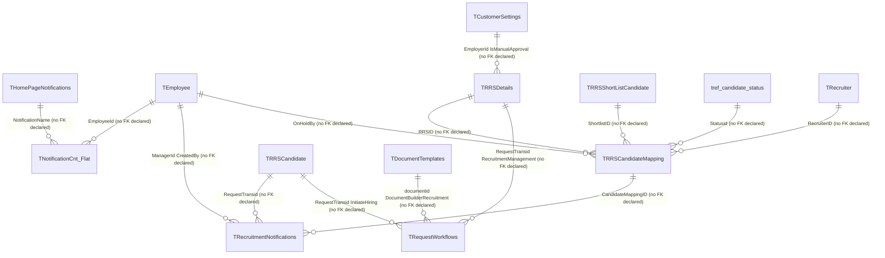

# Notifications

## Overview

A hiring manager, recruiter, or recruitment admin opens **Recruitment → Notifications** when work is waiting on them in the hiring pipeline and they need one inbox rather than hunting across dashboards. The page is not a create form. It is a stack of accordions. On load the SPA asks the shared home-page count procedure which recruitment `RPI_*` types have a non-zero **For Me** count, then renders only those sections. If every filtered count is zero, the page shows **No pending notifications.** after a two-second fallback.

What they can do depends on the accordion:

- **Hiring Approvals** (or **Hiring Approvals/RFI** when the employer is not on manual approval) — pending initiate-hiring rows. Clicking **Approve/Reject** leaves this page for the hiring-approval request screen, or opens Add / View Candidate when `IsManualApproval` is true. Clicking a name or RRS number opens the same overlays used by the other recruitment dashboards.
- **Approved Shortlist Candidate** — recruiter’s shortlisted people who do not yet have a candidate id. **View Details** opens the candidate overlay with `approvedShortlist` set.
- **RRS Pending Approval** — submitted requisitions waiting on this manager. The row action opens the RRS form (view, with comments when the action is Approve/Reject). This accordion does not post approve/reject itself.
- **Document Builder** — pending `DocumentBuilderRecruitment` workflow rows. Tick rows, comment, then approve, reject, or reassign in place.
- **Offer Pending For Review** — offer-approval queue. **Approve/Reject** encrypts the candidate id and leaves for the offer-approval request screen.
- **On Hold Candidate** — mappings this person put on hold. Tick rows to approve or reject the hold, or extend the expiry date from a calendar popup.
- **Request for Information** — recruiter inbox for hiring-approver RFIs stored in `TRecruitmentNotifications`. Opening a row loads the comment thread; the recruiter saves or submits a reply here.
- **Budget Approval** — pending budgets (when budget approval is in use). The row opens the budget-approval overlay on this shell; submit there writes budget comments and status.
- **Initiate Hiring Approval** — recruitment-admin queue. **Click Here** encrypts the candidate id and leaves for initiate-hiring approval, but only when the row’s business unit is in the viewer’s CTC-access list.

**Who's involved:**

- **Hiring manager / workflow approver** — default audience for hiring, RRS, offer, document-builder, and budget accordions. Counts come from `SP_CM_GetNotificationCnt` with `NotificationFor = ForMe`.
- **Recruiter** — approved-shortlist and request-for-information accordions; they also appear as the assigned recruiter on hiring/offer/on-hold rows.
- **Recruitment admin** — initiate-hiring-approval accordion (`RPI_InitiateHiringApproval`), fed by `TRecruitmentNotifications` rows with `RequestType = InitiateHiringApproval`.
- **Global-access user** (`IsGlobalAccess = Y`) — organisation multi-select bound to grid id `NotificationDashboard_Grid`. Unlike the other recruitment dashboards, this picker does not persist the selection (`insertMultiOrg` is not called) and it starts with every organisation selected.

There is **no** `llm-wiki/domain` lifecycle page for this inbox. Table one-liners live in `llm-wiki/reference/tables/hrms.md` (`TRecruitmentNotifications`, `TRequestWorkflows`, `THomePageNotifications`). Approve/reject for document builder (and the screens this page navigates to for hiring, RRS, and offer) reuse `llm-wiki/domain/approval-workflow.md`. SourceCode `docs/SystemModels/SystemModel-2/domain/contexts/recruitment.md` covers WebForms `HRM/Recruitment/` and **explicitly excludes** the React recruitment apps, so it does not name this live page. This guide is the application call chain those catalogs do not cover.

Sibling left-nav items **Recruitment Dashboard**, **RRS Dashboard**, **Sourcing Dashboard**, **Shortlisting Dashboard**, **Interview Dashboard**, **Candidate Referral**, **Candidate Dashboard**, **Resume Bank**, and **Candidate Login Link** are separate menu pages. Hiring approval, offer approval, initiate hiring, Add / View Candidate, and the RRS form are screens this inbox opens; they are not this menu item. Home-page and in-app deep links land here with `?NotificationId=` (numeric ids from other recruitment screens, or `RPI_*` strings for some accordions).

## Workflow

```mermaid
flowchart TD
  Nav["Recruitment left-nav Notifications"] --> ASPX["Notifications.aspx"]
  ASPX --> SPA["Notifications.js"]

  Deep["Query NotificationId"] --> SPA

  SPA --> Cnt["GET /dashboard/getDashboardNotificationCount"]
  Cnt --> CntSP["SP_CM_GetNotificationCnt"]
  CntSP --> Flat[("TNotificationCnt_Flat / THomePageNotifications")]
  CntSP --> HoldCnt[("TRRSCandidateMapping OnHold")]
  CntSP --> AdminCnt[("TRecruitmentNotifications")]
  CntSP --> RfiCnt[("TRRSInquiryRecipients")]

  Cnt -->|"ForMe greater than 0"| Accordions["Matching accordions"]

  SPA --> Org["GET /recruitment/getOrganizationList"]
  Org --> OrgSP["SP_AdminRM_GetGlobalAccessEmployerList"]
  OrgSP --> GridCfg[("TRRS_GRID_CONFIG")]

  SPA --> Manual["GET /recruitment/GetCustomerManualApprovalSettings"]
  Manual --> ManualSP["USP_GetCustomerManualApprovalSettings"]

  Accordions --> Hire["GET /recruitment/getInitiateHiringDetails"]
  Hire --> HireSP["SP_RRS_GetInitiateHiringForApproval"]
  HireSP --> Map[("TRRSCandidateMapping")]
  HireSP --> Cand[("TRRSCandidate")]
  HireSP --> RRS[("TRRSDetails")]
  HireSP --> Wf[("TRequestWorkflows")]

  Accordions --> Short["GET /recruitment/getApprovedShortlistCandidate"]
  Short --> ShortSP["SP_RRS_GetShortlistedCandidate"]
  ShortSP --> SL[("TRRSShortListCandidate")]
  ShortSP --> Map

  Accordions --> PendRrs["GET /recruitment/getRRSPendingForApproval"]
  PendRrs --> PendRrsSP["Sp_GetRrstoApprove"]
  PendRrsSP --> RRS
  PendRrsSP --> Wf

  Accordions --> Doc["GET /recruitment/GetDocumentBuilderData"]
  Doc --> DocSP["SP_PendingDocumentBuilderRecruitment"]
  DocSP --> Tpl[("TDocumentTemplates")]
  DocSP --> Wf
  Doc -->|"Approve or Reject"| DocAR["POST /recruitment/RecruitmentDocumentBuilderAprrovalReject"]
  DocAR --> Cm["SP_CM_ApproveWorkflowRequest / SP_CM_RejectWorkflowRequest"]
  Doc -->|"Reassign"| DocRe["POST /recruitment/RecruitmentDocumentBuilderReassign"]
  DocRe --> ReSP["SP_CM_RequestReRoute"]

  Accordions --> Offer["GET /recruitment/getOfferPendingForReview"]
  Offer --> OfferSP["SP_RRS_GetPendingForReviewForApproval"]
  OfferSP --> Map
  OfferSP --> Wf

  Accordions --> Hold["GET /recruitment/GetListofCandidatesOnhold"]
  Hold --> HoldSP["SP_GetOnHoldCandidatesList"]
  HoldSP --> Map
  Hold -->|"Approve or Reject"| HoldUpd["POST /recruitment/updateOnHoldCandidateStatus"]
  HoldUpd --> HoldUpdSP["SP_RRS_UpdOnHoldCandidateStatus"]
  Hold -->|"extend expiry"| HoldExp["POST /recruitment/UpdateOnHoldExpiry"]
  HoldExp --> HoldExpSP["SP_RRS_UpdCandidateMapping"]

  Accordions --> Rfi["GET /recruitment/GetListofCandidatesRequestForInformation"]
  Rfi --> RfiSP["SP_RRS_GetReqForInformation"]
  RfiSP --> Notif[("TRecruitmentNotifications")]
  Rfi -->|"Save or Submit"| RfiPost["POST /recruitment/insertRecruiterRequestForInformationResponse"]
  RfiPost --> RfiUpd["SP_RRS_UpdateCommentOfReqForInformation"]
  RfiUpd --> Notif

  Accordions --> Bud["GET /recruitment/GetBudgetList"]
  Bud --> BudSP["USP_RRS_GetBudgetList"]
  Bud --> BudUI["BudgetApprovalRequest overlay"]
  BudUI --> BudSave["POST /recruitment/insertBudgetApprovalComments"]
  BudSave --> BudSaveSP["USP_RRS_InsertBudgetApprovalComments"]

  Accordions --> Admin["GET /recruitment/getRecruitmentAdminInitiateHiringApproval"]
  Admin --> AdminSP["SP_RRS_GetRecAdminInitiateHiringForApproval"]
  AdminSP --> Notif
  AdminSP --> Map
```

## Request journey

This page is an inbox. The request that **starts** here is either opening the queue or deciding a row that this shell actually writes. Hiring, RRS, offer, and recruitment-admin initiate-hiring rows leave for other screens; those writes are not this menu item.

A recruiter answering an RFI is a different request type and stays on this page.

## Entry points

> The live shell is `HRM/Recruitment_React/Notifications.aspx`, compiled in `HRMS.Web.csproj`, routed in `Areas/routes.js` to `Notifications.js`. Sibling `RNotifications.aspx` is the same React class (`Inherits="HRMS.Web.HRM.Recruitment_React.Notifications"`) but is **not** in the csproj. SourceCode `docs/SystemModels/SystemModel-2/domain/contexts/recruitment.md` documents WebForms `HRM/Recruitment/` only and excludes this React app.

| UI page / API endpoint | Purpose |
|---|---|
| `HRM/Recruitment_React/Notifications.aspx` | WebForms shell. `Page_Load` stamps session identity into hidden fields, logs `ActivityDescription.RecruitmentNotifications`, loads `BuildJS/recruitment.min.js` |
| `Areas/Notifications/Notifications.js` | Inbox shell. Counts, org picker, hiring and approved-shortlist grids, hosts the other accordions |
| `RRS_PendingApproval.js` | RRS pending accordion |
| `PendingDocumentBuilderGridComponent.js` | Document-builder accordion plus in-place approve / reject / reassign |
| `OfferPendingForReview.js` | Offer-pending accordion |
| `OnHoldCandidate.js` | On-hold accordion plus in-place approve / reject / extend expiry |
| `RequestForInformation.js` | RFI accordion plus save / submit reply |
| `BudgetApproval.js` + `BudgetSetup/BudgetApprovalRequest.js` | Budget accordion and overlay |
| `InitiateHiringApproval.js` | Recruitment-admin initiate-hiring accordion |
| `?NotificationId=` | Deep link. Numeric ids `12` / `13` / `33` / `42` / `46` auto-expand matching accordions. String ids `RPI_OnHoldCandidate`, `RPI_RequestforInformation`, `RPI_BudgetApprovals`, `RPI_InitiateHiringApproval` auto-expand those four. `checkNotificationId` is read and unused |

## Code → database call chain

There is **no BLL layer** on most of this Node path. Document-builder approve/reject/reassign and on-hold status update go through `recruitmentBLL` only to wrap the DAL transaction. The WebForms code-behind does not make data-access calls.

| Entry point | DAL/BLL method (`file:line`) | Stored procedure |
|---|---|---|
| Page load | `Notifications.aspx.cs` `Page_Load` (`Notifications.aspx.cs:27-48`) | none |
| Accordion visibility | `GetDashboardNotificationCount` (`dashboardController.js:153`, `dashBoardDAL.js:104`) | `SP_CM_GetNotificationCnt` |
| Organisation picker | `GetOrganizationList` (`recruitmentController.js:233`, `recruitmentDAL.js:943`) | `SP_AdminRM_GetGlobalAccessEmployerList` |
| Manual-approval title | `GetCustomerManualApprovalSettings` (`recruitmentController.js:3184`, `recruitmentDAL.js:8376`) | `USP_GetCustomerManualApprovalSettings` |
| Hiring Approvals grid / column order | `GetInitiateHiringDetails` (`recruitmentController.js:3062`, `recruitmentDAL.js:8149`); `GetGridConfig` (`recruitmentController.js:2523`, `recruitmentDAL.js:6642`) | `SP_RRS_GetInitiateHiringForApproval`; `SP_RRS_GetGridConfig` (`InitiateHiring_Grid`) |
| Hiring / candidate / shortlist click — encrypt | `EncryptValue` / encryption (`HRMS.Shared/HRMS.WebAPI/Controllers/RecruitmentController.cs`) | none (in-process encryption) |
| Approved Shortlist grid | `GetApprovedShortlistCandidate` (`recruitmentController.js:3247`, `recruitmentDAL.js:8525`) | `SP_RRS_GetShortlistedCandidate` |
| RRS Pending grid | `GetRRSPendingForApproval` (`recruitmentController.js:3071`, `recruitmentDAL.js:8165`) | `Sp_GetRrstoApprove` |
| Document Builder grid | `GetDocumentBuilderData` (`recruitmentController.js:3257`, `recruitmentDAL.js:8478`) | `SP_PendingDocumentBuilderRecruitment` |
| Document Builder reassign picker | `GetEmployeesByOrganization` (`recruitmentController.js:35`, `recruitmentDAL.js:16`) | `SP_AdminEMP_GetEmpListByOrg` |
| Document Builder approve / reject | `RecruitmentDocumentBuilderAprrovalReject` (`recruitmentController.js:3266`, `recruitmentDAL.js:8540`) | `SP_CM_ApproveWorkflowRequest` or `SP_CM_RejectWorkflowRequest` (`RequestType` `DocumentBuilderRecruitment`) |
| Document Builder reassign | `RecruitmentDocumentBuilderReassign` (`recruitmentController.js:3275`, `recruitmentDAL.js:8571`) | `SP_CM_RequestReRoute` |
| Offer Pending grid | `GetOfferPendingForReview` (`recruitmentController.js:1295`, `recruitmentDAL.js:8206`) | `SP_RRS_GetPendingForReviewForApproval` |
| On Hold grid | `GetListofCandidatesOnhold` (`recruitmentController.js:3785`, `recruitmentDAL.js:8690`) | `SP_GetOnHoldCandidatesList` |
| On Hold approve / reject | `updateOnHoldCandidateStatus` (`recruitmentController.js:3803`, `recruitmentDAL.js:8729`) | `SP_RRS_UpdOnHoldCandidateStatus` |
| On Hold extend expiry | `UpdateOnHoldExpiry` (`recruitmentController.js:3794`, `recruitmentDAL.js:8706`) | `SP_RRS_UpdCandidateMapping` |
| RFI grid | `GetListofCandidatesRequestForInformation` (`recruitmentController.js:3820`, `recruitmentDAL.js:9542`) | `SP_RRS_GetReqForInformation` (first result set) |
| RFI comment thread | `GetListofCandidatesRequestForInformationComments` (`recruitmentController.js:3829`, `recruitmentDAL.js:9558`) | `SP_RRS_GetReqForInformation` (second result set) |
| RFI attachment employer / path / files | `GetEmployerIdFromCandidate` (`recruitmentController.js:1051`, `recruitmentDAL.js:2885`); `GetDocumentPath` (`recruitmentController.js:297`, `recruitmentDAL.js:1013`); `DownloadCandidateDocuments` (`recruitmentController.js:1060`) | `Sp_RRS_GetEmployerFromCandidate`; `SP_CM_GetEmailTemplatesDocumentPath`; file system (no SP) |
| RFI save / submit | `InsertRecruiterRequestForInformationResponse` (`recruitmentController.js:3837`, `recruitmentDAL.js:9581`) | `SP_RRS_UpdateCommentOfReqForInformation` |
| Budget grid | `GetBudgetList` (`recruitmentController.js:3676`, `recruitmentDAL.js:9031`); `GetGridConfig` (`BudgetApproval_Grid`) | `USP_RRS_GetBudgetList`; `SP_RRS_GetGridConfig` |
| Budget overlay | `GetBudgetDetails` (`recruitmentController.js:3549`, `recruitmentDAL.js:9047`); `GetBudgetApprovalComments` (`recruitmentController.js:5167`, `recruitmentDAL.js:10666`); `GetBuWiseEmployeeList` (`recruitmentController.js:5158`, `recruitmentDAL.js:10650`) | `USP_RRS_GetBudgetDetails`; `USP_RRS_GetBudgetApprovalComments`; `USP_RRS_GetEmployeeDetails` |
| Budget decide | `InsertBudgetApprovalComments` (`recruitmentController.js:5185`, `recruitmentDAL.js:10694`) | `USP_RRS_InsertBudgetApprovalComments` |
| Initiate Hiring Approval grid | `GetRecruitmentAdminInitiateHiringApproval` (`recruitmentController.js:3757`, `recruitmentDAL.js:9420`); `GetCTCAccessEmployeeData` (`dashboardController.js:2883`, `DashBoardRoutes.js:260`) | `SP_RRS_GetRecAdminInitiateHiringForApproval`; `USP_EmployeeAccessPermission_List` |
| Save column order (hiring / budget / admin hiring grids) | `SetGridConfig` (`recruitmentController.js:2532`, `recruitmentDAL.js:6657`) | `SP_RRS_InsertGridConfig` |

`GET_CANDIDATE_DASHBOARD_LIST` / `ApproveRejectRrsPendingApproval` / `ApproveRejectBudgetApprovalRequest` / `insertRecruitmentAdminNotifications` remain on the Node DAL and are **not** called from this React inbox. RFI rows are inserted from the hiring-approval request screen (`Sp_RRS_InsertReqForInfoNotifications`). Recruitment-admin hiring rows are inserted from initiate-hiring (`Sp_RRS_InsertRecruitmentNotifications`).

## API endpoints

The live SPA constants for this page resolve to `/recruitment/...` routes (and `/dashboard/...` for counts, `/dashBoard/...` for CTC access). The older `/v2/recruitment/...` and `/v3/recruitment/...` variants remain in `apiURLConstants.js`, but the duplicate keys later in the file make the plain `/recruitment/...` versions the ones this bundle uses. `routeIndex.js` mounts only `RecruitmentRoutes.js` at `/recruitment` and `DashBoardRoutes.js` at `/dashBoard`.

This feature has Node recruitment and dashboard routes, plus .NET encrypt GETs. There are no PageMethods on the React shell.

| Verb | Route | Parameters | Purpose | Source |
|---|---|---|---|---|
| `GET` | `/dashboard/getDashboardNotificationCount` | query `moduleName` (`DSH`), `employeeId` (sent; live controller uses `req.EID`), `notificationFor` (`ForMe`) | Accordion visibility (`ForMe` per `NotificationName`) | `DashBoardRoutes.js:16`, `dashboardController.js:153` |
| `GET` | `/recruitment/getOrganizationList` | query `employeeId` (sent; live controller uses `req.EID`), `gridId` (`NotificationDashboard_Grid`) | Global-access organisation list. Selection is not saved | `RecruitmentRoutes.js:22`, `recruitmentController.js:233` |
| `GET` | `/recruitment/GetCustomerManualApprovalSettings` | query `employerId` (int, required) | Hiring accordion title and whether approve goes to View Candidate | `RecruitmentRoutes.js:278`, `recruitmentController.js:3184` |
| `GET` | `/recruitment/getGridConfig` | query `employerId`, `employeeId` (sent; live controller uses `req.EID`), `gridId` (`InitiateHiring_Grid`, `BudgetApproval_Grid`, or `InitiateHiringApproval_Grid`) | Saved `GridFormat` column order | `RecruitmentRoutes.js:214`, `recruitmentController.js:2523` |
| `GET` | `/recruitment/getInitiateHiringDetails` | query `ManagerId` (int, required), `EmployerIds` (comma-separated) | Hiring Approvals grid | `RecruitmentRoutes.js:266`, `recruitmentController.js:3062` |
| `GET` | `/recruitment/getApprovedShortlistCandidate` | query `EmployerID`, `EmployeeID`, `EmployerIds` | Approved Shortlist grid | `RecruitmentRoutes.js:285`, `recruitmentController.js:3247` |
| `GET` | `/recruitment/getRRSPendingForApproval` | query `employeeid`, `EmployerIds` | RRS Pending grid | `RecruitmentRoutes.js:267`, `recruitmentController.js:3071` |
| `GET` | `/recruitment/GetDocumentBuilderData` | query `employeeId`, `EmployerIds` | Document Builder grid | `RecruitmentRoutes.js:286`, `recruitmentController.js:3257` |
| `GET` | `/recruitment/getOrganizationEmployees` | query `organizationId`, `employeeId` | Reassign employee picker | `RecruitmentRoutes.js:9`, `recruitmentController.js:35` |
| `POST` | `/recruitment/RecruitmentDocumentBuilderAprrovalReject` | body `rrsId` (document ids, comma-separated), `comments`, `employerId`, `employeeId`, `status` (`Approve` / `Reject`) | In-place document-builder decision | `RecruitmentRoutes.js:287`, `recruitmentController.js:3266` |
| `POST` | `/recruitment/RecruitmentDocumentBuilderReassign` | body `RequestTransId`, `Reason`, `employerId`, `ReRouteEmployeeid`, `RequestType` (`DocumentBuilderRecruitment`) | Reassign pending document-builder workflow | `RecruitmentRoutes.js:288`, `recruitmentController.js:3275` |
| `GET` | `/recruitment/getOfferPendingForReview` | query `EmployerId`, `EmployeeId`, `EmployerIds` | Offer Pending grid | `RecruitmentRoutes.js:269`, `recruitmentController.js:1295` |
| `GET` | `/recruitment/GetListofCandidatesOnhold` | query `employeeId`, `employerId`, `EmployerIds` | On Hold grid | `RecruitmentRoutes.js:314`, `recruitmentController.js:3785` |
| `POST` | `/recruitment/updateOnHoldCandidateStatus` | body `employerId`, `employeeId`, `candidateIds`, `rrsId`, `comments`, `status` (`Approved` / `Rejected`), `candidateMappingIds`, `shortListIds` (comma-separated) | Clear or reject on-hold mappings | `RecruitmentRoutes.js:316`, `recruitmentController.js:3803` |
| `POST` | `/recruitment/UpdateOnHoldExpiry` | body `EmployerId`, `UpdatedBy`, `CandidateId`, `RRSId`, `UpdatedExpiryDate`, `CandidateMappingId` | Extend on-hold expiry | `RecruitmentRoutes.js:315`, `recruitmentController.js:3794` |
| `GET` | `/recruitment/GetListofCandidatesRequestForInformation` | query `employeeId`, `employerId`, `EmployerIds` | RFI grid | `RecruitmentRoutes.js:345`, `recruitmentController.js:3820` |
| `GET` | `/recruitment/GetListofCandidatesRequestForInformationComments` | query `employeeId`, `employerId`, `EmployerIds`, `CandidateId`, `RecruitmentNotificationId` | RFI comment thread | `RecruitmentRoutes.js:346`, `recruitmentController.js:3829` |
| `GET` | `/recruitment/getEmployerIdFromCandidate` | query `candidatemappingid` | Employer for RFI attachments | `RecruitmentRoutes.js:94`, `recruitmentController.js:1051` |
| `GET` | `/recruitment/getDocumentPath` | query `documentType` | RFI attachment folder | `RecruitmentRoutes.js:29`, `recruitmentController.js:297` |
| `GET` | `/recruitment/DownloadCandidateDocuments` | query `downloadFile` | List files in that folder | `RecruitmentRoutes.js:96`, `recruitmentController.js:1060` |
| `POST` | `/recruitment/insertRecruiterRequestForInformationResponse` | body `Status` (`Save` / `Submit`), `RecruitmentNotificationId`, `Employerid`, `CandidateId`, `UpdateBy`, `RecruiterComments` | Recruiter RFI reply | `RecruitmentRoutes.js:347`, `recruitmentController.js:3837` |
| `GET` | `/recruitment/GetBudgetList` | query `employerId`, `employeeId` (sent; live controller uses `req.EID`), `isFromNotification` (`1`) | Budget accordion rows plus attachments (`recordsets[0]` / `[1]`) | `RecruitmentRoutes.js:306`, `recruitmentController.js:3676` |
| `GET` | `/recruitment/GetBudgetDetails` | query `employerId`, `budgetId`, `isFromNotification` (overlay sends `0`) | Budget overlay header and lines | `RecruitmentRoutes.js:307`, `recruitmentController.js:3549` |
| `GET` | `/recruitment/getBudgetApprovalComments` | query `budgetId` | Prior approver comments | `RecruitmentRoutes.js:390`, `recruitmentController.js:5167` |
| `GET` | `/recruitment/getBuWiseEmployeeList` | query `employerId`, `title` (this overlay `null`), `buId` | Replacement-employee picker | `RecruitmentRoutes.js:389`, `recruitmentController.js:5158` |
| `POST` | `/recruitment/insertBudgetApprovalComments` | body `BudgetId`, `EmployerId`, `ManagerId`, `LevelId`, amount/comment fields, `Status`, `UDTNewHireBudget` | Approve or reject the budget from the overlay | `RecruitmentRoutes.js:392`, `recruitmentController.js:5185` |
| `GET` | `/recruitment/getRecruitmentAdminInitiateHiringApproval` | query `EmployerId`, `ManagerId`, `candidateID`, `candidateMappingId`, `EmployerIds` | Recruitment-admin hiring grid (`recordsets[0]`) | `RecruitmentRoutes.js:325`, `recruitmentController.js:3757` |
| `GET` | `/dashBoard/GetCTCAccessEmployeeData` | query `employerId`, `EmployeeAccessPermissionID` (this page `null`), `employeeId` | Gate **Click Here** on the admin hiring grid | `DashBoardRoutes.js:260`, `dashboardController.js:2883` |
| `GET` | `api/recruitment/encryption` / `api/recruitment/encryptvalue` | query `value` | Encrypt candidate or shortlist id before leaving this page. .NET Web API via `APIHelper.getNetApi` | `HRMS.WebAPI/Controllers/RecruitmentController.cs` |
| `POST` | `/recruitment/setGridConfig` | body `EmployerId`, `EmployeeId`, `PageName`, `ConfigType` (`GridFormat`), `Config` | Persist column order on hiring / budget / admin hiring grids | `RecruitmentRoutes.js:215`, `recruitmentController.js:2532` |
| `GET` | `/Document/Download` | query `documentId` | Budget attachment view / download | budget overlay `DocumentCard.js` |

## Stored procedures & tables involved

> Live objects are in core **`HRMS`**. Several hiring / RRS / offer / document-builder counts in `SP_CM_GetNotificationCnt` are now served from `TNotificationCnt_Flat` (inline `SELECT` blocks commented as Workstream A / D2). On-hold, request-for-information, and recruitment-admin initiate-hiring counts are still computed inline. Table meanings reuse `llm-wiki/reference/tables/hrms.md` where a row exists. Budget list/detail/comment procedures are called from the live DAL but have **no** matching `.sql` files in this `HRMS-DATABASE` checkout.

| Object | File path | Purpose | llm-wiki |
|---|---|---|---|
| `TRecruitmentNotifications` | `HRMS-DATABASE/HRMS/TABLES/TRecruitmentNotifications.sql` plus `DDL/87297` (`CandidateMappingID`) and `DDL/93476` (`ApproverComments`, `ApprovalLevel`, `RecruiterComments`) | RFI and recruitment-admin hiring inbox rows. PK only; no FK declared | `llm-wiki/reference/tables/hrms.md` |
| `TRequestWorkflows` | catalogued in wiki | Pending hiring (`InitiateHiring` / `RevisedInitiateHiring`), RRS (`RecruitmentManagement`), offer (`OfferPendingForReview`), document builder (`DocumentBuilderRecruitment`), budget (`BudgetApproval`) | `llm-wiki/reference/tables/hrms.md` |
| `THomePageNotifications` | catalogued in wiki | `NotificationName` / `RPI_*` master used by the count procedure | `llm-wiki/reference/tables/hrms.md` |
| `TNotificationCnt_Flat` | `HRMS-DATABASE/HRMS/TABLES/TNotificationCnt_Flat.sql` | Precomputed For Me counts for several recruitment `RPI_*` names | — |
| `TRRSCandidateMapping` | `HRMS-DATABASE/HRMS/TABLES/TRRSCandidateMapping.sql` | Hiring / offer / on-hold / approved-shortlist grain. `OnHoldBy`, `OnHoldExpiryDate`, `Statusid`. No FK declared | `llm-wiki/reference/tables/hrms.md` |
| `TRRSCandidate` | `HRMS-DATABASE/HRMS/TABLES/TRRSCandidate.sql` | Hiring / admin-hiring candidate master | `llm-wiki/reference/tables/hrms.md` |
| `TRRSShortListCandidate` | `HRMS-DATABASE/HRMS/TABLES/TRRSShortListCandidate.sql` | Approved-shortlist and RFI name/source | `llm-wiki/reference/tables/hrms.md` |
| `TRRSDetails` | `HRMS-DATABASE/HRMS/TABLES/TRRSDetails.sql` | Requisition joined on every candidate/RRS accordion | `llm-wiki/reference/tables/hrms.md` |
| `TDocumentTemplates` | used by `SP_PendingDocumentBuilderRecruitment` | Document-builder row (`documentid` = workflow `RequestTransid`) | — |
| `tref_candidate_status` | catalogued in wiki | On-hold status (`OnHold`, `RevHiringOnHold`) and hiring pending statuses | `llm-wiki/reference/tables/hrms.md` |
| `TRecruiter` | catalogued in wiki | Assigned recruiter; approved-shortlist filter is `TRecruiter.EmployeeId = @EmployeeId` | `llm-wiki/reference/tables/hrms.md` |
| `TRRS_GRID_CONFIG` | catalogued in wiki | Column order. Organisation picker for this page reads `NotificationDashboard_Grid` and does not write it | `llm-wiki/reference/tables/hrms.md` |
| `TCustomerSettings` | used by count + offer list | `IsManualApproval`, `IsUseBudgetApproval` | — |
| `TRRSBudget` / `TRRSBudgetStatus` | used by commented count SQL and workflow approve/reject | Budget header and status. No `CREATE TABLE` in this checkout | — |
| `TRRSInquiryRecipients` | used by `SP_CM_GetNotificationCnt` RFI count | Count source for `RPI_RequestforInformation` (`Status = Awaiting`). No `CREATE TABLE` in this checkout | — |
| `TDocumentPaths` | used by `SP_CM_GetEmailTemplatesDocumentPath` | RFI attachment folder | `llm-wiki/reference/tables/hrms.md` |
| `SP_CM_GetNotificationCnt` | `HRMS-DATABASE/HRMS/STOREPROCEDURE/SP_CM_GetNotificationCnt.sql` | For Me counts. Module `DSH` | — |
| `SP_RRS_GetInitiateHiringForApproval` | `HRMS-DATABASE/HRMS/STOREPROCEDURE/SP_RRS_GetInitiateHiringForApproval.sql` | Hiring Approvals grid | — |
| `SP_RRS_GetShortlistedCandidate` | `HRMS-DATABASE/HRMS/STOREPROCEDURE/SP_RRS_GetShortlistedCandidate.sql` | Approved Shortlist grid (`STATUS = ShortListed` and `candidateid` is 0) | — |
| `Sp_GetRrstoApprove` | `HRMS-DATABASE/HRMS/STOREPROCEDURE/Sp_GetRrstoApprove.sql` | RRS Pending grid | — |
| `SP_PendingDocumentBuilderRecruitment` | `HRMS-DATABASE/HRMS/STOREPROCEDURE/SP_PendingDocumentBuilderRecruitment.sql` | Document Builder grid | — |
| `SP_RRS_GetPendingForReviewForApproval` | `HRMS-DATABASE/HRMS/STOREPROCEDURE/SP_RRS_GetPendingForReviewForApproval.sql` | Offer Pending grid | — |
| `SP_GetOnHoldCandidatesList` | `HRMS-DATABASE/HRMS/STOREPROCEDURE/SP_GetOnHoldCandidatesList.sql` | On Hold grid | — |
| `SP_RRS_UpdOnHoldCandidateStatus` | `HRMS-DATABASE/HRMS/STOREPROCEDURE/SP_RRS_UpdOnHoldCandidateStatus.sql` | Approve/reject on-hold (also calls `SP_RecruitmentNotificationToCandidate`) | — |
| `SP_RRS_UpdCandidateMapping` | `HRMS-DATABASE/HRMS/STOREPROCEDURE/SP_RRS_UpdCandidateMapping.sql` | On-hold expiry | — |
| `SP_RRS_GetReqForInformation` | `HRMS-DATABASE/HRMS/STOREPROCEDURE/SP_RRS_GetReqForInformation.sql` | RFI grid and comment thread | — |
| `SP_RRS_UpdateCommentOfReqForInformation` | `HRMS-DATABASE/HRMS/STOREPROCEDURE/SP_RRS_UpdateCommentOfReqForInformation.sql` | Recruiter RFI reply | — |
| `Sp_RRS_GetEmployerFromCandidate` | `HRMS-DATABASE/HRMS/STOREPROCEDURE/` | Employer for RFI files | — |
| `SP_RRS_GetRecAdminInitiateHiringForApproval` | `HRMS-DATABASE/HRMS/STOREPROCEDURE/SP_RRS_GetRecAdminInitiateHiringForApproval.sql` | Recruitment-admin hiring grid | — |
| `Sp_RRS_InsertRecruitmentNotifications` | `HRMS-DATABASE/HRMS/STOREPROCEDURE/Sp_RRS_InsertRecruitmentNotifications.sql` | Producer (initiate-hiring send), not called from this page | — |
| `Sp_RRS_InsertReqForInfoNotifications` | `HRMS-DATABASE/HRMS/STOREPROCEDURE/Sp_RRS_InsertReqForInfoNotifications.sql` | Producer (hiring-approval RFI), not called from this page | — |
| `SP_CM_ApproveWorkflowRequest` / `SP_CM_RejectWorkflowRequest` | `HRMS-DATABASE/HRMS/STOREPROCEDURE/` | Document-builder decision on this page; hiring/RRS/offer decisions on the screens this page opens | `llm-wiki/domain/approval-workflow.md` |
| `SP_CM_RequestReRoute` | `HRMS-DATABASE/HRMS/STOREPROCEDURE/` | Document-builder reassign | `llm-wiki/domain/approval-workflow.md` |
| `USP_RRS_GetBudgetList` / `USP_RRS_GetBudgetDetails` / `USP_RRS_GetBudgetApprovalComments` / `USP_RRS_InsertBudgetApprovalComments` | executed from `recruitmentDAL.js`; **no script in this checkout** | Budget accordion and overlay | — |
| `USP_RRS_GetEmployeeDetails` | executed from `GetBuWiseEmployeeList` | Budget overlay employee picker | — |
| `SP_AdminRM_GetGlobalAccessEmployerList` | `HRMS-DATABASE/HRMS/STOREPROCEDURE/` | Organisation list | — |
| `SP_RRS_GetGridConfig` / `SP_RRS_InsertGridConfig` | `HRMS-DATABASE/HRMS/STOREPROCEDURE/` | Column-order read / write | — |
| `USP_GetCustomerManualApprovalSettings` | `HRMS-DATABASE/HRMS/STOREPROCEDURE/` | Manual-approval flag | — |
| `USP_EmployeeAccessPermission_List` | `HRMS-DATABASE/HRMS/STOREPROCEDURE/` | CTC-access unit ids | — |
| `SP_AdminEMP_GetEmpListByOrg` | `HRMS-DATABASE/HRMS/STOREPROCEDURE/` | Reassign picker | — |
| `SP_CM_GetEmailTemplatesDocumentPath` | `HRMS-DATABASE/HRMS/STOREPROCEDURE/` | RFI attachment path | — |
| `SP_ApproveRejectBudgetApproval` | executed from unused `ApproveRejectBudgetApprovalRequest` | Alternate budget decide path, not called from this overlay | — |

## Table relationships

The project does not have a recruitment-notifications ER diagram to reuse, so this diagram is derived from `llm-wiki/reference/tables/hrms.md` plus the procedure-level table usage above. Where the catalog or DDL does not declare a foreign key, the relationship is labelled as such instead of being invented.

## Known gaps

- There is **no** recruitment-notifications canonical domain page in `llm-wiki/domain/`. SourceCode `docs/SystemModels/SystemModel-2/domain/contexts/recruitment.md` excludes the React recruitment apps. Behaviour above is from SourceCode + procedure scripts.
- `RNotifications.aspx` is an uncompiled sibling of the live `Notifications.aspx` shell.
- `routeIndex.js` mounts only `RecruitmentRoutes.js` at `/recruitment`. `RecruitmentRoutes_V2.js` / `RecruitmentRoutes_V3.js` exist on disk and are not mounted. Duplicate keys in `apiURLConstants.js` leave the trailing `/recruitment/...` constants as the live SPA values.
- Count URL is `/dashboard/getDashboardNotificationCount` (lowercase `d`). The Node mount is `/dashBoard`. IIS is usually case-insensitive; a case-sensitive host would miss the count call and render **No pending notifications.**
- Accordion render uses unguarded `.find(item => item.NotificationName == '...').ForMe`. A missing name in the count payload throws before the fallback empty state.
- `getDashboardNotification` also keeps `RPI_PendingShortlistCandidate` and `RPI_RRSAllocated` in the filtered count list. Neither has an accordion on this page, so a non-zero count hides the empty state and shows no section.
- Deep-link auto-expand is inconsistent. Hiring / RRS / offer / document-builder / approved-shortlist compare `NotificationId` to integers `13` / `12` / `42` / `33` / `46`. On-hold / RFI / budget / admin hiring compare to `RPI_*` strings. A home-page link that passes `RPI_PendingInitiateHiring` does not expand Hiring Approvals.
- `SP_CM_GetNotificationCnt` counts `RPI_RequestforInformation` from `TRRSInquiryRecipients` (`InquiryID`, `Status = Awaiting`). The RFI accordion lists `TRecruitmentNotifications` (`RequestType = RequestforInformation`, `IsApproved = 0`). The badge and the grid can disagree.
- `USP_RRS_GetBudgetList`, `USP_RRS_GetBudgetDetails`, `USP_RRS_GetBudgetApprovalComments`, and `USP_RRS_InsertBudgetApprovalComments` are executed by the live DAL and have no `.sql` files in this `HRMS-DATABASE` checkout. `TRRSBudget` / `TRRSInquiryRecipients` have no `CREATE TABLE` scripts here either.
- Budget overlay posts `insertBudgetApprovalComments`, not `ApproveRejectBudgetApprovalRequest` (`SP_ApproveRejectBudgetApproval`). The latter route is registered twice in `RecruitmentRoutes.js` (`:310` and `:338`) and is unused by this page.
- Organisation picker for this page uses `NotificationDashboard_Grid` and never calls `insertMultiOrg`. Sibling dashboards remap to `recruitmentDashboard_Grid` and persist the selection.
- `GetOrganizationList`, `GetGridConfig`, `GetDashboardNotificationCount`, and `GetBudgetList` ignore the SPA `employeeId` query and use `req.EID`. Hiring / RRS / offer / on-hold / RFI / document-builder list endpoints use the query employee id instead.
- Hiring Approvals `Grid` is passed `approve` and `toggleApprovalPopUp`, but `Notifications.js` never defines `toggleApprovalPopUp`. Approve on that accordion is the link column that navigates away.
- RRS Pending keeps comment text in component state and never posts it. Approve/Reject only opens the RRS form with `showCommentDetails`.
- `GetDocumentBuilderData` returns the full mssql result. The SPA reads `data.recordset`. Sibling hiring list helpers return `data.recordset` already.
- `InsertRecruitmentAdminNotifications` and `UpdateHiringApprovalRequestForInformation` produce inbox rows from other screens. This page only consumes them.
- `SP_RecruitmentNotificationToCandidate` (email/WhatsApp to the candidate) is called from on-hold status update and from shared approve/reject, not from a dedicated accordion on this page.

## Reference

Confidence is medium because there is no recruitment-notifications domain wiki page, several budget procedures are missing from the DB checkout, and the live count procedure mixes flat-table and inline sources.

### SourceCode

- `HRMS.Web/HRMS.Web/HRM/Recruitment_React/Notifications.aspx` (+ `.cs`)
- `HRMS.Web/HRMS.Web/HRM/Recruitment_React/RNotifications.aspx` (uncompiled sibling)
- `HRMS.Web/HRMS.Web/HRM/Recruitment_React/Areas/Notifications/Notifications.js`
- `HRMS.Web/HRMS.Web/HRM/Recruitment_React/Areas/Notifications/RRS_PendingApproval.js`
- `HRMS.Web/HRMS.Web/HRM/Recruitment_React/Areas/Notifications/PendingDocumentBuilderGridComponent.js`
- `HRMS.Web/HRMS.Web/HRM/Recruitment_React/Areas/Notifications/OfferPendingForReview.js`
- `HRMS.Web/HRMS.Web/HRM/Recruitment_React/Areas/Notifications/OnHoldCandidate.js`
- `HRMS.Web/HRMS.Web/HRM/Recruitment_React/Areas/Notifications/RequestForInformation.js`
- `HRMS.Web/HRMS.Web/HRM/Recruitment_React/Areas/Notifications/BudgetApproval.js`
- `HRMS.Web/HRMS.Web/HRM/Recruitment_React/Areas/Notifications/InitiateHiringApproval.js`
- `HRMS.Web/HRMS.Web/HRM/Recruitment_React/Areas/Notifications/OrganizationDropDown.js.js`
- `HRMS.Web/HRMS.Web/HRM/Recruitment_React/Areas/BudgetSetup/BudgetApprovalRequest.js`
- `HRMS.Web/HRMS.Web/HRM/Recruitment_React/Areas/routes.js`
- `HRMS.Web/HRMS.Web/HRM/Recruitment_React/Common/apiURLConstants.js`
- `HRMS.Web/HRMS.Web/HRM/Recruitment_React/Common/AppConstants.js`
- `HRMS.Web/HRMS.Web/HRM/Recruitment_React/Common/routeConstants.js`
- `HRMS.CoreAPI/HRMS.Core.WebAPI.Node/Routes/routeIndex.js`
- `HRMS.CoreAPI/HRMS.Core.WebAPI.Node/Routes/RecruitmentRoutes.js`
- `HRMS.CoreAPI/HRMS.Core.WebAPI.Node/Routes/DashBoardRoutes.js`
- `HRMS.CoreAPI/HRMS.Core.WebAPI.Node/Controllers/recruitmentController.js`
- `HRMS.CoreAPI/HRMS.Core.WebAPI.Node/Controllers/dashboardController.js`
- `HRMS.CoreAPI/HRMS.Core.WebAPI.Node/Core/DataAccessLayer/recruitmentDAL.js`
- `HRMS.CoreAPI/HRMS.Core.WebAPI.Node/Core/DataAccessLayer/dashBoardDAL.js`
- `docs/SystemModels/SystemModel-2/domain/contexts/recruitment.md`

### TDG HRMS DB

- `llm-wiki/reference/tables/hrms.md`
- `llm-wiki/domain/approval-workflow.md`
- `llm-wiki/architecture/module-catalog.md`
- `HRMS-DATABASE/HRMS/TABLES/TRecruitmentNotifications.sql`
- `HRMS-DATABASE/HRMS/DDL/87297 Alter Statement for CandidateMappingID.sql`
- `HRMS-DATABASE/HRMS/DDL/93476_Alter Statement for TRecruitmentNotifications.sql`
- `HRMS-DATABASE/HRMS/TABLES/TNotificationCnt_Flat.sql`
- `HRMS-DATABASE/HRMS/STOREPROCEDURE/SP_CM_GetNotificationCnt.sql`
- `HRMS-DATABASE/HRMS/STOREPROCEDURE/SP_RRS_GetInitiateHiringForApproval.sql`
- `HRMS-DATABASE/HRMS/STOREPROCEDURE/SP_RRS_GetShortlistedCandidate.sql`
- `HRMS-DATABASE/HRMS/STOREPROCEDURE/Sp_GetRrstoApprove.sql`
- `HRMS-DATABASE/HRMS/STOREPROCEDURE/SP_PendingDocumentBuilderRecruitment.sql`
- `HRMS-DATABASE/HRMS/STOREPROCEDURE/SP_RRS_GetPendingForReviewForApproval.sql`
- `HRMS-DATABASE/HRMS/STOREPROCEDURE/SP_GetOnHoldCandidatesList.sql`
- `HRMS-DATABASE/HRMS/STOREPROCEDURE/SP_RRS_GetReqForInformation.sql`
- `HRMS-DATABASE/HRMS/STOREPROCEDURE/SP_RRS_UpdateCommentOfReqForInformation.sql`
- `HRMS-DATABASE/HRMS/STOREPROCEDURE/SP_RRS_GetRecAdminInitiateHiringForApproval.sql`
- `HRMS-DATABASE/HRMS/STOREPROCEDURE/Sp_RRS_InsertRecruitmentNotifications.sql`
- `HRMS-DATABASE/HRMS/STOREPROCEDURE/Sp_RRS_InsertReqForInfoNotifications.sql`
