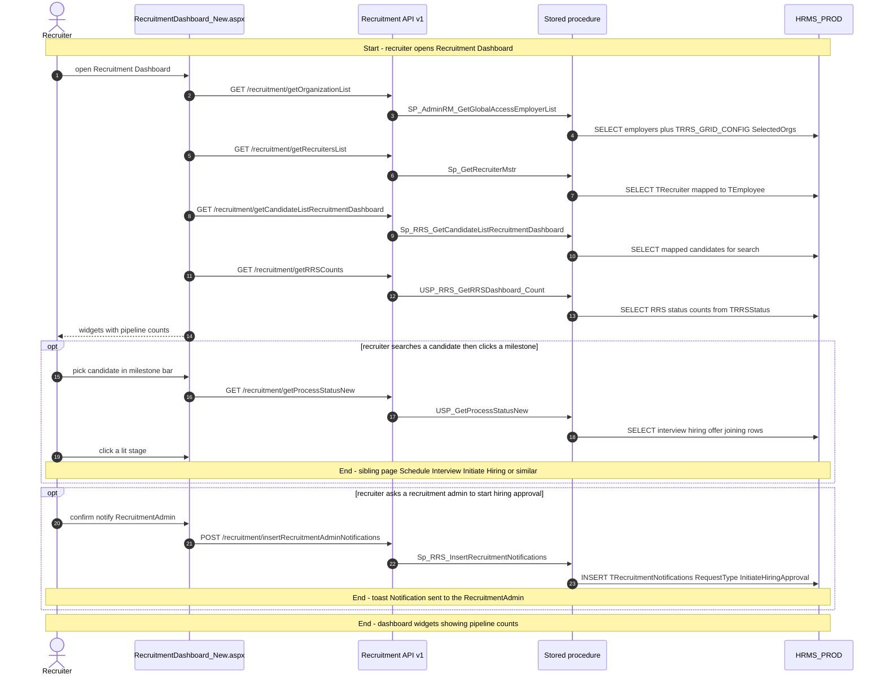
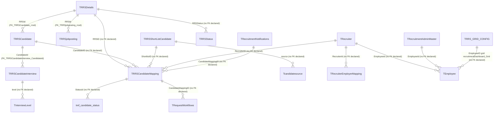

# Recruitment Dashboard

## Overview

A recruiter (or recruitment admin) wants a single screen that answers “where is hiring right now?” and “what should I do next for this candidate?” They open **Recruitment → Recruitment Dashboard** and land on `RecruitmentDashboard_New.aspx`, which hosts the Recruitment React SPA. The page is a hub, not a form: count cards, a source pie, in-process job postings, a funnel, a recruiter team card, and this month’s joiners. Nothing on those widgets creates an RRS, schedules an interview, or writes an offer.

Across the top sits **candidate milestone**. They search a name from the list the page already loaded, pick the RRS that person is mapped to, and the bar lights interview / hiring / offer / joining stages. Clicking a stage leaves this menu item and opens the matching sibling page (Schedule Interview, Initiate Hiring, and so on). If they are a recruiter and hiring is blocked on a recruitment admin, they can send a notification from a popup on this page — that is the one candidate-side write that stays here.

Users with global access (`IsGlobalAccess = Y`) also get a multi-organisation picker. Saving it stores the employer list used by the count procedures under grid id `recruitmentDashboard_Grid`.

**Who's involved:**

- **Recruiter** — default audience. Sees pipeline counts scoped to assigned requisitions, searches their candidates, jumps to the next milestone. May notify a recruitment admin to start hiring approval.
- **Recruitment admin / Administrator / PMO** — same screen with wider scope (`withReportees` is passed as null on funnel and team card). Can create RRS or add a candidate from the count-card plus button.
- **Hiring manager / other roles** — if they can open the menu, counts are limited to their reportees (`Fn_DirectIndirectReportee`). Milestone actions still respect recruitment claims (`TRecruitmentClaim` / `TRecruitmentClaim_ASSIGNMENT`).

There is **no** `llm-wiki/domain` lifecycle page for recruitment. `llm-wiki/domain/employee-lifecycle.md` only names recruitment as the candidate stage before employment. Table one-liners live in `llm-wiki/reference/tables/hrms.md` (RRS / candidate / recruiter tables in core `HRMS_PROD`). This guide is the application call chain those catalogs do not cover.

Sibling left-nav items **RRS Dashboard**, **Sourcing Dashboard**, **Shortlisting Dashboard**, **Interview Dashboard**, and **Candidate Dashboard** are separate menu pages. This screen also *embeds* status counts for those four and can redirect into them.

## Workflow

```mermaid
flowchart TD
  Nav["Recruitment left-nav Recruitment Dashboard"] --> ASPX["RecruitmentDashboard_New.aspx"]
  ASPX --> SPA["Recruitment-Dashboard"]
  SPA --> Org["GET /recruitment/getOrganizationList"]
  Org --> OrgSP["SP_AdminRM_GetGlobalAccessEmployerList"]
  OrgSP --> GridCfg[("TRRS_GRID_CONFIG")]
  SPA --> Rec["GET /recruitment/getRecruitersList"]
  Rec --> RecSP["Sp_GetRecruiterMstr"]
  RecSP --> RecT[("TRecruiter")]
  SPA --> Search["CandidateProcess search list"]
  Search --> CandGET["GET /recruitment/getCandidateListRecruitmentDashboard"]
  CandGET --> CandSP["Sp_RRS_GetCandidateListRecruitmentDashboard"]
  CandSP --> Map[("TRRSCandidateMapping")]
  SPA --> Counts["Dashboard count card"]
  Counts --> RrsGET["GET /recruitment/getRRSCounts"]
  RrsGET --> RrsSP["USP_RRS_GetRRSDashboard_Count"]
  Counts -->|"tab Interview"| IntGET["GET /recruitment/getInterviewCounts"]
  IntGET --> IntSP["USP_RRS_GetRecruiterInterviewDashboard_InterviewCount"]
  Counts -->|"tab Candidate"| CanGET["GET /recruitment/getCandidateCounts"]
  CanGET --> CanSP["USP_RRS_CandidateStatusCount"]
  Counts -->|"tab Shortlisting if workflow not skipped"| SlGET["GET /recruitment/getShortListCounts"]
  SlGET --> SlSP["USP_RRS_ShortListStatusCounts"]
  SPA --> Pie["RecruitmentSource pie"]
  Pie --> PieGET["GET /recruitment/getDashboardPieChart"]
  PieGET --> PieSP["SP_RRS_GetPieChartCount"]
  SPA --> Job["JobPosting card"]
  Job --> JobGET["GET /recruitment/getRRSJobPostingCard"]
  JobGET --> JobSP["Sp_RRS_JobPostingCard"]
  SPA --> Funnel["RecruitmentFunnel"]
  Funnel --> BuGET["GET /recruitment/getBUWiseRRS"]
  BuGET --> BuSP["SP_TS_GetBUWiseRRS"]
  Funnel --> FunGET["GET /recruitment/getFunnelCandidateCounts"]
  FunGET --> FunSP["SP_RRS_GetRecruitmentCandidateCount"]
  SPA --> Team["RecruitmentTeam"]
  Team --> TeamGET["GET /recruitment/getCandidateCountPerRRS"]
  TeamGET --> TeamSP["SP_Get_RecruitmentTeamCard"]
  SPA --> Join["NewJoinee"]
  Join --> JoinGET["GET /recruitment/getNewJoineeList"]
  JoinGET --> JoinSP["SP_GET_GetNewJoineeListAndCount"]
  Search -->|"select candidate"| Mile["GET /recruitment/getProcessStatusNew"]
  Mile --> MileSP["USP_GetProcessStatusNew"]
  Mile -->|"click stage"| Sibling["sibling Recruitment page"]
  Search -->|"recruiter notifies rec admin"| Notif["POST /recruitment/insertRecruitmentAdminNotifications"]
  Notif --> NotifSP["Sp_RRS_InsertRecruitmentNotifications"]
  NotifSP --> NotifT[("TRecruitmentNotifications")]
```

Default count-card tab is **RRS Dashboard**. Shortlisting is hidden when `SP_CM_GetWorkflowTreeXmlDetailsByPageTitle` for page title `ShortListedCandidate` returns `SkipWorkFlow`. Funnel phases in `VaribaleConstants.recruitmentPhases` are Applications, Interview, Approvals, Shortlist, Hire (pie titles Sourced / Cleared / Offered / Shortlisted / Onboarded). Funnel dates default to the last 30 days.

## Request journey

The everyday request is **opening the dashboard** (it ends as SELECT counts painted on the widgets). Searching a candidate and clicking a milestone is the same recruiter starting a **navigation** to another menu item. Sending a recruitment-admin notification is the write that stays on this page.

## Entry points

> `RecruitmentDashboard_New.aspx` is the live Recruitment → Recruitment Dashboard shell. There is no older sibling `.aspx` with this title in `HRM/Recruitment_React`. The React route `RouteConstants.RECRUITMENT_DASHBOARD` is `/HRM/Recruitment_React/RecruitmentDashboard_New.aspx`. `JobPosting_New.aspx` is a drill-out from the JOB POSTING card, not this menu item. `TeamRollRecruitmentTeamCard.js` is not imported anywhere.

| UI page / route | Purpose |
|---|---|
| `/HRM/Recruitment_React/RecruitmentDashboard_New.aspx` | Recruitment → Recruitment Dashboard. Hidden fields stamp employee, employer, role, global-access, and optional decrypted `candId`. Hosts `BuildJS/recruitment.min.js`. Logs `ActivityDescription.RecruitmentDashboard` (enum 389). |
| `/HRM/Recruitment_React/JobPosting_New.aspx` | Opened from the JOB POSTING card when the RRS status is `Inprocess` and the user is a recruiter / recruitment admin. Query `RRS`, `employer`, `org`. |
| Sibling Recruitment pages (`RRSDashboard`, `InterviewDashboard`, `CandidateDashboard`, `CandidateShortListing`, `AddCandidate`, `RRSCreation`, Schedule Interview / Initiate Hiring / Offer / Joining) | Redirects from count-card bars, plus buttons, and milestone icons. Each is its own menu feature. |

`RecruitmentDashboard_New.aspx.cs` only stamps session into hidden fields. There is no WebForms postback DAL.

## Code → database call chain

Live SPA constants are **v1** (`/recruitment/…`, `/dashBoard/…`). The v2/v3 twins in `apiURLConstants.js` sit inside a block comment (`/*V2 routes` at line 4 through `*/` at line 568). `RecruitmentRoutes_V2.js` and `RecruitmentRoutes_V3.js` exist on disk but are **not** mounted from `routeIndex.js`.

There is **no BLL** on this page. Controllers call `recruitmentDAL.js` (or `dashBoardDAL.js` / `preOnBoardingDAL.js`) and bind parameters by name.

| Entry point | DAL / BLL method (`file:line`) | Stored procedure |
|---|---|---|
| Page load — org picker | `GetOrganizationList` (`recruitmentDAL.js:943`) via `recruitmentController.js:233` | `SP_AdminRM_GetGlobalAccessEmployerList` |
| Page load — recruiter list | `GetRecruitersList` (`recruitmentDAL.js:2396`) via `recruitmentController.js:803` | `Sp_GetRecruiterMstr` |
| Page load — candidate search list | `GetCandidateListRecruitmentDashboard` (`recruitmentDAL.js:6850`) via `recruitmentController.js:2622` | `Sp_RRS_GetCandidateListRecruitmentDashboard` |
| Count card — RRS tab (default) | `GetRRSCounts` (`recruitmentDAL.js:2194`) via `recruitmentController.js:739` | `USP_RRS_GetRRSDashboard_Count` |
| Count card — Interview tab | `GetInterviewCounts` (`recruitmentDAL.js:2329`) via `recruitmentController.js:767` | `USP_RRS_GetRecruiterInterviewDashboard_InterviewCount` |
| Count card — Candidate tab | `GetCandidateCounts` (`recruitmentDAL.js:2346`) via `recruitmentController.js:776` | `USP_RRS_CandidateStatusCount` |
| Count card — Shortlisting tab | `GetShortListCounts` (`recruitmentDAL.js:2364`) via `recruitmentController.js:785` | `USP_RRS_ShortListStatusCounts` |
| Count card — hide shortlisting / skip flags | `GetWorkFlowDetails` (`recruitmentDAL.js:155`) via `recruitmentController.js:224` | `SP_CM_GetWorkflowTreeXmlDetailsByPageTitle` |
| Count card — plus-button visibility | `AccessRightManagement` (`recruitmentDAL.js:8311`) via `recruitmentController.js:3148` | `USP_MenuTabDetails` |
| Source pie | `GetDashboardPieChart` (`recruitmentDAL.js:2538`) via `recruitmentController.js:857` | `SP_RRS_GetPieChartCount` |
| Funnel — BU tree | `GetBUWiseRRS` (`recruitmentDAL.js:5328`) via `recruitmentController.js:1904` | `SP_TS_GetBUWiseRRS` |
| Funnel — phase counts | `GetFunnelCandidateCounts` (`recruitmentDAL.js:2493`) via `recruitmentController.js:839` | `SP_RRS_GetRecruitmentCandidateCount` |
| JOB POSTING card | `GetRRSJobPostingCard` (`recruitmentDAL.js:3045`) via `recruitmentController.js:1024` | `Sp_RRS_JobPostingCard` |
| Recruitment team card | `GetCandidateCountPerRRS` (`recruitmentDAL.js:2960`) via `recruitmentController.js:970` | `SP_Get_RecruitmentTeamCard` |
| New joinee list | `GetNewJoineeList` (`recruitmentDAL.js:5470`) via `recruitmentController.js:2019` | `SP_GET_GetNewJoineeListAndCount` |
| Global-access org save | `InsertMultiOrg` (`recruitmentDAL.js:6488`) via `recruitmentController.js:2459` | `Sp_RRS_InsertMultiOrg` |
| Milestone after candidate select | `GetProcessStatusNew` (`recruitmentDAL.js:8439`) via `recruitmentController.js:3220` | `USP_GetProcessStatusNew` |
| Milestone — CTC lock | `GetCTCAccessEmployeeData` (`dashBoardDAL.js:4300`) via `dashboardController.js:2883` | `USP_EmployeeAccessPermission_List` |
| Milestone — employment history | `GetCandidateEmpHistory` (`recruitmentDAL.js:1378`) via `recruitmentController.js:559` | `Sp_RRS_GetHrCandidateDetails` |
| Milestone — claim gates | `GetRRSClaimByEmployeeId` (`recruitmentDAL.js:8403`) via `recruitmentController.js:3202` | `USP_Get_RRS_Claim_By_EmployeeID` |
| Milestone — manual-approval flag | `GetCustomerManualApprovalSettings` (`recruitmentDAL.js:8376`) via `recruitmentController.js:3184` | `USP_GetCustomerManualApprovalSettings` |
| Milestone — current status (method name `getJoiningIntemationStatus`) | `GetCandidateCurrentStatus` (`recruitmentDAL.js:8643`) via `recruitmentController.js:3317` | `USP_GetCandidateStatus` |
| Milestone — hiring comments | `GetInitiateHiringComments` (`recruitmentDAL.js:3236`) via `recruitmentController.js:1126` | `Sp_RRS_GetCandidateInitiateHiringComments` |
| Milestone — interview levels | `GetInterviewLevel` (`recruitmentDAL.js:4307`) via `recruitmentController.js:1331` | `Sp_RRS_GetInterviewLevel` |
| Milestone — rec-admin list | `GetRecruitmentAdminList` (`recruitmentDAL.js:9326`) via `recruitmentController.js:3595` | `Sp_AdminRM_GetRecruitmentAdminMaster` |
| Milestone — pending hiring notify | `GetRecruitmentAdminInitiateHiringApproval` (`recruitmentDAL.js:9420`) via `recruitmentController.js:3757` | `SP_RRS_GetRecAdminInitiateHiringForApproval` |
| Notify recruitment admin | `InsertRecruitmentAdminNotifications` (`recruitmentDAL.js:9395`) via `recruitmentController.js:3623` | `Sp_RRS_InsertRecruitmentNotifications` |
| Encrypt candidate id before sibling hop | `EncryptValue` (`HRMS.WebAPI/Controllers/RecruitmentController.cs:551`) | none (in-process encrypt) |

`GetRecruitersList` binds only `@employerid`. Query `isactive` and `employeeId` are ignored. A previous `Sp_AdminRM_GetRecruiter` call is commented in the DAL.

## API endpoints

The Core Node app mounts recruitment at `/api/recruitment` (`app.js` → `routeIndex.js`). Live SPA constants are **v1**. `Authorize` (`authMiddleware.js`) verifies JWT except in `NODE_ENV === 'development'`, where it hard-codes `req.EID = 1431`. These dashboard GETs still take **employee id from the query string** (filled from hidden `hdnEmpId` / Redux), not from `req.EID`.

| Verb | Route | Parameters | Purpose | Source |
|---|---|---|---|---|
| `GET` | `/recruitment/getOrganizationList` | query `employeeId` (int, required), `gridId` (string, this page uses `recruitmentDashboard_Grid`) | Employers the user may pick; `SelectedOrgs` from grid config | `recruitmentController.js:233` |
| `POST` | `/recruitment/insertMultiOrg` | body `employeeId` (int, required), `gridId` (string, required), `configType` (string, this page `employerDropdown`), `config` (comma-separated employer ids) | Persist multi-org selection | `recruitmentController.js:2459` |
| `GET` | `/recruitment/getRecruitersList` | query `employerid` (int, required), `isactive` (unused), `employeeId` (unused) | Recruiter photos/names for the team card | `recruitmentController.js:803` |
| `GET` | `/recruitment/getCandidateListRecruitmentDashboard` | query `employeeid` (int, required), `employerid` (int, required), `multiOrg` (bit) | Milestone search list | `recruitmentController.js:2622` |
| `GET` | `/recruitment/getWorkFlowDetails` | query `employerId` (int, required), `pageTitle` (string, required — `ShortListedCandidate`, `InitiateHiring`, `ScheduleInterview`), `employeeId` (int, optional) | Skip-workflow flags | `recruitmentController.js:224` |
| `GET` | `/recruitment/getRRSCounts` | query `employeeid` (int, required), `employerid` (int, required), `multiOrg` (bit) | RRS status bars | `recruitmentController.js:739` |
| `GET` | `/recruitment/getInterviewCounts` | query `employeeid` (int, required), `employerid` (int, required), `multiOrg` (bit), `EmployerIds` (string, optional) | Interview status bars | `recruitmentController.js:767` |
| `GET` | `/recruitment/getCandidateCounts` | query `employeeid` (int, required), `employerid` (int, required), `multiOrg` (bit), `EmployerIds` (string, optional) | Candidate status bars | `recruitmentController.js:776` |
| `GET` | `/recruitment/getShortListCounts` | query `employeeid` (int, required), `employerid` (int, required), `multiOrg` (bit), `EmployerIds` (string, optional) | Shortlisting status bars | `recruitmentController.js:785` |
| `GET` | `/recruitment/AccessRightManagement` | query `roleId` (int, required), `employerId` (int, required), `UserId` (int, required) | Menu-tab rights (plus button on Candidate tab) | `recruitmentController.js:3148` |
| `GET` | `/recruitment/getDashboardPieChart` | query `employerId` (int, required), `businessUnitid` (int, optional), `recruitmentPhase` (string, required), `employeeId` (int, required), `multiOrg` (bit) | Source pie for the selected funnel phase | `recruitmentController.js:857` |
| `GET` | `/recruitment/getBUWiseRRS` | query `employerId` (int, required), `employeeId` (int, required), `withReportees` (int, optional), `multiOrg` (bit) | Funnel business-unit tree | `recruitmentController.js:1904` |
| `GET` | `/recruitment/getFunnelCandidateCounts` | query `employerId` (int, required), `businessUnitid` (int, optional), `employeeid` (int, required), `multiOrg` (bit), `fromDate` (datetime, optional), `toDate` (datetime, optional) | Funnel numbers | `recruitmentController.js:839` |
| `GET` | `/recruitment/getRRSJobPostingCard` | query `employeeId` (int, required), `employerId` (int, required), `rrsTitle` (string, optional), `rrsStatus` (string, this page `'Inprocess','Approved'`), `userRole` (string, required), `multiOrg` (bit) | JOB POSTING cards | `recruitmentController.js:1024` |
| `GET` | `/recruitment/getCandidateCountPerRRS` | query `recruiterId` (int, required), `employerid` (int, required), `employeeid` (int, required), `withReportees` (int, optional), `multiOrg` (bit) | Team card per-RRS stage counts | `recruitmentController.js:970` |
| `GET` | `/recruitment/getNewJoineeList` | query `employerid` (int, required), `monthDate` (datetime, required), `employeeId` (int, required), `multiOrg` (bit), `pageNumber` (int, optional), `pageSize` (int, this page 10) | New joinee list and monthly totals | `recruitmentController.js:2019` |
| `GET` | `/recruitment/getProcessStatusNew` | query `employerid` (int, required), `candidateid` (int, required), `SourceId` (optional), `shortListid` (optional), `mappingId` (int, required) | Milestone stage rows | `recruitmentController.js:3220` |
| `GET` | `/dashBoard/GetCTCAccessEmployeeData` | query `employerId` (int, required), `EmployeeAccessPermissionID` (int, optional), `employeeId` (int, required) | Whether the viewer may see CTC for the candidate’s BU | `dashboardController.js:2883` |
| `GET` | `/recruitment/getCandidateEmpHistory` | query `interviewId` (int, this page `0`), `candidateId` (int, required), `mappingId` (int, required) | HR candidate details used after search | `recruitmentController.js:559` |
| `POST` | `/recruitment/GetRRSClaimByEmployeeId` | body `EmployeeId` (int, required), `EmployerId` (int, required), `RequestPage` (string, required — view-initiate-hiring / schedule-interview / offer / joining constants) | Claim gates on milestone icons | `recruitmentController.js:3202` |
| `GET` | `/recruitment/GetCustomerManualApprovalSettings` | query `employerId` (int, required) | Manual vs workflow hiring approval | `recruitmentController.js:3184` |
| `GET` | `/recruitment/getCandidateCurrentStatus` | query `candidateID` (int, required), `employerID` (int, required) | Status used to decide rec-admin popup | `recruitmentController.js:3317` |
| `GET` | `/recruitment/getInitiateHiringComments` | query `candidateid` (int, required), `employerid` (int, required) | Hiring comments after search | `recruitmentController.js:1126` |
| `GET` | `/recruitment/getInterviewLevel` | query `employerId` (int, required) | Interview round labels on the bar | `recruitmentController.js:1331` |
| `GET` | `/recruitment/getRecruitmentAdminList` | query `employerId` (int, required), `IsActive` (optional, this page `null`), `EmployeeId` (optional, this page `null`) | Who counts as recruitment admin | `recruitmentController.js:3595` |
| `GET` | `/recruitment/getRecruitmentAdminInitiateHiringApproval` | query `EmployerId` (int, required), `ManagerId` (int, required), `candidateID` (int, required), `candidateMappingId` (int, required), `EmployerIds` (optional) | Whether a hiring-admin notify was already sent | `recruitmentController.js:3757` |
| `POST` | `/recruitment/insertRecruitmentAdminNotifications` | body `RequestTransid` (int, candidate id), `RequestType` (`InitiateHiringApproval`), `ReferenceType` (`CandidateId`), `EmployerId`, `IsApproved` (false), `CreatedBy`, `mappingID` | Insert rec-admin notification | `recruitmentController.js:3623` |
| `GET` | `/recruitment/encryptvalue` | query `value` (string, required) — **.NET** `HRMS.WebAPI`, not Node | Encrypt id for sibling query string | `RecruitmentController.cs:551` |

`GET_JOINING_INTEMATION_STATUS` (`POST /preonboarding/getJoiningIntemationStatus` → `USP_RRS_GetCandidateJoiningIntimiationStatus`) is declared in `apiURLConstants.js`. **This page does not call it.** The method named `getJoiningIntemationStatus` in `candidateProcess.js` calls `getCandidateCurrentStatus` instead.

## Stored procedures & tables involved

> Live dashboard data is in core **`HRMS_PROD`** (`HRMS-DATABASE/HRMS`). There is no recruitment satellite database. Count procedures share a multi-org pattern: read `TRRS_GRID_CONFIG` for grid `recruitmentDashboard_Grid`, then filter `TRRSDetails.EmployerId`. Recruiter / admin / PMO roles pass `withReportees` as null; other roles pass the logged-in employee id and the procedures call `Fn_DirectIndirectReportee`.

| Object | File path | Purpose | llm-wiki |
|---|---|---|---|
| `TRRSDetails` | `HRMS-DATABASE/HRMS/TABLES/TRRSDetails.sql` | Requisition (job opening). Count, funnel, pie, job-posting, and team procedures filter on it. No FK declared. | `llm-wiki/reference/tables/hrms.md` |
| `TRRSCandidate` | `…/TRRSCandidate.sql` | Candidate master. FK to `TRRSDetails`. | same |
| `TRRSCandidateMapping` | `…/TRRSCandidateMapping.sql` | Candidate ↔ RRS ↔ recruiter ↔ status. Search list and most counts. No FK declared. | same |
| `TRRSShortListCandidate` | `…/TRRSShortListCandidate.sql` | Shortlist row; source for the pie. No FK declared. | same |
| `TRRSCandidateInterview` | `…/TRRSCandidateInterview.sql` | Interview rounds. FK to `TRRSCandidate`. | same |
| `TRRSjobposting` | `…/TRRSjobposting.sql` | Published posting on an RRS. FK to `TRRSDetails`. | same |
| `TRRSStatus` | `…/TRRSStatus.sql` | Status labels/sequence for RRS, interview, and shortlisting dashboards. | same |
| `tref_candidate_status` | (catalogued in wiki) | Candidate / shortlist status hierarchy. | same |
| `Tcandidatesource` | `…/` | Source channel labels on the pie. | same |
| `TInterviewLevel` | `…/` | Round names on milestone and pie reject buckets. | same |
| `TRecruiter` | `…/TRecruiter.sql` | Recruiter master. No FK declared. | same |
| `TRecruiterEmployerMapping` | used by `Sp_GetRecruiterMstr` | Recruiter ↔ employer. | — |
| `TRRS_GRID_CONFIG` | catalogued in wiki | Saved multi-org list for `recruitmentDashboard_Grid`. | same |
| `TRecruitmentAdminMaster` | `…/TRecruitmentAdminMaster.sql` | Employees flagged as recruitment admins. | same |
| `TRecruitmentNotifications` | `…/TRecruitmentNotifications.sql` | Rec-admin notify write. No FK declared. | same |
| `TRecruitmentClaim` / `TRecruitmentClaim_ASSIGNMENT` | used by `USP_Get_RRS_Claim_By_EmployeeID` | Milestone icon claims. | claim permission row in wiki |
| `TEmployee` / `TEmployeeInfo` / `TEmployerDetails` / `TOrgHierarchyDetails` / `TTitle` | core HR | Names, photos, BU, designation. | `llm-wiki/reference/tables/hrms.md` |
| `TRequestWorkflows` / `TWorkflowManagement` | read by `USP_GetProcessStatusNew` | Hiring / offer stage rows. Not written from this page. | `llm-wiki/domain/approval-workflow.md` |
| `TAttendanceTransaction` / `TLeaveRequestDays` | read by `SP_GET_GetNewJoineeListAndCount` | Attendance/leave on the joiner card. | same table wiki |
| `SP_AdminRM_GetGlobalAccessEmployerList` | `HRMS-DATABASE/HRMS/STOREPROCEDURE/` | Org dropdown. | — |
| `Sp_GetRecruiterMstr` | same | Recruiter list. | — |
| `Sp_RRS_GetCandidateListRecruitmentDashboard` | same | Milestone search. | — |
| `USP_RRS_GetRRSDashboard_Count` | same | RRS bars. | — |
| `USP_RRS_GetRecruiterInterviewDashboard_InterviewCount` | same | Interview bars. | — |
| `USP_RRS_CandidateStatusCount` | same | Candidate bars. | — |
| `USP_RRS_ShortListStatusCounts` | same | Shortlisting bars. | — |
| `SP_RRS_GetPieChartCount` | same | Source pie. | — |
| `SP_TS_GetBUWiseRRS` | same | Funnel BU tree. | — |
| `SP_RRS_GetRecruitmentCandidateCount` | same | Funnel counts. | — |
| `Sp_RRS_JobPostingCard` | same | JOB POSTING cards. | — |
| `SP_Get_RecruitmentTeamCard` | same | Team card. | — |
| `SP_GET_GetNewJoineeListAndCount` | same | New joiners (three recordsets). | — |
| `Sp_RRS_InsertMultiOrg` | same | UPSERT `TRRS_GRID_CONFIG`. | — |
| `USP_GetProcessStatusNew` | same | Milestone stages. | — |
| `Sp_RRS_InsertRecruitmentNotifications` | same | INSERT rec-admin notify. | — |
| `SP_CM_GetWorkflowTreeXmlDetailsByPageTitle` | same | Skip-workflow. | `llm-wiki/domain/approval-workflow.md` |
| `USP_MenuTabDetails` | same | Access-right tabs. | — |
| `USP_EmployeeAccessPermission_List` | same | CTC BU access. | — |
| `USP_Get_RRS_Claim_By_EmployeeID` | same | Claim gates. | — |
| `USP_GetCustomerManualApprovalSettings` | same | Manual hiring approval. | — |
| `USP_GetCandidateStatus` | same | Mapping status for rec-admin popup. | — |
| `Sp_RRS_GetHrCandidateDetails` | same | HR history after search. | — |
| `Sp_RRS_GetCandidateInitiateHiringComments` | same | Hiring comments. | — |
| `Sp_RRS_GetInterviewLevel` | same | Interview levels. | — |
| `Sp_AdminRM_GetRecruitmentAdminMaster` | same | Rec-admin master. | — |
| `SP_RRS_GetRecAdminInitiateHiringForApproval` | same | Already-sent notify check. | — |

## Table relationships

Declared FKs are taken from each table’s `CREATE TABLE` (same edges as `llm-wiki/reference/tables/hrms.md` “Depends on”). Tables with no `FOREIGN KEY` are labelled as such rather than invented. Only objects the dashboard procedures actually read or write are shown.

## Known gaps

- **No SystemModel-2 page** for Recruitment Dashboard, and **no** `llm-wiki/domain` recruitment lifecycle page — behaviour above is from SourceCode + procedure scripts.
- **SPA talks v1, not v2/v3.** Recruitment URLs in the commented block of `apiURLConstants.js` are unused. `RecruitmentRoutes_V2.js` / `RecruitmentRoutes_V3.js` are not mounted in `routeIndex.js`.
- **Employee id is a query parameter** on these GETs. JWT `req.EID` is set by `Authorize` but the v1 dashboard DAL methods do not use it.
- **`GetRecruitersList` ignores `isactive` and `employeeId`.** Only `@employerid` is bound to `Sp_GetRecruiterMstr`.
- **`INSERT_MULTIORG` v1 constant has no leading slash** (`recruitment/insertMultiOrg`). Axios resolves that against `API_URL`; if the base has no trailing slash the `/api` prefix can drop. Other live constants use `/recruitment/…`.
- **Multi-org change may not refresh widgets.** `organizations()` runs only on mount. `onSelectOrganization` only `history.push`es the same pathname and does not rewrite `employerIds`. The picker still writes `TRRS_GRID_CONFIG`.
- **Count card first paint waits on parent props.** `dashboard.js` does not call `getRRSStatus` in `componentDidMount`; the first RRS counts arrive after `employerIds` is passed from the org list.
- **`getJoiningIntemationStatus` is a misnamed wrapper** around `getCandidateCurrentStatus`. `USP_RRS_GetCandidateJoiningIntimiationStatus` is unused by this page.
- **`TeamRollRecruitmentTeamCard.js` is dead** (no imports). **`UseRecruitmentDashboardPermission`** is a customer-setting toggle under DashBoard React; **no Recruitment_React file reads it**.
- **JOB POSTING create/update** (`INSERT_JOB_POSTINGS`, `UPDATE_RRS_DETAILS`) lives on `JobPosting_New.aspx`, not on this menu item.
- **`TRRSCandidateMapping` has no declared FKs** despite being the join hub for search, counts, and milestone.

## Reference

Confidence is **medium**: the live page was traced to v1 DAL `file:line` and named procedures whose table lists come from the SQL scripts. There is no domain `erDiagram` to reuse; relationships are declared FKs from DDL / `llm-wiki/reference/tables/hrms.md`, with “no FK declared” where the wiki and `CREATE TABLE` agree there is none. The v1-vs-v2/v3 live-path finding is from the current `apiURLConstants.js` comment fence and `routeIndex.js` mounts.

### SourceCode

- `HRMS.Web/HRMS.Web/HRM/Recruitment_React/RecruitmentDashboard_New.aspx` (+ `.cs`)
- `HRMS.Web/HRMS.Web/HRM/Recruitment_React/Areas/routes.js`
- `HRMS.Web/HRMS.Web/HRM/Recruitment_React/Areas/Dashboard/Containers/dashboardContainer.js`
- `HRMS.Web/HRMS.Web/HRM/Recruitment_React/Areas/Dashboard/Components/Recruitment-Dashboard.js`
- `HRMS.Web/HRMS.Web/HRM/Recruitment_React/Areas/Dashboard/Components/dashboard.js`
- `HRMS.Web/HRMS.Web/HRM/Recruitment_React/Areas/Dashboard/Components/candidateProcess.js`
- `HRMS.Web/HRMS.Web/HRM/Recruitment_React/Areas/Dashboard/Components/recruitmentSource.js`
- `HRMS.Web/HRMS.Web/HRM/Recruitment_React/Areas/Dashboard/Components/jobPosting.js`
- `HRMS.Web/HRMS.Web/HRM/Recruitment_React/Areas/Dashboard/Components/recruitmentFunnel.js`
- `HRMS.Web/HRMS.Web/HRM/Recruitment_React/Areas/Dashboard/Components/recruitmentTeam.js`
- `HRMS.Web/HRMS.Web/HRM/Recruitment_React/Areas/Dashboard/Components/newJoinee.js`
- `HRMS.Web/HRMS.Web/HRM/Recruitment_React/SharedComponent/UI/OrganizationMultiSelectDropDown/organizationMultiSelectDropDown.js`
- `HRMS.Web/HRMS.Web/HRM/Recruitment_React/Common/apiURLConstants.js`, `routeConstants.js`, `VaribaleConstants.js`
- `HRMS.CoreAPI/HRMS.Core.WebAPI.Node/app.js`, `Routes/routeIndex.js`, `Routes/RecruitmentRoutes.js`, `Routes/DashBoardRoutes.js`
- `HRMS.CoreAPI/HRMS.Core.WebAPI.Node/Controllers/recruitmentController.js`, `dashboardController.js`
- `HRMS.CoreAPI/HRMS.Core.WebAPI.Node/Core/DataAccessLayer/recruitmentDAL.js`, `dashBoardDAL.js`
- `HRMS.CoreAPI/HRMS.Core.WebAPI.Node/Middlewares/authMiddleware.js`
- `HRMS.Shared/HRMS.WebAPI/Controllers/RecruitmentController.cs` (`encryptvalue`)
- `HRMS.Shared/HRMS.DataContract/Common/Enums.cs` (`ActivityDescription.RecruitmentDashboard = 389`)
- v2/v3 twins (not the live SPA path): `RecruitmentRoutes_V2.js`, `RecruitmentRoutes_V3.js`, `recruitmentDAL_V2.js`, `recruitmentDAL_V3.js`

### TDG HRMS DB

- `llm-wiki/architecture/module-catalog.md` — core `HRMS` / `HRMS_PROD` (recruitment/RRS lives here, not a satellite)
- `llm-wiki/reference/tables/hrms.md` — table catalog and declared-FK “Depends on” list (no domain lifecycle page to reuse)
- `llm-wiki/domain/employee-lifecycle.md` — names recruitment only as the candidate stage before employment
- `llm-wiki/domain/approval-workflow.md` — generic `TRequestWorkflows` engine read by the milestone procedure
- `HRMS-DATABASE/HRMS/TABLES/TRRSDetails.sql`, `TRRSCandidate.sql`, `TRRSCandidateMapping.sql`, `TRRSCandidateInterview.sql`, `TRRSjobposting.sql`, `TRecruiter.sql`, `TRecruitmentNotifications.sql`, `TRecruitmentAdminMaster.sql`
- `HRMS-DATABASE/HRMS/STOREPROCEDURE/Sp_RRS_GetCandidateListRecruitmentDashboard.sql`, `USP_RRS_GetRRSDashboard_Count.sql`, `USP_RRS_GetRecruiterInterviewDashboard_InterviewCount.sql`, `USP_RRS_CandidateStatusCount.sql`, `USP_RRS_ShortListStatusCounts.sql`, `SP_RRS_GetPieChartCount.sql`, `SP_RRS_GetRecruitmentCandidateCount.sql`, `SP_TS_GetBUWiseRRS.sql`, `Sp_RRS_JobPostingCard.sql`, `SP_Get_RecruitmentTeamCard.sql`, `SP_GET_GetNewJoineeListAndCount.sql`, `Sp_GetRecruiterMstr.sql`, `Sp_RRS_InsertMultiOrg.sql`, `USP_GetProcessStatusNew.sql`, `Sp_RRS_InsertRecruitmentNotifications.sql`
