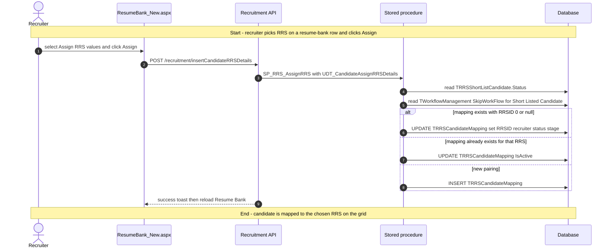
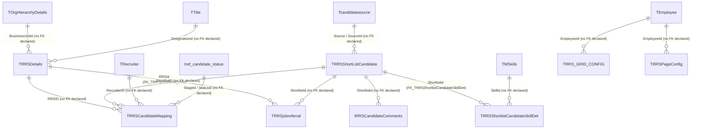

# Resume Bank

## Overview

A recruiter opens **Recruitment → Resume Bank** when they need a pool of people already in the shortlist store — not a new sourced lead, not a requisition-scoped dashboard — so they can attach those people to open requisitions. The page is a filterable grid: they narrow by source channel and a date window (default last 30 days), then work the row. Clicking a name encrypts the shortlist id and opens the shared Add / View Candidate overlay on the same shell (blocked with a warning when the stored status is still `Sourced`). Clicking **Candidate Status** opens a right-side accordion of every RRS that person is mapped to, with hiring-manager, skill stack, and observation text. Attachment and conversation icons open the shared right-side drawer for that shortlist.

The characteristic write stays on the grid. **Assign** takes the RRS values picked in the **Assign RRS** multi-select and writes `TRRSCandidateMapping` rows (update the unassigned `RRSID` 0/null mapping, reactivate an existing mapping, or insert a new one). The procedure also sets stage/status from `tref_candidate_status` under stage **Shortlisting**, and will skip the shortlisting workflow when `TWorkflowManagement` has `SkipWorkFlow = 1` for **Short Listed Candidate**.

**Who's involved:**

- **Recruiter** — default audience. They search the bank, assign in-process / approved RRS, open candidate profile, and use the conversation / attachment drawer. The page fetches `TRecruiter` to set `isRecruiter`, but that flag is not used to hide **Assign**.
- **Recruitment admin / hiring manager / other roles** — if they can open the menu they see the same grid. `Sp_RRS_GetResumeBankData` further limits rows with `Sp_RRS_GetRecruitmentPermissions` (business-unit claim). Mappings with `RRSID` 0/null still show.
- **Global-access user** (`IsGlobalAccess = Y`) — organisation multi-select. Unlike the other recruitment dashboards, this picker **does not** remap to `recruitmentDashboard_Grid`. It reads and writes `TRRS_GRID_CONFIG` under grid id `resumeBankDashboard_Grid`.

There is **no** `llm-wiki/domain` lifecycle page for Resume Bank. Table one-liners live in `llm-wiki/reference/tables/hrms.md`. This guide is the application call chain those catalogs do not cover.

Sibling left-nav items **Recruitment Dashboard**, **RRS Dashboard**, **Sourcing Dashboard**, **Shortlisting Dashboard**, **Interview Dashboard**, **Candidate Dashboard**, **Candidate Referral**, **Notifications**, and **Candidate Login Link** are separate menu pages. Add / View Candidate is an overlay this screen opens; it is not this menu item. Management Dashboard's resume-bank chart (`Sp_RRS_GetResumeBankData_Chart`) is a different API. The WebForms `ResumeBank.aspx` + `ucResumeBank` tag-by-skill page is still on disk and is not this React menu shell.

## Workflow

```mermaid
flowchart TD
  Nav["Recruitment left-nav Resume Bank"] --> ASPX["ResumeBank_New.aspx"]
  ASPX --> SPA["ResumeBank React component"]

  SPA --> Rec["GET /recruitment/getRecruitersList"]
  Rec --> RecSP["Sp_GetRecruiterMstr"]
  RecSP --> RecT[("TRecruiter")]

  SPA --> Src["GET /recruitment/getCandidateSources"]
  Src --> SrcSP["SP_RRS_GetCandidateSource"]
  SrcSP --> SrcT[("Tcandidatesource")]
  SrcSP --> GridCfg[("TRRS_GRID_CONFIG")]

  SPA --> RrsList["GET /recruitment/getRRSList"]
  RrsList --> RrsSP["Sp_RRS_DetailsSearchByRecruiters"]
  RrsSP --> RRS[("TRRSDetails")]

  SPA --> GridFmt["GET /recruitment/getGridConfig"]
  GridFmt --> GridFmtSP["SP_RRS_GetGridConfig"]
  GridFmtSP --> PageCfg[("TRRSPageConfig")]

  SPA -->|"global access org picker"| Org["GET /recruitment/getOrganizationList"]
  Org --> OrgSP["SP_AdminRM_GetGlobalAccessEmployerList"]
  OrgSP --> GridCfg
  Org -->|"save selection"| SaveOrg["POST recruitment/insertMultiOrg"]
  SaveOrg --> SaveOrgSP["Sp_RRS_InsertMultiOrg"]
  SaveOrgSP --> GridCfg

  SPA --> Grid["GET /recruitment/getResumeBank"]
  Grid --> GridSP["Sp_RRS_GetResumeBankData"]
  GridSP --> Perm["Sp_RRS_GetRecruitmentPermissions"]
  GridSP --> Map[("TRRSCandidateMapping")]
  GridSP --> Short[("TRRSShortListCandidate")]
  GridSP --> RRS
  GridSP --> Ref[("TRRSjobreferral")]
  GridSP --> SrcT
  GridSP --> CmtT[("tRRSCandidateComments")]
  GridSP --> Skill[("TRRSShortlistCandidateSkillDet / TMSkills")]
  GridSP --> StatusT[("tref_candidate_status")]

  Grid -->|"Assign"| Assign["POST /recruitment/insertCandidateRRSDetails"]
  Assign --> AssignSP["SP_RRS_AssignRRS"]
  AssignSP --> Map
  AssignSP --> Wf[("TWorkflowManagement")]
  AssignSP --> StatusT

  Grid -->|"click candidate name"| Enc["GET api/recruitment/encryptvalue"]
  Enc --> Overlay["CandidateDetails overlay"]

  Grid -->|"click Candidate Status"| Mapping["GET /recruitment/getCandidateMapping"]
  Mapping --> MapSP["Sp_RRS_GetRRSCandidateMapping"]
  MapSP --> Map
  MapSP --> RRS
  Mapping --> Path["GET /recruitment/getDocumentPath"]
  Path --> PathSP["SP_CM_GetEmailTemplatesDocumentPath"]
  PathSP --> Doc[("TDocumentPaths")]
  Mapping --> Img["GET /recruitment/getCandidateImage"]
  Img --> ImgSP["Sp_RRS_GetCandidateImage"]
  ImgSP --> Short
  Img --> Bytes["POST /recruitment/getFileInBytes"]

  Grid -->|"open conversation drawer"| Cmt["GET /recruitment/getCandidateComments"]
  Cmt --> CmtSP["Sp_RRS_GetCandidateComment"]
  CmtSP --> CmtT
  Cmt -->|"post comment"| AddCmt["POST /recruitment/insertCandidateComments"]
  AddCmt --> AddCmtSP["Sp_RRS_InsertCandidateComment"]
  AddCmtSP --> CmtT

  Grid -->|"save column order"| SaveFmt["POST /recruitment/setGridConfig"]
  SaveFmt --> SaveFmtSP["SP_RRS_InsertGridConfig"]
  SaveFmtSP --> PageCfg
```

The grid query joins `TRRSCandidateMapping` to `TRRSShortListCandidate` (not `TRRSCandidate`). Duplicate shortlist rows stay hidden unless they have already left `Pending` / `Sourced`. Status text on the grid is `status3` (`RRSNumber` plus mapping status or shortlist status). Position title and BU come from the requisition (`TTitle` / `TOrgHierarchyDetails`) when mapped, or from `TRRSjobreferral.PreferredDesignation` / `PreferredBU` (or the label **General**) when `RRSID` is null.

## Request journey

The page loads several lookups first, but the characteristic write is **assigning an RRS** to a bank row. That request starts with a recruiter picking in-process / approved requisitions on **Assign RRS** and ends with a `TRRSCandidateMapping` update or insert.

When skip-workflow is on, statuses `ShortListed`, `Sent For Shortlisting`, `OnHold`, and `Rejected` become `ShortListed`. When it is off, those same four become `Submitted`. Other shortlist statuses are kept. Stage is always `Shortlisting` from `tref_candidate_status` (`Employerid = 0`). The UI only posts rows that were actually changed in the multi-select; it warns `Please select RRS to assign.` / `Please Assign RRS to a Candidate` when the payload is empty.

## Entry points

> `ResumeBank_New.aspx` is the live Recruitment → Resume Bank shell (`TMenuHierarchy` menu id `80` under parent `69`). The React router in `routes.js` mounts `ResumeBankContainer` at `RouteConstants.RESUME_BANK`. Shared constant `URL_RECRUITMENT_RESUME_BANK` still points at the older WebForms `HRM/Recruitment/ResumeBank.aspx`. This checkout has no `TMenuDetails` NavigateURL update for menu `80`, so treat that WebForms page as a sibling, not as the React call chain below.

The `.aspx` `Inherits` attribute is `HRMS.Web.HRM.Recruitment_React.CandidateForShortlisting_New` (shared with Shortlisting Dashboard). `ResumeBank_New.aspx.cs` declares class `ResumeBank` and would log activity `ResumeBank` (enum `396`), but that class is not the page type. The live `Page_Load` is `CandidateForShortlisting_New`, which stamps the same hidden fields and logs activity `ShortlistingDashboard`.

| UI page / route | Purpose |
|---|---|
| `/HRM/Recruitment_React/ResumeBank_New.aspx` | Main Resume Bank. Stamps employee, employer, role, global-access, optional decrypted `candId`, email, and BU label into hidden fields, then loads `BuildJS/recruitment.min.js`. |
| Query `Filter`, `employer`, `NotificationId` | Parsed in `componentDidMount`. `Filter` and `employer` are never written to state or sent to `getResumeBank`. `NotificationId` is not `setState`'d either, so the org-picker hide (`notificationId != 1`) never fires from the query string. |
| `/HRM/Recruitment_React/ResumeBank_New.aspx` CandidateDetails overlay | Opened from a grid name click (`shortListId` encrypted). Blocked with toast `Please Save the Candidate from Add Candidate Page` when `Status` is `Sourced`. Not a separate menu item. |
| `/HRM/Recruitment/ResumeBank.aspx` + `ucResumeBank.ascx` | Legacy skill / experience / candidate-id search and tag. Uses `ResumeBankBll` / `Sp_RRS_GetCandidateResumeBank` / `Sp_RRS_TaggedCandidateResumeBank`. Not wired in the React router. |
| Right-side `RightPanel` modal | Conversation / attachment drawer for one `ShortListId`, `CreatedForPage` `Resume Bank`. Shared recruitment drawer, not a separate route. Status / some hiring panels are hidden for this page. |
| Mapping accordion (`#myModal3` / `RBslider`) | Opened from **Candidate Status**. Lists mappings from `Sp_RRS_GetRRSCandidateMapping`. Toast `Candidate Not Mapped To Any RRS` when the result set is empty. |

`ResumeBank_New.aspx` (via `CandidateForShortlisting_New`) only reads session values and decrypts optional query `candId`; feature logic lives in `resume-bank.js` and the Node / .NET APIs. Encrypt for the overlay uses the .NET Web API, not the Node app.

## Code → database call chain

The live SPA constants for this page resolve to `/recruitment/...` routes. The older `/v2/recruitment/...` and `/v3/recruitment/...` variants remain in `apiURLConstants.js`, but the duplicate keys later in the file make the plain `/recruitment/...` versions the ones this bundle uses. `routeIndex.js` mounts only `RecruitmentRoutes.js` at `/recruitment`.

| Entry point | DAL / BLL method (`file:line`) | Stored procedure |
|---|---|---|
| Page load — is the user an active recruiter (`isRecruiter`, unused in render) | `GetRecruitersList` (`recruitmentController.js:803`, `recruitmentDAL.js:2396`) | `Sp_GetRecruiterMstr` |
| Page load — source dropdown | `GetCandidateSources` (`recruitmentController.js:830`, `recruitmentDAL.js:2476`) | `SP_RRS_GetCandidateSource` |
| Page load — Assign RRS options (`rrsStatus` `Inprocess,Approved`, `gridId` `resumeBankDashboard_Grid`) | `GetRRSList` (`recruitmentController.js:712`, `recruitmentDAL.js:2075`) | `Sp_RRS_DetailsSearchByRecruiters` |
| Page load — saved column order (`ResumeBank_Grid`) | `GetGridConfig` (`recruitmentController.js:2523`, `recruitmentDAL.js:6642`) | `SP_RRS_GetGridConfig` |
| Page load / search — main resume-bank grid | `GetResumeBank` (`recruitmentController.js:2360`, `recruitmentDAL.js:6321`) | `Sp_RRS_GetResumeBankData` (internally `Sp_RRS_GetRecruitmentPermissions`) |
| Extra org list (result stored, unused; picker fetches its own) | `GetOrganizationList` (`recruitmentController.js:233`, `recruitmentDAL.js:943`) | `SP_AdminRM_GetGlobalAccessEmployerList` |
| Global-access org list / saved selection (`gridId` `resumeBankDashboard_Grid`) | same | `SP_AdminRM_GetGlobalAccessEmployerList` |
| Save organisation selection | `InsertMultiOrg` (`recruitmentController.js:2459`, `recruitmentDAL.js:6488`) | `Sp_RRS_InsertMultiOrg` |
| Assign RRS | `InsertCandidateRRSDetails` (`recruitmentController.js:2397`, `recruitmentDAL.js:6376`) | `SP_RRS_AssignRRS` |
| Click candidate name — encrypt shortlist id | `EncryptValue` (`HRMS.Shared/HRMS.WebAPI/Controllers/RecruitmentController.cs:550`) | none (in-process encryption) |
| Click Candidate Status — mapping accordion | `GetCandidateMapping` (`recruitmentController.js:2314`, `recruitmentDAL.js:6359`) | `Sp_RRS_GetRRSCandidateMapping` |
| Mapping accordion — photo folder | `GetDocumentPath` (`recruitmentController.js:297`, `recruitmentDAL.js:1013`) | `SP_CM_GetEmailTemplatesDocumentPath` |
| Mapping accordion — photo path on the shortlist | `GetCandidateImage` (`recruitmentController.js:2190`, `recruitmentDAL.js:6038`) | `Sp_RRS_GetCandidateImage` |
| Mapping accordion — photo bytes | `GetFileInBytes` (`recruitmentController.js:1954`) | none (reads `req.body.filePath` from disk) |
| Drawer — comment list | `GetCandidateComments` (`recruitmentController.js:979`, `recruitmentDAL.js:2996`) | `Sp_RRS_GetCandidateComment` |
| Drawer — add comment | `InsertCandidateComments` (`recruitmentController.js:988`, `recruitmentDAL.js:3021`) | `Sp_RRS_InsertCandidateComment` |
| Save column order | `SetGridConfig` (`recruitmentController.js:2532`, `recruitmentDAL.js:6657`) | `SP_RRS_InsertGridConfig` |
| Legacy WebForms search | `ResumeBankDll.GetResumeBankDetails` (`ResumeBankDAL.cs:76`) | `Sp_RRS_GetCandidateResumeBank` |
| Legacy WebForms candidate dropdown | `ResumeBankDll.GetCandidateResumeBank` (`ResumeBankDAL.cs:98`) | `Sp_RRS_GetCandidateListResumeBank` |
| Legacy WebForms tag | `ResumeBankDll.TagCandidateFromResumeBank` (`ResumeBankDAL.cs:50`) | `Sp_RRS_TaggedCandidateResumeBank` |
| Legacy RRS dropdown (also called from Add Candidate / Candidate For Shortlisting / RRS Title Dialog) | `ResumeBankDll.RrsDetailsSearchByRecruiters` (`ResumeBankDAL.cs:25`) | `Sp_RRS_DetailsSearchByRecruiters` |

There is **no BLL layer** on the Node path. The controller calls `recruitmentDAL.js` directly. The React code-behind does not make data-access calls. `InsertCandidateRRSDetails` binds a TVP of type `UDT_CandidateAssignRRSDetails`.

`getWorkFlowDetails` exists on the React class (`pageTitle` `ShortlistedCandidate`) but is never invoked from `componentDidMount` or the render path. Skip-workflow is applied inside `SP_RRS_AssignRRS`, not by that GET.

## API endpoints

| Verb | Route | Parameters | Purpose | Source |
|---|---|---|---|---|
| `GET` | `/recruitment/getRecruitersList` | query `employerid` (int, required), `isactive` (this page passes `true`), `employeeId` (optional in signature; this page omits it) | Decide whether the logged-in employee is an active recruiter | `RecruitmentRoutes.js:72`, `recruitmentController.js:803` |
| `GET` | `/recruitment/getCandidateSources` | query `employerId` (int, required), `multiOrg` (bit), `employeeid` (int; SPA key is lowercase, controller reads `employeeId`), `gridId` (string; this page `resumeBankDashboard_Grid`) | Source-channel dropdown | `RecruitmentRoutes.js:75`, `recruitmentController.js:830` |
| `GET` | `/recruitment/getRRSList` | query `employeeId`, `employerId`, `rrsTitle` (this page `null`), `rrsStatus` (this page `Inprocess,Approved`), `multiOrg`, `gridId` (this page `resumeBankDashboard_Grid`), `skipGridId` (omitted) | In-process / approved RRS for **Assign RRS** | `RecruitmentRoutes.js:62`, `recruitmentController.js:712` |
| `GET` | `/recruitment/getGridConfig` | query `employerId`, `employeeId` (sent; live controller uses `req.EID`), `gridId` (`ResumeBank_Grid`) | Saved column order from `TRRSPageConfig` | `RecruitmentRoutes.js:214`, `recruitmentController.js:2523` |
| `GET` | `/recruitment/getResumeBank` | query `employerId` (int, required), `FromDate`, `ToDate` (datetime; empty/`null` string becomes SQL null), `Source` (int; `0` becomes null = all), `multiOrg` (bit), `employeeId` (int) | Main grid | `RecruitmentRoutes.js:198`, `recruitmentController.js:2360` |
| `GET` | `/recruitment/getOrganizationList` | query `employeeId` (sent by caller; live controller uses `req.EID`), `gridId` (picker keeps `resumeBankDashboard_Grid`; the extra `organizations()` call omits `gridId`) | Organisations and saved selection for global-access users | `RecruitmentRoutes.js:22`, `recruitmentController.js:233` |
| `POST` | `recruitment/insertMultiOrg` | body `employeeId`, `gridId` (`resumeBankDashboard_Grid`), `configType` (`employerDropdown`), `config` (comma-separated employer ids) | Persist the organisation picker. Live constant has no leading `/` | `RecruitmentRoutes.js:207`, `recruitmentController.js:2459` |
| `POST` | `/recruitment/insertCandidateRRSDetails` | body `candidateRRSDetails.value` (array of `{ shortlistid, rrsDetails: [{ rrsid, recruiterid, isActive }] }`), `CreatedBy.value`, `Employerid.value` | Assign RRS | `RecruitmentRoutes.js:201`, `recruitmentController.js:2397` |
| `GET` | `api/recruitment/encryptvalue` | query `value` (string, required; shortlist id) | Encrypt id for CandidateDetails. .NET Web API via `APIHelper.getNetApi`, not Node | `HRMS.WebAPI/Controllers/RecruitmentController.cs:550` |
| `GET` | `/recruitment/getCandidateMapping` | query `employerId` (row `CandidateEmployerId`), `shortlistId`, `rrsId` (this page `null`), `employeeId` (this page `null`). Controller also accepts `multiOrg`; v1 DAL does not bind it | Mapping accordion | `RecruitmentRoutes.js:199`, `recruitmentController.js:2314` |
| `GET` | `/recruitment/getDocumentPath` | query `documentType` (this page `CandidateShortlisting`) | Photo folder root | `RecruitmentRoutes.js:29`, `recruitmentController.js:297` |
| `GET` | `/recruitment/getCandidateImage` | query `shortlistid`, `employerId`, `candidateId` (null), `SourceId` (null) | `photoPath` on the shortlist | `RecruitmentRoutes.js:189`, `recruitmentController.js:2190` |
| `POST` | `/recruitment/getFileInBytes` | body `filePath` (string, required; `DocumentPath` + `photoPath`) | Base64 photo bytes. No stored procedure | `RecruitmentRoutes.js:168`, `recruitmentController.js:1954` |
| `GET` | `/recruitment/getCandidateComments` | query `shortlistid`, `employerid`, `candidateId` (this page null), `SourceId` (this page null) | Drawer comment list | `RecruitmentRoutes.js:89`, `recruitmentController.js:979` |
| `POST` | `/recruitment/insertCandidateComments` | body `candidateid`, `shortlistid`, `SourceId`, `comment`, `createdBy`, `createdForPage` (this page `Resume Bank`), `employerId` | Insert a drawer comment | `RecruitmentRoutes.js:90`, `recruitmentController.js:988` |
| `POST` | `/recruitment/setGridConfig` | body `EmployerId`, `EmployeeId`, `PageName` (`ResumeBank_Grid`), `ConfigType` (`GridFormat`), `Config` (column-order object, stringified in DAL) | Persist column order | `RecruitmentRoutes.js:215`, `recruitmentController.js:2532` |

Grid export (Excel / PDF) is client-side from the already-loaded rows; it is not an API.

## Stored procedures & tables involved

> Live dashboard data is in core **`HRMS`**. `Sp_RRS_GetResumeBankData` reads `TRRSCandidateMapping` joined to `TRRSShortListCandidate`. Table meanings reuse `llm-wiki/reference/tables/hrms.md`. Sibling procedures named `Sp_RRS_GetCandidateResumeBank` / `Sp_RRS_TaggedCandidateResumeBank` belong to the WebForms page, not this React menu.

| Object | File path | Purpose | llm-wiki |
|---|---|---|---|
| `TRRSShortListCandidate` | `HRMS-DATABASE/HRMS/TABLES/TRRSShortListCandidate.sql` | Bank row (name, source, dates, experience, resume path, duplicate flag). PK only; no FK declared | `llm-wiki/reference/tables/hrms.md` |
| `TRRSCandidateMapping` | `HRMS-DATABASE/HRMS/TABLES/TRRSCandidateMapping.sql` | RRS / recruiter mapping the grid aggregates and Assign writes. No PK/FK in the checked-in CREATE | `llm-wiki/reference/tables/hrms.md` |
| `TRRSDetails` | `HRMS-DATABASE/HRMS/TABLES/TRRSDetails.sql` | Requisition joined for RRS number, BU, designation | `llm-wiki/reference/tables/hrms.md` |
| `TRRSjobreferral` | `HRMS-DATABASE/HRMS/TABLES/TRRSjobreferral.sql` | Preferred BU / designation when the mapping has no RRS. Declared FK `FK_TRRSjobreferral_rrsid` | `llm-wiki/reference/tables/hrms.md` |
| `Tcandidatesource` | `HRMS-DATABASE/HRMS/TABLES/Tcandidatesource.sql` | Source-channel master. PK only; no FK declared | `llm-wiki/reference/tables/hrms.md` |
| `tRRSCandidateComments` | catalogued in wiki | Comment-presence flag on the grid and drawer comments | `llm-wiki/reference/tables/hrms.md` |
| `TRRSShortlistCandidateSkillDet` | `HRMS-DATABASE/HRMS/TABLES/TRRSShortlistCandidateSkillDet.sql` | Skills concatenated on the grid. Declared FK `FK_TRRSShortlistCandidateSkillDet` | `llm-wiki/reference/tables/hrms.md` |
| `TMSkills` | catalogued in wiki | Skill names | `llm-wiki/reference/tables/hrms.md` |
| `tref_candidate_status` | catalogued in wiki | Grid `status3` description and Assign stage/status ids (`Employerid = 0`) | `llm-wiki/reference/tables/hrms.md` |
| `TOrgHierarchyDetails` | catalogued in wiki | BU name when the mapping has an RRS | `llm-wiki/reference/tables/hrms.md` |
| `TTitle` | catalogued in wiki | Position title when the mapping has an RRS | `llm-wiki/reference/tables/hrms.md` |
| `TEmployerDetails` | catalogued in wiki | Organisation name / multi-org temp table | `llm-wiki/reference/tables/hrms.md` |
| `TRRS_GRID_CONFIG` | catalogued in wiki | Saved organisation picker (`ConfigType` `employerDropdown`, `GridId` `resumeBankDashboard_Grid`) | `llm-wiki/reference/tables/hrms.md` |
| `TRRSPageConfig` | catalogued in wiki (as `TRRSPageConfig`) | Saved column order (`PageName` `ResumeBank_Grid`) | `llm-wiki/reference/tables/hrms.md` |
| `TRecruiter` | catalogued in wiki | Recruiter list used only to set `isRecruiter` | `llm-wiki/reference/tables/hrms.md` |
| `TWorkflowManagement` | catalogued in wiki | Skip-workflow flag for **Short Listed Candidate** during Assign | `llm-wiki/reference/tables/hrms.md` |
| `TDocumentPaths` | catalogued in wiki | CandidateShortlisting folder for photos | `llm-wiki/reference/tables/hrms.md` |
| `UDT_CandidateAssignRRSDetails` | `HRMS-DATABASE/HRMS/UDT/UDT_CandidateAssignRRSDetails.sql` | TVP for Assign (`RRSID`, `RecruiterID`, `IsActive`, `ShortlistId`) | — |
| `Sp_RRS_GetResumeBankData` | `HRMS-DATABASE/HRMS/STOREPROCEDURE/Sp_RRS_GetResumeBankData.sql` | Grid query over mapping + shortlist + referral + skills + comments | — |
| `Sp_RRS_GetRecruitmentPermissions` | called from the get procedure | BU-scoped claim filter (`@BusinessUnitIds` output) | — |
| `SP_RRS_AssignRRS` | `HRMS-DATABASE/HRMS/STOREPROCEDURE/SP_RRS_AssignRRS.sql` | Cursor update/insert of `TRRSCandidateMapping` | — |
| `Sp_RRS_GetRRSCandidateMapping` | `HRMS-DATABASE/HRMS/STOREPROCEDURE/Sp_RRS_GetRRSCandidateMapping.sql` | Mapping accordion (also reads `TRequestWorkflows` / `TRRSCandidateInterview` for observation text) | — |
| `SP_RRS_GetCandidateSource` | `HRMS-DATABASE/HRMS/STOREPROCEDURE/SP_RRS_GetCandidateSource.sql` | Source dropdown from `Tcandidatesource` | — |
| `Sp_RRS_DetailsSearchByRecruiters` | `HRMS-DATABASE/HRMS/STOREPROCEDURE/Sp_RRS_DetailsSearchByRecruiters.sql` | In-process / approved RRS list | — |
| `Sp_GetRecruiterMstr` | `HRMS-DATABASE/HRMS/STOREPROCEDURE/Sp_GetRecruiterMstr.sql` | Recruiter list used only to set `isRecruiter` | — |
| `SP_AdminRM_GetGlobalAccessEmployerList` | `HRMS-DATABASE/HRMS/STOREPROCEDURE/SP_AdminRM_GetGlobalAccessEmployerList.sql` | Org list and saved selection | — |
| `Sp_RRS_InsertMultiOrg` | `HRMS-DATABASE/HRMS/STOREPROCEDURE/Sp_RRS_InsertMultiOrg.sql` | Upsert `TRRS_GRID_CONFIG` | — |
| `SP_RRS_GetGridConfig` / `SP_RRS_InsertGridConfig` | `HRMS-DATABASE/HRMS/STOREPROCEDURE/` | Column-order read / write on `trrspageconfig` | — |
| `Sp_RRS_GetCandidateComment` / `Sp_RRS_InsertCandidateComment` | `HRMS-DATABASE/HRMS/STOREPROCEDURE/` | Drawer comments | — |
| `SP_CM_GetEmailTemplatesDocumentPath` | `HRMS-DATABASE/HRMS/STOREPROCEDURE/` | Document folder by type | — |
| `Sp_RRS_GetCandidateImage` | `HRMS-DATABASE/HRMS/STOREPROCEDURE/Sp_RRS_GetCandidateImage.sql` | `photoPath` from the shortlist | — |
| `Sp_RRS_GetCandidateResumeBank` | `HRMS-DATABASE/HRMS/STOREPROCEDURE/Sp_RRS_GetCandidateResumeBank.sql` | Legacy WebForms search | — |
| `Sp_RRS_GetCandidateListResumeBank` | `HRMS-DATABASE/HRMS/STOREPROCEDURE/Sp_RRS_GetCandidateListResumeBank.sql` | Legacy candidate dropdown | — |
| `Sp_RRS_TaggedCandidateResumeBank` | `HRMS-DATABASE/HRMS/STOREPROCEDURE/Sp_RRS_TaggedCandidateResumeBank.sql` | Legacy tag | — |
| `Sp_RRS_GetResumeBankData_Chart` | `HRMS-DATABASE/HRMS/STOREPROCEDURE/Sp_RRS_GetResumeBankData_Chart.sql` | Management / dashboard chart. Not this menu | — |

On-disk siblings with no SourceCode caller found for this feature: `Sp_TaggedCandidateResumeBank`, `Sp_GetRrsCandidateResumeBank`, `Sp_GetRRSTitleListResumeBank`, `Sp_GetRRSCandidateListResumeBank`.

## Table relationships

The project does not have a resume-bank ER diagram to reuse, so this diagram is derived from `llm-wiki/reference/tables/hrms.md` plus the procedure-level table usage above. Where the catalog or DDL does not declare a foreign key, the relationship is labelled as such instead of being invented.

## Known gaps

- There is **no** recruitment-specific canonical domain page in `llm-wiki/domain/`, and SourceCode `docs/SystemModels/SystemModel-2` has no Resume Bank workflow page in this checkout. Behaviour above is from SourceCode + procedure scripts. `llm-wiki/architecture/module-catalog.md` only names recruitment (RRS) as part of core HRMS.
- `ResumeBank_New.aspx` inherits `CandidateForShortlisting_New`. Activity logged on this URL is `ShortlistingDashboard`, not `ResumeBank` (enum `396`). Class `ResumeBank` in `ResumeBank_New.aspx.cs` is compiled and unused as the page type.
- Two pages share menu id `80` in spirit: this guide documents the React `ResumeBank_New.aspx` path. `HRM/Recruitment/ResumeBank.aspx` plus `ucResumeBank.ascx` still compile and call `Sp_RRS_GetCandidateResumeBank` / `Sp_RRS_TaggedCandidateResumeBank` through `ResumeBankBll`. `Constants.URL_RECRUITMENT_RESUME_BANK` still points at the WebForms page. This checkout has no `TMenuDetails` NavigateURL update for menu `80`.
- `ResumeBankBll.RrsDetailsSearchByRecruiters` is still called from Add Candidate, Candidate For Shortlisting, and RRS Title Dialog. That is the same procedure the React page uses for **Assign RRS**, but those screens are not this menu item.
- `routeIndex.js` mounts only `RecruitmentRoutes.js` at `/recruitment`. `RecruitmentRoutes_V2.js` / `RecruitmentRoutes_V3.js` exist on disk and are not mounted. Duplicate keys in `apiURLConstants.js` leave the trailing `/recruitment/...` constants as the live SPA values.
- Organisation picker for this page **saves and reads** `TRRS_GRID_CONFIG` under grid id `resumeBankDashboard_Grid`. Other recruitment dashboards remap their picker to `recruitmentDashboard_Grid`. `organizations()` also calls `getOrganizationList` without a grid id and never uses the result.
- `GetRecruitersList` accepts `isactive` and `employeeId` in the controller signature, but the DAL only binds `@employerid` before executing `Sp_GetRecruiterMstr`. `isRecruiter` is set and never read in render; **Assign** is always shown.
- `getWorkFlowDetails` (`pageTitle` `ShortlistedCandidate`) is implemented on the React class and never called. Skip-workflow is enforced only inside `SP_RRS_AssignRRS` (`WorkflowName` **Short Listed Candidate**).
- Query string `Filter`, `employer`, and `NotificationId` are parsed in `componentDidMount` and not stored. They do not change the grid query or hide the org picker.
- SPA `getCandidateSources` sends query key `employeeid`; v1 controller reads `employeeId`. Express treats those as different keys, so `@EmployeeId` on `SP_RRS_GetCandidateSource` can be null from this page.
- `GetCandidateMapping` controller forwards `req.query.multiOrg`; v1 DAL `GetCandidateMapping` does not bind it. This page already passes `employeeId`/`rrsId` as `null`.
- `INSERT_MULTIORG` in the live constants block is `recruitment/insertMultiOrg` (no leading `/`). Other live keys keep the leading slash.
- Shared `RightPanel` can call further recruitment endpoints (attachments, images, milestones, offer letters). This page mounts it with `CandidateId` and `SourceId` null, `ShortListId` set, and `CreatedForPage` `Resume Bank`, so status / some hiring panels are hidden.
- Header config still lists Hiring Manager / Approved By / Approved Date columns; the live `Sp_RRS_GetResumeBankData` result set does not return those fields. Visible columns are the `Column` / `LinkColumn` / `MultiSelectColumn` children.
- `Sp_RRS_GetResumeBankData_Chart` is used by dashboard / management-dashboard `getResumeBank`, not this menu.
- `Sp_TaggedCandidateResumeBank`, `Sp_GetRrsCandidateResumeBank`, `Sp_GetRRSTitleListResumeBank`, and `Sp_GetRRSCandidateListResumeBank` exist under `HRMS-DATABASE/HRMS/STOREPROCEDURE/` with no SourceCode caller found for this feature.
- `TRRSCandidateMapping`'s checked-in CREATE has no PRIMARY KEY or FK. Wiki still describes it as the mapping of shortlisted candidates to requisitions.

## Reference

Confidence is **medium**: the live React page was traced to v1 DAL `file:line` and named procedures. Declared FKs come from table DDL (`FK_TRRSjobreferral_rrsid`, `FK_TRRSShortlistCandidateSkillDet`). There is no domain `erDiagram` to reuse. Confidence is not high because there is no canonical recruitment feature doc, the `.aspx` inherits Shortlisting Dashboard's page class, and the WebForms sibling for the same menu idea is still on disk.

### SourceCode

- `HRMS.Web/HRMS.Web/HRM/Recruitment_React/ResumeBank_New.aspx`
- `HRMS.Web/HRMS.Web/HRM/Recruitment_React/ResumeBank_New.aspx.cs`
- `HRMS.Web/HRMS.Web/HRM/Recruitment_React/ShortlistingDashboard_New.aspx.cs` (live `Page_Load` for this URL)
- `HRMS.Web/HRMS.Web/HRM/Recruitment_React/Areas/routes.js`
- `HRMS.Web/HRMS.Web/HRM/Recruitment_React/Common/routeConstants.js`
- `HRMS.Web/HRMS.Web/HRM/Recruitment_React/Common/apiURLConstants.js`
- `HRMS.Web/HRMS.Web/HRM/Recruitment_React/Areas/Candidate/Containers/resumeBankContainer.js`
- `HRMS.Web/HRMS.Web/HRM/Recruitment_React/Areas/Candidate/Components/resume-bank.js`
- `HRMS.Web/HRMS.Web/HRM/Recruitment_React/SharedComponent/UI/OrganizationMultiSelectDropDown/organizationMultiSelectDropDown.js`
- `HRMS.Web/HRMS.Web/HRM/Recruitment/ResumeBank.aspx`
- `HRMS.Web/HRMS.Web/HRM/Recruitment/ucResumeBank.ascx.cs`
- `HRMS.Shared/HRMS.BusinessLayer/Recruitment/ResumeBankBLL.cs`
- `HRMS.Shared/HRMS.DataAccessLayer/Recruitment/ResumeBankDAL.cs`
- `HRMS.Shared/HRMS.DataContract/Common/Constants.cs`
- `HRMS.Shared/HRMS.DataContract/Common/Enums.cs`
- `HRMS.CoreAPI/HRMS.Core.WebAPI.Node/Routes/routeIndex.js`
- `HRMS.CoreAPI/HRMS.Core.WebAPI.Node/Routes/RecruitmentRoutes.js`
- `HRMS.CoreAPI/HRMS.Core.WebAPI.Node/Controllers/recruitmentController.js`
- `HRMS.CoreAPI/HRMS.Core.WebAPI.Node/Core/DataAccessLayer/recruitmentDAL.js`
- `HRMS.Shared/HRMS.WebAPI/Controllers/RecruitmentController.cs`

### TDG HRMS DB

- `llm-wiki/reference/tables/hrms.md` (table one-liners; no Resume Bank domain page)
- `llm-wiki/architecture/module-catalog.md`
- `HRMS-DATABASE/HRMS/STOREPROCEDURE/Sp_RRS_GetResumeBankData.sql`
- `HRMS-DATABASE/HRMS/STOREPROCEDURE/SP_RRS_AssignRRS.sql`
- `HRMS-DATABASE/HRMS/STOREPROCEDURE/Sp_RRS_GetRRSCandidateMapping.sql`
- `HRMS-DATABASE/HRMS/STOREPROCEDURE/SP_RRS_GetCandidateSource.sql`
- `HRMS-DATABASE/HRMS/STOREPROCEDURE/Sp_RRS_DetailsSearchByRecruiters.sql`
- `HRMS-DATABASE/HRMS/STOREPROCEDURE/Sp_GetRecruiterMstr.sql`
- `HRMS-DATABASE/HRMS/STOREPROCEDURE/Sp_RRS_InsertMultiOrg.sql`
- `HRMS-DATABASE/HRMS/STOREPROCEDURE/SP_RRS_GetGridConfig.sql`
- `HRMS-DATABASE/HRMS/STOREPROCEDURE/SP_AdminRM_GetGlobalAccessEmployerList.sql`
- `HRMS-DATABASE/HRMS/STOREPROCEDURE/Sp_RRS_GetCandidateImage.sql`
- `HRMS-DATABASE/HRMS/UDT/UDT_CandidateAssignRRSDetails.sql`
- `HRMS-DATABASE/HRMS/TABLES/TRRSShortListCandidate.sql`
- `HRMS-DATABASE/HRMS/TABLES/TRRSCandidateMapping.sql`
- `HRMS-DATABASE/HRMS/TABLES/TRRSShortlistCandidateSkillDet.sql`
- `sql/DynamicMenu.xml` (menu id `80` under Recruitment `69`)
