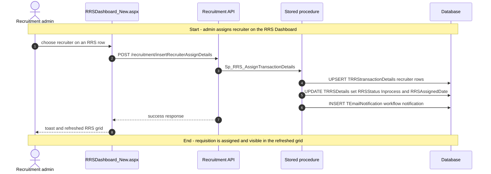
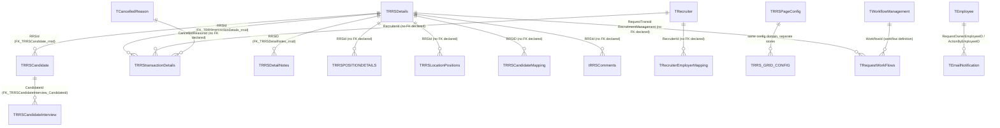

# RRS Dashboard

## Overview

A recruiter or recruitment administrator opens **Recruitment → RRS Dashboard** when they need to work the requisition list itself rather than a candidate pipeline. The page answers practical questions such as which requisitions are still open, who owns them, how many positions are still available, whether the request is pending approval, and what action is still allowed. From here they can filter by recruiter, status, date range, and organisation; assign recruiters; open the full requisition; review workflow history and comments; cancel, delete, or close an RRS; and adjust the remaining position count by closing, dropping, putting on hold, or reopening positions.

The page is also where the requisition-level state changes happen. Assigning a recruiter writes a transaction row and pushes the RRS back to `Inprocess`; cancelling or deleting updates the requisition and its transaction rows; closing can also reset mapped candidate and interview state; and position actions update counts on the requisition until the procedure decides the RRS should move to `OnHold` or `Closed`.

There is no dedicated recruitment lifecycle page in `llm-wiki/domain/`. The canonical database reference reused here is `llm-wiki/reference/tables/hrms.md`, plus `llm-wiki/domain/approval-workflow.md` for the generic workflow engine tables used by the approval preview and TAT timeline.

## Workflow

```mermaid
flowchart TD
  Nav["Recruitment left-nav RRS Dashboard"] --> ASPX["RRSDashboard_New.aspx"]
  ASPX --> SPA["rrs-Dashboard React component"]

  SPA --> Org["GET /recruitment/getOrganizationList"]
  Org --> OrgSP["SP_AdminRM_GetGlobalAccessEmployerList"]
  OrgSP --> OrgTbl[("TRRS_GRID_CONFIG")]

  SPA --> Config["GET /recruitment/getPageConfig"]
  Config --> ConfigSP["Sp_RRS_GetPageConfig"]
  ConfigSP --> ConfigTbl[("TRRSPageConfig")]

  SPA --> Donor["GET /recruitment/getRRSDonorDetailsSettings"]
  Donor --> DonorSP["SP_GetRRSDonorDetailsSettings"]
  DonorSP --> Cust[("TCustomerSettings")]

  SPA --> FilterDate["GET /recruitment/getRRSDashboardFilterDate"]
  FilterDate --> FilterSP["SP_RRS_GetRRSDashboardFilterDate"]
  FilterSP --> FilterTbl[("TCustomerSettings / config tables")]

  SPA --> Wf["GET /recruitment/getWorkFlowDetails"]
  Wf --> WfSP["SP_CM_GetWorkflowTreeXmlDetailsByPageTitle"]
  WfSP --> WfDef[("TWorkflowManagement")]

  SPA --> Approvers["GET /recruitment/getAllApproverFromWorkFlow"]
  Approvers --> ApproverSP["Sp_GetAllEmployeeIdForWorkFlowApproval"]
  ApproverSP --> WfDef

  SPA --> Recruiters["GET /recruitment/getRecruitersList"]
  Recruiters --> RecruiterSP["Sp_GetRecruiterMstr"]
  RecruiterSP --> RecruiterTbl[("TRecruiter / TRecruiterEmployerMapping")]

  SPA --> Grid["GET /recruitment/getRRSDetailsById"]
  Grid --> GridSP["Sp_RRS_GetRRSDashboard"]
  GridSP --> RRSTbl[("TRRSDetails")]
  GridSP --> TxnTbl[("TRRStransactionDetails")]
  GridSP --> PageCfg[("TRRS_GRID_CONFIG")]

  SPA --> GridCfg["GET /recruitment/getGridConfig"]
  GridCfg --> GridCfgSP["SP_RRS_GetGridConfig"]
  GridCfgSP --> PageCfgTbl[("TRRSPageConfig")]

  SPA -->|"save column/order/org config"| SaveCfg["POST /recruitment/SetGridConfigEmployer"]
  SaveCfg --> SaveCfgSP["SP_InsertGridConfigEmployer"]
  SaveCfgSP --> PageCfgTbl

  Grid -->|"assign recruiter"| Assign["POST /recruitment/insertRecruiterAssignDetails"]
  Assign --> AssignSP["Sp_RRS_AssignTransactionDetails"]
  AssignSP --> TxnTbl
  AssignSP --> RRSTbl
  AssignSP --> MailTbl[("TEmailNotification")]

  Grid -->|"cancel or delete"| Cancel["POST /recruitment/insertCancellationReason"]
  Cancel --> CancelSP["Sp_RRS_DeleteDetails"]
  CancelSP --> RRSTbl
  CancelSP --> TxnTbl
  CancelSP --> PosTbl[("TRRSLocationPositions")]

  Grid -->|"close RRS"| Close["POST /recruitment/insertRRSCloseReason"]
  Close --> CloseSP["Sp_RRS_CloseRRS"]
  CloseSP --> RRSTbl
  CloseSP --> TxnTbl
  CloseSP --> MapTbl[("TRRSCandidateMapping")]
  CloseSP --> CandTbl[("TRRSCandidate / TRRSCandidateInterview")]

  Grid -->|"close drop onhold reopen positions"| Pos["POST /recruitment/rrsClosePosition"]
  Pos --> PosSP["Sp_RRS_PositionAction"]
  PosSP --> PosLog[("TRRSPOSITIONDETAILS")]
  PosSP --> RRSTbl
  PosSP --> PosTbl
  PosSP --> CloseSP

  Grid -->|"open TAT"| Tat["GET /recruitment/getRRSWorkflowStatus"]
  Tat --> TatSP["SP_GetRRSWorkflowStatus"]
  TatSP --> WorkflowTbl[("TRequestWorkflows / TRRStransactionDetails")]

  Grid -->|"open approval preview"| Approval["GET /recruitment/getApprovalDetails"]
  Approval --> ApprovalSP["SP_RRS_GetApprovalLevel"]
  ApprovalSP --> WorkflowTbl
  ApprovalSP --> WfDef

  Grid -->|"open notes/comments drawer"| Notes["GET /recruitment/getRrsNotes"]
  Notes --> NotesSP["Sp_RRS_GetRRSNotes"]
  NotesSP --> NotesTbl[("TRRSDetailNotes")]

  Grid --> Comments["GET /recruitment/getRRSComments"]
  Comments --> CommentsSP["Sp_RRS_GetComment"]
  CommentsSP --> CommentTbl[("tRRSComments")]

  Grid -->|"post drawer comment"| AddComment["POST /recruitment/insertRRSComments"]
  AddComment --> AddCommentSP["Sp_RRS_InsertComment"]
  AddCommentSP --> CommentTbl
```

## Request journey

The page performs many reads on first load, but the characteristic write on this screen is **assigning a recruiter to an RRS**. That request starts with a recruitment admin or permitted approver picking one or more recruiters in the grid and ends with the requisition returning to `Inprocess` and an assignment transaction being stored.

## Entry points

> `RRSDashboard_New.aspx` is the live Recruitment → RRS Dashboard shell. The older WebForms page `HRM/Recruitment/RRSDashboard.aspx` still exists in the project, but the React router mounts `RRSDashboard_New.aspx` and the live route constant points there.

| UI page / route | Purpose |
|---|---|
| `/HRM/Recruitment_React/RRSDashboard_New.aspx` | Main RRS Dashboard page. Stamps employee, employer, role, global-access, candidate-id, and BU label into hidden fields, then loads `BuildJS/recruitment.min.js`. |
| `/HRM/Recruitment_react/RRSCreation_new.aspx` | Opened from this page for Copy, Edit, and Create RRS actions. |
| Right-side drawer inside `rrs-Dashboard.js` | Inline TAT, conversation, and attachment panel for one selected RRS. Not a separate route, but a separate API surface within the feature. |

`RRSDashboard_New.aspx.cs` only reads session values and decrypts optional `candId`; the feature logic lives in the React SPA and Node recruitment API.

## Code → database call chain

The live SPA constants for this page resolve to `/recruitment/...` routes. The older `/v2/recruitment/...` and `/v3/recruitment/...` variants remain in `apiURLConstants.js`, but the duplicate keys later in the file make the plain `/recruitment/...` versions the ones this bundle uses.

| Entry point | DAL / BLL method (`file:line`) | Stored procedure |
|---|---|---|
| Page load — global org list | `GetOrganizationList` (`recruitmentController.js:233`, `recruitmentDAL.js:943`) | `SP_AdminRM_GetGlobalAccessEmployerList` |
| Page load — cancel/allocation workflow ids | `GetWorkFlowDetails` (`recruitmentController.js:224`, `recruitmentDAL.js:155`) | `SP_CM_GetWorkflowTreeXmlDetailsByPageTitle` |
| Page load — who may assign recruiters | `GetAllApproverFromWorkFlow` (`recruitmentController.js:2486`, `recruitmentDAL.js:6554`) | `Sp_GetAllEmployeeIdForWorkFlowApproval` |
| Page load — recruiter filter list | `GetRecruitersList` (`recruitmentController.js:803`, `recruitmentDAL.js:2396`) | `Sp_GetRecruiterMstr` |
| Page load / search — main requisition grid | `GetRRSDetailsById` (`recruitmentController.js:135`, `recruitmentDAL.js:860`) | `Sp_RRS_GetRRSDashboard` |
| Page load — recruiter visibility config | `GetPageConfig` (`recruitmentController.js:2305`, `recruitmentDAL.js:6306`) | `Sp_RRS_GetPageConfig` |
| Page load — donor/budget toggle | `GetRRSDonorDetailsSettings` (`recruitmentController.js:2954`, `recruitmentDAL.js:7789`) | `SP_GetRRSDonorDetailsSettings` |
| Page load — default filter date offset | `GetRRSDashboardFilterDate` (`recruitmentController.js:2944`, `recruitmentDAL.js:7775`) | `SP_RRS_GetRRSDashboardFilterDate` |
| Load saved grid layout | `GetGridConfig` (`recruitmentController.js:2523`, `recruitmentDAL.js:6642`) | `SP_RRS_GetGridConfig` |
| Save grid/org config | `SetGridConfigEmployer` (`recruitmentController.js:2541`, `recruitmentDAL.js:6679`) | `SP_InsertGridConfigEmployer` |
| Drawer — notes list | `GetRRSNotes` (`recruitmentController.js:434`, `recruitmentDAL.js:1026`) | `Sp_RRS_GetRRSNotes` |
| Drawer — comment list | `GetRRSComments` (`recruitmentController.js:1188`, `recruitmentDAL.js:3307`) | `Sp_RRS_GetComment` |
| Drawer — add comment | `InsertRRSComments` (`recruitmentController.js:1144`, `recruitmentDAL.js:3286`) | `Sp_RRS_InsertComment` |
| Drawer — TAT timeline | `GetRRSWorkflowStatus` (`recruitmentController.js:1153`, `recruitmentDAL.js:3321`) | `SP_GetRRSWorkflowStatus` |
| Drawer — approver modal | `GetApprovalDetails` (`recruitmentController.js:3632`, `recruitmentDAL.js:9456`) | `SP_RRS_GetApprovalLevel` |
| Cancel/delete modal — reason lookup | `GetCancellationReason` (`recruitmentController.js:1223`, `recruitmentDAL.js:3371`) | `Sp_AdminRM_GetCancelledReason` |
| Cancel or delete RRS | `InsertCancellationReason` (`recruitmentController.js:1232`, `recruitmentDAL.js:3385`) | `Sp_RRS_DeleteDetails` |
| Close RRS | `InsertRRSCloseReason` (`recruitmentController.js:1250`, `recruitmentDAL.js:3438`) | `Sp_RRS_CloseRRS` |
| Assign recruiter | `InsertRecruiterAssignDetails` (`recruitmentController.js:1241`, `recruitmentDAL.js:3410`) | `Sp_RRS_AssignTransactionDetails` |
| Position action — close / drop / onhold / reopen | `RRSClosePosition` (`recruitmentController.js:2468`, `recruitmentDAL.js:6510`) | `Sp_RRS_PositionAction` |

There is **no BLL layer** in this path. The Node controller calls `recruitmentDAL.js` directly, and the WebForms code-behind does not make data-access calls.

## API endpoints

| Verb | Route | Parameters | Purpose | Source |
|---|---|---|---|---|
| `GET` | `/recruitment/getWorkFlowDetails` | query `employerId` (int, required), `pageTitle` (string, required; this page uses `RRSCANCELLATION` and `RRSALLOCATION`), `employeeId` (int, optional) | Resolve workflow ids used later by cancel and assign | `RecruitmentRoutes.js:21`, `recruitmentController.js:224` |
| `GET` | `/recruitment/getAllApproverFromWorkFlow` | query `employeeId` (int, required), `workFlowName` (string, this page `RRS Allocation`), `routingLevel` (int, this page `0`), `employerId` (int, required) | Decide whether the logged-in user may assign recruiters | `RecruitmentRoutes.js:210`, `recruitmentController.js:2486` |
| `GET` | `/recruitment/getOrganizationList` | query `employeeId` (int, required by caller), `gridId` (string, required; this page uses an RRS dashboard grid id) | Get organisations available to a global-access user and the saved org selection | `RecruitmentRoutes.js:22`, `recruitmentController.js:233` |
| `GET` | `/recruitment/getPageConfig` | query `employerId` (int, required), `pageName` (string, required; this page uses `ShowAllRecruiters`) | Read recruitment page config flags | `RecruitmentRoutes.js:197`, `recruitmentController.js:2305` |
| `GET` | `/recruitment/getRRSDonorDetailsSettings` | query `employerid` (int, required) | Toggle donor/budget columns and behaviour | `RecruitmentRoutes.js:254`, `recruitmentController.js:2954` |
| `GET` | `/recruitment/getRRSDashboardFilterDate` | query `employerId` (int, required) | Return configured default day window for the date filter | `RecruitmentRoutes.js:253`, `recruitmentController.js:2944` |
| `GET` | `/recruitment/getRecruitersList` | query `employerid` (int, required), `isactive` (bit, optional in signature), `employeeId` (int, optional in signature) | Load recruiter filter options and row assignment dropdown values | `RecruitmentRoutes.js:72`, `recruitmentController.js:803` |
| `GET` | `/recruitment/getRRSDetailsById` | query `employerId`, `employeeId`, `rrsStatus`, `rrsId`, `multiOrg`, `notificationId`, `selectedRecruiterIds`, `fromDate`, `toDate`, `employerIds`, `fromCount`, `IsFromRRSAllocationNotification` | Main requisition grid query | `RecruitmentRoutes.js:20`, `recruitmentController.js:135` |
| `GET` | `/recruitment/getGridConfig` | query `employerId` (int, required), `employeeId` (sent by caller), `gridId` (string, required; `RRSDashboard_Grid`) | Load saved grid column config | `RecruitmentRoutes.js:214`, `recruitmentController.js:2523` |
| `POST` | `/recruitment/SetGridConfigEmployer` | body `EmployerId`, `EmployeeId`, `PageName`, `ConfigType`, `Config` | Save grid layout or employer-specific UI config | `RecruitmentRoutes.js:216`, `recruitmentController.js:2541` |
| `GET` | `/recruitment/getRrsNotes` | query `rrsId` (int, required) | Load requisition notes for the drawer | `RecruitmentRoutes.js:32`, `recruitmentController.js:434` |
| `GET` | `/recruitment/getRRSComments` | query `rrsId` (int, required), `employerid` (int, required) | Load free-text comments for the drawer | `RecruitmentRoutes.js:104`, `recruitmentController.js:1188` |
| `POST` | `/recruitment/insertRRSComments` | body `RRSId`, `Comment`, `createdBy`, `createdForPage`, `employerId` | Insert a new drawer comment | `RecruitmentRoutes.js:103`, `recruitmentController.js:1144` |
| `GET` | `/recruitment/getRRSWorkflowStatus` | query `rrsId` (int, required) | Load TAT / workflow status timeline for the selected RRS | `RecruitmentRoutes.js:105`, `recruitmentController.js:1153` |
| `GET` | `/recruitment/getApprovalDetails` | query `employerId` (int, required), `RRSId` (int, required) | Load approval levels, submitted-by row, completed approvals, and pending approvals | `RecruitmentRoutes.js:340`, `recruitmentController.js:3632` |
| `GET` | `/recruitment/getCancellationReason` | query `employerid` (int, required), `isActive` (bit, optional; page passes `true`) | Load cancellation / close reason master rows | `RecruitmentRoutes.js:110`, `recruitmentController.js:1223` |
| `POST` | `/recruitment/insertCancellationReason` | body `RRSId`, `RrsTransid`, `updatedby`, `comments`, `CancelledReasonId`, `RequestType`, `WorkflowId`, `Isdeleted`, `JobLocationId` | Cancel or delete an RRS from the dashboard modal | `RecruitmentRoutes.js:111`, `recruitmentController.js:1232` |
| `POST` | `/recruitment/insertRRSCloseReason` | body `RRSId`, `RrsTransid`, `updatedby`, `comments`, `CancelledReasonId`, `RequestType`, `WorkflowId`, `Isdeleted`, `JobLocationId` | Close an RRS from the dashboard modal | `RecruitmentRoutes.js:113`, `recruitmentController.js:1250` |
| `POST` | `/recruitment/insertRecruiterAssignDetails` | body `RRSId`, `RecruiterId`, `RequestType`, `WorkflowId`, `UpdatedBy`, `RRsstatus`, `PositionNo`, `Employerid` | Assign one or more recruiters to the requisition | `RecruitmentRoutes.js:112`, `recruitmentController.js:1241` |
| `POST` | `/recruitment/rrsClosePosition` | body `EmployerId`, `EmployeeId`, `Comment`, `Count`, `Action`, `RRSID`, `RRSNumber`, `DropOnhold`, `JobLocationId` | Close, drop, on-hold, or reopen positions on the requisition | `RecruitmentRoutes.js:208`, `recruitmentController.js:2468` |

## Stored procedures & tables involved

> Live dashboard data is in core **`HRMS`**. `USP_RRS_GetRRSDashboard_Count` and `Sp_RRS_GetStatusCounts` belong to the sibling **Recruitment Dashboard** count cards, not this menu item. The older listing procedure `Sp_RRS_GetDashboard` is used by `SSPRRSDashboard.aspx` and the shared .NET helper `RecruitmentMasterDBHelper.GetRRSSRecords`; the live React grid here calls `Sp_RRS_GetRRSDashboard`. Table meanings reuse `llm-wiki/reference/tables/hrms.md`; approval linkage reuses `llm-wiki/domain/approval-workflow.md` (`TRequestWorkFlows.RequestTransid` → `TRRSDetails` is polymorphic, no FK).

| Object | File path | Purpose | llm-wiki |
|---|---|---|---|
| `TRRSDetails` | `HRMS-DATABASE/HRMS/TABLES/TRRSDetails.sql` | Core requisition row; main grid source and primary status owner | `llm-wiki/reference/tables/hrms.md` |
| `TRRStransactionDetails` | `HRMS-DATABASE/HRMS/TABLES/TRRStransactionDetails.sql` | Recruiter assignment and requisition transaction log | `llm-wiki/reference/tables/hrms.md` |
| `TRRSPOSITIONDETAILS` | `HRMS-DATABASE/HRMS/TABLES/TRRSPOSITIONDETAILS.sql` | Position-action audit log for close/drop/onhold/reopen | `llm-wiki/reference/tables/hrms.md` |
| `TRRSLocationPositions` | `HRMS-DATABASE/HRMS/DDL/66430/DDL-  dbo.TRRSLocationPositions.sql` | Per-location position counts used when `TCustomerSettings.IsManualApproval` is on. No FK declared. | — |
| `TRRSPageConfig` | `HRMS-DATABASE/HRMS/TABLES/TRRSPageConfig.sql` | Per-page UI config and saved grid layout | `llm-wiki/reference/tables/hrms.md` |
| `TRRS_GRID_CONFIG` | catalogued in wiki | Per-user saved organisation/grid config used by global-access flows | `llm-wiki/reference/tables/hrms.md` |
| `TRecruiter` / `TRecruiterEmployerMapping` | `.../TRecruiter.sql` plus recruiter-employer mapping table | Recruiter master and employer mapping | `llm-wiki/reference/tables/hrms.md` |
| `TCancelledReason` | `HRMS-DATABASE/HRMS/TABLES/TCancelledReason.sql` | Cancel/close reason master | `llm-wiki/reference/tables/hrms.md` |
| `TRequestWorkFlows` | core workflow table | Approval history used by TAT and approver modal | `llm-wiki/domain/approval-workflow.md` |
| `TWorkflowManagement` | core workflow table | Workflow routing definition used by approval preview | `llm-wiki/domain/approval-workflow.md` |
| `TRRSCandidateMapping` | `.../TRRSCandidateMapping.sql` | Updated on close to mark on-hold candidates force-expired | `llm-wiki/reference/tables/hrms.md` |
| `TRRSCandidate` | `.../TRRSCandidate.sql` | Candidate rows reset to `Available` when a close fully completes | `llm-wiki/reference/tables/hrms.md` |
| `TRRSCandidateInterview` | `.../TRRSCandidateInterview.sql` | Interview rows soft-deleted when a close fully completes | `llm-wiki/reference/tables/hrms.md` |
| `TRRSDetailNotes` | `HRMS-DATABASE/HRMS/TABLES/TRRSDetailNotes.sql` | Notes shown in the right drawer. Declared FK `FK_TRRSDetailNotes_rrsid`. | `llm-wiki/reference/tables/hrms.md` |
| `tRRSComments` | catalogued in wiki | Free-text comments shown in the drawer (`Sp_RRS_GetComment` / `Sp_RRS_InsertComment`) | `llm-wiki/reference/tables/hrms.md` |
| `TEmailNotification` | core notification queue | Workflow notification inserted after assignment and position actions | `llm-wiki/reference/tables/hrms.md` |
| `SP_CM_GetWorkflowTreeXmlDetailsByPageTitle` | `HRMS-DATABASE/HRMS/STOREPROCEDURE/SP_CM_GetWorkflowTreeXmlDetailsByPageTitle.sql` | Resolve cancel and allocation workflow ids | `llm-wiki/domain/approval-workflow.md` |
| `Sp_GetAllEmployeeIdForWorkFlowApproval` | `HRMS-DATABASE/HRMS/STOREPROCEDURE/` | Employees who may assign recruiters for `RRS Allocation` | same |
| `SP_AdminRM_GetGlobalAccessEmployerList` | `HRMS-DATABASE/HRMS/STOREPROCEDURE/SP_AdminRM_GetGlobalAccessEmployerList.sql` | Read org list and saved selection for global-access users | — |
| `Sp_GetRecruiterMstr` | `HRMS-DATABASE/HRMS/STOREPROCEDURE/Sp_GetRecruiterMstr.sql` | Recruiter list for the filter and row assignment dropdown | — |
| `Sp_RRS_GetRRSDashboard` | `HRMS-DATABASE/HRMS/STOREPROCEDURE/Sp_RRS_GetRRSDashboard.sql` | Main grid query over requisitions, statuses, recruiters, counts, and config | — |
| `Sp_RRS_GetPageConfig` | `HRMS-DATABASE/HRMS/STOREPROCEDURE/Sp_RRS_GetPageConfig.sql` | Reads page-level config such as `ShowAllRecruiters` | — |
| `SP_GetRRSDonorDetailsSettings` | `HRMS-DATABASE/HRMS/STOREPROCEDURE/SP_GetRRSDonorDetailsSettings.sql` | Controls donor/budget-related UI sections | — |
| `SP_RRS_GetRRSDashboardFilterDate` | `HRMS-DATABASE/HRMS/STOREPROCEDURE/SP_RRS_GetRRSDashboardFilterDate.sql` | Returns configured default filter date offset | — |
| `SP_RRS_GetGridConfig` | `HRMS-DATABASE/HRMS/STOREPROCEDURE/SP_RRS_GetGridConfig.sql` | Reads saved grid layout rows from `TRRSPageConfig` | — |
| `SP_InsertGridConfigEmployer` | `HRMS-DATABASE/HRMS/STOREPROCEDURE/SP_InsertGridConfigEmployer.sql` | Persists employer-specific grid config | — |
| `Sp_RRS_GetRRSNotes` | `HRMS-DATABASE/HRMS/STOREPROCEDURE/Sp_RRS_GetRRSNotes.sql` | Drawer notes list | — |
| `Sp_RRS_GetComment` | `HRMS-DATABASE/HRMS/STOREPROCEDURE/Sp_RRS_GetComment.sql` | Drawer comment list | — |
| `Sp_RRS_InsertComment` | `HRMS-DATABASE/HRMS/STOREPROCEDURE/Sp_RRS_InsertComment.sql` | Inserts a drawer comment | — |
| `SP_GetRRSWorkflowStatus` | `HRMS-DATABASE/HRMS/STOREPROCEDURE/SP_GetRRSWorkflowStatus.sql` | TAT/workflow timeline query | `llm-wiki/domain/approval-workflow.md` |
| `SP_RRS_GetApprovalLevel` | `HRMS-DATABASE/HRMS/STOREPROCEDURE/SP_RRS_GetApprovalLevel.sql` | Approval preview query over `TRequestWorkFlows` and routing levels | `llm-wiki/domain/approval-workflow.md` |
| `Sp_AdminRM_GetCancelledReason` | `HRMS-DATABASE/HRMS/STOREPROCEDURE/Sp_AdminRM_GetCancelledReason.sql` | Cancel reason lookup | — |
| `Sp_RRS_AssignTransactionDetails` | `HRMS-DATABASE/HRMS/STOREPROCEDURE/Sp_RRS_AssignTransactionDetails.sql` | Upserts recruiter assignments, updates RRS state, and inserts email notification | — |
| `Sp_RRS_DeleteDetails` | `HRMS-DATABASE/HRMS/STOREPROCEDURE/Sp_RRS_DeleteDetails.sql` | Cancel/delete flow over requisition, transaction, and location-position rows | — |
| `Sp_RRS_CloseRRS` | `HRMS-DATABASE/HRMS/STOREPROCEDURE/Sp_RRS_CloseRRS.sql` | Close flow over requisition, transaction, candidate, interview, and workflow rows | — |
| `Sp_RRS_PositionAction` | `HRMS-DATABASE/HRMS/STOREPROCEDURE/Sp_RRS_PositionAction.sql` | Position count changes, status transitions, and possible delegated close | — |

## Table relationships

The project does not have a recruitment feature ER diagram to reuse, so this diagram is derived from `llm-wiki/reference/tables/hrms.md` plus the procedure-level table usage above. Where the catalog or DDL does not declare a foreign key, the relationship is labelled as such instead of being invented.

## Known gaps

- There is **no** recruitment-specific canonical domain page in `llm-wiki/domain/`, and SourceCode `docs/SystemModels/SystemModel-2` has no Recruitment/RRS workflow page in this checkout. Behaviour above is from SourceCode + procedure scripts. `llm-wiki/domain/employee-lifecycle.md` only names RRS as part of candidate-to-hire.
- `TRRSLocationPositions` DDL lives under `HRMS-DATABASE/HRMS/DDL/66430/`, not `TABLES/`. The CREATE TABLE declares **no FK**.
- `SSPRRSDashboard.aspx` is a sibling SSP page. It posts to `getRRSDetailsByIdSSP` → `Sp_RRS_GetDashboard`. The shared .NET helper `RecruitmentMasterDBHelper.GetRRSSRecords` also uses `Sp_RRS_GetDashboard`. Neither is this left-nav item.
- `USP_RRS_GetRRSDashboard_Count` / `GET /recruitment/getRRSCounts` is the **Recruitment Dashboard** count-card path, not a call from `rrs-Dashboard.js`.
- `routeIndex.js` mounts only `RecruitmentRoutes.js` at `/recruitment`. `RecruitmentRoutes_V2.js` / `RecruitmentRoutes_V3.js` exist on disk and are not mounted. Duplicate keys in `apiURLConstants.js` leave the trailing `/recruitment/...` constants as the live SPA values.
- `GetRecruitersList` accepts `isactive` and `employeeId` in the controller signature, but the DAL only binds `@employerid` before executing `Sp_GetRecruiterMstr`.
- The page uses mixed grid ids and casing (`rrsDashboard_Grid` in the organisation dropdown, `RRSDashboard_Grid` in grid config calls). The data model implies they belong to the same feature, but the exact persisted separation was not fully resolved from code alone.

## Reference

Confidence is **medium**: the live page was traced to v1 DAL `file:line` and named procedures. Declared FKs come from table DDL (`FK_TRRStransactionDetails_rrsid`, `FK_TRRSDetailNotes_rrsid`, `FK_TRRSCandidate_rrsid`, `FK_TRRSCandidateInterview_Candidateid`). There is no domain `erDiagram` to reuse. Confidence is not high because there is no canonical recruitment feature doc, and `TRRSLocationPositions` only appears in a numbered DDL folder.

### SourceCode

- `HRMS.Web/HRMS.Web/HRM/Recruitment_React/RRSDashboard_New.aspx`
- `HRMS.Web/HRMS.Web/HRM/Recruitment_React/RRSDashboard_New.aspx.cs`
- `HRMS.Web/HRMS.Web/HRM/Recruitment_React/Areas/routes.js`
- `HRMS.Web/HRMS.Web/HRM/Recruitment_React/Common/routeConstants.js`
- `HRMS.Web/HRMS.Web/HRM/Recruitment_React/Common/apiURLConstants.js`
- `HRMS.Web/HRMS.Web/HRM/Recruitment_React/Areas/Candidate/Containers/rrsDashboardContainer.js`
- `HRMS.Web/HRMS.Web/HRM/Recruitment_React/Areas/Candidate/Components/rrs-Dashboard.js`
- `HRMS.CoreAPI/HRMS.Core.WebAPI.Node/Routes/RecruitmentRoutes.js`
- `HRMS.CoreAPI/HRMS.Core.WebAPI.Node/Controllers/recruitmentController.js`
- `HRMS.CoreAPI/HRMS.Core.WebAPI.Node/Core/DataAccessLayer/recruitmentDAL.js`

### TDG HRMS DB

- `llm-wiki/architecture/module-catalog.md`
- `llm-wiki/reference/tables/hrms.md`
- `llm-wiki/domain/approval-workflow.md`
- `llm-wiki/domain/employee-lifecycle.md`
- `HRMS-DATABASE/HRMS/DDL/66430/DDL-  dbo.TRRSLocationPositions.sql`
- `HRMS-DATABASE/HRMS/STOREPROCEDURE/Sp_RRS_GetRRSDashboard.sql`
- `HRMS-DATABASE/HRMS/STOREPROCEDURE/Sp_GetRecruiterMstr.sql`
- `HRMS-DATABASE/HRMS/STOREPROCEDURE/Sp_AdminRM_GetCancelledReason.sql`
- `HRMS-DATABASE/HRMS/STOREPROCEDURE/Sp_RRS_AssignTransactionDetails.sql`
- `HRMS-DATABASE/HRMS/STOREPROCEDURE/Sp_RRS_DeleteDetails.sql`
- `HRMS-DATABASE/HRMS/STOREPROCEDURE/Sp_RRS_CloseRRS.sql`
- `HRMS-DATABASE/HRMS/STOREPROCEDURE/Sp_RRS_PositionAction.sql`
- `HRMS-DATABASE/HRMS/STOREPROCEDURE/SP_RRS_GetGridConfig.sql`
- `HRMS-DATABASE/HRMS/STOREPROCEDURE/Sp_RRS_GetPageConfig.sql`
- `HRMS-DATABASE/HRMS/STOREPROCEDURE/SP_RRS_GetApprovalLevel.sql`
- `HRMS-DATABASE/HRMS/STOREPROCEDURE/SP_GetRRSWorkflowStatus.sql`
- `HRMS-DATABASE/HRMS/STOREPROCEDURE/SP_RRS_GetRRSDashboardFilterDate.sql`
- `HRMS-DATABASE/HRMS/STOREPROCEDURE/SP_GetRRSDonorDetailsSettings.sql`
- `HRMS-DATABASE/HRMS/STOREPROCEDURE/SP_AdminRM_GetGlobalAccessEmployerList.sql`
- `HRMS-DATABASE/HRMS/TABLES/TRRSPageConfig.sql`
- `HRMS-DATABASE/HRMS/TABLES/TRRSPOSITIONDETAILS.sql`
- `HRMS-DATABASE/HRMS/TABLES/TRRStransactionDetails.sql`
- `HRMS-DATABASE/HRMS/TABLES/TCancelledReason.sql`
