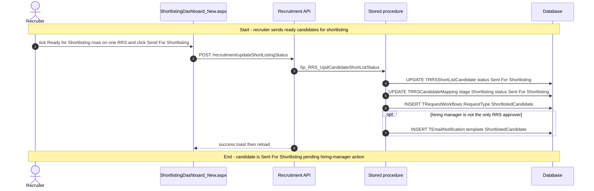
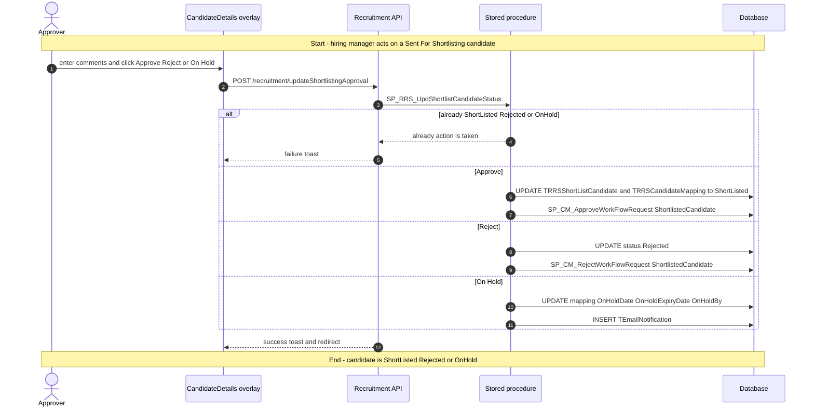
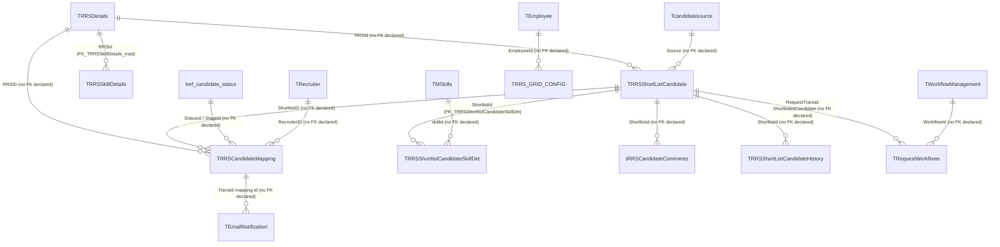

# Shortlisting Dashboard

## Overview

A recruiter opens **Recruitment → Shortlisting Dashboard** when sourced candidates are ready to be sent to a hiring manager, and a hiring manager lands here when they need to approve, reject, or hold those people. The page is a working grid: they filter by status, recruiter, organisation, and a date window (default last 30 days), tick rows that are still **Ready for Shortlisting** (stored status `Submitted`), optionally CC other employees, and click **Send For Shortlisting**. That flips the mapping to `Sent For Shortlisting`, writes workflow rows of type `ShortlistedCandidate`, and queues email. **Preview** opens a printable candidate pack for the same selection. Clicking a name encrypts the shortlist id and opens the in-page candidate profile, where a hiring manager can Approve (`ShortListed`), Reject, or On Hold.

An email or home-page notification with `NotificationId` on the query string changes the title to **Shortlisting Approval Dashboard**, hides the send/filter chrome, and loads only `Sent For Shortlisting` rows the logged-in person can act on (hiring manager or RRS approver).

**Who's involved:**

- **Recruiter** — default audience. Filters the grid, sends ready candidates, opens Preview, uses the conversation / attachment / TAT drawer.
- **Hiring manager / RRS approver** — acts on `Sent For Shortlisting` from the in-page profile or from the notification view.
- **Recruitment admin / other roles** — if they can open the menu they can view the grid. Send is enabled only when every ticked row is Ready for Shortlisting and all share one RRS. The Send button is hidden when the `ShortlistedCandidate` workflow has `SkipWorkFlow`.
- **Global-access user** (`IsGlobalAccess = Y`) — organisation multi-select. Saving it stores the employer list under grid id `recruitmentDashboard_Grid` (shared with the other recruitment dashboards). The shortlist query then passes those employer ids in.

There is **no** `llm-wiki/domain` lifecycle page for shortlisting. Table one-liners live in `llm-wiki/reference/tables/hrms.md`. Workflow rows and email queue reuse `llm-wiki/domain/approval-workflow.md` (`RequestType` `ShortlistedCandidate`). This guide is the application call chain those catalogs do not cover.

Sibling left-nav items **Recruitment Dashboard**, **RRS Dashboard**, **Sourcing Dashboard**, **Interview Dashboard**, and **Candidate Dashboard** are separate menu pages. Preview Candidate Shortlisting and View Candidate are pages this screen opens; they are not this menu item.

## Workflow

```mermaid
flowchart TD
  Nav["Recruitment left-nav Shortlisting Dashboard"] --> ASPX["ShortlistingDashboard_New.aspx"]
  ASPX --> SPA["CandidateShortListing React component"]

  SPA --> Ctc["GET /dashBoard/GetCTCAccessEmployeeData"]
  Ctc --> CtcSP["USP_EmployeeAccessPermission_List"]

  SPA --> GridFmt["GET /recruitment/getGridConfig"]
  GridFmt --> GridFmtSP["SP_RRS_GetGridConfig"]
  GridFmtSP --> PageCfg[("TRRSPageConfig")]

  SPA --> Rec["GET /recruitment/getRecruitersList"]
  Rec --> RecSP["Sp_GetRecruiterMstr"]
  RecSP --> RecT[("TRecruiter")]

  SPA --> Sts["GET /recruitment/getCandidateStatusFromMaster"]
  Sts --> StsSP["SP_RRS_GetCandidateStatusFromMaster"]
  StsSP --> StsT[("tref_candidate_status / tref_candidate_status_custom")]

  SPA --> Emp["GET /recruitment/getOrganizationEmployees"]
  Emp --> EmpSP["SP_AdminEMP_GetEmpListByOrg"]
  Emp --> Wf["GET /recruitment/getWorkFlowDetails"]
  Wf --> WfSP["SP_CM_GetWorkflowTreeXmlDetailsByPageTitle"]
  WfSP --> WfT[("TWorkflowManagement")]

  SPA --> Grid["GET /recruitment/getShortLisingDashboard"]
  Grid --> GridSP["Sp_RRS_GetShortlistingDashboard"]
  GridSP --> Map[("TRRSCandidateMapping")]
  GridSP --> Short[("TRRSShortListCandidate")]
  GridSP --> RRS[("TRRSDetails")]
  GridSP --> Skill[("TRRSShortlistCandidateSkillDet")]
  GridSP --> RrsSkill[("TRRSSkillDetails")]
  GridSP --> Claim["Sp_RRS_GetRecruitmentPermissions"]

  SPA -->|"global access org picker"| Org["GET /recruitment/getOrganizationList"]
  Org --> OrgSP["SP_AdminRM_GetGlobalAccessEmployerList"]
  OrgSP --> GridCfg[("TRRS_GRID_CONFIG")]
  Org -->|"save selection"| SaveOrg["POST /recruitment/insertMultiOrg"]
  SaveOrg --> SaveOrgSP["Sp_RRS_InsertMultiOrg"]
  SaveOrgSP --> GridCfg

  Grid -->|"Send For Shortlisting"| Send["POST /recruitment/updateShortListingStatus"]
  Send --> SendSP["Sp_RRS_UpdCandidateShortListStatus"]
  SendSP --> Short
  SendSP --> Map
  SendSP --> ReqWf[("TRequestWorkflows")]
  SendSP --> Mail[("TEmailNotification")]

  Grid -->|"click candidate name"| Enc["GET api/recruitment/encryptvalue"]
  Enc --> Profile["in-page CandidateDetails"]
  Profile -->|"Approve Reject On Hold"| Appr["POST /recruitment/updateShortlistingApproval"]
  Appr --> ApprSP["SP_RRS_UpdShortlistCandidateStatus"]
  ApprSP --> Short
  ApprSP --> Map
  ApprSP --> Hist["USP_RRS_TRRSShortListCandidateHistory_Save"]
  ApprSP --> WfDisp["SP_CM_ApproveWorkFlowRequest / SP_CM_RejectWorkFlowRequest"]

  Grid -->|"Preview"| Enc2["GET api/recruitment/encryption"]
  Enc2 --> Preview["PreviewCandidateShortlisting.aspx sibling page"]

  Grid -->|"open drawer"| Cmt["GET /recruitment/getCandidateComments"]
  Cmt --> CmtSP["Sp_RRS_GetCandidateComment"]
  CmtSP --> CmtT[("tRRSCandidateComments")]
  Cmt -->|"post comment"| AddCmt["POST /recruitment/insertCandidateComments"]
  AddCmt --> AddCmtSP["Sp_RRS_InsertCandidateComment"]
  AddCmtSP --> CmtT
```

The grid query keeps mapping statuses `Submitted`, `ShortListed`, `Sent For Shortlisting`, `Rejected`, and `OnHold`, and drops `IsDuplicate` rows. The UI relabels stored `Submitted` as **Ready for Shortlisting** when enabling Send, and remaps status description `Interview On Hold` to `Interview Feedback On Hold`.

## Request journey

The page loads several lookups first, but the characteristic recruiter write is **Send For Shortlisting**. That request starts with ticked Ready-for-Shortlisting rows on one RRS and ends with mapping status `Sent For Shortlisting` plus pending `TRequestWorkflows` rows.

A hiring manager (or RRS approver) starts a different request from the in-page profile.

## Entry points

> `ShortlistingDashboard_New.aspx` is the live Recruitment → Shortlisting Dashboard shell (`TMenuHierarchy` menu id `125` under parent `69`). The React router in `routes.js` mounts `CandidateShortLisingContainer` at `RouteConstants.CANDIDATE_SHORT_LISTING`. A legacy WebForms page `HRM/Recruitment/ShortlistingDashboard.aspx` (same menu id constant `125`) still exists and is not this React path.

| UI page / route | Purpose |
|---|---|
| `/HRM/Recruitment_React/ShortlistingDashboard_New.aspx` | Main Shortlisting Dashboard. Stamps employee, employer, role, global-access, optional decrypted `candId`, email, and BU label into hidden fields, then loads `BuildJS/recruitment.min.js`. Logs activity `ShortlistingDashboard` (enum `392`). Query `Filter`, `employer`, `NotificationId`, `EmailRedirect`, `EmployeeID` change default filters and the approval-dashboard chrome. |
| In-page `CandidateDetails` | Opened from a grid name click (`shortlistingGrid=true`, encrypted shortlist id, mapping id, hiring-manager employee id). Approve / Reject / On Hold live here. Not a separate menu item. |
| `/HRM/Recruitment/PreviewCandidateShortlisting.aspx` | Popup from **Preview** (`shortlistID` encrypted with the encryption route, plus `mappingId` and `isCTCAccess`). Not this menu item. |
| `/HRM/Recruitment_React/ViewCandidate_New.aspx` | Email-redirect click encrypts shortlist id and mapping id, then navigates here. Not this menu item. |
| Right-side `RightPanel` modal | TAT / conversation / attachment drawer for one `ShortListId`. Shared recruitment drawer, not a separate route. |
| `/HRM/Recruitment/ShortlistingDashboard.aspx` | Legacy WebForms dashboard. Uses `CandidateShortlistingBLL` / `CandidateShortlistingDAL` and `Sp_RRS_GetCandidateShortlistingDashboard`. |

`ShortlistingDashboard_New.aspx.cs` only reads session values and decrypts optional query `candId`; feature logic lives in `shortListing.js` and the Node recruitment API. Encrypt for navigation uses the .NET Web API, not the Node app.

## Code → database call chain

The live SPA constants for this page resolve to `/recruitment/...` routes. The older `/v2/recruitment/...` and `/v3/recruitment/...` variants remain in `apiURLConstants.js`, but the duplicate keys later in the file make the plain `/recruitment/...` versions the ones this bundle uses. `routeIndex.js` mounts only `RecruitmentRoutes.js` at `/recruitment`.

| Entry point | DAL / BLL method (`file:line`) | Stored procedure |
|---|---|---|
| Page load — CTC unit access for Preview | `GetCTCAccessEmployeeData` (`dashboardController.js:2883`, `dashBoardDAL.js:4300`) | `USP_EmployeeAccessPermission_List` |
| Page load — saved column order | `GetGridConfig` (`recruitmentController.js:2523`, `recruitmentDAL.js:6642`) | `SP_RRS_GetGridConfig` |
| Page load — recruiter filter and `isRecruiter` | `GetRecruitersList` (`recruitmentController.js:803`, `recruitmentDAL.js:2396`) | `Sp_GetRecruiterMstr` |
| Page load — status multi-select | `GetCandidateStatusFromMaster` (`recruitmentController.js:2667`, `recruitmentDAL.js:6958`) | `SP_RRS_GetCandidateStatusFromMaster` |
| Page load — CC employee list | `GetEmployeesByOrganization` (`recruitmentController.js:35`, `recruitmentDAL.js:16`) | `SP_AdminEMP_GetEmpListByOrg` |
| After employee list — hide Send when skip-workflow | `GetWorkFlowDetails` (`recruitmentController.js:224`, `recruitmentDAL.js:155`) | `SP_CM_GetWorkflowTreeXmlDetailsByPageTitle` (`pageTitle` `ShortlistedCandidate`) |
| Page load / search — main shortlisting grid | `GetShortLisingDashboard` (`recruitmentController.js:721`, `recruitmentDAL.js:2107`) | `Sp_RRS_GetShortlistingDashboard` (internally also `Sp_RRS_GetRecruitmentPermissions`) |
| Global-access org list (picker and `getEmployerIds`) | `GetOrganizationList` (`recruitmentController.js:233`, `recruitmentDAL.js:943`) | `SP_AdminRM_GetGlobalAccessEmployerList` |
| Save organisation selection | `InsertMultiOrg` (`recruitmentController.js:2459`, `recruitmentDAL.js:6488`) | `Sp_RRS_InsertMultiOrg` |
| Send For Shortlisting | `UpdateShortListingStatus` (`recruitmentController.js:821`, `recruitmentDAL.js:2450`) | `Sp_RRS_UpdCandidateShortListStatus` |
| Click candidate name — encrypt shortlist id | `EncryptValue` (`HRMS.Shared/HRMS.WebAPI/Controllers/RecruitmentController.cs:550`) | none (in-process encryption) |
| Preview — encrypt comma-separated shortlist ids | `EncryptionValue` (`HRMS.Shared/HRMS.WebAPI/Controllers/RecruitmentController.cs:535`) | none (in-process encryption; different helper than `encryptvalue`) |
| In-page Approve / Reject / On Hold | `UpdateShortlistingApproval` (`recruitmentController.js:2046`, `recruitmentDAL.js:5536`) | `SP_RRS_UpdShortlistCandidateStatus` (internally `USP_RRS_TRRSShortListCandidateHistory_Save`, `SP_CM_ApproveWorkFlowRequest` / `SP_CM_RejectWorkFlowRequest`) |
| Drawer — comment list | `GetCandidateComments` (`recruitmentController.js:979`, `recruitmentDAL.js:2996`) | `Sp_RRS_GetCandidateComment` |
| Drawer — add comment | `InsertCandidateComments` (`recruitmentController.js:988`, `recruitmentDAL.js:3021`) | `Sp_RRS_InsertCandidateComment` |

There is **no BLL layer** on the Node path. The controller calls `recruitmentDAL.js` directly. The React code-behind does not make data-access calls. The legacy WebForms dashboard does use `CandidateShortlistingBLL` / `CandidateShortlistingDAL`.

## API endpoints

| Verb | Route | Parameters | Purpose | Source |
|---|---|---|---|---|
| `GET` | `/dashBoard/GetCTCAccessEmployeeData` | query `employerId` (int, required), `EmployeeAccessPermissionID` (this page `null`), `employeeId` (int) | Unit ids the user may see CTC for; passed to Preview as `isCTCAccess` | `DashBoardRoutes.js:260`, `dashboardController.js:2883` |
| `GET` | `/recruitment/getGridConfig` | query `employerId` (int, required), `employeeId` (sent by caller; live controller uses `req.EID`), `gridId` (this page `Shortlist_Grid`) | Saved column sequence (`ConfigType` `GridFormat`) | `RecruitmentRoutes.js:214`, `recruitmentController.js:2523` |
| `GET` | `/recruitment/getRecruitersList` | query `employerid` (int, required), `isactive` (this page `true`), `employeeId` (optional in signature; this page sends it). DAL only binds `@employerid` | Recruiter multi-select; default to the logged-in recruiter | `RecruitmentRoutes.js:72`, `recruitmentController.js:803` |
| `GET` | `/recruitment/getCandidateStatusFromMaster` | query `employerId` (int, required), `dashboard` (string, required; this page `Shortlisting`) | Status filter options (excludes `Un-Tagged`) | `RecruitmentRoutes.js:230`, `recruitmentController.js:2667` |
| `GET` | `/recruitment/getOrganizationEmployees` | query `organizationId` (int, required), `employeeId` (int) | CC employee multi-select | `RecruitmentRoutes.js:9`, `recruitmentController.js:35` |
| `GET` | `/recruitment/getWorkFlowDetails` | query `employerId` (int, required; `assertEmployerAccess`), `pageTitle` (this page `ShortlistedCandidate`), `employeeId` (sent by caller; live controller uses `req.EID`) | `WorkflowId` and `SkipWorkFlow` for the Send button | `RecruitmentRoutes.js:21`, `recruitmentController.js:224` |
| `GET` | `/recruitment/getShortLisingDashboard` | query `employerid`, `employeeid`, `multiOrg`, `selectedStatusIds`, `selectedRecruiterIds`, `notificationId`, `fromDate`, `toDate`, `EmployerIds` | Main grid. Route name is misspelled `getShortLisingDashboard` | `RecruitmentRoutes.js:63`, `recruitmentController.js:721` |
| `GET` | `/recruitment/getOrganizationList` | query `employeeId` (sent by caller; live controller uses `req.EID`), `gridId` (picker remaps `shortlistingDashboard_Grid` to `recruitmentDashboard_Grid`; `getEmployerIds` also uses `recruitmentDashboard_Grid`) | Organisations and saved selection for global-access users | `RecruitmentRoutes.js:22`, `recruitmentController.js:233` |
| `POST` | `/recruitment/insertMultiOrg` | body `employeeId`, `gridId`, `configType` (`employerDropdown`), `config` (comma-separated employer ids) | Persist the organisation picker | `RecruitmentRoutes.js:207`, `recruitmentController.js:2459` |
| `POST` | `/recruitment/updateShortListingStatus` | body `shortListId.value` (comma-separated ids), `rRSId.value` (this page sends `RRSNumber`, not `RRSId`), `updatedBy.value`, `wfId.value`, `intimationTo.value` | Send selected candidates for shortlisting | `RecruitmentRoutes.js:74`, `recruitmentController.js:821` |
| `GET` | `api/recruitment/encryptvalue` | query `value` (string, required; shortlist id) | Encrypt id for the in-page profile. .NET Web API via `APIHelper.getNetApi`, not Node | `HRMS.WebAPI/Controllers/RecruitmentController.cs:550` |
| `GET` | `api/recruitment/encryption` | query `value` (string, required; comma-separated shortlist ids) | Encrypt ids for Preview. Different .NET helper than `encryptvalue` | `HRMS.WebAPI/Controllers/RecruitmentController.cs:535` |
| `POST` | `/recruitment/updateShortlistingApproval` | body `shortlistId`, `status` (`ShortListed` / `Rejected` / `OnHold`), `updatedBy`, `Comments`, `mappingId`, `onHoldExpiryDate` | Approve, reject, or hold from the in-page profile | `RecruitmentRoutes.js:173`, `recruitmentController.js:2046` |
| `GET` | `/recruitment/getCandidateComments` | query `shortlistid`, `employerid`, `candidateId` (this page null), `SourceId` (this page null) | Drawer comment list | `RecruitmentRoutes.js:89`, `recruitmentController.js:979` |
| `POST` | `/recruitment/insertCandidateComments` | body `candidateid`, `shortlistid`, `SourceId`, `comment`, `createdBy`, `createdForPage` (this page `Shortlisting Dashboard`), `employerId` | Insert a drawer comment | `RecruitmentRoutes.js:90`, `recruitmentController.js:988` |

## Stored procedures & tables involved

> Live dashboard data is in core **`HRMS`**. `Sp_RRS_GetShortlistingDashboard` is the React grid. `Sp_RRS_GetCandidateShortlistingDashboard` is the legacy WebForms grid and is not referenced from `shortListing.js`. Table meanings reuse `llm-wiki/reference/tables/hrms.md`. Workflow behaviour reuses `llm-wiki/domain/approval-workflow.md`.

| Object | File path | Purpose | llm-wiki |
|---|---|---|---|
| `TRRSShortListCandidate` | `HRMS-DATABASE/HRMS/TABLES/TRRSShortListCandidate.sql` | Candidate profile row. Grid SELECT source; Send and Approve UPDATE target. PK only; no FK declared | `llm-wiki/reference/tables/hrms.md` |
| `TRRSCandidateMapping` | `HRMS-DATABASE/HRMS/TABLES/TRRSCandidateMapping.sql` | Per-RRS mapping whose `STATUS` / `StatusId` drive the grid and Send. No FK in the TABLE script; OnHold columns added by `DDL/75925_Alter Statement*.sql` | `llm-wiki/reference/tables/hrms.md` |
| `TRRSShortListCandidateHistory` | `HRMS-DATABASE/HRMS/TABLES/TRRSShortListCandidateHistory.sql` | History snapshot written on Approve / Reject / On Hold | `llm-wiki/reference/tables/hrms.md` |
| `TRRSShortlistCandidateSkillDet` | `HRMS-DATABASE/HRMS/TABLES/TRRSShortlistCandidateSkillDet.sql` | Skills concatenated on the grid. Declared FK `FK_TRRSShortlistCandidateSkillDet` | `llm-wiki/reference/tables/hrms.md` |
| `TRRSSkillDetails` | `HRMS-DATABASE/HRMS/TABLES/TRRSSkillDetails.sql` | Mandatory RRS skills (`Required = 'Y'`, `SkillType = 'T'`). Declared FK `FK_TRRSSkillDetails_rrsid` | `llm-wiki/reference/tables/hrms.md` |
| `TRRSDetails` | `HRMS-DATABASE/HRMS/TABLES/TRRSDetails.sql` | Requisition joined for title, BU, hiring manager, approvers, RRS number | `llm-wiki/reference/tables/hrms.md` |
| `TRRSCandidate` | `HRMS-DATABASE/HRMS/TABLES/TRRSCandidate.sql` | Master candidate updated when Approve writes a `CandidateId`. Declared FK `FK_TRRSCandidate_rrsid` | `llm-wiki/reference/tables/hrms.md` |
| `tref_candidate_status` / `tref_candidate_status_custom` | catalogued in wiki | Status / stage lookup and employer labels. Grid `Description` and Send `StatusId` | `llm-wiki/reference/tables/hrms.md` |
| `Tcandidatesource` | `HRMS-DATABASE/HRMS/TABLES/Tcandidatesource.sql` | Source-channel name on the grid; Send special-cases `Employee Referral` | `llm-wiki/reference/tables/hrms.md` |
| `TRecruiter` | catalogued in wiki | Recruiter filter and recruiter name on the grid | `llm-wiki/reference/tables/hrms.md` |
| `TRequestWorkflows` | `HRMS-DATABASE/HRMS/TABLES/TRequestWorkflows.sql` | Send inserts pending rows (`RequestType` `ShortlistedCandidate`, `RequestTransid` = shortlist id). No FK declared | `llm-wiki/reference/tables/hrms.md`, `llm-wiki/domain/approval-workflow.md` |
| `TEmailNotification` | catalogued in wiki | Queued `ShortlistedCandidate` mail on Send (when hiring manager ≠ sole approver) and On Hold | `llm-wiki/reference/tables/hrms.md` |
| `TWorkflowManagement` | catalogued in wiki | `ShortlistedCandidate` definition; `SkipWorkFlow` hides Send | `llm-wiki/reference/tables/hrms.md` |
| `TRRS_GRID_CONFIG` | catalogued in wiki | Saved organisation picker (`ConfigType` `employerDropdown`) | `llm-wiki/reference/tables/hrms.md` |
| `TRRSPageConfig` | catalogued in wiki | Saved grid column order for `Shortlist_Grid` | `llm-wiki/reference/tables/hrms.md` |
| `tRRSCandidateComments` | catalogued in wiki | Drawer comments. PK only; no FK declared | `llm-wiki/reference/tables/hrms.md` |
| `TOrgHierarchyDetails` / `TTitle` / `TMSkills` / `TEmployerDetails` | catalogued in wiki | BU name, job title, skill names, org filter | `llm-wiki/reference/tables/hrms.md` |
| `Sp_RRS_GetShortlistingDashboard` | `HRMS-DATABASE/HRMS/STOREPROCEDURE/Sp_RRS_GetShortlistingDashboard.sql` | Grid query over mapping + shortlist + skills + claim filter | — |
| `Sp_RRS_UpdCandidateShortListStatus` | `HRMS-DATABASE/HRMS/STOREPROCEDURE/Sp_RRS_UpdCandidateShortListStatus.sql` | Send For Shortlisting cursor update + workflow + email | — |
| `SP_RRS_UpdShortlistCandidateStatus` | `HRMS-DATABASE/HRMS/STOREPROCEDURE/SP_RRS_UpdShortlistCandidateStatus.sql` | Approve / Reject / On Hold | — |
| `SP_RRS_GetCandidateStatusFromMaster` | `HRMS-DATABASE/HRMS/STOREPROCEDURE/SP_RRS_GetCandidateStatusFromMaster.sql` | Status dropdown (`dashboard` `Shortlisting`) | — |
| `SP_RRS_GetGridConfig` | `HRMS-DATABASE/HRMS/STOREPROCEDURE/SP_RRS_GetGridConfig.sql` | Column format from `TRRSPageConfig` | — |
| `SP_CM_GetWorkflowTreeXmlDetailsByPageTitle` | catalogued in wiki | Resolve `ShortlistedCandidate` workflow | `llm-wiki/domain/approval-workflow.md` |
| `SP_CM_ApproveWorkFlowRequest` / `SP_CM_RejectWorkFlowRequest` | catalogued in wiki | Advance or reject the `ShortlistedCandidate` routing rows | `llm-wiki/domain/approval-workflow.md` |
| `Sp_GetRecruiterMstr` | `HRMS-DATABASE/HRMS/STOREPROCEDURE/Sp_GetRecruiterMstr.sql` | Recruiter list | — |
| `SP_AdminEMP_GetEmpListByOrg` | `HRMS-DATABASE/HRMS/STOREPROCEDURE/` | CC employee list | — |
| `SP_AdminRM_GetGlobalAccessEmployerList` | `HRMS-DATABASE/HRMS/STOREPROCEDURE/SP_AdminRM_GetGlobalAccessEmployerList.sql` | Org list and saved selection | — |
| `Sp_RRS_InsertMultiOrg` | `HRMS-DATABASE/HRMS/STOREPROCEDURE/Sp_RRS_InsertMultiOrg.sql` | Upsert `TRRS_GRID_CONFIG` | — |
| `Sp_RRS_GetCandidateComment` / `Sp_RRS_InsertCandidateComment` | `HRMS-DATABASE/HRMS/STOREPROCEDURE/` | Drawer comments | — |
| `USP_EmployeeAccessPermission_List` | `HRMS-DATABASE/HRMS/STOREPROCEDURE/` | CTC unit access for Preview | — |
| `USP_RRS_TRRSShortListCandidateHistory_Save` | `HRMS-DATABASE/HRMS/STOREPROCEDURE/USP_RRS_TRRSShortListCandidateHistory_Save.sql` | History row on approval update | — |
| `Sp_RRS_GetRecruitmentPermissions` | called from the get procedure | BU-scoped claim filter (`@BusinessUnitIds`) | — |
| `Sp_RRS_GetCandidateShortlistingDashboard` | `HRMS-DATABASE/HRMS/STOREPROCEDURE/Sp_RRS_GetCandidateShortlistingDashboard.sql` | Legacy WebForms grid. Not on the React path | — |

## Table relationships

The project does not have a shortlisting-feature ER diagram to reuse, so this diagram is derived from `llm-wiki/reference/tables/hrms.md`, `llm-wiki/domain/approval-workflow.md`, and the procedure-level table usage above. Where the catalog or DDL does not declare a foreign key, the relationship is labelled as such instead of being invented.

## Known gaps

- There is **no** recruitment-specific canonical domain page in `llm-wiki/domain/`, and SourceCode `docs/SystemModels/SystemModel-2` has no Shortlisting workflow page in this checkout. Behaviour above is from SourceCode + procedure scripts. `llm-wiki/domain/employee-lifecycle.md` only names recruitment as the candidate stage before employment.
- Two dashboards share menu id `125`. This guide documents the React `ShortlistingDashboard_New.aspx` path. `HRM/Recruitment/ShortlistingDashboard.aspx` plus `CandidateForShortlisting.aspx` still compile and call `Sp_RRS_GetCandidateShortlistingDashboard` / `SP_RRS_UpdShortlistCandidateStatus` through `CandidateShortlistingDAL`. `Constants.URL_RECRUITMENT_SHORTLIST_DASHBOARD` still points at the WebForms page. This checkout has no `TMenuDetails` NavigateURL update for menu `125`, so which URL the live left-nav uses was not confirmed from DML.
- `routeIndex.js` mounts only `RecruitmentRoutes.js` at `/recruitment`. `RecruitmentRoutes_V2.js` / `RecruitmentRoutes_V3.js` exist on disk and are not mounted. Duplicate keys in `apiURLConstants.js` leave the trailing `/recruitment/...` constants as the live SPA values.
- Organisation picker for this page **saves and reads** `TRRS_GRID_CONFIG` under grid id `recruitmentDashboard_Grid`. `Sp_RRS_GetShortlistingDashboard` would fall back to `shortlistingDashboard_Grid` only when `EmployerIds` is null and `@IsStatusCount` is 0; the live page always passes `EmployerIds` from the shared recruitment-dashboard config.
- Send posts `rRSId.value` from `RRSNumber`. The procedure looks up `TRRSDetails` with `Where RRSNumber=@RRSId`, so the name is wrong but the lookup matches. Preview's same-RRS check uses `RRSId`.
- `GetRecruitersList` accepts `isactive` and `employeeId` in the controller signature, but the DAL only binds `@employerid` before executing `Sp_GetRecruiterMstr`.
- `GetWorkFlowDetails` and `GetGridConfig` ignore the query `employeeId` and use `req.EID`.
- `getRequestListGridDatainitally` remaps `Interview On Hold` on `this.ShortListingList` but `setState({ gridData: data })` keeps the unmapped API rows. Checkbox enablement reads `gridData`.
- `getFeedbackComments` is implemented and never bound (the Candidate ID column onClick is commented out). `downloadFile` is likewise unused in the current render.
- `INSERT_MULTIORG` in the live constants block is `recruitment/insertMultiOrg` (no leading `/`). Other live keys keep the leading slash.
- `TRRSCandidateMapping` TABLE script has no OnHold columns; live procedures read `OnHoldExpiryDate` / `IsOnHoldExpiredForcefully` added by `DDL/75925_Alter Statement*.sql`.
- Shared `RightPanel` can call further recruitment endpoints (attachments, images, milestones, offer letters). This page mounts it with `CandidateId` and `SourceId` null and `ShortListId` set, so only the shortlist-scoped comment/attachment/TAT path is in play here.
- In-page `CandidateDetails` loads additional candidate-profile endpoints not listed above. Those belong to the profile overlay, not the grid.
- `USP_EmployeeAccessPermission_List` / employee-access-permission tables are not catalogued in `llm-wiki/reference/tables/hrms.md`.

## Reference

Confidence is **medium**: the live React page was traced to v1 DAL `file:line` and named procedures. Declared FKs come from table DDL (`FK_TRRSShortlistCandidateSkillDet`, `FK_TRRSSkillDetails_rrsid`, `FK_TRRSCandidate_rrsid`). Workflow relationships reuse `llm-wiki/domain/approval-workflow.md` rather than a shortlisting `erDiagram`. Confidence is not high because there is no canonical recruitment feature doc, and the WebForms sibling for the same menu id is still on disk.

### SourceCode

- `HRMS.Web/HRMS.Web/HRM/Recruitment_React/ShortlistingDashboard_New.aspx`
- `HRMS.Web/HRMS.Web/HRM/Recruitment_React/ShortlistingDashboard_New.aspx.cs`
- `HRMS.Web/HRMS.Web/HRM/Recruitment_React/Areas/routes.js`
- `HRMS.Web/HRMS.Web/HRM/Recruitment_React/Common/routeConstants.js`
- `HRMS.Web/HRMS.Web/HRM/Recruitment_React/Common/apiURLConstants.js`
- `HRMS.Web/HRMS.Web/HRM/Recruitment_React/Areas/Candidate/Containers/shortlisingContainer.js`
- `HRMS.Web/HRMS.Web/HRM/Recruitment_React/Areas/Candidate/Components/shortListing.js`
- `HRMS.Web/HRMS.Web/HRM/Recruitment_React/Areas/Candidate/Components/candidate-details.js`
- `HRMS.Web/HRMS.Web/HRM/Recruitment_React/SharedComponent/UI/OrganizationMultiSelectDropDown/organizationMultiSelectDropDown.js`
- `HRMS.Web/HRMS.Web/HRM/Recruitment_React/Areas/RightPanel.js`
- `HRMS.Web/HRMS.Web/HRM/Recruitment/ShortlistingDashboard.aspx`
- `HRMS.Web/HRMS.Web/HRM/Recruitment/ShortlistingDashboard.aspx.cs`
- `HRMS.Shared/HRMS.DataAccessLayer/Recruitment/CandidateShortlistingDAL.cs`
- `HRMS.Shared/HRMS.BusinessLayer/Recruitment/CandidateShortlistingBLL.cs`
- `HRMS.CoreAPI/HRMS.Core.WebAPI.Node/Routes/routeIndex.js`
- `HRMS.CoreAPI/HRMS.Core.WebAPI.Node/Routes/RecruitmentRoutes.js`
- `HRMS.CoreAPI/HRMS.Core.WebAPI.Node/Routes/DashBoardRoutes.js`
- `HRMS.CoreAPI/HRMS.Core.WebAPI.Node/Controllers/recruitmentController.js`
- `HRMS.CoreAPI/HRMS.Core.WebAPI.Node/Controllers/dashboardController.js`
- `HRMS.CoreAPI/HRMS.Core.WebAPI.Node/Core/DataAccessLayer/recruitmentDAL.js`
- `HRMS.CoreAPI/HRMS.Core.WebAPI.Node/Core/DataAccessLayer/dashBoardDAL.js`
- `HRMS.Shared/HRMS.WebAPI/Controllers/RecruitmentController.cs`

### TDG HRMS DB

- `llm-wiki/reference/tables/hrms.md`
- `llm-wiki/domain/employee-lifecycle.md`
- `llm-wiki/domain/approval-workflow.md`
- `HRMS-DATABASE/HRMS/TABLES/TRRSShortListCandidate.sql`
- `HRMS-DATABASE/HRMS/TABLES/TRRSCandidateMapping.sql`
- `HRMS-DATABASE/HRMS/TABLES/TRRSShortlistCandidateSkillDet.sql`
- `HRMS-DATABASE/HRMS/TABLES/TRRSSkillDetails.sql`
- `HRMS-DATABASE/HRMS/TABLES/TRequestWorkflows.sql`
- `HRMS-DATABASE/HRMS/TABLES/tRRSCandidateComments.sql`
- `HRMS-DATABASE/HRMS/DDL/75925_Alter Statement for TRRSCandidateMapping.sql`
- `HRMS-DATABASE/HRMS/STOREPROCEDURE/Sp_RRS_GetShortlistingDashboard.sql`
- `HRMS-DATABASE/HRMS/STOREPROCEDURE/Sp_RRS_UpdCandidateShortListStatus.sql`
- `HRMS-DATABASE/HRMS/STOREPROCEDURE/SP_RRS_UpdShortlistCandidateStatus.sql`
- `HRMS-DATABASE/HRMS/STOREPROCEDURE/SP_RRS_GetCandidateStatusFromMaster.sql`
- `HRMS-DATABASE/HRMS/STOREPROCEDURE/SP_RRS_GetGridConfig.sql`
- `HRMS-DATABASE/HRMS/STOREPROCEDURE/Sp_RRS_GetCandidateShortlistingDashboard.sql`
- `HRMS-DATABASE/HRMS/DML/DML TMenuDetails Notifications under Recruitment.sql`
