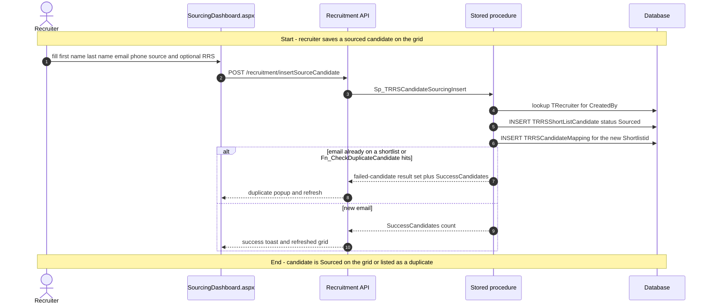
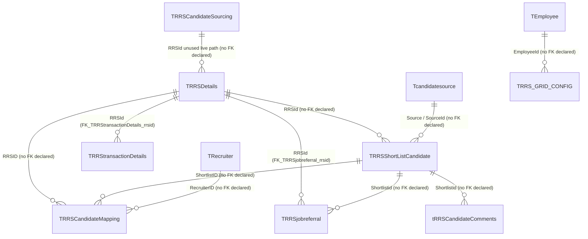

# Sourcing Dashboard

## Overview

A recruiter (or recruitment admin) opens **Recruitment → Sourcing Dashboard** when they need to capture new candidate leads before those people become a full shortlist or interview record. The page is a working grid, not a count card: they filter by source and a date window (default last 30 days), add a row inline, import an Excel file, or jump to the full Add Candidate form. Each new row is a name, email, phone, source channel, and optional RRS. Saving it creates a shortlist candidate in `Sourced` status and maps that person to the chosen requisition (or to RRS id `0` when none is picked).

The grid only shows people still in sourcing (`Sourced`, `Pending` shown as `InProcess`, or `Dropped`). Rows the procedure marks as duplicates are hidden and counted; the recruiter can open Duplicate Candidate from that badge. Clicking a name encrypts the shortlist id and opens Add Candidate so the rest of the profile can be completed. A right-side drawer on a row is the conversation / attachment panel for that shortlist id.

**Who's involved:**

- **Recruiter** — default audience. Adds sourced leads, imports Excel, opens Add Candidate, and uses the conversation drawer. Bulk-upload EXE download appears only when they are a recruiter and job-scheduler config `ResumeParsingBulkUpload` has both `OrganizationKey` and `DownloadDRPExe`.
- **Recruitment admin** — same grid, plus an **Add Candidate Config** button that leaves this menu for the admin Excel-config page.
- **Hiring manager / other roles** — if they can open the menu they can still view the grid; inline add and Excel import are gated in the UI to recruiter / recruitment-admin (and to anyone whose employee id is an active `TRecruiter` row).
- **Global-access user** (`IsGlobalAccess = Y`) — organisation multi-select. Saving it stores the employer list under grid id `recruitmentDashboard_Grid` (shared with the other recruitment dashboards). The sourced-candidate query then passes those employer ids in.

There is **no** `llm-wiki/domain` lifecycle page for sourcing. Table one-liners live in `llm-wiki/reference/tables/hrms.md`. The wiki still describes `TRRSCandidateSourcing` as the lead table; the live get/insert procedures read and write `TRRSShortListCandidate` and `TRRSCandidateMapping` instead (the `TRRSCandidateSourcing` insert/update in `Sp_TRRSCandidateSourcingInsert` is commented out). This guide is the application call chain those catalogs do not cover.

Sibling left-nav items **Recruitment Dashboard**, **RRS Dashboard**, **Shortlisting Dashboard**, **Interview Dashboard**, and **Candidate Dashboard** are separate menu pages. Add Candidate, Duplicate Candidate, Recruiter Excel, and Admin Excel Config are pages this screen navigates to; they are not this menu item.

## Workflow

```mermaid
flowchart TD
  Nav["Recruitment left-nav Sourcing Dashboard"] --> ASPX["SourcingDashboard.aspx"]
  ASPX --> SPA["CandidateSourcing React component"]

  SPA --> Rec["GET /recruitment/getRecruitersList"]
  Rec --> RecSP["Sp_GetRecruiterMstr"]
  RecSP --> RecT[("TRecruiter")]

  SPA --> Sched["GET /recruitment/getJobSchedulerConfigurations"]
  Sched --> SchedSP["SP_GetJobSchedulerConfigurations"]
  SchedSP --> SchedT[("TJobSchedulerConfiguration")]

  SPA --> Excel["GET /recruitment/getExcelConfigList"]
  Excel --> ExcelSP["SP_RRS_GetExcelConfigList"]
  ExcelSP --> ExcelT[("tref_rrs_excelConfig / tref_rrs_excelConfig_custom")]

  SPA --> Src["GET /recruitment/getCandidateSources"]
  Src --> SrcSP["SP_RRS_GetCandidateSource"]
  SrcSP --> SrcT[("Tcandidatesource")]
  SrcSP --> GridCfg[("TRRS_GRID_CONFIG")]

  SPA --> Grid["GET /recruitment/getSourcedCandidate"]
  Grid --> GridSP["Sp_GET_TRRSCandidateSourcing"]
  GridSP --> Short[("TRRSShortListCandidate")]
  GridSP --> Map[("TRRSCandidateMapping")]
  GridSP --> RRS[("TRRSDetails")]
  GridSP --> Ref[("TRRSjobreferral")]
  GridSP --> Claim["USP_Get_RecruitmentClaim_By_EmployeeID"]

  SPA --> RrsList["GET /recruitment/getRRSList"]
  RrsList --> RrsSP["Sp_RRS_DetailsSearchByRecruiters"]
  RrsSP --> RRS
  RrsSP --> Txn[("TRRStransactionDetails")]

  SPA -->|"global access org picker"| Org["GET /recruitment/getOrganizationList"]
  Org --> OrgSP["SP_AdminRM_GetGlobalAccessEmployerList"]
  OrgSP --> GridCfg
  Org -->|"save selection"| SaveOrg["POST /recruitment/insertMultiOrg"]
  SaveOrg --> SaveOrgSP["Sp_RRS_InsertMultiOrg"]
  SaveOrgSP --> GridCfg

  Grid -->|"inline save or Excel import"| Ins["POST /recruitment/insertSourceCandidate"]
  Ins --> InsSP["Sp_TRRSCandidateSourcingInsert"]
  InsSP --> Short
  InsSP --> Map
  InsSP --> DupFn["Fn_CheckDuplicateCandidate"]

  Grid -->|"click candidate name"| Enc["GET api/recruitment/encryptvalue"]
  Enc --> AddCand["AddCandidate.aspx sibling page"]

  Grid -->|"open conversation drawer"| Cmt["GET /recruitment/getCandidateComments"]
  Cmt --> CmtSP["Sp_RRS_GetCandidateComment"]
  CmtSP --> CmtT[("tRRSCandidateComments")]
  Cmt -->|"post comment"| AddCmt["POST /recruitment/insertCandidateComments"]
  AddCmt --> AddCmtSP["Sp_RRS_InsertCandidateComment"]
  AddCmtSP --> CmtT
```

The grid query also returns a second result set `DuplicateCount`. Rows with `IsDuplicate = 1` are removed from the first set before they reach the UI. Source filter options come from `Tcandidatesource`; a row in `TRRSjobreferral` is labelled **Candidate Referral** regardless of the stored source id.

## Request journey

The page loads several lookups first, but the characteristic write is **saving a sourced candidate** (one inline grid row or a validated Excel import). That request starts with a recruiter entering name / email / phone / source and ends with a `TRRSShortListCandidate` row plus a `TRRSCandidateMapping` row.

Excel import uses the same POST after the browser parses the workbook. Client-side checks (valid RRS number, valid source name, required columns) run before the API call; emails already on `TRRSShortListCandidate` for that employer still go through the procedure and come back in the failed-candidate set.

## Entry points

> `SourcingDashboard.aspx` is the live Recruitment → Sourcing Dashboard shell (`TMenuHierarchy` menu id `76` under parent `69`). There is no older WebForms sibling for this menu item. The React router in `routes.js` mounts `SourcingDashboardContainer` at `RouteConstants.SOURCING_DASHBOARD`.

| UI page / route | Purpose |
|---|---|
| `/HRM/Recruitment_React/SourcingDashboard.aspx` | Main Sourcing Dashboard. Stamps employee, employer, role, global-access, optional decrypted `candId`, email, and BU label into hidden fields, then loads `BuildJS/recruitment.min.js`. Logs activity `SourcingDashboard` (enum `391`). |
| `/HRM/Recruitment_React/AddCandidate.aspx` (typical sibling from `RouteConstants.ADD_CANDIDATE`) | Opened from **Add New Candidate** (`IsNew=true`) or from a grid name click (`ShortlistingId` encrypted, plus `employer`, `source`, `return=SourcingDashboard`). Not this menu item. |
| `/HRM/Recruitment_React/...` Duplicate Candidate | Opened from the duplicate-count badge (`return=SourcingDashboard`). |
| Recruiter Excel / Admin Excel Config | Opened from **Excel Configuration** / **Add Candidate Config**. Admin button only when `roleName` is `recruitmentadmin`. |
| Right-side `RightPanel` modal | Conversation / attachment drawer for one `ShortListId`. Shared recruitment drawer, not a separate route. |

`SourcingDashboard.aspx.cs` only reads session values and decrypts optional query `candId`; feature logic lives in `sourcing.js` and the Node recruitment API. Encrypt for navigation uses the .NET Web API, not the Node app.

## Code → database call chain

The live SPA constants for this page resolve to `/recruitment/...` routes. The older `/v2/recruitment/...` and `/v3/recruitment/...` variants remain in `apiURLConstants.js`, but the duplicate keys later in the file make the plain `/recruitment/...` versions the ones this bundle uses. `routeIndex.js` mounts only `RecruitmentRoutes.js` at `/recruitment`.

| Entry point | DAL / BLL method (`file:line`) | Stored procedure |
|---|---|---|
| Page load — is the user an active recruiter | `GetRecruitersList` (`recruitmentController.js:803`, `recruitmentDAL.js:2396`) | `Sp_GetRecruiterMstr` |
| Page load — bulk-upload EXE / org key flags | `GetJobSchedulerConfigurations` (`recruitmentController.js:1522`, `recruitmentDAL.js:4542`) | `SP_GetJobSchedulerConfigurations` |
| Page load — Excel column config presence | `GetExcelConfigList` (`recruitmentController.js:2640`, `recruitmentDAL.js:6882`) | `SP_RRS_GetExcelConfigList` |
| Page load — source dropdown | `GetCandidateSources` (`recruitmentController.js:830`, `recruitmentDAL.js:2476`) | `SP_RRS_GetCandidateSource` |
| Page load / search — main sourcing grid | `GetSourcedCandidate` (`recruitmentController.js:1913`, `recruitmentDAL.js:5349`) | `Sp_GET_TRRSCandidateSourcing` (internally also `USP_Get_RecruitmentClaim_By_EmployeeID`) |
| After grid load — RRS dropdown for new rows / Excel | `GetRRSList` (`recruitmentController.js:712`, `recruitmentDAL.js:2075`) | `Sp_RRS_DetailsSearchByRecruiters` |
| Global-access org list (picker and `getEmployerIds`) | `GetOrganizationList` (`recruitmentController.js:233`, `recruitmentDAL.js:943`) | `SP_AdminRM_GetGlobalAccessEmployerList` |
| Save organisation selection | `InsertMultiOrg` (`recruitmentController.js:2459`, `recruitmentDAL.js:6488`) | `Sp_RRS_InsertMultiOrg` |
| Inline save or Excel import | `InsertSourceCandidate` (`recruitmentController.js:1927`, `recruitmentDAL.js:5399`) | `Sp_TRRSCandidateSourcingInsert` |
| Click candidate name — encrypt shortlist id | `EncryptValue` (`HRMS.Shared/HRMS.WebAPI/Controllers/RecruitmentController.cs:550`) | none (in-process encryption) |
| Drawer — comment list | `GetCandidateComments` (`recruitmentController.js:979`, `recruitmentDAL.js:2996`) | `Sp_RRS_GetCandidateComment` |
| Drawer — add comment | `InsertCandidateComments` (`recruitmentController.js:988`, `recruitmentDAL.js:3021`) | `Sp_RRS_InsertCandidateComment` |

There is **no BLL layer** on the Node path. The controller calls `recruitmentDAL.js` directly. The WebForms code-behind does not make data-access calls. `InsertSourceCandidate` binds a TVP of type `UDT_TRRSCandidateSourcing` from `request.sourcedCandidatesList`.

`getWorkFlowDetails` exists on the React class (`workFlowName` `ShortlistedCandidate`) but is never invoked from `componentDidMount` or the render path.

## API endpoints

| Verb | Route | Parameters | Purpose | Source |
|---|---|---|---|---|
| `GET` | `/recruitment/getRecruitersList` | query `employerid` (int, required), `isactive` (this page passes `true`), `employeeId` (optional in signature; this page omits it) | Decide whether the logged-in employee is an active recruiter | `RecruitmentRoutes.js:72`, `recruitmentController.js:803` |
| `GET` | `/recruitment/getJobSchedulerConfigurations` | query `SchedulerName` (string, required; this page `ResumeParsingBulkUpload`), `ConfigKey` (optional; this page `null`), `Employerid` (int, required). Guarded by `assertEmployerAccess('Employerid')` | Read `OrganizationKey` and `DownloadDRPExe` for bulk-upload EXE | `RecruitmentRoutes.js:136`, `recruitmentController.js:1522` |
| `GET` | `/recruitment/getExcelConfigList` | query `employerId` (int, required), `RefPageId` (int, required; this page `AppConstants.CNST_ADD_CANDIDATE_PAGE_CONFIG` = `1`) | Detect whether add-candidate Excel config exists | `RecruitmentRoutes.js:227`, `recruitmentController.js:2640` |
| `GET` | `/recruitment/getCandidateSources` | query `employerId` (int, required), `multiOrg` (bit), `employeeid` (int), `gridId` (string; this page `sourcingDashboard_Grid`) | Source-channel dropdown, including `IsDefaultSearch` | `RecruitmentRoutes.js:75`, `recruitmentController.js:830` |
| `GET` | `/recruitment/getSourcedCandidate` | query `SourceId`, `CreatedBy` (this page `null`), `EmployerId`, `FromDate`, `ToDate`, `multiOrg`, `employeeId`, `EmployerIds` | Main grid plus `DuplicateCount` result set | `RecruitmentRoutes.js:164`, `recruitmentController.js:1913` |
| `GET` | `/recruitment/getRRSList` | query `employeeId`, `employerId`, `rrsTitle` (this page `null`), `rrsStatus` (this page `'Inprocess','Approved'`), `multiOrg`, `gridId` (this page omits it), `skipGridId` | RRS options for inline add and Excel validation | `RecruitmentRoutes.js:62`, `recruitmentController.js:712` |
| `GET` | `/recruitment/getOrganizationList` | query `employeeId` (sent by caller; live controller uses `req.EID`), `gridId` (picker remaps `sourcingDashboard_Grid` to `recruitmentDashboard_Grid`; `getEmployerIds` also uses `recruitmentDashboard_Grid`) | Organisations and saved selection for global-access users | `RecruitmentRoutes.js:22`, `recruitmentController.js:233` |
| `POST` | `/recruitment/insertMultiOrg` | body `employeeId`, `gridId`, `configType` (`employerDropdown`), `config` (comma-separated employer ids) | Persist the organisation picker | `RecruitmentRoutes.js:207`, `recruitmentController.js:2459` |
| `POST` | `/recruitment/insertSourceCandidate` | body `sourcedCandidatesList` (array of `RRSId`, `RRSNumber`, `FirstName`, `LastName`, `Priority`, `Source`, `Email`, `Phone`, `Status`), `CreatedBy.value`, `EmployerId.value` | Insert sourced leads | `RecruitmentRoutes.js:165`, `recruitmentController.js:1927` |
| `GET` | `api/recruitment/encryptvalue` | query `value` (string, required; shortlist / source id) | Encrypt id for Add Candidate query string. .NET Web API via `APIHelper.getNetApi`, not Node | `HRMS.WebAPI/Controllers/RecruitmentController.cs:550` |
| `GET` | `/recruitment/getCandidateComments` | query `shortlistid`, `employerid`, `candidateId` (this page null), `SourceId` (this page null) | Drawer comment list | `RecruitmentRoutes.js:89`, `recruitmentController.js:979` |
| `POST` | `/recruitment/insertCandidateComments` | body `candidateid`, `shortlistid`, `SourceId`, `comment`, `createdBy`, `createdForPage` (this page `Sourcing Dashboard`), `employerId` | Insert a drawer comment | `RecruitmentRoutes.js:90`, `recruitmentController.js:988` |

Excel template download is not an API: the browser opens `/HRM/Recruitment_React/DocumentTemplate.xlsx`. Bulk-upload EXE download opens `{BULK_UPLOAD_EXE}/{DownloadDRPExe config value}` on the same host.

## Stored procedures & tables involved

> Live dashboard data is in core **`HRMS`**. `Sp_GET_TRRSCandidateSourcing` and `Sp_TRRSCandidateSourcingInsert` are named after `TRRSCandidateSourcing`, but both operate on `TRRSShortListCandidate` / `TRRSCandidateMapping`. The insert/update into `TRRSCandidateSourcing` inside `Sp_TRRSCandidateSourcingInsert` is commented out. `Sp_GET_TRRSCandidateSourcing_dp_v2` exists on disk and is not referenced from SourceCode. Table meanings reuse `llm-wiki/reference/tables/hrms.md`.

| Object | File path | Purpose | llm-wiki |
|---|---|---|---|
| `TRRSShortListCandidate` | `HRMS-DATABASE/HRMS/TABLES/TRRSShortListCandidate.sql` | Live sourced-lead row. Grid SELECT source and INSERT target. PK only; no FK declared | `llm-wiki/reference/tables/hrms.md` |
| `TRRSCandidateMapping` | `HRMS-DATABASE/HRMS/TABLES/TRRSCandidateMapping.sql` | Recruiter/RRS mapping inserted with each sourced row. Recruiter id on the grid is read from here. No FK declared | `llm-wiki/reference/tables/hrms.md` |
| `TRRSCandidateSourcing` | `HRMS-DATABASE/HRMS/TABLES/TRRSCandidateSourcing.sql` | Legacy / unused lead table the procedures were named for. PK `SourceId` only; no FK declared | `llm-wiki/reference/tables/hrms.md` |
| `UDT_TRRSCandidateSourcing` | `HRMS-DATABASE/HRMS/UDT/UDT_TRRSCandidateSourcing.sql` | TVP for insert (`RRSId`, `RRSNumber`, `FirstName`, `LastName`, `Priority`, `Source`, `Email`, `Phone`, `Status`) | — |
| `Tcandidatesource` | `HRMS-DATABASE/HRMS/TABLES/Tcandidatesource.sql` | Source-channel master (`SourceName`, `IsDefaultSearch`). PK only; no FK declared | `llm-wiki/reference/tables/hrms.md` |
| `TRRSDetails` | `HRMS-DATABASE/HRMS/TABLES/TRRSDetails.sql` | Requisition joined for job title, BU, RRS number | `llm-wiki/reference/tables/hrms.md` |
| `TRRSjobreferral` | `HRMS-DATABASE/HRMS/TABLES/TRRSjobreferral.sql` | Employee referral overlay; declared FK `FK_TRRSjobreferral_rrsid` | `llm-wiki/reference/tables/hrms.md` |
| `TRRStransactionDetails` | `HRMS-DATABASE/HRMS/TABLES/TRRStransactionDetails.sql` | Recruiter list on each RRS option | `llm-wiki/reference/tables/hrms.md` |
| `TRecruiter` | catalogued in wiki | Recruiter master; insert looks up `RecruiterId` by `CreatedBy` + employer | `llm-wiki/reference/tables/hrms.md` |
| `TRRS_GRID_CONFIG` | catalogued in wiki | Saved organisation picker (`ConfigType` `employerDropdown`) | `llm-wiki/reference/tables/hrms.md` |
| `tRRSCandidateComments` | catalogued in wiki | Drawer comments (`Sp_RRS_GetCandidateComment` / `Sp_RRS_InsertCandidateComment`) | `llm-wiki/reference/tables/hrms.md` |
| `TJobSchedulerConfiguration` | catalogued in wiki | `ResumeParsingBulkUpload` keys used for EXE download | `llm-wiki/reference/tables/hrms.md` |
| `tref_rrs_excelConfig` / `tref_rrs_excelConfig_custom` | procedure `SP_RRS_GetExcelConfigList` | Add-candidate Excel column labels (`RefPageId` 1) | — |
| `Sp_GET_TRRSCandidateSourcing` | `HRMS-DATABASE/HRMS/STOREPROCEDURE/Sp_GET_TRRSCandidateSourcing.sql` | Grid query over shortlist + mapping + referral + claim filter | — |
| `Sp_TRRSCandidateSourcingInsert` | `HRMS-DATABASE/HRMS/STOREPROCEDURE/Sp_TRRSCandidateSourcingInsert.sql` | Cursor insert into shortlist + mapping; returns failed emails and `SuccessCandidates` | — |
| `SP_RRS_GetCandidateSource` | `HRMS-DATABASE/HRMS/STOREPROCEDURE/SP_RRS_GetCandidateSource.sql` | Source dropdown from `Tcandidatesource` | — |
| `Sp_RRS_DetailsSearchByRecruiters` | `HRMS-DATABASE/HRMS/STOREPROCEDURE/Sp_RRS_DetailsSearchByRecruiters.sql` | In-process / approved RRS list for the dropdown | — |
| `Sp_GetRecruiterMstr` | `HRMS-DATABASE/HRMS/STOREPROCEDURE/Sp_GetRecruiterMstr.sql` | Recruiter list used only to set `isRecruiter` | — |
| `SP_GetJobSchedulerConfigurations` | `HRMS-DATABASE/HRMS/STOREPROCEDURE/` | Bulk-upload scheduler config | — |
| `SP_RRS_GetExcelConfigList` | `HRMS-DATABASE/HRMS/STOREPROCEDURE/SP_RRS_GetExcelConfigList.sql` | Excel config rows for add-candidate | — |
| `SP_AdminRM_GetGlobalAccessEmployerList` | `HRMS-DATABASE/HRMS/STOREPROCEDURE/SP_AdminRM_GetGlobalAccessEmployerList.sql` | Org list and saved selection | — |
| `Sp_RRS_InsertMultiOrg` | `HRMS-DATABASE/HRMS/STOREPROCEDURE/Sp_RRS_InsertMultiOrg.sql` | Upsert `TRRS_GRID_CONFIG` | — |
| `Sp_RRS_GetCandidateComment` | `HRMS-DATABASE/HRMS/STOREPROCEDURE/` | Drawer comment list | — |
| `Sp_RRS_InsertCandidateComment` | `HRMS-DATABASE/HRMS/STOREPROCEDURE/` | Insert drawer comment | — |
| `USP_Get_RecruitmentClaim_By_EmployeeID` | called from the get procedure | BU-scoped claim filter (`@IsAll` / `@BusinessUnitId`) | — |
| `Fn_CheckDuplicateCandidate` | called from the insert procedure | Duplicate flag on the new shortlist row | — |

## Table relationships

The project does not have a sourcing-feature ER diagram to reuse, so this diagram is derived from `llm-wiki/reference/tables/hrms.md` plus the procedure-level table usage above. Where the catalog or DDL does not declare a foreign key, the relationship is labelled as such instead of being invented.

## Known gaps

- There is **no** recruitment-specific canonical domain page in `llm-wiki/domain/`, and SourceCode `docs/SystemModels/SystemModel-2` has no Sourcing workflow page in this checkout. Behaviour above is from SourceCode + procedure scripts. `llm-wiki/domain/employee-lifecycle.md` only names recruitment as the candidate stage before employment.
- Wiki-drift: `llm-wiki/reference/tables/hrms.md` still describes `TRRSCandidateSourcing` as the sourced-lead store. Live get/insert use `TRRSShortListCandidate`. The `TRRSCandidateSourcing` DML in `Sp_TRRSCandidateSourcingInsert` is commented out.
- `Sp_GET_TRRSCandidateSourcing_dp_v2` is a sibling procedure on disk. No SourceCode caller was found.
- `routeIndex.js` mounts only `RecruitmentRoutes.js` at `/recruitment`. `RecruitmentRoutes_V2.js` / `RecruitmentRoutes_V3.js` exist on disk and are not mounted. Duplicate keys in `apiURLConstants.js` leave the trailing `/recruitment/...` constants as the live SPA values.
- Organisation picker for this page **saves and reads** `TRRS_GRID_CONFIG` under grid id `recruitmentDashboard_Grid`. `Sp_GET_TRRSCandidateSourcing` would fall back to `sourcingDashboard_Grid` only when `EmployerIds` is null; the live page always passes `EmployerIds` from the shared recruitment-dashboard config.
- `SP_RRS_GetCandidateSource` builds `#TableMultiEmployerID` from `sourcingDashboard_Grid` config, then still filters `Tcandidatesource` with `EmployerId = @EmployerId` only, so the source dropdown is not multi-org.
- `GetRecruitersList` accepts `isactive` and `employeeId` in the controller signature, but the DAL only binds `@employerid` before executing `Sp_GetRecruiterMstr`.
- `getWorkFlowDetails` (`pageTitle` `ShortlistedCandidate`) is implemented on the React class and never called.
- `changeFlagValue` posts `insertSourceCandidate` without `sourcedCandidatesList` and shows toast `Candidate Dropped successfully.` The onClick wiring is commented out.
- Excel `bulkInsert` calls `setState({ bulkArray: finalObj })` then immediately posts `this.state.bulkArray`, so the request body can be the previous (empty) array rather than `finalObj`.
- `GetSourcedCandidate` in the controller loops `data.length` to reformat `SourceDate`. The SPA reads `data.recordsets[0]` / `data.recordsets[1]`; that loop does not walk the recordsets.
- Shared `RightPanel` can call further recruitment endpoints (attachments, images, milestones, offer letters). This page mounts it with `CandidateId` and `SourceId` null and `ShortListId` set, so only the shortlist-scoped comment/attachment path is in play here.
- `INSERT_MULTIORG` in the live constants block is `recruitment/insertMultiOrg` (no leading `/`). Other live keys keep the leading slash.
- `tref_rrs_excelConfig` / `tref_rrs_excelConfig_custom` are used by `SP_RRS_GetExcelConfigList` and are not catalogued in `llm-wiki/reference/tables/hrms.md`.

## Reference

Confidence is **medium**: the live page was traced to v1 DAL `file:line` and named procedures. Declared FKs come from table DDL (`FK_TRRSjobreferral_rrsid`, `FK_TRRStransactionDetails_rrsid`). There is no domain `erDiagram` to reuse. Confidence is not high because there is no canonical recruitment feature doc, and the named `TRRSCandidateSourcing` table is not the live store.

### SourceCode

- `HRMS.Web/HRMS.Web/HRM/Recruitment_React/SourcingDashboard.aspx`
- `HRMS.Web/HRMS.Web/HRM/Recruitment_React/SourcingDashboard.aspx.cs`
- `HRMS.Web/HRMS.Web/HRM/Recruitment_React/Areas/routes.js`
- `HRMS.Web/HRMS.Web/HRM/Recruitment_React/Common/routeConstants.js`
- `HRMS.Web/HRMS.Web/HRM/Recruitment_React/Common/apiURLConstants.js`
- `HRMS.Web/HRMS.Web/HRM/Recruitment_React/Areas/Candidate/Containers/sourcingDashboardContainer.js`
- `HRMS.Web/HRMS.Web/HRM/Recruitment_React/Areas/Candidate/Components/sourcing.js`
- `HRMS.Web/HRMS.Web/HRM/Recruitment_React/SharedComponent/UI/OrganizationMultiSelectDropDown/organizationMultiSelectDropDown.js`
- `HRMS.Web/HRMS.Web/HRM/Recruitment_React/Areas/RightPanel.js`
- `HRMS.CoreAPI/HRMS.Core.WebAPI.Node/Routes/routeIndex.js`
- `HRMS.CoreAPI/HRMS.Core.WebAPI.Node/Routes/RecruitmentRoutes.js`
- `HRMS.CoreAPI/HRMS.Core.WebAPI.Node/Controllers/recruitmentController.js`
- `HRMS.CoreAPI/HRMS.Core.WebAPI.Node/Core/DataAccessLayer/recruitmentDAL.js`
- `HRMS.Shared/HRMS.WebAPI/Controllers/RecruitmentController.cs`

### TDG HRMS DB

- `llm-wiki/reference/tables/hrms.md`
- `llm-wiki/domain/employee-lifecycle.md`
- `HRMS-DATABASE/HRMS/TABLES/TRRSShortListCandidate.sql`
- `HRMS-DATABASE/HRMS/TABLES/TRRSCandidateMapping.sql`
- `HRMS-DATABASE/HRMS/TABLES/TRRSCandidateSourcing.sql`
- `HRMS-DATABASE/HRMS/TABLES/Tcandidatesource.sql`
- `HRMS-DATABASE/HRMS/TABLES/TRRSjobreferral.sql`
- `HRMS-DATABASE/HRMS/UDT/UDT_TRRSCandidateSourcing.sql`
- `HRMS-DATABASE/HRMS/STOREPROCEDURE/Sp_GET_TRRSCandidateSourcing.sql`
- `HRMS-DATABASE/HRMS/STOREPROCEDURE/Sp_TRRSCandidateSourcingInsert.sql`
- `HRMS-DATABASE/HRMS/STOREPROCEDURE/SP_RRS_GetCandidateSource.sql`
- `HRMS-DATABASE/HRMS/STOREPROCEDURE/Sp_RRS_DetailsSearchByRecruiters.sql`
- `HRMS-DATABASE/HRMS/STOREPROCEDURE/Sp_RRS_InsertMultiOrg.sql`
- `HRMS-DATABASE/HRMS/STOREPROCEDURE/SP_RRS_GetExcelConfigList.sql`
- `HRMS-DATABASE/HRMS/DML/DML TMenuDetails Notifications under Recruitment.sql`
