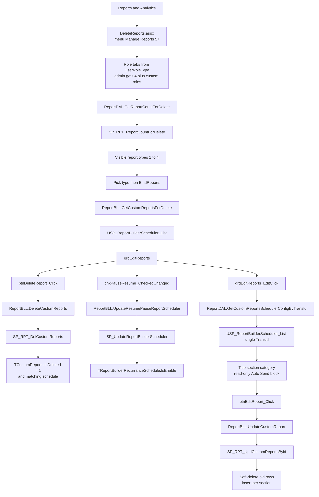
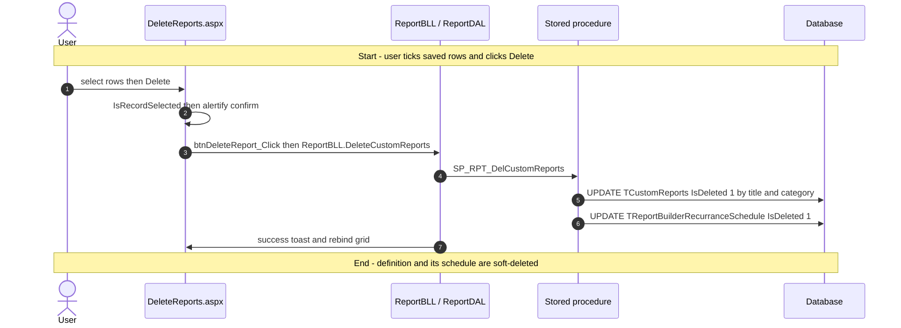
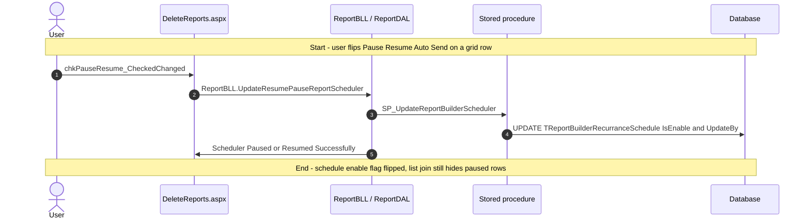
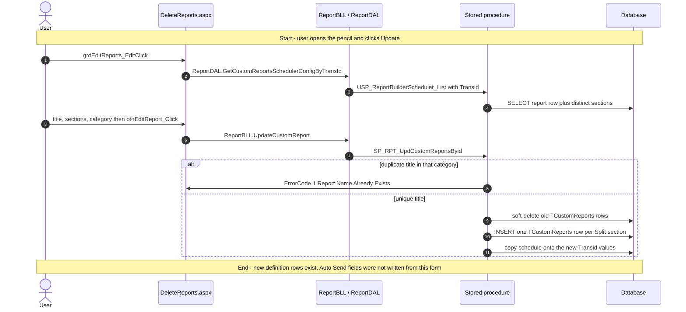
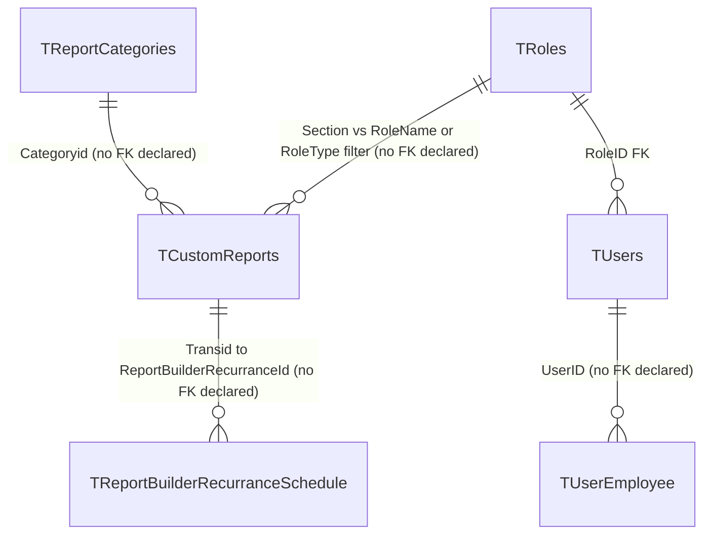

# Manage Reports

## Overview

Someone already saved a custom extract from **Report Builder** or **Report Designer** — a leave ledger, a recruitment dump, a Time & Attendance grid. An HR user (or an administrator reporting across organisations) now needs to retire it, rename it, move it to another role section or category, or pause the auto-email schedule that fires from that save. They open **Reports & Analytics → Manage Reports**. Role tabs appear first: an administrator sees Employee, Manager, Administrator, HR, plus any extra defined roles; everyone else sees only their own role type. They pick a report type (Recruitment, Employee Information, Time & Attendance, Leave — only types that already have at least one saved row), and the grid lists those definitions. From there they tick rows and delete (after a confirm), flip Pause/Resume Auto Send, or open edit to change the title, sections, and category. The Auto Send block on edit is a **read-only display** of a schedule that was created on the builder, not a place to rewrite recurrence.

Nothing on this page runs the extract. Running lives on **Static Reports** / **Traditional Reports**. Creating the definition and turning Auto Send on lives on **Report Builder** / **Report Designer**. This page owns the saved-row lifecycle after that.

**Who's involved:**

- **HR user / administrator** — lists, deletes, edits name/section/category, pauses or resumes auto-send. Row visibility is scoped by `UserRoles.GetUserRole()` (the session **role type**, not the tenant role name), `employerid`, and, for non-administrators, `CreatedBy` through `TUsers` / `TUserEmployee`.
- **Report author** — whoever inserted the `TCustomReports` row on the builder. Not this screen.
- **Global-access user** — can switch organisation via `ucGlobalAccessEmployer`; changing org redirects back to this page.
- **Scheduler process** — `ReportBuilderEmailSender` emails due schedules; Pause here sets `TReportBuilderRecurranceSchedule.IsEnable = 0` so that job skips the row.

The left-nav item **Manage Reports** is MenuId **57**. Its `tMenuDetails.NavigateURL` is `~/HRM/Reports/DeleteReports.aspx` — that is the page this guide documents. A sibling item **Report Center** opens the React host `~/HRM/Reports_React/ReportCenter.aspx`, which is a parity rewrite of the same operations (list, delete, pause/resume, edit) over `/api/reports/*`. That React file is **not** this menu item.

There is **no** `llm-wiki/domain` lifecycle page for Manage Reports. Table catalog rows live in `llm-wiki/reference/tables/hrms.md`. SourceCode `migration.md` is the canonical note that both menu entries stay live, and that the React host names itself **Report Center**, not Manage Reports.

## Workflow

This page is WebForms postback (no Node `/api/reports` call). The React bundle in `Reports_React` is the **Report Center** sibling, not this URL.

## Request journey

Three writes live on this screen. Listing is a SELECT. Delete, pause/resume, and edit are the terminal writes.

### HR user — delete a saved report

### HR user — pause or resume auto-send

### HR user — edit name, section, or category

## Entry points

`tMenuDetails` (verified in SourceCode `migration.md` against DEV): MenuId **57** `'Manage Reports'` → `~/HRM/Reports/DeleteReports.aspx`. The filename `DeleteReports.aspx` is the live Manage Reports URL; the page title is `"Manage Reports"`. Do not follow `Reports_React/ReportCenter.aspx` for this sidebar item — that URL is the sibling **Report Center** entry.

| UI page / API | Purpose |
|---|---|
| `HRMS.Web/HRMS.Web/HRM/Reports/DeleteReports.aspx` | **This feature.** WebForms manager. MenuId 57. Role tabs, type dropdown, grid delete / pause / edit. |
| `HRMS.Web/HRMS.Web/HRM/Reports/DeleteReports.aspx.cs` | Code-behind: tab set, count, list, delete, pause, edit. Compiled in `HRMS.Web.csproj`. |
| `HRMS.Shared/HRMS.BusinessLayer/Reports/ReportBLL.cs` | Thin BLL over `ReportDAL` for delete, list, count, update, pause. |
| `HRMS.Shared/HRMS.DataAccessLayer/Reports/ReportDAL.cs` | Stored-procedure calls (Enterprise Library). |
| `HRMS.Web/HRMS.Web/HRM/Reports/ucReportSchedulerRecurrences.ascx` | Read-only Auto Send block on edit when `IsEnable` is present. Not saved from this page. |
| `HRMS.Web/HRMS.Web/HRM/Reports_React/ReportCenter.aspx` | **Not this menu item.** Sibling **Report Center**. Hosts `reportcenter.js` / `main-reportcenter.tsx`. Same SPs via Node `/api/reports/*`. |

This page has **no** tab-permission logic (`ShowHideTabControls`). Role tabs come from `populateReportsList` / `UserRoles.IsUserInAdminRole()`, not from `TTabDetails`.

## Code → database call chain

This page is Enterprise Library `GetStoredProcCommand` from `ReportDAL` — no `HttpClient` to Node. Pause writes `objScheduler.EmployerId = intModifiedBy` (the logged-in **employee** id) into `SP_UpdateReportBuilderScheduler.@P_EmployerId`, which the procedure stores in `UpdateBy`.

### Shared manager (`DeleteReports.aspx`)

| Entry | BLL / DAL | Stored procedure |
|---|---|---|
| `Page_Load` `DeleteReports.aspx.cs:92` | `CommonBLL.AuditTrail` + `populateReportsList` `:477` | no SP for the tab skeleton; `UserRoles.GetUserRole()` is `LoggedInEmployee.UserRoleType` (`Common.cs:790`) |
| `populateEditSection` `:451` | `ReportBLL.GetReportCategoryName` `ReportBLL.cs:70` → `ReportDAL.GetReportCategoryName` `ReportDAL.cs:73` | `SP_GetReportCategories` |
| `populateEditSection` `:455` | `CommonBLL.GetDefinedRoles` `CommonBLL.cs:615` → `RoleManagementDAL.GetDefinedRoles` `RoleManagementDAL.cs:31` | `SP_AdminRoleM_GetRoles` |
| `showReportCategories` `:519` | `ReportDAL.GetReportCountForDelete` `ReportDAL.cs:1471` | `SP_RPT_ReportCountForDelete` |
| `BindReports` `:537` | `ReportBLL.GetCustomReportsForDelete` `ReportBLL.cs:184` → `ReportDAL.GetCustomReportsForDelete` `ReportDAL.cs:1459` | `USP_ReportBuilderScheduler_List` (list mode: `Section`, `Categoryid`, `EmployerId`, `UserRole`) |
| `btnDeleteReport_Click` `:187` | `ReportBLL.DeleteCustomReports` `ReportBLL.cs:180` → `ReportDAL.DeleteCustomReports` `ReportDAL.cs:1426` | `SP_RPT_DelCustomReports` |
| `chkPauseResume_CheckedChanged` `:132` | `ReportBLL.UpdateResumePauseReportScheduler` `ReportBLL.cs:102` → `ReportDAL.UpdateResumePauseReportScheduler` `ReportDAL.cs:1590` | `SP_UpdateReportBuilderScheduler` |
| `grdEditReports_EditClick` `:255` | `ReportDAL.GetCustomReportsSchedulerConfigByTransId` `ReportDAL.cs:1649` (DAL, not BLL) | `USP_ReportBuilderScheduler_List` (single-record mode: `EmployerId`, `TransId`, `UserRole`) |
| `btnEditReport_Click` `:216` | `ReportBLL.UpdateCustomReport` `ReportBLL.cs:196` → `ReportDAL.UpdateCustomReport` `ReportDAL.cs:1435` | `SP_RPT_UpdCustomReportsByid` |

`DBConstant.SP_GetCustomReportsForDelete` (`"SP_RPT_GetCustomReportsForDelete"`) is **not** the live list call. `BindReports` used to comment `GetCustomReportsForDeleteOld`; the live method executes `USP_ReportBuilderScheduler_List`. `ReportBLL.GetCustomReportsByTransId` / `SP_RPT_GetCustomReportsByid` is also unused by this page — edit-load goes through the scheduler-list proc so it can return the Auto Send columns.

Grid export (Excel / PDF / Word) is client-side Telerik export of the already-bound table. No extra SP.

### Sibling page only — Report Center (`Reports_React/ReportCenter.aspx`)

Not reached from **Manage Reports** in the sidebar. `useReportCenter` POSTs the same stored procedures through Node. Keep that mapping if you are on Report Center; it does not run when the URL is `/HRM/Reports/DeleteReports.aspx`.

| React caller | Node | Stored procedure |
|---|---|---|
| `getReportCountForDelete` `report-center.ts:31` | `GET /api/reports/getReportCountForDel` | `SP_RPT_ReportCountForDelete` |
| `getScheduledReportsList` `report-center.ts:13` | `GET /api/reports/getScheduledReportsList` | `USP_ReportBuilderScheduler_List` |
| `getScheduledReportConfig` `report-center.ts:42` | `GET /api/reports/getScheduledReportByTransId` | `USP_ReportBuilderScheduler_List` |
| `deleteScheduledReport` `report-center.ts:80` | `DELETE /api/reports/getDelCustomReports` | `SP_RPT_DelCustomReports` |
| `toggleReportScheduleEnable` `report-center.ts:61` | `PUT /api/reports/updateReportScheduleEnable` | `SP_UpdateReportBuilderScheduler` |
| `updateScheduledReport` `report-center.ts:103` | `PUT /api/reports/updateCustomReportsById` | `SP_RPT_UpdCustomReportsByid` |
| `getReportSections` `save-report.ts:30` | `GET /api/entity/getRoles` | `SP_AdminRoleM_GetRoles` |
| `getReportCategories` `save-report.ts:47` | `GET /api/reports/getReportCategories` | `SP_GetReportCategories` |
| `getOrganizations` `lookups.ts:68` | `GET /api/dashBoard/GetGlobalAccessEmployerList` | global-access employer list (not this feature's tables) |

## API endpoints

**Manage Reports (`DeleteReports.aspx`) has no API layer.** List, delete, pause, and edit are WebForms postbacks (`btnDeleteReport_Click`, `chkPauseResume_CheckedChanged`, `btnEditReport_Click`). No `WebMethod` / `PageMethod` on this code-behind. There is no C# Web API controller for this page.

The Node routes below belong to **Report Center** (and other React report hosts), not this menu item. They hit the same procedures the WebForms page calls.

Mounted at `app.use("/api")` → `router.use('/reports', …)` (`app.js:31`, `routeIndex.js:95`). All require `Authorize`.

| Verb | Route | Parameters | Purpose | Source |
|---|---|---|---|---|
| GET | `/api/reports/getReportCountForDel` | `Employerid` int required, `UserRole` string required (query) | Category visibility per section | `Reports.js:122`, `validateRequestData.js:360`, `reportsDAL.js:2252` |
| GET | `/api/reports/getScheduledReportsList` | `Section`, `Categoryid`, `EmployerId`, `UserRole` (query; no express-validator case) | Grid rows + schedule columns | `Reports.js:134`, `reportsController.js:363`, `reportsDAL.js:1915` |
| GET | `/api/reports/getScheduledReportByTransId` | `EmployerId`, `Transid`, `UserRole` (query) | Edit-load report + sections | `Reports.js:135`, `reportsController.js:372`, `reportsDAL.js:1937` |
| DELETE | `/api/reports/getDelCustomReports` | `Transid` required, `LastModifyby` required, `EmployerId` required (body) | Soft-delete one `Transid` | `Reports.js:130`, `validateRequestData.js:108`, `reportsDAL.js:1749` |
| PUT | `/api/reports/updateReportScheduleEnable` | `ReportBuilderRecurranceId` numeric required, `EmployerId` required, `IsEnable` (body) | Pause/resume | `Reports.js:136`, `reportsController.js:381`, `reportsDAL.js:1960` |
| PUT | `/api/reports/updateCustomReportsById` | `Reportorigin`, `ReportTitle`, `Section`, `Categoryid`, `Query`, `Employerid`, `CreatedBy`, `Transid` all required (body) | Replace definition | `Reports.js:131`, `validateRequestData.js:372`, `reportsDAL.js:2268` |
| GET | `/api/reports/getReportCategories` | none | Category dropdown | `Reports.js:142`, `reportsController.js:353` |
| GET | `/api/entity/getRoles` | `employerId` (query) | Section dropdown = defined roles | `EntityRoutes.js:8`, `EntityController.js:24` |

## Stored procedures & tables involved

No domain wiki page covers this feature. Catalog one-liners below cite `llm-wiki/reference/tables/hrms.md` where a row exists. Scheduler tables are **absent** from that catalog.

The live list/edit-load procedure is `USP_ReportBuilderScheduler_List`. `SP_RPT_GetCustomReportsForDelete.sql` still exists on disk and is named in `DBConstant.cs`, but `DeleteReports.aspx` does not execute it.

| Object | File path | Purpose | Wiki |
|---|---|---|---|
| `TCustomReports` | `HRMS-DATABASE/HRMS/TABLES/TCustomReports.sql` | Saved report definition. Soft-deleted (`IsDeleted=1`). No FK declared. | `llm-wiki/reference/tables/hrms.md` |
| `TReportCategories` | `…/TABLES/TReportCategories.sql` | Category lookup (1 Recruitment, 2 Employee Information, 3 Time & Attendance, 4 Leave). No FK declared. | same |
| `TReportBuilderRecurranceSchedule` | `…/DDL/TReportBuilderRecurranceSchedule.sql` | Auto-send recurrence keyed on `ReportBuilderRecurranceId` = report `Transid`. No FK declared. | — |
| `TRoles` | `…/TABLES/TRoles.sql` | Role master; `RoleType` filters non-admin lists. PK `RoleID`. | `hrms.md` |
| `TUsers` | `…/TABLES/TUsers.sql` | User accounts. Declared FK `RoleID` → `TRoles`. | `hrms.md` |
| `TUserEmployee` | `…/TABLES/TUserEmployee.sql` | Maps `UserID` to `EmployeeID` for the `CreatedBy` filter. No FK declared. | `hrms.md` |
| `tMenuDetails` / `TDynamicMenuHierarchy` | `…/TABLES/` + DML | Sidebar: Manage Reports 57 vs Report Center. | `hrms.md` (`TDynamicMenuHierarchy`) |
| `SP_RPT_ReportCountForDelete` | `…/STOREPROCEDURE/SP_RPT_ReportCountForDelete.sql` | `GROUP BY Section, Categoryid` of live `TCustomReports` | — |
| `USP_ReportBuilderScheduler_List` | `…/STOREPROCEDURE/USP_ReportBuilderScheduler_List.sql` | List and single-record SELECT joining report + enabled schedule + categories | — |
| `SP_RPT_DelCustomReports` | `…/STOREPROCEDURE/SP_RPT_DelCustomReports.sql` | Soft-delete matching title/category/employer reports and the schedule for that `Transid` | — |
| `SP_RPT_UpdCustomReportsByid` | `…/STOREPROCEDURE/SP_RPT_UpdCustomReportsByid.sql` | Duplicate-title check, then replace rows via `Split(Section)` and copy schedule | — |
| `SP_UpdateReportBuilderScheduler` | `…/STOREPROCEDURE/SP_UpdateReportBuilderScheduler.sql` | Pause path writes `IsEnable` + `UpdateBy` only | — |
| `SP_GetReportCategories` | `…/STOREPROCEDURE/SP_GetReportCategories.sql` | Enabled categories | — |
| `SP_AdminRoleM_GetRoles` | `…/STOREPROCEDURE/SP_AdminRoleM_GetRoles.sql` | Defined roles for section dropdown / admin extra tabs | — |
| `SP_RPT_GetCustomReportsForDelete` | `…/STOREPROCEDURE/SP_RPT_GetCustomReportsForDelete.sql` | **Not live** from this page. Predecessor of the list USP. | — |
| `SP_RPT_GetCustomReportsByid` | `…/STOREPROCEDURE/SP_RPT_GetCustomReportsByid.sql` | **Not live** from this page. Predecessor of single-record list USP. | — |

`llm-wiki/architecture/module-catalog.md` documents a **different** reporting engine (`OV_Rule_*` dashboard cards), not this manager.

## Table relationships

No domain `erDiagram` exists. Edges below are either declared FKs on `CREATE TABLE` or logical keys with **no FK declared** (same convention as other feature guides).

`TUserEmployee.EmployeeID` is the `TCustomReports.CreatedBy` used by `SP_RPT_ReportCountForDelete` (via `RoleName`) and by `USP_ReportBuilderScheduler_List` (via `RoleType`). Those two procedures do **not** resolve role the same way. `TReportBuilderRecurranceSchedule` has no declared FK to `TCustomReports`. Columns `CustomReportFromDate` / `CustomReportToDate` were added later (`HRMS-DATABASE/HRMS/DML/64176/DML - TReportBuilderRecurranceSchedule.sql`) and are selected by the list USP.

## Known gaps

- **Filename vs menu name.** Sidebar **Manage Reports** opens `DeleteReports.aspx`, not a page named ManageReports. The React file `Reports_React/ReportCenter.aspx` is the sibling **Report Center** item (`migration.md` `tMenuDetails` table). `ReportCenter.aspx.cs` still comments that Manage Reports "should be repointed" to that URL; the live nav was **not** repointed.
- **Paused schedules disappear from the list.** `USP_ReportBuilderScheduler_List` LEFT JOINs the schedule with `AND RS.IsEnable = 1`, so a paused row comes back with every schedule column NULL — same as "never scheduled". Next Run Date vanishes; the Auto Send block on edit vanishes. React patches `IsEnable` locally after toggle so the switch still works; WebForms rebinds from the SP and loses that state. `migration.md` §10.16 — no SP patch written.
- **Role filter mismatch between count and list.** `SP_RPT_ReportCountForDelete` matches `TRoles.RoleName` for non-admins. `USP_ReportBuilderScheduler_List` matches `TRoles.RoleType`. A tenant whose role **name** differs from its **type** can see a type tab with an empty grid, or the reverse.
- **Edit does not save the scheduler.** `btnEditReport_Click` writes only `TCustomReports` (via `SP_RPT_UpdCustomReportsByid`). Recurrence fields shown in `ucReportSchedulerRecurrences` / React `RecurrenceScheduler` are display-only (`DisabledDefaultTextBoxOnEdit` / `pointerEvents: 'none'`).
- **Delete fans out by title.** `SP_RPT_DelCustomReports` soft-deletes every live `TCustomReports` row with the same title + category + employer, not only the ticked `Transid`. The schedule update is keyed on that one `Transid`.
- **No llm-wiki domain page.** Scheduler tables are missing from `llm-wiki/reference/tables/hrms.md`. `module-catalog.md` "Reporting rule engine" is the dashboard `OV_Rule_*` family, not this manager.
- **SystemModel-2 reporting context** is cited by sibling feature guides but is not present in this SourceCode checkout (`docs/SystemModels/SystemModel-2/` empty here). `migration.md` is the live-URL authority used instead.
- **DEV menu query not re-run.** `tMenuDetails` URLs above come from SourceCode `migration.md` (verified against DEV in that file). Sequelize was not installed in `HRMS.Core.WebAPI.Node` on this machine, so this pass did not re-SELECT the live rows.
- **Training `MANAGE_REPORTS` routes** (`HRM/Training/Reports.aspx`, Resource Allocation `RAReports.aspx`) are unrelated LMS/RA pages that reuse the constant name.

## Reference

Confidence is **high** for the menu URL and the WebForms delete/pause/edit call chain (`DeleteReports.aspx` → `ReportBLL` / `ReportDAL` → SPs). Wiki catalog rows were reused, not rewritten. Report Center Node mappings were read from `reportsDAL.js` / `Reports.js` as the sibling rewrite of the same SPs.

### SourceCode

- `HRMS.Web/HRMS.Web/HRM/Reports/DeleteReports.aspx` (+ `.cs`)
- `HRMS.Web/HRMS.Web/HRM/Reports/ucReportSchedulerRecurrences.ascx`
- `HRMS.Shared/HRMS.DataAccessLayer/Reports/ReportDAL.cs`
- `HRMS.Shared/HRMS.BusinessLayer/Reports/ReportBLL.cs`
- `HRMS.Shared/HRMS.DataAccessLayer/RoleManagement/RoleManagementDAL.cs`
- `HRMS.Shared/HRMS.DataAccessLayer/DBConstant.cs`
- `HRMS.Shared/HRMS.Common/Common.cs` (`UserRoles.GetUserRole`)
- `HRMS.Shared/HRMS.DataContract/Common/Enums.cs` (`ActivityDescription.ManageReports = 387`)
- `HRMS.Web/HRMS.Web/HRM/Reports_React/ReportCenter.aspx` (+ `.cs`)
- `HRMS.Web/HRMS.Web/HRM/Reports_React/src/hooks/useReportCenter.ts`
- `HRMS.Web/HRMS.Web/HRM/Reports_React/src/apis/report-center.ts`
- `HRMS.Web/HRMS.Web/HRM/Reports_React/src/logic/report-center.ts`
- `HRMS.CoreAPI/HRMS.Core.WebAPI.Node/Routes/Reports.js`
- `HRMS.CoreAPI/HRMS.Core.WebAPI.Node/Controllers/reportsController.js`
- `HRMS.CoreAPI/HRMS.Core.WebAPI.Node/Core/DataAccessLayer/reportsDAL.js`
- `migration.md` (`tMenuDetails` Manage Reports → DeleteReports, Report Center → Reports_React/ReportCenter)

### TDG HRMS DB

- `llm-wiki/reference/tables/hrms.md` (`TCustomReports`, `TReportCategories`, `TRoles`, `TUsers`, `TUserEmployee`)
- `llm-wiki/architecture/module-catalog.md` (does **not** cover this manager)
- `HRMS-DATABASE/HRMS/TABLES/TCustomReports.sql`
- `HRMS-DATABASE/HRMS/TABLES/TReportCategories.sql`
- `HRMS-DATABASE/HRMS/TABLES/TRoles.sql`
- `HRMS-DATABASE/HRMS/TABLES/TUsers.sql`
- `HRMS-DATABASE/HRMS/TABLES/TUserEmployee.sql`
- `HRMS-DATABASE/HRMS/DDL/TReportBuilderRecurranceSchedule.sql`
- `HRMS-DATABASE/HRMS/DML/64176/DML - TReportBuilderRecurranceSchedule.sql`
- `HRMS-DATABASE/HRMS/STOREPROCEDURE/SP_RPT_ReportCountForDelete.sql`
- `HRMS-DATABASE/HRMS/STOREPROCEDURE/USP_ReportBuilderScheduler_List.sql`
- `HRMS-DATABASE/HRMS/STOREPROCEDURE/SP_RPT_DelCustomReports.sql`
- `HRMS-DATABASE/HRMS/STOREPROCEDURE/SP_RPT_UpdCustomReportsByid.sql`
- `HRMS-DATABASE/HRMS/STOREPROCEDURE/SP_UpdateReportBuilderScheduler.sql`
- `HRMS-DATABASE/HRMS/STOREPROCEDURE/SP_GetReportCategories.sql`
- `HRMS-DATABASE/HRMS/STOREPROCEDURE/SP_AdminRoleM_GetRoles.sql`
- `HRMS-DATABASE/HRMS/STOREPROCEDURE/SP_RPT_GetCustomReportsForDelete.sql` (not live from this page)
- `HRMS-DATABASE/HRMS/DML/Tmenudetails DML.sql` (Reports & Analytics → Manage Reports Value 57)
