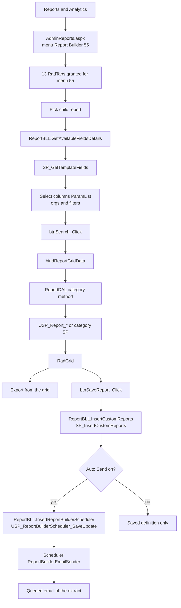
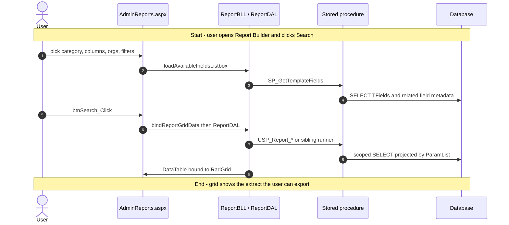
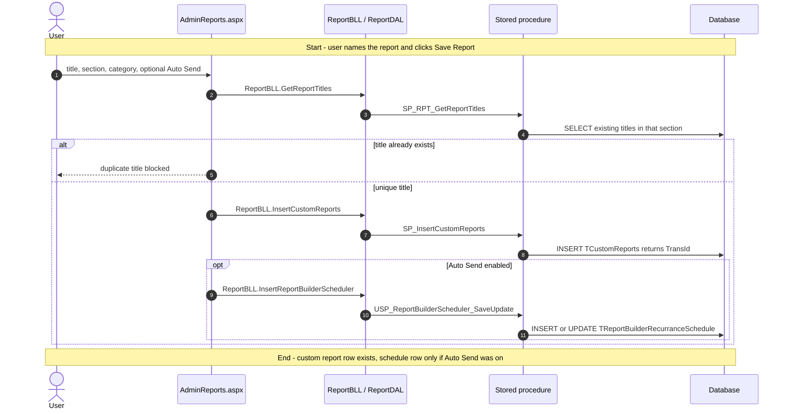
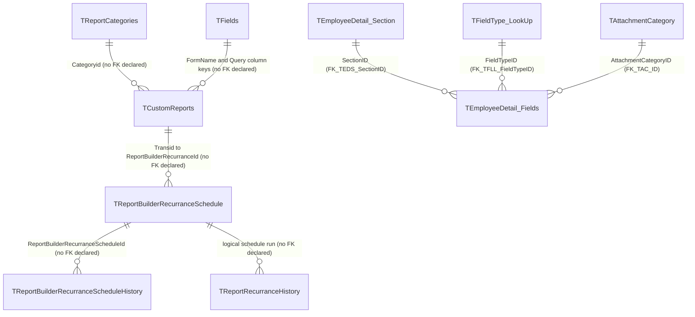

# Report Builder

## Overview

An HR user (or a global-access user reporting across organisations) needs a tabular extract that is not one of the canned Static/Traditional reports: "show me leave ledger for these business units, these columns, this date range." They open **Reports & Analytics**, pick a category tab (Leave, Employee Information, Time & Attendance, …), pick the child report, choose organisations and columns, set filters, and run it. Rows land in a grid they can sort, search, and export. If the selection is useful again, they save it as a named custom report — optionally with an auto-send schedule so the same extract is emailed on a recurrence.

Nothing on this page creates an employee or changes a leave balance. Run is a scoped SELECT. The writes are **Save Report** (`TCustomReports`) and **Enable Auto Send Report** (`TReportBuilderRecurranceSchedule`). A Windows scheduler later executes due schedules and queues email; that job is not this screen.

**Who's involved:**

- **HR user / report consumer** — picks category, columns, filters; runs, exports, saves, schedules. Row visibility is scoped by `IsGlobalAccess`, `LoginEmployeeId`, and reporting type (`EMPLOYEE` when neither user nor role reporting type is set).
- **Role/user grant admin** — decides which category tabs appear, via tab grants on the menu that hosts the page.
- **Scheduler process** — `ReportBuilderEmailSender` runs saved queries and emails recipients; the user only sees that a schedule was saved.

The left-nav item **Report Builder** is MenuId **55**. Its `tMenuDetails.NavigateURL` is `~/HRM/Reports/AdminReports.aspx` — that is the page this guide documents. A sibling item **Report Designer** (MenuId 1310 on DEV) opens the React host `~/HRM/Reports_React/ReportBuilder.aspx`, which unfortunately titles itself "Report Builder". That React file is **not** this menu item.

There is **no** `llm-wiki/domain` lifecycle page for Report Builder. Table catalog rows live in `llm-wiki/reference/tables/hrms.md`. SourceCode's `docs/SystemModels/SystemModel-2/domain/contexts/reporting.md` describes the React migration as a parallel surface; the live **Report Builder** nav link is still the WebForms page.

## Workflow

This page is WebForms postback (no Node `/api/reports` call). The React bundle in `Reports_React` is the **Report Designer** sibling, not this URL.

## Request journey

Two requests live on this screen. Running a report ends as a SELECT result in the grid. Saving a report is the write.

### HR user — run a report

### HR user — save a custom report (optional auto-send)

Pause/resume and delete of saved reports are **Report Center** / **Manage Reports**, not this page.

## Entry points

`tMenuDetails` (verified in SourceCode `migration.md` against DEV): MenuId **55** `'Report Builder'` → `~/HRM/Reports/AdminReports.aspx`. The filename `AdminReports.aspx` is the live Report Builder URL; the page title is `"Report Builder"`. Do not follow `Reports_React/ReportBuilder.aspx` for this sidebar item.

| UI page / API | Purpose |
|---|---|
| `HRMS.Web/HRMS.Web/HRM/Reports/AdminReports.aspx` | **This feature.** WebForms builder. MenuId 55, `MenuPage.ADMIN_REPORT_MENU_ID`. 13 RadTabs, `btnSearch_Click` / `btnSaveReport_Click`, `ReportBLL` / `ReportDAL`. |
| `HRMS.Web/HRMS.Web/HRM/Reports/AdminReports.aspx.cs` | Code-behind: tab grants, field load, run, save, schedule. |
| `HRMS.Shared/HRMS.BusinessLayer/Reports/ReportBLL.cs` | Thin BLL over `ReportDAL`. |
| `HRMS.Shared/HRMS.DataAccessLayer/Reports/ReportDAL.cs` | Stored-procedure calls (Enterprise Library). |
| `HRMS.Web/HRMS.Web/HRM/Reports_React/ReportBuilder.aspx` | **Not this menu item.** Sibling **Report Designer** (MenuId 1310 on DEV). Self-titles "Report Builder", which is why the filenames collide. |
| `HRM/Reports/ReportBuilder.aspx` | Older Telerik wizard on disk, **not** in `HRMS.Web.csproj`. Not in the sidebar. |

Tab grants on this page are hardcoded to menu 55 (`AdminReports.aspx.cs` `ShowHideTabControls` / `TabRegistryHelper.Bind`). React Report Designer uses a different `TTabDetails` set (tabs 571–583) and must not reuse 55's ids 88–311.

## Code → database call chain

This page is Enterprise Library `GetStoredProcCommand` from `ReportDAL` — no `HttpClient` to Node. `bindReportGridData` (`AdminReports.aspx.cs:1430`) switches on `hdnRequestPage` and either calls a `ReportDAL` method or `ReportBLL.ExecuteQuery` (view SQL).

### Shared builder (`AdminReports.aspx`)

| Entry | BLL / DAL | Stored procedure |
|---|---|---|
| `loadAvailableFieldsListbox` `AdminReports.aspx.cs:2082` | `ReportBLL.GetAvailableFieldsDetails` `ReportBLL.cs:74` → `ReportDAL.getAvailableFields` `ReportDAL.cs:87` | `SP_GetTemplateFields` (`RequestType=REPORTS`, `FieldCategory=R`) |
| Category dropdown `bindReportCategory` `AdminReports.aspx.cs:2030` | `ReportBLL.GetReportCategoryName` `ReportBLL.cs:70` | `SP_GetReportCategories` |
| Duplicate-title check `validateSaveReportTitle` `AdminReports.aspx.cs:1716` | `ReportBLL.GetReportTitles` → `ReportDAL.GetReportTitles` `ReportDAL.cs:36` | `SP_RPT_GetReportTitles` |
| `btnSaveReport_Click` `AdminReports.aspx.cs:234` → `saveReport` | `ReportBLL.InsertCustomReports` `ReportBLL.cs:65` → `ReportDAL.InsertCustomReports` `ReportDAL.cs:50` | `SP_InsertCustomReports` |
| Auto Send in `saveReport` `AdminReports.aspx.cs:1792` | `ReportBLL.InsertReportBuilderScheduler` `ReportBLL.cs:98` → `ReportDAL.InsertReportBuilderScheduler` `ReportDAL.cs:1538` | `USP_ReportBuilderScheduler_SaveUpdate` (constant `SP_InsertReportBuilderScheduler` in `DBConstant.cs:434`) |
| Tab grants `Page_Load` / `showHideTabControls` | `WebCommonTab.ShowHideTabControls(..., MenuPage.ADMIN_REPORT_MENU_ID)` `AdminReports.aspx.cs:562` | `Sp_AdminRoleM_GetTabRoleDet` / `Sp_GetTabUserDetails` |

### Leave Reports (from `btnSearch_Click` → `bindSPRelatedReports`)

| Entry | DAL method | Stored procedure |
|---|---|---|
| `ReportConstants.LEAVE` `AdminReports.aspx.cs:4032` | `ReportDAL.GetEmployeeLeave` `ReportDAL.cs:392` | `USP_Report_Leave_LeaveReport` |
| `LEAVELEDGER` `AdminReports.aspx.cs:4039` | `GetLeaveLedgerData` `ReportDAL.cs:422` | `USP_Report_Leave_LeaveLedger` |
| `LEAVESUMMARY` `AdminReports.aspx.cs:4046` | `GetLeaveSummaryData` | `USP_Report_Leave_LeaveSummary` |
| `LEAVERANGE` `AdminReports.aspx.cs:4053` | `GetLeaveRangeData` | `USP_Report_Leave_LeaveRange` |
| Pending Approvals / Encashment | `ReportDAL` in the same switch | `USP_Report_Leave_PendingApprovals` / `USP_Report_Leave_LeaveEncashmment` |

### Other categories

Same `bindReportGridData` switch: Time & Attendance, Employee Information, Recruitment, etc. call `ReportDAL` methods that execute the `USP_Report_*` / `SP_RPT_*` / claim-OT family listed under **Stored procedures**. Some tabs still use `ReportBLL.ExecuteQuery` over a view (`vw_EmployeeReports`, `vw_RoleWiseMenuReport`, …) instead of a dedicated SP.

`HRMS.Shared/HRMS.ReportBuilder/AdminReportBuilder.cs` is the Telerik **Reporting** class used by Static Reports, not this page.

### Sibling page only — Report Designer (`Reports_React/ReportBuilder.aspx`)

Not reached from **Report Builder** in the sidebar. That React host POSTs `/api/reports/*` (`reportsController.js` / `reportsDAL.js`) and hits the **same** stored procedures. Keep that mapping if you are on Report Designer; it does not run when the URL is `/HRM/Reports/AdminReports.aspx`.

## API endpoints

**Report Builder (`AdminReports.aspx`) has no API layer.** Search, field load, save, and schedule are WebForms postbacks (`btnSearch_Click`, `btnSaveReport_Click`). No `WebMethod` / `PageMethod` on this code-behind. There is no C# Web API controller for this page.

The Node routes under `/api/reports` (`HRMS.CoreAPI/.../Routes/Reports.js`) belong to **Report Designer** and Traditional Reports / Report Center, not this menu item.

## Stored procedures & tables involved

No domain wiki page covers this feature. Catalog one-liners below cite `llm-wiki/reference/tables/hrms.md` where a row exists. Scheduler tables are **absent** from that catalog.

Builder persistence and field metadata (the objects this feature owns):

| Object | File path | Purpose | Wiki |
|---|---|---|---|
| `TCustomReports` | `HRMS-DATABASE/HRMS/TABLES/TCustomReports.sql` | Saved report definition (query, filters, section, category). No FK declared. | `llm-wiki/reference/tables/hrms.md` |
| `TReportCategories` | `…/TABLES/TReportCategories.sql` | Enabled category lookup for the save dialog. No FK declared. | same |
| `TFields` | `…/TABLES/TFields.sql` | Form field registry (`FormName` / `DisplayName` / `DBColumnname`). No FK declared. | same |
| `TEmployeeDetail_Fields` | `…/TABLES/TEmployeeDetail_Fields.sql` | Centralised employee-detail fields joined by `SP_GetTemplateFields` for some forms. FKs to `TEmployeeDetail_Section`, `TFieldType_LookUp`, `TAttachmentCategory`. | same |
| `TReportBuilderRecurranceSchedule` | `…/DDL/TReportBuilderRecurranceSchedule.sql` | Recurrence + recipients keyed on `ReportBuilderRecurranceId`. No FK declared. | — |
| `TReportBuilderRecurranceScheduleHistory` | `…/DDL/64176/DDL - TReportBuilderRecurranceScheduleHistory.sql` | Snapshot of a schedule. No FK declared. | — |
| `TReportBuilderSchedulerLog` | `…/DDL/64176/DDL - TReportBuilderSchedulerLog.sql` | Scheduler run log. No FK declared. | — |
| `TReportRecurranceHistory` | `…/DDL/64176/DDL - TReportRecurranceHistory.sql` | Per-run history / email queue hook. No FK declared. | — |
| `tMenuDetails` / `TTabDetails` / `TDynamicMenuHierarchy` | `…/TABLES/` + DML | Sidebar and category-tab grants. | `hrms.md` (`TDynamicMenuHierarchy`) |
| `SP_GetTemplateFields` | `…/STOREPROCEDURE/SP_GetTemplateFields.sql` | SELECT field templates for `RequestType=REPORTS` | — |
| `SP_GetReportCategories` | `…/SP_GetReportCategories.sql` | SELECT enabled `TReportCategories` | — |
| `SP_InsertCustomReports` | `…/SP_InsertCustomReports.sql` | INSERT `TCustomReports`, return `TransId` | — |
| `SP_RPT_GetReportTitles` | `…/STOREPROCEDURE/` | Titles for duplicate check | — |
| `USP_ReportBuilderScheduler_SaveUpdate` | `…/USP_ReportBuilderScheduler_SaveUpdate.sql` | INSERT/UPDATE schedule | — |
| `SP_AdminRoleM_GetRoles` | `…/STOREPROCEDURE/` | Section dropdown = defined roles | — |
| `SP_RPT_GetEmployeeDetails` / `SP_RPT_GetAllEmployeeDetails` | same | Criteria employees / schedule recipients | — |
| `Sp_AdminRoleM_GetTabRoleDet` / `Sp_GetTabUserDetails` | same | Tab grants | — |

Category runners (read-only extracts; sources are the owning domain tables, not the builder schema). All under `HRMS-DATABASE/HRMS/STOREPROCEDURE/` unless noted:

| Object | Purpose |
|---|---|
| `USP_Report_Leave_LeaveReport` / `_LeaveSummary` / `_LeaveLedger` / `_LeaveRange` / `_PendingApprovals` / `_LeaveEncashmment` | Leave category |
| `USp_GetEmployeeReports` / `USp_GetEmployeeFullInfoReports` / `USP_Report_EmployeeInfo_*` / `SP_RPT_EmpCompetency` / `SP_RPT_vw_WorkLocationReport` | Employee Information |
| `Hrms_Sp_DailyAttendanceReport`, `USP_Report_TimeAttendance_*`, `USP_GetAttendanceForPayroll`, `sp_vw_AttendanceRegularizationSummaryReports`, `USP_ClaimOT_*`, `USP_ClaimCompOff_Report`, `USP_OT_*`, `USP_ClaimLocum_Report`, `USP_ClaimPH_Report`, `SP_GetCheckinCheckoutTimeForAllEmployee`, `Sp_GetEmpDailyAbsentRpt`, `SP_RPT_EmpCheckInCheckOut`, `Sp_GetEmpAttendanceDetails`, `SP_Report_TimeAndAttendance_LateInEarlyOutReport` | Time & Attendance |
| `USP_Report_PerfAssessment_*`, `SP_PMS_GetEmployeeAppraisalReport`, `sp_GetPMSAppraisalCycles` | Performance Assessment |
| `USP_Report_Separation_*`, `Usp_SeparationClearanceReport` | Separation |
| `USP_Report_Confirmation_ConfirmationStatus` | Confirmation |
| `USP_Report_Custom_WorkFlowGroup` | Custom Reports (workflow group) |
| `USP_Report_Admin_*`, `Sp_UserAccessRights_Rpt`, `USP_DataPrivacyAcknowledgement_Report` | Admin Reports |
| `USP_Report_ESS_HelpDesk`, `SP_AdminESS_GetVoucherTypes` | ESS |
| `USP_Report_BGV_PreEmployment` / `_PostEmployment` | BGV |
| `SP_RPT_GetAssetMappingDetails` | Asset |
| `SP_RPT_GetEmployeeCompensation` / `SP_RPT_GetCandidateCompensation` | Compensation |
| `USP_Report_Recruitment_RRSFields`, `USP_Vw_RRSCandidateFieldsReport` | Recruitment |

`llm-wiki/architecture/module-catalog.md` documents a **different** reporting engine (`OV_Rule_*` dashboard cards), not this builder.

## Table relationships

No domain `erDiagram` exists. Edges below are either declared FKs on `CREATE TABLE` or logical keys with **no FK declared** (same convention as other feature guides). Category-runner source tables (leave request, attendance, RRS, …) are omitted — they belong to those domains.

`TFields` and `TEmployeeDetail_Fields` are SELECT sources for `SP_GetTemplateFields`, not children of `TCustomReports`. `TReportBuilderSchedulerLog` has no declared FK to the schedule table.

## Known gaps

- **Filename vs menu name.** Sidebar **Report Builder** opens `AdminReports.aspx`, not `ReportBuilder.aspx`. The React file `Reports_React/ReportBuilder.aspx` is the sibling **Report Designer** item and still titles itself "Report Builder" (`migration.md`, `verify-page-titles.js`).
- **Dead file.** `HRM/Reports/ReportBuilder.aspx` (older Telerik wizard) is on disk and **not** compiled in `HRMS.Web.csproj`.
- **SystemModel-2 drift.** `domain/contexts/reporting.md` presents React as the migrated builder; the live nav URL for **Report Builder** is still WebForms. `behavior/workflows/report-generation.md` still says only Leave is migrated.
- **No llm-wiki domain page.** Scheduler tables are missing from `llm-wiki/reference/tables/hrms.md`. `module-catalog.md` "Reporting rule engine" is the dashboard `OV_Rule_*` family, not this builder.
- **Some tabs still run view SQL** via `ReportBLL.ExecuteQuery` rather than `USP_Report_*`.
- **Report Center / Manage Reports overlap.** List/edit/pause/delete of saved reports is not this page.
- **Scheduler job** `ReportBuilderEmailSender.cs` emails due schedules; it is not invoked from `AdminReports.aspx`.

## Reference

Confidence is **high** for the menu URL and the WebForms save/run call chain (`AdminReports.aspx` → `ReportBLL` / `ReportDAL` → SPs). Category-runner source tables were not re-derived line-by-line from every `USP_Report_*` body. Wiki catalog rows were reused, not rewritten.

### SourceCode

- `HRMS.Web/HRMS.Web/HRM/Reports/AdminReports.aspx` (+ `.cs`)
- `HRMS.Shared/HRMS.DataAccessLayer/Reports/ReportDAL.cs`
- `HRMS.Shared/HRMS.BusinessLayer/Reports/ReportBLL.cs`
- `HRMS.Shared/HRMS.DataAccessLayer/DBConstant.cs`
- `HRMS.Shared/HRMS.DataContract/Common/Enums.cs` (`ADMIN_REPORT_MENU_ID = 55`)
- `HRMS.Web/HRMS.Web/HRM/Reports_React/src/logic/tab-permissions.ts` (documents 55 vs Report Designer)
- `migration.md` (`tMenuDetails` 55 → AdminReports, 1310 → Reports_React/ReportBuilder)
- `docs/SystemModels/SystemModel-2/domain/contexts/reporting.md`
- `HRMS.Scheduler/HRMS.BusinessLayer.Scheduler/ReportBuilderEmailSender.cs`

### TDG HRMS DB

- `llm-wiki/reference/tables/hrms.md` (`TCustomReports`, `TReportCategories`, `TFields`, `TEmployeeDetail_Fields`)
- `llm-wiki/architecture/module-catalog.md` (does **not** cover this builder)
- `HRMS-DATABASE/HRMS/TABLES/TCustomReports.sql`
- `HRMS-DATABASE/HRMS/TABLES/TReportCategories.sql`
- `HRMS-DATABASE/HRMS/TABLES/TFields.sql`
- `HRMS-DATABASE/HRMS/TABLES/TEmployeeDetail_Fields.sql`
- `HRMS-DATABASE/HRMS/DDL/TReportBuilderRecurranceSchedule.sql`
- `HRMS-DATABASE/HRMS/STOREPROCEDURE/SP_GetTemplateFields.sql`
- `HRMS-DATABASE/HRMS/STOREPROCEDURE/SP_GetReportCategories.sql`
- `HRMS-DATABASE/HRMS/STOREPROCEDURE/SP_InsertCustomReports.sql`
- `HRMS-DATABASE/HRMS/STOREPROCEDURE/USP_ReportBuilderScheduler_SaveUpdate.sql`
- `HRMS-DATABASE/HRMS/STOREPROCEDURE/USP_Report_Leave_LeaveReport.sql` (and sibling `USP_Report_*`)
- `HRMS-DATABASE/HRMS/DML/Tmenudetails DML.sql` (Reports & Analytics → Report Builder Value 55)
- `HRMS-DATABASE/HRMS/DML/152229/TTabDetails.sql` (Report Designer tabs 571–583)
